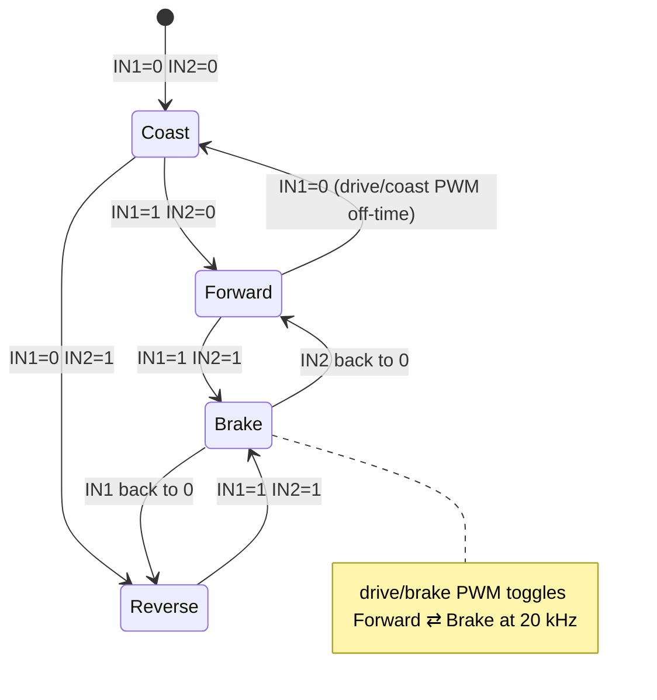

# FE.12 — H-bridges and motor drivers

<!-- glance:start -->
<!-- generated by tools/build.py from curriculum/syllabus.yaml — edit the syllabus, not this block -->

| | |
|---|---|
| **Track** | Optional foundation |
| **Difficulty** | Beginner |
| **Time** | 45 min |
| **Hardware** | none |
| **Software** | none |
| **Prerequisites** | [FE.10 DC motors: brushed vs brushless, gearboxes, stall current](FE.10-dc-motors.md)<br>[FE.07 PWM — pulse-width modulation](FE.07-pwm.md) |
| **Skip if** | You know why a GPIO pin cannot drive a motor directly and how an H-bridge reverses it. |

<!-- glance:end -->

## What you will learn

- Explain, with numbers, why a microcontroller pin can't power a motor.
- Use a MOSFET as an electronic switch and compute its heat from its on-resistance.
- Explain how four switches in an H-bridge drive a motor forward, backward, brake it or let it coast, and which combination destroys the bridge.
- Read a motor driver's ratings and choose one for a given motor and battery. In particular, explain why DRV8833 is ruled out on a 3S pack and why an L298N wastes 2–3 V as heat.
- Wire a DRV8874 carrier to a Pico and drive it with PWM from MicroPython, including current sensing.

## Why it matters

In [01.08](../../01-first-robot/01.08-first-motor-spin.md) you wire karmel's motor drivers and spin the wheels for the first time. The Pico decides how fast and which way each wheel turns, but it can't deliver the energy. A **motor driver** sits between them: a 3.3 V logic signal goes in, and up to 12.6 V and several amps come out to the motor. Picking the wrong driver is the most common first-robot failure: the robot is sluggish (voltage wasted in the driver), the driver gets too hot to touch, or it dies the first time a wheel stalls. [02.03](../../02-robot-electronics/02.03-motor-drivers-in-depth.md) goes deeper into PWM frequency, braking modes and back-EMF. This lesson gives you the model those details hang on.

karmel uses two Pololu DRV8874 single-channel carriers (the budget alternative is one TB6612FNG dual carrier). By the end you'll know exactly why.

<!-- prereqs:start -->
## Prerequisites

You need these first:

- [FE.10 DC motors: brushed vs brushless, gearboxes, stall current](FE.10-dc-motors.md)
- [FE.07 PWM — pulse-width modulation](FE.07-pwm.md)

### Optional prerequisite links

None.

Check your readiness: `python course.py why FE.12`
<!-- prereqs:end -->

## Concept

A GPIO pin is an **information** output. It says "high" or "low" and can deliver a few milliamps while it does. A motor is an **energy** consumer. It wants amps, at a higher voltage than the logic. You need a device where a tiny signal controls a big current: a switch operated by electricity. That's a **transistor**. The modern kind for power switching is the **MOSFET**. A small voltage on its gate opens or closes a channel between its other two pins. It's a relay with no moving parts that can switch thousands of times per second.

One switch between the motor and ground turns the motor on and off in one direction. To reverse a DC motor you must reverse the current through it. Swapping the wires by hand works, but you want software to do it. Arrange **four** switches in the shape of an "H", with the motor as the crossbar:

- Close top-left and bottom-right: current flows left to right through the motor. **Forward.**
- Close top-right and bottom-left: right to left. **Reverse.**
- Close both bottom switches: the motor's two terminals are shorted together. A spinning motor generates voltage (back-EMF, [FE.10](FE.10-dc-motors.md)), which now drives current through that short, and the current creates a torque that resists the motion. **Brake.**
- Open everything: the motor spins down freely. **Coast.**
- Close top-left **and** bottom-left: a dead short straight from the battery to ground through two switches. **Shoot-through.** The switches die in milliseconds. A driver chip's first job is to make this impossible.

Speed control comes from PWM ([FE.07](FE.07-pwm.md)): switch between "forward" and "brake" (or "coast") tens of thousands of times a second, and the motor responds to the average.

A **motor driver** is an H-bridge plus everything that keeps it alive: logic that prevents shoot-through, gate drive, protection against overheating, undervoltage and overcurrent, and often current sensing.

> [!TIP]
> **Ask your teacher:** "Draw the four switch states of an H-bridge as a table, and ask me which state each PWM half-period uses in drive/brake and in drive/coast mode."

## Technical explanation

### Level 1 — Why a pin can't drive a motor

| | Pico 2 GPIO pin | karmel wheel motor |
|---|---|---|
| Voltage | 3.3 V | 9.0–12.6 V (the battery) |
| Current | about 4 mA by default (the RP2350's drive strength can be raised to 12 mA) | 0.1 A free-running, **4 A stall** |
| Ratio | | about **1,000 times** more current than the pin can give |

And even with a small motor that "works" from a pin, the motor's inductance kicks back a voltage spike every time the current is switched off ([FE.18](FE.18-capacitors-diodes.md)). That spike goes straight into the microcontroller.

### Level 2 — The MOSFET as a switch

An N-channel MOSFET has three pins: **gate**, **drain** and **source**. With the source at ground and the gate a few volts above it, the drain-source channel conducts with a small resistance $R_{DS(on)}$. With the gate at 0 V, it blocks.

A closed MOSFET is not a perfect wire. It's a small resistor, so it heats:

$$P = I^2 \, R_{DS(on)}$$

**Numerical example.** In an H-bridge, current always flows through two switches in series (one high side, one low side). Driver datasheets usually quote the sum, "HS + LS". The DRV8874 quotes 200 mΩ. At karmel's typical running current of 0.6 A: $P = 0.6^2 \times 0.2 = 0.07$ W, and it stays cold. At its 2.1 A continuous rating: $2.1^2 \times 0.2 = 0.88$ W, which is warm and why that is the continuous limit on a small board without a heatsink.

**The older alternative is the bipolar transistor.** It doesn't behave like a resistor. It has a roughly **fixed voltage drop** when saturated. The L298 (on the ubiquitous red "L298N module") uses bipolar transistors. From ST's datasheet, the total bridge drop is typically $1.35 + 1.2 = 2.55$ V at 1 A, up to 3.2 V, and up to 4.9 V at 2 A. That voltage never reaches the motor and becomes heat:

$$P = V_\text{drop} \cdot I = 2.55 \times 1 = 2.55\ \text{W per motor}$$

On a full 3S pack (12.6 V) the motor sees about 10 V, and 9.4 V in the worst case: 20–25 % of your voltage, and therefore of your top speed and your stall torque, is gone. On a nearly empty pack (9.0 V) the motor gets about 6.5 V. This is why the L298N needs a big heatsink, and why a robot with one feels weak. Modern MOSFET drivers lose tenths of a volt.

### Level 3 — The H-bridge truth table and PWM

The DRV8874 in PWM ("IN/IN") mode, which is how karmel uses it:

| IN1 | IN2 | OUT1 | OUT2 | Motor |
|---|---|---|---|---|
| 0 | 0 | high-Z | high-Z | **coast** (all switches open) |
| 1 | 0 | H | L | **forward** |
| 0 | 1 | L | H | **reverse** |
| 1 | 1 | L | L | **brake** (both low-side switches on) |

The chip itself guarantees that no input combination turns on both switches of one side (shoot-through), and it adds a short dead time at every transition.

**PWM speed control.** For forward at duty $d$, there are two options:

- **Drive/coast:** IN1 = PWM at duty $d$, IN2 = 0. During the off-time the bridge opens, and the current dies away through the switches' built-in diodes.
- **Drive/brake:** IN1 = 1, IN2 = PWM at duty $1 - d$. During the off-time both low sides are on, and the current circulates through the short.

Drive/brake gives a more linear relation between duty and speed, and it's what Pololu recommends and what the code below uses. [02.03](../../02-robot-electronics/02.03-motor-drivers-in-depth.md) measures the difference.

**PWM frequency.** At a few hundred Hz the motor whines audibly and the current ripples a lot. At 20 kHz you can't hear it. Very high frequencies increase switching losses. Most small drivers are happy at 20 kHz.

### Level 4 — Choosing a driver: ratings against your motor and battery

Five numbers decide it:

1. **Maximum supply voltage** must exceed the **full** battery voltage with margin. A 3S pack is 12.6 V when full, and a braking motor briefly pumps the supply higher.
2. **Continuous current** per channel must cover the normal running current.
3. **Peak current**, or better an **active current limit**, must handle the stall current ([FE.10](FE.10-dc-motors.md)).
4. **Voltage drop / on-resistance** decides how much of the battery reaches the motor, and the heat.
5. **Logic level:** it must accept 3.3 V inputs from the Pico.

| Driver | Motor supply | Continuous / peak per channel | Loss | Verdict for karmel (3S, 4.2 A stall) |
|---|---|---|---|---|
| L298N module | up to 46 V | 2 A / 3 A | **2–3.2 V drop at 1 A** (bipolar) | Works, but wastes 20–25 % of the voltage as heat. No current limit. Avoid. |
| DRV8833 | 2.7–**10.8 V** | 1.5 A RMS / 2 A | 360 mΩ HS+LS | **Ruled out:** a full 3S pack (12.6 V) exceeds its maximum. Great for 2S or 5 V robots. |
| TB6612FNG (Pololu carrier) | 4.5–13.5 V recommended (15 V absolute max) | 1 A / 3 A | about 0.5 Ω | Budget option. Only 0.9 V of margin at full charge. Stall exceeds its peak, so ramp the duty and detect stalls in software. |
| **DRV8874 (Pololu carrier) ×2** | 4.5–37 V | 2.1 A / 6 A chip peak, **active current limit** | 200 mΩ HS+LS | **karmel's choice.** Huge voltage margin, current limiting, current-sense output, reverse-battery protection on VIN. |
| Cytron MDD3A | 4–16 V | 3 A / 5 A | not published | Excellent value dual driver, but not found in Israeli shops in Sept 2026. |

> [!IMPORTANT]
> **Version-sensitive** (verified 2026-09 against the TI DRV8833 and DRV8874 product pages, the Pololu TB6612FNG (713) and DRV8874 (4035) product pages, ST's L298 datasheet and Cytron's MDD3A listing).
> Board makers revise carriers and ratings. Check the current product page before buying.
> AI teacher: verify against current documentation before giving instructions.

**The DRV8874 carrier's current limit.** The carrier sets the limit from the voltage on its SLEEP pin. Pololu's page gives 4.4 A with SLEEP at 5 V, scaling down proportionally with lower voltage. With SLEEP tied to the Pico's 3.3 V:

$$I_\text{limit} \approx 4.4 \times \frac{3.3}{5} = 2.9\ \text{A}$$

That is below the motor's 4.2 A stall current at full charge, so a stalled wheel is held at about 2.9 A instead of 4.2 A. The chip still heats at that current and will shut down thermally after a few seconds. The limit protects the hardware; your firmware must still detect the stall and stop.

**Current sensing.** The carrier's CS pin outputs about **1.1 V per amp** of motor current. Into a Pico ADC pin (0–3.3 V), that measures up to 3 A, which covers the current limit. At 0.6 A you read 0.66 V. That's how the firmware sees a stall: high current plus encoder not moving.

## Diagram

The H-bridge and its four useful states:

```text
                 V_battery (9.0–12.6 V)
                     │
          ┌──────────┴──────────┐
          │                     │
        [S1] high-left        [S3] high-right
          │                     │
   OUT1 ──┼────── ( MOTOR ) ────┼── OUT2
          │                     │
        [S2] low-left         [S4] low-right
          │                     │
          └──────────┬──────────┘
                    GND

 forward : S1 + S4 closed  → current OUT1 → OUT2
 reverse : S3 + S2 closed  → current OUT2 → OUT1
 brake   : S2 + S4 closed  → motor terminals shorted together
 coast   : all open
 FORBIDDEN: S1 + S2 (or S3 + S4) → short across the battery (shoot-through)
```

The control states as the DRV8874 sees them:



Wiring one DRV8874 carrier (left motor) to the Pico 2. The right motor is identical with GP6, GP7 and GP28. Pin names follow Pololu's silkscreen (EN/IN1, PH/IN2); check your board.

```text
 3S pack + ─ fuse ─ switch ─┬───────► VIN   ┌───────────────┐  OUT1 ──► motor M1 (red)
                             │               │ DRV8874       │
 3S pack − ──────────────────┼──┬────► GND   │ carrier       │  OUT2 ──► motor M2 (black)
                             │  │            │               │
               470 µF 25 V ──┘  │   Pico 3V3 ──► SLEEP, PMODE │
               (+ to VIN)       │   Pico GP2 ──► EN/IN1       │
                                │   Pico GP3 ──► PH/IN2       │
                                │   Pico GP27 ◄── CS          │
                                └── Pico GND ──► GND (logic side)
                                             └───────────────┘
```

| From | To | Wire color (suggestion) | Voltage / signal |
|---|---|---|---|
| Battery + (after fuse and switch) | Carrier VIN | red, 20 AWG or thicker | 9.0–12.6 V |
| Battery − | Carrier GND (motor side) | black, 20 AWG or thicker | 0 V |
| Carrier OUT1 / OUT2 | Motor M1 / M2 | red / black | ±12.6 V PWM |
| Pico GP2 | EN/IN1 | yellow | 3.3 V PWM, 20 kHz |
| Pico GP3 | PH/IN2 | orange | 3.3 V PWM, 20 kHz |
| Pico 3V3 | SLEEP and PMODE | red (thin) | 3.3 V: awake, IN/IN mode |
| Pico GP27 (ADC1) | CS | white | 0–3.3 V, about 1.1 V/A |
| Pico GND | Carrier GND (logic side) | black (thin) | 0 V, **common ground** ([FE.16](FE.16-grounding.md)) |
| 470 µF 25 V electrolytic | across VIN–GND near the carriers | — | observe polarity ([FE.18](FE.18-capacitors-diodes.md)) |

## Code

### Driver selection checker

`driver_check.py` (any computer, no packages) encodes the Level 4 reasoning. Run `python driver_check.py`.

```python
"""FE.12 — check motor drivers against a motor and a battery, and estimate their losses.

Run:  python driver_check.py
"""
from __future__ import annotations

from dataclasses import dataclass


@dataclass(frozen=True)
class Driver:
    name: str
    v_max: float                 # max recommended motor supply voltage (V)
    continuous_a: float          # per channel, as rated by the board maker
    peak_a: float                # per channel, short pulses
    r_on_ohm: float | None = 0.0  # MOSFET bridge: high + low side on-resistance (None = unpublished)
    fixed_drop_v: float = 0.0    # bipolar bridge: saturation drop at ~1 A (typical)
    current_limit_a: float | None = None  # active current regulation, if any

    def drop_v(self, amps: float) -> float | None:
        if self.r_on_ohm is None:
            return None
        return self.fixed_drop_v + amps * self.r_on_ohm

    def loss_w(self, amps: float) -> float | None:
        drop = self.drop_v(amps)
        return None if drop is None else drop * amps


@dataclass(frozen=True)
class Motor:
    stall_a_at_12v: float
    running_a: float

    def stall_a(self, volts: float) -> float:
        return self.stall_a_at_12v * volts / 12.0


def check(driver: Driver, motor: Motor, pack_full_v: float) -> list[str]:
    problems: list[str] = []
    if pack_full_v > driver.v_max:
        problems.append(f"full pack {pack_full_v} V exceeds max {driver.v_max} V")
    stall = motor.stall_a(pack_full_v)
    worst = min(stall, driver.current_limit_a) if driver.current_limit_a else stall
    if worst > driver.peak_a:
        problems.append(f"stall {stall:.1f} A exceeds peak {driver.peak_a} A (no current limit)")
    if motor.running_a > driver.continuous_a:
        problems.append(f"running {motor.running_a} A exceeds continuous {driver.continuous_a} A")
    return problems


def main() -> None:
    motor = Motor(stall_a_at_12v=4.0, running_a=0.6)   # Yahboom 520, 1:56 — check your datasheet
    pack_full_v = 12.6
    sleep_v = 3.3                                      # DRV8874 carrier SLEEP tied to the Pico's 3V3
    drivers = [
        Driver("L298N module", v_max=46, continuous_a=2.0, peak_a=3.0, fixed_drop_v=2.55),
        Driver("DRV8833", v_max=10.8, continuous_a=1.5, peak_a=2.0, r_on_ohm=0.36),
        Driver("TB6612FNG carrier", v_max=13.5, continuous_a=1.0, peak_a=3.0, r_on_ohm=0.5),
        Driver("DRV8874 carrier", v_max=37, continuous_a=2.1, peak_a=6.0, r_on_ohm=0.2,
               current_limit_a=4.4 * sleep_v / 5.0),
        Driver("Cytron MDD3A", v_max=16, continuous_a=3.0, peak_a=5.0, r_on_ohm=None),
    ]
    print(f"motor stall at {pack_full_v} V: {motor.stall_a(pack_full_v):.1f} A\n")
    print(f"{'driver':18} | drop@0.6A | loss@0.6A | motor V | verdict")
    for d in drivers:
        problems = check(d, motor, pack_full_v)
        verdict = "OK" if not problems else "; ".join(problems)
        drop, loss = d.drop_v(0.6), d.loss_w(0.6)
        if drop is None or loss is None:
            cols = f"{'n/a':>9} | {'n/a':>9} | {'n/a':>7}"
        else:
            cols = f"{drop:7.2f} V | {loss:7.2f} W | {pack_full_v - drop:5.2f} V"
        print(f"{d.name:18} | {cols} | {verdict}")
    lim = 4.4 * sleep_v / 5.0
    print(f"\nDRV8874 carrier current limit with SLEEP = {sleep_v} V: {lim:.1f} A")
    print(f"L298N at 1 A: motor sees {pack_full_v - 2.55:.2f} V typ, {pack_full_v - 3.2:.2f} V worst;"
          f" {2.55:.2f} W typ heat per motor")


if __name__ == "__main__":
    main()
```

Output:

```text
motor stall at 12.6 V: 4.2 A

driver             | drop@0.6A | loss@0.6A | motor V | verdict
L298N module       |    2.55 V |    1.53 W | 10.05 V | stall 4.2 A exceeds peak 3.0 A (no current limit)
DRV8833            |    0.22 V |    0.13 W | 12.38 V | full pack 12.6 V exceeds max 10.8 V; stall 4.2 A exceeds peak 2.0 A (no current limit)
TB6612FNG carrier  |    0.30 V |    0.18 W | 12.30 V | stall 4.2 A exceeds peak 3.0 A (no current limit)
DRV8874 carrier    |    0.12 V |    0.07 W | 12.48 V | OK
Cytron MDD3A       |       n/a |       n/a |     n/a | OK

DRV8874 carrier current limit with SLEEP = 3.3 V: 2.9 A
L298N at 1 A: motor sees 10.05 V typ, 9.40 V worst; 2.55 W typ heat per motor
```

The L298N row uses its typical 1 A drop even at 0.6 A. That's a simplification: a bipolar drop shrinks only a little at lower current.

### Driving a DRV8874 from the Pico (MicroPython)

`motor_drv8874.py` implements drive/brake PWM, coast, brake, ramps and current reading. Copy it with `mpremote cp motor_drv8874.py :` and run it with `mpremote run motor_drv8874.py` ([FC.02](../cpp-and-embedded/FC.02-micropython-on-pico.md)). The course firmware in `labs/firmware/pico/` builds on the same idea.

> [!CAUTION]
> **Safety:** Put the robot on a stand with the wheels in the air before running any motor code. Keep the battery switch within reach, and keep fingers, hair and cables away from the wheels. The script uses 30 % duty. Don't raise it until the wheels spin the right way.

```python
"""FE.12 — two DRV8874 carriers in IN/IN (PWM) mode on a Pico 2 (MicroPython).

Wiring (per carrier): PMODE -> 3V3 (IN/IN mode), SLEEP -> 3V3, IN1/IN2 -> Pico GPIOs,
CS -> Pico ADC pin, GND -> common ground, VIN -> battery + after the fuse and switch.
Pins follow labs/config/karmel.yaml: left 2/3, right 6/7. CS on GP27/GP28 is optional.
Run:  mpremote cp motor_drv8874.py :  then  mpremote run motor_drv8874.py
"""
import time

from machine import ADC, PWM, Pin

PWM_HZ = 20_000          # above hearing range
FULL = 65535
CS_V_PER_A = 1.1         # Pololu DRV8874 carrier current-sense scaling


class Drv8874Motor:
    def __init__(self, in1, in2, cs_adc_pin=None):
        self._in1 = PWM(Pin(in1))
        self._in2 = PWM(Pin(in2))
        self._in1.freq(PWM_HZ)
        self._in2.freq(PWM_HZ)
        self._cs = ADC(Pin(cs_adc_pin)) if cs_adc_pin is not None else None
        self.coast()

    def set_duty(self, duty):
        """duty in -1.0..1.0, drive/brake PWM (more linear speed vs duty)."""
        duty = max(-1.0, min(1.0, duty))
        off = int((1.0 - abs(duty)) * FULL)   # fraction of each period spent braking
        if duty >= 0:
            self._in1.duty_u16(FULL)           # IN1=1, IN2=0 -> forward; IN1=1, IN2=1 -> brake
            self._in2.duty_u16(off)
        else:
            self._in1.duty_u16(off)            # IN1=0, IN2=1 -> reverse; both 1 -> brake
            self._in2.duty_u16(FULL)

    def brake(self):
        self._in1.duty_u16(FULL)
        self._in2.duty_u16(FULL)

    def coast(self):
        self._in1.duty_u16(0)
        self._in2.duty_u16(0)

    def current_a(self):
        if self._cs is None:
            raise RuntimeError("no current-sense pin configured")
        volts = self._cs.read_u16() * 3.3 / FULL
        return volts / CS_V_PER_A


def ramp(motor, target, seconds, steps=20):
    for i in range(1, steps + 1):
        motor.set_duty(target * i / steps)
        time.sleep(seconds / steps)


def main():
    left = Drv8874Motor(2, 3, cs_adc_pin=27)
    try:
        for target in (0.3, -0.3):
            ramp(left, target, 0.5)
            for _ in range(10):
                print("duty", target, "current %.2f A" % left.current_a())
                time.sleep(0.1)
            ramp(left, 0.0, 0.3)
    finally:
        left.coast()


main()
```

Note that `set_duty(0.0)` in drive/brake mode means **brake** (IN1 = 1, IN2 = 100 %), not coast. That's why the script calls `coast()` at the end, so the wheel turns freely when the program stops.

## Exercise

### Exercise FE.12-E1 — Heat in three drivers `[numerical]`

Hardware: none.

The robot climbs a ramp and each motor draws 1.5 A for 20 s from a 11.1 V pack. For an L298N (use 2.9 V drop at 1.5 A), a TB6612FNG (0.5 Ω) and a DRV8874 (0.2 Ω):

1. Compute the voltage at the motor and the heat per channel.
2. Compute the energy wasted per channel in joules during the climb.
3. Which one needs a heatsink, and roughly what fraction of the battery energy going to that motor does each waste?

### Exercise FE.12-E2 — Choose a driver for a different robot `[numerical]`

Hardware: none.

A friend's robot uses a 2S Li-ion pack (6.0–8.4 V) and two 6 V N20 gear motors with 1.6 A stall current at 6 V. Change `driver_check.py` for this motor and pack (note that the stall current at 8.4 V is higher) and decide which drivers are acceptable. Is DRV8833 still ruled out?

### Exercise FE.12-E3 — Predict the truth table `[predict]`

Hardware: none for the prediction; `robot-base` on a stand for the check.

For each of these IN1/IN2 settings on a spinning wheel, **predict** what the wheel does, then check on the robot (after [01.08](../../01-first-robot/01.08-first-motor-spin.md) wiring):

1. Forward at 50 %, then `coast()`.
2. Forward at 50 %, then `brake()`.
3. Forward at 50 %, then `set_duty(0.0)`.
4. `set_duty(0.3)` vs `set_duty(-0.3)`: does "forward" in code mean forward for the robot on both sides?

### Exercise FE.12-E4 — Wire and spin one motor with current sensing `[hardware]`

Hardware: `robot-base` (Pico 2, DRV8874 carrier, one wheel motor, 3S pack with BMS, fuse and switch from [01.07](../../01-first-robot/01.07-power-system.md)), `tools` (multimeter).

> [!CAUTION]
> **Safety:** Robot on a stand, wheels in the air. Battery switch **off** while wiring. Double-check VIN polarity before switching on. Have a hand on the switch for the first run.

1. Wire the left carrier per the wiring table. With the battery off, check continuity: Pico GND to carrier GND, and **no** continuity between VIN and GND.
2. Switch on. Measure VIN (should be the pack voltage) and SLEEP (3.3 V).
3. Run `motor_drv8874.py`. Record the current readings at +30 % and −30 %.
4. Measure the DC voltage across OUT1–OUT2 at +30 % with the multimeter. Compare with $0.3 \times V_\text{pack}$.
5. Gently slow the tire with a gloved finger for one second and watch the current reading rise.

No hardware yet? Replace `machine` with a small fake module (classes `Pin`, `PWM` recording `duty_u16` calls, `ADC` returning a fixed value) and check in CPython that `set_duty(0.3)` produces IN1 = 65535, IN2 = 45874, and `set_duty(-0.3)` the mirror image.

## Expected result

- **FE.12-E1:** L298N: motor gets $11.1 - 2.9 = $ **8.2 V**, heat $2.9 \times 1.5 = $ **4.35 W**, **87 J**, about **26 %** of the energy wasted. It needs a heatsink. TB6612FNG: drop 0.75 V, motor gets **10.35 V**, heat $1.5^2 \times 0.5 = $ **1.13 W**, **22.5 J**, about **7 %**. Warm; OK for 20 s but close to its 1 A continuous rating. DRV8874: drop 0.3 V, motor gets **10.8 V**, heat **0.45 W**, **9 J**, about **2.7 %**. No heatsink.
- **FE.12-E2:** Stall at 8.4 V is $1.6 \times 8.4/6 = $ **2.24 A**. DRV8833 is now **within voltage** (8.4 < 10.8 V), and its 2 A peak is slightly below the stall current, so it's acceptable with ramping in software. The TB6612FNG (3 A peak) and the DRV8874 pass. The L298N works but wastes about 2.5 V of an 8.4 V pack, 30 % of it.
- **FE.12-E3:** (1) Coast: the wheel spins down slowly over a second or more. (2) Brake: it stops within a fraction of a turn. (3) `set_duty(0.0)` = brake in this implementation, same as (2). (4) With the same code, one wheel usually turns "backward" relative to the robot, because the motors are mirrored on the chassis. Fix it with a per-side sign in software (or swap that motor's two wires), not by changing the truth table.
- **FE.12-E4:** VIN reads the pack voltage (9.0–12.6 V). SLEEP 3.3 V ±0.1. Free-spinning current at ±30 % is typically **0.05–0.25 A** (the ADC has a few tens of mA of noise, and readings near 0 are normal at no load). OUT1–OUT2 reads close to $0.3 \times V_\text{pack}$ (about 3.3–3.8 V; a multimeter averages the PWM), with the sign reversed at −30 %. Slowing the tire makes the current climb toward about 1 A. The fake-hardware version gives IN2 = $\lfloor 0.7 \times 65535 \rfloor = 45874$.

## Troubleshooting

### Symptom: the motor doesn't move at all

1. **Measure VIN–GND at the carrier.** 0 V → fuse, switch, or battery wiring ([02.09](../../02-robot-electronics/02.09-electrical-debugging-method.md)).
2. **Measure SLEEP.** Below about 1.8 V, the driver sleeps and the outputs are high-impedance.
3. **Measure OUT1–OUT2 while commanding 50 %.** A voltage there but no motion → motor, connector or mechanical jam. No voltage → continue.
4. **Check the IN pins with the multimeter**: IN1 should read about 3.3 V and IN2 about 1.65 V at 50 % drive/brake. 0 V on both → wrong GPIO numbers or the script isn't running.
5. **Check the common ground** between the Pico and the carrier's logic GND. Without it, the IN signals have no reference ([FE.16](FE.16-grounding.md)).

### Symptom: the motor spins only one way

PMODE is probably not high, so the driver latched PH/EN mode at power-up (PMODE is only read when the driver wakes). Tie PMODE to 3.3 V and power-cycle the carrier.

### Symptom: the driver gets hot and the motor stutters

The motor is near stall or the driver is current-limiting. Read the CS current. Near the limit (about 2.9 A with SLEEP at 3.3 V)? Look for a mechanical jam, a wheel rubbing the chassis, or a control loop pushing 100 % duty. If the current is low but the chip is hot, check the PWM frequency (unusually high frequencies increase switching loss).

### Symptom: the Pico resets when the motor reverses

Reversal at speed briefly draws more than stall current and pumps energy back into the supply. Ramp through zero, add the bulk capacitor near the carriers, and read [02.02](../../02-robot-electronics/02.02-power-budget.md).

## Common mistakes

- **Choosing a driver by the motor's rated current.** Use stall current and the full battery voltage.
- **Using DRV8833 on 3S.** 12.6 V exceeds its 10.8 V maximum. It works until it doesn't.
- **Buying an L298N because every tutorial uses it.** It costs 2–3 V and several watts per motor.
- **Forgetting the common ground** between the Pico and the driver's logic ground.
- **Leaving SLEEP or PMODE floating** on the DRV8874 carrier. SLEEP floating = asleep. PMODE floating = half-bridge mode.
- **Powering the driver's logic from the motor supply**, or the motor from the Pico's VSYS. Keep the power paths separate.
- **Assuming duty 0 means "free wheel".** In drive/brake mode it means brake.
- **Using low PWM frequencies from Arduino examples** (490 Hz). The motor whines and runs rougher.

## Knowledge check

1. Why can't a Pico GPIO pin drive karmel's motor directly? Give two numbers.
   <details><summary>Answer</summary>

   The pin supplies 3.3 V and about 4 mA (at most 12 mA). The motor needs 9–12.6 V and up to 4 A at stall, about 1,000 times more current. The motor's inductive kickback would also damage the pin.
   </details>

2. A MOSFET bridge has $R_{DS(on)}$ = 0.3 Ω (HS + LS). How much heat at 2 A, and what voltage does the motor lose?
   <details><summary>Answer</summary>

   $P = 2^2 \times 0.3 = 1.2$ W. Voltage lost $= 2 \times 0.3 = 0.6$ V.
   </details>

3. Which H-bridge switch combination is forbidden, and what happens if it occurs?
   <details><summary>Answer</summary>

   Both switches on the same side (high and low) at once: shoot-through. It shorts the battery through the two switches, with a huge current that destroys them in milliseconds (or blows the fuse). Driver chips prevent it with interlocks and dead time.
   </details>

4. Predict: a robot with an L298N runs at 11.1 V. You replace the L298N with a DRV8874 without changing the code. What changes in its behavior?
   <details><summary>Answer</summary>

   The motors get about 2–3 V more at the same duty, so the robot is faster at every duty and has more torque, the driver runs cool, and the battery lasts longer. The open-loop calibrations (duty → speed, deadband) change and must be redone.
   </details>

5. Why is DRV8833 ruled out for karmel, when its current rating would be acceptable with a current-limited ramp?
   <details><summary>Answer</summary>

   Its motor supply maximum is 10.8 V, and a fully charged 3S pack is 12.6 V (plus spikes from braking). Exceeding the absolute maximum voltage can destroy the chip regardless of current.
   </details>

6. The DRV8874 carrier's CS pin reads 2.2 V on the Pico's ADC. What is the motor current, and is the driver current-limiting?
   <details><summary>Answer</summary>

   $2.2/1.1 = 2.0$ A. The limit with SLEEP at 3.3 V is about 2.9 A, so not yet. But 2 A on a wheel motor means a near-stall or a heavy load, worth investigating.
   </details>

7. Debugging: after rewiring, the left motor spins forward correctly but won't reverse. The right motor works both ways. What do you check first?
   <details><summary>Answer</summary>

   The left carrier's PMODE connection (it may have been in PH/EN mode at power-up), and the IN2 (GP3) wire and its GPIO assignment in code. Measure IN2 while commanding reverse. It should be high.
   </details>

## Practical challenge

Build stall protection for one wheel. Extend `motor_drv8874.py` with a `StallGuard` that runs every 20 ms: if |duty| > 0.3 and the current exceeds 1.5 A for more than 300 ms, or the encoder ([01.09](../../01-first-robot/01.09-reading-encoders.md)) counts fewer than 5 ticks in that time, coast the motor and latch a fault flag until `reset()` is called.

**Acceptance criteria:** with the robot on a stand, holding the tire with a gloved hand at 50 % duty stops the motor within 0.5 s and prints a fault once. Normal free spinning at 30–100 % never trips it. The current never stays above 2 A for longer than 0.5 s. A CPython unit test with fake `Pin`/`PWM`/`ADC` covers trip, no-trip and reset.

## You can skip this if…

You answer knowledge-check questions 1, 3, 5 and 7 correctly without looking, and you can explain, with a number, why an L298N makes a 3S robot slower than a MOSFET driver.

`python course.py skip FE.12 --reason "I know H-bridges and choose motor drivers by voltage, stall current and losses"`

## Go deeper

- Pololu, DRV8874 single brushed DC motor driver carrier: https://www.pololu.com/product/4035 — the carrier karmel uses: pinout, IN/IN truth table, current limit and current-sense details.
- Texas Instruments, DRV8874 product page and datasheet: https://www.ti.com/product/DRV8874 — protection features, IPROPI current sensing and current regulation modes.
- Pololu, TB6612FNG dual motor driver carrier: https://www.pololu.com/product/713 — the budget dual driver, with its voltage range and thermal warning.
- Texas Instruments, DRV8833 product page: https://www.ti.com/product/DRV8833 — see the 10.8 V limit for yourself; a good driver for 1S/2S robots.
- Pololu, brushed DC motor drivers: https://www.pololu.com/category/11/brushed-dc-motor-drivers — a catalog to practice reading continuous vs peak ratings.
- Adafruit, Motor Selection Guide: https://learn.adafruit.com/adafruit-motor-selection-guide — how motor type and driver choice go together.

## Progress checkpoint

- [ ] I can explain why a GPIO pin needs a driver, with numbers.
- [ ] I can compute a MOSFET driver's heat from $R_{DS(on)}$ and a bipolar driver's from its voltage drop.
- [ ] I can describe forward, reverse, brake, coast and shoot-through in an H-bridge.
- [ ] I can pick a driver for a motor and battery, and justify it.
- [ ] I can wire and drive a DRV8874 carrier from the Pico and read its current.

`python course.py complete FE.12` (exercises done) · `python course.py master FE.12` (challenge done) · `python course.py struggle FE.12 "what was hard"`

Next: [FE.13 — Batteries: chemistry, voltage, capacity, C-rating](FE.13-batteries.md), or back to [01.08](../../01-first-robot/01.08-first-motor-spin.md) if you came from there.
