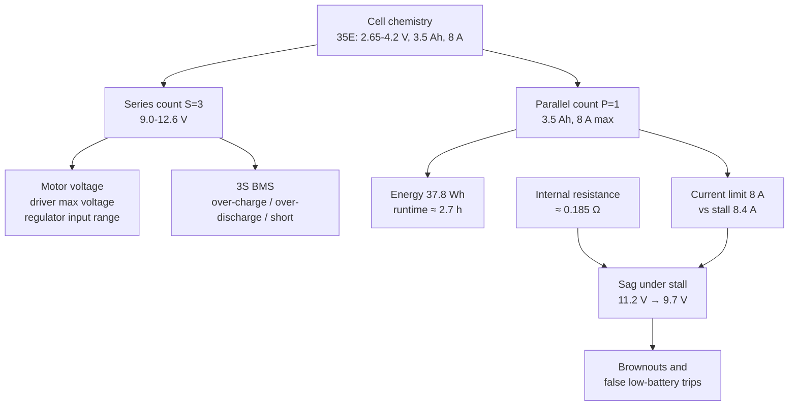

# FE.13 — Batteries: chemistry, voltage, capacity, C-rating

<!-- glance:start -->
<!-- generated by tools/build.py from curriculum/syllabus.yaml — edit the syllabus, not this block -->

| | |
|---|---|
| **Track** | Optional foundation |
| **Difficulty** | Beginner |
| **Time** | 50 min |
| **Hardware** | none |
| **Software** | none |
| **Prerequisites** | [FE.01 Voltage, current, resistance and power](FE.01-voltage-current-resistance-power.md) |
| **Skip if** | You can size a battery pack for a robot. |

<!-- glance:end -->

## What you will learn

- Compare battery chemistries (Li-ion, LiPo, LiFePO4, NiMH) by voltage, energy and safety, and say why karmel uses 18650 Li-ion cells.
- Compute a pack's voltage range, capacity and energy from its cells and its S/P configuration (3S1P, 3S2P).
- Use C-rating to check whether a pack can deliver the current your robot needs, and predict voltage sag from internal resistance.
- Estimate runtime from a load budget, and state of charge from a resting voltage.
- Explain what a BMS does and what it doesn't do.

## Why it matters

The battery sets the voltage every other part is designed around (motors, drivers, regulators), the current the robot can draw when motors stall, and how long you can work before recharging. karmel runs on a **3S pack of Samsung 35E 18650 cells with a 3S protection board (BMS)**: 9.0–12.6 V, 3.5 Ah. [01.07](../../01-first-robot/01.07-power-system.md) builds that power system, [01.14](../../01-first-robot/01.14-battery-monitoring.md) measures its voltage and shuts down safely, and [02.02](../../02-robot-electronics/02.02-power-budget.md) turns the ideas here into a full power budget. When the arm and LiDAR arrive in later stages, you'll size a bigger pack (3S2P, or the 3S 5000 mAh LiPo option) using this lesson's calculator.

Batteries are also the one component in the course that can start a fire. This lesson covers the numbers. [FE.14](FE.14-lithium-battery-safety.md) covers safe charging, storage and handling, and it is not optional.

<!-- prereqs:start -->
## Prerequisites

You need these first:

- [FE.01 Voltage, current, resistance and power](FE.01-voltage-current-resistance-power.md)

### Optional prerequisite links

None.

Check your readiness: `python course.py why FE.13`
<!-- prereqs:end -->

## Concept

A battery cell is a chemical energy store with a fixed "pressure". The **chemistry** sets the voltage of one cell: about 3.6–3.7 V for lithium-ion, 3.2 V for LiFePO4, 1.2 V for NiMH. You can't change it. To get a higher voltage you put cells **in series** (the voltages add). To get more capacity you put cells **in parallel** (the capacities add).

Three numbers describe a pack:

- **Voltage** (V), and in particular its range from full to empty. A Li-ion cell is not a constant 3.7 V source. It starts at 4.2 V and ends around 3.0 V.
- **Capacity** (Ah or mAh): how much charge it holds. 3.5 Ah means roughly "3.5 A for one hour" or "0.35 A for ten hours".
- **Energy** (Wh) = voltage × capacity. This is the one to compare packs of different voltages with, and what airlines and runtime calculations care about.

And one number that decides whether the pack can actually run your robot: **how much current it can deliver**, written as a **C-rating**. "1C" is the current that would empty the pack in one hour, numerically equal to the capacity. A 3.5 Ah cell rated for 8 A continuous can deliver $8/3.5 = 2.3$C.

Every real cell also has **internal resistance**, a small resistor hidden inside. When current flows, some voltage is lost across it. The battery voltage **sags** under load and recovers when the load stops. A robot whose battery reads 11.2 V at rest may see 9.7 V at the instant both motors stall. That dip, not the average, is what resets computers.

A **BMS** (battery management system, often just a "protection board" in small packs) is the pack's circuit breaker. It disconnects the pack if a cell is charged too high, discharged too low, or if the current is dangerously high or shorted. It is a last line of defense, not a charger and not a fuel gauge.

For a software engineer: capacity is like a quota, C-rating is like a rate limit, internal resistance is latency under load, and the BMS is a circuit breaker that trips to protect the backend.

> [!TIP]
> **Ask your teacher:** "Give me three robot load profiles and ask me to choose between 3S1P, 3S2P and a 3S LiPo, justifying the choice with Wh, C-rate and voltage sag."

## Technical explanation

### Level 1 — Chemistries a robot builder meets

| Chemistry | Nominal / full / empty per cell | Energy density | Current capability | Safety and handling | Typical use |
|---|---|---|---|---|---|
| **Li-ion cylindrical** (18650, 21700; NMC/NCA) | 3.6–3.7 / 4.2 / 2.5–3.0 V | high (≈ 250 Wh/kg) | 2–3C for energy cells (35E), 10C+ for power cells | steel can, mechanically robust; thermal runaway if abused | **karmel**, e-bikes, laptops, power tools |
| **LiPo** (Li-ion polymer pouch) | 3.7 / 4.2 / 3.0–3.3 V | high | very high (labels say 30–70C) | soft pouch: punctures and swells easily; needs balance charging | drones, RC, the 3S 5000 mAh big-robot option |
| **LiFePO4** (LFP) | 3.2 / 3.65 / 2.5 V | medium (≈ 90–160 Wh/kg) | good | much more resistant to thermal runaway; long cycle life | larger robots, solar storage, "12 V" 4S packs |
| **NiMH** | 1.2 / ≈ 1.4 / 1.0 V | low | moderate | safe-ish; no fire risk of lithium | AA packs, toys |
| Lead-acid (SLA) | 2.0 / 2.1+ / 1.75 V | very low | high surge | heavy, spills acid if damaged | wheelchairs, big stationary robots |
| Alkaline (disposable) | 1.5 V | — | poor (high resistance) | — | remote controls. **Not for motors.** |

**Why karmel uses 18650 Li-ion:** it is energy-dense, locally available, and 3S matches 12 V motors. The cylindrical steel can survives the bumps of a mobile robot far better than a LiPo pouch. The trade-off is current: an energy cell like the 35E is rated about 8 A continuous, which is enough for two 4 A stall currents but not much more. A LiPo easily delivers more current, but it's more fragile.

**"11.1 V" vs "10.8 V".** Packs labeled 11.1 V assume 3.7 V per cell, the convention LiPo datasheets use. Samsung rates the 35E at 3.6 V nominal, so the same 3S pack is "10.8 V". Nothing changed but the label. The range that matters is **9.0–12.6 V** (3.0–4.2 V per cell). **This course uses 10.8 V everywhere**, because karmel's pack is 3S Samsung INR18650-35E: `labs/config/karmel.yaml` sets `battery.nominal_v: 10.8`, and every worked power, runtime and motor-constant example in the course is computed from that number. If you see 11.1 V quoted elsewhere for the same pack, it is the LiPo label, not a different battery.

### Level 2 — Series, parallel and energy

For a pack of $S$ cells in series and $P$ strings in parallel:

$$V_\text{pack} = S \cdot V_\text{cell} \qquad C_\text{pack} = P \cdot C_\text{cell} \qquad E = V_\text{nominal} \cdot C_\text{pack}$$

**Numerical example (karmel, 3S1P Samsung 35E):**

- Voltage: $3 \times 3.6 = 10.8$ V nominal, $3 \times 4.2 = 12.6$ V full, $3 \times 3.0 = 9.0$ V empty.
- Capacity: 3.5 Ah. Energy: $10.8 \times 3.5 = 37.8$ Wh.
- 3S2P (six cells): 7.0 Ah and 75.6 Wh, same voltage.

**Rules for combining cells:**

- **Only identical cells, bought together, at the same state of charge.** In series, the weakest cell hits empty first and gets over-discharged while the others still have charge. In parallel, cells at different voltages dump current into each other the moment you connect them. Two 35E cells 0.4 V apart, with about 0.09 Ω between them, push $0.4/0.09 \approx 4.4$ A through each other.
- **Never mix old and new, or different models.**
- **Don't solder to cells.** The heat damages them. Use spot-welded packs or a proper cell holder ([FE.17](FE.17-soldering.md)).

### Level 3 — C-rating, internal resistance and sag

$$I = C_\text{rate} \times C_\text{pack} \qquad V_\text{terminal} = V_\text{rest} - I \cdot R_\text{pack}$$

**C-rating example.** The 35E is rated 8 A continuous: $8/3.5 = 2.3$C. In a 3S1P pack, the whole robot is limited to 8 A continuous, whatever the BMS says (a "40 A BMS" limits nothing below 40 A; the cells are the limit). Both wheel motors stalling at full charge draw 8.4 A, right at the edge for a few seconds. Add a 12 V arm later (6.6 A in a heavy lift, [FE.11](FE.11-servos-and-steppers.md)) and 3S1P is no longer enough. 3S2P doubles it to 16 A.

**LiPo labels.** A "5000 mAh 30C" LiPo claims $5 \times 30 = 150$ A. Hobby C-ratings are marketing numbers measured generously. Treat them as "delivers much more current than a robot needs", not as a specification.

**Internal resistance.** A 35E has a DC internal resistance of a few tens of milliohms (measure it: rest voltage minus loaded voltage, divided by the current). A cheap spring holder, the BMS MOSFETs, wires and connectors often add as much again. For karmel, assume $3 \times 0.045 + 0.05 \approx 0.185$ Ω.

**Sag example.** Both motors stall (8.4 A):

- Full pack, 12.60 V at rest: $12.60 - 8.4 \times 0.185 = 11.05$ V.
- 20 % left, 11.22 V at rest: $11.22 - 8.4 \times 0.185 = 9.67$ V.

Two lessons in those numbers. First, a low-battery shutdown that reads the voltage **during** a stall will trip at 9.67 V even though the pack still holds 20 % (karmel's config cuts off at 9.9 V). Filter the voltage, or only trust readings taken at low current ([01.14](../../01-first-robot/01.14-battery-monitoring.md)). Second, the pack itself dissipates $8.4^2 \times 0.185 = 13$ W during the stall. High current heats cells, and heat ages them.

### Level 4 — State of charge, runtime and the BMS

**State of charge from voltage.** A **rested** Li-ion cell's voltage maps roughly to its charge. The curve is flat in the middle, so voltage is a coarse gauge:

| Resting V per cell | 4.20 | 4.06 | 3.98 | 3.87 | 3.82 | 3.77 | 3.74 | 3.68 | 3.45 | 3.00 |
|---|---|---|---|---|---|---|---|---|---|---|
| Approx. charge | 100 % | 90 % | 80 % | 60 % | 50 % | 30 % | 20 % | 10 % | 5 % | 0 % |

The table is approximate: it differs between cell types, with temperature and with age, and it only holds after about 30 minutes without load. A coulomb counter (integrating the current from an INA219/INA226) is more accurate, and [01.14](../../01-first-robot/01.14-battery-monitoring.md) shows both.

**Runtime.** Add up the power at the battery, including regulator losses ([FE.15](FE.15-voltage-regulators.md)):

$$t = \frac{E \cdot f_\text{usable}}{P_\text{total}}$$

where $f_\text{usable}$ (about 0.85) accounts for not draining to 0 %, and for capacity lost to cold, age and high current.

**Numerical example (karmel, Stage 1):**

| Load | Power at the battery |
|---|---|
| Pi 5 running ROS 2, about 1.2 A at 5 V, through a 90 % buck | $5 \times 1.2 / 0.9 = 6.67$ W |
| Pico, encoders, sensors, 0.15 A at 5 V | 0.83 W |
| Two motors at about 0.4 A each while driving, driving half the time | $2 \times 0.4 \times 10.8 \times 0.5 = 4.32$ W |
| **Total** | **11.8 W** |

Runtime $= 37.8 \times 0.85 / 11.8 = 2.7$ hours. The Pi, not the motors, is the biggest consumer. That surprises most people, and it's why a stationary robot running SLAM still drains its pack. [FP.05](../physics/FP.05-energy-power-efficiency.md) derives the motor part from mechanics.

**What the BMS does:**

| Protection | Typical threshold (check your board) | What happens |
|---|---|---|
| Over-charge per cell | ≈ 4.25–4.30 V | stops charging |
| Over-discharge per cell | ≈ 2.5–3.0 V | disconnects the load (P−) |
| Over-current / short circuit | set by the board (for example "40 A") | disconnects within milliseconds |
| Balancing (some boards) | only near full charge, small current | slowly equalizes cells |

**What it doesn't do:** it isn't a charger (you still need a proper 12.6 V constant-current/constant-voltage charger), it doesn't limit current below its trip point, most cheap boards don't monitor temperature, and its low-voltage cutoff is far below where you should stop (3.0 V per cell is the software cutoff you want, 2.5 V is the emergency). Cheap 3S boards also switch the **negative** side (P−), which matters for grounding ([FE.16](FE.16-grounding.md)).

**3S BMS wiring** (typical silkscreen: B−, B1, B2, B+, P−, P+):

```text
   cell 1          cell 2          cell 3
 ┌─[−  +]─┐     ┌─[−  +]─┐     ┌─[−  +]─┐
 │        └──┬──┘        └──┬──┘        └──┬──► B+ ──► P+ (pack +)
 B−          B1             B2
 │           │              │
 └───────────┴──────────────┴──► BMS board ──► P− (pack −, switched by the BMS)
```

## Diagram

How a pack's numbers flow into the rest of the robot's design:



Voltage over a discharge, with and without load:

```text
 V/cell
 4.2 ┤●  full
 4.0 ┤ ╲___
 3.8 ┤     ‾‾‾‾‾‾────────────╮        ← flat middle: voltage says little about charge
 3.6 ┤                         ╲
 3.4 ┤  under load (sagged) ─ ─ ─╲─ ─ ─     ← same curve shifted down by I·R
 3.2 ┤                             ╲
 3.0 ┤                              ● stop here (software cutoff)
 2.6 ┤                                    ● BMS emergency cutoff
     └────────────────────────────────────────── charge used →
```

## Code

`battery_calc.py` (any computer, standard library only) computes everything in the Technical explanation. Run `python battery_calc.py`, then change the cell, S/P counts and loads for your own robot.

```python
"""FE.13 — size a battery pack: voltage, energy, current limits, sag and runtime.

Run:  python battery_calc.py
"""
from __future__ import annotations

from bisect import bisect_left
from dataclasses import dataclass

# Approximate resting (open-circuit) voltage vs state of charge for an NMC Li-ion cell
# such as the Samsung 35E. Rested at least 30 min, no load. Shape varies between cell types.
OCV_TABLE = [(3.00, 0), (3.45, 5), (3.68, 10), (3.74, 20), (3.77, 30), (3.79, 40),
             (3.82, 50), (3.87, 60), (3.92, 70), (3.98, 80), (4.06, 90), (4.20, 100)]


@dataclass(frozen=True)
class Cell:
    name: str
    nominal_v: float
    full_v: float
    cutoff_v: float
    capacity_ah: float
    max_continuous_a: float
    resistance_ohm: float        # DC internal resistance, typical


@dataclass(frozen=True)
class Pack:
    cell: Cell
    series: int
    parallel: int
    extra_resistance_ohm: float = 0.05  # holder springs, BMS MOSFETs, wires, connectors

    @property
    def nominal_v(self) -> float:
        return self.cell.nominal_v * self.series

    @property
    def full_v(self) -> float:
        return self.cell.full_v * self.series

    @property
    def capacity_ah(self) -> float:
        return self.cell.capacity_ah * self.parallel

    @property
    def energy_wh(self) -> float:
        return self.nominal_v * self.capacity_ah

    @property
    def max_continuous_a(self) -> float:
        return self.cell.max_continuous_a * self.parallel

    @property
    def resistance_ohm(self) -> float:
        return self.cell.resistance_ohm * self.series / self.parallel + self.extra_resistance_ohm

    def c_rate(self, amps: float) -> float:
        return amps / self.capacity_ah

    def terminal_v(self, open_circuit_v: float, amps: float) -> float:
        return open_circuit_v - amps * self.resistance_ohm


def soc_percent(cell_v: float) -> float:
    volts = [v for v, _ in OCV_TABLE]
    if cell_v <= volts[0]:
        return 0.0
    if cell_v >= volts[-1]:
        return 100.0
    i = bisect_left(volts, cell_v)
    (v0, s0), (v1, s1) = OCV_TABLE[i - 1], OCV_TABLE[i]
    return s0 + (s1 - s0) * (cell_v - v0) / (v1 - v0)


def runtime_h(pack: Pack, loads_w: dict[str, float], usable_fraction: float = 0.85) -> float:
    return pack.energy_wh * usable_fraction / sum(loads_w.values())


def main() -> None:
    s35e = Cell("Samsung 35E", nominal_v=3.6, full_v=4.2, cutoff_v=2.65, capacity_ah=3.5,
                max_continuous_a=8.0, resistance_ohm=0.045)
    karmel = Pack(s35e, series=3, parallel=1)
    print(f"3S1P {s35e.name}: {karmel.nominal_v:.1f} V nominal, {karmel.full_v:.1f} V full, "
          f"{karmel.capacity_ah:.1f} Ah, {karmel.energy_wh:.1f} Wh")
    print(f"  max continuous {karmel.max_continuous_a:.0f} A = {karmel.c_rate(karmel.max_continuous_a):.1f} C, "
          f"pack resistance {karmel.resistance_ohm:.3f} ohm")

    # Load budget in watts at the battery. 5 V loads go through a ~90 % efficient buck.
    buck_eff = 0.90
    loads = {
        "Pi 5 running ROS 2 (5 V, 1.2 A)": 5.0 * 1.2 / buck_eff,
        "Pico, sensors, encoders (5 V, 0.15 A)": 5.0 * 0.15 / buck_eff,
        "2 motors cruising, driving half the time": 2 * 0.4 * 10.8 * 0.5,
    }
    for name, watts in loads.items():
        print(f"  load {name:45} {watts:5.2f} W")
    print(f"  total {sum(loads.values()):.2f} W -> runtime {runtime_h(karmel, loads):.2f} h")

    # Voltage sag: both motors stall on a full and on an almost-empty pack
    stall_a = 8.4
    for label, ocv_cell in (("full", 4.20), ("20 % left", 3.74)):
        ocv = ocv_cell * 3
        v = karmel.terminal_v(ocv, stall_a)
        print(f"  {label:9}: {ocv:.2f} V at rest -> {v:.2f} V with {stall_a} A "
              f"({v / 3:.2f} V per cell), heat in pack {stall_a ** 2 * karmel.resistance_ohm:.1f} W")

    for cell_v in (4.10, 3.85, 3.70, 3.50):
        print(f"  resting {cell_v:.2f} V/cell -> about {soc_percent(cell_v):.0f} % charge")

    bigger = Pack(s35e, series=3, parallel=2)
    print(f"3S2P: {bigger.capacity_ah:.1f} Ah, {bigger.energy_wh:.1f} Wh, "
          f"{bigger.resistance_ohm:.3f} ohm, runtime {runtime_h(bigger, loads):.2f} h")

    lipo = Cell("3S LiPo 5000 mAh 30C", nominal_v=3.7, full_v=4.2, cutoff_v=3.3, capacity_ah=5.0,
                max_continuous_a=5.0 * 30, resistance_ohm=0.005)
    lp = Pack(lipo, series=3, parallel=1, extra_resistance_ohm=0.01)
    print(f"{lipo.name}: {lp.energy_wh:.1f} Wh, label max {lp.max_continuous_a:.0f} A, "
          f"runtime {runtime_h(lp, loads):.2f} h")

    # Two parallel cells connected at different voltages
    dv, r_loop = 4.10 - 3.70, 2 * s35e.resistance_ohm
    print(f"paralleling cells 0.40 V apart: {dv / r_loop:.1f} A inrush between them")


if __name__ == "__main__":
    main()
```

Output:

```text
3S1P Samsung 35E: 10.8 V nominal, 12.6 V full, 3.5 Ah, 37.8 Wh
  max continuous 8 A = 2.3 C, pack resistance 0.185 ohm
  load Pi 5 running ROS 2 (5 V, 1.2 A)                6.67 W
  load Pico, sensors, encoders (5 V, 0.15 A)          0.83 W
  load 2 motors cruising, driving half the time       4.32 W
  total 11.82 W -> runtime 2.72 h
  full     : 12.60 V at rest -> 11.05 V with 8.4 A (3.68 V per cell), heat in pack 13.1 W
  20 % left: 11.22 V at rest -> 9.67 V with 8.4 A (3.22 V per cell), heat in pack 13.1 W
  resting 4.10 V/cell -> about 93 % charge
  resting 3.85 V/cell -> about 56 % charge
  resting 3.70 V/cell -> about 13 % charge
  resting 3.50 V/cell -> about 6 % charge
3S2P: 7.0 Ah, 75.6 Wh, 0.118 ohm, runtime 5.44 h
3S LiPo 5000 mAh 30C: 55.5 Wh, label max 150 A, runtime 3.99 h
paralleling cells 0.40 V apart: 4.4 A inrush between them
```

The internal resistances (45 mΩ per 35E cell, 50 mΩ of holder, BMS and wiring, 5 mΩ per LiPo cell) are typical assumptions. Exercise E3 shows you how to measure your own.

## Exercise

### Exercise FE.13-E1 — Size the Stage-5 pack `[numerical]`

Hardware: none.

Later karmel carries the SO-101 arm (12 V servos powered from the pack) and a LiDAR. New loads: LiDAR 0.18 A at 5 V (through the buck), arm averaging 1.8 A at 11 V while working half the time, with short 6.6 A peaks.

1. Add the loads to the budget and compute the total power.
2. For 3S1P 35E, 3S2P 35E and the 3S 5000 mAh LiPo, compute runtime and the worst-case current (wheel stall 8.4 A + arm peak 6.6 A). Compare the current with each pack's continuous rating.
3. Which pack do you choose, and what else in the power system must change?

### Exercise FE.13-E2 — Predict a brownout `[predict]`

Hardware: none.

The pack rests at 3.70 V per cell. The Pi's 5 V regulator needs at least 6 V input, and your low-battery code shuts the robot down if a single voltage reading is below 9.9 V. **Predict** before calculating: when both wheels stall (8.4 A, pack resistance 0.185 Ω), does the regulator drop out? Does your shutdown code trip? Then calculate, and propose a better shutdown rule.

### Exercise FE.13-E3 — Measure your pack `[hardware]`

Hardware: `robot-base` (3S pack with BMS, installed as in [01.07](../../01-first-robot/01.07-power-system.md)), `tools` (multimeter).

> [!CAUTION]
> **Safety:** Probe carefully. A multimeter probe that slips and bridges two cell terminals shorts a cell, which can weld the probe, burn you, or damage the cell. Use probes with shrouded tips, don't use the meter's current (10 A) jacks, and never measure with the meter set to amps. Don't open the pack wrap. Do this on a non-flammable surface.

1. With the robot off and rested for 30 minutes, measure the pack voltage at P+/P−.
2. Measure each cell group at the BMS taps: B−→B1 (cell 1), B1→B2 (cell 2), B2→B+ (cell 3). Estimate the state of charge of each from the table.
3. Turn the robot on with the Pi booted and idle. After 1 minute, measure the pack voltage again. If you have an INA219 ([01.14](../../01-first-robot/01.14-battery-monitoring.md)), note the current. Compute the pack's internal resistance: $R = (V_\text{rest} - V_\text{load}) / I$.

No hardware? Use these readings from another student's robot: rest 11.46 V, cells 3.83 / 3.82 / 3.81 V, loaded 11.28 V at 1.05 A.

### Exercise FE.13-E4 — Mission energy profile `[coding]`

Hardware: none.

Extend `battery_calc.py` with `mission_wh(phases)`, where `phases` is a list of `(duration_s, watts_at_battery)`. Model: 5 min driving around the apartment (Pi 7.5 W + motors 9 W), 20 min mapping while stationary (Pi at 9 W with LiDAR), 10 min idle waiting (Pi 5 W), repeated until the usable energy of 3S1P (85 % of 37.8 Wh) runs out. How many complete cycles, and how long in total?

## Expected result

- **FE.13-E1:** New loads: LiDAR $5 \times 0.18 / 0.9 = 1.0$ W, arm $1.8 \times 11 \times 0.5 = 9.9$ W. Total **≈ 22.7 W**. Runtime: 3S1P $32.1/22.7 = $ **1.4 h**, 3S2P **2.8 h**, LiPo $47.2/22.7 = $ **2.1 h**. Worst-case current **15 A**: 3S1P (8 A) **fails**, 3S2P (16 A) passes with little margin, the LiPo passes easily. Choose 3S2P (safer can format, longer runtime) or the LiPo (more current headroom, but needs a balance charger and a LiPo bag). The fuse, wire gauge and BMS current rating must be rechecked for 15 A, and the arm should get its own fused branch ([02.02](../../02-robot-electronics/02.02-power-budget.md)).
- **FE.13-E2:** Rest $3 \times 3.70 = 11.10$ V, under stall $11.10 - 8.4 \times 0.185 = $ **9.55 V**. The regulator (needs 6 V) **does not** drop out. The single-reading shutdown **does trip**, although the pack still has about 13 % charge. Better rule: average over 1–2 s, only act when the reading stays low for several seconds, or compare against a threshold that depends on the measured current ($V + I \cdot R$).
- **FE.13-E3:** A healthy, balanced pack has cells within **0.02–0.05 V** of each other and a pack voltage equal to their sum ±0.05 V. For the sample readings: pack 11.46 V ≈ 3.82 V/cell ≈ **50 % charge**, cells balanced. $R = (11.46 - 11.28)/1.05 = $ **0.17 Ω**, close to the 0.185 Ω assumed in the lesson. A cell group more than 0.1 V away from the others is a warning sign ([FE.14](FE.14-lithium-battery-safety.md)).
- **FE.13-E4:** One cycle uses $\frac{300 \times 16.5 + 1200 \times 9 + 600 \times 5}{3600} = 5.21$ Wh in 35 min. Usable 32.13 Wh gives **6 complete cycles** (31.25 Wh, 3.5 h). The remaining 0.88 Wh lasts $0.88/16.5 	imes 60 pprox 3$ min into the 7th cycle's driving phase. Total about **3 h 33 min**.

## Troubleshooting

### Symptom: the robot runs far shorter than the calculation says

1. **Measure the real loads.** An INA219 on the pack for a whole session beats guesses. The Pi 5 under ROS 2 load often draws more than 1.2 A.
2. **Check the charge.** Is the pack reaching 12.6 V (4.20 V per cell) at the end of charging? A charger that stops at 12.3 V gives about 25 % less capacity.
3. **Check cell balance.** One weak cell ends the discharge for the whole series string. Measure each group at the BMS taps after a run.
4. **Check the cutoff.** Is the software or the BMS tripping early because of sag under load (see E2)?
5. **Consider age and temperature.** Cells lose capacity with cycles and heat. A pack left in a hot car in summer can lose a noticeable fraction in one season.

### Symptom: the BMS cuts the power when the motors start

The BMS over-current trip or a cell's under-voltage trip is triggering on the stall current peak. Measure the pack voltage at the BMS output during a start. Ramp the motor duty in firmware, check that the cells are charged and balanced, and check whether the BMS's current rating matches your peaks. If the pack only recovers when you connect the charger, that's the BMS latching off after a trip, which is normal behavior for many boards.

### Symptom: the pack voltage reads fine, but the robot resets under load

Measure the voltage **during** the load, not at rest (min/max mode on the meter). If it dips more than 1.5 V, the pack resistance is too high: bad holder contacts, thin wires, a weak cell, or a pack too small for the current.

## Common mistakes

- **Comparing packs by mAh at different voltages.** Compare Wh.
- **Designing from the nominal voltage only.** A 3S pack is 9.0–12.6 V, and every component must work across that range.
- **Trusting the BMS current rating as the pack's rating.** The cells set the limit (8 A for one 35E string).
- **Estimating charge from the voltage under load.** Rest the pack, or use a current-compensated estimate.
- **Building a pack from mixed or salvaged cells.** Mismatched cells over-discharge each other. Buy new, matched cells from a reliable local shop.
- **Paralleling cells at different voltages.** Equalize them first.
- **Taking LiPo C-ratings literally.** They're optimistic.

## Knowledge check

1. A pack is labeled 4S2P, with cells of 3.6 V and 3.0 Ah. What are its nominal voltage, full voltage, capacity and energy?
   <details><summary>Answer</summary>

   $4 \times 3.6 = 14.4$ V nominal, $4 \times 4.2 = 16.8$ V full, $2 \times 3.0 = 6.0$ Ah, $14.4 \times 6 = 86.4$ Wh.
   </details>

2. What does "2C" mean for a 3.5 Ah cell, and how long could it sustain it?
   <details><summary>Answer</summary>

   $2 \times 3.5 = 7$ A, which would empty the cell in about half an hour (in practice somewhat less, because capacity drops at high current).
   </details>

3. Predict: your robot reads 11.3 V at rest and 10.1 V when both motors run hard. What is the pack's approximate internal resistance if the motors draw 6 A? What does it mean if next month the loaded reading is 9.5 V under the same conditions?
   <details><summary>Answer</summary>

   $R = (11.3 - 10.1)/6 = 0.2$ Ω. A later 9.5 V means $R = 0.3$ Ω: a cell is aging, a holder contact is corroding, or a connector is loose. Measure each cell group and each connection.
   </details>

4. Why does karmel use cylindrical 18650 Li-ion cells instead of a LiPo pouch for Stage 1?
   <details><summary>Answer</summary>

   Higher energy for the size, locally available matched cells, and a steel can that tolerates bumps and vibration much better than a soft pouch. The robot's current needs (around 8 A peak) are within the cells' rating, so LiPo's current capability isn't needed.
   </details>

5. Name three things a typical 3S BMS does and two things it does not do.
   <details><summary>Answer</summary>

   Does: cut off over-charge per cell, cut off over-discharge per cell, disconnect on over-current/short. Doesn't: charge the pack (you need a CC/CV charger), limit current below its trip point, reliably balance cells (many boards don't or barely do), monitor temperature, act as a fuel gauge.
   </details>

6. Your robot draws 15 W on average from a 37.8 Wh pack. With 85 % usable energy, what is the runtime?
   <details><summary>Answer</summary>

   $37.8 \times 0.85 / 15 = 2.14$ h, about 2 h 8 min.
   </details>

7. Debugging: a 3S pack measures 11.1 V. The cell groups are 4.05, 4.02 and 3.03 V. What's happening, and what do you do?
   <details><summary>Answer</summary>

   One cell group is badly out of balance, nearly empty while the others are nearly full. It's a failing or damaged cell (or a bad cell in a parallel group). Stop using the pack, don't charge it, and follow [FE.14](FE.14-lithium-battery-safety.md): retire the pack or replace the cell set.
   </details>

## Practical challenge

Log a real discharge. With the robot on a stand running the Pi and a slow wheel spin (20 % duty), log pack voltage and current every 10 s with the INA219 ([01.14](../../01-first-robot/01.14-battery-monitoring.md)) from full charge until the pack's resting voltage reaches 3.3 V per cell (9.9 V). Stay in the room for the whole test.

**Acceptance criteria:** a plot of voltage and cumulative Wh against time; your measured usable Wh compared with 37.8 Wh (expect 80–95 %); an internal resistance estimate at three points (full, half, near empty) from short load steps; and an updated runtime prediction for your real load budget within 15 % of what you then observe in a normal working session.

> [!CAUTION]
> **Safety:** Don't discharge below 3.0 V per cell, don't leave a discharging pack unattended, and follow the rules in [FE.14](FE.14-lithium-battery-safety.md).

## You can skip this if…

You answer knowledge-check questions 1, 3, 5 and 7 correctly without looking, and you can size a pack for a load budget (voltage range, Wh, peak current, sag) in under ten minutes.

`python course.py skip FE.13 --reason "I size battery packs by Wh, C-rate and sag"`

## Go deeper

- Adafruit, Li-Ion & LiPoly Batteries: https://learn.adafruit.com/li-ion-and-lipoly-batteries — chemistry, voltages, protection circuits and care, written for makers.
- Battery University, BU-808 How to Prolong Lithium-based Batteries: https://batteryuniversity.com/article/bu-808-how-to-prolong-lithium-based-batteries — why depth of discharge, heat and high charge voltage age cells.
- SparkFun, Battery Technologies: https://learn.sparkfun.com/tutorials/battery-technologies — a broad comparison of chemistries, capacity and discharge behavior.
- Samsung INR18650-35E datasheet (distributor copy): https://www.orbtronic.com/content/samsung-35e-datasheet-inr18650-35e.pdf — the real numbers for karmel's cell: capacity, 8 A continuous, charge method and temperature ranges.
- Battery University, BU-304a Safety Concerns with Li-ion: https://batteryuniversity.com/article/bu-304a-safety-concerns-with-li-ion — read before [FE.14](FE.14-lithium-battery-safety.md).

## Progress checkpoint

- [ ] I can compute a pack's voltage range, capacity and energy from its cells and S/P configuration.
- [ ] I can check a pack's current capability against stall currents using C-rate.
- [ ] I can predict voltage sag from internal resistance and avoid false low-battery shutdowns.
- [ ] I can estimate runtime from a load budget and state of charge from a resting voltage.
- [ ] I can explain what a BMS protects against and what it doesn't.

`python course.py complete FE.13` (exercises done) · `python course.py master FE.13` (challenge done) · `python course.py struggle FE.13 "what was hard"`

Next: [FE.14 — Li-ion and LiPo safety and charging](FE.14-lithium-battery-safety.md). Don't skip it.
