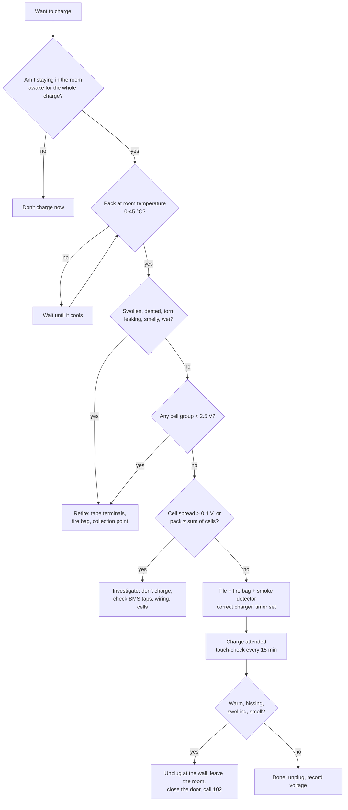

# FE.14 — Li-ion and LiPo safety and charging

<!-- glance:start -->
<!-- generated by tools/build.py from curriculum/syllabus.yaml — edit the syllabus, not this block -->

| | |
|---|---|
| **Track** | Optional foundation |
| **Difficulty** | Beginner |
| **Time** | 40 min |
| **Hardware** | none |
| **Software** | none |
| **Prerequisites** | [FE.13 Batteries: chemistry, voltage, capacity, C-rating](FE.13-batteries.md) |
| **Skip if** | Never skip. |

<!-- glance:end -->

## What you will learn

- Explain thermal runaway and the handful of abuses that cause it.
- Charge a Li-ion pack and a LiPo correctly: CC/CV, the right voltage, the right current, balance charging.
- Set up a charging place and routine that contains a failure instead of spreading it.
- Inspect a pack before charging and decide: charge, investigate or retire.
- Store, transport and dispose of lithium batteries safely in Israel, including in summer heat.
- Know what to do if a battery starts to swell, hiss, smoke or burn.

## Why it matters

karmel carries about 38 Wh in three 18650 cells. That's roughly the energy of a laptop battery, in a box that bumps into furniture, gets carried around, and gets charged by someone who is also debugging ROS 2. A 3S LiPo for the bigger robot holds 55 Wh in a soft pouch. Lithium cells are safe when treated correctly and dangerous when abused: a failing cell can vent flammable gas, reach several hundred °C, and ignite its neighbors in seconds. Nothing in software can make up for a pack charged unattended on a sofa.

[01.07](../../01-first-robot/01.07-power-system.md) builds karmel's power system and assumes the rules in this lesson. [01.14](../../01-first-robot/01.14-battery-monitoring.md) adds the software low-voltage cutoff. [20.04](../../20-final-robot/20.04-safety-case.md) turns battery handling into part of the robot's safety case. The syllabus says "never skip" this lesson, and it means it.

<!-- prereqs:start -->
## Prerequisites

You need these first:

- [FE.13 Batteries: chemistry, voltage, capacity, C-rating](FE.13-batteries.md)

### Optional prerequisite links

None.

Check your readiness: `python course.py why FE.14`
<!-- prereqs:end -->

## Concept

A lithium cell stores energy by keeping lithium ions on one side of a very thin plastic separator. The separator is the only thing preventing the two electrodes from touching. Most battery fires come down to one of two things:

1. **The separator is breached** (crushing, puncture, a manufacturing defect, or metal "dendrites" grown by over-discharging and then recharging, or by charging when too cold). The electrodes short internally.
2. **The cell is pushed outside its safe window**: charged above 4.2 V, charged too fast, heated too much, or shorted externally.

Either way the cell heats. Above roughly 80–120 °C, the chemistry itself starts producing heat, which raises the temperature further, which produces more heat. That feedback loop is **thermal runaway**. Once it starts it doesn't need oxygen or electricity from outside. The cell vents hot flammable gas (the "hiss"), may catch fire, and heats the cells next to it. You can't switch it off. You can only contain it and get away from it.

So the safety strategy has three layers, like defense in depth in a production system:

- **Prevention:** correct charger, voltage, current and temperature; no mechanical damage; matched healthy cells; a BMS and a fuse.
- **Detection:** you are present while charging, you inspect packs before charging, and you notice heat, swelling and smells.
- **Containment:** charge on a non-flammable surface, inside a fire-resistant bag or metal box, away from anything that burns, with a smoke detector and a clear exit.

> [!TIP]
> **Ask your teacher:** "Walk me through a timeline of a Li-ion cell going into thermal runaway during charging, and at each step tell me which of my safety layers would catch it."

## Technical explanation

### Level 1 — The rules (memorize these)

> [!CAUTION]
> **Safety:** These rules apply every time you charge, store or carry any lithium battery in this course: karmel's 3S 18650 pack, a LiPo, spare cells, or a power bank you've modified.

1. **Never charge unattended.** You stay in the room and awake. No overnight charging, no charging while you're out. Use a kitchen timer.
2. **Charge on a non-flammable surface, contained.** A ceramic tile or metal tray, inside a LiPo/fire-resistant bag or a metal box with a loosely closed lid (never airtight). Nothing flammable within about 1 m: no sofa, bed, carpet, curtains, paper or wooden desk surface.
3. **Use the right charger for the chemistry and cell count.** karmel's pack: a **12.6 V CC/CV Li-ion charger** (3S), connected through the BMS. LiPo: a **balance charger** set to LiPo (not LiHV, not LiFe) and the correct cell count.
4. **Charge at 0.5C or less** unless the datasheet clearly allows more. For karmel's 3.5 Ah pack, the 2 A charger is 0.57C. Samsung's standard charge for the 35E is about 0.5C.
5. **Only charge between 0 °C and 45 °C** (the 35E's charge range). Let a pack that is hot from driving, or from a car, cool to room temperature first.
6. **Inspect before every charge** (Level 3). Swollen, dented, torn, leaking, smelly, wet or over-discharged → don't charge.
7. **Have a smoke detector** in the room, and know your exit.
8. **Never leave lithium batteries in a car in Israeli summer.** Parked car interiors reach well over 60 °C, above what cells are rated to store at, and dashboards get hotter still.
9. **Store packs at storage voltage** (3.80–3.85 V per cell, 11.4–11.55 V for 3S) if unused for more than a week or two. Store them in a cool place, in a fire-resistant bag, with the connectors covered.
10. **Cover the terminals** of any loose cell or pack you carry. Never put a loose 18650 in a pocket with keys or coins.

### Level 2 — How a Li-ion charger works (CC/CV)

A proper lithium charger runs two phases:

1. **Constant current (CC):** it pushes a fixed current (2 A for karmel's charger) while the voltage rises from, say, 11 V toward 12.6 V. This phase delivers about 70–80 % of the charge.
2. **Constant voltage (CV):** once the pack reaches 12.6 V (4.20 V per cell), the charger holds exactly that voltage. The current tapers off as the cells fill. The charge ends when the current falls to a small fraction of C (typically C/10–C/20, 0.35–0.18 A here). A good charger then **stops**. It doesn't trickle.

```text
 charge current
 2.0 A ┤━━━━━━━━━━━━━━━━━━━━━━━┓
       │   constant current     ┃╲  constant voltage: current tapers
 1.0 A ┤                        ┃  ╲
 0.2 A ┤                        ┃     ╲____________● stop (≈ C/10–C/20)
       └────────────────────────┸──────────────────────────── time
 voltage per cell               ↓ reaches 4.20 V
 4.20 V┤                  ______━━━━━━━━━━━━━━━━━━━━ held at 4.20 V
 3.90 V┤          _______/
 3.60 V┤_________/
       └───────────────────────────────────────────────────── time
```

**Charge time estimate:**

$$t \approx \frac{C \cdot (0.8 - SoC_\text{now})}{I_\text{CC}} + t_\text{CV}$$

**Numerical example.** karmel's 3.5 Ah pack at 10 % charge, 2 A charger, CV tail about 0.5 h: $t \approx 3.5 \times 0.7 / 2 + 0.5 = 1.7$ h. Plan to be home and nearby for two hours.

**The voltage must be exact.** Li-ion capacity and aging are very sensitive to charge voltage. 4.20 V per cell is full. 4.30 V is over-charge: it stresses the cell and eats your safety margin. A "12.6 V" charger that measures 13.0 V without load is **defective**. Measure it before first use (exercise E2).

**Balance.** In a series pack, cells drift apart over time. The charger only sees the total voltage. With cells at 4.10 + 4.10 + 4.40 V the total is a perfect 12.6 V, and one cell is dangerously over-charged. The protections:

- **LiPo packs** have a **balance lead** (a small white JST-XH connector with S+1 wires). A balance charger measures and equalizes every cell. Always charge LiPos through the balance lead.
- **karmel's 18650 pack** relies on the **BMS**: per-cell over-charge protection, and on some boards a weak top balance. That's why you measure the cell groups at the BMS taps regularly (Level 3). A spread above 0.1 V is a reason to stop.

### Level 3 — Inspect, decide, act

Before every charge, and after any crash, drop or overheating:

| Check | How | Decision |
|---|---|---|
| Shape | Look along the pack. LiPo: puffed or soft pouch. 18650: dents, bulges at the ends | Any swelling or dent → **retire** |
| Wrap and connectors | Torn cell wrap (especially near the + end, where the can is − and a tear allows a short), exposed or melted wires, cracked connectors | Torn wrap, damaged insulation → **retire** (or have the pack rebuilt by a professional) |
| Smell, leaks, water | Sweet or solvent smell, crust on terminals, pack got wet | → **retire** |
| Temperature | Hand on the pack; must be room temperature | Warm → wait. Above 45 °C → don't charge |
| Cell voltages | Multimeter at the BMS taps (B−, B1, B2, B+) | Any group below 2.5 V → **retire**. Spread above 0.1 V → **investigate** |
| Pack voltage | P+ to P− | Must equal the sum of cells (±0.15 V). If 0 V or much less, the BMS may have tripped |
| History | Did it get hot in use? Was it left connected to a load for days? | → investigate first |

**Why "below 2.5 V → retire".** A deeply over-discharged lithium cell can dissolve copper from its current collector. When you recharge it, the copper re-deposits as needles that can pierce the separator days or weeks later. A cell rescued from 1.5 V may "work fine" until it doesn't. Parts are cheap; the risk isn't worth it. The most common way to get there: leaving the robot switched on (or with a BMS or Pi drawing a small current) for weeks. **Switch the robot off at the battery switch after every session.**

**Retiring a battery in Israel.** Tape over the terminals (or put the connector in a small bag), put damaged or swollen packs in a fire-resistant bag or a metal container with sand, and take them to a battery collection point. Many supermarkets, electronics and office-supply stores in Israel have battery collection bins. Tell the staff if the pack is damaged. Never put lithium batteries in household trash or recycling bins, where compactors crush them.

### Level 4 — Storage, transport, heat and emergencies

**Storage.** Lithium cells age fastest when full and hot. For storage longer than a week or two:

- Discharge or charge to 3.80–3.85 V per cell (LiPo balance chargers have a "storage" mode). For karmel's pack, drive the robot or leave the Pi running, **attended**, until the resting pack voltage is about 11.5 V.
- Store at 15–25 °C, away from direct sun. In an Israeli summer, a closed storage room or balcony box can get far hotter than the apartment. A cupboard inside the air-conditioned home is better.
- Use a fire-resistant bag or a metal box, not near exits, and away from anything flammable.
- Check the voltage monthly.

**Heat.** Batteries age and become less safe at high temperature. The 35E's charging window ends at 45 °C. Summer car interiors pass that easily, and a robot left on the back seat for a lunch break can come back well over 60 °C. If you transport the robot by car: pack in the air-conditioned cabin, never the trunk in the sun, and take it inside with you. After a hot-car exposure, let the pack cool and inspect it before charging.

**Transport.** Robot switched off at the battery switch, connectors covered, pack secured so it can't be crushed. Flying: spare lithium batteries go in **carry-on only**. Batteries up to 100 Wh per pack are generally allowed. karmel's 38 Wh and the 55 Wh LiPo are under that, but airline rules vary, so check your airline before you fly.

**Emergencies.** If a pack **swells, hisses, smokes, smells sweet, or gets hot while charging**:

1. If you can do it without touching or leaning over the pack, **unplug the charger at the wall**.
2. **Don't pick up the pack.** Venting cells can flare suddenly. If it's already inside a fire-resistant bag on a tile, leave it there.
3. **Get everyone (and pets) out of the room**, close the door behind you, and **call 102** (Israel Fire and Rescue) if there is smoke or fire. Battery smoke is toxic. Don't stay to watch it.
4. Don't fight a lithium fire with a small household extinguisher beyond protecting your exit. The cells re-ignite after flames are knocked down. Firefighters cool them with a lot of water.
5. Afterwards, even if it "stopped", treat the pack as dangerous for at least 24 hours. Let the fire service or a professional handle it.

If a pack gets **mechanically damaged during a test** (crushed by the robot, dropped, punctured), move away from it, watch it from a distance for a few minutes, and only then move it with pliers or tongs into a metal container outside or on a balcony tile, away from anything flammable.

## Diagram

The charging decision flow, every time:



A safe charging station layout:

```text
   wall socket (reachable without leaning over the pack)
        │
   ┌────┴─────┐  charger on the tile too, not on paper or cloth
   │ charger  │──── 12.6 V lead ────┐
   └──────────┘                     │
 ┌──────────────────────────────────┼─────────────────────┐
 │ ceramic tile / metal tray        ▼                     │   ≥ 1 m clear of anything
 │            ┌─────────────────────────────┐             │   flammable (curtains, paper,
 │            │ fire-resistant bag, zipped  │             │   sofa, bed, carpet)
 │            │ around the pack, lead out   │             │
 │            └─────────────────────────────┘             │
 └────────────────────────────────────────────────────────┘
   smoke detector on the ceiling · timer set · exit door behind you, not behind the pack
```

## Code

`precharge_check.py` (any computer, standard library only) encodes the inspection rules from Level 3 and the charge-time estimate from Level 2, so you apply them the same way every time. Run `python precharge_check.py`, then add your own measurements as a new case before each charge.

```python
"""FE.14 — pre-charge check for a 3S Li-ion pack, plus a charge-time estimate.

Encodes the rules of the lesson so you apply them the same way every time.
Run:  python precharge_check.py
"""
from __future__ import annotations

from dataclasses import dataclass, field
from enum import Enum


class Verdict(Enum):
    CHARGE = "OK to charge (attended)"
    INVESTIGATE = "do NOT charge yet - investigate"
    RETIRE = "RETIRE the pack - do not charge"


@dataclass
class Inspection:
    cell_v: list[float]                 # rested voltage of each series group, measured at the BMS taps
    pack_v: float                       # measured at P+/P-
    temperature_c: float                # pack and room temperature
    swollen_dented_or_torn: bool = False
    smell_leak_or_wet: bool = False
    got_hot_in_use: bool = False


@dataclass
class Result:
    verdict: Verdict
    reasons: list[str] = field(default_factory=list)


MIN_CHARGE_TEMP_C, MAX_CHARGE_TEMP_C = 0.0, 45.0   # Samsung 35E charge range
DEAD_CELL_V = 2.5
MAX_IMBALANCE_V = 0.10
FULL_CELL_V = 4.20


def check(i: Inspection) -> Result:
    retire: list[str] = []
    investigate: list[str] = []
    if i.swollen_dented_or_torn:
        retire.append("physical damage (swelling, dent or torn wrap)")
    if i.smell_leak_or_wet:
        retire.append("sweet/solvent smell, leak, or water exposure")
    low = [v for v in i.cell_v if v < DEAD_CELL_V]
    if low:
        retire.append(f"cell group below {DEAD_CELL_V} V: {low}")
    spread = max(i.cell_v) - min(i.cell_v)
    if spread > MAX_IMBALANCE_V:
        investigate.append(f"cells differ by {spread:.2f} V (limit {MAX_IMBALANCE_V} V)")
    if abs(sum(i.cell_v) - i.pack_v) > 0.15:
        investigate.append(f"pack {i.pack_v:.2f} V != sum of cells {sum(i.cell_v):.2f} V (BMS off? bad tap?)")
    if max(i.cell_v) > FULL_CELL_V + 0.03:
        investigate.append(f"a cell is above {FULL_CELL_V} V: over-charged - check the charger")
    if not MIN_CHARGE_TEMP_C <= i.temperature_c <= MAX_CHARGE_TEMP_C:
        investigate.append(f"temperature {i.temperature_c} C outside {MIN_CHARGE_TEMP_C}-{MAX_CHARGE_TEMP_C} C")
    if i.got_hot_in_use:
        investigate.append("pack got hot in use - find the cause first")
    if retire:
        return Result(Verdict.RETIRE, retire + investigate)
    if investigate:
        return Result(Verdict.INVESTIGATE, investigate)
    return Result(Verdict.CHARGE, [f"cells {i.cell_v}, spread {spread:.2f} V"])


def charge_time_h(capacity_ah: float, soc_now: float, charger_a: float, cv_tail_h: float = 0.5) -> float:
    """Constant-current phase to ~80 %, then a constant-voltage tail."""
    cc_fraction = max(0.0, 0.8 - soc_now)
    return capacity_ah * cc_fraction / charger_a + (cv_tail_h if soc_now < 0.95 else 0.2)


def main() -> None:
    cases = {
        "normal after a session": Inspection([3.71, 3.70, 3.72], pack_v=11.13, temperature_c=27),
        "straight from a hot car": Inspection([3.80, 3.80, 3.81], pack_v=11.41, temperature_c=52),
        "one weak group": Inspection([3.95, 3.93, 3.71], pack_v=11.59, temperature_c=26),
        "left on for a month": Inspection([2.31, 2.9, 2.95], pack_v=8.16, temperature_c=24),
        "dropped, wrap torn": Inspection([3.85, 3.85, 3.84], pack_v=11.54, temperature_c=25,
                                         swollen_dented_or_torn=True),
    }
    for name, inspection in cases.items():
        r = check(inspection)
        print(f"{name:24} -> {r.verdict.value}")
        for reason in r.reasons:
            print(f"{'':27}- {reason}")
    t = charge_time_h(capacity_ah=3.5, soc_now=0.10, charger_a=2.0)
    print(f"\n3.5 Ah pack from 10 % with a 2 A charger: about {t:.1f} h "
          f"(CC current = {2.0 / 3.5:.2f} C)")
    print(f"storage charge: {3 * 3.80:.1f}-{3 * 3.85:.2f} V for a 3S pack (3.80-3.85 V per cell)")


if __name__ == "__main__":
    main()
```

Output:

```text
normal after a session   -> OK to charge (attended)
                           - cells [3.71, 3.7, 3.72], spread 0.02 V
straight from a hot car  -> do NOT charge yet - investigate
                           - temperature 52 C outside 0.0-45.0 C
one weak group           -> do NOT charge yet - investigate
                           - cells differ by 0.24 V (limit 0.1 V)
left on for a month      -> RETIRE the pack - do not charge
                           - cell group below 2.5 V: [2.31]
                           - cells differ by 0.64 V (limit 0.1 V)
dropped, wrap torn       -> RETIRE the pack - do not charge
                           - physical damage (swelling, dent or torn wrap)

3.5 Ah pack from 10 % with a 2 A charger: about 1.7 h (CC current = 0.57 C)
storage charge: 11.4-11.55 V for a 3S pack (3.80-3.85 V per cell)
```

A script never replaces looking at, touching and smelling the pack. It makes sure you don't skip a measurement when you're in a hurry.

## Exercise

### Exercise FE.14-E1 — Build your charging station `[hardware]`

Hardware: `tools` (the LiPo/fire-resistant bag and multimeter from the tools list), plus a ceramic tile or metal tray and a smoke detector.

1. Choose the place: a hard, non-flammable surface, at least 1 m from anything flammable, with the wall socket reachable without leaning over the pack, and your exit door not behind the charging spot.
2. Check (or install) a smoke detector in that room, and press its test button.
3. Put the tile, the bag and a kitchen timer there. Write the charging rules from Level 1 on a card and tape it next to the socket.
4. Take a photo of the setup for your notes.

### Exercise FE.14-E2 — Verify the charger before its first use `[hardware]`

Hardware: `robot-base` (the 12.6 V 2 A charger), `tools` (multimeter).

> [!CAUTION]
> **Safety:** The charger is mains-powered. Plug it into the wall only after its output lead is safely away from anything metal, and don't open the charger case. Hold the probes by their insulated grips, and don't let the two output contacts touch each other.

1. Before plugging in, read the label: output voltage, output current, chemistry ("Li-ion", 3S / 12.6 V).
2. Plug it into the wall with no pack connected. Measure the no-load output voltage at the barrel plug (center pin vs sleeve: check the polarity symbol on the label, and write down which is +).
3. **Predict** first, then measure: what reading means the charger is safe to use?
4. Check that the charger plug's polarity matches the polarity of the charge jack on your robot (to BMS P+/P−).

### Exercise FE.14-E3 — Inspect and decide `[debugging]`

Hardware: none.

For each case, decide **charge, investigate or retire**, and name the rule. Then add the cases to `precharge_check.py` and compare.

1. Cells 4.05 / 4.04 / 4.06 V, pack 12.15 V, 24 °C, no damage. You want to "top it up" before a demo.
2. Cells 3.62 / 3.61 / 3.63 V, pack 0.0 V at P+/P−, 25 °C.
3. The LiPo for the bigger robot looks slightly puffy but all cells read 3.85 V.
4. Cells 3.40 / 3.39 / 3.41 V, the pack was in the car trunk for a two-hour meeting in August, now 41 °C.
5. The robot fell off the table. Cells 3.90 / 3.90 / 3.89 V, one 18650 has a small dent at the bottom edge.

### Exercise FE.14-E4 — Predict the storage voltage drive `[predict]`

Hardware: none for the prediction. The optional check uses `robot-base` with an INA219 ([01.14](../../01-first-robot/01.14-battery-monitoring.md)).

You're going abroad for three weeks, and karmel's pack is at 12.5 V after charging yesterday. Using [FE.13](FE.13-batteries.md)'s table and the robot's idle consumption (Pi idle about 3.5 W at the battery), **predict** how long the robot must stay on, attended, to bring the pack to about 3.85 V per cell. Then list what else you do before leaving (switch, storage place, temperature).

## Expected result

- **FE.14-E1:** A photo showing tile or tray, bag, timer and rules card, with nothing flammable within about 1 m and a smoke detector that beeps when tested. If your only option is a wooden desk, the tile goes under the whole setup, including the charger.
- **FE.14-E2:** Prediction: 12.6 V ±1 %, so **12.47–12.73 V** with no load. Readings of 12.5–12.7 V are fine. Some chargers show a slightly lower no-load voltage. Above **12.8 V**, don't use the charger: return it. A reading of 0 V without load can be normal for chargers that wait to detect a battery. In that case, check with the pack connected (attended, on the tile): the voltage must never exceed 12.6 V ±0.1 V at the end of charge. The plug polarity must match the jack; wrong polarity is a short through the BMS.
- **FE.14-E3:** (1) **Charge** (attended). A top-up is fine, balanced cells and room temperature; it will enter CV almost immediately. (2) **Investigate**: the cells are fine, so the BMS has tripped (over-current or short protection) or P−/P+ wiring is broken. Find the cause (a short, a stall) before charging; many BMS boards reset when the charger is connected. (3) **Retire**: any swelling of a LiPo means gas inside; never charge a puffy LiPo. (4) **Investigate** (wait): cool to room temperature first, then inspect. The voltages are fine (about 5–10 % charge). Charge once below 45 °C, ideally near room temperature. (5) **Retire** (conservative): a dent can deform the separator inside. Rebuild the pack with new matched cells.
- **FE.14-E4:** 12.5 V is 4.17 V per cell, about 97 %; 3.85 V is about 56 %. That's 41 % of 37.8 Wh ≈ **15.7 Wh**. At 3.5 W that's about **4.5 h** of idle running (less if you drive the wheels on the stand). Before leaving: robot off at the battery switch, pack at 11.5 V, stored in the fire bag in a cool indoor cupboard, not near the front door, and not in a hot storage room or car.

## Troubleshooting

### Symptom: the charger's light turns "full" (green) immediately

1. **Measure the pack voltage.** Already at 12.5 V or more? It's full. Normal.
2. **Pack reads 0 V at P+/P−, but the cells are fine?** The BMS has tripped. Some chargers can't wake a tripped BMS. Find why it tripped first (short, stall). Then connecting the charger usually resets it. If not, check the BMS wiring.
3. **Cells low but the charger says full?** Check the jack wiring and polarity, and the charger's no-load voltage (E2). Don't force it with a different charger.

### Symptom: the pack gets warm while charging

Slightly warm (a few degrees above room temperature) at 0.5C is normal near the end of the CC phase. **Hot** (uncomfortable to hold), or one area hotter than the rest → unplug at the wall, move away, let it cool in the bag on the tile, and don't reuse it until you've measured all cell groups. A cell group that ends much higher or lower than the others marks the bad cell.

### Symptom: the cells drift apart after a few charge cycles

Measure after a full charge and after resting. A spread under 0.05 V is normal. 0.05–0.1 V: watch it, and charge fully more often so a balancing BMS can work. Above 0.1 V, or growing every cycle: one cell has lower capacity or higher self-discharge. Retire the pack or replace the whole set with new matched cells.

### Symptom: the robot won't switch on after it sat for weeks

The pack has self-discharged, or something kept drawing current, and the BMS disconnected. Measure the cell groups. All above 2.5 V → charge attended, then check again after 24 hours of rest (a cell that drops noticeably overnight is damaged). Any group below 2.5 V → retire.

## Common mistakes

- **"It's only a small pack."** 38 Wh in thermal runaway is a serious fire in an apartment.
- **Charging overnight or while out "because it's slow".** That's exactly when a fault becomes a fire.
- **Using a LiPo charger in the wrong mode** (LiHV 4.35 V per cell, or the wrong cell count), or a lead-acid "12 V" charger on a lithium pack.
- **Charging a hot pack right after driving**, or a pack brought in from a hot car.
- **Charging a puffy LiPo "one last time".**
- **Leaving the robot on its battery switch for weeks.** The pack over-discharges, and recharging it later is the dangerous part.
- **Storing packs full in a hot place.** Heat + full charge = fastest aging.
- **Throwing dead lithium batteries in household trash.** Use a collection point.
- **Soldering directly to 18650 cells.** The heat damages the cell's seal and separator ([FE.17](FE.17-soldering.md)).

## Knowledge check

1. What is thermal runaway, and why can't you "switch it off"?
   <details><summary>Answer</summary>

   A self-heating chain reaction: once a cell is hot enough (roughly 80–120 °C and up), its chemistry releases heat that raises the temperature further. It doesn't need outside power or much oxygen, so unplugging doesn't stop it. You can only contain it and cool it, which is a firefighter's job.
   </details>

2. Describe the two phases of a Li-ion charge and when the charge ends.
   <details><summary>Answer</summary>

   Constant current until the cells reach 4.20 V each (12.6 V for 3S), then constant voltage at exactly that value while the current tapers. The charge ends when the current falls to a small fraction of C (about C/10–C/20). A proper charger then stops, with no trickle charge.
   </details>

3. A 3S LiPo reads 12.60 V after charging with a non-balance charger. Why might that still be dangerous?
   <details><summary>Answer</summary>

   The total can be correct while cells are unbalanced, for example 4.10 + 4.10 + 4.40 V. One cell is over-charged. Always balance-charge LiPos through the balance lead.
   </details>

4. Why should a cell that has been below 2.5 V not be recharged?
   <details><summary>Answer</summary>

   Deep over-discharge can dissolve copper inside the cell. Recharging re-deposits it as dendrites that can pierce the separator later, causing an internal short and thermal runaway, possibly days after it "worked fine".
   </details>

5. How long does a 3.5 Ah pack at 20 % take to charge with a 1.5 A CC/CV charger (CV tail 0.5 h)?
   <details><summary>Answer</summary>

   $3.5 \times (0.8 - 0.2)/1.5 + 0.5 = 1.4 + 0.5 = 1.9$ h.
   </details>

6. Predict: you leave the robot in the car during a two-hour lunch in July, then want to charge it immediately at home. What do you do?
   <details><summary>Answer</summary>

   Don't charge. Let the pack cool to room temperature (at least an hour indoors), inspect it for swelling and damage, measure the cells, then charge attended. Charging above 45 °C is outside the cell's rating. Next time, take the robot inside with you.
   </details>

7. A LiPo on the charger starts hissing and swelling. List what you do, in order.
   <details><summary>Answer</summary>

   Unplug the charger at the wall if you can without leaning over the pack. Don't touch or move the pack. Get everyone out of the room, close the door, and call 102 if there's smoke or fire. Stay out of the smoke. Treat the pack as dangerous for at least a day, even if it seems to stop.
   </details>

## Practical challenge

Write and follow your own battery procedure for a month.

1. A one-page `BATTERY_PROCEDURE.md` in your robot's notes: charging station location, pre-charge check (using `precharge_check.py`), charge steps, storage voltage and place, transport rules, disposal point near you, emergency steps with the 102 number.
2. A log (a CSV is fine) with one line per charge: date, cell voltages before, pack voltage after, charge duration, max temperature by touch (cool/warm/hot), notes.

**Acceptance criteria:** at least 5 logged charges, all attended, all on the station from E1. Cell spread stays below 0.05 V, or you acted when it didn't. The pack is at storage voltage whenever it was unused for more than two weeks. Another person could follow your procedure without asking you anything.

## You can skip this if…

**Never skip.** Even if you've built battery packs before, do exercises E1, E2 and E3, and answer knowledge-check questions 2, 4, 6 and 7 correctly. The rules in Level 1 are the standing rules for every hardware lesson in the course.

If you have done all of that and want to record it: `python course.py skip FE.14 --reason "Did E1-E3 and the knowledge check; I follow the charging and storage rules"`

## Go deeper

- Battery University, BU-304a Safety Concerns with Li-ion: https://batteryuniversity.com/article/bu-304a-safety-concerns-with-li-ion — how internal shorts and thermal runaway happen, in plain language.
- Battery University, BU-410 Charging at High and Low Temperatures: https://batteryuniversity.com/article/bu-410-charging-at-high-and-low-temperatures — why the 0–45 °C window matters.
- Battery University, BU-702 How to Store Batteries: https://batteryuniversity.com/article/bu-702-how-to-store-batteries — storage charge levels and temperatures, with aging data.
- Adafruit, Li-Ion & LiPoly Batteries: https://learn.adafruit.com/li-ion-and-lipoly-batteries — charging, protection circuits and care for hobby-scale packs.
- Samsung INR18650-35E datasheet (distributor copy): https://www.orbtronic.com/content/samsung-35e-datasheet-inr18650-35e.pdf — the charge method, charge current and temperature limits for karmel's cells.

## Progress checkpoint

- [ ] I can explain thermal runaway and the abuses that cause it.
- [ ] I charge with the right charger, voltage and current, attended, on a contained non-flammable station.
- [ ] I inspect before every charge and know when to charge, investigate or retire.
- [ ] I store packs at storage voltage in a cool place and never leave them in a hot car.
- [ ] I know the emergency steps, including calling 102.

`python course.py complete FE.14` (exercises done) · `python course.py master FE.14` (challenge done) · `python course.py struggle FE.14 "what was hard"`

Next: [FE.15 — Voltage regulators: linear, buck and boost](FE.15-voltage-regulators.md), or back to [01.07](../../01-first-robot/01.07-power-system.md) if you came from there.
