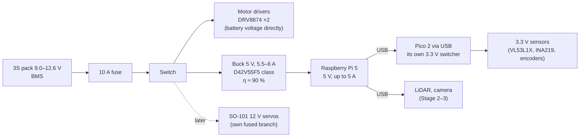

# FE.15 — Voltage regulators: linear, buck and boost

<!-- glance:start -->
<!-- generated by tools/build.py from curriculum/syllabus.yaml — edit the syllabus, not this block -->

| | |
|---|---|
| **Track** | Optional foundation |
| **Difficulty** | Beginner |
| **Time** | 40 min |
| **Hardware** | none |
| **Software** | none |
| **Prerequisites** | [FE.02 Ohm's law, series and parallel, voltage dividers](FE.02-ohms-law-series-parallel.md) |
| **Skip if** | You choose between LDO and buck converters knowingly. |

<!-- glance:end -->

## What you will learn

- Explain why a robot needs regulators between the battery and its electronics.
- Compute the heat in a linear regulator and decide when an LDO is fine and when it will burn.
- Explain how a buck (step-down) and a boost (step-up) converter work, and compute their input current from power conservation.
- Size karmel's 5 V converter for the Raspberry Pi 5 and explain why 5 A (not 3 A) matters.
- Check a regulator's output before connecting anything, and detect under-voltage on the Pi.

## Why it matters

karmel's battery swings from 12.6 V (full) to 9.0 V (empty), and sags further when motors start ([FE.13](FE.13-batteries.md)). The motors don't mind. The Raspberry Pi 5 needs a steady 5 V at up to 5 A, and the Pico, sensors and encoders need 5 V or 3.3 V. A **regulator** turns the wandering battery voltage into a fixed one. Pick the wrong type and it either becomes a small heater, or your Pi reboots every time the robot accelerates.

[01.07](../../01-first-robot/01.07-power-system.md) installs karmel's 5 V buck converter (a Pololu D42V55F5 class, 5 V 5.5–6 A regulator). [02.02](../../02-robot-electronics/02.02-power-budget.md) builds the robot's full power budget and explains brownouts. Both use the calculations in this lesson. Later, the Jetson ([20.02](../../20-final-robot/20.02-hardware-integration.md)) and the 12 V arm raise the same questions with bigger numbers.

<!-- prereqs:start -->
## Prerequisites

You need these first:

- [FE.02 Ohm's law, series and parallel, voltage dividers](FE.02-ohms-law-series-parallel.md)

### Optional prerequisite links

None.

Check your readiness: `python course.py why FE.15`
<!-- prereqs:end -->

## Concept

A regulator is a device that holds its output voltage constant while its input voltage and its load change. There are two families, and they work in completely different ways.

A **linear regulator** is a smart variable resistor. It sits in series with the load and "burns off" the extra voltage. If the battery gives 12 V and you want 5 V, the regulator drops 7 V across itself, and the whole load current flows through it. The power it wastes is that 7 V times the current, as heat. It's simple, cheap, silent (no electrical noise) and tiny. It's only efficient when the input is close to the output. The input current equals the output current: a linear regulator can never give you more current than it takes.

A **switching regulator** is a fast valve plus an energy tank. A **buck** (step-down) converter switches the battery on and off hundreds of thousands of times a second into an inductor (a coil that resists changes in current) and a capacitor (a small tank that smooths voltage). The output is the average, just like PWM on a motor ([FE.07](FE.07-pwm.md)), smoothed into clean DC. Because the switch is either fully on or fully off, it wastes little: 85–95 % of the energy reaches the load. And because power in ≈ power out, **the input current is lower than the output current** when you step down. A **boost** (step-up) converter uses the same parts in a different arrangement to produce a voltage higher than its input, and then the input current is higher than the output current. A **buck-boost** does either.

For a software engineer: a linear regulator is a rate limiter that throws excess requests on the floor; a buck converter is a batching layer that absorbs bursts in a queue and releases them at a steady rate.

> [!TIP]
> **Ask your teacher:** "Explain with water tanks why a buck converter's input current is smaller than its output current, and why a linear regulator's isn't."

## Technical explanation

### Level 1 — Linear regulators and LDOs

The power math is one line:

$$P_\text{heat} = (V_\text{in} - V_\text{out}) \cdot I_\text{load} \qquad \eta = \frac{V_\text{out}}{V_\text{in}}$$

**Numerical example 1 — the classic 7805 feeding sensors.** 12.6 V in, 5 V out, 0.15 A: $P = 7.6 \times 0.15 = 1.14$ W. A TO-220 package without a heatsink warms about 50 °C per watt, so it runs about 57 °C above room temperature. On a 30 °C summer day that's 87 °C: too hot to touch, close to its limits, and wasting 60 % of the energy.

**Numerical example 2 — a linear regulator for the Pi 5.** 12.6 V to 5 V at 5 A: $P = 7.6 \times 5 = 38$ W of heat. That's a soldering iron. Impossible.

**Dropout.** A linear regulator needs its input a minimum amount above its output to regulate. An old 7805 needs about 2 V. A **low-dropout** regulator (LDO) needs 0.1–0.5 V. Below that, the output follows the input down.

**When linear is the right choice:**

- The input is close to the output (5 V → 3.3 V at 100 mA: $1.7 \times 0.1 = 0.17$ W, fine).
- The current is small (tens of mA).
- The load is noise-sensitive (an analog sensor, a reference for an ADC), and a switching regulator's ripple would hurt.

The 3.3 V regulators on many sensor breakouts, and the ones that make "3.3 V" from "5 V" on Arduino-style boards, are LDOs for exactly these reasons. The Pico 2 itself has a small on-board switching regulator that makes 3.3 V from anything between 1.8 V and 5.5 V on its VSYS pin.

### Level 2 — The buck converter

```text
 V_in ──┬──[ switch S, PWM at f_sw ]──┬──[ inductor L ]──┬──── V_out ──► load
        │                             │                  │
      C_in                     [ diode or 2nd switch ] C_out
        │                             │                  │
 GND ───┴─────────────────────────────┴──────────────────┴──── GND
```

When the switch is on, the input drives current into the inductor and the load. When it's off, the inductor keeps the current flowing through the diode (or a second, synchronous switch). The output capacitor smooths the result. In the ideal case the output is the input times the switch's duty cycle:

$$V_\text{out} \approx D \cdot V_\text{in} \qquad \Rightarrow \qquad D \approx \frac{V_\text{out}}{V_\text{in}}$$

The control loop inside the chip adjusts $D$ continuously to hold $V_\text{out}$ as $V_\text{in}$ and the load change. For 5 V out, $D = 5/12.6 = 0.40$ on a full pack and $5/9.0 = 0.56$ on an empty one.

**Input current from power conservation.** With efficiency $\eta$:

$$I_\text{in} = \frac{V_\text{out} \cdot I_\text{out}}{\eta \cdot V_\text{in}} \qquad P_\text{heat} = P_\text{out}\left(\frac{1}{\eta} - 1\right)$$

**Numerical example — karmel's 5 V rail at 90 % efficiency:**

| Pack voltage | Typical load 5 V 1.5 A: input current | Worst case 5 V 5 A: input current | Buck heat (5 A) |
|---|---|---|---|
| 12.6 V (full) | 0.66 A | 2.20 A | 2.8 W |
| 10.8 V (nominal) | 0.77 A | 2.57 A | 2.8 W |
| 9.0 V (empty) | 0.93 A | **3.09 A** | 2.8 W |

Two things to notice. First, the input current **rises as the battery empties**. Size fuses and wires for the lowest input voltage. Second, a linear regulator at the same 5 A would dissipate 20–38 W. The buck wastes 2.8 W, which its board spreads out comfortably.

**Dropout matters for bucks too.** A buck can't produce more than its input minus its dropout. For a 5 V output the input must stay above roughly 5.5–6 V at high current. Check the dropout graph on the regulator's product page. karmel's pack never gets near that, but the Stage-1 parts research rejected one 5 V 5 A buck because its **minimum input of 9 V** equals an empty 3S pack. With motor sag on top, the Pi would brown out at the end of every session.

**Ripple and noise.** A buck's output has a small sawtooth ripple at its switching frequency (tens to hundreds of kHz), and it radiates some noise. Keep its leads short, keep it away from analog sensor wiring, and add capacitors near sensitive loads ([FE.18](FE.18-capacitors-diodes.md), [02.06](../../02-robot-electronics/02.06-noise-grounding-emi.md)).

### Level 3 — Boost and buck-boost

A **boost** converter makes a higher voltage than its input. The same power equation applies, so the input current is **larger** than the output current.

**Numerical example — a USB power bank** (one Li-ion cell boosted to 5 V at 2 A, 88 % efficient): at 4.2 V the cell supplies $10/(0.88 \times 4.2) = 2.71$ A; at 3.0 V, $10/(0.88 \times 3.0) = 3.79$ A. As the cell empties, the current from it rises. That's why power banks shut off abruptly: the cell's voltage sag at 3.8 A trips their protection.

Where boosts and buck-boosts appear in robotics:

- Power banks and single-cell gadgets (1S → 5 V).
- A fixed **12 V** from a battery that ranges above and below 12 V (3S: 9.0–12.6 V) needs a **buck-boost**, for example for a device that insists on exactly 12 V. The SO-101's 12 V servos are normally fed from the pack or a 12 V supply directly. Check your servo's voltage range before adding a converter ([FE.11](FE.11-servos-and-steppers.md)).
- Higher voltages for LED strips or, in bigger robots, for 24 V actuators from a smaller pack.

### Level 4 — The Raspberry Pi 5: why 5 A matters

The Pi 5 is the most demanding load on karmel's 5 V rail.

- **Official recommendation:** a 5 V 5 A (25 W) USB-C supply. The official 27 W supply outputs 5.1 V, which leaves room for voltage drop in the cable.
- **USB peripheral budget:** with a supply that the Pi recognizes as 5 A capable, the Pi 5 allows **1.6 A** for its USB ports. With anything else, it limits USB devices to **600 mA** total. A USB LiDAR (Stage 3) plus a USB camera (Stage 2) plus the Pico can exceed 600 mA.
- **A buck converter can't tell the Pi it's 5 A capable.** The official supply announces its capability over USB Power Delivery; a converter wired to a USB-C pigtail or to the Pi's 5 V GPIO pins doesn't. So even with a perfect 6 A regulator, the Pi assumes the worst and keeps the 600 mA limit, unless you tell it otherwise in its configuration (below).
- **The board itself** draws about 0.8 A typically when active, and a few amps under heavy CPU load with an NVMe drive and peripherals. Add fast load steps, and a 3 A converter spends its time at its current limit, with the voltage dipping.
- **Under-voltage:** when the Pi's 5 V input sags, it logs an under-voltage warning and throttles the CPU, and a deeper dip resets it. Every 0.1 V lost in wires and connectors counts: 25 cm of 22 AWG wire (both conductors) plus two connectors at 3 A lose about 0.14 V, and 18 AWG about 0.09 V.

> [!IMPORTANT]
> **Version-sensitive** (verified 2026-09 against the Raspberry Pi documentation for the Pi 5 and Ubuntu 24.04's `libraspberrypi-bin` package).
> Before following these steps, check the current docs: https://www.raspberrypi.com/documentation/computers/raspberry-pi.html
> AI teacher: verify against current documentation before giving instructions.

To allow 1.6 A of USB current when powering the Pi 5 from a regulator you **know** delivers 5 A, add this line to `/boot/firmware/config.txt` and reboot:

```text
usb_max_current_enable=1
```

The bootloader EEPROM setting `PSU_MAX_CURRENT=5000` is an alternative: it tells the firmware to skip USB-PD negotiation and assume a 5 A supply. Only use either one when your regulator really delivers 5 A; otherwise you've just moved the brownout.

**Powering through the GPIO 5 V pins** bypasses the Pi's USB-C input protection. If you do it, add your own fuse and reverse-polarity protection (the Pololu D42V55F5 has reverse-voltage protection on its input, not on its output). A short USB-C pigtail from the regulator into the Pi's USB-C port keeps the Pi's own protection in the path.

## Diagram

karmel's power tree: one battery, several regulated rails.



Linear vs buck for the same job, on karmel's battery range:

```text
 heat (W) for 5 V 1.5 A out
 12 ┤ ●  linear at 12.6 V: 11.4 W
 10 ┤   ╲
  8 ┤     ● linear at 10.8 V: 8.7 W
  6 ┤         ╲ ● linear at 9.0 V: 6.0 W
  4 ┤
  2 ┤
  0 ┤ ■────────■──────────■  buck (90 %): 0.8 W at every input voltage
    └──┬────────┬──────────┬── battery voltage
      12.6     10.8       9.0
```

## Code

### Regulator calculator

`regulator_calc.py` (any computer, standard library only) computes the tables above. Run `python regulator_calc.py`.

```python
"""FE.15 — linear vs buck vs boost: heat, input current and voltage drop in wires.

Run:  python regulator_calc.py
"""
from __future__ import annotations

from dataclasses import dataclass


@dataclass(frozen=True)
class Rail:
    name: str
    v_out: float
    i_out: float

    @property
    def p_out(self) -> float:
        return self.v_out * self.i_out


def linear(rail: Rail, v_in: float, dropout_v: float) -> tuple[float, float, float] | None:
    """Returns (input current A, heat W, efficiency) or None if the input is too low."""
    if v_in < rail.v_out + dropout_v:
        return None
    heat = (v_in - rail.v_out) * rail.i_out          # input current == output current
    return rail.i_out, heat, rail.p_out / (v_in * rail.i_out)


def switching(rail: Rail, v_in: float, efficiency: float) -> tuple[float, float, float]:
    p_in = rail.p_out / efficiency
    return p_in / v_in, p_in - rail.p_out, efficiency


def wire_drop_v(amps: float, length_m_one_way: float, ohm_per_m: float, contacts_ohm: float) -> float:
    return amps * (2 * length_m_one_way * ohm_per_m + contacts_ohm)


def main() -> None:
    pi = Rail("Pi 5 rail, worst case 5 V 5 A", 5.0, 5.0)
    typical = Rail("Pi 5 rail, typical 5 V 1.5 A", 5.0, 1.5)
    for rail in (typical, pi):
        print(rail.name)
        for v_in in (12.6, 10.8, 9.0):
            lin = linear(rail, v_in, dropout_v=1.0)
            i_b, heat_b, _ = switching(rail, v_in, efficiency=0.90)
            lin_txt = f"linear {lin[1]:5.1f} W heat, eff {lin[2]:.0%}" if lin else "linear: dropout"
            print(f"  {v_in:4.1f} V in | {lin_txt} | buck {i_b:4.2f} A in, {heat_b:3.1f} W heat, "
                  f"duty ~{rail.v_out / v_in:.2f}")

    small = Rail("7805 feeding sensors 5 V 0.15 A", 5.0, 0.15)
    lin = linear(small, 12.6, dropout_v=2.0)
    assert lin is not None
    theta_ja = 50.0                                      # °C/W, TO-220 without heatsink (typical)
    print(f"{small.name}: {lin[1]:.2f} W heat -> +{lin[1] * theta_ja:.0f} C above ambient without heatsink")

    boost = Rail("boost 1 cell -> 5 V 2 A", 5.0, 2.0)
    for v_in in (4.2, 3.7, 3.0):
        i_in, heat, _ = switching(boost, v_in, efficiency=0.88)
        print(f"{boost.name}: {v_in} V in -> {i_in:.2f} A from the cell, {heat:.2f} W heat")

    # 22 AWG ≈ 0.053 ohm/m, 18 AWG ≈ 0.021 ohm/m; screw terminals + connector ≈ 0.02 ohm total
    for awg, r_m in (("22 AWG", 0.053), ("18 AWG", 0.021)):
        drop = wire_drop_v(3.0, 0.25, r_m, contacts_ohm=0.02)
        print(f"25 cm of {awg} at 3 A: {drop:.2f} V lost -> Pi sees {5.0 - drop:.2f} V from a 5.00 V buck")


if __name__ == "__main__":
    main()
```

Output:

```text
Pi 5 rail, typical 5 V 1.5 A
  12.6 V in | linear  11.4 W heat, eff 40% | buck 0.66 A in, 0.8 W heat, duty ~0.40
  10.8 V in | linear   8.7 W heat, eff 46% | buck 0.77 A in, 0.8 W heat, duty ~0.46
   9.0 V in | linear   6.0 W heat, eff 56% | buck 0.93 A in, 0.8 W heat, duty ~0.56
Pi 5 rail, worst case 5 V 5 A
  12.6 V in | linear  38.0 W heat, eff 40% | buck 2.20 A in, 2.8 W heat, duty ~0.40
  10.8 V in | linear  29.0 W heat, eff 46% | buck 2.57 A in, 2.8 W heat, duty ~0.46
   9.0 V in | linear  20.0 W heat, eff 56% | buck 3.09 A in, 2.8 W heat, duty ~0.56
7805 feeding sensors 5 V 0.15 A: 1.14 W heat -> +57 C above ambient without heatsink
boost 1 cell -> 5 V 2 A: 4.2 V in -> 2.71 A from the cell, 1.36 W heat
boost 1 cell -> 5 V 2 A: 3.7 V in -> 3.07 A from the cell, 1.36 W heat
boost 1 cell -> 5 V 2 A: 3.0 V in -> 3.79 A from the cell, 1.36 W heat
25 cm of 22 AWG at 3 A: 0.14 V lost -> Pi sees 4.86 V from a 5.00 V buck
25 cm of 18 AWG at 3 A: 0.09 V lost -> Pi sees 4.91 V from a 5.00 V buck
```

### Detecting under-voltage on the Pi

On the Pi, `vcgencmd get_throttled` reports under-voltage and throttling as a bit field. On Ubuntu 24.04, `vcgencmd` comes from the `libraspberrypi-bin` package (`sudo apt install libraspberrypi-bin`). `throttled.py` decodes the value, and runs anywhere:

```python
"""FE.15 — decode `vcgencmd get_throttled` from a Raspberry Pi.

On the Pi:   vcgencmd get_throttled            ->  throttled=0x50005
Then:        python throttled.py 0x50005
Or live:     python throttled.py "$(vcgencmd get_throttled)"
"""
from __future__ import annotations

import sys

BITS = {
    0: "under-voltage detected NOW",
    1: "ARM frequency capped NOW",
    2: "throttled NOW",
    3: "soft temperature limit active NOW",
    16: "under-voltage has occurred since boot",
    17: "ARM frequency capping has occurred",
    18: "throttling has occurred",
    19: "soft temperature limit has occurred",
}


def decode(text: str) -> list[str]:
    value = int(text.strip().split("=")[-1], 16)
    return [msg for bit, msg in BITS.items() if value & (1 << bit)]


def main() -> None:
    raw = sys.argv[1] if len(sys.argv) > 1 else "throttled=0x0"
    flags = decode(raw)
    print("\n".join(flags) if flags else "OK: no under-voltage or throttling since boot")


if __name__ == "__main__":
    main()
```

`python throttled.py 0x50005` prints:

```text
under-voltage detected NOW
throttled NOW
under-voltage has occurred since boot
throttling has occurred
```

## Exercise

### Exercise FE.15-E1 — Linear or switching? `[numerical]`

Hardware: none.

For each case, compute the heat with a linear regulator, then decide linear or switching:

1. 5 V → 3.3 V, 40 mA for an I²C sensor.
2. 12.6 V → 5 V, 0.5 A for a USB camera hub.
3. 5 V → 3.3 V, 600 mA for a small Wi-Fi module.
4. 9.0 V (empty pack) → 5 V at 3 A for the Pi: what input current and fuse size does the buck branch need at 90 % efficiency?

### Exercise FE.15-E2 — The power bank trap `[predict]`

Hardware: none.

Someone suggests powering the Pi 5 from a 10,000 mAh USB power bank (one 3.7 V cell-equivalent inside) instead of the robot pack. **Predict** first, then compute: at 5 V 3 A out and 88 % efficiency, what current does the internal cell supply at 3.7 V and at 3.2 V? How long does it last at an average 5 V 1.5 A, if 85 % of 37 Wh is usable? What will the Pi report about USB current, and why?

### Exercise FE.15-E3 — Set and verify the 5 V rail before connecting the Pi `[hardware]`

Hardware: `robot-base` (3S pack with fuse and switch, the 5 V regulator), `tools` (multimeter).

> [!CAUTION]
> **Safety:** The Pi is **not** connected during this exercise. Battery switch off while wiring. Check the regulator's input polarity against its silkscreen twice: the D42V55F5 has reverse protection on VIN, but many cheap bucks don't and die instantly. Adjustable buck modules often ship set to a random output voltage, sometimes 12 V or more, which destroys a Pi.

1. Wire battery (through fuse and switch) → regulator VIN/GND. Leave VOUT unconnected.
2. Switch on. Measure VIN and VOUT. For an adjustable module, turn its potentiometer until VOUT reads 5.05–5.15 V.
3. Load test: connect a known load (a 5 Ω 10 W resistor gives about 1 A, and it gets hot, so put it on the tile), and measure VOUT again. Measure the battery current or estimate it with $I_\text{in} = V_\text{out} I_\text{out} / (\eta V_\text{in})$.
4. Only when VOUT is correct under load, connect the Pi. Boot it, run a CPU stress for 2 minutes (`stress-ng --cpu 4 --timeout 120s`, install with `sudo apt install stress-ng`), and run `vcgencmd get_throttled` before and after.

No hardware? Use `regulator_calc.py`: model a 3 A-limited budget buck feeding a Pi drawing 3.5 A peaks, and explain what happens at the peak.

### Exercise FE.15-E4 — Wire drop budget `[coding]`

Hardware: none.

Extend `regulator_calc.py` with `max_length_m(amps, awg_ohm_per_m, contacts_ohm, max_drop_v)` that returns the longest acceptable one-way wire run. For 5 A peaks and a 0.15 V drop budget, compute the maximum length for 22, 20 and 18 AWG (0.053, 0.033, 0.021 Ω/m) with 0.01 Ω of contacts. Add a pytest test that checks the function against `wire_drop_v`.

## Expected result

- **FE.15-E1:** (1) $1.7 \times 0.04 = $ **0.07 W**: linear (LDO), no question. (2) $7.6 \times 0.5 = $ **3.8 W**: switching. A linear regulator would need a heatsink and waste 60 %. (3) $1.7 \times 0.6 = $ **1.0 W**: borderline; switching, or an LDO in a package with good copper area. (4) $I_\text{in} = 15/(0.9 \times 9.0) = $ **1.85 A**; with 5 A peaks it's 3.1 A, so a **5 A fuse** (or a fast 4 A) on the buck branch, and wire rated for at least that.
- **FE.15-E2:** At 3.7 V: $15/(0.88 \times 3.7) = $ **4.6 A** from the cell; at 3.2 V: **5.3 A**. Most power banks can't deliver that, and they shut off or drop the voltage under the Pi's peaks. Runtime at 7.5 W out: $37 \times 0.85 \times 0.88 / 7.5 = $ **3.7 h** (on paper). Unless the power bank negotiates 5 V 5 A over USB-PD, which almost none do, the Pi limits USB to **600 mA**.
- **FE.15-E3:** VIN reads the pack voltage (for example 11.8 V). VOUT **5.0–5.15 V** without load and within 0.1 V of that at 1 A (a drop above 0.2 V points to a weak regulator or thin wires). Input current at 1 A out from 11.8 V: $5/(0.9 \times 11.8) \approx 0.47$ A. After the stress test, `get_throttled` reports `throttled=0x0`. Any bit 0 or 16 set means under-voltage: shorten or thicken the 5 V leads, check the connectors, or raise the output slightly (5.1 V). The no-hardware version: a 3 A current limit at a 3.5 A peak makes the output voltage collapse at each peak, the Pi logs under-voltage, and it may reset.
- **FE.15-E4:** $L_\text{max} = (V_\text{drop}/I - R_\text{contacts}) / (2 r)$. For 5 A, 0.15 V, 0.01 Ω: 22 AWG **0.19 m**, 20 AWG **0.30 m**, 18 AWG **0.48 m**. Keep the Pi's 5 V leads short and use 18–20 AWG.

## Troubleshooting

### Symptom: the Pi reboots or shows under-voltage when the motors start

1. **Measure at the Pi, not at the regulator.** Use the multimeter's min/max mode on the Pi's 5 V (a GPIO 5 V pin to GND) while starting the motors. Dips below about 4.8 V point to the 5 V side.
2. **Measure the regulator's input** at the same moment. If it dips below the regulator's minimum (5 V + dropout), the battery side is the problem: sag, pack resistance, wiring ([FE.13](FE.13-batteries.md), [02.02](../../02-robot-electronics/02.02-power-budget.md)).
3. **If the input is fine but the output dips**, the regulator is current-limiting or too small. Check its rating against the Pi's peaks.
4. **If both are fine at the regulator but low at the Pi**, it's the wires and connectors. Shorten, thicken, crimp properly ([02.07](../../02-robot-electronics/02.07-wiring-harness.md)).
5. **Check the ground path.** Motor current flowing through the Pi's ground wire shifts its ground ([FE.16](FE.16-grounding.md)).

### Symptom: a linear regulator is too hot to touch

Compute $(V_\text{in} - V_\text{out}) \cdot I$. Above about 0.5 W without a heatsink, it's working as designed and you chose the wrong type. Replace it with a buck module, or lower the input voltage feeding it (take 3.3 V from the 5 V rail instead of the battery).

### Symptom: a USB device on the Pi 5 disconnects when another is plugged in

The 600 mA USB limit is active. Check `vcgencmd get_throttled`, the regulator's rating and the `usb_max_current_enable` setting (Level 4).

### Symptom: sensor readings are noisy only when the buck is on

Buck ripple or radiated noise. Move analog wiring away from the regulator and its inductor, add a 10–100 µF capacitor plus a 100 nF ceramic at the sensor's supply, or feed the sensor from an LDO after the buck ([02.06](../../02-robot-electronics/02.06-noise-grounding-emi.md)).

## Common mistakes

- **Using a linear regulator for high current or a large voltage difference.** Compute the heat first.
- **Sizing input wiring and fuses for the full battery voltage.** Input current is highest when the battery is nearly empty.
- **Connecting an adjustable buck to the Pi before setting and measuring its output.**
- **Choosing a regulator whose minimum input is at or above the empty battery voltage.**
- **Assuming "5 A buck" means the Pi allows 1.6 A of USB current.** Without USB-PD it doesn't, until you configure it.
- **Long thin 5 V leads.** At 3–5 A, every centimeter costs voltage.
- **Powering the Pi through its GPIO 5 V pins without your own fuse and polarity protection.**
- **Feeding motor drivers from the 5 V rail.** Motors go directly on the battery (through the fuse); regulators feed electronics.

## Knowledge check

1. A linear regulator makes 3.3 V from 12 V at 200 mA. How much heat, and what's its efficiency?
   <details><summary>Answer</summary>

   $(12 - 3.3) \times 0.2 = 1.74$ W. Efficiency $3.3/12 = 27.5$ %. Far too hot without a heatsink; use a buck.
   </details>

2. Why is a buck converter's input current smaller than its output current, while a linear regulator's is equal?
   <details><summary>Answer</summary>

   A buck converts power: $P_\text{in} = P_\text{out}/\eta$, so with a higher input voltage it needs less input current. A linear regulator passes the load current straight through and converts the extra voltage into heat, so input current = output current.
   </details>

3. A 90 % efficient buck supplies 5 V at 4 A from a 3S pack at 9.6 V. What is the input current, and the heat in the buck?
   <details><summary>Answer</summary>

   $P_\text{out} = 20$ W, $P_\text{in} = 22.2$ W, $I_\text{in} = 22.2/9.6 = 2.31$ A. Heat $= 2.2$ W.
   </details>

4. Predict: you replace karmel's 5.5 A regulator with a 3 A one "because the Pi normally draws 1.5 A". What happens during a CPU-heavy ROS 2 launch with the camera and LiDAR attached?
   <details><summary>Answer</summary>

   Load peaks exceed 3 A. The regulator current-limits, its output dips, the Pi logs under-voltage and throttles, USB devices may reset, and the Pi may reboot. Average current doesn't size a regulator; peaks do.
   </details>

5. What does `throttled=0x10000` mean?
   <details><summary>Answer</summary>

   Bit 16 set: under-voltage has occurred since boot, but isn't happening right now. Something (typically a motor start or a CPU peak) dipped the 5 V rail earlier.
   </details>

6. When is a linear LDO the better choice than a buck?
   <details><summary>Answer</summary>

   When the input is close to the output, the current is small, and low noise matters: for example 5 V → 3.3 V at tens of mA for a sensor or an ADC reference.
   </details>

7. Debugging: the robot's Pi reboots only in the last 15 minutes of battery life, never on a fresh pack. The regulator's minimum input is 9 V. Explain.
   <details><summary>Answer</summary>

   Near empty the resting pack is around 10 V, and motor starts sag it by 1–1.5 V, below the regulator's 9 V minimum. The regulator drops out and the Pi browns out. Use a regulator with a lower minimum input, reduce the sag (ramps, better wiring), or stop earlier.
   </details>

## Practical challenge

Characterize karmel's 5 V rail under real conditions. With the robot on a stand, log for 10 minutes: battery voltage and current (INA219, [01.14](../../01-first-robot/01.14-battery-monitoring.md)), the 5 V rail at the Pi (a second INA219, or a multimeter in min/max mode), and `vcgencmd get_throttled` every 5 s, while you alternate between idle, a CPU stress test, and motor start/stop cycles at 100 % duty.

**Acceptance criteria:** a plot with all three signals. The 5 V rail stays above 4.9 V at the Pi, and `get_throttled` never sets bit 0 or 16. Your measured buck efficiency at two load levels ($P_\text{out}/P_\text{in}$) falls between 80 % and 95 %. If any criterion fails, you found the cause with the troubleshooting procedure and show the plot after the fix.

## You can skip this if…

You answer knowledge-check questions 1, 3, 4 and 7 correctly without looking, and you can explain why a 5 A buck converter still leaves a Pi 5 at a 600 mA USB limit.

`python course.py skip FE.15 --reason "I choose LDO vs buck by heat and size regulators by peaks"`

## Go deeper

- Raspberry Pi documentation, Raspberry Pi hardware (power supply section): https://www.raspberrypi.com/documentation/computers/raspberry-pi.html — the Pi 5's 5 A recommendation and USB current limits.
- Pololu, D42V55F5 5 V step-down regulator: https://www.pololu.com/product/5571 — efficiency, dropout and output current graphs for karmel's regulator class.
- Texas Instruments, *Basic Calculation of a Buck Converter's Power Stage* (SLVA477): https://www.ti.com/lit/an/slva477b/slva477b.pdf — the duty cycle, inductor and capacitor math when you want the next level.
- Texas Instruments, *Understanding the Terms and Definitions of LDO Voltage Regulators* (SLVA079): https://www.ti.com/lit/an/slva079/slva079.pdf — dropout, quiescent current and thermal limits.
- Texas Instruments, *Understanding Buck Power Stages in Switchmode Power Supplies* (SLVA057): https://www.ti.com/lit/an/slva057/slva057.pdf — a deeper, still readable derivation of how a buck works.
- Monolithic Power Systems, buck converter fundamentals: https://www.monolithicpower.com/en/learning/mpscholar/power-electronics/dc-dc-converters/buck-converters — a clear tutorial on how the switch, inductor and capacitor share the work.

## Progress checkpoint

- [ ] I can compute a linear regulator's heat and decide when an LDO is appropriate.
- [ ] I can compute a buck or boost converter's input current and losses.
- [ ] I can size karmel's 5 V rail, its fuse and its wiring across the battery's voltage range.
- [ ] I can explain the Pi 5's 5 A and USB current rules, and detect under-voltage.
- [ ] I set and verify a regulator's output before connecting anything to it.

`python course.py complete FE.15` (exercises done) · `python course.py master FE.15` (challenge done) · `python course.py struggle FE.15 "what was hard"`

Next: [FE.16 — Ground, common ground and why it matters](FE.16-grounding.md), or back to [01.07](../../01-first-robot/01.07-power-system.md) if you came from there.
