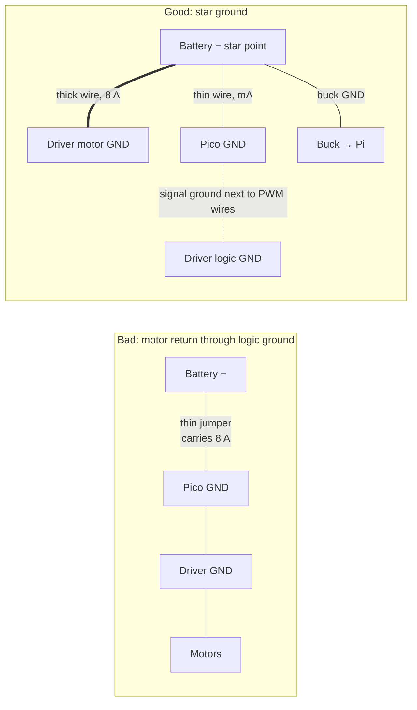

# FE.16 — Ground, common ground and why it matters

<!-- glance:start -->
<!-- generated by tools/build.py from curriculum/syllabus.yaml — edit the syllabus, not this block -->

| | |
|---|---|
| **Track** | Optional foundation |
| **Difficulty** | Beginner |
| **Time** | 35 min |
| **Hardware** | none |
| **Software** | none |
| **Prerequisites** | [FE.02 Ohm's law, series and parallel, voltage dividers](FE.02-ohms-law-series-parallel.md) |
| **Skip if** | You never forget to connect grounds between boards. |

<!-- glance:end -->

## What you will learn

- Explain what "ground" means (a shared reference, not the Earth) and why a voltage only exists between two points.
- Explain why two boards that exchange signals must share a ground, and predict what happens when they don't.
- Trace the return path of every current, and compute the ground shift a shared thin wire creates.
- Lay out karmel's grounds as a star, so motor current doesn't flow through logic ground wires.
- Avoid the classic traps: switching the negative wire, ground loops through a laptop USB cable, and misleading ADC readings.

## Why it matters

karmel has at least four boards that talk to each other: the Pico 2 sends PWM to two DRV8874 drivers, reads encoders and sensors, and talks to the Raspberry Pi over USB, while a buck converter powers the Pi from the battery. Every one of those signals is a voltage **relative to a ground**. If the boards don't agree on where 0 V is, a 3.3 V "high" can look like 2.9 V, a sensor's reading can be off by volts, or a motor can twitch on its own.

[01.07](../../01-first-robot/01.07-power-system.md) wires the power system with a common ground, [01.08](../../01-first-robot/01.08-first-motor-spin.md) connects the Pico to the drivers, and [02.06](../../02-robot-electronics/02.06-noise-grounding-emi.md) debugs the noise that bad grounding causes when motors run. "Forgot to connect the grounds" is the single most common reason a new robot's signals don't work, and a sloppy ground layout is the most common reason they work on the bench and fail when the motors run.

<!-- prereqs:start -->
## Prerequisites

You need these first:

- [FE.02 Ohm's law, series and parallel, voltage dividers](FE.02-ohms-law-series-parallel.md)

### Optional prerequisite links

None.

Check your readiness: `python course.py why FE.16`
<!-- prereqs:end -->

## Concept

A voltage is always a **difference** between two points, like altitude is always measured from somewhere. "The Pico's pin is at 3.3 V" is shorthand for "3.3 V above the Pico's GND pin". **Ground** is simply the point we agree to call 0 V and measure everything else from. In a battery robot it's the battery's negative terminal and every wire connected to it. It has nothing to do with the Earth.

Now connect two boards with one signal wire. The Pico says "3.3 V above **my** ground". The motor driver measures its input "relative to **its** ground". If the two grounds are not connected, the driver has no idea what the Pico's 3.3 V means: the difference between the two grounds is undefined, and it can float anywhere. It's like two services exchanging timestamps without agreeing on a time zone. Each message is well-formed, and the meaning is garbage. **Connecting the grounds is agreeing on the reference.** Every pair of boards that exchanges signals needs a ground connection, unless the link is explicitly isolated (optocouplers, isolated transceivers).

The second idea: **current flows in loops**. Every amp that leaves the battery's positive terminal comes back to its negative terminal. The ground wire is not a "drain" that swallows current; it's half of the circuit, and it carries exactly as much current as the positive wire. A ground wire has resistance, so when a large current flows through it, the two ends of the "0 V" wire are no longer at the same voltage ($V = IR$). If the motors' return current flows through the same thin wire as the Pico's ground, the Pico's 0 V jumps up and down with the motor current.

Hence the rule of good robot wiring: **one common reference, but separate paths**. Heavy currents return to the battery on their own thick wires. Logic grounds join them at a single point. That's a **star ground**.

> [!TIP]
> **Ask your teacher:** "Draw karmel's power and signal wiring and trace, with arrows, the path of the motor current and the path of the Pico's PWM signal current back to the battery. Where do they share a wire?"

## Technical explanation

### Level 1 — The common ground rule

Every signal needs a return path, and the receiver interprets the signal relative to its own ground:

| Link on karmel | Signal | Ground path it relies on |
|---|---|---|
| Pico → DRV8874 IN1/IN2 | 3.3 V PWM | Pico GND ↔ driver logic GND wire |
| Encoders → Pico | 3.3 V pulses | encoder GND pin ↔ Pico GND |
| INA219 / VL53L1X → Pico | I²C | sensor GND ↔ Pico GND |
| Pico ↔ Pi | USB serial | USB cable's ground conductor |
| Buck → Pi | 5 V power | buck output GND ↔ Pi GND |
| Arm adapter ↔ servos | half-duplex serial | 3-pin cable's GND |

**What happens without a common ground** (the Pico's GND wire to the driver missing):

- Sometimes it "works", because the grounds are connected through another path by accident: Pico → USB cable → Pi → buck converter → battery negative → driver. A non-isolated buck's input and output grounds are the same wire. Now the driver's logic reference runs through a USB cable, and motor noise gets coupled into the Pico–Pi link.
- Sometimes the inputs float: motors twitch, spin at random, or do nothing.
- In the worst case, current finds a path through signal pins and their protection diodes, and damages them.

**Rule:** draw the ground wire for every signal connection on purpose, even when it "works without it".

### Level 2 — Ground shift: $V = IR$ in the return wire

A ground wire of resistance $R$ carrying current $I$ has a voltage between its ends:

$$V_\text{shift} = I \cdot R_\text{wire} \qquad R_\text{wire} = \rho_\text{AWG} \cdot L + R_\text{contacts}$$

**Numerical example.** Suppose you wire the motor driver's GND to the Pico's GND pin, and the Pico's GND to the battery with a 30 cm 24 AWG Dupont jumper (0.084 Ω/m) through two pin contacts (about 0.02 Ω). The motors' return current now flows through that jumper.

$R = 0.084 \times 0.30 + 0.02 = 0.045$ Ω.

| Motor current | Ground shift at the Pico | Battery ADC reading error (100 k / 22 k divider) |
|---|---|---|
| 0.8 A cruising | 0.036 V | 0.20 V |
| 4.2 A one wheel stalled | 0.19 V | 1.05 V |
| 8.4 A both stalled | **0.38 V** | **2.11 V** |

Why the ADC error is so large: the battery divider scales 12.6 V down to about 2.3 V, a factor of $122/22 = 5.55$. The Pico converts back by multiplying by 5.55, and a 0.38 V ground error is multiplied too: $0.38 \times 5.55 = 2.11$ V. The robot "sees" its battery drop by 2 V whenever the motors work hard, and a low-battery shutdown triggers early ([01.14](../../01-first-robot/01.14-battery-monitoring.md)).

**Effect on logic.** A 3.3 V CMOS input typically reads "low" below about 0.8 V. A 0.38 V ground shift eats half that margin. Add the fast spikes of PWM switching, which are much larger than the DC shift, and you get corrupted I²C transfers, phantom encoder ticks, or a watchdog reset.

**The fix is layout, not a thicker jumper alone:** with a star ground, the logic ground wire carries only the Pico's own current (about 20–50 mA), so its shift is under a millivolt ($0.02 \times 0.037 = 0.7$ mV).

### Level 3 — Star grounding for karmel

```text
                        BATTERY −  (via BMS P−)
                              │
                     ┌────────●────────┐   ← STAR POINT: a terminal block or a bus bar
                     │   (single point)  │
        thick (18 AWG)│        │         │thick (18 AWG)       thin (22–24 AWG)
                     │        │         │                       │
             DRV8874 left  DRV8874 right  buck converter GND ──── Pi GND (through its 5 V cable)
               motor GND     motor GND           │
                                                  └───────────── Pico GND ─── sensors GND
                                                                    │
                                   Pico GND ── thin wire ── both DRV8874 logic GND pins
                                   (carries only signal return current, mA)
```

Principles:

1. **Motor drivers get their own thick ground wires to the star point.** Motor return current never flows through a logic wire.
2. **Electronics join the star point through their own wires.** The buck converter's ground, the Pico's ground, and the sensors' grounds share only milliamps.
3. **Signal grounds go alongside their signals.** The PWM wires from the Pico to each driver run next to a ground wire from the Pico to the driver's logic GND pin. Twisting a signal with its ground reduces the loop area and the noise it picks up ([02.06](../../02-robot-electronics/02.06-noise-grounding-emi.md)).
4. **Keep it one star.** Once everything meets at one point, don't add "extra" ground wires between boards "for safety". An extra path creates a **ground loop**: current splits between paths, and part of the motor current finds its way back through your logic wires again.

The Pololu DRV8874 carrier has GND pins on both its motor side and its logic side, joined on the board. Connect the thick wire on the motor side and the thin signal ground on the logic side.

### Level 4 — Traps: switched negatives, BMS, USB and earth

**Don't switch the negative wire.** If your power switch or fuse is in the ground wire and you open it while any other connection remains (a USB cable to a laptop, a serial adapter, a second supply), the electronics look for another way back to the battery's negative, and they find it through signal pins, USB ground and protection diodes. Put the **switch and the fuse in the positive wire** ([01.07](../../01-first-robot/01.07-power-system.md)).

**The BMS does switch the negative.** Cheap 3S protection boards disconnect P− (the pack's negative) when they trip. It's usually fine because everything on the robot hangs off P−. But if the robot is also connected to your laptop over USB while the BMS trips, the laptop's USB ground becomes a possible return path. Don't debug stalls with the laptop plugged in, or use a USB isolator for bench work where motors stall.

**Laptop and earth.** A robot on its battery floats: it isn't connected to Earth at all, which is fine. Connecting a USB cable to a laptop on its charger connects the robot's ground to the laptop's ground, and through many chargers to mains earth or a small leakage current. Usually harmless; it matters when you also have a bench power supply earthed through its own plug, which creates a loop through mains earth. If sensor readings change when you plug in the laptop's charger, you've found a ground loop.

**Measure ground, don't assume it.** A multimeter on DC millivolts between two "ground" points shows the shift directly: 0 mV at rest, and a few tens of mV at most with motors running in a good layout.

## Diagram

Where the motor current should and shouldn't flow:



Wiring table for karmel's grounds:

| From | To | Wire | Carries |
|---|---|---|---|
| BMS P− | star point (terminal block) | 18 AWG black | all return current (up to about 10 A) |
| Star point | left DRV8874 GND (motor side) | 18–20 AWG black | left motor return |
| Star point | right DRV8874 GND (motor side) | 18–20 AWG black | right motor return |
| Star point | buck converter GND in | 18–20 AWG black | Pi, USB devices return (up to about 3 A) |
| Buck GND out | Pi (inside the 5 V cable) | 18–20 AWG black | Pi return |
| Star point | Pico GND | 22 AWG black | Pico, sensors (tens of mA) |
| Pico GND | each DRV8874 logic GND | 22–24 AWG, run with IN1/IN2 | PWM signal return (mA) |
| Pico GND | encoder GND, INA219 GND, VL53L1X GND | 24–26 AWG | sensor return (mA) |

## Code

### Ground shift calculator

`ground_shift.py` (any computer, standard library only) reproduces the Level 2 table. Run `python ground_shift.py`.

```python
"""FE.16 — how much does a shared ground wire shift the "0 V" a sensor sees?

Run:  python ground_shift.py
"""
from __future__ import annotations

from dataclasses import dataclass

OHM_PER_M = {"26 AWG": 0.134, "24 AWG": 0.084, "22 AWG": 0.053, "20 AWG": 0.033, "18 AWG": 0.021}


@dataclass(frozen=True)
class GroundPath:
    awg: str
    length_m: float
    contacts_ohm: float        # screw terminals, Dupont pins, connectors

    @property
    def resistance_ohm(self) -> float:
        return OHM_PER_M[self.awg] * self.length_m + self.contacts_ohm

    def shift_v(self, amps: float) -> float:
        return amps * self.resistance_ohm


def adc_battery_error_v(ground_shift_v: float, r_top: float, r_bottom: float) -> float:
    """A divider reading is scaled up by (r_top + r_bottom) / r_bottom — so is the ground error."""
    return ground_shift_v * (r_top + r_bottom) / r_bottom


def main() -> None:
    motor_amps = {"cruising": 0.8, "one stall": 4.2, "both stall": 8.4}
    shared = GroundPath("24 AWG", 0.30, contacts_ohm=0.02)   # Dupont jumper carrying motor return
    star = GroundPath("22 AWG", 0.30, contacts_ohm=0.02)     # logic-only ground wire, ~20 mA
    print(f"shared thin ground: {shared.resistance_ohm * 1000:.0f} mOhm")
    for name, amps in motor_amps.items():
        shift = shared.shift_v(amps)
        err = adc_battery_error_v(shift, 100_000, 22_000)
        print(f"  {name:10} {amps:4.1f} A -> ground shifts {shift:.3f} V, "
              f"battery reading off by {err:.2f} V, logic-low margin left {0.8 - shift:.2f} V")
    print(f"star ground, logic wire carries 0.02 A: shift {star.shift_v(0.02) * 1000:.1f} mV")


if __name__ == "__main__":
    main()
```

Output:

```text
shared thin ground: 45 mOhm
  cruising    0.8 A -> ground shifts 0.036 V, battery reading off by 0.20 V, logic-low margin left 0.76 V
  one stall   4.2 A -> ground shifts 0.190 V, battery reading off by 1.05 V, logic-low margin left 0.61 V
  both stall  8.4 A -> ground shifts 0.380 V, battery reading off by 2.11 V, logic-low margin left 0.42 V
star ground, logic wire carries 0.02 A: shift 0.7 mV
```

### Ground probe on the robot (MicroPython)

`ground_probe.py` runs the left motor at increasing duty and prints the battery voltage the Pico measures through its divider on GP26 ([01.14](../../01-first-robot/01.14-battery-monitoring.md)). Part of the change is real battery sag ([FE.13](FE.13-batteries.md)); the rest is ground shift. Exercise E3 separates the two. Copy it with `mpremote cp ground_probe.py :` and run `mpremote run ground_probe.py`.

```python
"""FE.16-E3 — watch the battery ADC reading move when motor current flows (MicroPython, Pico 2).

Uses karmel's pins: left motor IN1/IN2 on GP2/GP3 (DRV8874, IN/IN mode), battery divider on GP26.
Robot on a stand, wheels in the air. Run:  mpremote run ground_probe.py
"""
import time

from machine import ADC, PWM, Pin

FULL = 65535
DIVIDER = (100_000 + 22_000) / 22_000     # 100 k over 22 k, as in 01.14

in1 = PWM(Pin(2))
in2 = PWM(Pin(3))
for p in (in1, in2):
    p.freq(20_000)
    p.duty_u16(0)
battery = ADC(Pin(26))


def battery_v(samples=32):
    total = 0
    for _ in range(samples):
        total += battery.read_u16()
    return total / samples * 3.3 / FULL * DIVIDER


def run(duty, seconds):
    in1.duty_u16(FULL)                                # forward, drive/brake PWM
    in2.duty_u16(int((1.0 - duty) * FULL))
    t_end = time.ticks_add(time.ticks_ms(), int(seconds * 1000))
    readings = []
    while time.ticks_diff(t_end, time.ticks_ms()) > 0:
        readings.append(battery_v())
    return sum(readings) / len(readings)


try:
    rest = run(0.0, 1.0)
    for duty in (0.3, 0.6, 1.0):
        loaded = run(duty, 1.5)
        print("duty %.1f: battery reads %.2f V (rest %.2f V, change %+.2f V)" % (duty, loaded, rest, loaded - rest))
        run(0.0, 1.0)
finally:
    in1.duty_u16(0)
    in2.duty_u16(0)
```

## Exercise

### Exercise FE.16-E1 — Predict the missing ground `[predict]`

Hardware: none.

karmel is fully wired, and the Pi is connected to the Pico by USB. You remove only the thin wire between the Pico's GND and the left driver's logic GND. **Predict** whether the left motor still responds to PWM, and explain the path its signal return current now takes. Then predict what changes if you also unplug the Pico's USB cable and power the Pico from a separate USB power bank.

### Exercise FE.16-E2 — Ground shift budget `[numerical]`

Hardware: none.

A VL53L1X distance sensor's GND is connected through a 40 cm 26 AWG jumper (0.134 Ω/m, plus 0.03 Ω of contacts) to a point that also carries the right motor's return current.

1. What ground shift does the sensor see at 0.8 A and at a 4.2 A stall?
2. The I²C "low" threshold is about 0.3 × 3.3 V ≈ 1.0 V, and the bus is pulled low to about 0.2 V by the Pico. Is a stall enough to corrupt a bit, ignoring switching spikes?
3. Change `ground_shift.py` to compute the longest 26 AWG wire that keeps the shift under 50 mV at 4.2 A. What does the answer tell you about the layout?

### Exercise FE.16-E3 — Measure ground shift on your robot `[hardware]`

Hardware: `robot-base` (wired through [01.08](../../01-first-robot/01.08-first-motor-spin.md) and [01.14](../../01-first-robot/01.14-battery-monitoring.md)), `tools` (multimeter).

> [!CAUTION]
> **Safety:** Robot on a stand, wheels in the air, switch within reach. Hold the tire only with a gloved hand and only for one to two seconds. Keep the multimeter leads away from the wheels.

1. Set the multimeter to DC millivolts. Put the black probe on the battery negative (BMS P− or the star point) and the red probe on the Pico's GND pin.
2. Run `ground_probe.py`. Note the millivolt reading at rest and at each duty.
3. Briefly slow the left tire with a gloved hand at duty 1.0 and note the peak reading.
4. Move the red probe to the battery positive at the star point: this measures real battery sag. Repeat.
5. Compare the ADC-reported change with (battery sag) + (ground shift × 5.55).

No hardware? Assume readings of 2 mV at rest, 9 mV at duty 1.0 free-running and 48 mV with the tire held; battery sag of 0.05 V and 0.60 V. Compute the expected ADC-reported changes.

### Exercise FE.16-E4 — Debug the I²C errors `[debugging]`

Hardware: none.

A student reports: "The INA219 reads fine on the bench. On the robot, when both motors accelerate, I get `OSError: [Errno 5] EIO` on I²C about once per run." Their wiring: battery − → driver GND → Pico GND (one 24 AWG Dupont chain), and the INA219's GND to the Pico GND. Write a step-by-step diagnosis: what you measure first, what result confirms your hypothesis, and what wiring change you make.

## Expected result

- **FE.16-E1:** The motor **still responds**, because the signal return finds another path: driver logic GND → driver motor GND → star point → buck GND → Pi → USB cable ground → Pico GND. It works, but motor-related noise now rides on the USB ground, and serial errors between the Pi and Pico become more likely. With the Pico powered from a separate power bank and no USB to the Pi, there is **no ground path**: the driver's inputs see an undefined reference. Expect erratic behavior (twitching, full speed, or nothing), and the Pico-to-Pi link is gone too.
- **FE.16-E2:** $R = 0.134 \times 0.4 + 0.03 = 0.084$ Ω. (1) **0.067 V** at 0.8 A and **0.35 V** at 4.2 A. (2) The Pico's low is seen at about $0.2 + 0.35 = 0.55$ V, still under 1.0 V, so the DC shift alone doesn't corrupt a bit. But PWM switching spikes are several times larger than the DC shift, so errors are likely in practice. (3) $L = (0.05/4.2 - 0.03)/0.134 < 0$: **no length works**, because the contacts alone exceed the budget. The sensor ground must not share a wire with motor current at all.
- **FE.16-E3:** In a good star layout, the Pico GND reads **under 10–20 mV** from the battery negative even with the tire held, and the ADC-reported change is almost entirely battery sag. With a shared path you'll see **tens to hundreds of mV**. For the sample numbers: free-running $0.05 + 0.009 \times 5.55 = $ **0.10 V** reported drop; tire held $0.60 + 0.048 \times 5.55 = $ **0.87 V** reported drop, of which about 0.27 V is ground shift, not the battery.
- **FE.16-E4:** Measure DC mV between the INA219's GND and the battery negative while the motors accelerate (min/max mode). A reading of more than a few tens of mV that follows the motor current **confirms** that motor return current flows through the Dupont chain. Fix: thick separate ground wires from each driver's motor GND to the star point, a separate thin ground from the star point to the Pico, sensor grounds from the Pico, and the I²C wires run next to their ground. Then repeat the measurement: the shift should drop to a few mV and the EIO errors should disappear. If they remain, continue with [02.06](../../02-robot-electronics/02.06-noise-grounding-emi.md) (pull-ups, capacitors, wire routing).

## Troubleshooting

### Symptom: signals between two boards don't work at all

1. **Continuity test** (power off) between the two boards' GND pins. Beep → the grounds are connected. No beep → add the wire.
2. **Power on, DC volts between the two GND pins.** It should be 0 V ± a few mV. A volt or more means they're not the same ground (a separate supply, or an isolated converter).
3. **Check the signal relative to the receiver's ground**, not the sender's.

### Symptom: things work until the motors run

1. **Measure DC mV between the logic board's GND and the battery negative** with the motors at high duty. Above about 20–30 mV: motor current shares the logic ground path. Rewire to a star.
2. **If the DC shift is small but errors remain**, the problem is fast switching noise, which a multimeter can't see. Twist signal wires with their grounds, shorten them, add decoupling capacitors, and move them away from motor wires ([02.06](../../02-robot-electronics/02.06-noise-grounding-emi.md)).

### Symptom: sensor readings change when you plug in the laptop charger

A ground loop through mains earth. Run the robot on its battery with the laptop on battery power, or use a USB isolator for measurements. Don't "fix" it by cutting a ground wire on the robot.

### Symptom: the Pico's battery reading drops by volts when the motors start

Separate real sag from ground shift (E3): measure battery + to battery − directly at the star point during the same event. If the direct measurement drops much less than the ADC reading, the divider's ground reference is shifting.

## Common mistakes

- **Not connecting the grounds** between the Pico and the motor drivers, sensors or a second supply.
- **Relying on an accidental ground path** (through USB) that happens to work.
- **Daisy-chaining the motor return through the logic boards.**
- **Adding extra ground wires "to be safe"**, creating loops that bring motor current back into logic wires.
- **Putting the switch or fuse in the negative wire.**
- **Thinking ground is where current "disappears".** Every return current flows through a real wire with real resistance.
- **Taking the divider's ground from a point far from the battery negative.**

## Knowledge check

1. What is "ground" in a battery-powered robot?
   <details><summary>Answer</summary>

   The reference point everyone agrees to call 0 V, normally the battery's negative terminal and the wires connected to it. It has nothing to do with the Earth; a battery robot isn't connected to Earth at all.
   </details>

2. Why must the Pico and a motor driver share a ground if the driver has its own supply?
   <details><summary>Answer</summary>

   The driver interprets the Pico's input voltage relative to its own ground. Without a connection between the grounds, the difference between them is undefined, so "3.3 V" has no meaning at the driver, and the signal current has no return path.
   </details>

3. 6 A of motor current flows through a 0.05 Ω shared ground connection. What shift does a sensor on that ground see, and how does a 100 k / 22 k divider reading change?
   <details><summary>Answer</summary>

   $6 \times 0.05 = 0.3$ V. Through the divider's factor of 5.55 the battery reading is off by about 1.66 V.
   </details>

4. Predict: you open a switch in the battery's negative wire while the robot's Pi is still connected to your laptop by USB and the Pico is connected to the Pi. What can happen?
   <details><summary>Answer</summary>

   The circuits still have positive supply and look for a return path to the battery's negative. They can find one through the laptop's USB ground and the signal pins' protection diodes, pushing current through parts not designed for it. Some boards stay half-powered and misbehave; pins or USB ports can be damaged. Switch the positive wire instead.
   </details>

5. What is a star ground, and what problem does it solve?
   <details><summary>Answer</summary>

   All ground returns meet at a single point near the battery, with heavy-current loads (motors) wired there on their own thick wires and logic on separate thin wires. It stops motor return current from flowing through logic ground wires and shifting the logic's 0 V.
   </details>

6. Debugging: encoder counts jump by a few ticks every time the robot reverses direction, even when the wheel is held still by hand. Name a grounding cause and the measurement that confirms it.
   <details><summary>Answer</summary>

   Motor current spikes during reversal flow through a ground wire shared with the encoders, and the ground shift (plus switching spikes) crosses the Pico's input threshold, creating false edges. Measure mV between the encoder GND and the battery negative during reversal (min/max mode); a large reading confirms it. Rewire the encoder ground to the Pico and the motor return separately to the star point.
   </details>

## Practical challenge

Produce a grounding map of your karmel and prove it. Draw every ground wire (a photo with annotations or a diagram), mark the star point, and list every current above 100 mA with its return path. Then measure the DC mV between the star point and: the Pico GND, each driver's logic GND, the INA219 GND and the Pi's GND (a GPIO GND pin), at rest and with both wheels at 100 % duty on the stand.

**Acceptance criteria:** no logic ground point shifts more than **20 mV** at 100 % duty; no motor return current flows through a wire thinner than 20 AWG or through any logic board; the battery ADC reading at 100 % duty agrees with a direct multimeter measurement of the pack to within 0.15 V.

## You can skip this if…

You answer knowledge-check questions 2, 3, 4 and 6 correctly without looking, and your robot's logic grounds shift less than 20 mV when the motors run.

`python course.py skip FE.16 --reason "I wire common and star grounds and measure ground shift"`

## Go deeper

- Analog Devices, Analog Dialogue, *Staying Well Grounded*: https://www.analog.com/en/resources/analog-dialogue/articles/staying-well-grounded.html (Zumbahlen, 2012) — why ground return currents create unwanted voltages, and how to separate high-current and sensitive grounds; written for circuit boards, but the principles are the same for a robot harness.
- All About Circuits textbook, DC chapters: https://www.allaboutcircuits.com/textbook/ — voltage as a difference between two points, and why every circuit is a loop.
- SparkFun, Voltage, Current, Resistance, and Ohm's Law: https://learn.sparkfun.com/tutorials/voltage-current-resistance-and-ohms-law — the "voltage between two points" idea with ground as the reference.
- Pololu, DRV8874 carrier: https://www.pololu.com/product/4035 — see how the carrier separates motor-side and logic-side connections.

## Progress checkpoint

- [ ] I can explain ground as a shared reference and why boards exchanging signals need a common ground.
- [ ] I can trace return currents and compute the ground shift a shared wire creates.
- [ ] I wire karmel's grounds as a star, with motor returns separate from logic returns.
- [ ] I avoid switched negatives and ground loops, and I measure ground shift instead of guessing.

`python course.py complete FE.16` (exercises done) · `python course.py master FE.16` (challenge done) · `python course.py struggle FE.16 "what was hard"`

Next: [FE.17 — Soldering from zero](FE.17-soldering.md), or back to [01.07](../../01-first-robot/01.07-power-system.md) if you came from there.
