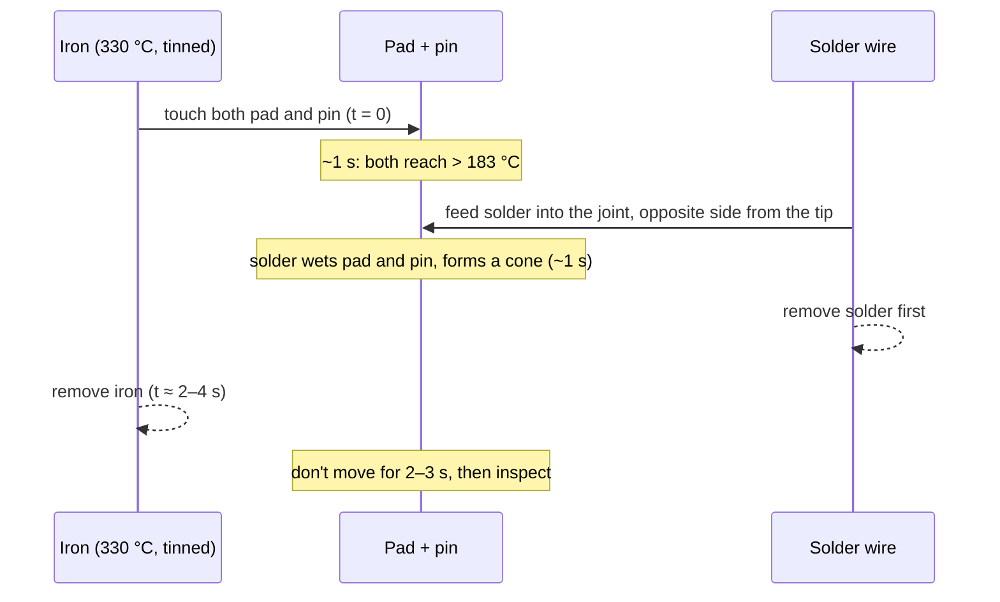

# FE.17 — Soldering from zero

<!-- glance:start -->
<!-- generated by tools/build.py from curriculum/syllabus.yaml — edit the syllabus, not this block -->

| | |
|---|---|
| **Track** | Optional foundation |
| **Difficulty** | Beginner |
| **Time** | 1 h 30 min |
| **Hardware** | Workbench tools (multimeter, soldering iron, crimper, screwdrivers) (stage 1) |
| **Software** | none |
| **Prerequisites** | [FE.04 Breadboards, jumpers and connectors](FE.04-breadboards-and-connectors.md) |
| **Skip if** | You solder clean through-hole joints. |

<!-- glance:end -->

## What you will learn

- Set up a safe soldering station and protect yourself from burns, flux fumes, lead and flying lead clippings.
- Tin an iron tip and make clean, reliable through-hole joints on header pins.
- Recognize good and bad joints (cold, dry, blob, bridge, disturbed) by eye, and fix them.
- Desolder a pin with braid and a pump.
- Splice and insulate wires, and solder wires to heavy connectors such as XT60 without damaging them.
- Test your work with a multimeter and a bridge-finding script before applying power.

## Why it matters

Most karmel parts arrive with loose header pins: the DRV8874 carriers, the INA219 and VL53L1X breakouts, and the Pico 2 if you bought it without headers. The battery leads need XT60 connectors, and motor wires need extending. [01.03](../../01-first-robot/01.03-workbench-and-tools.md) sets up your workbench and has you solder your first headers. [02.08](../../02-robot-electronics/02.08-from-breadboard-to-perfboard.md) moves the robot's electronics from a breadboard to a soldered board that survives vibration. Bad solder joints are the worst kind of bug: intermittent, invisible, and sensitive to temperature and vibration. A robot that "sometimes" loses an encoder or resets when it hits a bump often has one cold joint. An hour of deliberate practice here saves days of debugging later.

<!-- prereqs:start -->
## Prerequisites

You need these first:

- [FE.04 Breadboards, jumpers and connectors](FE.04-breadboards-and-connectors.md)

### Optional prerequisite links

None.

Check your readiness: `python course.py why FE.17`
<!-- prereqs:end -->

## Concept

Soldering is not gluing. Solder is a metal alloy with a low melting point (183 °C for the common 63/37 tin-lead alloy). When you heat **both** metal parts, the pad and the pin, above that temperature and feed solder in, the molten solder **wets** them: it flows over the surfaces and forms a thin metallic bond with the copper. When it cools you have an electrical and mechanical connection made of metal.

Two ideas make the difference between a good and a bad joint:

1. **Heat the parts, not the solder.** The iron heats the pad and the pin. The solder melts when it touches the hot parts and flows toward the heat. If you melt solder on the iron tip and drip it onto a cold pin, it sits on top as a ball without bonding: a **cold joint**. It may conduct today and fail next week.
2. **Flux cleans the surfaces.** Metal surfaces oxidize, and solder doesn't stick to oxide. Flux is a chemical inside the solder wire's core (and available as a pen or paste) that removes the oxide at soldering temperature. It works for a few seconds, then burns off. That's why you feed fresh solder into the joint instead of reusing old solder from the tip, and why you add flux when reworking a joint.

The whole motion for a header pin takes about 3 seconds: touch the iron to the pad and pin together (1 s), feed solder into the joint (1 s), remove the solder, remove the iron, don't move anything for a moment. Good joints look like small shiny volcanoes around the pin.

> [!TIP]
> **Ask your teacher:** "I'll describe what my solder joint looks like. Tell me what went wrong and what to change in my technique: temperature, time, or the order of the steps."

## Technical explanation

### Level 1 — Safety and the workstation

> [!CAUTION]
> **Safety — read before you plug in the iron:**
> - **Burns.** The tip is at 300–400 °C and stays hot for minutes after unplugging. Always put the iron back in its stand, never on the desk. Never catch a falling iron. Keep the cable where you can't hook it with an elbow. For a burn: cool it under cool running water for 20 minutes. For a serious burn, call Magen David Adom, 101.
> - **Flux fumes.** The smoke is flux (rosin), not lead. Rosin fumes are a respiratory irritant and sensitizer and can cause asthma with repeated exposure. Work in a ventilated room with a window open, and use a fume extractor or a small fan that pulls the smoke **away** from your face (not blowing it around the room). Don't lean over the joint.
> - **Lead.** The course uses leaded 63/37 solder because it's much easier to learn with. Lead enters the body by **swallowing**, not from soldering fumes: wash your hands with soap after soldering, don't eat, drink or smoke at the bench, keep the bench away from the kitchen, and keep children and pregnant people away from it. Lead-free solder avoids this but needs higher temperatures and more skill.
> - **Eyes.** Clipped leads fly across the room and solder can spatter. Wear safety glasses, and hold the lead while you cut it.
> - **Fire and batteries.** Work on a heat-resistant mat. Unplug the iron whenever you leave the bench. **Never solder directly to 18650 cells**, and never solder battery wires while they're connected to a charged pack (see Level 4).

**Tools** (from the course's tools list, catalog id `tools`):

| Tool | Why | Notes |
|---|---|---|
| Temperature-controlled iron (60–80 W, for example a 908S-type 230 V pencil iron, or a Pinecil V2 on a ≥45 W USB-C PD charger) | Holds its temperature when you touch a big pad | Avoid cheap 30 W irons without regulation: too cold on connectors, too hot at idle |
| Chisel or bevel tip, 2–3 mm | Transfers heat much better than a fine conical tip | Use fine tips only for small SMD work |
| 63/37 rosin-core solder, 0.8 mm | Melts at 183 °C and has no pasty range, so joints are easy | 1 mm is fine for wires and connectors |
| Flux pen | Rework, desoldering, wires | "No-clean" flux is convenient |
| Brass wool tip cleaner | Cleans the tip without cooling it | Better than a wet sponge |
| Stand / helping hands | Holds the iron and the work | |
| Flush cutters, wire strippers | Trim leads, strip insulation cleanly | |
| Desoldering braid and a solder pump | Removing solder | |
| Heat shrink tubing, a heat source | Insulating splices | A hot-air tool or a lighter used carefully |
| Multimeter | Continuity and bridge checks | [FE.03](FE.03-multimeter.md) |

### Level 2 — The through-hole joint, step by step

**Temperature:** 320–350 °C for 63/37 leaded solder, 350–380 °C for lead-free. Hotter isn't better: it burns the flux before it works, and it can lift pads off the board.

**1. Tin the tip.** Heat the iron. Wipe the tip in the brass wool. Immediately melt a little solder onto the working surface of the tip, so it's shiny and silver. A tinned tip transfers heat; a dull black oxidized tip doesn't. Re-tin before you put the iron back in the stand.

**2. Fix the part.** Insert the header pins into the board. For header strips, a trick: push the long ends of the pins into a breadboard, lay the breakout board on top, and solder with the board held square. Solder **one pin at each end first**, check that the header is straight, then do the rest.

**3. Heat pad and pin together.** Put the tip where the pin meets the pad, touching both, with a tiny drop of solder on the tip as a "heat bridge". Count about 1 second.

**4. Feed solder into the joint**, on the opposite side of the pin from the tip, not onto the tip. The solder melts and flows around the pin and over the pad. For a 0.1″ header, about 3–5 mm of 0.8 mm wire is enough.

**5. Remove the solder, then the iron.** Pull the solder wire away first, then lift the iron smoothly away along the pin. Total contact time: 2–4 seconds.

**6. Don't move it** for 2–3 seconds while it solidifies. Movement while solidifying makes a grainy "disturbed" joint.

**7. Inspect** (Level 3), and trim leads for through-hole components (not header pins) just above the joint.

### Level 3 — Reading joints and fixing them

```text
   GOOD                 COLD / BLOB          DRY (too little)      BRIDGE
     │ pin                  │                    │                   │     │
    ╱│╲  concave cone      (●)  ball, doesn't   ─┼─  pad not fully   ╱│╲━━━╱│╲  solder joins
   ╱ │ ╲ shiny, pad        ╱│╲  wet the pad      │   covered, hole  ╱ │ ╲ ╱ │ ╲ two pins
  ▔▔▔▔▔▔▔ fully covered   ▔▔▔▔▔                 ▔▔▔  visible        ▔▔▔▔▔▔▔▔▔▔▔▔▔
```

| Defect | Looks like | Cause | Fix |
|---|---|---|---|
| **Good** | Shiny (leaded) or satin (lead-free) cone, concave sides, pad fully wetted, pin outline visible | — | — |
| **Cold joint** | Dull, grainy, a ball that doesn't blend into the pad, or a visible ring gap | Pad or pin not hot enough, solder melted on the tip and dripped | Add flux, reheat pad and pin together until the solder flows, add a little fresh solder |
| **Blob / too much** | Round ball hiding the pin | Too much solder, or not enough heat for it to flow | Reheat and draw excess away with the iron or braid |
| **Dry / too little** | Pad partly bare, hole not filled | Too little solder or too short heating | Reheat, add solder |
| **Bridge** | Solder connects two pins | Too much solder, dragging the tip across pins | Flux, then drag the clean tip away from the bridge between the pins, or use braid |
| **Disturbed** | Frosty, cracked surface | Part moved while cooling | Reheat, hold still |
| **Burnt / lifted pad** | Brown board, pad loose from the board | Too hot for too long, pressure on the pad | Hard to fix: a wire to the next point on the trace. Prevention: lower temperature, shorter contact |

**Why bridges and cold joints matter on a robot:** a bridge between two DRV8874 inputs makes the motor's truth table do something unexpected ([FE.12](FE.12-h-bridges-motor-drivers.md)). A bridge between 3V3 and GND on a breakout is a short. A cold joint on an encoder pin conducts on the bench and opens intermittently when the chassis vibrates.

**Desoldering.** To remove a bad joint or a wrong part:

- **Braid:** add flux to the joint, lay the braid on it, press the hot iron on top of the braid for 2–3 s. The solder wicks into the copper braid. Lift braid and iron together (if you lift the iron first, the braid solders itself to the board). Cut off the used part.
- **Pump:** cock the pump, melt the joint, put the pump's nozzle next to it, move the iron away and trigger immediately.
- A header strip with many pins: cut the plastic spacer and remove pins one at a time.

### Level 4 — Wires, splices and heavy connectors

**Heat and thermal mass.** A heavy connector needs much more heat than a header pin. A rough number: an XT60 pin plus the wire end is about 1.5 g of brass and copper (specific heat about 0.385 J/g·K). Heating it from 25 °C to 250 °C takes

$$E = m \cdot c \cdot \Delta T = 1.5 \times 0.385 \times 225 \approx 130\ \text{J}$$

At the roughly 20 W an 80 W iron can actually push through a tip contact, that's about 6–7 s. A cheap 30 W iron delivering 8 W needs 16 s, while its tip cools and the plastic housing melts. A header pin (about 0.05 g) needs only about 4 J: a fraction of a second. That's why you use a bigger tip and a higher-power, temperature-controlled iron (not a higher temperature) for connectors.

**Tinning a stranded wire.** Strip 5–6 mm, twist the strands, heat the wire from below and let the solder wick into the strands. Stop as soon as the strands are filled. Don't tin wires that go into screw terminals: the solder slowly flows under pressure ("cold flow") and the terminal loosens. Use ferrules or bare twisted wire there.

**Splicing two wires (for example extending a motor lead):**

1. **Slide heat shrink onto one wire first.** Everyone forgets this once.
2. Strip 8–10 mm on both, twist them together in line (an "in-line" or "Western Union" splice), or lay them side by side.
3. Heat from below and feed solder until it flows through. Keep it short: no big lump.
4. Let it cool, slide the heat shrink over the joint (at least 5 mm beyond the bare metal on each side) and shrink it.
5. **Tug test:** a firm pull shouldn't move anything.

**XT60 connectors on battery leads:**

> [!CAUTION]
> **Safety:** Solder XT60s onto wires that are **not** connected to a battery. If you must attach a connector to a pack's leads, do **one wire at a time**: cut and insulate the other wire's end completely with tape first, and never let the iron, a stray strand or the solder bridge the two. A shorted Li-ion pack delivers hundreds of amps: it welds tools, burns you, and can start a fire ([FE.14](FE.14-lithium-battery-safety.md)). The pack side of a connection gets the **female** XT60 (shielded contacts), so its live contacts can't be shorted by accident.

1. Put the XT60 into its mating connector (a spare, or one already soldered) while you solder. It acts as a heat sink and keeps the pins aligned if the plastic softens.
2. Pre-fill the connector's solder cup with solder.
3. Tin the wire end (16–18 AWG for karmel's battery leads).
4. Heat the cup, and when the solder in it is molten, push the tinned wire in. Hold still until it solidifies.
5. Slide the heat shrink over the cup. Check polarity against the molded + and − marks before shrinking.

**Never solder to 18650 cells.** The cell's internal seal and separator can be damaged by the heat long before the joint is done. Use spot-welded packs or a cell holder, and solder to the holder's tabs or the BMS instead.

## Diagram

The joint sequence and timing:



A soldering bench layout (right-handed; mirror it if you're left-handed):

```text
   window / fume extractor pulling smoke away from you
 ┌───────────────────────────────────────────────────────────────┐
 │  [fan / extractor]                                            │
 │                                                               │
 │  [helping hands]      [heat-resistant mat]       [iron stand] │
 │    holds the board      work happens here           + brass   │
 │                                                     wool      │
 │  [solder reel]  [flux pen]  [braid]  [cutters]   iron cable → │
 │                                                  routed away  │
 │  [multimeter]      NO batteries, food or drinks on this bench │
 └───────────────────────────────────────────────────────────────┘
          you: safety glasses on, sleeves up, hair tied back
```

## Code

After soldering headers on a Pico 2 (or any board you plug into it), `solder_check.py` finds shorts to 3V3/GND and bridges between GPIOs. It uses only internal pull resistors and never drives a pin that is shorted, so it's safe to run with **nothing but the USB cable** connected. Copy and run it with `mpremote run solder_check.py` ([FC.02](../cpp-and-embedded/FC.02-micropython-on-pico.md)).

```python
"""FE.17 — find solder bridges and shorts on a freshly soldered Pico 2 header (MicroPython).

Connect ONLY the USB cable: nothing else may be plugged into the Pico's pins.
Run:  mpremote run solder_check.py
"""
import time

from machine import Pin

# GPIOs that reach the header pins (GP23, GP24, GP25 and GP29 are used on the board itself)
HEADER_GPIOS = list(range(0, 23)) + [26, 27, 28]


def settle():
    time.sleep_ms(5)


def discharge(n):
    """Drive a known-good pin low before using its pull-down. RP2350 erratum E9: a pad left at a
    high voltage with only the internal pull-down enabled can stay stuck near 2.2 V."""
    Pin(n, Pin.OUT, value=0)
    settle()


def stuck_pins():
    """Pull-down reads high -> shorted to 3V3. Pull-up reads low -> shorted to GND.
    Only inputs with pulls are used here, so a shorted pin is never driven against its short."""
    problems, bad = [], set()
    for n in HEADER_GPIOS:
        pin = Pin(n, Pin.IN, Pin.PULL_DOWN)       # pins start low after reset
        settle()
        if pin.value() == 1:
            problems.append("GP%d shorted to 3V3" % n)
            bad.add(n)
            continue
        pin = Pin(n, Pin.IN, Pin.PULL_UP)
        settle()
        if pin.value() == 0:
            problems.append("GP%d shorted to GND" % n)
            bad.add(n)
            continue
        discharge(n)
        Pin(n, Pin.IN, Pin.PULL_DOWN)
    return problems, bad


def bridges(pins):
    """Drive one pin high while the others are pulled down; any other pin reading high is bridged."""
    found = []
    for driven in pins:
        inputs = {n: Pin(n, Pin.IN, Pin.PULL_DOWN) for n in pins if n != driven}
        Pin(driven, Pin.OUT, value=1)
        settle()
        for n, pin in inputs.items():
            if pin.value() == 1 and (n, driven) not in found:
                found.append((driven, n))
        discharge(driven)
        Pin(driven, Pin.IN, Pin.PULL_DOWN)
    return found


def main():
    problems, bad = stuck_pins()
    good = [n for n in HEADER_GPIOS if n not in bad]
    for a, b in bridges(good):
        problems.append("GP%d bridged to GP%d" % (a, b))
    for n in HEADER_GPIOS:
        Pin(n, Pin.IN)                            # leave every pin as a plain input
    if problems:
        print("PROBLEMS FOUND:")
        for p in problems:
            print("  " + p)
    else:
        print("OK: %d header GPIOs, no shorts to GND/3V3, no bridges" % len(HEADER_GPIOS))


main()
```

On a good board it prints `OK: 26 header GPIOs, no shorts to GND/3V3, no bridges`. With a bridge between GP4 and GP5 and GP17 shorted to GND, it prints:

```text
PROBLEMS FOUND:
  GP17 shorted to GND
  GP4 bridged to GP5
```

The script can't see bridges between power pins (VSYS, 3V3, GND) or a cold joint that still conducts. Check those with the multimeter (E2) and your eyes (Level 3).

## Exercise

### Exercise FE.17-E1 — Twenty joints and five removals `[hardware]`

Hardware: `tools` (iron, solder, flux, braid, cutters, safety glasses), a small perfboard and a strip of 20 header pins or resistors.

> [!CAUTION]
> **Safety:** Glasses on, window open or fan pulling fumes away, iron in its stand between joints, wash your hands afterwards.

1. Tin the tip. Solder 20 header pins in a row into the perfboard, one at a time, using the 7-step method. Time yourself on the last five.
2. Inspect every joint with a phone camera zoomed in. Classify each as good / cold / blob / dry / bridge.
3. Fix every bad joint. Then deliberately bridge two pins and remove the bridge.
4. Desolder five joints with braid and remove the pins.

### Exercise FE.17-E2 — Headers on karmel's breakouts `[hardware]`

Hardware: `robot-base` (the DRV8874 carriers and INA219 breakout with their loose headers), `tools` (iron, multimeter).

1. Use the breadboard trick to hold the headers square. Solder one pin at each end, check alignment, then solder the rest.
2. Inspect every joint.
3. With the multimeter in continuity mode, test every pair of **adjacent** pins: none should beep, except pins that are the same net by design (the carrier's duplicated GND or VIN pins; check the Pololu pinout).
4. Test continuity from each header pin to the pad trace it belongs to on the board (for example GND pin to the GND pad on the other side).

### Exercise FE.17-E3 — A splice and an XT60 lead `[hardware]`

Hardware: `tools` (iron, heat shrink, strippers), 18 AWG wire, one XT60 pair from the `robot-base` parts.

1. Splice two 20 cm pieces of wire with an in-line splice and heat shrink. Tug-test it.
2. Solder the male XT60 onto a red/black pair of **loose wires** (not connected to any battery), following Level 4. Mind the polarity marks.
3. Measure the resistance through the splice with the multimeter (probe clips on both ends, zero the leads first). It should read the same as an unspliced wire of equal length within the meter's resolution.

### Exercise FE.17-E4 — Diagnose the joints `[debugging]`

Hardware: none.

For each description, name the defect, the likely cause and the fix:

1. A dull grey ball on top of a header pin, with a dark ring where it meets the pad. The pin wiggles slightly.
2. A shiny joint, but the multimeter beeps between this pin and its neighbor.
3. A satin, slightly grainy cone on lead-free solder, with the pad fully covered and a concave shape.
4. A header pin that tested fine on the bench. On the robot, the encoder counts drop out when the chassis vibrates.
5. The pad came off the board together with the solder when you tried to rework it for the third time.

### Exercise FE.17-E5 — Run the bridge checker `[coding]`

Hardware: `robot-base` (a Pico 2 with headers you soldered yourself, USB cable only). No Pico or pre-soldered headers? Run it in CPython with a fake `machine` module.

1. Run `solder_check.py` on the Pico with nothing connected to its pins.
2. **Predict**, then test: put a jumper wire between GP14 and GP15 on a breadboard and run it again. What does it print? Remove the jumper.
3. No hardware: write `machine.py` with a `Pin` class that records each pin's mode, pull and value, and simulates a bridge between GP4 and GP5 plus GP17 shorted to GND. Run the script against it (replace `time.sleep_ms` with a no-op) and check it prints exactly those two problems.

## Expected result

- **FE.17-E1:** By the last five joints, each takes **3–5 s** and looks like a shiny cone with the pad fully covered. A typical first session has 3–6 defective joints out of 20, mostly cold joints and blobs, all fixable. A removed bridge leaves two separate cones. Desoldered holes are open enough to push a new pin through.
- **FE.17-E2:** All joints are shiny cones. No beep between adjacent pins that are different nets. Every pin beeps to its own pad and trace. If two different nets beep, look for a bridge on either side of the board, including under the plastic spacer.
- **FE.17-E3:** The splice survives a firm tug, and the heat shrink covers all bare metal with overlap. The XT60's + wire (red) goes to the + molded mark. The spliced wire's resistance is indistinguishable from a plain wire: typically **0.0–0.1 Ω** on a hobby meter (the splice adds micro-ohms; most of the reading is probe resistance).
- **FE.17-E4:** (1) **Cold joint**: pad not heated, solder dripped from the tip. Add flux, reheat pad and pin until the solder flows, add fresh solder. The wiggle means it isn't bonded. (2) **Bridge**: too much solder or dragged tip. Flux, and drag the tip away between the pins, or use braid. (3) **Good joint**: lead-free solder looks satin, not mirror-bright. (4) **Intermittent cold or cracked joint** on that encoder pin: reflow every pin in that connector with flux, and add strain relief to the cable. (5) **Lifted pad** from repeated overheating: repair with a short wire to the next point on the same trace. Prevent it with a lower temperature, shorter contact and flux.
- **FE.17-E5:** (1) `OK: 26 header GPIOs, no shorts to GND/3V3, no bridges`. (2) Prediction and result: `GP14 bridged to GP15`, the jumper acts exactly like a solder bridge. (3) The fake prints `GP17 shorted to GND` and `GP4 bridged to GP5`, nothing else.

## Troubleshooting

### Symptom: solder won't melt or flow onto the pad

1. **Look at the tip.** Black and dull → oxidized. Wipe in brass wool and re-tin it immediately. If solder won't stick at all, use tip tinner or replace the tip.
2. **Is the tip touching both pad and pin?** Use the flat of a chisel tip, and add a tiny drop of solder as a heat bridge.
3. **Is the part a big thermal mass** (ground pad, connector, thick wire)? Use a bigger tip and wait longer, or raise the temperature by 20–30 °C, not more.
4. **Is the pad dirty or old?** Add flux.

### Symptom: joints look fine but the circuit doesn't work

1. **Continuity test** each connection from pin to trace, and between neighbors for bridges.
2. **Wiggle test** with power on and a meter on the signal: gently press on each suspicious joint with a plastic tool. A reading that jumps → reflow that joint.
3. **Check the part's orientation** (header on the wrong side, board upside down): the solder may be perfect on the wrong pin.

### Symptom: the iron tip keeps going black within minutes

Temperature too high, or it sits in the stand un-tinned. Lower it to 320–340 °C for leaded solder, and always leave a blob of solder on the tip before putting it in the stand. Don't file or sand plated tips.

### Symptom: the heat shrink doesn't fit over the joint

The splice is too bulky or the tubing too small. Redo the splice shorter, or use tubing 2–3 times the wire diameter before shrinking. Remember to slide it on before soldering next time.

## Common mistakes

- **Melting solder on the tip and dripping it onto the joint.** Heat the parts, feed solder into the joint.
- **Too hot for too long.** It burns the flux, lifts pads and damages parts. 2–4 s at 320–350 °C.
- **Moving the part while the joint solidifies.**
- **Using too much solder** "to be sure". It hides cold joints and creates bridges.
- **Forgetting the heat shrink** before soldering a splice.
- **Tinning wires for screw terminals.**
- **Soldering on a live battery lead or directly to Li-ion cells.**
- **Breathing the flux smoke and eating at the bench.**
- **Skipping the continuity check before first power-up.**

## Knowledge check

1. Why do you heat the pad and the pin rather than the solder?
   <details><summary>Answer</summary>

   Solder only bonds (wets) to metal that is itself above the solder's melting point. Molten solder dripped onto cold parts sits on top as a ball: a cold joint without a metallic bond.
   </details>

2. What does flux do, and why does re-melting an old joint without adding flux often fail?
   <details><summary>Answer</summary>

   Flux removes oxide from the metal surfaces at soldering temperature so solder can wet them. The flux in the old joint burned off during the first soldering, so reworking needs fresh flux (a flux pen or fresh cored solder).
   </details>

3. Describe a good through-hole joint and two defects.
   <details><summary>Answer</summary>

   Good: a concave cone, shiny (leaded) or satin (lead-free), pad fully covered, pin outline visible. Cold joint: dull, grainy ball not blended into the pad. Bridge: solder connecting two adjacent pins.
   </details>

4. Predict: you solder an XT60 with a 30 W unregulated iron with a fine conical tip. What happens?
   <details><summary>Answer</summary>

   The connector's thermal mass (about 130 J to reach 250 °C) is far more than the small tip can deliver quickly. The solder turns pasty and grainy (cold joint), you hold the iron on for a long time, and the connector's plastic housing softens and the pins shift. Use a 60–80 W temperature-controlled iron with a large chisel tip, and a mating connector to hold the pins.
   </details>

5. What are the three main health hazards of soldering and one control for each?
   <details><summary>Answer</summary>

   Burns: iron always in the stand, cool running water for 20 minutes if burned. Flux fumes: ventilation and a fan or extractor pulling them away. Lead: wash your hands, no food or drink at the bench, keep children away. (Also eye injuries from clipped leads: safety glasses.)
   </details>

6. Why shouldn't you solder wires directly onto an 18650 cell?
   <details><summary>Answer</summary>

   The heat needed to solder to the cell's steel can damages its internal seal and separator, which can lead to leaks or internal shorts later. Use spot-welded tabs or a holder.
   </details>

7. Debugging: the Pico's encoder input counts correctly on the bench, but loses counts when the robot drives over a door threshold. What do you suspect, and how do you confirm it?
   <details><summary>Answer</summary>

   An intermittent cold or cracked joint (or a loose connector) on the encoder signal or ground. Confirm with a wiggle test: with the Pico printing counts and the wheel still, gently press and flex the joints and cable. Jumps or dropouts point to the bad joint. Reflow it with flux, and add strain relief.
   </details>

## Practical challenge

Build karmel's small power distribution board on perfboard: an input from the battery XT60 (female, on the pack side), a 5×20 mm fuse holder, a screw terminal block as the star ground point ([FE.16](FE.16-grounding.md)), two motor-driver power outputs and one regulator output, with 18 AWG wires soldered to the board and heat-shrunk.

**Acceptance criteria:** every joint passes visual inspection (photos of both sides); no continuity between + and − anywhere with the fuse removed; less than 0.05 Ω (meter limit) from the XT60 + to each + output with the fuse in; the board survives a firm shake and tug test on every wire; first power-up is done through a current-limited bench supply or with the fuse in place and a multimeter on the outputs, before connecting any load.

> [!CAUTION]
> **Safety:** Build and test this board with no battery connected. Connect the pack only after the continuity checks pass, with the switch off and the fuse in place.

## You can skip this if…

You answer knowledge-check questions 1, 2, 4 and 7 correctly without looking, and you can solder a 20-pin header with no bridges and no cold joints in under five minutes, and splice a wire with heat shrink that passes a tug test.

`python course.py skip FE.17 --reason "I solder clean through-hole joints and splices"`

## Go deeper

- Adafruit, Adafruit Guide to Excellent Soldering: https://learn.adafruit.com/adafruit-guide-excellent-soldering — photos of good and bad joints, tools and rework.
- SparkFun, How to Solder: Through-Hole Soldering: https://learn.sparkfun.com/tutorials/how-to-solder-through-hole-soldering — step-by-step technique with pictures, including safety notes.
- Adafruit, soldering tools page: https://learn.adafruit.com/adafruit-guide-excellent-soldering/tools — what each tool does and what to buy first.
- Pololu, DRV8874 carrier: https://www.pololu.com/product/4035 — the pinout you'll check for bridges after soldering its headers.

## Progress checkpoint

- [ ] I set up a safe soldering bench: ventilation, stand, glasses, no food, no batteries.
- [ ] I make clean through-hole joints in 2–4 seconds and recognize cold joints, blobs and bridges.
- [ ] I desolder with braid and a pump.
- [ ] I splice wires with heat shrink and solder heavy connectors like XT60 safely.
- [ ] I verify my soldering with continuity checks and `solder_check.py` before applying power.

`python course.py complete FE.17` (exercises done) · `python course.py master FE.17` (challenge done) · `python course.py struggle FE.17 "what was hard"`

Next: [FE.18 — Capacitors, diodes and flyback protection](FE.18-capacitors-diodes.md), or back to [01.03](../../01-first-robot/01.03-workbench-and-tools.md) if you came from there.
