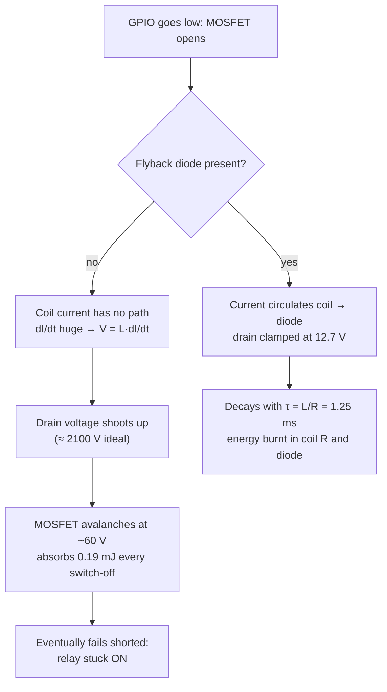

# FE.18 — Capacitors, diodes and flyback protection — just enough

<!-- glance:start -->
<!-- generated by tools/build.py from curriculum/syllabus.yaml — edit the syllabus, not this block -->

| | |
|---|---|
| **Track** | Optional foundation |
| **Difficulty** | Intermediate |
| **Time** | 45 min |
| **Hardware** | none |
| **Software** | none |
| **Prerequisites** | [FE.02 Ohm's law, series and parallel, voltage dividers](FE.02-ohms-law-series-parallel.md) |
| **Skip if** | You know what decoupling caps and flyback diodes do. |

<!-- glance:end -->

## What you will learn

- Explain what a capacitor does in a robot circuit, and place decoupling and bulk capacitors correctly.
- Compute the voltage droop a bulk capacitor allows and the time constant of an RC filter.
- Pick a capacitor's type and voltage rating, and never install an electrolytic backwards.
- Explain why switching off an inductive load (motor, relay coil) creates a voltage spike, compute its energy, and stop it with a flyback diode.
- Use diodes for reverse-polarity protection, and compare their losses with MOSFET-based protection.

## Why it matters

Two things kill small robot electronics more than anything else: **voltage spikes** from motors and relay coils, and **supply dips** when current changes suddenly. Capacitors and diodes are the cheap parts that prevent both. [02.03](../../02-robot-electronics/02.03-motor-drivers-in-depth.md) explains how a motor driver handles the motor's stored energy when it switches, and [02.06](../../02-robot-electronics/02.06-noise-grounding-emi.md) uses capacitors to quiet sensor glitches that appear only when the motors run. The e-stop in the final robot ([20.04](../../20-final-robot/20.04-safety-case.md)) drives a relay coil that needs a flyback diode. The 470 µF capacitor across karmel's driver supply ([FE.12](FE.12-h-bridges-motor-drivers.md)) is there for reasons you'll be able to calculate after this lesson.

<!-- prereqs:start -->
## Prerequisites

You need these first:

- [FE.02 Ohm's law, series and parallel, voltage dividers](FE.02-ohms-law-series-parallel.md)

### Optional prerequisite links

None.

Check your readiness: `python course.py why FE.18`
<!-- prereqs:end -->

## Concept

A **capacitor** is a tiny, very fast rechargeable tank of charge. When the voltage across it tries to change, it supplies or absorbs current to resist the change. Put one across a supply line close to a chip, and when the chip suddenly demands a burst of current, the capacitor delivers it locally in nanoseconds, before the long wires back to the regulator can react. That's **decoupling**. A bigger one near the motor drivers handles the larger bursts of PWM switching: that's a **bulk** capacitor. Together they're the local cache in front of a slow, distant database.

An **inductor** is the opposite: it resists changes in **current**. A motor winding and a relay coil are inductors. While current flows, the coil stores energy in its magnetic field. If you suddenly open the switch, the coil insists on keeping the current flowing, and to do that it raises the voltage as high as needed to push current through whatever is in the way, including your transistor. A 12 V coil can produce hundreds or thousands of volts for a moment. That's **inductive kickback** (flyback).

A **diode** is a one-way valve for current. It conducts in one direction (with a small voltage drop, about 0.3–0.7 V) and blocks the other. Place a diode across the coil, pointing "backwards" against the normal supply, and it does nothing during normal operation. At switch-off it gives the coil's current a harmless loop to circulate in until the energy dies away. That's a **flyback diode**. The same one-way property can block current if someone connects the battery backwards: **reverse-polarity protection**.

> [!TIP]
> **Ask your teacher:** "Explain inductive kickback using a water hammer in a pipe, then map each part of the analogy to the relay coil, the transistor and the flyback diode."

## Technical explanation

### Level 1 — Capacitors in practice

**The equations you need:**

$$Q = C V \qquad I = C \frac{dV}{dt} \qquad E = \tfrac{1}{2} C V^2 \qquad \tau = R C$$

**Bulk capacitor droop.** For a short burst of current $I$ lasting $\Delta t$, a capacitor alone supplies it with a voltage droop of

$$\Delta V = \frac{I \cdot \Delta t}{C}$$

**Numerical example.** A motor driver's current jumps by 2 A for 50 µs, until the battery wiring's inductance lets the current catch up. From a 100 µF capacitor: $\Delta V = 2 \times 50\times10^{-6} / 100\times10^{-6} = 1.0$ V. From 470 µF: **0.21 V**. That's why the capacitor goes right at the driver's supply pins, and why the Stage-1 parts list suggests 100–470 µF there.

**Decoupling capacitors.** Every digital chip gets a **100 nF ceramic** capacitor between its supply pin and ground, as close as possible (millimeters). Most breakout boards (INA219, VL53L1X, the Pico itself) already have them. You add them when you build your own perfboard circuits ([02.08](../../02-robot-electronics/02.08-from-breadboard-to-perfboard.md)). A 10 mA burst for 10 ns from 100 nF droops only $0.01 \times 10\times10^{-9} / 100\times10^{-9} = 1$ mV.

**RC filter.** A resistor and capacitor form a low-pass filter with time constant $\tau = RC$ and cutoff frequency $f_c = 1/(2\pi RC)$. karmel's battery divider (100 k over 22 k, [01.14](../../01-first-robot/01.14-battery-monitoring.md)) has a Thevenin resistance of $100\text{k} \parallel 22\text{k} = 18$ k. Add 100 nF from the ADC pin to ground: $\tau = 18\,000 \times 100\times10^{-9} = 1.8$ ms and $f_c = 88$ Hz. PWM noise at 20 kHz is attenuated strongly, while the battery voltage (which changes over seconds) passes unchanged.

**Types and ratings:**

| Type | Typical values | Use on a robot | Watch out |
|---|---|---|---|
| Ceramic (MLCC) | 10 pF – 22 µF | decoupling (100 nF), filters, across motor terminals | Loses capacitance at high DC voltage; cracks if the board flexes |
| Aluminum electrolytic | 1 µF – 10,000 µF | bulk capacitor near drivers and regulators | **Polarized**: the stripe marks −. Reversed, it heats, bulges and can vent |
| Tantalum | 0.1 – 1000 µF | compact bulk on boards | Polarized; fails short and can burn if reversed or over-voltaged |

**Voltage rating:** choose at least 1.5–2× the highest voltage. For karmel's 12.6 V battery rail, use **25 V** electrolytics (16 V is too close with spikes). For 5 V rails, 10–16 V.

**Energy and sparks.** 470 µF at 12.6 V holds $\frac{1}{2} \times 470\times10^{-6} \times 12.6^2 = 37$ mJ. Not dangerous to you, but connecting a charged pack to a board full of empty capacitors causes an **inrush current** limited only by wire and battery resistance: that's the spark you see when plugging in an XT60. Large robots use pre-charge resistors or connectors like XT90-S for this.

**Motor noise capacitors.** Brushed motors spark at their brushes and radiate noise. A **100 nF ceramic capacitor (50 V)** soldered directly across the motor's terminals, and optionally one from each terminal to the motor can, absorbs much of it ([02.06](../../02-robot-electronics/02.06-noise-grounding-emi.md)).

### Level 2 — Inductive kickback and flyback diodes

An inductor's voltage is proportional to how fast its current changes:

$$V_L = L \frac{dI}{dt} \qquad E_L = \tfrac{1}{2} L I^2$$

Open a switch and $dI/dt$ tries to become huge. The energy $\tfrac{1}{2} L I^2$ must go somewhere.

**Numerical example — a 12 V relay coil switched by a MOSFET** (the kind of relay the e-stop uses): coil resistance 400 Ω, so $I = 12/400 = 30$ mA; inductance assumed 0.5 H. Stored energy: $\tfrac{1}{2} \times 0.5 \times 0.03^2 = 0.225$ mJ.

- **Nowhere for the current to go:** the current charges the transistor's and wiring's small capacitance (about 100 pF). The voltage would peak at $I\sqrt{L/C} = 0.03 \times \sqrt{0.5 / 100\times10^{-12}} \approx 2100$ V. In reality the transistor breaks down first. A 60 V MOSFET avalanches at around 60 V and absorbs about 0.19 mJ of energy every time you switch the relay off. Small MOSFETs survive a few of these; eventually one fails shorted, and the relay stays on. For an e-stop that's the worst possible failure.
- **With a flyback diode** across the coil (cathode to +12 V): at switch-off the current circulates through the coil and diode. The transistor sees at most $12 + 0.7 = 12.7$ V. The current decays with time constant $\tau = L/R = 1.25$ ms and is gone in a few milliseconds.

The code below simulates both cases.

**Where you need a flyback diode, and where you don't:**

| Load | Switched by | Flyback protection |
|---|---|---|
| Relay coil, solenoid, small pump | a single MOSFET or transistor from a GPIO | **add a diode** (1N4148 for small relays, 1N4007 or a Schottky such as 1N5819 for bigger coils) across the coil |
| Brushed motor, one direction only | a single low-side MOSFET | **add a diode** across the motor, rated for the motor current (a Schottky) |
| Brushed motor | an H-bridge driver (DRV8874, TB6612FNG) | **built in**: the bridge's MOSFETs have body diodes and the driver actively recirculates the current. Just add the bulk capacitor |
| Bus servos, BLDC controllers | their own driver electronics | built in |

**A side effect of recirculation.** The energy from the motor's inductance (and, when braking or back-driving, from its back-EMF) returns to the supply rail through the bridge's diodes. If the battery is connected, it absorbs it. If the BMS has disconnected the battery, or the robot is pushed by hand while off, that energy charges the bulk capacitor and **raises the supply voltage**. That's why the drivers' voltage ratings need margin, and why a 10.8 V driver on a 12.6 V pack is doubly wrong ([FE.12](FE.12-h-bridges-motor-drivers.md)).

**Release time.** A plain diode makes a relay release a little slower, because the current decays slowly. Where fast release matters, add a Zener or TVS in series with the diode to let the voltage rise to a controlled level (for example 24 V) and dissipate the energy faster.

### Level 3 — Diodes for protection

| Diode | Forward drop at about 1 A | Use |
|---|---|---|
| Silicon rectifier (1N4007) | 0.8–1.0 V | flyback on slow coils, general rectification |
| Small signal (1N4148) | 0.7 V at small current, 150–300 mA max | flyback on tiny relays, logic |
| Schottky (1N5819, SS34) | 0.3–0.5 V | flyback on motors, reverse-polarity protection, fast switching |
| LED | 1.8–3.3 V depending on color | indicators, always with a series resistor ([FE.02](FE.02-ohms-law-series-parallel.md)) |
| Zener | set breakdown voltage | voltage references, clamps |
| TVS | fast breakdown at a set voltage | absorbs spikes on supply rails and cables |

**Reverse-polarity protection.** A diode in series with the supply blocks current if the battery is connected backwards. The cost is its forward drop, all the time:

$$P = V_F \cdot I$$

**Numerical example.** A Schottky with $V_F = 0.5$ V at 3 A dissipates **1.5 W** and costs 0.5 V of your supply. A P-channel MOSFET used as an "ideal diode" with $R_{DS(on)} = 20$ mΩ: $3^2 \times 0.02 = $ **0.18 W**. That's why good boards use MOSFETs. karmel already has reverse protection in the right places: the Pololu DRV8874 carrier's VIN and the D42V55F5 regulator's input are reverse-protected. Keyed XT60 connectors are the first line of defense.

**Diode orientation.** The band on the diode's body marks the **cathode**. Current flows from anode to cathode. A flyback diode across a coil has its **cathode on the positive supply side**, so it's reverse-biased (off) in normal operation.

## Diagram

A GPIO-driven relay with its flyback diode and supply capacitors:

```text
   +12 V ───────┬──────────────┬──────────────┐
                │              │              │
              ┌─┴─┐        cathode (band)   ──┴── 470 µF 25 V electrolytic
              │   │ relay      ▲              ──┬── (+ to +12 V) and 100 nF ceramic
              │ L │ coil       │ 1N4007        │
              │   │ 400 Ω      │ flyback       │
              └─┬─┘            │ diode         │
                ├──────────────┘ anode         │
                │ drain                        │
      Pico    ┌─┴─┐                            │
      GP22 ─┬─┤ G │ N-MOSFET (logic-level,     │
     100 Ω  │ └─┬─┘ e.g. 60 V)                 │
            │   │ source                       │
          100 k │                              │
            │   │                              │
   GND ─────┴───┴──────────────────────────────┘
```

| From | To | Part / wire | Voltage |
|---|---|---|---|
| +12 V (fused) | relay coil pin 1, diode cathode, capacitor + | red 22 AWG | 9.0–12.6 V |
| Relay coil pin 2 | MOSFET drain, diode anode | 22 AWG | 0 V when on, up to 12.7 V at switch-off |
| MOSFET source | GND | black 22 AWG | 0 V |
| Pico GP22 | MOSFET gate through 100 Ω | signal wire | 0 / 3.3 V |
| Gate | GND through 100 k | resistor | keeps the relay off while the Pico boots |
| Capacitor − (stripe) | GND | — | observe polarity |

What happens at switch-off, with and without the diode:



## Code

`flyback_sim.py` (any computer, standard library only) integrates the coil's current after switch-off with and without a diode, and computes the capacitor numbers from Level 1 and the protection losses from Level 3. Run `python flyback_sim.py`.

```python
"""FE.18 — what happens when a transistor switches off an inductive load (relay coil),
with and without a flyback diode. Plus capacitor droop and RC numbers.

Run:  python flyback_sim.py
"""
from __future__ import annotations

import math
from dataclasses import dataclass


@dataclass(frozen=True)
class Coil:
    supply_v: float = 12.0
    resistance_ohm: float = 400.0      # 12 V relay coil, 30 mA
    inductance_h: float = 0.5          # assumed; measure with an LCR meter if you have one
    node_capacitance_f: float = 100e-12  # transistor + wiring capacitance at the switch node


@dataclass(frozen=True)
class Result:
    peak_v: float
    decay_ms: float
    clamp_energy_mj: float


def switch_off(coil: Coil, clamp_v: float, dt: float = 2e-8, t_max: float = 0.02) -> Result:
    """Integrate L di/dt = V_supply - i*R - v_node after the switch opens at t = 0.
    v_node rises as the current charges the node capacitance, until the clamp conducts."""
    i = coil.supply_v / coil.resistance_ohm
    i_start = i
    v = 0.0
    peak, energy, t = 0.0, 0.0, 0.0
    while t < t_max and i > 0.01 * i_start:
        di = (coil.supply_v - i * coil.resistance_ohm - v) / coil.inductance_h * dt
        if v < clamp_v:
            v = min(clamp_v, v + i / coil.node_capacitance_f * dt)
        else:
            energy += i * (v - coil.supply_v) * dt   # energy dissipated in the clamp element
        i += di
        peak = max(peak, v)
        t += dt
    return Result(peak, t * 1000, energy * 1000)


def main() -> None:
    coil = Coil()
    i0 = coil.supply_v / coil.resistance_ohm
    stored_mj = 0.5 * coil.inductance_h * i0 ** 2 * 1000
    ideal_peak = i0 * math.sqrt(coil.inductance_h / coil.node_capacitance_f)
    print(f"coil current {i0 * 1000:.0f} mA, stored energy {stored_mj:.3f} mJ")
    print(f"no clamp at all (ideal LC): peak {ideal_peak:.0f} V at the transistor")

    no_diode = switch_off(coil, clamp_v=60.0)          # MOSFET avalanches around its 60 V rating
    print(f"no diode, 60 V MOSFET breakdown: peak {no_diode.peak_v:.0f} V, current gone in "
          f"{no_diode.decay_ms:.2f} ms, {no_diode.clamp_energy_mj:.3f} mJ dumped into the MOSFET")

    diode = switch_off(coil, clamp_v=coil.supply_v + 0.7)
    print(f"with flyback diode: peak {diode.peak_v:.1f} V, current decays in {diode.decay_ms:.2f} ms "
          f"(tau = L/R = {coil.inductance_h / coil.resistance_ohm * 1000:.2f} ms)")

    # Bulk capacitor near the motor drivers: droop during a 50 µs current step
    for c_uf in (100, 470):
        print(f"2 A for 50 us from {c_uf} uF: droop {2.0 * 50e-6 / (c_uf * 1e-6):.2f} V")
    print(f"energy in 470 uF at 12.6 V: {0.5 * 470e-6 * 12.6 ** 2 * 1000:.1f} mJ")

    # Battery divider with a filter capacitor: Thevenin resistance of 100 k || 22 k
    r_th = 100e3 * 22e3 / (100e3 + 22e3)
    print(f"divider R_th {r_th / 1000:.1f} k, with 100 nF: tau {r_th * 100e-9 * 1000:.2f} ms, "
          f"cutoff {1 / (2 * math.pi * r_th * 100e-9):.0f} Hz")

    # Reverse-polarity protection losses at 3 A
    print(f"series Schottky (0.5 V) at 3 A: {0.5 * 3:.1f} W; P-MOSFET (20 mOhm): {3 ** 2 * 0.02:.2f} W")


if __name__ == "__main__":
    main()
```

Output:

```text
coil current 30 mA, stored energy 0.225 mJ
no clamp at all (ideal LC): peak 2121 V at the transistor
no diode, 60 V MOSFET breakdown: peak 60 V, current gone in 0.28 ms, 0.193 mJ dumped into the MOSFET
with flyback diode: peak 12.7 V, current decays in 3.43 ms (tau = L/R = 1.25 ms)
2 A for 50 us from 100 uF: droop 1.00 V
2 A for 50 us from 470 uF: droop 0.21 V
energy in 470 uF at 12.6 V: 37.3 mJ
divider R_th 18.0 k, with 100 nF: tau 1.80 ms, cutoff 88 Hz
series Schottky (0.5 V) at 3 A: 1.5 W; P-MOSFET (20 mOhm): 0.18 W
```

The current with the diode reaches 1 % in 3.4 ms, faster than the $4.6\tau = 5.8$ ms of a pure RL decay, because the diode's 0.7 V also opposes the current.

## Exercise

### Exercise FE.18-E1 — Flyback energy for a motor `[numerical]`

Hardware: none.

A brushed motor has 1.5 mH of winding inductance and carries 2 A when a single low-side MOSFET switches it off.

1. Compute the stored energy.
2. If that energy were dumped into the MOSFET's avalanche on **every** PWM period at 20 kHz, what average power would the MOSFET absorb?
3. Why does an H-bridge driver not suffer this, and what does a single-MOSFET motor circuit need?
4. Change `Coil` in `flyback_sim.py` to this motor (12 V supply, 6 Ω winding, 1.5 mH, 1 nF node capacitance) and report the peak without a clamp and with a 40 V breakdown.

### Exercise FE.18-E2 — Size the bulk capacitor `[numerical]`

Hardware: none.

Both DRV8874 drivers can draw a combined current step of 4 A that lasts 100 µs before the battery supplies it through its wiring. You want the droop at the drivers to stay below 0.3 V.

1. What minimum capacitance do you need?
2. Choose a standard value and voltage rating for karmel's 3S pack.
3. How much energy does it store, and what does that imply when you plug in the XT60?

### Exercise FE.18-E3 — Predict the relay failure `[predict]`

Hardware: none.

A student builds the e-stop relay circuit from the diagram but forgets the diode. The circuit works for three days of testing, then the relay stays energized even when the Pico drives GP22 low. **Predict** the failure mechanism and which component failed, and how you'd confirm it with a multimeter (power off, and then power on). What does the failure mean for the robot's safety, and what must the e-stop design never depend on?

### Exercise FE.18-E4 — Measure diodes and read capacitors `[hardware]`

Hardware: `tools` (multimeter with diode mode), a 1N4007 or 1N5819 diode, an LED, and an electrolytic capacitor from your parts kit (`robot-base`).

1. Set the multimeter to diode mode. Put the red probe on the anode and the black probe on the cathode (band side). Record the forward voltage. Swap the probes and record the reading.
2. Repeat for the LED (it may glow faintly).
3. Read the electrolytic capacitor's markings: capacitance, voltage rating, and which lead is negative (stripe, shorter lead). If your meter has a capacitance range, discharge the capacitor by shorting its leads with a resistor (1 k) for a few seconds, then measure.
4. Decide whether the capacitor is suitable for karmel's 12.6 V motor supply.

## Expected result

- **FE.18-E1:** (1) $\tfrac{1}{2} \times 1.5\times10^{-3} \times 2^2 = $ **3 mJ**. (2) $3\text{ mJ} \times 20{,}000 = $ **60 W**, which would destroy a small MOSFET within seconds. (3) An H-bridge gives the current a recirculation path through its body diodes or the opposite switches, so the energy isn't dumped (the current keeps flowing through the motor). A single-MOSFET circuit needs a Schottky flyback diode across the motor rated for the motor current. (4) Without a clamp: $I\sqrt{L/C} = 2 \times \sqrt{1.5\times10^{-3}/10^{-9}} \approx $ **2450 V**; with a 40 V breakdown the peak is **40 V**.
- **FE.18-E2:** (1) $C \ge I \Delta t / \Delta V = 4 \times 100\times10^{-6} / 0.3 = $ **1333 µF**. (2) A standard **1500 µF** (or two 680–1000 µF in parallel, one near each driver), rated **25 V**. (3) $\tfrac{1}{2} \times 1500\times10^{-6} \times 12.6^2 = $ **0.12 J**. Plugging in charges it through only the wiring and battery resistance: a large inrush current and a visible spark at the XT60 that pits the contacts over time. Plug in with the switch off, placing the switch between the connector and the capacitors, or use an anti-spark connector.
- **FE.18-E3:** Each switch-off made the coil's energy avalanche the MOSFET. Repeated avalanche stress eventually made it **fail shorted** drain-to-source, so the coil is always energized. Confirm (power off) with continuity or resistance between drain and source: a few ohms or less instead of open. With power on, the drain sits at 0 V even with the gate at 0 V. Safety meaning: a failed-short switch made the "stop" impossible, which is why an e-stop must cut power through a normally-closed contact that opens by default (fail-safe), not depend on software or a transistor staying healthy ([20.04](../../20-final-robot/20.04-safety-case.md)).
- **FE.18-E4:** Forward voltage: 1N4007 about **0.5–0.7 V** (meter test current is small, so less than at 1 A), 1N5819 about **0.15–0.35 V**, a red LED about **1.6–2.0 V** (blue/white 2.5–3.0 V). Reversed: **OL** (open). The capacitor's stripe marks the − lead. Measured capacitance within about ±20 % of the marking is normal. Suitable for the 12.6 V rail only if rated **≥ 25 V** (16 V is marginal, 10 V is not suitable).

## Troubleshooting

### Symptom: an electrolytic capacitor bulged, leaked or popped

It was installed backwards, over its voltage rating, or it sat next to something hot. Replace it, check the polarity on the board (stripe to GND), and check the rating (25 V for the 3S rail). Wear glasses when first powering a board with new electrolytics.

### Symptom: the Pico resets when a relay or solenoid turns off

1. **Is there a flyback diode across the coil, cathode to +?** If not, add one.
2. **Is the diode backwards?** A backwards flyback diode shorts the supply when the transistor turns on: the fuse blows or the transistor gets hot immediately.
3. **Are the coil's supply and the Pico's supply sharing a thin ground?** The switching current shifts the ground ([FE.16](FE.16-grounding.md)). Give the coil its own return path and add 100 µF + 100 nF near the relay.

### Symptom: the transistor switching a coil gets hot or dies

Check for a missing or open flyback diode (diode-mode test), a transistor not fully on (gate voltage too low for a non-logic-level MOSFET; check it's rated for 3.3 V gate drive), or a coil current above the transistor's rating.

### Symptom: sensor readings are noisy when the motors run

Add a 100 nF ceramic capacitor across each motor's terminals, check that the drivers have their bulk capacitor, add RC filtering to analog inputs (100 nF on the battery divider), then continue with [02.06](../../02-robot-electronics/02.06-noise-grounding-emi.md).

## Common mistakes

- **Installing electrolytic capacitors backwards.** The stripe is negative.
- **Using a capacitor rated for exactly the supply voltage.** Use 1.5–2× margin.
- **Placing decoupling capacitors far from the chip.** Millimeters matter; centimeters of wire add inductance.
- **Forgetting the flyback diode** on relays, solenoids and single-transistor motor circuits.
- **Installing the flyback diode the wrong way**, shorting the supply.
- **Adding external flyback diodes to an H-bridge driver "to be safe"** in random places. The driver already handles it; follow its datasheet.
- **Using a series diode for reverse protection on a high-current rail** without computing its heat.
- **Assuming a large capacitor fixes a battery or wiring that is too weak.** It helps microseconds, not seconds.

## Knowledge check

1. What does a 100 nF capacitor next to a chip's supply pin do?
   <details><summary>Answer</summary>

   It supplies the chip's fast current bursts locally, in nanoseconds, so the supply voltage at the chip doesn't dip while the wiring back to the regulator responds. That's decoupling.
   </details>

2. A 3 A current step lasts 20 µs. How much does a 220 µF capacitor droop if it supplies it alone?
   <details><summary>Answer</summary>

   $\Delta V = 3 \times 20\times10^{-6} / 220\times10^{-6} = 0.27$ V.
   </details>

3. Why does switching off a relay coil create a high voltage spike?
   <details><summary>Answer</summary>

   The coil's inductance resists changes in current ($V = L\,dI/dt$). When the switch opens, the current tries to stop almost instantly, so $dI/dt$ is huge and the coil raises its voltage as high as needed to keep the current flowing, until something conducts or breaks down. The stored energy $\tfrac{1}{2}LI^2$ must go somewhere.
   </details>

4. Draw (in words) where a flyback diode goes across a coil switched by a low-side MOSFET, and explain why it doesn't conduct normally.
   <details><summary>Answer</summary>

   Directly across the coil, cathode (band) to the +12 V side, anode to the MOSFET drain side. In normal operation the + side is at a higher voltage than the drain side, so the diode is reverse-biased and off. At switch-off the drain side swings above +12 V, the diode conducts, and the coil current circulates through it.
   </details>

5. Predict: you use a 1N5819 Schottky in series with karmel's 10 A fused battery line for reverse-polarity protection. The robot draws 5 A peaks. What goes wrong?
   <details><summary>Answer</summary>

   The 1N5819 is a 1 A diode. At 5 A it drops more voltage and dissipates several watts ($\approx 0.6 \times 5 = 3$ W), overheating and failing. Even a properly rated Schottky wastes about 0.5 V and 2.5 W. Use a MOSFET-based ideal diode, rely on the reverse-protected inputs of the driver and regulator, and use keyed connectors.
   </details>

6. Do the DRV8874 carriers on karmel need external flyback diodes across the motors? Why or why not?
   <details><summary>Answer</summary>

   No. The H-bridge's MOSFETs have body diodes and the driver controls current recirculation, so the motor's inductive energy has a safe path. The drivers need a bulk capacitor across their supply to absorb the returned energy and switching bursts.
   </details>

7. What is the time constant and cutoff frequency of a 10 k resistor with a 1 µF capacitor, and would it filter 20 kHz PWM noise from a slowly changing sensor signal?
   <details><summary>Answer</summary>

   $\tau = 10\,000 \times 10^{-6} = 10$ ms, $f_c = 1/(2\pi \times 0.01) = 15.9$ Hz. Yes: 20 kHz is far above the cutoff and is strongly attenuated, while a signal changing over seconds passes through.
   </details>

## Practical challenge

Build a GPIO-controlled 12 V relay module for karmel's future e-stop and accessory power, on perfboard ([FE.17](FE.17-soldering.md)): a logic-level N-MOSFET, a 100 Ω gate resistor, a 100 k gate pull-down, a flyback diode across the coil, 100 µF + 100 nF across the 12 V input, and an LED with a resistor showing coil state. Drive it from a Pico GPIO in MicroPython, toggling once per second for 10 minutes.

**Acceptance criteria:** a schematic and wiring table; the relay toggles 600 times with no Pico resets; the MOSFET stays cool to the touch; the relay stays **off** while the Pico boots and when its USB cable is unplugged (the pull-down works); diode-mode checks confirm the diode's orientation before first power.

> [!CAUTION]
> **Safety:** Test the relay module on the bench with the relay contacts switching nothing (or a small LED load) until it works. Don't switch the robot's motor power with it until [20.04](../../20-final-robot/20.04-safety-case.md), and never make it the only way to stop moving hardware.

## You can skip this if…

You answer knowledge-check questions 2, 3, 4 and 5 correctly without looking, and you can explain where karmel's bulk capacitor goes and why its motor drivers don't need external flyback diodes.

`python course.py skip FE.18 --reason "I know decoupling, bulk caps, flyback diodes and reverse-polarity protection"`

## Go deeper

- SparkFun, Capacitors: https://learn.sparkfun.com/tutorials/capacitors — types, markings, decoupling and bulk capacitors with pictures.
- SparkFun, Diodes: https://learn.sparkfun.com/tutorials/diodes — diode types, forward voltage, and flyback and protection circuits.
- Texas Instruments, *How to select input capacitors for a buck converter* (SLYT670): https://www.ti.com/lit/an/slyt670/slyt670.pdf — capacitor ripple current, ESR and voltage derating, as they apply to karmel's 5 V regulator.
- Pololu, DRV8874 carrier: https://www.pololu.com/product/4035 — the driver's built-in protections and the reverse-protected VIN input.
- All About Circuits textbook: https://www.allaboutcircuits.com/textbook/ — the DC chapters on capacitors, inductors and RC/L-R time constants when you want the full derivations.

## Progress checkpoint

- [ ] I can place decoupling and bulk capacitors and compute droop and RC time constants.
- [ ] I choose capacitor type and voltage rating correctly and respect polarity.
- [ ] I can explain inductive kickback, compute its energy, and add a flyback diode where it's needed.
- [ ] I know when an H-bridge already handles flyback energy.
- [ ] I can compare diode and MOSFET reverse-polarity protection by their losses.

`python course.py complete FE.18` (exercises done) · `python course.py master FE.18` (challenge done) · `python course.py struggle FE.18 "what was hard"`

Next: [FE.19 — CAN bus concepts](FE.19-can-bus-concepts.md), or back to [02.03](../../02-robot-electronics/02.03-motor-drivers-in-depth.md) if you came from there.
