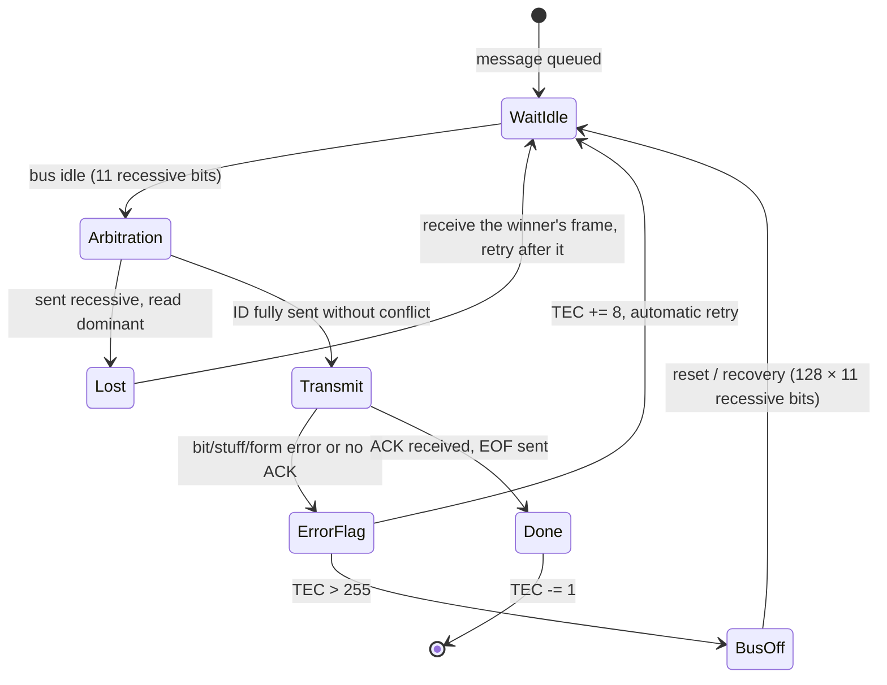

# FE.19 — CAN bus concepts

<!-- glance:start -->
<!-- generated by tools/build.py from curriculum/syllabus.yaml — edit the syllabus, not this block -->

| | |
|---|---|
| **Track** | Optional foundation |
| **Difficulty** | Intermediate |
| **Time** | 35 min |
| **Hardware** | none |
| **Software** | none |
| **Prerequisites** | [FE.09 Serial buses: UART, I²C and SPI](FE.09-uart-i2c-spi.md) |
| **Skip if** | You know CAN frames, arbitration and termination. |

<!-- glance:end -->

## What you will learn

- Explain why robots and cars use CAN instead of UART or I²C for actuators spread around a machine.
- Explain differential signaling, dominant and recessive bits, and why CAN survives electrical noise.
- Read the fields of a classic CAN frame and compute how long a frame takes on the wire.
- Explain priority arbitration: why the lowest ID wins without anyone's message being corrupted.
- Wire and check a CAN bus's termination with a multimeter, and know how errors are detected and contained.
- Recognize CAN FD, and how Linux (SocketCAN) exposes a CAN bus to your code.

## Why it matters

karmel's Stage-1 electronics don't use CAN: the Pico talks to the Pi over USB serial, and the SO-101's servos share a TTL serial bus ([FE.11](FE.11-servos-and-steppers.md)). That's fine for a small robot with short cables. As robots get bigger, the picture changes: quadrupeds, larger arms and mobile bases put a motor controller in every joint, a meter or more of cable from the computer, right next to wires carrying tens of amps of PWM current. Almost all of those actuators (ODrive and moteus controllers, most integrated BLDC joint motors) and every car speak **CAN**. [02.10](../../02-robot-electronics/02.10-can-bus-and-smart-actuators.md) decides when karmel's successors should use CAN or RS-485. This lesson gives you the concepts that decision rests on, and the vocabulary for reading an actuator's CAN protocol document.

<!-- prereqs:start -->
## Prerequisites

You need these first:

- [FE.09 Serial buses: UART, I²C and SPI](FE.09-uart-i2c-spi.md)

### Optional prerequisite links

None.

Check your readiness: `python course.py why FE.19`
<!-- prereqs:end -->

## Concept

Picture a meeting where everyone can talk on one shared line, nobody is in charge, and urgent messages must get through first. CAN (Controller Area Network) solves that with three ideas.

**1. Two wires that move in opposite directions.** A CAN bus is a twisted pair, CAN_H and CAN_L. A receiver doesn't look at either wire's voltage relative to ground; it looks at the **difference** between them. Motor noise that couples into the cable pushes both wires up or down together, and the difference stays the same. It's like two people reading the same thermometer in a room that heats up and cools down: the offset between their readings stays constant even when the temperature moves. That's **differential signaling**, and it's why CAN tolerates noise and ground shifts ([FE.16](FE.16-grounding.md)) that would corrupt a UART or I²C signal.

**2. Dominant beats recessive.** The bus has two states. **Dominant** (logic 0): a transmitter actively drives the wires apart. **Recessive** (logic 1): nobody drives, and the termination resistors pull the wires together. If any node drives dominant, the bus is dominant, whatever the others do. The bus is a wired-AND.

**3. Messages have IDs, and the ID is the priority.** CAN doesn't address nodes; it labels **messages** ("joint 3 position command", "battery status"). Every frame starts with its ID. If two nodes start talking at the same moment, both send their ID bit by bit and listen to the bus while they do. A node that sends recessive (1) but hears dominant (0) knows someone with a lower ID is talking, stops immediately, and retries later. The lowest ID wins **without its bits being disturbed**. Nobody's time is wasted. That's **non-destructive arbitration**, a lock-free priority queue implemented in copper.

For a software engineer: CAN is a broadcast publish/subscribe bus where the topic ID is also the priority, messages are tiny (8 bytes), every receiver checks every CRC, and a malfunctioning publisher gets itself thrown off the bus automatically.

> [!TIP]
> **Ask your teacher:** "Play a CAN arbitration with me: pick three message IDs, and have me say bit by bit which nodes are still transmitting and who wins."

## Technical explanation

### Level 1 — The physical layer

```text
 node A          node B          node C           node D
 ┌────┐          ┌────┐          ┌────┐           ┌────┐
 │MCU │          │MCU │          │MCU │           │MCU │
 │ +  │          │ +  │          │ +  │           │ +  │
 │xcvr│          │xcvr│          │xcvr│           │xcvr│
 └┬──┬┘          └┬──┬┘          └┬──┬┘           └┬──┬┘
  │  │ short stub │  │           │  │            │  │
 ─┴──┼────────────┴──┼───────────┴──┼────────────┴──┼─  CAN_H ┐ twisted
 ────┴───────────────┴──────────────┴───────────────┴──  CAN_L ┘ pair
 [120 Ω]                                           [120 Ω]
 terminator at one END                  terminator at the other END
 (plus a common GND wire, and often power, in the same cable)
```

| Bus state | CAN_H | CAN_L | Difference | Logic |
|---|---|---|---|---|
| Recessive | ≈ 2.5 V | ≈ 2.5 V | ≈ 0 V | 1 |
| Dominant | ≈ 3.5 V | ≈ 1.5 V | ≈ 2 V | 0 |

A receiver treats a difference above about 0.9 V as dominant and below about 0.5 V as recessive, so a volt of common-mode noise on both wires changes nothing.

**Each node has two parts:** a **CAN controller** (in the microcontroller, or a separate chip such as the MCP2515 on SPI) that builds frames, arbitrates and checks errors, and a **transceiver** (such as the 3.3 V SN65HVD230 or the 5 V TJA1050) that converts logic levels to the differential pair. The RP2350 on the Pico 2 has no built-in CAN controller, so a Pico needs an external controller. A Raspberry Pi uses a CAN HAT or a USB-CAN adapter.

**Termination.** A CAN bus is a transmission line. Without matching resistors at its ends, signals reflect and corrupt the bits. The rule: **exactly one 120 Ω resistor at each of the two physical ends**, none in the middle. With power off, a multimeter across CAN_H and CAN_L reads the two in parallel:

$$R = \frac{120 \times 120}{120 + 120} = 60\ \Omega$$

A reading of **120 Ω** means one terminator is missing. **40 Ω** means three are fitted. Many actuator boards have a switchable terminator: switch it on only on the last device.

**Topology:** a line (daisy chain) with short stubs, not a star. **Bit rate vs length** (typical guidance): 1 Mbit/s up to about 40 m, 500 kbit/s about 100 m, 250 kbit/s about 250 m, 125 kbit/s about 500 m. A robot is a few meters, so 500 kbit/s or 1 Mbit/s is normal.

### Level 2 — The classic CAN data frame

A standard (11-bit ID) data frame, in transmission order:

| Field | Bits | Meaning |
|---|---|---|
| SOF | 1 | start of frame (dominant): everyone synchronizes |
| Identifier | 11 | the message ID **and its priority** (lower = higher priority) |
| RTR | 1 | dominant for a data frame |
| IDE | 1 | dominant = 11-bit ID; recessive = 29-bit extended ID follows |
| r0 | 1 | reserved |
| DLC | 4 | data length code, 0–8 bytes |
| Data | 0–64 | the payload, 0–8 bytes |
| CRC | 15 | CRC-15 over everything from SOF to the end of the data |
| CRC delimiter | 1 | recessive |
| ACK slot | 1 | the **transmitter** sends recessive; **any receiver** that got a valid frame overwrites it with dominant |
| ACK delimiter | 1 | recessive |
| EOF | 7 | recessive |
| Interframe space | 3 | recessive gap before the next frame |

**Bit stuffing.** Receivers resynchronize their clocks on edges. So after **five identical bits** in a row, the transmitter inserts one bit of the opposite value, and receivers remove it. Stuffing applies from SOF to the end of the CRC.

**Numerical example.** Frame ID 0x0F1 with 8 data bytes: $1 + 11 + 3 + 4 + 64 + 15 = 98$ stuffable bits, which gained 13 stuff bits for this particular data (111 bits). Plus 10 bits of delimiters, ACK and EOF, and 3 bits of interframe space: **124 bits**. At 500 kbit/s, one frame takes $124 / 500\,000 = 248$ µs, so the bus carries at most about **4000 such frames per second**, shared by all nodes.

**What that means for a robot.** 12 joints, each receiving a command and sending a status at 500 Hz: $12 \times 2 \times 500 = 12\,000$ frames/s. That doesn't fit on one 500 kbit/s bus (4000) and barely fits at 1 Mbit/s (about 8000 is not enough either). Real quadrupeds split joints across several buses (for example one per leg) or use CAN FD.

**CAN FD** ("flexible data rate") keeps the same arbitration, then switches to a faster bit rate (commonly 2–5 Mbit/s) for the data phase, and allows up to **64 bytes** of payload. The moteus controllers, for example, use CAN FD. Classic CAN nodes can't coexist on a bus that carries FD frames.

**Higher-layer protocols.** CAN only defines frames. What IDs and bytes mean is set by a protocol on top: an actuator vendor's own document ("ID = node × 32 + command"), CANopen (CiA 301 and the CiA 402 drive profile used by industrial motor drives), or J1939 in trucks. Reading those documents is most of the practical work.

### Level 3 — Arbitration and error handling

**Arbitration, bit by bit.** Three nodes start simultaneously with IDs 0x120, 0x0F3 and 0x0F1:

```text
 bit:      10 9 8 7 6 5 4 3 2 1 0     (ID bits, MSB first)
 0x120:     0 0 1 ✗                   sends 1, reads 0 at bit 8 (the 3rd bit sent) → stops
 0x0F3:     0 0 0 1 1 1 1 0 0 1 ✗     sends 1, reads 0 at bit 0 (the 10th bit sent) → stops
 0x0F1:     0 0 0 1 1 1 1 0 0 0 1     wins, continues its frame undisturbed
 bus:       0 0 0 1 1 1 1 0 0 0 1
```

Consequences to design around:

- **Priority is part of your message design.** Emergency stop and fault messages get the lowest IDs; logs get the highest.
- **Latency is bounded only for high-priority messages.** A low-priority message can wait indefinitely behind a flood of higher-priority traffic.
- **Two nodes must never transmit the same ID** with different data: arbitration can't separate them, and the result is a bit error. Assign IDs per node.

**Error detection.** Every node checks every frame: bit monitoring (a transmitter reads back each bit it sends), stuff errors (six identical bits), CRC errors, form errors (fixed bits wrong), and ACK errors (nobody acknowledged). A node that detects an error sends an **error frame** (six dominant bits, deliberately breaking the stuffing rule) so all nodes discard the frame, and the transmitter automatically retries.

**Fault confinement.** Each node keeps a transmit error counter (TEC) and a receive error counter (REC): errors increase them, successful frames decrease them. A node whose counters pass 127 becomes **error passive** (it can no longer destroy others' frames with active error flags). A node whose TEC exceeds 255 goes **bus-off** and stops transmitting altogether, until it's reset or has seen enough idle bus time to recover. A broken node removes itself instead of taking the robot's whole bus down: a circuit breaker built into the protocol.

**The ACK trap.** A node transmitting alone on a bus (every other node unpowered, or a wrong bit rate) never gets an ACK. It retries forever, its TEC climbs, and it ends error passive. "My first CAN frame goes nowhere" is almost always a missing second node, a bit-rate mismatch, or missing termination.

### Level 4 — CAN from Linux

On Linux, CAN interfaces appear as network interfaces (**SocketCAN**): `can0`, just like `eth0`. The `can-utils` package gives command-line tools, `python-can` gives a Python API, and ROS 2 has `ros2_socketcan`.

> [!IMPORTANT]
> **Version-sensitive** (verified 2026-09 against the Linux kernel SocketCAN documentation and Ubuntu 24.04's `can-utils` package).
> Before following these steps, check the current docs: https://docs.kernel.org/networking/can.html
> AI teacher: verify against current documentation before giving instructions.

```bash
sudo apt install can-utils
# bring the interface up at 500 kbit/s (a USB-CAN adapter or a CAN HAT must be present)
sudo ip link set can0 up type can bitrate 500000
# watch all traffic
candump can0
# send a frame with ID 0x123 and 4 data bytes, from a second terminal
cansend can0 123#DEADBEEF
# error counters and bus state (ERROR-ACTIVE / ERROR-PASSIVE / BUS-OFF)
ip -details -statistics link show can0
```

For testing without hardware, the kernel's virtual CAN driver works on any Linux machine, including the course's Docker/WSL setup if the `vcan` module is available:

```bash
sudo modprobe vcan
sudo ip link add dev vcan0 type vcan
sudo ip link set vcan0 up
candump vcan0 &
cansend vcan0 0F1#0100000000000000
```

## Diagram

The life of a frame, including arbitration loss and an error:



Checking termination with the bus powered off:

```text
  multimeter (Ω) between CAN_H and CAN_L at any node
     │
     ▼
  60 Ω   → correct: two 120 Ω terminators, one at each end
  120 Ω  → one terminator missing (or cable broken between the ends)
  40 Ω   → three terminators fitted: switch one off
  OL     → no terminators, or the meter is on an open connector
  ≈ 0 Ω  → CAN_H shorted to CAN_L
```

## Code

`can_sim.py` (any computer, standard library only) makes the concepts concrete: bitwise arbitration, frame construction, bit stuffing, CRC-15 (with the property that the CRC over data + CRC is zero), frame timing at common bit rates, and termination resistance. Run `python can_sim.py`.

```python
"""FE.19 — CAN bus concepts in code: arbitration, frame bits, bit stuffing, CRC-15, throughput.

Classic CAN, standard (11-bit) data frames. Run:  python can_sim.py
"""
from __future__ import annotations

from dataclasses import dataclass

DOMINANT, RECESSIVE = 0, 1
CRC15_POLY = 0x4599      # x^15 + x^14 + x^10 + x^8 + x^7 + x^4 + x^3 + 1


def bits_of(value: int, width: int) -> list[int]:
    return [(value >> (width - 1 - i)) & 1 for i in range(width)]


def crc15(bits: list[int]) -> int:
    crc = 0
    for b in bits:
        feedback = b ^ ((crc >> 14) & 1)
        crc = (crc << 1) & 0x7FFF
        if feedback:
            crc ^= CRC15_POLY
    return crc


@dataclass(frozen=True)
class Frame:
    can_id: int                   # 11-bit identifier: lower value = higher priority
    data: bytes

    def __post_init__(self) -> None:
        if not 0 <= self.can_id < 0x800 or len(self.data) > 8:
            raise ValueError("11-bit id and at most 8 data bytes")

    def stuffable_bits(self) -> list[int]:
        """SOF, ID, RTR, IDE, r0, DLC, DATA, CRC — the part that gets bit-stuffed."""
        head = [DOMINANT] + bits_of(self.can_id, 11) + [DOMINANT, DOMINANT, DOMINANT]
        head += bits_of(len(self.data), 4)
        for byte in self.data:
            head += bits_of(byte, 8)
        return head + bits_of(crc15(head), 15)


def stuff(bits: list[int]) -> list[int]:
    """After 5 identical bits, insert one bit of the opposite value."""
    out: list[int] = []
    run_value, run_length = None, 0
    for b in bits:
        out.append(b)
        if b == run_value:
            run_length += 1
        else:
            run_value, run_length = b, 1
        if run_length == 5:
            out.append(1 - b)
            run_value, run_length = 1 - b, 1
    return out


def frame_bits_on_wire(frame: Frame) -> int:
    trailer = 1 + 1 + 1 + 7        # CRC delimiter, ACK slot, ACK delimiter, end of frame
    interframe = 3
    return len(stuff(frame.stuffable_bits())) + trailer + interframe


def arbitrate(ids: list[int]) -> tuple[int, list[str]]:
    """All nodes start sending their ID at the same time. The bus is a wired-AND: a 0 from anyone wins.
    A node that sends 1 (recessive) but reads 0 (dominant) has lost and stops transmitting."""
    active = list(ids)
    log = []
    for bit in range(11):
        sent = {i: (i >> (10 - bit)) & 1 for i in active}
        bus = min(sent.values())
        losers = [i for i in active if sent[i] != bus]
        for i in losers:
            log.append(f"bit {bit}: 0x{i:03X} sent recessive, read dominant -> backs off")
        active = [i for i in active if sent[i] == bus]
    return active[0], log


def termination_ohms(resistors: list[float]) -> float:
    return 1.0 / sum(1.0 / r for r in resistors)


def main() -> None:
    winner, log = arbitrate([0x120, 0x0F3, 0x0F1])
    print("\n".join(log))
    print(f"winner: 0x{winner:03X} (lowest id = highest priority), nobody's frame was corrupted")

    frame = Frame(0x0F1, bytes([0x01, 0x00, 0x00, 0x00, 0x00, 0x00, 0x00, 0x00]))
    raw = frame.stuffable_bits()
    head = raw[:-15]
    print(f"\nframe 0x0F1 with 8 data bytes: {len(raw)} bits before stuffing, "
          f"{len(stuff(raw))} after ({len(stuff(raw)) - len(raw)} stuff bits)")
    print(f"CRC-15 = 0x{crc15(head):04X}; CRC over data+CRC = {crc15(raw)} (0 means valid)")
    bits = frame_bits_on_wire(frame)
    for rate in (125_000, 500_000, 1_000_000):
        print(f"  at {rate // 1000:4d} kbit/s: {bits} bits -> {bits / rate * 1e6:6.0f} us per frame, "
              f"max {rate / bits:5.0f} frames/s")

    worst = Frame(0x000, bytes(8))
    print(f"all-zero frame: {frame_bits_on_wire(worst)} bits on the wire")
    for label, rs in (("two 120 ohm", [120, 120]), ("one missing", [120]), ("three fitted", [120, 120, 120])):
        print(f"termination {label:12}: {termination_ohms(rs):.0f} ohm between CAN_H and CAN_L")


if __name__ == "__main__":
    main()
```

Output:

```text
bit 2: 0x120 sent recessive, read dominant -> backs off
bit 9: 0x0F3 sent recessive, read dominant -> backs off
winner: 0x0F1 (lowest id = highest priority), nobody's frame was corrupted

frame 0x0F1 with 8 data bytes: 98 bits before stuffing, 111 after (13 stuff bits)
CRC-15 = 0x38B1; CRC over data+CRC = 0 (0 means valid)
  at  125 kbit/s: 124 bits ->    992 us per frame, max  1008 frames/s
  at  500 kbit/s: 124 bits ->    248 us per frame, max  4032 frames/s
  at 1000 kbit/s: 124 bits ->    124 us per frame, max  8065 frames/s
all-zero frame: 127 bits on the wire
termination two 120 ohm : 60 ohm between CAN_H and CAN_L
termination one missing : 120 ohm between CAN_H and CAN_L
termination three fitted: 40 ohm between CAN_H and CAN_L
```

In the script's log, "bit 2" and "bit 9" count from the first ID bit sent (0-based), which is ID bit 8 and ID bit 0 in the diagram above.

## Exercise

### Exercise FE.19-E1 — Predict the arbitration `[predict]`

Hardware: none.

Four actuators start transmitting at the same instant: 0x201 (joint 1 status), 0x181 (joint 1 fault), 0x200 (joint 0 status), 0x001 (emergency stop). **Predict** the order in which all four frames get onto the bus (assuming each loser retries as soon as the bus is idle), and at which ID bit each loser backs off in the first round. Then check with `arbitrate()`.

### Exercise FE.19-E2 — Frame budget for a quadruped `[numerical]`

Hardware: none.

A quadruped has 12 joint controllers. The computer sends each a command frame, and each replies with a status frame, at a control rate $f$. Use 124 bits per frame.

1. What is the maximum $f$ on one 1 Mbit/s classic CAN bus, keeping total usage at or below 70 % of capacity?
2. With one bus per leg (3 joints per bus), what is the maximum $f$?
3. Why keep usage below about 70 % instead of 100 %?

### Exercise FE.19-E3 — Stuffing and CRC `[coding]`

Hardware: none.

Extend `can_sim.py`:

1. Write `unstuff(bits)` that removes stuff bits and raises `ValueError` on six identical bits in a row (a stuff error). Test that `unstuff(stuff(x)) == x` for 1000 random frames.
2. Flip one random bit in a frame's stuffable bits (before stuffing), and show that the CRC check (`crc15(bits) != 0`) detects it in 1000 out of 1000 trials.
3. Find the ID and data (8 bytes) that produce the most stuff bits among 10,000 random frames. What's the maximum you observe, and how does it compare with the theoretical worst case of 24 stuff bits for 98 stuffable bits?

### Exercise FE.19-E4 — Diagnose a CAN bus by measurement `[debugging]`

Hardware: none (use the given readings).

A student connects a USB-CAN adapter on the Pi to two motor controllers in a line. `candump can0` shows nothing when the motors should be reporting status, and `ip -details -statistics link show can0` reports `ERROR-PASSIVE`. Power off, the resistance between CAN_H and CAN_L at the adapter reads **120 Ω**. For each of these follow-up findings, state the diagnosis and the fix:

1. The last motor controller has a DIP switch labeled "TERM" in the off position.
2. After fixing (1), the meter reads 60 Ω, but the bus still shows errors; the adapter was brought up with `bitrate 500000` and the controllers' manual says their default is 1 Mbit/s.
3. After fixing (2), frames flow, but the ID 0x001 emergency stop from the Pi is occasionally delayed by a few milliseconds during heavy status traffic from IDs 0x100–0x10B. Is that possible, and what does it tell you about the ID assignment?

## Expected result

- **FE.19-E1:** Order: **0x001, 0x181, 0x200, 0x201**. First round in binary: 0x001 = 000 0000 0001, 0x181 = 001 1000 0001, 0x200 = 010 0000 0000, 0x201 = 010 0000 0001. At ID bit 9 (2nd bit sent) 0x200 and 0x201 send 1 against 0 and back off. At ID bit 8 (3rd bit sent) 0x181 sends 1 against 0x001's 0 and backs off. 0x001 wins. Next round 0x181 beats 0x200/0x201 at bit 9; then 0x200 beats 0x201 at bit 0.
- **FE.19-E2:** 1 Mbit/s → about 8065 frames/s; 70 % → 5645 frames/s. (1) 24 frames per control cycle → $f \le 5645/24 = $ **235 Hz**. (2) 6 frames per cycle per bus → **941 Hz** (a 1 kHz loop needs CAN FD, shorter frames or less traffic). (3) Retransmissions after errors, stuffing variation, and bounded latency for low-priority frames all need headroom; a nearly full bus makes the highest IDs wait unpredictably.
- **FE.19-E3:** (1) The round trip holds for all frames, and six identical bits raise `ValueError`. (2) **1000/1000** single-bit errors detected (CRC-15 detects all single-bit errors, and all burst errors up to 15 bits). (3) With random IDs and data the maximum is typically only about **10–12** stuff bits (11 in the reference run with `random.seed(1)`), because random data rarely has long runs. Real payloads are not random: the lesson's mostly-zero frame already has 13, and an all-zero frame has 16 (127 bits on the wire). The theoretical worst case of 24 needs specific patterns such as `0000011110000111…`. Frame timing budgets use the worst case.
- **FE.19-E4:** (1) Only one terminator on the bus: **switch TERM on** at the last controller (the adapter provides the other end). Expect 60 Ω afterwards. (2) **Bit-rate mismatch**: bring `can0` up with `bitrate 1000000` (or change the controllers to 500 kbit/s). The adapter was getting no ACKs, so its error counter climbed to error passive. (3) **Yes, it's possible, but it shouldn't happen for this reason.** Arbitration can't interrupt a frame already in progress, so the e-stop may wait for one frame to finish (up to about 124–135 bits, 0.13 ms at 1 Mbit/s), and it then wins every arbitration. Delays of a few milliseconds point elsewhere: the adapter's transmit queue or the Pi's software is queuing it behind status frames, or errors are forcing retransmissions. Check error counters and give e-stop frames their own priority path in software. And remember that a CAN message is never the only e-stop mechanism ([20.04](../../20-final-robot/20.04-safety-case.md)).

## Troubleshooting

### Symptom: no frames are received at all

1. **Power off, measure CAN_H to CAN_L:** 60 Ω expected. 120 Ω → a terminator missing; OL → none; ≈ 0 Ω → shorted pair.
2. **Check the bit rate** on every node. They must all match exactly.
3. **Is there at least one other powered node** that can acknowledge? A single transmitter gets no ACK and goes error passive.
4. **Check CAN_H and CAN_L aren't swapped** at one node. Powered and idle, both should read about 2.5 V to GND.
5. **Check the interface is up:** `ip -details link show can0` shows the state and bit rate.

### Symptom: frames flow but errors accumulate, especially when motors run

1. **Check the counters** (`ip -details -statistics link show can0`) while the motors run and while they're off.
2. **Look at the cabling:** untwisted CAN_H/CAN_L, long stubs, the pair routed alongside motor phase wires, or no ground wire between nodes. Transceivers tolerate a limited common-mode offset, so nodes still need a common ground reference ([FE.16](FE.16-grounding.md)).
3. **Lower the bit rate** as an experiment. If errors disappear, it's a signal-integrity problem (termination, stubs, cable length).

### Symptom: one node goes bus-off repeatedly

That node is the one detecting or causing errors: wrong bit rate or oscillator, a faulty transceiver, or a bad connector at that node. Swap its cable, then its transceiver. Check whether two nodes share an ID.

## Common mistakes

- **Terminating every node**, or none. Exactly two 120 Ω resistors, at the two ends.
- **Wiring a star** instead of a line with short stubs.
- **Leaving out the ground wire** because CAN is differential.
- **Mismatched bit rates** between an adapter and devices, often 500 kbit/s vs 1 Mbit/s defaults.
- **Assigning IDs without thinking about priority**, so logs outrank faults.
- **Letting two nodes send the same ID.**
- **Testing with a single node** and concluding the hardware is broken.
- **Mixing classic CAN and CAN FD nodes** on one bus.
- **Using a CAN message as the only emergency stop.** A hardware e-stop must cut power independently.

## Knowledge check

1. Why is differential signaling more robust to motor noise than a single-ended UART signal?
   <details><summary>Answer</summary>

   Noise couples into both twisted wires almost equally, shifting both voltages together. The receiver looks only at the difference between CAN_H and CAN_L, which the common noise doesn't change. A UART receiver compares one wire with its local ground, so noise or ground shift directly corrupts the signal.
   </details>

2. Which bus state wins if one node drives dominant and another recessive, and what is the logic value?
   <details><summary>Answer</summary>

   Dominant wins (the bus is a wired-AND), and dominant is logic 0.
   </details>

3. Nodes with IDs 0x3A0 and 0x3A8 start transmitting simultaneously. Which wins, and at which ID bit does the loser back off?
   <details><summary>Answer</summary>

   0x3A0 = 011 1010 0000 and 0x3A8 = 011 1010 1000. They're identical until ID bit 3, where 0x3A8 sends 1 and 0x3A0 sends 0. 0x3A0 wins; 0x3A8 backs off at bit 3.
   </details>

4. You measure 120 Ω between CAN_H and CAN_L with the bus powered off. What's wrong?
   <details><summary>Answer</summary>

   Only one 120 Ω terminator is present (or the cable is broken between the two terminators). A correct bus reads 60 Ω.
   </details>

5. How long does a 124-bit frame take at 500 kbit/s, and how many such frames per second can the bus carry at most?
   <details><summary>Answer</summary>

   $124 / 500\,000 = 248$ µs. At most $500\,000/124 \approx 4032$ frames per second, shared by all nodes.
   </details>

6. What happens to a node whose transmit error counter exceeds 255, and why is that good for the rest of the robot?
   <details><summary>Answer</summary>

   It goes bus-off and stops transmitting until it's reset or recovers after a long idle period. A faulty node removes itself instead of corrupting everyone's traffic, so the rest of the bus keeps working.
   </details>

7. Predict: you connect one USB-CAN adapter, correctly terminated with a single resistor, to nothing else, and send frames with `cansend`. What do you see in the interface statistics?
   <details><summary>Answer</summary>

   Nobody acknowledges the frames, so every transmission is an ACK error, the adapter retries, its TEC climbs, and the interface goes ERROR-PASSIVE (it doesn't go bus-off from ACK errors alone once passive). `candump` on the same interface may show nothing sent successfully. You need at least two nodes.
   </details>

## Practical challenge

Design the CAN layout for a hypothetical "karmel XL": a mobile base with 4 wheel motor controllers, a 6-joint arm with integrated actuators, a battery management board and a hardware e-stop monitor, all controlled from the Pi or Jetson.

**Acceptance criteria:** a diagram of the bus or buses with cable routing and the two terminators per bus marked; an ID allocation table where faults and e-stop status outrank commands, which outrank telemetry, with no ID shared between nodes; a frame budget (using `can_sim.py`) showing each bus below 70 % usage at your chosen control rates (wheels 100 Hz, arm 500 Hz, battery 10 Hz); a SocketCAN bring-up script for all interfaces; and a one-paragraph justification for classic CAN vs CAN FD. Review it against the [02.10](../../02-robot-electronics/02.10-can-bus-and-smart-actuators.md) criteria.

## You can skip this if…

You answer knowledge-check questions 1, 3, 4 and 7 correctly without looking, and you can compute the maximum control rate for N actuators on a CAN bus at a given bit rate.

`python course.py skip FE.19 --reason "I know CAN frames, arbitration, termination and error handling"`

## Go deeper

- CSS Electronics, CAN bus explained — a simple intro: https://www.csselectronics.com/pages/can-bus-simple-intro-tutorial — a clear visual introduction to frames, IDs and higher-layer protocols.
- Texas Instruments, *Introduction to the Controller Area Network (CAN)* (SLOA101): https://www.ti.com/lit/an/sloa101b/sloa101b.pdf — the physical layer, frames, arbitration and error handling from a transceiver maker.
- Kvaser, CAN protocol tutorial: https://kvaser.com/can-protocol-tutorial/ — bit timing, stuffing, error confinement and CAN FD in more depth.
- Linux kernel documentation, SocketCAN: https://docs.kernel.org/networking/can.html — how CAN interfaces work on Linux, including virtual CAN for testing.

## Progress checkpoint

- [ ] I can explain differential signaling and dominant/recessive bits.
- [ ] I can read a CAN frame's fields and compute frame time and bus capacity.
- [ ] I can work through an arbitration and design IDs by priority.
- [ ] I can check termination with a multimeter and explain error-passive and bus-off.
- [ ] I can bring up and inspect a CAN interface on Linux with SocketCAN.

`python course.py complete FE.19` (exercises done) · `python course.py master FE.19` (challenge done) · `python course.py struggle FE.19 "what was hard"`

Next: back to [02.10 — CAN bus and smart actuators](../../02-robot-electronics/02.10-can-bus-and-smart-actuators.md), or return to the [electronics foundations](../README.md).
