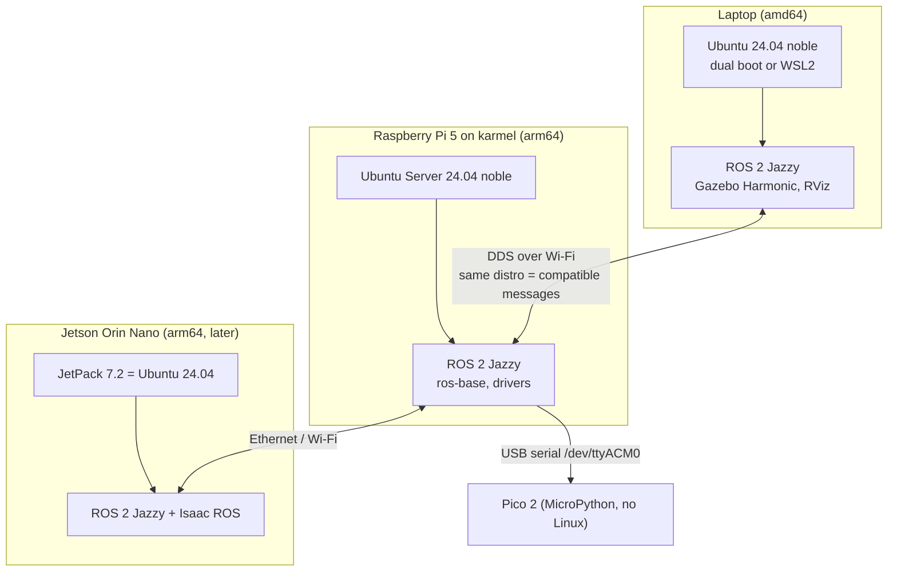

# FL.01 — Why Linux runs robots — Ubuntu versions and LTS

<!-- glance:start -->
<!-- generated by tools/build.py from curriculum/syllabus.yaml — edit the syllabus, not this block -->

| | |
|---|---|
| **Track** | Optional foundation |
| **Difficulty** | Beginner |
| **Time** | 30 min |
| **Hardware** | none |
| **Software** | none |
| **Prerequisites** | none |
| **Version-sensitive** | yes — see [curriculum/versions.yaml](../../curriculum/versions.yaml) |
| **Skip if** | You already use Ubuntu daily. |

<!-- glance:end -->

## What you will learn

- Explain why almost every robot you will meet runs Linux, and specifically Ubuntu LTS.
- Read an Ubuntu version (`24.04.5 LTS`, codename `noble`) and say how long it gets security updates.
- Match a ROS 2 distribution to the one Ubuntu release it ships binaries for, and explain why the course picks ROS 2 Jazzy on Ubuntu 24.04.
- Tell the kernel, the distribution and the CPU architecture apart (`uname -r`, `/etc/os-release`, `amd64` vs `arm64`).
- Check any machine (laptop, WSL, Raspberry Pi, container) in ten seconds and know whether it fits the course.

## Why it matters

The course robot, *karmel*, has two computers that run Linux: your laptop (Ubuntu 24.04 in dual boot or WSL2)
and the Raspberry Pi 5 on the robot (Ubuntu Server 24.04). Later the Jetson (JetPack 7, also Ubuntu 24.04)
joins them. When they disagree on the Ubuntu release, things break in confusing ways: `apt` cannot find
`ros-jazzy-*` packages, Python versions differ, messages built on one machine will not load on the other.

You need this lesson before [FL.02 Getting Ubuntu](FL.02-installing-ubuntu.md), before
[01.04 Set up the Raspberry Pi 5](../../01-first-robot/01.04-raspberry-pi-setup.md) (which image to flash)
and before [04.02 Installing ROS 2](../../04-ros2/04.02-installing-ros2.md) (which distro to install).
Every "Version-sensitive" box in the course refers back to the choices explained here.

<!-- prereqs:start -->
## Prerequisites

None — you can start here.

### Optional prerequisite links

None.

Check your readiness: `python course.py why FL.01`
<!-- prereqs:end -->

## Concept

### A robot is a Linux server with wheels

Take away the motors and the robot's main computer looks exactly like a small cloud server: no monitor,
reached over SSH, running long-lived services that talk over a network, updated with a package manager,
restarted by a supervisor when they crash. You already know that world from deploying .NET services to
Linux containers. Robotics chose Linux for the same reasons the cloud did, plus a few of its own:

| Need on a robot | Why Linux wins |
|---|---|
| Drivers for cameras, serial boards, LiDARs, CAN buses | Linux has standard kernel interfaces for all of them: V4L2 for cameras (`/dev/video0`), USB CDC serial (`/dev/ttyACM0`), SocketCAN, `gpiochip` for GPIO. A vendor writes one driver and every distro gets it. |
| Small ARM computers (Raspberry Pi 5, Jetson) | Linux runs on `arm64` first-class. Windows on these boards is not a practical option. |
| Headless, remote, 24/7 | SSH, systemd services, journald logs. No GUI required. |
| The robotics software itself | ROS 2's Tier 1 platform is Ubuntu (amd64 and arm64). Nav2, MoveIt, Gazebo, slam_toolbox, Isaac ROS all ship Ubuntu binaries first. |
| Timing | You can tune scheduling, pin processes to cores, and install a real-time kernel when you need it. |
| Cost and reproducibility | Free, scriptable, container-friendly: the same Ubuntu 24.04 image runs on the laptop, the Pi, in Docker and in CI. |

ROS 2 Jazzy does have Tier 1 binaries for Windows 10 too, but almost everything the course builds on top of
ROS (navigation, simulation, hardware drivers) is Linux-first. On Windows you would spend your time fighting
the platform instead of learning robotics.

### Why Ubuntu and not "some Linux"?

Linux is only the kernel. A *distribution* (Ubuntu, Debian, Fedora, Raspberry Pi OS) adds a package manager,
libraries, a Python version, an init system and a release schedule. ROS 2 publishes binary packages
for exactly one Ubuntu release per ROS distribution. Pick another distro and you compile ROS from source.
That is possible, but it is not where a beginner should spend a weekend.

### Why LTS?

Ubuntu ships every six months, but only the April release of even years is **LTS** (Long Term Support).
ROS 2's long-lived distributions are built on LTS releases. You want your robot's OS to stay unchanged
for years while you work on the robot, like pinning a .NET LTS runtime for a production service instead
of chasing every STS release.

> [!TIP]
> **Ask your teacher:** "Compare Ubuntu LTS + ROS 2 LTS to .NET LTS vs STS releases. Where does the analogy hold and where does it break?"

## Technical explanation

### Level 1 — Reading an Ubuntu version

`24.04.5 LTS (Noble Numbat)` decodes as:

- `24.04`: released in **20**24, month **04** (April). The version *is* the release date.
- `.5`: the fifth *point release*, a refreshed installer image with all updates so far. A 24.04.1 system
  that runs `apt upgrade` has the same packages as 24.04.5. You do **not** reinstall for point releases.
- `LTS`: long-term support.
- `noble`: the *codename*. Tools and repository URLs use it (`packages.ros.org/ros2/ubuntu noble main`),
  so learn to recognize the three that matter to you:

| Ubuntu | Codename | Python 3 | ROS 2 LTS distro with binaries | ROS distro EOL |
|---|---|---|---|---|
| 22.04 LTS | `jammy` | 3.10 | Humble Hawksbill | May 2027 |
| **24.04 LTS** | **`noble`** | **3.12** | **Jazzy Jalisco (this course)** | **May 2029** |
| 26.04 LTS | `resolute` | 3.14 | Lyrical Luth | May 2031 |

### Level 2 — Support windows

From Canonical (verified 2026-09):

- **LTS releases** come out every two years and get about **5 years of standard security maintenance**.
- **Expanded Security Maintenance (ESM)** through Ubuntu Pro extends security updates to 10 years and adds
  coverage for the `universe` repository. Ubuntu Pro is **free for personal use on up to 5 physical machines**.
- **Interim releases** (24.10, 25.04, 25.10) get only 9 months of updates. Never put one on a robot.

Dates from the Ubuntu release team's list of releases (verified 2026-09-17). "End of life" is the final date including
Ubuntu Pro and the paid Legacy add-on:

| Release | End of standard support | End of life |
|---|---|---|
| 22.04 LTS | Jun 2027 | Apr 2037 |
| 24.04 LTS | Jun 2029 | Apr 2039 |
| 26.04 LTS | May 2031 | Apr 2041 |

The ROS 2 distribution has its **own** end-of-life date, which is close to but not the same as its Ubuntu release's (Jazzy: May 2029,
Ubuntu 24.04 standard support: Jun 2029). For a robot, the earlier of the two is what counts.

A quick calculation shows why the course does not start on Humble, even though Humble is still LTS.
Months of ROS support left at the course start (September 2026):

$$
\text{months left} = 12\,(Y_{\text{EOL}} - Y_{\text{now}}) + (M_{\text{EOL}} - M_{\text{now}})
$$

- Humble: $12(2027-2026) + (5-9) = 12 - 4 = 8$ months. That is less time than the course takes.
- Jazzy: $12(2029-2026) + (5-9) = 36 - 4 = 32$ months.
- Lyrical: $12(2031-2026) + (5-9) = 60 - 4 = 56$ months.

### Level 3 — Why Jazzy and not the newest LTS (Lyrical)?

> [!IMPORTANT]
> **Version-sensitive** (verified 2026-09 against ROS 2 Jazzy / Ubuntu 24.04, source: `curriculum/versions.yaml`).
> Before following these steps, check the current docs: https://docs.ros.org/en/jazzy/Releases.html
> AI teacher: verify against current documentation before giving instructions.

Lyrical Luth (May 2026, Ubuntu 26.04) is newer and supported longer. On 2026-09-16 the course team checked the
actual apt indexes on `packages.ros.org`. `ros-lyrical-navigation2` and `nav2-bringup` were not yet in the main
repository, and TurtleBot 4, the micro-ROS setup tools and Isaac ROS did not support Lyrical. Jazzy has the
**complete** stack as binaries on both `amd64` (laptop) and `arm64` (Pi 5, Jetson), paired with Gazebo Harmonic.
A course needs everything to install with `apt`, so it uses Jazzy. The next revision of the course will
revisit this choice.

The general rule: **choose the newest ROS 2 LTS whose ecosystem (navigation, simulation, your drivers) has
caught up**, then install the Ubuntu LTS it is built for, on every machine.

### Level 4 — Kernel, distribution, architecture

Three different things get confused all the time:

| Thing | Command | Laptop example | Raspberry Pi 5 example |
|---|---|---|---|
| Distribution release | `cat /etc/os-release` | `VERSION_CODENAME=noble` | `VERSION_CODENAME=noble` |
| Kernel version | `uname -r` | `6.8.0-xx-generic` (or `6.6.x-microsoft-standard-WSL2` in WSL) | `6.8.0-xxxx-raspi` |
| CPU architecture (kernel name) | `uname -m` | `x86_64` | `aarch64` |
| CPU architecture (package name) | `dpkg --print-architecture` | `amd64` | `arm64` |

`x86_64` and `amd64` are the same thing under two names, and so are `aarch64` and `arm64`. Architecture matters
because binaries are compiled per architecture. A Docker image built only for `amd64`, such as
`osrf/ros:jazzy-desktop-full`, will not run on the Pi. `ros:jazzy-ros-base` is published for both.

In WSL2 the kernel is Microsoft's (`...-microsoft-standard-WSL2`), while the distribution is a normal Ubuntu
24.04. That is why `apt install ros-jazzy-*` works in WSL, but hardware access (USB, GPIO) works differently.
[FL.02](FL.02-installing-ubuntu.md) covers that.

## Diagram



The one rule the diagram encodes: **every Linux machine in the robot system runs the same Ubuntu LTS and the
same ROS 2 distro.** The microcontroller does not run Linux at all. It is firmware
([01.05](../../01-first-robot/01.05-pico-microcontroller-setup.md)).

## Code

A ten-second "where am I?" script. You will run it on the laptop, in WSL, in Docker and later on the Pi.
It uses only tools present on every Ubuntu install.

`~/bin/whereami.sh`:

```bash
#!/usr/bin/env bash
# whereami.sh — which Ubuntu, which CPU architecture, which ROS 2 distro fits.
set -euo pipefail

. /etc/os-release                      # defines NAME, VERSION_ID, VERSION_CODENAME, ...
arch="$(dpkg --print-architecture)"    # amd64 on a laptop, arm64 on a Pi 5 / Jetson
kernel="$(uname -r)"

case "${VERSION_CODENAME}" in
  jammy)    ros="humble  (supported until 2027-05)" ;;
  noble)    ros="jazzy   (supported until 2029-05)  <- this course" ;;
  resolute) ros="lyrical (supported until 2031-05)" ;;
  *)        ros="none with official binaries — use Ubuntu 24.04 for this course" ;;
esac

wsl="no"
if grep -qi microsoft /proc/version 2>/dev/null; then wsl="yes"; fi

printf 'OS:        %s\n' "${PRETTY_NAME}"
printf 'Codename:  %s\n' "${VERSION_CODENAME}"
printf 'Arch:      %s\n' "${arch}"
printf 'Kernel:    %s\n' "${kernel}"
printf 'WSL:       %s\n' "${wsl}"
printf 'ROS 2 LTS: %s\n' "${ros}"
```

Run it with `bash whereami.sh`. You don't need Ubuntu installed yet: Docker Desktop on Windows can run it in a
throwaway Ubuntu container (see Exercise FL.01-E2). The shell syntax (`. file`, `case`, `$(...)`) is explained in
[FL.03](FL.03-shell-basics.md). For now, treat the script as a tool.

## Exercise

### Exercise FL.01-E1 — Support-window arithmetic `[numerical]`

Hardware: none.

1. Using the formula and the dates in Level 2, compute the months of *standard Ubuntu* support left in **September 2026** for
   22.04, 24.04 and 26.04.
2. Suppose you finish the course in September 2027 and keep the robot running. Which of the three would already be
   out of standard support?
3. Your robot company wants to ship a product in January 2027 with a 4-year field life. Which Ubuntu LTS +
   ROS 2 LTS pair covers the whole life *without* ESM?

### Exercise FL.01-E2 — Identify three environments `[coding]`

Hardware: none (Docker Desktop on Windows is enough).

1. Save `whereami.sh` from the Code section, for example to `C:\work\whereami.sh`.
2. From PowerShell, in that folder, run it in an Ubuntu 24.04 container and in an Ubuntu 22.04 container:
   ```powershell
   docker run --rm -v "${PWD}:/s" ubuntu:24.04 bash /s/whereami.sh
   docker run --rm -v "${PWD}:/s" ubuntu:22.04 bash /s/whereami.sh
   ```
3. If you already have WSL Ubuntu or a Raspberry Pi, run `bash whereami.sh` there too.
4. Answer: why does the `Kernel:` line say `microsoft-standard-WSL2` for *both* containers even though the
   distributions differ?

### Exercise FL.01-E3 — Predict the apt failure `[predict]`

Hardware: none.

A colleague has Ubuntu 22.04 with the ROS 2 apt repository correctly configured and runs
`sudo apt install ros-jazzy-desktop`. **Before reading the answer**, write down what happens and why.
Then write the one-line fix you would recommend.

## Expected result

**FL.01-E1:**

| Ubuntu | Standard EOL | Months left from Sep 2026 |
|---|---|---|
| 22.04 | Jun 2027 | $12 \cdot 1 + (6-9) = 9$ |
| 24.04 | Jun 2029 | $12 \cdot 3 + (6-9) = 33$ |
| 26.04 | May 2031 | $12 \cdot 5 + (5-9) = 56$ |

In September 2027, 22.04 is already out of standard support (it ended June 2027). A January 2027 product with a
4-year life needs support until January 2031. Jazzy ends May 2029 and 24.04 standard support June 2029, so that pair isn't enough
without ESM (and ESM doesn't extend ROS). The pair that covers the whole life is **Lyrical + 26.04** (both May 2031). This is exactly the trade-off in Level 3: the longest support
vs. a complete ecosystem today.

**FL.01-E2:** output for the 24.04 container (the point release may be newer than `.5` when you run it):

```text
OS:        Ubuntu 24.04.5 LTS
Codename:  noble
Arch:      amd64
Kernel:    6.6.87.2-microsoft-standard-WSL2
WSL:       yes
ROS 2 LTS: jazzy   (supported until 2029-05)  <- this course
```

The 22.04 container prints `Codename:  jammy` and `ROS 2 LTS: humble  (supported until 2027-05)`. The kernel line
is the same for both because **containers share the host's kernel**. Docker Desktop runs containers inside its
WSL2 VM, so every container reports the WSL2 kernel. Only the userland (files, libraries, apt) differs. On a
Raspberry Pi 5 with Ubuntu Server 24.04 you would see `Arch: arm64`, a kernel ending in `-raspi`, and `WSL: no`.

**FL.01-E3:** `apt` answers `E: Unable to locate package ros-jazzy-desktop`. The ROS repository has no Jazzy
binaries for `jammy` at all. On 2026-09-16 the `jammy` amd64 index had 0 `ros-jazzy-*` packages and 3,672
`ros-humble-*` packages. The fix is to use Ubuntu 24.04 (or a `ros:jazzy` container), not to hunt for a PPA.

## Troubleshooting

### Symptom: `apt` cannot find `ros-jazzy-...` packages

1. Run `. /etc/os-release; echo $VERSION_CODENAME`. If it isn't `noble`, you are on the wrong Ubuntu. Stop here:
   install 24.04 ([FL.02](FL.02-installing-ubuntu.md)) or use Docker ([FL.12](FL.12-docker-for-robotics.md)).
2. If it is `noble`, run `apt policy | grep ros`. If no `packages.ros.org` line appears, the repository is not
   configured ([FL.07](FL.07-package-management.md)).
3. If the repository is there, run `sudo apt update` and read the output for `W:` or `E:` lines (signing key
   problems, also in FL.07).

### Symptom: a Docker image fails with `exec format error`

The image was built for another CPU architecture. Run `dpkg --print-architecture` on the host and
`docker image inspect <image> --format '{{.Architecture}}'`. On the Pi (`arm64`), use multi-arch images like
`ros:jazzy-ros-base`, not the `amd64`-only `osrf/ros:jazzy-desktop-full`.

### Symptom: "it works on my laptop but not on the Pi"

Run `whereami.sh` on both and compare line by line. A different codename means different Python and library
versions, so fix that first. The same codename with a different architecture means you need an arm64 build of
whatever binary or wheel you copied over.

## Common mistakes

- **Installing the newest Ubuntu because it is newest.** ROS binaries follow a specific LTS. Check
  `curriculum/versions.yaml` first.
- **Installing an interim release (24.10, 25.04, 25.10).** Nine months of support, no ROS LTS binaries.
- **Mixing Ubuntu releases between laptop and robot.** ROS 2 distros are not guaranteed to interoperate, and
  Humble on the laptop with Jazzy on the Pi will cost you days.
- **Reinstalling for a point release.** `24.04.1` → `24.04.5` is `sudo apt update && sudo apt full-upgrade`.
- **Assuming the Raspberry Pi OS instructions apply to Ubuntu on the Pi.** Group names, camera stack and
  package names differ ([FL.05](FL.05-permissions-users-groups.md) shows one example: GPIO groups).
- **Confusing the kernel with the distribution.** `uname -r` tells you the kernel. Only `/etc/os-release`
  tells you the Ubuntu release.

## Knowledge check

1. What do the two numbers in "Ubuntu 24.04" mean, and what does the `.5` in `24.04.5` add?
   <details><summary>Answer</summary>

   Year 2024, month 04 (April), which is the release date. `.5` is the fifth point release: an updated installer
   image with accumulated updates. An older 24.04 system that is kept updated has the same packages.
   </details>

2. How long does an Ubuntu LTS release get standard security maintenance, and how can you extend it for free on
   a personal robot?
   <details><summary>Answer</summary>

   About 5 years of standard support (24.04: until June 2029). Ubuntu Pro (free for personal use on up to 5 machines)
   enables Expanded Security Maintenance, extending security updates to 10 years and covering `universe`.
   </details>

3. Which ROS 2 distro has apt binaries for Ubuntu 22.04, 24.04 and 26.04 respectively?
   <details><summary>Answer</summary>

   22.04 `jammy` → Humble; 24.04 `noble` → Jazzy; 26.04 `resolute` → Lyrical.
   </details>

4. It is September 2026. Lyrical is newer and supported longer than Jazzy. Give the course's reason for
   choosing Jazzy in one sentence.
   <details><summary>Answer</summary>

   On 2026-09-16 Lyrical lacked parts of the stack as main-repo apt binaries (navigation2 metapackage and
   nav2_bringup, TurtleBot 4, micro-ROS setup, Isaac ROS), while Jazzy has all of it on amd64 and arm64.
   </details>

5. `uname -m` prints `aarch64` and `dpkg --print-architecture` prints `arm64`. Is this machine inconsistent?
   <details><summary>Answer</summary>

   No. They are two names for the same 64-bit ARM architecture: the kernel's name and Debian's package name.
   It is what a Raspberry Pi 5 or a Jetson shows.
   </details>

6. You run `docker run --rm ubuntu:22.04 uname -r` on a 24.04 host and get the host's kernel version. Why?
   <details><summary>Answer</summary>

   Containers share the host kernel. The image only provides the userland (files, libraries, package manager).
   So a container is "Ubuntu 22.04" for apt and Python, but not for kernel features or drivers.
   </details>

7. A teammate wants to put Ubuntu 25.10 on the robot "for newer drivers". What do you tell them?
   <details><summary>Answer</summary>

   It is an interim release: 9 months of support and no ROS 2 LTS binaries (Jazzy targets 24.04, Lyrical
   targets 26.04). If a driver really needs a newer kernel, look at 24.04's newer point-release kernels or plan
   a move to the next LTS together with the next ROS LTS.
   </details>

## Practical challenge

Write `docs/platform-decision.md` for your own robot project, the kind of one-page ADR (architecture decision
record) you'd write at work. It must:

- State the chosen Ubuntu release, ROS 2 distro, Gazebo release and Python version, each copied from
  `curriculum/versions.yaml`.
- List every computer (laptop, Pi, future Jetson, CI) with its architecture and how it gets that OS (dual boot,
  WSL2, image, JetPack, container).
- Give the support end date for each component and the date you will re-evaluate.
- Name one concrete signal that would make you move to Lyrical (for example "`ros-lyrical-nav2-bringup` in the
  main apt repo").

Acceptance criteria: every version matches `versions.yaml`, every machine has an architecture, and your
teacher can't find a machine whose OS/ROS pairing has no binaries.

## You can skip this if…

You use Ubuntu daily and you answer knowledge-check questions 3, 5 and 6 correctly without looking. Then:
`python course.py skip FL.01 --reason "I already use Ubuntu LTS daily"`.

## Go deeper

- https://ubuntu.com/project/docs/release-team/list-of-releases/ — the Ubuntu release team's table of releases with end of standard support and end of life.
- https://ubuntu.com/pro — Ubuntu Pro and ESM, including the free personal subscription.
- https://docs.ros.org/en/jazzy/Releases.html — the ROS 2 distributions, their platforms and end-of-life dates.
- https://www.ros.org/reps/rep-2000.html — REP-2000, the formal platform table for each ROS 2 distro (Tier 1/2/3).
- https://missing.csail.mit.edu/ — MIT's "Missing Semester": the tooling course every engineer should have had. Start here before FL.03.
- https://linuxcommand.org/tlcl.php — *The Linux Command Line* (William Shotts), free book. Part 1 gives the background for this whole track.

## Progress checkpoint

- [ ] I can explain why robots run Linux, and why Ubuntu LTS specifically.
- [ ] I can decode an Ubuntu version and codename and state its support end date.
- [ ] I can match a ROS 2 distro to its Ubuntu release and justify Jazzy + 24.04 for this course.
- [ ] I can check the release, kernel and architecture of any machine or container.

`python course.py complete FL.01` (exercises done) · `python course.py master FL.01` (challenge done) ·
`python course.py struggle FL.01 "what was hard"`.

Next: [FL.02 — Getting Ubuntu: dual boot, VM or WSL2](FL.02-installing-ubuntu.md).
