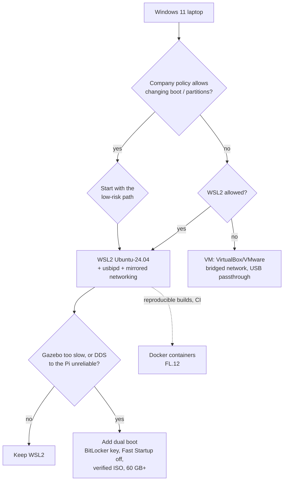

# FL.02 — Getting Ubuntu: dual boot, VM or WSL2

<!-- glance:start -->
<!-- generated by tools/build.py from curriculum/syllabus.yaml — edit the syllabus, not this block -->

| | |
|---|---|
| **Track** | Optional foundation |
| **Difficulty** | Beginner |
| **Time** | 1 h 30 min |
| **Hardware** | none |
| **Software** | ubuntu |
| **Prerequisites** | [FL.01 Why Linux runs robots — Ubuntu versions and LTS](FL.01-why-linux.md) |
| **Version-sensitive** | yes — see [curriculum/versions.yaml](../../curriculum/versions.yaml) |
| **Skip if** | You have a working Ubuntu of the course's version. |

<!-- glance:end -->

## What you will learn

- Choose between WSL2, dual boot, a virtual machine and "Docker only" for *your* laptop and goals, using concrete criteria.
- Install Ubuntu 24.04 under WSL2 on Windows 11, with systemd, GUI apps (WSLg) and sensible memory/network settings.
- Prepare a safe dual boot: back up, handle BitLocker, verify the ISO, create the USB stick, install alongside Windows.
- Pass a USB device (the robot's Pico) from Windows into WSL2 with `usbipd`.
- Run a readiness script that proves your Ubuntu is fit for the course.

## Why it matters

Everything from [04.02 Installing ROS 2](../../04-ros2/04.02-installing-ros2.md) onward assumes a working
Ubuntu 24.04. You will run Gazebo simulations ([06.01 Why simulate](../../06-simulation/06.01-why-simulate.md)), RViz, `colcon` builds and
serial tools against the robot. A bad choice here costs you later: Gazebo crawling in a VM without a GPU, a
workspace on `/mnt/c` that builds ten times slower, a Pico that WSL can't see, or a dual-boot install that
triggers a BitLocker recovery screen you have no key for.

The Raspberry Pi on the robot gets Ubuntu Server 24.04 in
[01.04 Set up the Raspberry Pi 5](../../01-first-robot/01.04-raspberry-pi-setup.md). This lesson is about
**your laptop**.

<!-- prereqs:start -->
## Prerequisites

You need these first:

- [FL.01 Why Linux runs robots — Ubuntu versions and LTS](FL.01-why-linux.md)

### Optional prerequisite links

None.

Check your readiness: `python course.py why FL.02`
<!-- prereqs:end -->

## Concept

You have four ways to get Ubuntu 24.04 on a Windows 11 laptop. They differ in one core question: **who
owns the hardware?**

- **Dual boot**: Ubuntu owns everything when it is running. It gets the full GPU, all USB ports and the
  Wi-Fi card, and runs at full speed. You reboot to switch OS.
- **WSL2**: Windows owns the hardware. Ubuntu runs in a lightweight Hyper-V VM managed by Windows, with the
  real Linux kernel. GUIs appear as normal Windows windows (WSLg). The GPU is shared through a virtual
  driver. USB devices must be forwarded explicitly.
- **Virtual machine** (VirtualBox, VMware, Hyper-V): Windows owns the hardware and emulates a PC. 3D
  acceleration for Gazebo is usually poor. This path is mostly replaced by WSL2.
- **Docker only**: Ubuntu userland in containers on Docker Desktop, itself on WSL2. It works well for CI and
  reproducible builds ([FL.12](FL.12-docker-for-robotics.md)). As your only desktop it adds friction for GUIs and devices.

A .NET analogy: dual boot is bare metal, WSL2 is a managed VM with good integration (like a dev box
with port forwarding already set up), a classic VM is a VM you manage yourself, and Docker-only is a
container on that managed VM.

| Criterion | WSL2 | Dual boot | VM | Docker only |
|---|---|---|---|---|
| Setup time | 15 min | 1–2 h | 45 min | 20 min |
| Risk to Windows install | none | low if you follow the steps | none | none |
| Gazebo / RViz 3D performance | good (GPU via WSLg) | best | poor–fair | good-ish, extra setup |
| USB serial to the Pico | via `usbipd` (works) | native | via VM USB passthrough | complicated |
| Multicast DDS to the Pi over Wi-Fi | needs mirrored networking | native | bridged adapter | host networking caveats |
| Switch to Windows apps | instant | reboot | instant | instant |

**Course recommendation:** start with **WSL2** today (Exercise FL.02-E1). Add **dual boot** when you reach
real-robot ROS networking (module 04 with the Pi) or heavy simulation, if WSL2 gets in your way. Many
robotics engineers on Windows laptops end up with both.

> [!TIP]
> **Ask your teacher:** "Given my laptop model, GPU and how much disk I have free, should I go WSL2 only or also dual boot? Ask me the questions you need."

## Technical explanation

> [!IMPORTANT]
> **Version-sensitive** (verified 2026-09 against Ubuntu 24.04 LTS, Windows 11, WSL 2.6.3, usbipd-win 5.x).
> Before following these steps, check the current docs: https://learn.microsoft.com/en-us/windows/wsl/install and https://ubuntu.com/tutorials/install-ubuntu-desktop
> AI teacher: verify against current documentation before giving instructions.

### Level 1 — WSL2 in 15 minutes

In **PowerShell as Administrator**:

```powershell
wsl --update
wsl --list --online              # shows Ubuntu-24.04, Ubuntu-26.04, Ubuntu-22.04, ...
wsl --install -d Ubuntu-24.04    # pick the exact name; plain "Ubuntu" may point to a newer release
```

Use the name `Ubuntu-24.04` exactly. On 2026-09 the online list contained `Ubuntu` (unversioned),
`Ubuntu-26.04`, `Ubuntu-24.04` and `Ubuntu-22.04`. The unversioned `Ubuntu` follows the latest LTS, which is
not the course's release.

Reboot if asked. The first start asks for a **Linux username and password**. They are unrelated to your
Windows account, and the password is what `sudo` will ask for. Then, inside Ubuntu:

```bash
sudo apt update && sudo apt full-upgrade -y
```

Check from PowerShell:

```powershell
wsl -l -v
```

`VERSION` must be `2`. WSL1 is a different technology with no real Linux kernel, and ROS does not work well on it.

**systemd.** `wsl --install` sets up current Ubuntu images with systemd enabled. Verify inside Ubuntu with
`ps -p 1 -o comm=`, which should print `systemd`. If it doesn't, put this in `/etc/wsl.conf`:

```ini
[boot]
systemd=true
```

then run `wsl --shutdown` from PowerShell and reopen Ubuntu. You need systemd for [FL.06](FL.06-processes-systemd.md).

**Resource limits and networking.** Create `C:\Users\<you>\.wslconfig`:

```ini
[wsl2]
memory=8GB                 # cap RAM for the VM; Gazebo + RViz want 6-8 GB
processors=6
networkingMode=mirrored    # Windows 11 22H2+: WSL shares Windows' network interfaces
```

Microsoft lists these benefits of mirrored mode: IPv6, reaching Windows services on `localhost`, better VPN
compatibility, **multicast support**, and connections to WSL directly from your LAN. The last two
matter for ROS 2, because DDS discovery uses multicast
([FL.09](FL.09-networking-basics.md)). Mirrored mode also puts WSL behind the Hyper-V firewall. If the Pi
cannot reach you, Microsoft documents this admin PowerShell command to allow inbound connections:

```powershell
Set-NetFirewallHyperVVMSetting -Name '{40E0AC32-46A5-438A-A0B2-2B479E8F2E90}' -DefaultInboundAction Allow
```

Apply `.wslconfig` changes with `wsl --shutdown`.

**Where your files live.** Keep robot code in the Linux filesystem (`~/karmel_ws`), **not** under
`/mnt/c/...`. Access across the Windows/Linux boundary goes through a network file protocol and is
many times slower for thousands of small files, which is exactly what `colcon build` and `git status` produce.
From Windows, open your Linux home as `\\wsl.localhost\Ubuntu-24.04\home\<user>` in Explorer, or run
`code .` inside WSL to open VS Code with the WSL extension.

**GUIs.** WSLg is built in. `sudo apt install -y x11-apps && xeyes` opens a window on the Windows desktop.
Hardware-accelerated OpenGL uses your Intel/AMD/NVIDIA Windows driver through a virtual GPU. Keep the Windows
GPU driver up to date. Don't install Linux NVIDIA drivers inside WSL.

### Level 2 — USB devices into WSL2 (the Pico)

WSL2 has no direct access to USB. Microsoft's documented route is **usbipd-win**, which shares a USB device
over the USB/IP protocol into the WSL VM. While a device is attached to WSL, Windows cannot use it.

```powershell
winget install --interactive --exact dorssel.usbipd-win   # once
usbipd list                                               # find the BUSID, e.g. 2-3  "USB Serial Device (COM5)"
usbipd bind --busid 2-3                                   # once per device, needs Administrator
usbipd attach --wsl --busid 2-3                           # every time you plug it in; no admin needed
```

Keep a WSL terminal open while attaching, since that keeps the VM alive. Inside Ubuntu:

```bash
lsusb                  # should list: ID 2e8a:0005 ... (Raspberry Pi Pico running MicroPython)
ls -l /dev/ttyACM*     # crw-rw---- 1 root dialout 166, 0 ... /dev/ttyACM0
```

`usbipd detach --busid 2-3` gives the device back to Windows. The `dialout` group and "permission denied" are
explained in [FL.05](FL.05-permissions-users-groups.md).

### Level 3 — Dual boot, safely

Order matters. Each step prevents a specific disaster.

1. **Back up** anything you can't lose. Partitioning is safe when done right, and backups cover the other case.
2. **Get your BitLocker recovery key** (Windows 11 often encrypts the system drive by default). Look it up
   at `aka.ms/myrecoverykey` or in *Settings → Privacy & security → Device encryption*. Changing boot
   settings can trigger the BitLocker recovery screen, and without the key your Windows data is gone.
3. **Suspend or turn off BitLocker if you want "install alongside Windows".** Ubuntu's official tutorial
   states that with BitLocker enabled the installer cannot read the drive layout it needs to install alongside
   Windows. Disabling it is not needed when Ubuntu gets a separate, unencrypted drive.
4. **Turn off Windows Fast Startup** (*Control Panel → Power Options → Choose what the power buttons do*).
   With Fast Startup on, Windows hibernates instead of shutting down, and Linux will refuse to write to (or can
   corrupt) the Windows partition.
5. **Shrink the Windows partition** in *Disk Management* (`diskmgmt.msc` → right-click C: → Shrink Volume).
   Leave at least **60 GB** unallocated for Ubuntu (the installer minimum is 25 GB; ROS desktop, Gazebo,
   workspaces, bags and Docker images fill that quickly).
6. **Download the Ubuntu 24.04 LTS desktop ISO** from `https://ubuntu.com/download/desktop` and **verify it**.
   In PowerShell run `Get-FileHash .\ubuntu-24.04.*-desktop-amd64.iso -Algorithm SHA256` and compare the hash with
   `SHA256SUMS` at `https://releases.ubuntu.com/24.04/`. A corrupted download produces installer errors that
   are very hard to diagnose.
7. **Write the USB stick** (12 GB+) with balenaEtcher (Ubuntu's tutorial recommends it) or Rufus.
8. **Boot from USB** (F12/F2/Esc at power-on, depending on the vendor). Secure Boot can stay **on**, because
   Ubuntu's boot chain is signed. If you later install NVIDIA's proprietary driver, the installer asks you to set a
   password and **enroll a MOK key** on the next boot. Do it, or the driver will not load.
9. In the installer choose **"Install Ubuntu alongside Windows"** (the wording varies slightly by version) or
   use manual partitioning into the free space. **Never** choose "Erase disk" unless you mean it.
10. After the first boot: `sudo apt update && sudo apt full-upgrade -y`, then run the readiness script below.

The boot menu (GRUB) lets you pick Ubuntu or Windows at every start.

### Level 4 — Classic VM, if you must

If WSL2 is blocked (corporate policy) and dual boot is not allowed: VirtualBox or VMware with Ubuntu 24.04,
at least 4 CPUs, 8 GB RAM, 60 GB disk, 3D acceleration on, **bridged** network adapter (so the Pi can reach
the VM directly with multicast), and USB passthrough for the Pico. Expect Gazebo to be slow. Use it for learning
ROS concepts, not for heavy simulation.

## Diagram



## Code

A readiness script you run after any install (WSL, dual boot, VM, even a container). It checks the Ubuntu release,
architecture, disk, the UTF-8 locale that ROS 2 requires, systemd, and where you work in WSL. The exit code is the
number of hard failures, so you can use it in scripts.

`~/bin/ubuntu-ready.sh`:

```bash
#!/usr/bin/env bash
# ubuntu-ready.sh — is this Ubuntu ready for the course? Prints PASS/WARN/FAIL per check.
set -uo pipefail

fails=0
pass() { printf 'PASS  %s\n' "$1"; }
warn() { printf 'WARN  %s\n' "$1"; }
fail() { printf 'FAIL  %s\n' "$1"; fails=$((fails + 1)); }

. /etc/os-release
[[ "${VERSION_CODENAME}" == "noble" ]] && pass "Ubuntu ${VERSION_ID} (noble)" \
  || fail "Ubuntu ${VERSION_ID} (${VERSION_CODENAME}) — the course needs 24.04 noble"

arch="$(dpkg --print-architecture)"
[[ "${arch}" == "amd64" || "${arch}" == "arm64" ]] && pass "architecture ${arch}" \
  || fail "architecture ${arch} — ROS 2 Jazzy binaries exist for amd64 and arm64 only"

free_gb=$(df --output=avail -BG "${HOME}" | tail -1 | tr -dc '0-9')
(( free_gb >= 30 )) && pass "${free_gb} GB free in ${HOME}" \
  || warn "${free_gb} GB free in ${HOME} — ROS desktop + Gazebo + workspaces want 30 GB+"

if locale | grep -qi 'LANG=.*utf-\?8'; then pass "UTF-8 locale ($(locale | grep '^LANG='))"
else fail "locale is not UTF-8 ($(locale | grep '^LANG=')) — ROS 2 requires a UTF-8 locale"; fi

if [[ "$(ps -p 1 -o comm=)" == "systemd" ]]; then pass "systemd is PID 1"
else warn "PID 1 is '$(ps -p 1 -o comm=)', not systemd (normal in Docker; in WSL enable it in /etc/wsl.conf)"; fi

if grep -qi microsoft /proc/version; then
  case "$(pwd -P)" in
    /mnt/*) warn "you are working under $(pwd -P): keep code in ~ (Linux filesystem), /mnt/c is slow" ;;
    *)      pass "WSL: working directory is on the Linux filesystem" ;;
  esac
fi

exit "${fails}"
```

Run: `mkdir -p ~/bin`, save the file, then `cd ~ && bash ~/bin/ubuntu-ready.sh; echo "exit=$?"`.

## Exercise

### Exercise FL.02-E1 — Install WSL2 Ubuntu 24.04 and prove it `[coding]`

Hardware: none (Windows 11 laptop).

1. Follow Level 1: `wsl --install -d Ubuntu-24.04`, create your user, `sudo apt update && sudo apt full-upgrade -y`.
2. Create `.wslconfig` with a memory cap and `networkingMode=mirrored`, then `wsl --shutdown` and reopen.
3. Save and run `ubuntu-ready.sh` from `~`.
4. Run it again from `/mnt/c/Users` (`cd /mnt/c/Users && bash ~/bin/ubuntu-ready.sh`).
5. From PowerShell run `wsl -l -v`.

### Exercise FL.02-E2 — A window from Linux `[coding]`

Hardware: none.

In WSL: `sudo apt install -y x11-apps mesa-utils`, then run `xeyes &` and `glxinfo -B | grep -E "OpenGL renderer|direct rendering"`.

### Exercise FL.02-E3 — Disk budget `[numerical]`

Hardware: none.

On a *minimal* Ubuntu 24.04 (the Docker base image) with the ROS apt repository configured, `apt` reported on
2026-09-16:

| Command | "After this operation, … additional disk space" |
|---|---|
| `apt install ros-jazzy-ros-base` | 662 MB |
| `apt install ros-jazzy-desktop` | 4200 MB |
| `apt install ros-jazzy-desktop ros-jazzy-ros-gz` | 4778 MB |

1. How much extra disk does Gazebo (`ros-gz`) add on top of `desktop`?
2. You plan: Ubuntu desktop itself ≈ 12 GB, ROS desktop + Gazebo, two Docker images of ≈ 5 GB each
   ([FL.12](FL.12-docker-for-robotics.md)), workspaces ≈ 3 GB and rosbag recordings of 200 MB/minute for
   30 minutes total. Add 25 % headroom. How large must the Ubuntu partition be? Is the 60 GB guideline enough?

### Exercise FL.02-E4 — Move a USB device into WSL `[hardware]`

Hardware: `robot-base` (just the Raspberry Pi Pico 2 with MicroPython, from [01.05](../../01-first-robot/01.05-pico-microcontroller-setup.md)). Without it, use any USB serial adapter or skip.

1. Install usbipd-win, then run `usbipd list`, `usbipd bind`, and `usbipd attach --wsl` for the Pico.
2. In WSL run `lsusb` and `ls -l /dev/ttyACM*`.
3. Run `usbipd detach` and repeat `ls -l /dev/ttyACM*`.

## Expected result

**FL.02-E1:** From `~`, on a correctly set-up WSL (the free-space number is yours):

```text
PASS  Ubuntu 24.04 (noble)
PASS  architecture amd64
PASS  212 GB free in /home/you
PASS  UTF-8 locale (LANG=C.UTF-8)
PASS  systemd is PID 1
PASS  WSL: working directory is on the Linux filesystem
```

(`LANG=` may be `en_US.UTF-8` instead of `C.UTF-8`, and both are fine.) `exit=0`. From `/mnt/c/Users` the last line
becomes `WARN  you are working under /mnt/c/Users: keep code in ~ (Linux filesystem), /mnt/c is slow` and the exit
code stays 0, because warnings are not failures. `wsl -l -v` shows `Ubuntu-24.04  Running  2`. For comparison, in a plain
`ubuntu:24.04` Docker container the script prints `FAIL  locale is not UTF-8 (LANG=)` and
`WARN  PID 1 is 'bash', not systemd …` with `exit=1`. Containers have no locale or systemd set up by default.

**FL.02-E2:** A pair of eyes that follow your mouse appears as a normal Windows window. `glxinfo -B` prints
`direct rendering: Yes`, and the renderer line names your GPU through D3D12, e.g.
`OpenGL renderer string: D3D12 (Intel(R) Iris(R) Xe Graphics)`. If it says `llvmpipe`, you are on software rendering
(see Troubleshooting).

**FL.02-E3:** (1) $4778 - 4200 = 578$ MB for Gazebo and the ROS–Gazebo bridge.
(2) $12 + 4.8 + 10 + 3 + (0.2 \times 30 = 6) = 35.8$ GB; with 25 % headroom $35.8 \times 1.25 = 44.75$ GB.
60 GB is enough, with about 15 GB left over. It stops being enough once you add a second ROS workspace with
MoveIt, Isaac-style images (tens of GB) or long bag recordings. Choose 100 GB if you can spare it.

**FL.02-E4:** After attach, `lsusb` includes a line with `ID 2e8a:0005` (Raspberry Pi VID, MicroPython PID), and
`ls -l /dev/ttyACM*` prints something like `crw-rw---- 1 root dialout 166, 0 Sep 16 10:12 /dev/ttyACM0`. After
detach, `ls` prints `ls: cannot access '/dev/ttyACM*': No such file or directory` and the device shows up as a
COM port in Windows again.

## Troubleshooting

### Symptom: `wsl --install` fails or Ubuntu won't start

1. `wsl --status` and `wsl --version`: if `--version` is unrecognized, WSL is the old inbox version. Run `wsl --update`.
2. Error mentions virtualization (`0x80370102`)? Enable virtualization (Intel VT-x / AMD-V) in the BIOS/UEFI, and
   make sure the Windows features *Virtual Machine Platform* and *Windows Subsystem for Linux* are on.
3. Still failing: `wsl --unregister Ubuntu-24.04` (this **deletes** that distro's files) and install again.

### Symptom: GUI apps don't open or render with `llvmpipe`

1. `echo $DISPLAY $WAYLAND_DISPLAY` should print something like `:0 wayland-0`. If it is empty, run `wsl --update`,
   then `wsl --shutdown`.
2. `glxinfo -B` says `llvmpipe`: update the **Windows** GPU driver from the vendor. Don't install GPU drivers inside Ubuntu.
3. On hybrid-GPU laptops, set Windows *Graphics settings* to use the high-performance GPU for `msrdc.exe`/WSL, or
   use `export MESA_D3D12_DEFAULT_ADAPTER_NAME=NVIDIA` before launching the app.

### Symptom: the Pico is not visible in WSL

1. `usbipd list` (PowerShell): is the device listed as `Shared`/`Attached`? If `Not shared`, run `bind` (admin).
2. Attached but `lsusb` doesn't show it: was a WSL terminal open at attach time? Re-attach with one open.
3. Listed in `lsusb` but no `/dev/ttyACM0`: check the kernel log with `sudo dmesg | tail`. Unplugging and replugging
   the Pico detaches it, so attach again (usbipd can auto-attach, see its docs).

### Symptom: after dual-boot install, the machine asks for a BitLocker recovery key

Enter the key from `aka.ms/myrecoverykey` (signed in with the Microsoft account that owns the device).
This is why step 2 of Level 3 comes before everything else.

### Symptom: Ubuntu can see the Windows partition but can't write to it

Fast Startup/hibernation is on in Windows. Boot Windows, disable Fast Startup, shut down fully, then try again.

## Common mistakes

- **`wsl --install` without `-d Ubuntu-24.04`**: you may get the newest LTS, not the course's release.
- **Working in `/mnt/c/...`**: builds and `git status` become painfully slow, and file permissions look wrong (everything `777`).
- **Starting dual boot without the BitLocker recovery key.**
- **Choosing "Erase disk"** in the installer on your only drive.
- **Skipping ISO verification**, then debugging "random" installer crashes.
- **Installing NVIDIA Linux drivers inside WSL.** WSL uses the Windows driver. Linux drivers break it.
- **Leaving WSL's default NAT networking on** and then wondering why ROS 2 on the Pi can't discover nodes in WSL.
- **Forgetting that an attached USB device is gone from Windows**: the Arduino IDE/Thonny on Windows won't see it until you detach.

## Knowledge check

1. List two things that are better on dual boot than WSL2 for this course, and two that are better on WSL2.
   <details><summary>Answer</summary>

   Dual boot: native USB and Wi-Fi hardware access, best GPU performance for Gazebo, plain multicast networking.
   WSL2: zero risk to Windows, instant switching between Windows and Linux apps, 15-minute setup, GUIs as Windows windows.
   </details>

2. Why does the course insist on `wsl --install -d Ubuntu-24.04` instead of `wsl --install`?
   <details><summary>Answer</summary>

   The default/unversioned `Ubuntu` distribution tracks the newest LTS (26.04 on 2026-09), but the course's ROS 2
   Jazzy binaries exist only for 24.04 `noble`.
   </details>

3. Your `colcon build` takes 6 minutes in WSL and a colleague's takes 40 seconds on the same laptop model. The
   workspace path is `/mnt/c/Users/you/karmel_ws`. What is the likely cause?
   <details><summary>Answer</summary>

   The workspace is on the Windows filesystem, accessed through a slow cross-OS file protocol. Move it to
   `~/karmel_ws` (the Linux ext4 disk).
   </details>

4. What does `networkingMode=mirrored` give you that matters for ROS 2, and which Windows version does it need?
   <details><summary>Answer</summary>

   Multicast support and direct LAN access to WSL, so DDS discovery works between WSL and the Pi.
   It needs Windows 11 22H2 or newer. You may also need to allow inbound connections through the Hyper-V firewall.
   </details>

5. Put these dual-boot steps in order: write USB, shrink partition, get BitLocker key, verify ISO hash, disable Fast Startup.
   <details><summary>Answer</summary>

   Get BitLocker key → disable Fast Startup (and suspend BitLocker if installing alongside) → shrink partition →
   verify ISO hash → write USB. The key must come first because any boot change can trigger recovery.
   Verifying the ISO before writing is the essential ordering among the last steps.
   </details>

6. After `usbipd attach --wsl --busid 2-3`, the Windows serial terminal shows "COM5 not found". Bug or expected?
   <details><summary>Answer</summary>

   Expected. An attached device belongs to WSL only. `usbipd detach --busid 2-3` gives it back to Windows.
   </details>

7. `ubuntu-ready.sh` exits with code 1 inside `docker run ubuntu:24.04`. Which check fails and why is that not a
   problem with the image?
   <details><summary>Answer</summary>

   The UTF-8 locale check: minimal container images leave `LANG` unset. Set `ENV LANG=C.UTF-8` in the Dockerfile
   (the course's `labs/docker/Dockerfile` does). The systemd check is only a warning, because containers normally
   don't run systemd.
   </details>

## Practical challenge

Build a laptop environment you could rebuild from scratch in under an hour:

- Ubuntu 24.04 under WSL2 (or dual boot) with `ubuntu-ready.sh` printing no `FAIL`.
- A `setup-laptop.md` in your own notes/repo with the exact commands you ran, in order, including `.wslconfig`.
- Prove GUI rendering on the GPU (`glxinfo -B` shows your GPU, not `llvmpipe`).
- Prove USB passthrough: the Pico appears as `/dev/ttyACM0` in Ubuntu. If you have no Pico yet, use any USB serial device.
- Export a backup: `wsl --export Ubuntu-24.04 D:\backup\ubuntu-2404.tar` (WSL) or a documented partition layout (dual boot).

Acceptance criteria: your teacher reads `setup-laptop.md` and finds no missing step, and a fresh `wsl --import` of your
backup starts and passes `ubuntu-ready.sh`.

## You can skip this if…

You have a working Ubuntu 24.04 (native or WSL2) where `ubuntu-ready.sh` prints no `FAIL`, and you answer knowledge-check
questions 3, 4 and 6 correctly. Then:
`python course.py skip FL.02 --reason "Ubuntu 24.04 already working"`.

## Go deeper

- https://learn.microsoft.com/en-us/windows/wsl/install — official WSL installation guide.
- https://learn.microsoft.com/en-us/windows/wsl/networking — NAT vs mirrored networking, Hyper-V firewall, LAN access.
- https://learn.microsoft.com/en-us/windows/wsl/connect-usb — usbipd-win, the documented way to use USB devices in WSL2.
- https://learn.microsoft.com/en-us/windows/wsl/tutorials/gui-apps — WSLg GUI apps and GPU requirements.
- https://ubuntu.com/tutorials/install-ubuntu-desktop — Canonical's step-by-step desktop install (24.04 installer, BitLocker note).
- https://releases.ubuntu.com/24.04/ — ISO images and `SHA256SUMS` for verification.

## Progress checkpoint

- [ ] I can justify WSL2 vs dual boot vs VM for my own laptop.
- [ ] I have Ubuntu 24.04 running and `ubuntu-ready.sh` shows no FAIL.
- [ ] I know how to prepare a dual boot without risking my Windows data (BitLocker key, Fast Startup, verified ISO).
- [ ] I can attach a USB device to WSL2 and find it as `/dev/ttyACM0`.

`python course.py complete FL.02` (exercises done) · `python course.py master FL.02` (challenge done) ·
`python course.py struggle FL.02 "what was hard"`.

Next: [FL.03 — The shell for Windows developers](FL.03-shell-basics.md).
