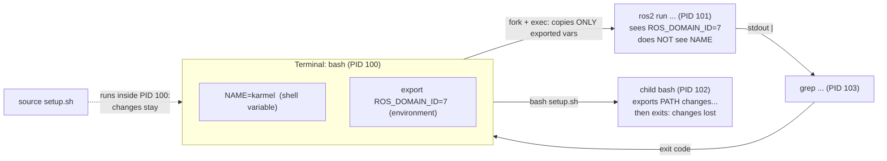

# FL.03 — The shell for Windows developers

<!-- glance:start -->
<!-- generated by tools/build.py from curriculum/syllabus.yaml — edit the syllabus, not this block -->

| | |
|---|---|
| **Track** | Optional foundation |
| **Difficulty** | Beginner |
| **Time** | 1 h |
| **Hardware** | none |
| **Software** | ubuntu |
| **Prerequisites** | [FL.02 Getting Ubuntu: dual boot, VM or WSL2](FL.02-installing-ubuntu.md) |
| **Skip if** | You are comfortable in bash. |

<!-- glance:end -->

## What you will learn

- Translate what you do in PowerShell into bash: navigation, files, search, processes, environment variables.
- Compose pipelines with `|`, redirect `stdout`/`stderr` to files, and use exit codes with `&&` and `||`.
- Explain the difference between a shell variable and an exported environment variable, and between *running* a script and *sourcing* it. This is the reason `source /opt/ros/jazzy/setup.bash` exists.
- Write a small, safe bash script (`set -euo pipefail`, arguments, quoting) and make it executable.
- Diagnose the three classic Windows-developer shell failures: CRLF line endings, missing execute bit, unquoted spaces.

## Why it matters

Every robot you will program is operated through a shell. You will `ssh` into the Raspberry Pi
([01.04](../../01-first-robot/01.04-raspberry-pi-setup.md)), `source` ROS 2 environments and set `ROS_DOMAIN_ID`
([04.02](../../04-ros2/04.02-installing-ros2.md)), grep logs when the robot stops, and write small scripts that
start drivers. ROS 2's command-line tools (`ros2 topic echo | grep …`) assume you think in pipes.
A lot of "ROS is broken" problems are shell problems: an unsourced terminal, a variable that was set but not
exported, a script saved with Windows line endings.

<!-- prereqs:start -->
## Prerequisites

You need these first:

- [FL.02 Getting Ubuntu: dual boot, VM or WSL2](FL.02-installing-ubuntu.md)

### Optional prerequisite links

None.

Check your readiness: `python course.py why FL.03`
<!-- prereqs:end -->

## Concept

### Objects vs text

PowerShell pipes **.NET objects**: `Get-Process | Where-Object CPU -gt 10` filters on a typed property.
Bash pipes **bytes**, usually lines of text. Every Unix tool is a small program that reads lines on standard input,
transforms them, and writes lines on standard output. So in bash you filter with text tools (`grep`, `cut`, `awk`,
`sort`) instead of property names. This sounds primitive, but it composes: every tool, including `ros2 topic echo`,
speaks the same format.

Every process has three standard streams, like `Console.In`, `Console.Out` and `Console.Error`:

| Stream | Number | Default | Redirect |
|---|---|---|---|
| stdin | 0 | keyboard | `< file` |
| stdout | 1 | terminal | `> file` (overwrite), `>> file` (append), `\| next-command` |
| stderr | 2 | terminal | `2> file`, `2>&1` (send to wherever stdout goes) |

And every process ends with an **exit code**: `0` means success, anything else means failure. There are no
exceptions crossing process boundaries, only exit codes. `&&` runs the next command only on success, `||` only on
failure.

### The shell is a process with its own memory

When you type `NAME=karmel`, that variable lives **in this bash process only**. Programs you start are *child
processes*: they receive a copy of the **exported** variables (the environment), never the unexported ones, and
they can never change their parent's variables. Two consequences you will hit in ROS 2 on day one:

1. `export ROS_DOMAIN_ID=7` is needed. Without `export`, `ros2` (a child process) never sees it.
2. `bash setup.sh` runs the setup script in a *child* bash, which exits and takes its variables with it.
   `source setup.sh` (or `. setup.sh`) runs it *inside your current shell*, so its `export`s stay. That is why every
   ROS tutorial says `source /opt/ros/jazzy/setup.bash`, and why you need it **in every new terminal** (or in `~/.bashrc`).

> [!TIP]
> **Ask your teacher:** "Draw the process tree when I open a terminal, source ROS 2, and run `ros2 run`. Which variables does each process see?"

## Technical explanation

### Level 1 — PowerShell → bash phrasebook

| Task | PowerShell | bash |
|---|---|---|
| Where am I / go / back | `Get-Location`, `cd`, `cd -` | `pwd`, `cd dir`, `cd -` (previous dir), `cd` alone = home `~` |
| List (incl. hidden) | `Get-ChildItem -Force` | `ls -la` |
| Show file | `Get-Content f` | `cat f`, `less f` (q to quit), `tail -n 20 f`, `tail -f f` (follow) |
| Search text | `Select-String err *.log` | `grep -n err *.log` (`-i` ignore case, `-r` recursive, `-v` invert, `-c` count) |
| Find files | `Get-ChildItem -Recurse -Filter *.yaml` | `find . -name '*.yaml'` |
| Copy / move / delete | `Copy-Item`, `Move-Item`, `Remove-Item -Recurse` | `cp -r`, `mv`, `rm -r` (**no recycle bin**) |
| Make dir (with parents) | `New-Item -ItemType Directory -Force a\b` | `mkdir -p a/b` |
| Env var read / set | `$env:PATH`, `$env:X = "1"` | `echo "$PATH"`, `export X=1` |
| Which executable runs | `Get-Command python` | `type python3`, `which python3` |
| Last exit code | `$LASTEXITCODE` / `$?` (bool) | `$?` (number) |
| Processes | `Get-Process`, `Stop-Process` | `ps aux`, `pgrep -a name`, `kill PID` ([FL.06](FL.06-processes-systemd.md)) |
| Run as admin | elevated window | `sudo command` ([FL.05](FL.05-permissions-users-groups.md)) |
| Help | `Get-Help cmd` | `man cmd`, `cmd --help` |

Keyboard habits that save hours: **Tab** completes names (press twice to list options), **Ctrl+R** searches
command history, **Ctrl+C** interrupts the running program, **Ctrl+D** ends input / logs out, **Ctrl+L** clears.
Paths use `/`, names are **case-sensitive** (`Config.yaml` ≠ `config.yaml`), and a leading `.` makes a file hidden.

### Level 2 — Pipes, redirection, exit codes

Take a robot log with telemetry lines and warnings:

```text
t=0.00 left=0 right=0
t=0.02 left=12 right=11
WARN battery 11.1V
t=0.04 left=25 right=23
ERROR serial timeout
t=0.06 left=37 right=36
WARN battery 11.0V
```

```bash
grep -c WARN logs/run1.log                 # 2           count matching lines
grep -v '^t=' logs/run1.log                # the 3 non-telemetry lines (^ = start of line)
grep '^t=' logs/run1.log | wc -l           # 4           pipe: output of grep becomes input of wc
tail -n 1 logs/run1.log                    # WARN battery 11.0V
grep -h '^WARN' logs/*.log | sort | uniq -c   # count identical warnings across files
```

Redirection and exit codes, verified on Ubuntu 24.04:

```bash
ls nothere > out.txt        # error still on the screen: > only captures stdout
echo "exit=$?"              # exit=2
ls nothere 2> err.txt       # now the error is in err.txt
ls logs nothere > all.txt 2>&1   # both streams into all.txt (order matters: 2>&1 after >)
make_map && echo "saved"  || echo "mapping failed"
```

`$( … )` captures a command's output into a string: `count=$(grep -c WARN logs/run1.log)`.
`$(( … ))` does integer math: `echo $((7400 + 250 * 7))` prints `9150`. That happens to be the DDS discovery port
for ROS domain 7, which you'll meet in [FL.09](FL.09-networking-basics.md).

### Level 3 — Quoting and globbing

The shell rewrites your command line **before** the program runs. It splits on spaces, expands `*` to matching
filenames (globbing), and replaces `$VAR` with its value. Quotes control this:

| You type | Program receives |
|---|---|
| `echo files: *.sh` | `files: crlf.sh env.sh noexec.sh` (glob expanded by the shell) |
| `echo "files: *.sh"` | `files: *.sh` (no globbing inside quotes) |
| `echo "robot: $NAME"` | `robot: karmel` (double quotes expand variables) |
| `echo 'robot: $NAME'` | `robot: $NAME` (single quotes are literal) |
| `f="my log.txt"; ls $f` | two arguments `my` and `log.txt`, so two "cannot access" errors |
| `ls "$f"` | one argument `my log.txt` |

Rule: **always double-quote variables** (`"$f"`, `"$@"`) unless you specifically want splitting.

### Level 4 — Scripts, `PATH`, `~/.bashrc`

A script is a text file with a *shebang* first line naming its interpreter:

```bash
#!/usr/bin/env bash
set -euo pipefail   # -e: stop on error  -u: unset variable is an error  pipefail: a failing stage fails the pipe
```

To run it as `./script.sh` it needs the **execute permission**: `chmod +x script.sh`. Otherwise bash answers
`Permission denied` with exit code 126. You can always run `bash script.sh` without the bit.

When you type a bare command like `ros2`, bash searches the directories in `$PATH` from left to right. `type ros2`
shows which file wins. Sourcing `/opt/ros/jazzy/setup.bash` prepends `/opt/ros/jazzy/bin` to `PATH` and sets
`AMENT_PREFIX_PATH`, `PYTHONPATH`, `LD_LIBRARY_PATH` and `ROS_DISTRO`, all exported.

`~/.bashrc` runs at the start of every interactive bash. Put things you want in *every* terminal at its end:

```bash
echo 'source /opt/ros/jazzy/setup.bash' >> ~/.bashrc
echo 'export ROS_DOMAIN_ID=7' >> ~/.bashrc
```

Then open a new terminal or run `source ~/.bashrc`.

**Line endings.** Windows editors may save `\r\n` (CRLF). Linux expects `\n`. A script with CRLF looks for an
interpreter literally named `bash\r`. Bash 5.2 on Ubuntu 24.04 reports that as
`cannot execute: required file not found` (exit code 127), which is very misleading. Fix it with
`sed -i 's/\r$//' script.sh`, and prevent it with a `.gitattributes` line `*.sh text eol=lf` and LF as VS Code's
default for the repo.

## Diagram



## Code

A small, well-behaved script: it summarizes robot log files, handles bad input and uses correct exit codes.
Save it as `~/bin/logsummary.sh`:

```bash
#!/usr/bin/env bash
# logsummary.sh — summarize robot log files: counts per level and the last telemetry line.
# Usage: logsummary.sh LOGFILE [LOGFILE...]
set -euo pipefail

if (( $# == 0 )); then
  echo "usage: $(basename "$0") LOGFILE [LOGFILE...]" >&2
  exit 2
fi

for log in "$@"; do
  if [[ ! -r "$log" ]]; then
    echo "skip: cannot read $log" >&2
    continue
  fi
  warns=$(grep -c '^WARN' "$log" || true)      # grep -c exits 1 when the count is 0
  errors=$(grep -c '^ERROR' "$log" || true)
  last_t=$(grep '^t=' "$log" | tail -n 1)
  echo "== $log"
  echo "   telemetry lines: $(grep -c '^t=' "$log" || true)"
  echo "   warnings: $warns  errors: $errors"
  echo "   last telemetry: ${last_t:-none}"
done
```

Things to notice: `$#` is the argument count, `"$@"` is all arguments with spaces preserved, `>&2` writes to stderr,
and `|| true` stops `set -e` from aborting when `grep` finds nothing (grep's exit code 1 means "no match", not "error").
`${last_t:-none}` means "the value, or `none` if empty".

Create test data and run it:

```bash
mkdir -p ~/karmel/logs && cd ~/karmel
printf 't=0.00 left=0 right=0\nt=0.02 left=12 right=11\nWARN battery 11.1V\nt=0.04 left=25 right=23\nERROR serial timeout\nt=0.06 left=37 right=36\nWARN battery 11.0V\n' > logs/run1.log
printf 't=0.00 left=0 right=0\nt=0.02 left=10 right=10\n' > logs/run2.log
chmod +x ~/bin/logsummary.sh
~/bin/logsummary.sh logs/*.log missing.log; echo "exit=$?"
```

No Ubuntu yet? Run every command of this lesson in `docker run --rm -it ubuntu:24.04 bash`.

## Exercise

### Exercise FL.03-E1 — Predict the pipeline `[predict]`

Hardware: none. Using `logs/run1.log` above, **write down the output first**, then run:

1. `grep '^t=' logs/run1.log | cut -d' ' -f2 | cut -d= -f2 | sort -n | tail -1`
2. `grep -c ERROR logs/run1.log; echo $?` and `grep -c FATAL logs/run1.log; echo $?`
3. `ls logs nothere > all.txt; cat all.txt` (what appears on screen vs in the file?)

### Exercise FL.03-E2 — Run your log summarizer `[coding]`

Hardware: none. Create the script and test data from the Code section and run:

1. `~/bin/logsummary.sh logs/*.log missing.log; echo "exit=$?"`
2. `~/bin/logsummary.sh; echo "exit=$?"`
3. `~/bin/logsummary.sh logs/*.log 2>/dev/null | grep errors`

Then extend it: add a line `max left ticks: N` using a pipeline.

### Exercise FL.03-E3 — Export or not `[predict]`

Hardware: none. Predict each output, then run in a fresh terminal:

```bash
NAME=karmel
bash -c 'echo "child sees: [$NAME]"'
export NAME
bash -c 'echo "child sees: [$NAME]"'
printf 'export ROBOT_NAME=karmel\n' > env.sh
bash env.sh;   echo "after bash:   [$ROBOT_NAME]"
source env.sh; echo "after source: [$ROBOT_NAME]"
ROS_DOMAIN_ID=3 bash -c 'echo "inside: $ROS_DOMAIN_ID"'; echo "after: [${ROS_DOMAIN_ID:-}]"
```

### Exercise FL.03-E4 — The script that "does not exist" `[debugging]`

Hardware: none. Simulate a script saved on Windows, then diagnose it:

```bash
printf '#!/bin/bash\r\necho hello\r\n' > crlf.sh
chmod +x crlf.sh
./crlf.sh; echo "exit=$?"
```

Use `cat -A crlf.sh` to *see* the problem, fix it with one command, and run it again. Then create `noexec.sh` without
`chmod +x` and compare the error.

## Expected result

**FL.03-E1:** (1) `37`, the largest `left` value. (2) `1` then `0` (a match found, exit 0), and `0` then `1`
(no match: count 0, exit code 1). (3) The screen shows `ls: cannot access 'nothere': No such file or directory`
(stderr isn't redirected). `all.txt` contains `logs:` and `run1.log` (and `run2.log` if you created it).

**FL.03-E2:** (1) prints the following, with exit code `0` (skipping a file is not fatal):

```text
== logs/run1.log
   telemetry lines: 4
   warnings: 2  errors: 1
   last telemetry: t=0.06 left=37 right=36
== logs/run2.log
   telemetry lines: 2
   warnings: 0  errors: 0
   last telemetry: t=0.02 left=10 right=10
skip: cannot read missing.log
exit=0
```

(2) `usage: logsummary.sh LOGFILE [LOGFILE...]` then `exit=2`. (3) Only the two `warnings: … errors: …` lines, and
no `skip:` line, because it went to stderr and `2>/dev/null` discarded it. Extension: something like
`grep '^t=' "$log" | cut -d' ' -f2 | cut -d= -f2 | sort -n | tail -1` giving `max left ticks: 37` and `10`.

**FL.03-E3:**

```text
child sees: []
child sees: [karmel]
after bash:   []
after source: [karmel]
inside: 3
after: []
```

The `VAR=value command` form sets the variable only for that one command.

**FL.03-E4:** `./crlf.sh` prints `bash: ./crlf.sh: cannot execute: required file not found` and `exit=127`.
`cat -A crlf.sh` shows `#!/bin/bash^M$`, where `^M` is the carriage return. `sed -i 's/\r$//' crlf.sh` fixes it,
after which `./crlf.sh` prints `hello`. `./noexec.sh` without `chmod +x` prints
`bash: ./noexec.sh: Permission denied`, `exit=126`.

## Troubleshooting

### Symptom: `command not found`

1. Typo or case? `Ros2` ≠ `ros2`. Use Tab completion.
2. Is it installed? `type name` / `apt policy package` ([FL.07](FL.07-package-management.md)).
3. Installed but not on `PATH`? For ROS: did you `source /opt/ros/jazzy/setup.bash` **in this terminal**?
   `echo "$PATH" | tr ':' '\n'` lists the search directories.
4. A script in the current directory: bash doesn't search `.`. Use `./script.sh`.

### Symptom: a variable is set but a program ignores it

1. `declare -p NAME` shows `declare -x` if it's exported and `declare --` if not. If not, `export NAME`.
2. Did you set it in a *different* terminal, or in a script you ran with `bash` instead of `source`?
3. Did the program start before you set it? Environment is copied at process start.

### Symptom: a script fails with a confusing error on the first line

`cat -A script.sh | head -2`: `^M$` at line ends means CRLF, fix with `sed -i 's/\r$//'`. If the error is `Permission denied`,
run `chmod +x`. If it runs with `sh script.sh` but not `bash`, or the reverse, check the shebang. On Ubuntu `sh` is `dash`,
which doesn't understand bash features like `[[ ]]`.

### Symptom: `rm` or `mv` did something to the wrong files

Before running a destructive command with a glob, run `echo` with the same glob first (`echo rm build/*`) to see what
it expands to. There's no recycle bin.

## Common mistakes

- **Unquoted variables** (`cd $DIR`): they break on spaces and globs. Write `cd "$DIR"`.
- **`2>&1 > file`** instead of `> file 2>&1`: redirections apply left to right, so the first form still prints errors on screen.
- **Running a setup script with `bash` instead of `source`** and wondering why nothing changed.
- **Forgetting that every new terminal starts fresh**: source ROS again or add it to `~/.bashrc`.
- **Adding many `source` lines to `~/.bashrc`** for different ROS distros or workspaces: environments stack up and conflict. Keep one.
- **Saving shell scripts with CRLF** from a Windows editor.
- **Treating grep's exit code 1 as an error** in `set -e` scripts. It means "no match".
- **`sudo` with redirection** (`sudo echo x > /etc/file`): the redirection runs as *you*. Use `echo x | sudo tee /etc/file` ([FL.05](FL.05-permissions-users-groups.md)).

## Knowledge check

1. What's the difference between `>` , `>>` and `2>&1`?
   <details><summary>Answer</summary>

   `>` writes stdout to a file, replacing its contents. `>>` appends. `2>&1` sends stderr to wherever stdout currently
   points, so it must come after `> file` to capture both.
   </details>

2. Why does every ROS 2 tutorial say `source /opt/ros/jazzy/setup.bash` instead of `bash /opt/ros/jazzy/setup.bash`?
   <details><summary>Answer</summary>

   `bash file` runs it in a child process whose exported variables disappear when it exits. `source` runs it in the
   current shell, so `PATH`, `AMENT_PREFIX_PATH`, `PYTHONPATH` etc. stay set for the commands you run next.
   </details>

3. `grep -c FATAL run.log` prints `0`. What's `$?` and why does it matter in a script with `set -e`?
   <details><summary>Answer</summary>

   `1`: grep exits 1 when nothing matches. With `set -e` the script would stop there. Use `|| true` when "no match" is acceptable.
   </details>

4. You ran `ROS_DOMAIN_ID=5` (no export), then `ros2 topic list` shows topics from domain 0. Explain and fix.
   <details><summary>Answer</summary>

   An unexported shell variable isn't copied to child processes, so `ros2` used the default domain 0. Use
   `export ROS_DOMAIN_ID=5`, or `ROS_DOMAIN_ID=5 ros2 topic list` for a single command.
   </details>

5. A teammate's `start_robot.sh` runs fine for them but for you prints `cannot execute: required file not found`,
   even though the file exists. What do you check first?
   <details><summary>Answer</summary>

   Line endings: `cat -A start_robot.sh | head -1`. `^M` means CRLF, probably from a Windows checkout or editor.
   Fix with `sed -i 's/\r$//'` and add `*.sh text eol=lf` to `.gitattributes`.
   </details>

6. What does `echo $((7400 + 250 * 2))` print, and what does `echo '$((7400 + 250 * 2))'` print?
   <details><summary>Answer</summary>

   `7900`, then the literal text `$((7400 + 250 * 2))`, because single quotes prevent all expansion.
   </details>

7. How do you see which `python3` will run, and all directories bash searches?
   <details><summary>Answer</summary>

   `type python3` (or `which python3`), and `echo "$PATH" | tr ':' '\n'`.
   </details>

## Practical challenge

Write `~/bin/robot-env.sh`, a script you **source** in a new terminal to prepare a ROS 2 session:

- It refuses to be *executed* (only sourced) and says so. Hint: compare `"${BASH_SOURCE[0]}"` with `"$0"`.
- It sources `/opt/ros/jazzy/setup.bash` if present, otherwise prints a warning to stderr.
- It takes an optional domain ID argument (default `7`), checks that it is an integer in 0–101, and exports `ROS_DOMAIN_ID`.
- It sources `~/karmel_ws/install/setup.bash` if that file exists.
- It prints one summary line: `ROS_DISTRO=jazzy ROS_DOMAIN_ID=7 workspace=yes|no`.

Acceptance criteria: `bash ~/bin/robot-env.sh` exits non-zero with a clear message. `source ~/bin/robot-env.sh 12` sets
`ROS_DOMAIN_ID=12` in your shell (`echo $ROS_DOMAIN_ID`). `source ~/bin/robot-env.sh abc` refuses without closing your
terminal (use `return`, not `exit`). The file has LF line endings. Works in the `ros:jazzy-ros-base` container.

## You can skip this if…

You're comfortable in bash and answer knowledge-check questions 1, 2, 4 and 5 correctly without looking. Then:
`python course.py skip FL.03 --reason "comfortable in bash"`.

## Go deeper

- https://missing.csail.mit.edu/ — MIT Missing Semester: lectures on the shell, shell tools and scripting, and command-line environment. Best next step.
- https://linuxcommand.org/tlcl.php — *The Linux Command Line* (free book). Parts 1 and 4 cover everything here in depth.
- https://ubuntu.com/tutorials/command-line-for-beginners — Canonical's short hands-on tutorial if you want a second gentle pass.
- https://www.gnu.org/software/bash/manual/bash.html — the Bash Reference Manual, for exact quoting and expansion rules.
- https://www.shellcheck.net/ — ShellCheck finds quoting bugs and other pitfalls in your scripts (`sudo apt install shellcheck`).

## Progress checkpoint

- [ ] I can do my everyday PowerShell tasks in bash.
- [ ] I can build pipelines, redirect stdout/stderr and use exit codes with `&&`/`||`.
- [ ] I can explain export vs shell variables and source vs execute.
- [ ] I can write a safe bash script with arguments and quoting, and fix CRLF / execute-bit problems.

`python course.py complete FL.03` (exercises done) · `python course.py master FL.03` (challenge done) ·
`python course.py struggle FL.03 "what was hard"`.

Next: [FL.04 — The Linux filesystem and paths](FL.04-filesystem.md).
