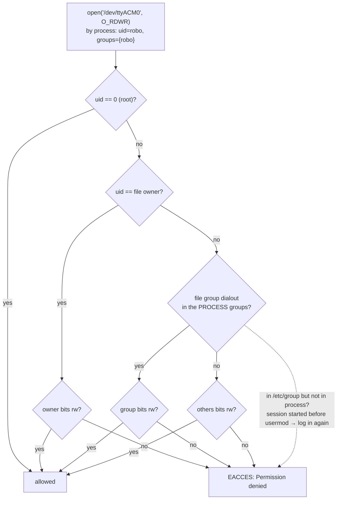

# FL.05 — Permissions, users, groups and sudo (dialout, gpio, video)

<!-- glance:start -->
<!-- generated by tools/build.py from curriculum/syllabus.yaml — edit the syllabus, not this block -->

| | |
|---|---|
| **Track** | Optional foundation |
| **Difficulty** | Beginner |
| **Time** | 45 min |
| **Hardware** | none |
| **Software** | ubuntu |
| **Prerequisites** | [FL.04 The Linux filesystem and paths](FL.04-filesystem.md) |
| **Skip if** | You fix "permission denied" on /dev/ttyACM0 in seconds. |

<!-- glance:end -->

## What you will learn

- Read `-rw-rw---- root dialout` and say exactly who can open a file, including in octal (`660`).
- Fix "Permission denied" on `/dev/ttyACM0`, `/dev/video0`, `/dev/i2c-1` and `/dev/gpiochip*` the right way: group membership plus a new login, not `chmod 777` or `sudo`.
- Know which groups matter on Ubuntu 24.04 (`dialout`, `video`, `plugdev`, `render`, `sudo`) and how Ubuntu for Raspberry Pi differs from Raspberry Pi OS (no `gpio` group).
- Use `sudo` safely: what it does, `sudo tee`, `/etc/sudoers.d` with `visudo`, and why you never `sudo colcon build`.
- Write, verify and apply your first udev rule that gives the Pico a fixed name and permissions.

## Why it matters

The first time you connect the Pico to the Pi ([01.05](../../01-first-robot/01.05-pico-microcontroller-setup.md)) or
run the robot's serial driver ([01.10](../../01-first-robot/01.10-pi-pico-protocol.md)), you will very likely see:

```text
serial.serialutil.SerialException: [Errno 13] could not open port /dev/ttyACM0: [Errno 13] Permission denied: '/dev/ttyACM0'
```

The same happens with the webcam in [07.08](../../07-sensors/07.08-rgb-cameras.md) and with I2C sensors and GPIO on the Pi.
The two quick fixes you'll find online, `sudo python3 driver.py` and `sudo chmod 666 /dev/ttyACM0`, each cause a new problem
(root-owned files everywhere, a fix that disappears on the next replug). This lesson gives you the correct fix in
seconds, and the udev rule that [03.03](../../03-robot-software/03.03-robust-serial-communication.md) builds on.

<!-- prereqs:start -->
## Prerequisites

You need these first:

- [FL.04 The Linux filesystem and paths](FL.04-filesystem.md)

### Optional prerequisite links

None.

Check your readiness: `python course.py why FL.05`
<!-- prereqs:end -->

## Concept

### Access control, Linux style

Windows uses ACLs: a list of users and groups per file, with many permission types. Classic Linux uses a much simpler
model that covers 95 % of what you'll meet:

- Every file has **one owner (user)** and **one group**.
- There are three permission sets: for the **owner**, for **members of the group**, and for **everyone else**.
- Each set is three bits: **r**ead, **w**rite, e**x**ecute.
- Every process runs as a user and carries a list of groups. The kernel checks owner first, then group, then others,
  and uses the **first** set that applies.

Hardware access is handled **with groups**. The system doesn't give *you* the serial port. It makes the device
group-owned by `dialout` and lets you join `dialout`. It's like adding a service account to an AD security group instead
of granting permissions user by user.

### The login-snapshot rule

Your process's group list is copied **when you log in**. Adding yourself to a group edits `/etc/group`, but every shell,
SSH session and desktop session that's already running keeps the old list. That's why "I added myself to dialout and it
still says permission denied" is the most common Linux question in robotics. The fix is to **log out and in again** (or
reboot, or open a new SSH connection).

### root and sudo

`root` (UID 0) bypasses permission checks. `sudo` runs **one command** as root after asking for **your** password, and
Ubuntu caches it for 15 minutes. Use it to change the system (install packages, edit `/etc`, add users to groups), not to
run your robot code.

> [!TIP]
> **Ask your teacher:** "Walk me through the exact kernel permission check when my Python process opens /dev/ttyACM0, step by step, with my real `id` output."

## Technical explanation

### Level 1 — Reading and changing permissions

```text
-rwxr-x---  1  robo  robo  9  Sep 16 20:11  drive.py
 └┬┘└┬┘└┬┘      └─┬┘  └─┬┘
 owner group others  owner group
  rwx   r-x   ---
  4+2+1 4+0+1 0      → octal 750
```

Octal is the sum of r=4, w=2, x=1 per set: `rw-` = 6, `r-x` = 5, `rw-rw----` = `660`. On a directory, `x` means
"may enter/traverse" and `r` means "may list".

| Command | Effect | Result (verified on Ubuntu 24.04) |
|---|---|---|
| `chmod 750 drive.py` | set exactly | `-rwxr-x---` |
| `chmod u+x,g-r drive.py` | add/remove bits symbolically | from `rw-r--r--` → `-rwx--x---` (`710`) |
| `stat -c '%a %A %U:%G %n' drive.py` | print octal + symbolic + owner:group | `710 -rwx--x--- root:root drive.py` |
| `sudo chown robo:dialout file` | change owner and group | needs root |
| `umask` | default bits removed from new files | `0002` for normal users on Ubuntu (new files `rw-rw-r--`), `0022` for root |

`/tmp` shows `drwxrwxrwt`. The final `t` (sticky bit) lets everyone create files there but only delete their own.

### Level 2 — Users, groups and the device groups that matter

```bash
id                 # uid=1000(you) gid=1000(you) groups=1000(you),4(adm),27(sudo),...  ← THIS session
id -nG             # just the group names for this session
getent group dialout   # dialout:x:20:ubuntu,you   ← the database (/etc/group)
```

If `getent group dialout` lists you but `id -nG` doesn't include `dialout`, you have a stale session.

| Group (GID on Ubuntu) | Grants access to | When you need it |
|---|---|---|
| `dialout` (20) | serial ports `/dev/ttyACM*`, `/dev/ttyUSB*`, `/dev/ttyAMA*`. **On Ubuntu for Raspberry Pi also** `/dev/gpiochip*`, `/dev/i2c-*`, `/dev/spidev*` | Pico, LiDAR, GPS; GPIO/I2C/SPI on the Pi |
| `video` (44) | `/dev/video*` (V4L2 cameras) | USB webcam over SSH or in services |
| `render` | `/dev/dri/renderD*` (GPU compute/render nodes) | GPU-accelerated inference or rendering without a desktop session |
| `plugdev` (46) | some USB devices via vendor udev rules | depth cameras, debug probes |
| `input` | `/dev/input/event*` | gamepad teleop with evdev |
| `sudo` (27) | may use `sudo` | admin |

**Ubuntu vs Raspberry Pi OS on the Pi.** Tutorials for Raspberry Pi OS tell you to join `gpio`, `i2c` and `spi` groups.
**Ubuntu 24.04 for Raspberry Pi has no `gpio` group.** Its package `ubuntu-raspi-settings` installs
`/usr/lib/udev/rules.d/60-gpio.rules`, which gives `/dev/gpiochip*` (including the Pi 5's RP1 chip), `/dev/i2c-[0-6]`
and `/dev/spidev*` to group **`dialout`** with mode `0660` (checked in package version 24.04.4). So on the course's Pi, joining `dialout` covers serial,
GPIO, I2C and SPI. Don't trust a tutorial's group name: check with `ls -l /dev/gpiochip*`, see which group owns it, and join that group.

**Desktop sessions and the `+` sign.** On Ubuntu Desktop, `ls -l /dev/video0` may show `crw-rw----+`. The `+` means an
extra ACL: systemd-logind grants the **locally logged-in desktop user** access to some devices (udev tag `uaccess`),
visible with `getfacl /dev/video0`. That's why the webcam works in a desktop app but **not** over SSH or in a
systemd service. Those don't get the ACL, so they need the `video` group.

The fix, once per user and machine:

```bash
sudo usermod -aG dialout,video "$USER"   # -a = APPEND. Without -a you are REMOVED from all other groups (incl. sudo!)
# then: log out and back in (desktop), or exit and reconnect (SSH), or reboot (Pi). In WSL: wsl --terminate Ubuntu-24.04
id -nG                                   # must now include dialout and video
```

The danger of forgetting `-a`, verified: after `usermod -aG sudo robo`, `id robo` showed `groups=…,20(dialout),27(sudo)`.
Then `usermod -G video robo` left `groups=1001(robo),44(video)`. The user lost `sudo`.

### Level 3 — sudo without shooting yourself in the foot

- `sudo cmd` runs `cmd` as root. `sudo -l` lists what you may run. `sudo -i` opens a root shell (use rarely, exit soon).
- **Redirection happens in your shell, not under sudo.** `sudo echo hello > /etc/karmel.conf` fails with
  `/etc/karmel.conf: Permission denied`: `echo` ran as root, but *your* shell opened the file. Use
  `echo hello | sudo tee /etc/karmel.conf` (`tee -a` to append).
- **Never `sudo colcon build`, `sudo pip`, or `sudo python3 robot.py`.** Files created in `build/`, `install/`, `log/` and
  `~/.ros` become root-owned, and your next normal build fails with permission errors. Recover with
  `sudo chown -R "$USER": ~/karmel_ws ~/.ros` and fix the real cause (the group).
- **Never `chmod 666 /dev/ttyACM0`.** `/dev` is recreated by udev on every plug-in and boot, so the change disappears.
  It also opens the device to every user on the machine.
- Passwordless sudo for a service account goes in its own file, edited with `sudo visudo -f /etc/sudoers.d/robot`.
  `visudo` checks syntax before saving, and a broken sudoers file can lock you out of `sudo`. The file must be mode `0440`, or
  `visudo -c` reports `bad permissions, should be mode 0440`.

### Level 4 — udev: permissions and names that survive replugging

**udev** is the daemon that creates device files in `/dev` when the kernel detects hardware. Rules in `/etc/udev/rules.d/*.rules`
match device attributes and set group, mode and extra symlinks. Rule files are processed in lexical order, so a
`99-` prefix runs after the distribution's rules and wins.

Find the attributes of your device:

```bash
udevadm info -q property -n /dev/ttyACM0 | grep -E 'ID_VENDOR_ID|ID_MODEL_ID|ID_SERIAL_SHORT'
udevadm info -a -n /dev/ttyACM0 | grep -E 'idVendor|idProduct|serial' | head -3
```

For a Pico running MicroPython, the USB vendor:product is `2e8a:0005` (Raspberry Pi's vendor ID, MicroPython's rp2 product ID,
from MicroPython's `ports/rp2/mpconfigport.h`). Rule file `/etc/udev/rules.d/99-karmel.rules`:

```text
# Raspberry Pi Pico running MicroPython -> /dev/karmel_pico
SUBSYSTEM=="tty", ATTRS{idVendor}=="2e8a", ATTRS{idProduct}=="0005", SYMLINK+="karmel_pico", GROUP="dialout", MODE="0660"
```

- `==` means *match*, while `=` and `+=` *assign*. `ATTRS{…}` searches the device **and its parents** (the USB device is a parent of the tty).
- `SYMLINK+=` adds `/dev/karmel_pico` → `ttyACM0`. The number can change, but the name stays.
- Add `ATTRS{serial}=="e6614c311b7e6f35"` to tell two identical boards apart.

Verify, install, apply:

```bash
udevadm verify 99-karmel.rules              # systemd 255 (Ubuntu 24.04) can lint rule files
sudo cp 99-karmel.rules /etc/udev/rules.d/
sudo udevadm control --reload-rules
sudo udevadm trigger --subsystem-match=tty  # or unplug and replug
ls -l /dev/karmel_pico
```

This is the introduction. Matching serial numbers, `ENV{…}`, running programs on plug events, and making the driver
reconnect are covered in [03.03](../../03-robot-software/03.03-robust-serial-communication.md).

## Diagram



## Code

`why_denied.py` explains a permission problem instead of just reporting it. It compares the device's owner, group and mode
with your **session's** groups *and* the group database, so it can tell "not in group" from "added but stale session"
from "wrong mode". Standard library only, runs with the system `python3`.

`~/bin/why_denied.py`:

```python
#!/usr/bin/env python3
"""why_denied.py — explain whether (and why) this process can read/write a device file.

Usage: python3 why_denied.py /dev/ttyACM0 [/dev/video0 ...]
"""
from __future__ import annotations

import grp
import os
import pwd
import stat
import sys
from dataclasses import dataclass


@dataclass(frozen=True)
class Verdict:
    path: str
    ok: bool
    lines: tuple[str, ...]


def groups_in_database(user: str, primary_gid: int) -> set[str]:
    """Groups /etc/group says the user belongs to (what `id <user>` would show after a new login)."""
    names = {g.gr_name for g in grp.getgrall() if user in g.gr_mem}
    names.add(grp.getgrgid(primary_gid).gr_name)
    return names


def explain(path: str) -> Verdict:
    try:
        st = os.stat(path)
    except FileNotFoundError:
        return Verdict(path, False, ("does not exist: device unplugged, wrong name, or not passed into WSL/Docker",))

    owner = pwd.getpwuid(st.st_uid).pw_name
    group = grp.getgrgid(st.st_gid).gr_name
    mode = stat.filemode(st.st_mode)
    me = pwd.getpwuid(os.geteuid()).pw_name
    session_groups = {grp.getgrgid(g).gr_name for g in os.getgroups()} | {grp.getgrgid(os.getegid()).gr_name}
    db_groups = groups_in_database(me, pwd.getpwnam(me).pw_gid)
    can_rw = os.access(path, os.R_OK | os.W_OK)

    lines = [f"{mode} owner={owner} group={group}", f"you are '{me}', session groups: {' '.join(sorted(session_groups))}"]
    if can_rw:
        lines.append("read/write: OK")
    elif os.geteuid() != st.st_uid and group not in session_groups:
        if group in db_groups:
            lines.append(f"DENIED: you were added to '{group}' but this session started before that. Log out and in (or reboot).")
        else:
            lines.append(f"DENIED: you are not in group '{group}'. Fix: sudo usermod -aG {group} {me}  then log out and in.")
    else:
        lines.append("DENIED: you have the right owner/group but the mode lacks rw. Check the udev rule MODE for this device.")
    return Verdict(path, can_rw, tuple(lines))


def main(argv: list[str]) -> int:
    if len(argv) < 2:
        print(__doc__.strip(), file=sys.stderr)
        return 2
    verdicts = [explain(p) for p in argv[1:]]
    for v in verdicts:
        print(f"{v.path}:")
        for line in v.lines:
            print(f"  {line}")
    return 0 if all(v.ok for v in verdicts) else 1


if __name__ == "__main__":
    sys.exit(main(sys.argv))
```

Run: `python3 ~/bin/why_denied.py /dev/ttyACM0 /dev/video0`. Exit code 0 means all accessible.

## Exercise

All exercises except E4 work without hardware in a container that simulates a device with a regular file:
`docker run --rm -it ubuntu:24.04 bash`, then `apt-get update && apt-get install -y sudo python3 python3-serial`,
`useradd -m -s /bin/bash robo`, and `touch /tmp/ttyACM0 && chown root:dialout /tmp/ttyACM0 && chmod 660 /tmp/ttyACM0`.
Copy `why_denied.py` in, e.g. with `docker cp`, or start the container with `-v "${PWD}:/s"`.

### Exercise FL.05-E1 — Octal fluency `[numerical]`

Hardware: none. Convert without a computer, then check with `chmod` + `stat -c '%a %A'`:

1. `rw-rw----`, `rwxr-xr-x`, `rw-------`, `rwx--x---` → octal?
2. `644`, `600`, `755`, `440` → symbolic? Which one must an SSH private key have ([FL.08](FL.08-ssh-remote-dev.md))? Which one a sudoers.d file?
3. With `umask 0002`, what mode does a new file get (files start from `666`)? A new directory (starts from `777`)?

### Exercise FL.05-E2 — Reproduce and fix "Permission denied" `[debugging]`

Hardware: none (simulated device).

1. As `robo`: `su - robo -c 'python3 -c "import serial; serial.Serial(\"/tmp/ttyACM0\", 115200)"'`. Read the last line.
2. `su - robo -c 'python3 /s/why_denied.py /tmp/ttyACM0 /tmp/ttyACM9; echo "exit=$?"'`
3. Fix it the right way (as root in the container: `usermod -aG dialout robo`), start a **new** login, run step 2 again.
4. Remove the group's write bit (`chmod 640 /tmp/ttyACM0`) and run the checker once more.

### Exercise FL.05-E3 — The sudo redirection trap and a udev rule lint `[predict]`

Hardware: none. As root in the container, run `apt-get install -y udev`, add `robo` to sudo without a password
(`echo 'robo ALL=(ALL) NOPASSWD:ALL' > /etc/sudoers.d/robo`), then **predict** each result before running it:

1. `visudo -c`
2. `su - robo -c 'sudo echo "hello" > /etc/karmel.conf'; echo "exit=$?"`
3. `su - robo -c 'echo "hello" | sudo tee /etc/karmel.conf'` then `ls -l /etc/karmel.conf`
4. Save the Pico rule from Level 4 as `/tmp/99-karmel.rules` and run `udevadm verify /tmp/99-karmel.rules; echo "exit=$?"`.
5. Change one `==` after `ATTRS{idVendor}` to `=` and verify again.

### Exercise FL.05-E4 — The real Pico on the Pi `[hardware]`

Hardware: `robot-base` (Raspberry Pi 5 with Ubuntu Server 24.04 and the Pico 2 with MicroPython). No Pi: do it on your Ubuntu laptop
(WSL: attach with `usbipd` first, [FL.02](FL.02-installing-ubuntu.md)).

1. Plug in the Pico. Run `ls -l /dev/ttyACM0 /dev/gpiochip*` and `id -nG`.
2. Run `why_denied.py /dev/ttyACM0`. If denied, apply the fix and reconnect over SSH.
3. Install the `99-karmel.rules` rule, reload, replug, and run `ls -l /dev/karmel_pico`.
4. Open the MicroPython REPL through the stable name: `python3 -m serial.tools.miniterm /dev/karmel_pico 115200`
   (press Enter to see `>>>`, Ctrl+] to exit).

## Expected result

**FL.05-E1:** (1) `660`, `755`, `600`, `710`. (2) `644` = `rw-r--r--`, `600` = `rw-------` (SSH private key),
`755` = `rwxr-xr-x`, `440` = `r--r-----` (sudoers.d file). (3) Files `666 & ~002 = 664` → `rw-rw-r--`, directories
`777 & ~002 = 775` → `rwxrwxr-x`. Verified: a normal user's new file showed `-rw-rw-r--` and new directory `drwxrwxr-x`.

**FL.05-E2:** Step 1 ends with
`serial.serialutil.SerialException: [Errno 13] could not open port /tmp/ttyACM0: [Errno 13] Permission denied: '/tmp/ttyACM0'`.
Step 2:

```text
/tmp/ttyACM0:
  -rw-rw---- owner=root group=dialout
  you are 'robo', session groups: robo
  DENIED: you are not in group 'dialout'. Fix: sudo usermod -aG dialout robo  then log out and in.
/tmp/ttyACM9:
  does not exist: device unplugged, wrong name, or not passed into WSL/Docker
exit=1
```

Step 3 (new login): `session groups: dialout robo`, `read/write: OK`. If you ran the check in a session that started
*before* `usermod`, it says `DENIED: you were added to 'dialout' but this session started before that. Log out and in (or reboot).`
Step 4: `-rw-r----- …` and `DENIED: you have the right owner/group but the mode lacks rw. Check the udev rule MODE for this device.`

**FL.05-E3:** (1) `/etc/sudoers.d/robo: bad permissions, should be mode 0440` (fix: `chmod 440 /etc/sudoers.d/robo`),
then `parsed OK` lines. (2) `-bash: line 1: /etc/karmel.conf: Permission denied`, `exit=1`. (3) prints `hello`, and the file is
`-rw-r--r-- 1 root root 6 … /etc/karmel.conf`. (4) prints

```text
1 udev rules files have been checked.
  Success: 1
  Fail:    0
exit=0
```

(5) `/tmp/99-karmel.rules:2 Invalid operator for ATTRS.`, `udev rules check failed.`, `Fail: 1`, `exit=1`.

**FL.05-E4:** `ls -l` shows `crw-rw---- 1 root dialout 166, 0 … /dev/ttyACM0` and, on Ubuntu for Pi,
`crw-rw---- 1 root dialout 254, 0 … /dev/gpiochip0` (the major number may differ). After the fix and reconnecting, `id -nG` includes
`dialout` and the checker prints `read/write: OK`. After the rule: `lrwxrwxrwx 1 root root 7 … /dev/karmel_pico -> ttyACM0`.
miniterm connects and Enter shows the MicroPython prompt `>>>`.

## Troubleshooting

### Symptom: `Permission denied` opening a device

1. `ls -l /dev/<device>`: which **group** owns it, and does the group have `rw`?
2. `id -nG`: is that group in *this session*? If yes and the mode is `rw` for the group, go to step 5.
3. `getent group <group>`: are you in the database? If not, run `sudo usermod -aG <group> "$USER"`.
4. In the database but not the session: log out/in, reconnect SSH, or reboot. For a systemd service, restart the service
   (it reads groups at start). Check the service's `User=` ([FL.06](FL.06-processes-systemd.md)).
5. Correct group and session, still denied: is something else holding the port (`sudo fuser -v /dev/ttyACM0`)? ModemManager on
   desktops sometimes probes new serial devices. Is it a container ([FL.12](FL.12-docker-for-robotics.md))?

### Symptom: the udev rule does nothing

1. `udevadm verify /etc/udev/rules.d/99-karmel.rules`: syntax first.
2. `udevadm info -a -n /dev/ttyACM0`: do your `ATTRS` values appear **exactly** (lowercase hex `2e8a`)? Did you use `SUBSYSTEM=="tty"`
   (the tty device) while matching `ATTRS` from the USB parent?
3. `sudo udevadm control --reload-rules`, then replug (a `trigger` doesn't always re-run everything).
4. `sudo udevadm test $(udevadm info -q path -n /dev/ttyACM0) 2>&1 | grep -i karmel` shows whether your rule is applied.

### Symptom: `sudo: unable to …` or you lost sudo

- `sudo` asks for a password you don't know: it's **your** user's password, not root's (Ubuntu has no root password).
- `id` no longer lists `sudo` after a `usermod -G …` without `-a`: on a laptop, boot into recovery mode (root shell) and
  run `usermod -aG sudo <you>`. On a Pi, mount the SD card on another Linux machine and edit `/etc/group`. Prevention: always `-aG`.

### Symptom: build fails with `Permission denied` in `build/` or `~/.ros`

Someone ran `sudo colcon build` or `sudo ros2 …`. Run `find ~/karmel_ws ~/.ros -user root | head`, then
`sudo chown -R "$USER": ~/karmel_ws ~/.ros`.

## Common mistakes

- **`usermod -G` without `-a`**: silently removes you from `sudo` and every other group.
- **Not logging out after `usermod`**: groups are a login-time snapshot.
- **`sudo python3 driver.py` to "fix" serial access**: hides the problem and creates root-owned files and security risk.
- **`chmod 666 /dev/ttyACM0`**: lost at the next replug, and opens the port to all users.
- **Following Raspberry Pi OS instructions (`gpio` group) on Ubuntu**: check `ls -l /dev/gpiochip*`, which is `dialout` on Ubuntu 24.04 for Pi.
- **Relying on the desktop's `uaccess` ACL**: works in a desktop session, fails over SSH or in systemd services.
- **`sudo echo … > /etc/file`**: the redirection isn't elevated. Use `| sudo tee`.
- **Editing `/etc/sudoers` with a normal editor**: always use `visudo`.

## Knowledge check

1. Decode `crw-rw---- 1 root video 81, 0 /dev/video0` into who can read frames from the camera.
   <details><summary>Answer</summary>

   Character device, owner `root` (rw), group `video` (rw), others nothing. Root and members of `video` in their current
   session can open it (plus, on a desktop, the logged-in local user via an ACL if `+` is shown).
   </details>

2. You ran `sudo usermod -aG dialout $USER` five minutes ago in this SSH session, and the driver still fails. What do you do and why?
   <details><summary>Answer</summary>

   Log out and reconnect (or reboot). Group membership is copied into your processes at login, and this session predates the change.
   `id -nG` confirms it: `dialout` is missing in the session, even though `getent group dialout` lists you.
   </details>

3. On Ubuntu 24.04 on the Raspberry Pi 5, which group gives access to `/dev/gpiochip*` and `/dev/i2c-1`? How would you find out on an unknown system?
   <details><summary>Answer</summary>

   `dialout`: `ubuntu-raspi-settings` ships `60-gpio.rules` assigning GPIO, I2C and SPI devices to `dialout` with mode 0660.
   On any system, `ls -l /dev/gpiochip* /dev/i2c-*` shows the owning group.
   </details>

4. What's wrong with `sudo echo 'SUBSYSTEM=="tty", …' > /etc/udev/rules.d/99-karmel.rules`?
   <details><summary>Answer</summary>

   The `>` redirection is performed by your unprivileged shell before `sudo` runs, so opening `/etc/udev/rules.d/…` fails with
   Permission denied. Use `echo '…' | sudo tee /etc/udev/rules.d/99-karmel.rules`.
   </details>

5. Octal for `rwxr-x---`? For `rw-------`?
   <details><summary>Answer</summary>

   `750` and `600`.
   </details>

6. The webcam works in Cheese on the Ubuntu desktop, but your ROS camera node started over SSH gets `Permission denied` on `/dev/video0`. Why?
   <details><summary>Answer</summary>

   The desktop session gets a `uaccess` ACL on the device (shown as `+` in `ls -l`), and SSH sessions don't. The SSH user
   needs to be in the `video` group (and log in again).
   </details>

7. In a udev rule, what's the difference between `ATTRS{idVendor}=="2e8a"` and `ATTRS{idVendor}="2e8a"`?
   <details><summary>Answer</summary>

   `==` is a match condition, `=` is an assignment. `ATTRS` can only be matched, so `=` is invalid and `udevadm verify` reports
   `Invalid operator for ATTRS.`
   </details>

## Practical challenge

Make the robot's hardware access **reproducible on a fresh Pi** with one script, `setup-hw-access.sh`:

- Idempotently adds the invoking user (`${SUDO_USER:-$USER}`) to exactly the groups that own `/dev/ttyACM*`, `/dev/video*`,
  `/dev/gpiochip*` and `/dev/i2c-*` on *this* machine (discover the group names with `stat -c %G`, don't hard-code them).
- Installs `99-karmel.rules` for the Pico (`/dev/karmel_pico`) only if `udevadm verify` passes, then reloads udev.
- Prints whether a re-login is needed (compare the session's groups with the database).
- Never uses `chmod` on `/dev`, and never uses `usermod` without `-a`.

Acceptance criteria: running it twice changes nothing the second time. After one re-login, `why_denied.py /dev/karmel_pico /dev/video0`
exits `0` on the Pi (or on your laptop with the Pico attached). `shellcheck` is clean.

## You can skip this if…

You fix "permission denied" on `/dev/ttyACM0` in seconds and answer knowledge-check questions 2, 3, 6 and 7 correctly without looking. Then:
`python course.py skip FL.05 --reason "I handle device permissions and udev"`.

## Go deeper

- https://ubuntu.com/server/docs — Ubuntu Server docs: user management, sudo and security sections, for the Pi.
- https://man7.org/linux/man-pages/man7/udev.7.html — the udev manual: every match and assignment key, operators, and rule ordering.
- https://man7.org/linux/man-pages/man1/chmod.1.html — `chmod` symbolic and octal modes, special bits.
- https://www.sudo.ws/docs/man/sudoers.man/ — the sudoers manual, when you need precise sudo rules for a service account.
- https://linuxcommand.org/tlcl.php — *The Linux Command Line*, chapter "Permissions".
- https://learn.microsoft.com/en-us/windows/wsl/connect-usb — getting USB devices into WSL (then the permission rules here apply).

## Progress checkpoint

- [ ] I can read and set permissions symbolically and in octal.
- [ ] I can fix device "Permission denied" with groups and a new login, and explain the stale-session trap.
- [ ] I know the device groups on Ubuntu 24.04, including `dialout` for GPIO/I2C on Ubuntu for Pi.
- [ ] I use `sudo` safely (`tee`, `visudo`, never for builds or robot code).
- [ ] I can write, lint and apply a udev rule that gives the Pico a stable name.

`python course.py complete FL.05` (exercises done) · `python course.py master FL.05` (challenge done) ·
`python course.py struggle FL.05 "what was hard"`.

Next: [FL.06 — Processes, signals and systemd services](FL.06-processes-systemd.md).
