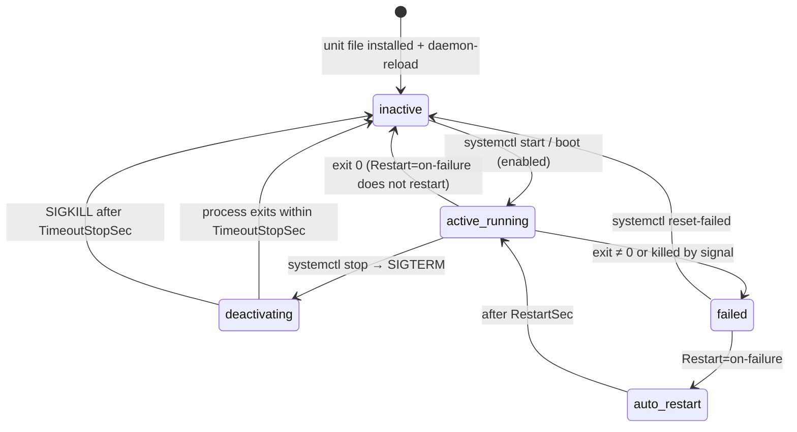

# FL.06 — Processes, signals and systemd services

<!-- glance:start -->
<!-- generated by tools/build.py from curriculum/syllabus.yaml — edit the syllabus, not this block -->

| | |
|---|---|
| **Track** | Optional foundation |
| **Difficulty** | Beginner |
| **Time** | 50 min |
| **Hardware** | none |
| **Software** | ubuntu |
| **Prerequisites** | [FL.03 The shell for Windows developers](FL.03-shell-basics.md) |
| **Skip if** | You write systemd units and read journalctl. |

<!-- glance:end -->

## What you will learn

- Inspect running processes (`ps`, `pgrep`, `top`, `/proc`) and find which one holds a device or eats the CPU.
- Explain SIGINT, SIGTERM and SIGKILL, read exit codes like 130, 143 and 137, and write a Python program that **stops the motors** when it's told to stop.
- Run jobs in the background and understand why closing an SSH session kills them.
- Turn a robot program into a **systemd service** that starts at boot, restarts after a crash and stops cleanly.
- Read service logs with `journalctl` (by unit, time, boot, follow mode) and override a unit with a drop-in instead of editing it.

## Why it matters

A robot must come alive when you flip the power switch, with nobody logged in. That's a systemd service. The final
robot's bringup ([20.03](../../20-final-robot/20.03-software-integration-bringup.md)) is a systemd unit that
launches ROS 2. Before that, the teleop and driver scripts from module 01
([01.15](../../01-first-robot/01.15-teleop-from-laptop.md)) need to shut down cleanly: a driver killed mid-command can
leave a motor spinning until the Pico's watchdog fires ([01.10](../../01-first-robot/01.10-pi-pico-protocol.md)).
Knowing which signal a process received, and what `status=9/KILL` in the journal means, is how you debug
"the robot stopped by itself at 3 am".

<!-- prereqs:start -->
## Prerequisites

You need these first:

- [FL.03 The shell for Windows developers](FL.03-shell-basics.md)

### Optional prerequisite links

None.

Check your readiness: `python course.py why FL.06`
<!-- prereqs:end -->

## Concept

### Processes are the unit of everything

Every running program is a **process** with a **PID**, a **parent** (PPID), a user, an environment, open files and
an exit code when it ends. PID 1 is the **init system**. On Ubuntu that's **systemd**, the ancestor of everything.
When you run `ros2 launch`, the launch process starts one child process per node. It's similar to a .NET host
spawning worker processes, except that on Linux the process tree is the main structure the whole system is built on.

### Signals are asynchronous messages from the OS

A **signal** interrupts a process to tell it something. The three you must know:

| Signal | Number | Who sends it | Can the program handle it? | Default | Shell exit code |
|---|---|---|---|---|---|
| `SIGINT` | 2 | Ctrl+C in the terminal | yes | terminate | 130 (= 128 + 2) |
| `SIGTERM` | 15 | `kill PID`, `systemctl stop`, shutdown, `docker stop` | yes | terminate | 143 (= 128 + 15) |
| `SIGKILL` | 9 | `kill -9`, systemd after a stop timeout, the out-of-memory killer | **no** | terminate immediately | 137 (= 128 + 9) |

The robotics consequence: **SIGTERM is your chance to stop the motors, SIGKILL is not.** A well-behaved driver handles
SIGINT and SIGTERM by sending a stop command and closing the serial port. Nothing can handle SIGKILL, which is why the
microcontroller has its own watchdog: if commands stop arriving, it stops the motors itself. That's defense in depth,
like a circuit breaker on top of graceful shutdown in a distributed system.

`SIGHUP` (1, "hang up") is sent when your terminal or SSH session closes. By default it kills the programs you started
from that session. [FL.13](FL.13-tmux-headless.md) shows how tmux avoids that.

### systemd: a supervisor for services

A **service unit** is a small INI-style file that tells systemd how to run, supervise and stop a program: which user,
which command, restart policy, and what it depends on. It fills the role of a Windows Service plus its recovery options,
or a Kubernetes pod with `restartPolicy`. All output goes to the **journal**, a structured, indexed log you query with
`journalctl`.

> [!TIP]
> **Ask your teacher:** "Compare a systemd service with a Windows Service and with a Kubernetes Deployment: start order, restart policy, logs, graceful shutdown."

## Technical explanation

### Level 1 — Looking at processes

```bash
ps -eo pid,ppid,user,stat,etime,cmd --forest | less   # full tree
pgrep -a python3             # PIDs + command lines matching "python3"
top                          # live CPU/memory (press 1 for per-core, q to quit); htop is friendlier
cat /proc/loadavg            # load: runnable processes averaged over 1/5/15 min
sudo fuser -v /dev/ttyACM0   # which process has the serial port open?
ls -l /proc/<PID>/fd         # all files a process has open
```

On a Raspberry Pi 5 (4 cores), a 1-minute load average of 4.0 means the CPUs are fully busy.
$\text{utilization} \approx \text{load} / \text{cores}$, so a load of 6.2 means $6.2 / 4 = 1.55$: about 55 % more work than
the CPUs can serve, and your 50 Hz control loop starts missing deadlines.

**Job control** in an interactive shell: `cmd &` runs in the background (`[1] 4242` = job 1, PID 4242). `jobs` lists
background jobs. **Ctrl+Z** pauses the foreground job, `bg` resumes it in the background, `fg` brings it back.
`kill %1` signals job 1.

### Level 2 — Signals in practice

```bash
kill 4242          # SIGTERM (polite)
kill -INT 4242     # same as Ctrl+C
kill -KILL 4242    # last resort; no cleanup possible
pkill -f heartbeat.py   # by command-line pattern
echo $?            # after `wait` or a foreground command: 128 + signal number if killed by a signal
```

In Python, register handlers that **request** a stop and let the main loop finish its cycle and clean up (see Code).
Don't do real work inside the handler. Set a flag, the way you'd cancel a `CancellationToken` and let the loop observe it.
Python retries `time.sleep()` after a handler runs (PEP 475), so the loop notices the flag within one sleep period.

ROS 2 note: `rclpy` installs its own SIGINT handling and shuts the context down on Ctrl+C. `ros2 launch` forwards
SIGINT to its nodes, escalates to SIGTERM, and finally SIGKILL for nodes that don't exit in time. Keep your node's
shutdown path short.

### Level 3 — A service unit for the robot

`/etc/systemd/system/karmel-bringup.service`:

```ini
[Unit]
Description=Karmel robot bringup
After=network-online.target
Wants=network-online.target

[Service]
Type=simple
User=robo
WorkingDirectory=/opt/karmel
Environment=PYTHONUNBUFFERED=1
ExecStart=/usr/bin/python3 /opt/karmel/heartbeat.py
Restart=on-failure
RestartSec=2
TimeoutStopSec=5

[Install]
WantedBy=multi-user.target
```

| Line | Meaning |
|---|---|
| `After=/Wants=network-online.target` | start after the network is up (the laptop connection, DDS) |
| `Type=simple` | the process started by `ExecStart` *is* the service (it doesn't fork into the background) |
| `User=robo` | run as a normal user, never root. That user needs `dialout`/`video` ([FL.05](FL.05-permissions-users-groups.md)) |
| `Environment=PYTHONUNBUFFERED=1` | without it, Python buffers stdout and logs show up in the journal late, in bursts |
| `ExecStart=` | **absolute paths**. No shell: no `~`, no `source`, no pipes, unless you run `bash -c '…'` explicitly |
| `Restart=on-failure` | restart on non-zero exit or death by signal, but not after a clean `systemctl stop` or exit 0 |
| `RestartSec=2` | wait 2 s before restarting (don't hammer a missing USB device) |
| `TimeoutStopSec=5` | on stop: SIGTERM, then SIGKILL after 5 s if still running |
| `WantedBy=multi-user.target` | `enable` hooks it into normal boot |

The lifecycle commands:

```bash
sudo systemctl daemon-reload                     # after creating/editing unit files
sudo systemctl enable --now karmel-bringup       # start at boot AND start now
systemctl status karmel-bringup                  # state, PID, memory, last 10 log lines
sudo systemctl restart karmel-bringup
sudo systemctl stop karmel-bringup
sudo systemctl disable karmel-bringup            # no autostart
systemctl cat karmel-bringup                     # the effective unit incl. drop-ins
systemctl show -p NRestarts --value karmel-bringup
systemctl --failed
```

**Starting ROS 2 from a unit.** `ExecStart` doesn't read `~/.bashrc`, so source explicitly and use `exec`, so the launch
process *replaces* bash and receives systemd's SIGTERM directly:

```ini
ExecStart=/bin/bash -c 'source /opt/ros/jazzy/setup.bash && source /home/robo/karmel_ws/install/setup.bash && exec ros2 launch karmel_bringup robot.launch.py'
Environment=ROS_DOMAIN_ID=7
```

**Overrides without editing the original:** `sudo systemctl edit karmel-bringup` opens an editor for
`/etc/systemd/system/karmel-bringup.service.d/override.conf`. Put only the changed keys there (e.g. `[Service]` +
`Environment=…`). `systemctl revert karmel-bringup` removes all drop-ins.

### Level 4 — The journal

```bash
journalctl -u karmel-bringup            # all logs of this unit
journalctl -u karmel-bringup -f         # follow (like tail -f)
journalctl -u karmel-bringup -n 50 --no-pager
journalctl -u karmel-bringup -b         # since this boot;  -b -1 = previous boot (needs persistent journal)
journalctl -u karmel-bringup --since "10 min ago"
journalctl -u karmel-bringup -o cat     # message text only
journalctl -p err -b                    # all error-priority messages this boot
sudo journalctl --disk-usage
```

Two details that trip people up, both verified on Ubuntu 24.04 (systemd 255):

- **stdout and stderr both land at priority `info`** by default. `journalctl -u karmel-bringup -p err` printed
  `-- No entries --` even though the program wrote `simulated crash!` to stderr. The *systemd* lines (`Failed with result …`)
  are what you filter for, or use `grep`.
- systemd prints exit codes with a symbolic name: `status=3/NOTIMPLEMENTED` just means exit code 3. The name comes from an old
  LSB convention and has nothing to do with your program.

On Ubuntu the journal is persistent (kept across reboots) once `/var/log/journal` exists, which is the default on
Ubuntu 24.04 installs. Check with `ls /var/log/journal`. That lets you use `journalctl -b -1` to see why the robot stopped
before the last reboot.

## Diagram



## Code

A stand-in for the robot bringup that behaves like a real driver: it prints a heartbeat, treats SIGINT and SIGTERM as
"stop the motors and exit 0", and can simulate a crash (exit code 3) through an environment variable. Used in every exercise.

`/opt/karmel/heartbeat.py`:

```python
#!/usr/bin/env python3
"""Stand-in for the robot bringup: prints a heartbeat, stops cleanly on SIGTERM/SIGINT."""
from __future__ import annotations

import os
import signal
import sys
import time
from types import FrameType


class Bringup:
    def __init__(self) -> None:
        self.running = True

    def request_stop(self, signum: int, _frame: FrameType | None) -> None:
        print(f"{signal.Signals(signum).name} received: stopping motors", flush=True)
        self.running = False

    def run(self) -> int:
        signal.signal(signal.SIGTERM, self.request_stop)
        signal.signal(signal.SIGINT, self.request_stop)
        crash_after = int(os.environ.get("KARMEL_CRASH_AFTER", "0"))
        print(f"bringup started, pid={os.getpid()}", flush=True)
        n = 0
        while self.running:
            n += 1
            print(f"heartbeat {n}", flush=True)
            if crash_after and n >= crash_after:
                print("simulated crash!", file=sys.stderr, flush=True)
                return 3
            time.sleep(1.0)
        print("motors stopped, bye", flush=True)
        return 0


if __name__ == "__main__":
    sys.exit(Bringup().run())
```

In a real driver, `request_stop` stays the same, and the cleanup after the loop sends `S <seq>` (stop) to the Pico
([01.10 protocol](../../01-first-robot/01.10-pi-pico-protocol.md)) and closes the serial port.

Install it (needs systemd as PID 1: native Ubuntu, the Pi, or WSL with systemd, [FL.02](FL.02-installing-ubuntu.md)):

```bash
sudo mkdir -p /opt/karmel
sudo cp heartbeat.py /opt/karmel/ && sudo chmod 755 /opt/karmel/heartbeat.py
sed "s/^User=.*/User=$USER/" karmel-bringup.service | sudo tee /etc/systemd/system/karmel-bringup.service > /dev/null
sudo chmod 644 /etc/systemd/system/karmel-bringup.service
systemd-analyze verify /etc/systemd/system/karmel-bringup.service && echo "unit OK"
```

## Exercise

### Exercise FL.06-E1 — Predict the exit codes `[predict]`

Hardware: none. Write down each `exit=` value, then run (any bash, including `docker run --rm -it ubuntu:24.04 bash`):

```bash
sleep 100 & P=$!; kill $P;       wait $P; echo "exit=$?"
sleep 100 & P=$!; kill -INT $P;  wait $P; echo "exit=$?"
sleep 100 & P=$!; kill -KILL $P; wait $P; echo "exit=$?"
python3 -c 'import sys; sys.exit(3)'; echo "exit=$?"
```

### Exercise FL.06-E2 — Graceful vs brutal stop `[coding]`

Hardware: none. Terminal 1: `python3 heartbeat.py`. Terminal 2: `pgrep -a heartbeat`.

1. Press Ctrl+C in terminal 1, then run `echo "exit=$?"`.
2. Start it again. From terminal 2: `kill <PID>`.
3. Start it again. From terminal 2: `kill -9 <PID>`, then run `echo "exit=$?"` in terminal 1.

Which run printed `motors stopped, bye`? What would a real robot do in run 3?

### Exercise FL.06-E3 — Autostart the robot `[coding]`

Hardware: none (WSL with systemd, native Ubuntu), optionally `robot-base` (the Pi, so you can reboot it and watch it start).

1. Install the unit as in the Code section, then `sudo systemctl enable --now karmel-bringup`.
2. Wait 4 s, then run `systemctl status karmel-bringup --no-pager`.
3. `sudo kill -TERM $(systemctl show -p MainPID --value karmel-bringup)`, wait 3 s, `journalctl -u karmel-bringup -n 8 --no-pager`.
4. Start it again, `sudo kill -KILL` its main PID, wait 4 s, `journalctl -u karmel-bringup -n 7 --no-pager`.
5. On the Pi: `sudo reboot`, reconnect, `systemctl is-active karmel-bringup`.

### Exercise FL.06-E4 — Crash loop, diagnosed from the journal `[debugging]`

Hardware: none.

1. `sudo systemctl edit karmel-bringup` and add
   ```ini
   [Service]
   Environment=KARMEL_CRASH_AFTER=2
   ```
2. `sudo systemctl restart karmel-bringup`, wait ~9 s, then `journalctl -u karmel-bringup -n 12 --no-pager -o cat` and
   `systemctl show -p NRestarts --value karmel-bringup`.
3. Try to find the crash with `journalctl -u karmel-bringup -p err`. What do you get, and why?
4. Clean up: `sudo systemctl revert karmel-bringup && sudo systemctl restart karmel-bringup`.

## Expected result

**FL.06-E1:** `exit=143`, `exit=130`, `exit=137`, `exit=3`. In an interactive shell the `KILL` line also prints
`Killed` (or `[1]+  Killed  sleep 100`).

**FL.06-E2:** (1) and (2) print `SIGINT received: stopping motors` (after `^C`) or `SIGTERM received: stopping motors`,
then `motors stopped, bye`, and exit code 0. The program handled the signal and chose to exit successfully. (3) no stop
message at all: the shell prints `Killed` and `exit=137`. On the robot the last motor command would stay active until the
Pico's watchdog (300 ms by default in the course protocol) stops the wheels.

**FL.06-E3:** Step 2 (IDs, times and memory differ):

```text
● karmel-bringup.service - Karmel robot bringup
     Loaded: loaded (/etc/systemd/system/karmel-bringup.service; enabled; preset: enabled)
     Active: active (running) since Wed 2026-09-16 20:14:51 UTC; 3s ago
   Main PID: 148 (python3)
      Tasks: 1 (limit: 18523)
     Memory: 3.8M (peak: 4.0M)
        CPU: 15ms
     CGroup: /system.slice/karmel-bringup.service
             └─148 /usr/bin/python3 /opt/karmel/heartbeat.py

Sep 16 20:14:51 host systemd[1]: Started karmel-bringup.service - Karmel robot bringup.
Sep 16 20:14:51 host python3[148]: bringup started, pid=148
Sep 16 20:14:51 host python3[148]: heartbeat 1
```

Step 3 ends with `python3[148]: SIGTERM received: stopping motors`, `motors stopped, bye`, and
`systemd[1]: karmel-bringup.service: Deactivated successfully.` There is **no restart**, because exit 0 isn't a failure.
Step 4:

```text
systemd[1]: karmel-bringup.service: Main process exited, code=killed, status=9/KILL
systemd[1]: karmel-bringup.service: Failed with result 'signal'.
systemd[1]: karmel-bringup.service: Scheduled restart job, restart counter is at 1.
systemd[1]: Started karmel-bringup.service - Karmel robot bringup.
python3[174]: bringup started, pid=174
```

After a reboot, `systemctl is-active` prints `active` without anyone logging in.

**FL.06-E4:** The journal shows the cycle repeating every ~4 s (2 heartbeats + 2 s `RestartSec`):

```text
heartbeat 2
simulated crash!
karmel-bringup.service: Main process exited, code=exited, status=3/NOTIMPLEMENTED
karmel-bringup.service: Failed with result 'exit-code'.
karmel-bringup.service: Scheduled restart job, restart counter is at 2.
Started karmel-bringup.service - Karmel robot bringup.
bringup started, pid=252
```

`NRestarts` is 2 or more, depending on how long you waited. `journalctl -p err` prints `-- No entries --`: stderr is logged at
priority *info* by default, so filter on systemd's `Failed with result` lines or `grep -i crash` instead. After `revert`,
`systemctl cat karmel-bringup` no longer shows the `override.conf` section.

## Troubleshooting

### Symptom: the service won't start (`status=203/EXEC` or `217/USER`)

1. `systemctl status <unit>` and `journalctl -u <unit> -n 30`: read the **first** error, not the last.
2. `203/EXEC`: `ExecStart` path wrong, not absolute, not executable, or a script with CRLF line endings ([FL.03](FL.03-shell-basics.md)).
3. `217/USER`: the `User=` doesn't exist.
4. `200/CHDIR`: `WorkingDirectory` doesn't exist or isn't accessible to that user.
5. Works in your terminal but not as a service: the service has **no** `~/.bashrc`, a minimal `PATH`, no ROS sourcing, a different
   user and groups. Add the environment explicitly (Level 3). Test the exact command with
   `sudo -u robo env -i /bin/bash -c '<ExecStart command>'`.
6. Edited the unit but nothing changed: `sudo systemctl daemon-reload`.

### Symptom: the service restarts in a loop, then stops with "start request repeated too quickly"

systemd's start-rate limit (by default 5 starts within 10 s) has tripped. Find the crash cause in the journal first, since restarting
is not a fix. Then `sudo systemctl reset-failed <unit>`. Raise `RestartSec` for devices that appear late (USB after boot), or add a
udev-based dependency later.

### Symptom: `systemctl stop` takes exactly N seconds and the log says `State 'stop-sigterm' timed out. Killing.`

The program ignores SIGTERM, or it's hidden behind a `bash -c` without `exec` (bash gets the signal, the child doesn't). Add signal
handling or `exec`, and keep `TimeoutStopSec` short so a hung driver gets killed quickly.

### Symptom: `System has not been booted with systemd as init system (PID 1). Can't operate.`

You're in Docker or in WSL without systemd. In WSL enable it in `/etc/wsl.conf` ([FL.02](FL.02-installing-ubuntu.md)). In Docker, run the
program directly as the container's main process instead ([FL.12](FL.12-docker-for-robotics.md)).

### Symptom: `Configuration file … is marked executable. Please remove executable permission bits.`

Harmless warning: `sudo chmod 644 /etc/systemd/system/<unit>.service`.

## Common mistakes

- **Running the robot service as root.** Use a normal user with the right groups.
- **Relative paths, `~` or `source` directly in `ExecStart`.** Unit files aren't shell scripts.
- **Forgetting `daemon-reload`** after editing a unit.
- **`bash -c '… ros2 launch …'` without `exec`**: stop signals don't reach the launch process cleanly.
- **Editing units under `/usr/lib/systemd/system`** (package-owned). Use `systemctl edit` drop-ins or `/etc/systemd/system`.
- **Missing `PYTHONUNBUFFERED=1`** (or `flush=True`): logs arrive late, which makes crashes look like hangs.
- **Treating `kill -9` as the normal way to stop things**: no cleanup, stale lock files, motors left running.
- **`Restart=always` for a program that exits intentionally**: it will restart even after a clean shutdown request from inside.

## Knowledge check

1. Which signal does `systemctl stop` send first, and what happens if the process doesn't exit?
   <details><summary>Answer</summary>

   SIGTERM. If the process is still running after `TimeoutStopSec` (default 90 s, 5 s in our unit), systemd sends SIGKILL.
   </details>

2. A driver's exit code is 137. What happened? And 130?
   <details><summary>Answer</summary>

   137 = 128 + 9: killed by SIGKILL (manual `kill -9`, stop timeout, or the out-of-memory killer). 130 = 128 + 2: interrupted by SIGINT (Ctrl+C) without handling it.
   </details>

3. Why can't software alone guarantee the motors stop when the Pi-side driver dies, and what does the course do about it?
   <details><summary>Answer</summary>

   SIGKILL, a kernel panic or a power loss on the Pi can't be handled, so no cleanup code runs. The Pico runs a watchdog:
   if no valid motor command arrives within `watchdog_ms` (300 ms by default), it stops the motors itself.
   </details>

4. Your unit has `ExecStart=ros2 launch karmel_bringup robot.launch.py` and fails with `203/EXEC`. Give two reasons.
   <details><summary>Answer</summary>

   `ExecStart` needs an absolute path (`ros2` isn't found without the ROS environment), and nothing sourced
   `/opt/ros/jazzy/setup.bash`. Use `/bin/bash -c 'source … && exec ros2 launch …'`.
   </details>

5. You added `Restart=on-failure`. The program catches SIGTERM from `kill` and exits 0. Does systemd restart it? What if it's killed with `kill -9`?
   <details><summary>Answer</summary>

   Exit 0 → no restart (a clean exit isn't a failure). SIGKILL → yes: death by signal counts as failure, and the journal shows
   `status=9/KILL`, `Failed with result 'signal'`, `Scheduled restart job`.
   </details>

6. How do you see the logs of the robot service from **before** the last reboot, only lines since 08:00?
   <details><summary>Answer</summary>

   `journalctl -u karmel-bringup -b -1 --since 08:00` (requires the persistent journal in `/var/log/journal`).
   </details>

7. On a 4-core Pi the 1-minute load average is 7.0. Estimate the overload and name one likely effect on a 50 Hz control loop.
   <details><summary>Answer</summary>

   $7.0 / 4 = 1.75$, so about 75 % more runnable work than cores. The loop's 20 ms period will jitter and miss deadlines,
   so control becomes jerky or the watchdog trips. Find the CPU hog with `top`.
   </details>

## Practical challenge

Build a **user-level** autostart for a real robot script that survives a crash but not an intentional stop:

- Use your teleop or drive script from module 01 (or `heartbeat.py` extended to open `/dev/karmel_pico` and send `S` on exit).
- Run it as a normal user with the needed groups, `Restart=on-failure`, `RestartSec=2`, `TimeoutStopSec=3`.
- Make it wait for the Pico: add `ExecStartPre=/bin/sh -c 'until [ -e /dev/karmel_pico ]; do sleep 0.5; done'` with a
  `TimeoutStartSec=30`, so boot doesn't fail when USB enumerates late.
- Provide `install.sh` and `uninstall.sh` that are idempotent.

Acceptance criteria: (1) power-cycle → the service is `active` within 60 s without login. (2) `kill -9` → restarted
within 3 s (journal proves it). (3) `systemctl stop` → the log shows your stop message, the Pico receives `S`, and the exit
takes under 3 s. (4) Unplugging the Pico produces a clear error in the journal, and replugging recovers it without touching the Pi.

> [!CAUTION]
> **Safety:** For criteria 2–4 with a real motor driver, put the robot on a stand with the wheels in the air, and keep the
> battery switch within reach. A restarted driver may resume the last command.

## You can skip this if…

You write systemd units and read `journalctl` routinely, and you answer knowledge-check questions 1, 4 and 5 correctly without looking. Then:
`python course.py skip FL.06 --reason "I write systemd units"`.

## Go deeper

- https://man7.org/linux/man-pages/man5/systemd.service.5.html — `systemd.service` reference: `Type=`, `Restart=`, `ExecStart` rules.
- https://man7.org/linux/man-pages/man1/journalctl.1.html — every `journalctl` filter and output format.
- https://man7.org/linux/man-pages/man7/signal.7.html — the signal overview: numbers, default actions, what can be caught.
- https://ubuntu.com/server/docs — Ubuntu Server docs, including service management on a headless machine.
- https://missing.csail.mit.edu/ — Missing Semester, "Command-line environment" (job control, signals).
- https://peps.python.org/pep-0475/ — why `time.sleep()` resumes after a signal handler runs.

## Progress checkpoint

- [ ] I can find processes, their parents and the files (devices) they hold.
- [ ] I can explain SIGINT/SIGTERM/SIGKILL, read exit codes 130/143/137, and write a graceful-stop handler.
- [ ] I can write, install, enable and override a systemd service for a robot program.
- [ ] I can diagnose a failing or crash-looping service from `systemctl status` and `journalctl`.

`python course.py complete FL.06` (exercises done) · `python course.py master FL.06` (challenge done) ·
`python course.py struggle FL.06 "what was hard"`.

Next: [FL.07 — Package management: apt, keys and repositories](FL.07-package-management.md).
