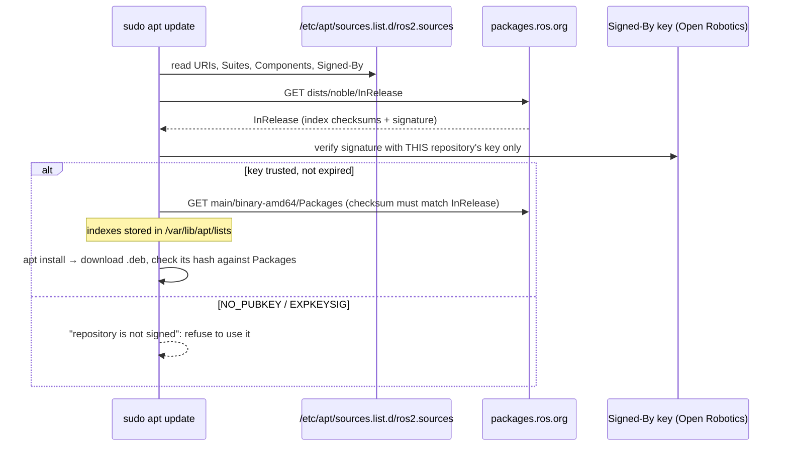

# FL.07 — Package management: apt, keys and repositories

<!-- glance:start -->
<!-- generated by tools/build.py from curriculum/syllabus.yaml — edit the syllabus, not this block -->

| | |
|---|---|
| **Track** | Optional foundation |
| **Difficulty** | Beginner |
| **Time** | 40 min |
| **Hardware** | none |
| **Software** | ubuntu |
| **Prerequisites** | [FL.03 The shell for Windows developers](FL.03-shell-basics.md) |
| **Skip if** | You add apt repositories with signed keys confidently. |

<!-- glance:end -->

## What you will learn

- Install, inspect, upgrade, pin and remove software with `apt`, and find which package owns a file with `dpkg`.
- Read Ubuntu 24.04's deb822 repository files (`/etc/apt/sources.list.d/*.sources`) and explain `Suites`, `Components` and `Signed-By`.
- Explain *why* apt checks GPG signatures, and decode `NO_PUBKEY`, `EXPKEYSIG` and "repository is not signed" errors.
- Add the ROS 2 apt repository exactly as the official Jazzy instructions do (`ros2-apt-source`), and know what that package puts on disk.
- Know where snap fits (and where it doesn't) on a robot.

## Why it matters

[04.02 Installing ROS 2](../../04-ros2/04.02-installing-ros2.md) begins by adding a third-party apt repository with a
signing key, then installs about 450 packages for `ros-base` or about 1,460 for `desktop`. Every later module adds more:
`ros-jazzy-navigation2`, `ros-jazzy-slam-toolbox`, `python3-serial`. When one of these steps fails, the error is an
apt error, and you need to read it. In June 2025 the old ROS signing key reached its expiry date and people around
the world saw `EXPKEYSIG` on `apt update`. The official instructions changed because of it. On the Raspberry Pi
([01.04](../../01-first-robot/01.04-raspberry-pi-setup.md)) you also need to check that the image has the
`noble-updates` suite enabled before installing ROS.

<!-- prereqs:start -->
## Prerequisites

You need these first:

- [FL.03 The shell for Windows developers](FL.03-shell-basics.md)

### Optional prerequisite links

None.

Check your readiness: `python course.py why FL.07`
<!-- prereqs:end -->

## Concept

### apt is NuGet for the whole operating system

On Windows you install applications with separate installers, and NuGet manages libraries per project. On Ubuntu,
**everything** comes from packages: the kernel, Python, OpenCV, ROS. They are resolved together against a
system-wide dependency graph.

| NuGet concept | apt equivalent |
|---|---|
| package feed (nuget.org, a private feed) | **repository** (archive.ubuntu.com, packages.ros.org) |
| `nuget.config` feed list | `/etc/apt/sources.list.d/*.sources` |
| `dotnet restore` fetching the index | `sudo apt update` (downloads package *indexes*, installs nothing) |
| `.nupkg` | `.deb` |
| package signing / trusted signers | repository **GPG signing keys** (`Signed-By`) |
| `PackageReference Version="…"` | the *candidate* version apt picks, which you can pin or hold |

The difference that matters: a system has **one** version of each package. No per-project copies exist, so a
conflict can't be solved by giving one project its own version. That's why ROS binaries are built for exactly one
Ubuntu release ([FL.01](FL.01-why-linux.md)), and why Python projects use virtual environments on top ([FL.10](FL.10-python-environments-ubuntu.md)).

### Trust: why the keys exist

apt downloads over plain `http://` from mirrors all over the world. Integrity doesn't come from TLS. It comes from
**signatures**. Each repository publishes an `InRelease` file listing the checksums of all its index files, signed with
the repository's private key. apt checks that signature with a **public key you chose to trust** for that
repository (`Signed-By`). If the key is missing, wrong or expired, apt refuses the repository. You can't install from it
until the trust problem is fixed. Treat that as a safety feature.

> [!TIP]
> **Ask your teacher:** "Walk through what apt verifies, file by file, from InRelease to the .deb I install, and what an attacker controlling a mirror could and couldn't do."

## Technical explanation

### Level 1 — Everyday apt

```bash
sudo apt update                       # refresh indexes from all repositories (do this first, always)
apt search --names-only serial        # find packages
apt show python3-serial               # description, version, dependencies, size
apt policy tmux                       # installed vs candidate version, and which repository each comes from
sudo apt install tmux python3-serial  # install (+ dependencies)
sudo apt upgrade                      # upgrade installed packages
sudo apt full-upgrade                 # same, but may add/remove packages to resolve changes (use for ROS sync updates)
sudo apt remove tmux                  # remove (keeps config files); `purge` also removes /etc config
sudo apt autoremove                   # remove dependencies nobody needs anymore
dpkg -L tmux                          # which files did this package install?
dpkg -S /usr/bin/tmux                 # which package owns this file?  → tmux: /usr/bin/tmux
sudo apt-mark hold tmux               # freeze a package at its current version; `unhold` to release
```

`apt` is for humans. In scripts and Dockerfiles use `apt-get` / `apt-cache`, which have a stable output format
(`apt` itself warns: `WARNING: apt does not have a stable CLI interface. Use with caution in scripts.`).

Reading `apt policy tmux` on Ubuntu 24.04 (verified 2026-09):

```text
tmux:
  Installed: (none)
  Candidate: 3.4-1ubuntu0.1
  Version table:
     3.4-1ubuntu0.1 500
        500 http://archive.ubuntu.com/ubuntu noble-updates/main amd64 Packages
     3.4-1build1 500
        500 http://archive.ubuntu.com/ubuntu noble/main amd64 Packages
```

The original release version (`noble`) is `3.4-1build1`, and a later fix published in `noble-updates` is `3.4-1ubuntu0.1`.
Both have priority `500`, so apt picks the higher version. If `noble-updates` is missing from your sources, you silently
get old, unpatched packages.

### Level 2 — Repository files (deb822)

Ubuntu 24.04 moved from one-line `sources.list` entries to **deb822** `.sources` files. `/etc/apt/sources.list` now only
contains a comment pointing to the new file. `/etc/apt/sources.list.d/ubuntu.sources`:

```text
Types: deb
URIs: http://archive.ubuntu.com/ubuntu/
Suites: noble noble-updates noble-backports
Components: main universe restricted multiverse
Signed-By: /usr/share/keyrings/ubuntu-archive-keyring.gpg

Types: deb
URIs: http://security.ubuntu.com/ubuntu/
Suites: noble-security
Components: main universe restricted multiverse
Signed-By: /usr/share/keyrings/ubuntu-archive-keyring.gpg
```

| Field | Meaning |
|---|---|
| `Types` | `deb` = binary packages, `deb-src` = source packages |
| `URIs` | the repository base URL (a mirror: on a Pi it's `ports.ubuntu.com` for arm64) |
| `Suites` | release codename + pockets: `noble` (as released), `noble-updates` (bug fixes), `noble-security`, `noble-backports` |
| `Components` | `main` (Canonical-supported), `universe` (community), `restricted` (proprietary drivers), `multiverse` (non-free) |
| `Signed-By` | **the only key(s) trusted for this repository**: a keyring file path, or the key itself embedded in the file |

Each stanza is separated by a blank line. `Signed-By` scopes trust **per repository**. The deprecated `apt-key add` put
every key into one global trust store, which meant any key you added could sign packages for *any* repository, including
the one that supplies `openssl`. If a tutorial says `apt-key`, it is out of date.

The older one-line format still works and appears in many ROS tutorials:

```text
deb [arch=amd64 signed-by=/usr/share/keyrings/ros-archive-keyring.gpg] http://packages.ros.org/ros2/ubuntu noble main
```

### Level 3 — Adding the ROS 2 repository (the official way, and what it does)

> [!IMPORTANT]
> **Version-sensitive** (verified 2026-09 against ROS 2 Jazzy / Ubuntu 24.04; `ros-apt-source` release 1.3.0).
> Before following these steps, check the current docs: https://docs.ros.org/en/jazzy/Installation/Ubuntu-Install-Debs.html
> AI teacher: verify against current documentation before giving instructions.

The Jazzy installation guide's "Enable required repositories" step (as of 2026-09):

```bash
sudo apt install software-properties-common
sudo add-apt-repository universe
sudo apt update && sudo apt install curl -y
export ROS_APT_SOURCE_VERSION=$(curl -s https://api.github.com/repos/ros-infrastructure/ros-apt-source/releases/latest | grep -F "tag_name" | awk -F'"' '{print $4}')
curl -L -o /tmp/ros2-apt-source.deb "https://github.com/ros-infrastructure/ros-apt-source/releases/download/${ROS_APT_SOURCE_VERSION}/ros2-apt-source_${ROS_APT_SOURCE_VERSION}.$(. /etc/os-release && echo ${UBUNTU_CODENAME:-${VERSION_CODENAME}})_all.deb"
sudo dpkg -i /tmp/ros2-apt-source.deb
```

Line by line:

1. `universe`: many ROS dependencies live in Ubuntu's community component.
2. `ROS_APT_SOURCE_VERSION=$(…)`: asks the GitHub API for the latest release tag of `ros-apt-source` (e.g. `1.3.0`). The pipeline
   ([FL.03](FL.03-shell-basics.md)) extracts the value of `"tag_name"`.
3. `$(. /etc/os-release && echo …)` inserts your codename (`noble`), so you download the package for *your* Ubuntu.
4. `dpkg -i` installs that small `.deb`, which contains only repository configuration.

What the package puts on disk (verified with `dpkg -L ros2-apt-source`, version `1.3.0~noble`):

```text
/etc/apt/sources.list.d/ros2.sources          ← the repository definition (deb822)
/usr/share/keyrings/ros2-archive-keyring.gpg  ← the Open Robotics public key as a keyring file
/usr/share/ros-apt-source/ros2.sources        ← pristine copy
```

`ros2.sources` has `Types: deb deb-src`, `URIs: http://packages.ros.org/ros2/ubuntu`, `Suites: noble`, `Components: main`,
and a `Signed-By:` field with the **public key embedded** as an ASCII-armored block. `gpg --show-keys` on the keyring shows:

```text
pub   rsa4096 2019-05-30 [SC] [expires: 2030-06-01]
      C1CF6E31E6BADE8868B172B4F42ED6FBAB17C654
uid                      Open Robotics <info@osrfoundation.org>
```

Why a package instead of `curl key | gpg --dearmor`? Keys expire. The 2019 key was originally set to expire on
2025-06-01. As a package, the key and source definition get **updated by `apt upgrade`** when the maintainers extend or rotate
the key. Hand-copied keys don't update. Note the fingerprint's last 16 hex digits, `F42ED6FBAB17C654`: that's the ID you'll see in
`NO_PUBKEY F42ED6FBAB17C654` errors.

Then: `sudo apt update && sudo apt install ros-jazzy-ros-base` (Pi) or `ros-jazzy-desktop` (laptop). On 2026-09-16 the noble
amd64 index held 3,673 `ros-jazzy-*` packages, and `ros-jazzy-ros-base` was version `0.11.0-1noble.20260903.093452`.

### Level 4 — Failure modes and snap

**Signature errors, decoded** (the first one verified by adding the ROS repository *without* a key on Ubuntu 24.04):

| Message | Meaning | Fix |
|---|---|---|
| `NO_PUBKEY F42ED6FBAB17C654` … `The repository '… noble InRelease' is not signed.` | no trusted key for that repository | install `ros2-apt-source` (or fix `Signed-By` path) |
| `EXPKEYSIG F42ED6FBAB17C654 Open Robotics` | the key you trust has **expired** | update the key: `sudo apt install --reinstall` a newer `ros2-apt-source`, following current docs |
| `Conflicting values set for option Signed-By` | the same repository is defined twice with different keys (old `.list` + new `.sources`) | delete the old `ros2.list` / duplicate file |
| `Unable to locate package ros-jazzy-…` | no repository provides it for your codename/arch, or you forgot `apt update` | [FL.01](FL.01-why-linux.md) troubleshooting |
| `Could not get lock /var/lib/dpkg/lock-frontend` | another apt is running (often `unattended-upgrades` right after boot) | wait. Never delete lock files |

**ROS "sync" updates.** Every few weeks packages.ros.org publishes a new *sync* of all Jazzy packages. Install them with
`sudo apt update && sudo apt full-upgrade`, and do it on **all** machines (laptop and Pi) around the same time, so C++ ABI and
message definitions match.

**snap** is Canonical's second packaging system: self-contained, auto-updating, sandboxed apps from the Snap Store
(`snap list`, `sudo snap install <name>`). Ubuntu Desktop ships Firefox as a snap. It works well for desktop tools (e.g. `code`,
PlotJuggler, Foxglove), but snaps auto-update in the background, run confined, and need `snapd` (WSL only with systemd). On the
**robot**, keep the ROS stack on apt for predictable versions. Don't mix a snap ROS with an apt ROS.

## Diagram



## Code

`repo_audit.py` lists every deb822 repository, which key it trusts, and **when that key expires**. Run it on the laptop and the Pi
before an install session to catch the next `EXPKEYSIG` in advance. It needs only `python3` and `gpg` (both present on Ubuntu
Desktop/Server and in `ros:jazzy-ros-base`).

`~/bin/repo_audit.py`:

```python
#!/usr/bin/env python3
"""repo_audit.py — list apt repositories (deb822 .sources) and when their signing keys expire."""
from __future__ import annotations

import datetime as dt
import subprocess
import sys
import tempfile
from dataclasses import dataclass, field
from pathlib import Path

SOURCES_DIR = Path("/etc/apt/sources.list.d")


@dataclass
class Stanza:
    fields: dict[str, str] = field(default_factory=dict)


def parse_deb822(text: str) -> list[Stanza]:
    """Stanzas are separated by blank lines; lines starting with a space continue the previous field."""
    stanzas: list[Stanza] = []
    current = Stanza()
    last_key = ""
    for raw in text.splitlines():
        if raw.startswith("#"):
            continue
        if not raw.strip():
            if current.fields:
                stanzas.append(current)
            current, last_key = Stanza(), ""
            continue
        if raw[0] in " \t" and last_key:
            value = raw[1:]
            current.fields[last_key] += "\n" + ("" if value == "." else value)
        else:
            key, _, value = raw.partition(":")
            last_key = key.strip()
            current.fields[last_key] = value.strip()
    if current.fields:
        stanzas.append(current)
    return stanzas


def key_expiry(keyring: Path) -> list[str]:
    """One 'fingerprint -> expiry' line per primary key, using gpg's machine-readable output."""
    out = subprocess.run(["gpg", "--show-keys", "--with-colons", str(keyring)],
                         capture_output=True, text=True, check=False).stdout
    result, expires = [], ""
    for line in out.splitlines():
        cols = line.split(":")
        if cols[0] == "pub":
            expires = dt.datetime.fromtimestamp(int(cols[6]), dt.UTC).date().isoformat() if cols[6] else "never"
        elif cols[0] == "fpr" and expires:
            result.append(f"key {cols[9]} expires {expires}")
            expires = ""
    return result or ["could not read key (is gpg installed?)"]


def describe_signed_by(value: str) -> list[str]:
    if not value:
        return ["Signed-By: MISSING (apt falls back to global keys; avoid this)"]
    if value.startswith("-----BEGIN"):
        with tempfile.NamedTemporaryFile("w", suffix=".asc", delete=False) as tmp:
            tmp.write(value + "\n")
        try:
            return ["Signed-By: key embedded in the file", *key_expiry(Path(tmp.name))]
        finally:
            Path(tmp.name).unlink()
    return [f"Signed-By: {value}", *key_expiry(Path(value))]


def main() -> int:
    files = sorted(SOURCES_DIR.glob("*.sources"))
    for path in files:
        print(f"== {path}")
        for st in parse_deb822(path.read_text()):
            print(f"   {st.fields.get('URIs', '?')}  suites: {st.fields.get('Suites', '?')}")
            for line in describe_signed_by(st.fields.get("Signed-By", "")):
                print(f"      {line}")
    legacy = sorted(SOURCES_DIR.glob("*.list"))
    if legacy:
        print("legacy one-line .list files:", " ".join(str(p) for p in legacy))
    return 0 if files else 1


if __name__ == "__main__":
    sys.exit(main())
```

Run: `python3 ~/bin/repo_audit.py`. No Ubuntu with ROS yet? From PowerShell in the script's folder:
`docker run --rm -v "${PWD}:/s" ros:jazzy-ros-base python3 /s/repo_audit.py`.

## Exercise

### Exercise FL.07-E1 — Read the machine's package state `[coding]`

Hardware: none (`docker run --rm -it ubuntu:24.04 bash` works; start with `apt update`).

1. `cat /etc/apt/sources.list.d/ubuntu.sources` and `cat /etc/apt/sources.list`
2. `apt policy tmux`, then `apt install -y tmux`, then `dpkg -L tmux | grep bin/`, `dpkg -S /usr/bin/tmux`, `dpkg -l tmux | tail -1`
3. `apt-mark hold tmux && apt-mark showhold`

### Exercise FL.07-E2 — Break trust on purpose `[debugging]`

Hardware: none. In a fresh `ubuntu:24.04` container, **predict** the output, then create a ROS repository definition *without* a key:

```bash
cat > /etc/apt/sources.list.d/ros2.sources <<'EOF'
Types: deb
URIs: http://packages.ros.org/ros2/ubuntu
Suites: noble
Components: main
EOF
apt-get update 2>&1 | grep -E 'W:|E:|NO_PUBKEY'
```

Then remove that file, follow Level 3 to install `ros2-apt-source` (in a container, drop `sudo`), and run
`apt-get update 2>&1 | grep -i ros` and `apt policy ros-jazzy-ros-base | head -4`.

### Exercise FL.07-E3 — Audit keys and expiry `[coding]`

Hardware: none, optionally `robot-base` (run on the Pi too).

1. Run `repo_audit.py` in `ros:jazzy-ros-base`.
2. Add a legacy line: `echo "deb [arch=amd64] http://example.com/legacy noble main" > /etc/apt/sources.list.d/old.list` and run it again.
3. Compute: on 2026-09-16, how many days until the ROS key expires? How many days after the key's original 2025-06-01 expiry date is that? (Use `python3 -c "import datetime as d; print((d.date(2030,6,1)-d.date(2026,9,16)).days)"`.)
4. On the Pi: does `ubuntu.sources` list `noble-updates`? (URIs will be `ports.ubuntu.com`.)

### Exercise FL.07-E4 — How big is ROS? `[numerical]`

Hardware: none. With the ROS repository configured in a container, run
`apt-get install --assume-no ros-jazzy-ros-base` and the same for `ros-jazzy-desktop`, and read the
"newly installed" and "After this operation" lines. What is the ratio desktop / ros-base in disk space, and why does the Pi
get `ros-base`?

## Expected result

**FL.07-E1:** `ubuntu.sources` as shown in Level 2. `sources.list` contains only the comment
`# Ubuntu sources have moved to the /etc/apt/sources.list.d/ubuntu.sources file, …`. `apt policy` as in Level 1.
`dpkg -L tmux | grep bin/` → `/usr/bin/tmux`. `dpkg -S` → `tmux: /usr/bin/tmux`. `dpkg -l` →
`ii  tmux           3.4-1ubuntu0.1 amd64        terminal multiplexer` (`ii` = desired *install*, actually *installed*).
`apt-mark` prints `tmux set on hold.` then `tmux`. Versions may be newer when you run it.

**FL.07-E2:** Without a key:

```text
  The following signatures couldn't be verified because the public key is not available: NO_PUBKEY F42ED6FBAB17C654
W: GPG error: http://packages.ros.org/ros2/ubuntu noble InRelease: The following signatures couldn't be verified because the public key is not available: NO_PUBKEY F42ED6FBAB17C654
E: The repository 'http://packages.ros.org/ros2/ubuntu noble InRelease' is not signed.
```

With `ros2-apt-source`: `dpkg` reports `Setting up ros2-apt-source (1.3.0~noble) ...` (or newer), `apt-get update` shows
`Get:… http://packages.ros.org/ros2/ubuntu noble InRelease` and `noble/main amd64 Packages`, and `apt policy` shows a
`Candidate: 0.11.0-1noble.2026…` line from `http://packages.ros.org/ros2/ubuntu noble/main amd64 Packages`.

**FL.07-E3:** Step 1:

```text
== /etc/apt/sources.list.d/ros2.sources
   http://packages.ros.org/ros2/ubuntu  suites: noble
      Signed-By: key embedded in the file
      key C1CF6E31E6BADE8868B172B4F42ED6FBAB17C654 expires 2030-06-01
== /etc/apt/sources.list.d/ubuntu.sources
   http://archive.ubuntu.com/ubuntu/  suites: noble noble-updates noble-backports
      Signed-By: /usr/share/keyrings/ubuntu-archive-keyring.gpg
      key 790BC7277767219C42C86F933B4FE6ACC0B21F32 expires never
      key 843938DF228D22F7B3742BC0D94AA3F0EFE21092 expires never
      key F6ECB3762474EDA9D21B7022871920D1991BC93C expires never
   http://security.ubuntu.com/ubuntu/  suites: noble-security
      Signed-By: /usr/share/keyrings/ubuntu-archive-keyring.gpg
      (same three keys)
```

Step 2 adds `legacy one-line .list files: /etc/apt/sources.list.d/old.list`. Step 3: 1,354 days until 2030-06-01, and 472 days
have passed since the original 2025-06-01 expiry date. The key still works because its expiry was extended to 2030 and delivered
through `ros2-apt-source`. Step 4: a stock Ubuntu for
Raspberry Pi image may be missing `noble-updates` / `noble-backports`. The ROS Raspberry Pi install notes say to add them to
`ubuntu.sources` before installing ROS. Add them to the `Suites:` line, then `sudo apt update && sudo apt full-upgrade`.

**FL.07-E4:** On a minimal 24.04 base (2026-09-16): `ros-base` = 458 new packages, 662 MB. `desktop` = 1,460 new packages,
4,200 MB. Ratio $4200 / 662 \approx 6.3$. The Pi gets `ros-base` because it has no display to run RViz/rqt on, a small SD card,
and slower I/O. GUI tools run on the laptop and connect to the Pi over DDS. On a full Ubuntu Desktop many dependencies are
already installed, so the numbers are smaller.

## Troubleshooting

### Symptom: `apt update` prints `W:`/`E:` lines about GPG

1. Copy the key ID from the message (`NO_PUBKEY <id>` or `EXPKEYSIG <id>`).
2. `grep -rl "packages.ros.org" /etc/apt/sources.list.d/`: how many files define that repository? More than one → delete the old
   `.list` (a `Conflicting values set for option Signed-By` message confirms it).
3. Run `repo_audit.py`: is the key present? Expired?
4. Missing or expired: re-run the *current* official "Enable required repositories" steps (a newer `ros2-apt-source` updates the key).
   Don't use `apt-key`, and never add `[trusted=yes]`.

### Symptom: `Unable to locate package`

1. `sudo apt update` first. A fresh machine or container has **no** indexes (`/var/lib/apt/lists` is empty in Docker images).
2. `apt policy | grep -E "ros|universe"`: is the repository or component enabled?
3. Package name typo? `apt search --names-only 'ros-jazzy-nav'`.
4. Right name, still missing: wrong codename or architecture ([FL.01](FL.01-why-linux.md)).

### Symptom: `The following packages have unmet dependencies` / `held broken packages`

1. `apt-mark showhold`: did you hold something?
2. Partial ROS update (Pi upgraded, laptop not, or a stale `apt update`)? `sudo apt update && sudo apt full-upgrade`.
3. Mixed repositories (a PPA overriding an Ubuntu library ROS depends on)? `apt policy <library>` shows which repository wins.
   Remove the PPA with `sudo add-apt-repository --remove ppa:…`.

### Symptom: `Could not get lock /var/lib/dpkg/lock-frontend`

`ps aux | grep -E "apt|dpkg|unattended"`. Usually unattended-upgrades runs for a few minutes after boot, so wait. If a previous
install was interrupted: `sudo dpkg --configure -a`. Never delete lock files.

## Common mistakes

- **Skipping `apt update`** before `apt install` (especially in Dockerfiles, where it must be in the same `RUN` line).
- **`apt-key add`** from old tutorials: deprecated, and it trusts the key for every repository.
- **Pasting the `curl … gpg --dearmor` key method** from an outdated blog: it breaks silently when the key rotates. Use the current official steps.
- **Adding the ROS repository twice** (old `.list` + new `.sources`).
- **`[trusted=yes]`** to "fix" signature errors: this turns off the only integrity check apt has.
- **Updating ROS on the Pi but not the laptop** (or the other way around).
- **Installing ROS pieces from snap and apt together.**
- **`sudo pip install`** to get a missing Python module that exists as `python3-<name>` in apt ([FL.10](FL.10-python-environments-ubuntu.md)).

## Knowledge check

1. What does `sudo apt update` do, and what doesn't it do?
   <details><summary>Answer</summary>

   It downloads and verifies the package indexes from every configured repository. It installs or upgrades nothing, which is `apt upgrade`'s job.
   </details>

2. In a deb822 stanza, what do `Suites: noble noble-updates` and `Components: main universe` mean?
   <details><summary>Answer</summary>

   Use the `noble` release pocket plus the `noble-updates` bug-fix pocket, and from each the `main` (Canonical-supported) and
   `universe` (community-maintained) components.
   </details>

3. Why is `Signed-By` per repository safer than `apt-key add`?
   <details><summary>Answer</summary>

   A key referenced in `Signed-By` is trusted only for that repository. `apt-key` put keys in a global keyring trusted for all
   repositories, so a third-party key could sign replacement packages for core Ubuntu libraries.
   </details>

4. `apt update` shows `EXPKEYSIG F42ED6FBAB17C654 Open Robotics`. What happened and what's the right fix?
   <details><summary>Answer</summary>

   The Open Robotics key trusted for packages.ros.org has expired on this machine. Update the key by installing the current
   `ros2-apt-source` package following the official docs (not by disabling verification).
   </details>

5. Which files does `ros2-apt-source` install, and why is a package better than copying the key by hand?
   <details><summary>Answer</summary>

   `/etc/apt/sources.list.d/ros2.sources` (with the key embedded in `Signed-By`), `/usr/share/keyrings/ros2-archive-keyring.gpg`,
   and a pristine copy under `/usr/share/ros-apt-source/`. As a package, the key and source definition can be updated by
   `apt upgrade` when keys are extended or rotated.
   </details>

6. How do you find out which package installed `/opt/ros/jazzy/bin/ros2`?
   <details><summary>Answer</summary>

   `dpkg -S /opt/ros/jazzy/bin/ros2` (it prints the owning package, `ros-jazzy-ros2cli`).
   </details>

7. You `apt install ros-jazzy-slam-toolbox` on the Pi and get unmet dependency errors on `ros-jazzy-rclcpp`. The laptop installs it fine. What's your first move?
   <details><summary>Answer</summary>

   `sudo apt update && sudo apt full-upgrade` on the Pi: its installed ROS packages are from an older sync than the index
   (or its indexes are stale). Keep both machines on the same sync.
   </details>

## Practical challenge

Write `bootstrap-ros.sh`, an idempotent script that takes a fresh Ubuntu 24.04 (container, WSL or Pi) to a working `ros-jazzy-ros-base`:

- Fails early with a clear message if the codename isn't `noble` or the architecture isn't amd64/arm64.
- Ensures `universe` and the `noble-updates` suite are enabled (edit `ubuntu.sources` only if needed).
- Installs `ros2-apt-source` using the official method, but skips the download if the installed version already matches the latest release.
- Installs `ros-jazzy-ros-base` plus `python3-serial` with `apt-get` (no prompts).
- Ends by running `repo_audit.py` and `bash -c 'source /opt/ros/jazzy/setup.bash && ros2 pkg list | wc -l'`.

Acceptance criteria: works in `docker run --rm -it ubuntu:24.04` with no manual input. A second run changes nothing (no second download,
no `Setting up` lines). `shellcheck` is clean. Your teacher reviews every `sudo` line and agrees it's necessary.

## You can skip this if…

You add apt repositories with signed keys confidently, and you answer knowledge-check questions 3, 4 and 5 correctly without looking. Then:
`python course.py skip FL.07 --reason "comfortable with apt repositories and keys"`.

## Go deeper

- https://docs.ros.org/en/jazzy/Installation/Ubuntu-Install-Debs.html — the official Jazzy install page (repository setup is the version-sensitive part).
- https://github.com/ros-infrastructure/ros-apt-source — the `ros-apt-source` project: what the packages contain and their releases.
- https://ubuntu.com/server/docs — Ubuntu Server docs, package management section (apt, repositories, unattended upgrades).
- https://manpages.ubuntu.com/manpages/noble/man5/sources.list.5.html — the deb822 and one-line source formats, with every option.
- https://wiki.debian.org/DebianRepository/UseThirdParty — Debian's guidance on adding third-party repositories safely with `Signed-By`.
- https://snapcraft.io/docs — snap documentation, for when a desktop tool is only distributed as a snap.

## Progress checkpoint

- [ ] I can install, inspect, hold and remove packages, and find which package owns a file.
- [ ] I can read a deb822 `.sources` file and explain every field.
- [ ] I can explain apt's signature check and fix `NO_PUBKEY` / `EXPKEYSIG` the right way.
- [ ] I can add the ROS 2 repository with `ros2-apt-source` and say what it installed.

`python course.py complete FL.07` (exercises done) · `python course.py master FL.07` (challenge done) ·
`python course.py struggle FL.07 "what was hard"`.

Next: [FL.08 — SSH and remote development](FL.08-ssh-remote-dev.md).
