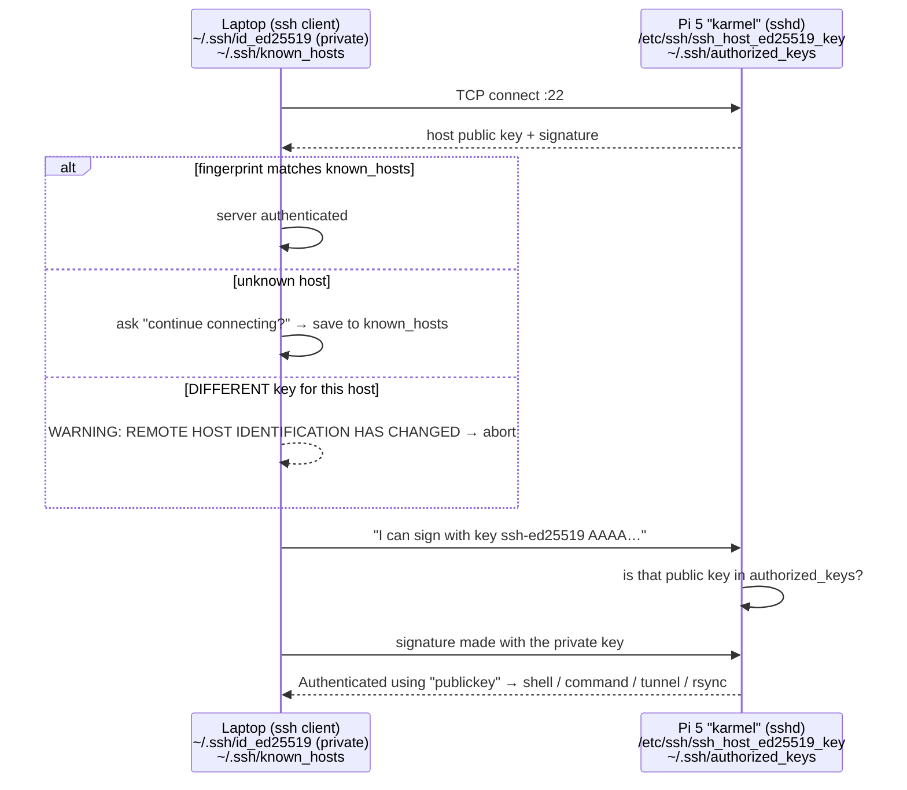

# FL.08 — SSH and remote development

<!-- glance:start -->
<!-- generated by tools/build.py from curriculum/syllabus.yaml — edit the syllabus, not this block -->

| | |
|---|---|
| **Track** | Optional foundation |
| **Difficulty** | Beginner |
| **Time** | 50 min |
| **Hardware** | none |
| **Software** | ssh |
| **Prerequisites** | [FL.03 The shell for Windows developers](FL.03-shell-basics.md) |
| **Skip if** | You use SSH keys and remote editing daily. |

<!-- glance:end -->

## What you will learn

- Explain what SSH verifies in each direction (host keys vs user keys) and what the scary "REMOTE HOST IDENTIFICATION HAS CHANGED" warning means after you re-flash the Pi.
- Create an Ed25519 key on Windows or Ubuntu, install it on the robot, and log in without a password, then turn password login off safely.
- Write `~/.ssh/config` so `ssh karmel` just works, from PowerShell, WSL and VS Code.
- Copy and synchronize code with `scp` and `rsync` (trailing slashes, `--delete`, dry runs, excludes).
- Edit and debug code on the Pi with VS Code Remote-SSH, and forward a port (e.g. Foxglove's 8765) through SSH.

## Why it matters

The Raspberry Pi on the robot has no monitor or keyboard. From
[01.04 Set up the Raspberry Pi 5 headless](../../01-first-robot/01.04-raspberry-pi-setup.md) onward you reach it only over
SSH: to run the Pico tools ([01.05](../../01-first-robot/01.05-pico-microcontroller-setup.md)), drive it from your laptop
([01.15](../../01-first-robot/01.15-teleop-from-laptop.md)), sync and build the ROS workspace, and read logs. You'll open
dozens of SSH sessions a day, and small frictions add up: typing passwords, IP addresses that change, host-key warnings
after every re-flash, `rsync` deleting the wrong directory. This lesson removes them. [FL.13](FL.13-tmux-headless.md) then
keeps your sessions alive when Wi-Fi drops.

<!-- prereqs:start -->
## Prerequisites

You need these first:

- [FL.03 The shell for Windows developers](FL.03-shell-basics.md)

### Optional prerequisite links

None.

Check your readiness: `python course.py why FL.08`
<!-- prereqs:end -->

## Concept

### Two identities, two directions

SSH gives you an encrypted shell on another machine. Two different checks happen at connection time, and mixing them up
causes most SSH confusion:

1. **The client verifies the server (host key).** The robot has a *host key pair* generated when its OS was first
   installed. The first time you connect, SSH shows the fingerprint and asks whether to trust it. Your answer is saved in
   `~/.ssh/known_hosts`. Every later connection checks the server still has the same key. This is "trust on first use":
   like TLS certificate pinning, but without a certificate authority.
2. **The server verifies you (user key or password).** You generate a *user key pair*. The **private** key stays on your
   laptop (`~/.ssh/id_ed25519`). The **public** key goes into `~/.ssh/authorized_keys` on the robot. To log in, the laptop
   proves it holds the private key. No secret crosses the network.

In .NET terms it's mutual TLS: the host key is the server certificate, the user key is the client certificate, and
`authorized_keys` is the allow-list of client certificate thumbprints.

When you **re-flash the Pi's SD card**, the new OS generates a *new host key*. Your laptop still remembers the old one and
refuses to connect with a big warning. In that case the warning is expected, and you remove the old entry. If you did
*not* re-flash anything, treat it as a real alarm.

### Remote development styles

| Style | How | Good for |
|---|---|---|
| Terminal on the robot | `ssh karmel`, edit with `nano`/`vim` | quick checks, logs, restarts |
| Edit locally, sync, build remotely | `rsync` to the Pi, `ssh karmel 'colcon build'` | fast laptop editor, reproducible pushes, Pi keeps only what it needs |
| **VS Code Remote-SSH** | VS Code UI on Windows, files/terminal/debugger on the Pi | day-to-day robot development, debugging on the real hardware |
| ROS over the network | nodes on the Pi, RViz on the laptop via DDS ([FL.09](FL.09-networking-basics.md)) | visualization. Don't ship GUIs over SSH |

> [!TIP]
> **Ask your teacher:** "Explain exactly what is signed and what is encrypted during an SSH public-key login, and why a stolen known_hosts file is harmless but a stolen id_ed25519 is not."

## Technical explanation

### Level 1 — Keys and first login

Windows 11 includes the OpenSSH client (`ssh`, `ssh-keygen`, `scp`) in PowerShell. Ubuntu has it too. Keys are stored in
`C:\Users\<you>\.ssh\` on Windows and `~/.ssh/` in Linux/WSL. These are separate places, so either copy the key or create
one per environment.

```bash
ssh-keygen -t ed25519 -C "laptop-karmel"     # Enter for the default path; DO set a passphrase on a laptop
```

Output (verified on Ubuntu 24.04):

```text
Generating public/private ed25519 key pair.
Your identification has been saved in /home/you/.ssh/id_ed25519
Your public key has been saved in /home/you/.ssh/id_ed25519.pub
```

`ls -l ~/.ssh` shows `-rw------- id_ed25519` (600, private) and `-rw-r--r-- id_ed25519.pub` (644, public). The public key is
one line starting with `ssh-ed25519 AAAAC3NzaC1lZDI1NTE5…`. Ed25519 keys are short, fast, and the modern default. Use RSA only
for very old servers.

Install the public key on the robot:

```bash
ssh-copy-id -i ~/.ssh/id_ed25519.pub ubuntu@karmel.local   # Linux/WSL
```

On Windows PowerShell there's no `ssh-copy-id`. This one-liner does the same:

```powershell
type $env:USERPROFILE\.ssh\id_ed25519.pub | ssh ubuntu@karmel.local "mkdir -p ~/.ssh && chmod 700 ~/.ssh && cat >> ~/.ssh/authorized_keys && chmod 600 ~/.ssh/authorized_keys"
```

(`karmel.local` is the Pi's mDNS name, explained in [FL.09](FL.09-networking-basics.md). You can use its IP address instead.)

**Passphrase + agent.** A passphrase encrypts the private key on disk. The **ssh-agent** keeps the unlocked key in memory so
you type the passphrase once per login. On Windows, run once in an admin PowerShell:
`Get-Service ssh-agent | Set-Service -StartupType Automatic; Start-Service ssh-agent`, then `ssh-add` in a normal PowerShell.
In Ubuntu Desktop an agent already runs, so `ssh-add` is enough.

### Level 2 — `~/.ssh/config`: names instead of addresses

```text
Host karmel
    HostName karmel.local          # or 192.168.1.57
    User ubuntu
    IdentityFile ~/.ssh/id_ed25519
    ServerAliveInterval 15         # send keepalives: detect dead Wi-Fi in ~45 s instead of hanging
    ServerAliveCountMax 3

Host karmel-eth
    HostName 10.42.0.2             # direct Ethernet cable, for large copies
    User ubuntu
    IdentityFile ~/.ssh/id_ed25519
```

Now `ssh karmel`, `scp file karmel:`, `rsync … karmel:…` and VS Code all use the alias. The file must not be writable by
others (`chmod 600 ~/.ssh/config` on Linux).

**Run one command remotely:** `ssh karmel 'hostname; uname -m'`. Quote the remote command, or your *local* shell expands
`$VARS` and globs before SSH sends it.

**Turn off password logins** once key login works. Keep your current SSH session open while you do this, so a mistake
can't lock you out:

```bash
echo -e 'PasswordAuthentication no\nKbdInteractiveAuthentication no' | sudo tee /etc/ssh/sshd_config.d/10-karmel.conf
sudo sshd -t && sudo systemctl restart ssh   # -t = test config; restart only if it's valid
```

Then test from a *new* terminal: `ssh karmel` still works, and `ssh -o PubkeyAuthentication=no karmel` gets
`Permission denied (publickey)`. On Ubuntu 24.04, `sshd` is started on demand by `ssh.socket` (the socket listens on port 22
and starts `ssh.service` for connections). `systemctl status ssh.socket` shows `active (listening)`.

### Level 3 — Copying code: `scp` and `rsync`

`scp` copies files once: `scp teleop.py karmel:~/` or `scp -r config karmel:~/karmel_ws/`.

`rsync` **synchronizes**: it sends only what changed, and can delete what you deleted.

```bash
rsync -av --delete --exclude build/ ~/karmel_ws/src/ karmel:karmel_ws/src/
```

| Flag | Meaning |
|---|---|
| `-a` | archive: recursive, keep permissions, times and symlinks |
| `-v` / `--itemize-changes` | list what's transferred / why |
| `-z` | compress (helps over Wi-Fi) |
| `--delete` | delete files on the robot that no longer exist locally. **Always try with `-n` (dry run) first** |
| `--exclude build/` | skip a pattern (colcon `build/ install/ log/`, `__pycache__/`, `.venv/`) |
| `--mkpath` | create missing destination directories (rsync ≥ 3.2.3; Ubuntu 24.04 has 3.2.7) |

**The trailing slash rule** is the #1 rsync accident. `src/` means "the *contents* of src", while `src` means "the directory src itself".
Verified with a dry run: `rsync -avn ~/karmel_ws/src/ karmel:karmel_ws/src/` lists `karmel_pkg/…`, but
`rsync -avn ~/karmel_ws/src karmel:karmel_ws/src/` lists `src/karmel_pkg/…`, which creates `karmel_ws/src/src/`. Combine the wrong
form with `--delete` and you can wipe a directory. Always put a slash on the source when you mean "contents".

Numbers: a workspace `src/` of 1,200 files / 40 MB where you changed 3 files (60 kB). `scp -r` sends 40 MB every time. Over
Wi-Fi at an effective 25 Mbit/s ≈ 3.1 MB/s that takes $40 / 3.1 \approx 13$ s. `rsync` compares file lists (a few hundred kB)
and sends about 60 kB, which finishes in well under a second.

### Level 4 — VS Code Remote-SSH and port forwarding

Install the **Remote - SSH** extension (`ms-vscode-remote.remote-ssh`) in VS Code on Windows. Press F1 →
*Remote-SSH: Connect to Host…* → `karmel` (read from your `~/.ssh/config`). On first connect, VS Code installs its server in
`~/.vscode-server` on the Pi (arm64 is supported). From then on the Explorer, terminal, Python extension, debugger and ROS
tooling run **on the Pi**. Cost: a few hundred MB of disk and noticeable RAM on the Pi. Close the window when you're done,
and use rsync instead on a 2 GB board.

**Port forwarding.** A web-socket tool on the robot, like `foxglove_bridge` (default port 8765), can be reached securely without
opening firewall ports:

```bash
ssh -N -L 8765:localhost:8765 karmel     # laptop:8765 → (encrypted) → robot's localhost:8765
```

Then connect Foxglove on the laptop to `ws://localhost:8765`. `-N` means "no remote command, just the tunnel".

**Don't** run RViz on the Pi with `ssh -X` (X11 forwarding). It's slow and needs GUI libraries on the robot. Run RViz on the laptop
and let ROS 2 carry the data ([04.02](../../04-ros2/04.02-installing-ros2.md), [FL.09](FL.09-networking-basics.md)).

## Diagram



## Code

The SSH alias (`~/.ssh/config`) from Level 2, plus a sync script that pushes the workspace to the robot safely: it checks key-based
reachability first, excludes junk, supports a dry run, and optionally builds on the robot.

`~/bin/sync-to-robot.sh`:

```bash
#!/usr/bin/env bash
# sync-to-robot.sh — push the workspace sources to the robot, then (optionally) build there.
# Usage: sync-to-robot.sh [--dry-run] [--build]
set -euo pipefail

ROBOT="${ROBOT:-karmel}"                       # an ssh config Host alias (see ~/.ssh/config)
LOCAL_SRC="${LOCAL_SRC:-$HOME/karmel_ws/src/}" # trailing slash: copy the CONTENTS of src
REMOTE_SRC="${REMOTE_SRC:-karmel_ws/src/}"     # relative to the remote user's home

dry_run=() build=false
for arg in "$@"; do
  case "$arg" in
    --dry-run) dry_run=(--dry-run) ;;
    --build)   build=true ;;
    *) echo "unknown option: $arg" >&2; exit 2 ;;
  esac
done

ssh -o BatchMode=yes -o ConnectTimeout=5 "$ROBOT" true \
  || { echo "cannot reach '$ROBOT' with key auth (try: ssh -v $ROBOT)" >&2; exit 1; }

rsync -az --mkpath --delete "${dry_run[@]}" --itemize-changes \
  --exclude '__pycache__/' --exclude '.venv/' --exclude '*.pyc' \
  "$LOCAL_SRC" "$ROBOT:$REMOTE_SRC"

if $build && (( ${#dry_run[@]} == 0 )); then
  ssh "$ROBOT" 'source /opt/ros/jazzy/setup.bash && cd ~/karmel_ws && colcon build --symlink-install'
fi
```

`BatchMode=yes` makes SSH fail instead of prompting for a password, so the script never hangs waiting for input. Run from WSL or
Ubuntu (rsync isn't part of Windows). `--itemize-changes` codes: `<f+++++++++` = new file sent, `<f..t......` = changed file
sent, `*deleting` = removed on the robot, `cd+++++++++` = directory created.

## Exercise

No Pi yet? Use two containers or `localhost`: in WSL, `sudo apt install openssh-server` and treat `localhost` as "the robot". Every
command works the same.

### Exercise FL.08-E1 — Key login from zero `[coding]`

Hardware: none, or `robot-base` (the Pi with Ubuntu Server 24.04).

1. Generate an Ed25519 key. Check the permissions with `ls -l ~/.ssh`.
2. Create the `karmel` alias in `~/.ssh/config` (HostName = the Pi, or `127.0.0.1` for the local server).
3. Before installing the key, run `ssh -o BatchMode=yes karmel true; echo "exit=$?"`.
4. Install the public key, then run `ssh karmel 'hostname; whoami; uname -m'`.
5. Run `ssh -v -o BatchMode=yes karmel true 2>&1 | grep -E 'Offering|Server accepts|Authenticated'`.

### Exercise FL.08-E2 — Two SSH errors on purpose `[debugging]`

Hardware: none.

1. `chmod 644 ~/.ssh/id_ed25519`, then `ssh -o BatchMode=yes karmel true`. Read the whole message, then `chmod 600` it back.
2. Simulate a re-flashed robot. On the server side, as root: `rm /etc/ssh/ssh_host_ed25519_key* && ssh-keygen -q -t ed25519 -N "" -f /etc/ssh/ssh_host_ed25519_key && systemctl restart ssh`.
   Then from the client: `ssh -o BatchMode=yes karmel true`. Fix it with `ssh-keygen -R <HostName>` and reconnect.

### Exercise FL.08-E3 — rsync without accidents `[predict]`

Hardware: none. Create `~/karmel_ws/src/karmel_teleop/karmel_teleop/teleop.py`, a `package.xml`, and a `__pycache__/teleop.cpython-312.pyc`.
**Predict** the itemized output of each step before running `sync-to-robot.sh`:

1. `sync-to-robot.sh --dry-run`
2. `sync-to-robot.sh`
3. `sync-to-robot.sh` again, with nothing changed
4. Change `teleop.py`, delete `package.xml`, run `sync-to-robot.sh`
5. `rsync -avn ~/karmel_ws/src karmel:karmel_ws/src/` (no trailing slash on the source): where would files land?

### Exercise FL.08-E4 — Remote editing and a tunnel `[coding]`

Hardware: `robot-base` recommended. Alternatively use WSL as the "remote" (VS Code → Remote-SSH to `localhost`).

1. VS Code → Remote-SSH → `karmel`. Open `~/karmel_ws`, open a terminal inside VS Code, run `uname -m`.
2. On the robot: `python3 -m http.server 8000 --bind 127.0.0.1`. On the laptop: `ssh -N -L 8000:localhost:8000 karmel`, then open `http://localhost:8000` in a Windows browser.

## Expected result

**FL.08-E1:** Step 3 (key not installed yet):
`pi5@127.0.0.1: Permission denied (publickey,password).` and `exit=255` (your user and host names differ). Step 4, on first
connection: `Warning: Permanently added '…' (ED25519) to the list of known hosts.` (if the host key was accepted, e.g. with
`StrictHostKeyChecking accept-new`, or after you type `yes`), then the robot's hostname, the remote user and `aarch64` on a Pi
(`x86_64` for localhost). Step 5:

```text
debug1: Offering public key: /home/you/.ssh/id_ed25519 ED25519 SHA256:… explicit
debug1: Server accepts key: /home/you/.ssh/id_ed25519 ED25519 SHA256:… explicit
Authenticated to 127.0.0.1 ([127.0.0.1]:22) using "publickey".
```

**FL.08-E2:** (1)

```text
@@@@@@@@@@@@@@@@@@@@@@@@@@@@@@@@@@@@@@@@@@@@@@@@@@@@@@@@@@@
@         WARNING: UNPROTECTED PRIVATE KEY FILE!          @
@@@@@@@@@@@@@@@@@@@@@@@@@@@@@@@@@@@@@@@@@@@@@@@@@@@@@@@@@@@
Permissions 0644 for '/home/you/.ssh/id_ed25519' are too open.
It is required that your private key files are NOT accessible by others.
This private key will be ignored.
Load key "/home/you/.ssh/id_ed25519": bad permissions
pi5@127.0.0.1: Permission denied (publickey,password).
```

(2) `WARNING: REMOTE HOST IDENTIFICATION HAS CHANGED!`, the new `SHA256:` fingerprint, and
`Offending ED25519 key in /home/you/.ssh/known_hosts:1`, then `Host key verification failed.` `ssh-keygen -R 127.0.0.1` prints
`# Host 127.0.0.1 found: line 1`, `/home/you/.ssh/known_hosts updated.` and `Original contents retained as /home/you/.ssh/known_hosts.old`.
The next connection asks to trust the new key again.

**FL.08-E3:** (1) dry run (nothing is changed on the robot, but the plan is listed):

```text
cd+++++++++ ./
cd+++++++++ karmel_teleop/
<f+++++++++ karmel_teleop/package.xml
cd+++++++++ karmel_teleop/karmel_teleop/
<f+++++++++ karmel_teleop/karmel_teleop/teleop.py
```

(some rsync versions add `created directory karmel_ws/src` lines). The `__pycache__` file is absent because of the exclude.
(2) the same list for real. (3) **no output**: nothing to send. (4)

```text
*deleting   karmel_teleop/package.xml
.d..t...... karmel_teleop/
<f..t...... karmel_teleop/karmel_teleop/teleop.py
```

(5) the listing shows `src/`, `src/karmel_teleop/…`: files would go to `karmel_ws/src/src/karmel_teleop`, the trailing-slash accident.

**FL.08-E4:** The VS Code status bar (bottom left) shows `SSH: karmel`, and the integrated terminal prints `aarch64` on the Pi.
The browser on Windows shows the robot's directory listing at `http://localhost:8000`, even though the server only listens on
the robot's `127.0.0.1`: the traffic went through the SSH tunnel.

## Troubleshooting

### Symptom: `Permission denied (publickey,password)`

1. `ssh -v karmel 2>&1 | grep -E 'Offering|identity file|Authentications that can continue'`: is your key offered at all? If not,
   `IdentityFile` is wrong, the key file has bad permissions (see E2), or you're in WSL using a key that only exists in Windows.
2. Offered but not accepted: on the robot, check `~/.ssh/authorized_keys` contains exactly that public key line (one line, no line
   breaks) for **the user you log in as** (`User` in the config).
3. Permissions on the robot: `~/.ssh` must be 700 and `authorized_keys` 600, both owned by that user. The home directory must not be
   group-writable. `sshd` silently ignores keys otherwise. `sudo journalctl -u ssh -n 20` on the robot shows the reason.
4. You disabled password auth and the key is wrong: use the open session you kept, or attach a keyboard and monitor, or edit
   `authorized_keys` on the SD card from another machine.

### Symptom: `REMOTE HOST IDENTIFICATION HAS CHANGED`

1. Did you re-flash or reinstall the robot, or did its IP get reassigned to another device? If yes: `ssh-keygen -R <name-or-ip>`
   and reconnect.
2. If nothing changed: don't connect. Check you're on the right network (a different device may have the address) and ask your teacher.

### Symptom: `ssh: connect to host karmel.local port 22: Connection timed out` / `Could not resolve hostname`

That's a network problem, not an SSH problem. Go to [FL.09](FL.09-networking-basics.md): `ping`, check the IP, mDNS, same subnet.
`Connection refused` (instead of timeout) means the host is reachable but nothing listens on 22: `sudo systemctl status ssh.socket` on the robot.

### Symptom: VS Code Remote-SSH hangs at "Setting up SSH host" or "Downloading VS Code Server"

1. Test `ssh karmel` in a terminal first. VS Code uses the same config, and passphrase prompts can hide in the output window.
2. The Pi needs internet access to download the server (or use the "local server download" setting).
3. Disk or RAM full on the Pi: `df -h ~`, `free -h`. Remove old servers with `rm -rf ~/.vscode-server` and reconnect.

## Common mistakes

- **Copying the private key (`id_ed25519`) to the robot** instead of the `.pub` file.
- **Blindly deleting `known_hosts`** every time there's a warning. Remove the single entry with `ssh-keygen -R`, and only when you know why it changed.
- **Disabling password authentication before confirming key login works**, and without an open session.
- **rsync without a trailing slash on the source**, or with `--delete` without a dry run.
- **Using `scp -r` for repeated workspace syncs**: slow, and deleted files stay on the robot.
- **Forgetting that WSL and Windows have separate `~/.ssh`**.
- **Double quotes around remote commands** (`ssh karmel "echo $HOME"` prints *your* home). Use single quotes.
- **X11-forwarding RViz** from the robot instead of running it on the laptop.

## Knowledge check

1. Which file on your laptop records the robot's identity, and which file on the robot records yours?
   <details><summary>Answer</summary>

   Laptop: `~/.ssh/known_hosts` (the robot's host public key). Robot: `~/.ssh/authorized_keys` of the target user (your user public key).
   </details>

2. You re-flashed the Pi's SD card and now get `REMOTE HOST IDENTIFICATION HAS CHANGED`. Why, and what exactly do you run?
   <details><summary>Answer</summary>

   The fresh OS generated a new host key, which no longer matches the one saved in `known_hosts`. Run
   `ssh-keygen -R karmel.local` (or the IP/alias HostName you used), then reconnect and accept the new fingerprint.
   </details>

3. `ssh` prints `Load key "…/id_ed25519": bad permissions`. What are the required permissions and why does SSH care?
   <details><summary>Answer</summary>

   `600` (owner read/write only). If other users could read the private key, it wouldn't be private, so SSH refuses to use it.
   </details>

4. What's the difference between `rsync -a src/ robot:ws/src/` and `rsync -a src robot:ws/src/`?
   <details><summary>Answer</summary>

   With the trailing slash, the contents of `src` go into `ws/src/`. Without it, the directory itself is copied, giving `ws/src/src/`.
   </details>

5. A 40 MB workspace, 3 changed files totaling 60 kB, Wi-Fi at 3.1 MB/s effective. Roughly how long do `scp -r` and `rsync` take?
   <details><summary>Answer</summary>

   `scp -r`: $40/3.1 \approx 13$ s, because it sends everything. `rsync`: well under 1 s. It sends the file list plus about 60 kB of changes.
   </details>

6. Foxglove bridge on the robot listens on port 8765 on localhost only. How do you connect from the laptop without changing the robot?
   <details><summary>Answer</summary>

   `ssh -N -L 8765:localhost:8765 karmel`, then connect to `ws://localhost:8765` on the laptop.
   </details>

7. Why does `sync-to-robot.sh` use `ssh -o BatchMode=yes` for its reachability check?
   <details><summary>Answer</summary>

   With BatchMode, SSH never prompts (password, host key confirmation), so it fails fast with a clear exit code instead of hanging
   a script waiting for input that will never come.
   </details>

## Practical challenge

Set up a **one-command robot dev loop** from your laptop:

- `ssh karmel` works from PowerShell, WSL and VS Code, with key auth and a passphrase-protected key loaded via the agent.
- Password authentication is disabled on the Pi (show `sudo sshd -T | grep -E '^passwordauthentication'` → `passwordauthentication no`).
- `sync-to-robot.sh --build` syncs `~/karmel_ws/src` and builds on the Pi, and prints a one-line summary with the number of changed files
  and build time.
- A second alias `karmel-tunnel` in `~/.ssh/config` opens the Foxglove port forward with `LocalForward 8765 localhost:8765`.

Acceptance criteria: from a fresh terminal, editing a file and running `sync-to-robot.sh --build` needs no password and no manual
`cd`. Deleting a file locally deletes it on the robot (shown in the itemized output). Your teacher can't log in with a password.
No private key exists on the Pi (`ls ~/.ssh` there shows no `id_*` without `.pub`, or only the Pi's own GitHub deploy key if you made one on purpose).

## You can skip this if…

You use SSH keys and remote editing daily, and you answer knowledge-check questions 2, 4 and 6 correctly without looking. Then:
`python course.py skip FL.08 --reason "SSH keys and Remote-SSH daily"`.

## Go deeper

- https://code.visualstudio.com/docs/remote/ssh — VS Code Remote-SSH official guide (setup, troubleshooting, supported platforms).
- https://learn.microsoft.com/en-us/windows-server/administration/openssh/openssh_keymanagement — OpenSSH key management on Windows, including the ssh-agent service.
- https://man.openbsd.org/ssh_config — every `~/.ssh/config` option (`ProxyJump`, `LocalForward`, `ServerAliveInterval`…).
- https://download.samba.org/pub/rsync/rsync.1 — the rsync manual: filter rules, `--itemize-changes` codes, `--delete` variants.
- https://ubuntu.com/server/docs — Ubuntu Server docs, OpenSSH server section (hardening `sshd_config.d`).
- https://missing.csail.mit.edu/ — Missing Semester, "Command-line environment" lecture (SSH, config, port forwarding).

## Progress checkpoint

- [ ] I can explain host keys vs user keys and handle a changed host key correctly.
- [ ] I log in to the robot with a key, via an alias, and have password login turned off.
- [ ] I sync code with rsync safely (trailing slash, dry run, excludes, delete).
- [ ] I can develop on the Pi with VS Code Remote-SSH and reach robot ports through an SSH tunnel.

`python course.py complete FL.08` (exercises done) · `python course.py master FL.08` (challenge done) ·
`python course.py struggle FL.08 "what was hard"`.

Next: [FL.09 — Networking basics: IP, Wi-Fi, ports, mDNS, ping](FL.09-networking-basics.md).
