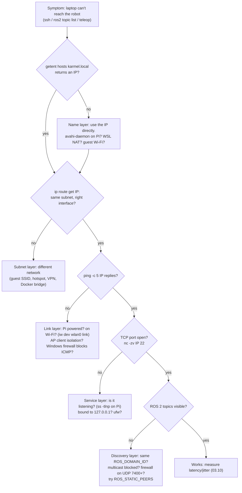

# FL.09 — Networking basics: IP, Wi-Fi, ports, mDNS, ping

<!-- glance:start -->
<!-- generated by tools/build.py from curriculum/syllabus.yaml — edit the syllabus, not this block -->

| | |
|---|---|
| **Track** | Optional foundation |
| **Difficulty** | Beginner |
| **Time** | 1 h |
| **Hardware** | none |
| **Software** | ubuntu |
| **Prerequisites** | [FL.03 The shell for Windows developers](FL.03-shell-basics.md) |
| **Skip if** | You debug home network connectivity with ip, ping and ss. |

<!-- glance:end -->

## What you will learn

- Read an address like `192.168.1.57/24`, compute its subnet, and decide whether two machines can talk directly.
- Explain DHCP, gateways and DNS, and give the Pi a stable address (DHCP reservation or netplan).
- Reach the robot by name with mDNS (`karmel.local`) and know when that fails (WSL NAT, guest Wi-Fi, avahi missing).
- Debug connectivity systematically with `ip`, `ping`, `getent`, `ss`, `nc` and `/dev/tcp`, without nmap.
- Know which ports and protocols the course uses (SSH 22/tcp, Foxglove 8765/tcp, DDS 7400+/udp multicast) and what a firewall does to them.

## Why it matters

The robot is a distributed system: the Pi drives the motors and sensors, and the laptop runs RViz, teleop and later heavier
computation. [01.15 Teleop from the laptop](../../01-first-robot/01.15-teleop-from-laptop.md) needs a working network link.
ROS 2 nodes on the Pi and the laptop find each other with **UDP multicast discovery** ([04.02](../../04-ros2/04.02-installing-ros2.md)).
[03.10 Networking for robots](../../03-robot-software/03.10-networking-for-robots.md) goes deeper into latency, time sync and
Wi-Fi partitions. When "the laptop can't see the robot's topics", the cause is almost always one of the layers in this lesson:
wrong subnet, guest network isolation, WSL NAT, firewall, or multicast blocked by the access point. Being able to tell these apart
in two minutes saves whole evenings.

<!-- prereqs:start -->
## Prerequisites

You need these first:

- [FL.03 The shell for Windows developers](FL.03-shell-basics.md)

### Optional prerequisite links

None.

Check your readiness: `python course.py why FL.09`
<!-- prereqs:end -->

## Concept

### The home network, as your robot sees it

```text
            Internet
               │
        ┌──────┴───────┐  192.168.1.1  = gateway, DHCP server, DNS forwarder
        │  Wi-Fi router │
        └──┬────────┬───┘
   Wi-Fi   │        │  Wi-Fi
┌──────────┴──┐  ┌──┴───────────────┐
│ Laptop      │  │ Pi 5 "karmel"     │
│ 192.168.1.23│  │ 192.168.1.57      │  same /24 subnet → talk directly (no router hop)
│ (WSL inside)│  │ ports: 22 ssh,    │
└─────────────┘  │ 7400+/udp DDS     │
                 └───────────────────┘
```

Four ideas carry you a long way:

1. **IP address + prefix** (`192.168.1.57/24`): who you are, and which addresses are "local" (reachable directly on the same link).
2. **Gateway**: where packets for everything *not* local go (the router).
3. **DHCP**: the router hands out addresses automatically, which means the Pi's address can change unless you pin it.
4. **Ports**: one IP runs many services, and a port number picks one. **TCP** is a reliable byte stream (SSH, HTTP, Foxglove).
   **UDP** is individual datagrams with no delivery guarantee (DDS, video, game-style control), used where fresh data matters more
   than retransmitted old data.

Your distributed-systems experience maps well: DNS/service discovery, load balancers, ports and security groups are the same ideas.
The robotics twist is that everything runs over **Wi-Fi**, with loss, jitter and consumer routers that dislike multicast.

### Discovery without a registry: mDNS and DDS

In a data center you have DNS and a service registry. On a home network there's neither, so robots use **multicast**, a
"shout to everyone who's listening" UDP address:

- **mDNS** (multicast DNS, `224.0.0.251:5353`) answers "who is `karmel.local`?". On Ubuntu the `avahi-daemon` responds. Windows 10/11 can
  resolve `.local` names too.
- **DDS discovery**, used by ROS 2, sends participant announcements to `239.255.0.1` on UDP port 7400 + 250 × domain.
  Every ROS 2 process in the same domain on the same subnet hears them and connects. This is covered in depth in 04.02 and 03.10.

If multicast doesn't pass (WSL NAT mode, some mesh/guest Wi-Fi, "client isolation" or "IGMP snooping" misconfigured), both break:
`karmel.local` doesn't resolve *and* `ros2 topic list` on the laptop is empty, even though `ping 192.168.1.57` works.

> [!TIP]
> **Ask your teacher:** "Compare DDS discovery over multicast with Consul/Eureka service discovery in a microservice system. What does each assume about the network?"

## Technical explanation

### Level 1 — Addresses and subnets

An IPv4 address is 32 bits. The **prefix length** $p$ (the `/24`) says how many leading bits identify the network. The rest identify
the host within it:

$$
\text{addresses in subnet} = 2^{32-p}, \qquad \text{usable hosts} = 2^{32-p} - 2
$$

(the all-zeros address names the network, and all-ones is the broadcast).

**Worked example 1.** `192.168.1.57/24`: $2^{32-24} = 256$ addresses, 254 usable. Network `192.168.1.0`, broadcast `192.168.1.255`.
Is `192.168.1.200` local? Yes. Is `192.168.0.20` local? **No**: the third octet differs, so the laptop would send those packets to the
gateway, and on most home routers two different /24 networks (e.g. main Wi-Fi and a guest network) are deliberately not routed to
each other.

**Worked example 2.** A campus network `10.0.5.20/22`: $2^{10} = 1024$ addresses, 1022 usable, range `10.0.4.0`–`10.0.7.255`.
So `10.0.6.3` **is** on the same subnet, even though the third octet differs. Don't eyeball octets unless the prefix is /24.
Check with Python (these exact results were computed that way):

```bash
python3 -c "import ipaddress as ip; n=ip.ip_interface('10.0.5.20/22').network; print(n, n.broadcast_address, n.num_addresses-2, ip.ip_address('10.0.6.3') in n)"
# 10.0.4.0/22 10.0.7.255 1022 True
```

Private ranges you'll see: `192.168.0.0/16`, `10.0.0.0/8`, `172.16.0.0/12` (Docker uses `172.17.0.0/16`). `127.0.0.1` is **loopback**:
this machine only. A service bound to `127.0.0.1` can't be reached from the network. Bind it to `0.0.0.0` (all interfaces) or tunnel
through SSH ([FL.08](FL.08-ssh-remote-dev.md)).

### Level 2 — Looking at the network on Linux

```bash
ip -br addr            # brief: interface, state, addresses
ip route               # routing table; "default via X" = the gateway
ip route get 192.168.1.57   # which interface/source address the kernel would use to reach that host
resolvectl status      # DNS servers per interface (systemd-resolved)
getent hosts karmel.local   # resolve a name exactly like programs do (DNS, /etc/hosts, mDNS)
ping -c 5 karmel.local # reachability + round-trip time
ss -tulpn              # listening TCP/UDP sockets and their processes (sudo for other users' processes)
nc -zv karmel.local 22 # can I open a TCP connection to this port?
tracepath 8.8.8.8      # the hops along the path
iw dev wlan0 link      # Wi-Fi: SSID, signal strength (dBm), bitrate (on the Pi)
nmcli device wifi list # Wi-Fi networks visible (Ubuntu Desktop / NetworkManager)
```

Verified output in an Ubuntu 24.04 container:

```text
$ ip -br addr
lo               UNKNOWN        127.0.0.1/8 ::1/128
eth0@if85        UP             172.17.0.2/16
$ ip -4 route
default via 172.17.0.1 dev eth0
172.17.0.0/16 dev eth0 proto kernel scope link src 172.17.0.2
$ ss -tlnp
LISTEN 0      5          127.0.0.1:8000      0.0.0.0:*    users:(("python3",pid=1099,fd=3))
$ nc -zv 127.0.0.1 8001
nc: connect to 127.0.0.1 port 8001 (tcp) failed: Connection refused
```

**Reading ping for robotics.** `rtt min/avg/max/mdev = 2.1/9.8/61.3/14.2 ms` on Wi-Fi means an average of 10 ms but spikes to 61 ms
(`mdev` is the spread). A teleop loop sending commands at 20 Hz (every 50 ms) will occasionally see a command arrive later than the
next one should have been sent. That's why the Pico has a 300 ms watchdog and why [03.10](../../03-robot-software/03.10-networking-for-robots.md)
measures jitter, not just the average. Wi-Fi signal: better than −60 dBm is good, −70 dBm is marginal, below −80 dBm expect dropouts.

### Level 3 — Stable addresses and names

**Option A (recommended): DHCP reservation in the router.** Tell the router "MAC address `d8:3a:dd:…` always gets `192.168.1.57`"
(find the MAC with `ip link show wlan0`). Nothing changes on the Pi, and the router won't hand that address to anything else.

**Option B: static address with netplan on the Pi.** Ubuntu Server configures networking with netplan YAML in `/etc/netplan/`:

```yaml
# /etc/netplan/50-karmel-wifi.yaml   (chmod 600: it contains the Wi-Fi password)
network:
  version: 2
  wifis:
    wlan0:
      dhcp4: false
      addresses: [192.168.1.57/24]
      routes:
        - to: default
          via: 192.168.1.1
      nameservers:
        addresses: [192.168.1.1, 1.1.1.1]
      access-points:
        "HomeWiFi":
          password: "your-wifi-password"
```

`sudo netplan generate` validates the file. `sudo netplan try` applies it and **rolls back after 120 s unless you confirm**. Use it
over SSH, so a wrong address doesn't strand a headless robot. A typo like `addresses: 192.168.1.57/24` (no brackets) is rejected with
`Error in network definition: expected sequence`. Pick a static address **outside** the router's DHCP pool, or you'll get conflicts.
Ubuntu Desktop uses NetworkManager instead (`nmcli`, or Settings).

**Names: mDNS.** With `avahi-daemon` running on the Pi (`sudo apt install avahi-daemon` if `systemctl status avahi-daemon` shows
nothing), it answers for `<hostname>.local`. Set the hostname with `sudo hostnamectl set-hostname karmel`. Laptops then use
`karmel.local`, which keeps working even if the DHCP address changes.

### Level 4 — Firewalls, ports and a first look at DDS

**Linux: ufw.** Ubuntu ships `ufw` *inactive*. If you enable it on the robot, allow SSH **first**:

```bash
sudo ufw allow 22/tcp
sudo ufw allow from 192.168.1.0/24          # trust the home subnet (DDS uses many UDP ports)
sudo ufw enable
sudo ufw status verbose
```

**Windows: Defender Firewall** can silently drop incoming UDP to the laptop (DDS from the Pi) when the network profile is "Public".
Set your home Wi-Fi to "Private". With WSL in mirrored mode, the **Hyper-V firewall** also applies ([FL.02](FL.02-installing-ubuntu.md)).

**Ports the course uses:**

| Port | Proto | What |
|---|---|---|
| 22 | tcp | SSH to the robot |
| 5353 | udp multicast `224.0.0.251` | mDNS (`karmel.local`) |
| 7400 + 250·d (+1, +10+2i, +11+2i) | udp (multicast `239.255.0.1` + unicast) | DDS/ROS 2 discovery and data, domain *d*, participant *i* |
| 8765 | tcp | foxglove_bridge web socket |
| 123 | udp | NTP / chrony time sync (03.10) |

**DDS port arithmetic** (the RTPS standard well-known ports: base 7400, domain gain 250, participant gain 2), for domain $d$ and
participant index $i$:

$$
\begin{aligned}
\text{discovery multicast} &= 7400 + 250d \\
\text{discovery unicast} &= 7400 + 250d + 10 + 2i \\
\text{user data multicast} &= 7400 + 250d + 1 \\
\text{user data unicast} &= 7400 + 250d + 11 + 2i
\end{aligned}
$$

For `ROS_DOMAIN_ID=7` and the first participant ($i=0$): discovery multicast $7400 + 1750 = 9150$, discovery unicast $9160$,
user multicast $9151$, user unicast $9161$. The second process on the same machine ($i=1$) uses $9162$/$9163$. Two robot kits in the
same classroom on different domain IDs never hear each other's discovery. Keep domain IDs between 0 and 101 (the ROS docs' safe range).
In Jazzy, `ROS_AUTOMATIC_DISCOVERY_RANGE` (default `SUBNET`; `LOCALHOST` keeps a machine to itself) and `ROS_STATIC_PEERS` (explicit
IPs when multicast is blocked) control discovery. [04.02](../../04-ros2/04.02-installing-ros2.md) and [03.10](../../03-robot-software/03.10-networking-for-robots.md)
use them.

## Diagram



## Code

`netcheck.sh` walks the ladder from the diagram for any host and port: name → route → ping → TCP. It stops at the first hard failure,
with a hint. It uses only tools present on every Ubuntu (`getent`, `ip`, `ping`, and bash's built-in `/dev/tcp`), so it also works on a
minimal Pi image. That's the "no nmap needed" approach.

`~/bin/netcheck.sh`:

```bash
#!/usr/bin/env bash
# netcheck.sh — walk the network ladder to a host: name -> route -> ping -> TCP port.
# Usage: netcheck.sh HOST [TCP_PORT]      e.g.  netcheck.sh karmel.local 22
set -uo pipefail

host="${1:?usage: netcheck.sh HOST [TCP_PORT]}"
port="${2:-22}"

step() { printf '%-8s %s\n' "$1" "$2"; }

# 1. Name resolution (DNS, /etc/hosts, mDNS via nss-mdns for .local)
if [[ "$host" =~ ^[0-9.]+$ ]]; then
  ip_addr="$host"
  step "NAME" "skipped (already an IP)"
else
  ip_addr=$(getent ahostsv4 "$host" | awk 'NR==1 {print $1}')
  if [[ -z "$ip_addr" ]]; then
    step "NAME" "FAIL cannot resolve '$host' (typo? for .local: avahi-daemon on the robot, mDNS on your side)"
    exit 1
  fi
  step "NAME" "ok $host -> $ip_addr"
fi

# 2. Route: which interface and source address would the kernel use?
route=$(ip route get "$ip_addr" 2>/dev/null | head -1)
if [[ -z "$route" ]]; then
  step "ROUTE" "FAIL no route to $ip_addr (not connected to any network?)"
  exit 2
fi
step "ROUTE" "ok $route"

# 3. ICMP echo (ping). Some networks block it, so a failure here is a strong hint, not proof.
if ping -c 3 -i 0.2 -W 1 "$ip_addr" > /tmp/netcheck.ping 2>&1; then
  step "PING" "ok $(tail -1 /tmp/netcheck.ping)"
else
  step "PING" "FAIL no reply ($(grep -o '[0-9]*% packet loss' /tmp/netcheck.ping || echo 'error'))"
fi

# 4. TCP connect to the service port (bash's /dev/tcp pseudo-file, no extra tools needed)
if timeout 3 bash -c "exec 3<>/dev/tcp/$ip_addr/$port" 2>/dev/null; then
  step "PORT" "ok tcp/$port is open"
else
  step "PORT" "FAIL tcp/$port closed, filtered or service not running"
  exit 3
fi
```

Exit codes: 0 all good, 1 name, 2 route, 3 port. You can use it in other scripts, e.g. only run `sync-to-robot.sh` when
`netcheck.sh karmel.local 22` succeeds.

## Exercise

### Exercise FL.09-E1 — Subnet arithmetic `[numerical]`

Hardware: none. By hand first, then check with the Python one-liner from Level 1:

1. `192.168.1.57/24`: network, broadcast, usable hosts. Is `192.168.0.20` in it?
2. `10.0.5.20/22`: same questions for `10.0.6.3`.
3. A phone hotspot gives the laptop `172.20.10.4/28`. How many devices can join? Can the Pi be `172.20.10.20`?
4. DDS ports for `ROS_DOMAIN_ID=42`, participants 0 and 1.

### Exercise FL.09-E2 — Run the ladder `[coding]`

Hardware: none. In `docker run --rm -it -v "${PWD}:/s" ubuntu:24.04 bash` (then `apt update && apt install -y iproute2 iputils-ping python3`):

1. Start a server: `python3 -m http.server 8000 --bind 127.0.0.1 &`
2. `bash /s/netcheck.sh localhost 8000; echo "exit=$?"`
3. `bash /s/netcheck.sh localhost 8001; echo "exit=$?"`
4. `bash /s/netcheck.sh karmel.local; echo "exit=$?"`
5. `ss -tlnp` and `ip -br addr`, `ip -4 route`

### Exercise FL.09-E3 — Laptop ↔ Pi for real `[hardware]`

Hardware: `robot-base` (Pi 5 on your home Wi-Fi). Without a Pi, do steps 1–2 between Windows and WSL.

1. On the Pi: `ip -br addr`, `ip route`, `iw dev wlan0 link | grep -E 'SSID|signal|tx bitrate'`, `hostname`.
2. On the laptop (Ubuntu/WSL): `netcheck.sh karmel.local 22`, and from PowerShell `ping karmel.local`.
3. `ping -c 50 -i 0.2 karmel.local | tail -2`: note loss and `mdev`. Walk to the far end of the flat with the robot and repeat.
4. On the Pi: `ss -tulpn | grep -E ':22|:5353'`.

### Exercise FL.09-E4 — Break it in three ways `[debugging]`

Hardware: `robot-base` or two machines on one network. For each break, **predict** which netcheck step fails and with which exit code, then verify, then undo:

1. On the Pi: `sudo systemctl stop ssh.socket ssh.service`.
2. On the laptop: connect to a different Wi-Fi (guest network or phone hotspot).
3. On the Pi: `sudo systemctl stop avahi-daemon` (then use `karmel.local`).

## Expected result

**FL.09-E1:** (1) `192.168.1.0`, `192.168.1.255`, 254 hosts, and `192.168.0.20` is **not** in it. (2) `10.0.4.0`, `10.0.7.255`, 1022 hosts,
and `10.0.6.3` **is** in it. (3) /28 → $2^4 - 2 = 14$ usable addresses (`172.20.10.1`–`.14`, the phone takes one), so about 13 devices,
and `172.20.10.20` is outside (`172.20.10.0/28` ends at `.15`). (4) Domain 42: $7400 + 250 \cdot 42 = 17900$. Discovery multicast 17900,
discovery unicast 17910 (i=0) / 17912 (i=1), user multicast 17901, user unicast 17911 / 17913.

**FL.09-E2:**

```text
NAME     ok localhost -> 127.0.0.1
ROUTE    ok local 127.0.0.1 dev lo src 127.0.0.1 uid 0
PING     ok rtt min/avg/max/mdev = 0.035/1.601/4.694/2.186 ms
PORT     ok tcp/8000 is open
exit=0
```

Step 3: the same first three lines, then `PORT     FAIL tcp/8001 closed, filtered or service not running`, `exit=3`.
Step 4: `NAME     FAIL cannot resolve 'karmel.local' (typo? for .local: avahi-daemon on the robot, mDNS on your side)`, `exit=1`
(containers have no mDNS). Step 5: `ss` shows `127.0.0.1:8000` with `users:(("python3",…))`, and routes like
`default via 172.17.0.1 dev eth0` (Docker's bridge network).

**FL.09-E3:** The Pi shows `wlan0  UP  192.168.x.y/24`, `default via 192.168.x.1 dev wlan0`, an SSID line and `signal: -4x dBm` near the router.
The laptop's netcheck prints `ok karmel.local -> 192.168.x.y`, a route `dev wlan0` (or `eth0` inside WSL), ping `ok`, and `tcp/22 is open`.
Ping from PowerShell resolves `karmel.local` too. The 50-ping run near the router: `0% packet loss`, avg ~3–15 ms, mdev a few ms. Far away:
avg and mdev grow (tens of ms) and some loss may appear. `ss` shows `0.0.0.0:22` / `[::]:22` owned by systemd (socket activation) and
`0.0.0.0:5353` for avahi.

**FL.09-E4:** (1) NAME, ROUTE and PING ok, `PORT FAIL`, exit 3. From another terminal `ssh` says `Connection refused`. Undo with
`sudo systemctl start ssh.socket` (through a keyboard/monitor, or ahead of time with `sudo systemd-run --on-active=60 systemctl start ssh.socket`).
(2) NAME fails (exit 1) or, if you use the IP, ROUTE shows a different interface/subnet and PING fails: different networks aren't routed to
each other. (3) NAME fails for `karmel.local` (after the laptop's cache expires, up to a couple of minutes), while `netcheck.sh 192.168.x.y 22`
still passes. Names and connectivity are separate layers.

## Troubleshooting

### Symptom: `ssh karmel.local` → `Could not resolve hostname`

1. Use the IP instead. If that works, the problem is mDNS only.
2. On the Pi: `systemctl is-active avahi-daemon`, `hostname`. Install/enable avahi if missing.
3. On the laptop: are you in WSL with NAT networking? mDNS multicast doesn't cross the NAT. Use mirrored mode ([FL.02](FL.02-installing-ubuntu.md)),
   or add the Pi to `/etc/hosts`.
4. Are both on the same SSID and not a guest/isolated network?

### Symptom: ping works, `ros2 topic list` on the laptop shows nothing from the Pi

1. Same `ROS_DOMAIN_ID` in **both** terminals? `echo $ROS_DOMAIN_ID` (unset = 0).
2. `ROS_AUTOMATIC_DISCOVERY_RANGE` set to `LOCALHOST` somewhere (e.g. `~/.bashrc`)? `env | grep ROS_`.
3. Firewalls: Windows network profile "Public", Hyper-V firewall for WSL, `ufw` on the Pi. Test once with them relaxed to confirm.
4. Multicast blocked by the access point or WSL NAT: set `ROS_STATIC_PEERS` to the other machine's IP on both sides (04.02 shows how).
5. Still stuck: that's module 04 material. Bring the outputs of steps 1–4 to your teacher.

### Symptom: the Pi's address keeps changing

DHCP. Create a DHCP reservation for the Pi's MAC in the router, or configure netplan with an address outside the DHCP pool. Use `karmel.local` everywhere as well.

### Symptom: a service runs on the Pi but the laptop gets `Connection refused`

On the Pi: `ss -tlnp | grep <port>`. If it shows `127.0.0.1:<port>`, the service only accepts local connections. Bind it to `0.0.0.0`
or use an SSH tunnel. If it isn't listed, the service isn't running.

## Common mistakes

- **Assuming two `192.168.x.y` addresses are on the same network**: check the prefix and the third octet (for /24).
- **Putting the robot on the guest Wi-Fi**: guest networks usually isolate clients from each other.
- **A static IP inside the router's DHCP range**: sooner or later another device gets it.
- **Editing netplan over SSH with `netplan apply`** instead of `netplan try`.
- **Binding a server to `127.0.0.1`** and expecting the laptop to reach it.
- **Enabling `ufw` on a headless Pi before allowing port 22.**
- **Blaming ROS 2 for what's really multicast being blocked** (WSL NAT, AP settings, firewall).
- **Judging Wi-Fi by average ping**: control loops suffer from the max and the jitter.

## Knowledge check

1. How many usable host addresses does a `/26` have, and what is the broadcast address of `192.168.1.70/26`?
   <details><summary>Answer</summary>

   $2^{32-26} - 2 = 62$. `192.168.1.70/26` is in `192.168.1.64/26` (64–127), so the broadcast is `192.168.1.127`.
   </details>

2. The laptop is `192.168.1.23/24`, and the Pi got `192.168.0.57/24` on the guest SSID. Can they talk directly? Why?
   <details><summary>Answer</summary>

   No. They are different /24 networks, so traffic must go through a router, and home routers normally don't route between main and
   guest networks (they isolate them on purpose).
   </details>

3. `ping karmel.local` works but `ssh karmel.local` says `Connection refused`. Which layer, and your next command on the Pi?
   <details><summary>Answer</summary>

   Name, route and link are fine, so it's the service layer: nothing listening on 22. Next: `ss -tlnp | grep :22` and
   `systemctl status ssh.socket`.
   </details>

4. What are the DDS discovery multicast port and the first participant's user unicast port for `ROS_DOMAIN_ID=7`?
   <details><summary>Answer</summary>

   $7400 + 250 \cdot 7 = 9150$ for discovery multicast, and $9150 + 11 = 9161$ for user unicast of participant 0.
   </details>

5. Why does `netplan try` matter more on a robot than on a desktop?
   <details><summary>Answer</summary>

   The robot is headless and reached over the network. A bad config applied with `apply` can cut you off with no keyboard or monitor.
   `try` automatically rolls back after 120 s unless you confirm from a working session.
   </details>

6. ROS 2 in WSL (NAT mode) can't see nodes on the Pi, but `ping` from WSL to the Pi's IP works. Give the most likely cause and two fixes.
   <details><summary>Answer</summary>

   DDS discovery uses multicast, which doesn't pass the WSL NAT. Fixes: enable `networkingMode=mirrored` (Windows 11 22H2+, and allow
   the Hyper-V firewall), or set `ROS_STATIC_PEERS` to the peers' IPs. Dual boot also avoids it.
   </details>

7. Ping to the robot: `rtt min/avg/max/mdev = 2/8/140/25 ms`, 2 % loss. Is it good enough for 20 Hz teleop? What protects the robot?
   <details><summary>Answer</summary>

   The average is fine, but a 140 ms max and 25 ms jitter mean some commands arrive late or several arrive in a burst, and 2 % are lost.
   It's usable for gentle teleop, not for tight remote control. The Pico's 300 ms watchdog stops the motors if commands stop, and
   control loops should run on the robot, not over Wi-Fi.
   </details>

## Practical challenge

Write `robot-net-report.sh`, which runs **on the laptop** and produces a one-screen report for your robot:

- The laptop's interface, IP/prefix, gateway and whether the robot's IP is in the same subnet (use `ip -j` JSON output plus `python3 ipaddress`, or pure bash).
- `netcheck.sh` results for `karmel.local:22`, plus ping statistics over 100 pings at 5 Hz (loss %, avg, max, mdev).
- Over SSH from the robot: its Wi-Fi SSID, signal dBm and bitrate (`iw dev wlan0 link`), whether `avahi-daemon` is active, and `ufw status`.
- A computed verdict: `OK for teleop` if loss < 1 % and max < 100 ms, otherwise `MARGINAL` or `BAD` with the reason.
- The DDS discovery port for the current `ROS_DOMAIN_ID` (or 0 if unset).

Acceptance criteria: runs in under 40 s, exits non-zero on `BAD`. You show your teacher two runs, one near the router and one at the
far end of your home, and explain the difference using the numbers.

## You can skip this if…

You debug home network connectivity with `ip`, `ping` and `ss`, and you answer knowledge-check questions 1, 3 and 6 correctly without looking. Then:
`python course.py skip FL.09 --reason "comfortable with IP networking and debugging"`.

## Go deeper

- https://ubuntu.com/server/docs — Ubuntu Server docs, networking section: netplan, systemd-resolved, firewall (ufw).
- https://netplan.readthedocs.io/en/stable/ — netplan reference: every key for Wi-Fi, static addresses and routes.
- https://learn.microsoft.com/en-us/windows/wsl/networking — WSL NAT vs mirrored mode, multicast, Hyper-V firewall.
- https://docs.ros.org/en/jazzy/Concepts/Intermediate/About-Domain-ID.html — ROS 2 domain IDs and the UDP port calculation.
- https://missing.csail.mit.edu/ — Missing Semester, for command-line fluency with the tools used here.
- https://www.omg.org/spec/DDSI-RTPS/ — the DDSI-RTPS specification (the well-known port mapping), when you need the primary source.

## Progress checkpoint

- [ ] I can compute a subnet from an address/prefix and decide whether two hosts are local to each other.
- [ ] I can give the Pi a stable address and reach it as `karmel.local`.
- [ ] I can walk the name → route → ping → port → discovery ladder with standard tools.
- [ ] I know the course's ports, what firewalls and multicast blocking do, and how DDS ports follow from the domain ID.

`python course.py complete FL.09` (exercises done) · `python course.py master FL.09` (challenge done) ·
`python course.py struggle FL.09 "what was hard"`.

Next: [FL.10 — Python environments on Ubuntu: apt, venv, uv and PEP 668](FL.10-python-environments-ubuntu.md).
