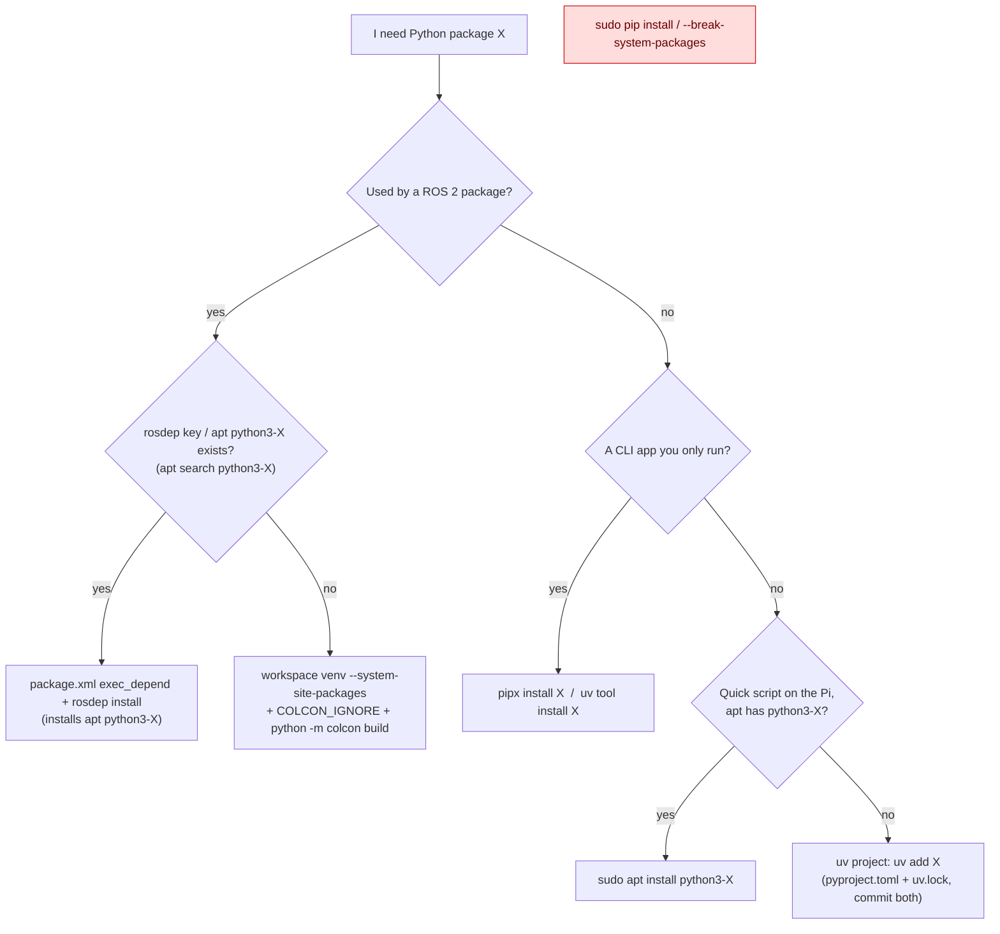

# FL.10 — Python environments on Ubuntu: apt, venv, uv and PEP 668

<!-- glance:start -->
<!-- generated by tools/build.py from curriculum/syllabus.yaml — edit the syllabus, not this block -->

| | |
|---|---|
| **Track** | Optional foundation |
| **Difficulty** | Beginner |
| **Time** | 45 min |
| **Hardware** | none |
| **Software** | python, uv |
| **Prerequisites** | [FL.07 Package management: apt, keys and repositories](FL.07-package-management.md) |
| **Version-sensitive** | yes — see [curriculum/versions.yaml](../../curriculum/versions.yaml) |
| **Skip if** | You never pip install into system Python. |

<!-- glance:end -->

## What you will learn

- Explain why `pip install` fails on Ubuntu 24.04 with `externally-managed-environment` (PEP 668), and why that protects your robot.
- Pick the right source for a Python dependency: apt `python3-*`, rosdep, a venv, `uv`, or pipx.
- Create and use venvs (including `--system-site-packages` for ROS 2), and a `uv` project with a lockfile.
- Make a ROS 2 Python node use a pip-only library, and verify which interpreter `ros2 run` actually uses.
- Diagnose "works in my terminal, `ModuleNotFoundError` under `ros2 run`" in a few commands.

## Why it matters

The course's Python code runs in three different worlds: plain Python tools and tests in `labs/`
([03.02 Project layout, environments and version pinning](../../03-robot-software/03.02-environments-and-pinning.md)),
ROS 2 Jazzy nodes that must use the **system** Python 3.12 because `rclpy` is compiled against it
([04.04](../../04-ros2/04.04-topics-publishers-subscribers.md)), and scripts on the Pi that talk to hardware. Mixing them up produces
the most frustrating class of bugs: a package installed "somewhere" that the node can't import, a `sudo pip install` that breaks an
apt-installed tool, or a laptop and a Pi with different library versions. This lesson gives you a clear rule for each world.

<!-- prereqs:start -->
## Prerequisites

You need these first:

- [FL.07 Package management: apt, keys and repositories](FL.07-package-management.md)

### Optional prerequisite links

None.

Check your readiness: `python course.py why FL.10`
<!-- prereqs:end -->

## Concept

### Two package managers want the same directory

On Windows, Python is an app you install per user, and nothing else in the OS depends on it. On Ubuntu, **Python is part of the
operating system**: apt tools, cloud-init, netplan, ROS 2 and dozens of packages run on `/usr/bin/python3` and import libraries apt
installed in `/usr/lib/python3/dist-packages`. If `pip` overwrote one of those libraries with a different version, it could break
system tools in ways apt can't detect or repair.

**PEP 668** settles this. A distribution marks its Python as *externally managed* by shipping a file named `EXTERNALLY-MANAGED` next
to the standard library. pip then refuses to install into it, even with `--user`, and tells you the alternatives. Ubuntu 24.04 ships
that marker. It's the same idea as not `xcopy`-ing DLLs into `C:\Windows\System32` next to what Windows Update manages.

### Where each dependency should come from

| Situation | Use | Why |
|---|---|---|
| A ROS 2 package needs a common library (numpy, pyserial, yaml, opencv) | **rosdep key in `package.xml`** → installs the apt package | reproducible on every machine, same versions as the ROS binaries were tested with |
| A quick script on the Pi needs pyserial | **apt**: `sudo apt install python3-serial` | system-managed, security updates, no environment to activate |
| A ROS 2 node needs a library that only exists on PyPI | **venv with `--system-site-packages`** in the workspace | keeps `rclpy` + apt libs visible, adds pip packages on top |
| A standalone tool/library/test suite (non-ROS), e.g. `labs/python` | **uv project** (`pyproject.toml` + `uv.lock`) or plain venv | isolated, fast, pinned, like a `.csproj` + `packages.lock.json` |
| A Python *command-line app* (e.g. a linter) you just want to run | **pipx** or `uv tool install` | each app gets its own hidden venv |
| "Just make pip work" | ~~`sudo pip`~~, ~~`--break-system-packages`~~ | can break the OS Python and ROS tooling |

> [!TIP]
> **Ask your teacher:** "Map apt dist-packages, a venv, uv.lock and rosdep onto NuGet concepts: global packages folder, project-local packages, lock files and package references."

## Technical explanation

> [!IMPORTANT]
> **Version-sensitive** (verified 2026-09 against Ubuntu 24.04 / Python 3.12.3 / ROS 2 Jazzy / uv 0.12.15).
> Before following these steps, check the current docs: https://docs.ros.org/en/jazzy/How-To-Guides/Using-Python-Packages.html and https://docs.astral.sh/uv/
> AI teacher: verify against current documentation before giving instructions.

### Level 1 — The system Python

Verified on Ubuntu 24.04:

```text
$ python3 --version
Python 3.12.3
$ readlink -f $(which python3)
/usr/bin/python3.12
$ python --version
python: command not found            # install python-is-python3 if you want the name "python"
$ ls /usr/lib/python3.12/EXTERNALLY-MANAGED
/usr/lib/python3.12/EXTERNALLY-MANAGED
```

What pip says, in full (both with and without `--user`):

```text
$ pip install pyserial
error: externally-managed-environment

× This environment is externally managed
╰─> To install Python packages system-wide, try apt install
    python3-xyz, where xyz is the package you are trying to
    install.

    If you wish to install a non-Debian-packaged Python package,
    create a virtual environment using python3 -m venv path/to/venv.
    Then use path/to/venv/bin/python and path/to/venv/bin/pip. Make
    sure you have python3-full installed.

    If you wish to install a non-Debian packaged Python application,
    it may be easiest to use pipx install xyz, which will manage a
    virtual environment for you. Make sure you have pipx installed.

    See /usr/share/doc/python3.12/README.venv for more information.

note: If you believe this is a mistake, please contact your Python installation or OS distribution provider. You can override this, at the risk of breaking your Python installation or OS, by passing --break-system-packages.
hint: See PEP 668 for the detailed specification.
```

Read it as a menu: apt, venv, or pipx. The apt naming rule is `python3-<name>`, where `<name>` is usually the *import* name or PyPI name:
`python3-serial` (pyserial), `python3-numpy`, `python3-yaml` (PyYAML), `python3-opencv`, `python3-pytest`. On Ubuntu 24.04 these are fixed at
the release's versions, e.g. `python3-numpy` = **1.26.4** and `python3-serial` = **3.5** (verified 2026-09). ROS 2 Jazzy was built and tested
against those.

### Level 2 — venv

```bash
sudo apt install python3-venv          # needed once; without it: "ensurepip is not available … apt install python3.12-venv"
python3 -m venv .venv                  # create
source .venv/bin/activate              # activate: prepends .venv/bin to PATH, prompt shows (.venv)
which python pip                       # /home/you/karmel_tools/.venv/bin/python, …/.venv/bin/pip
pip install pyserial==3.5              # allowed: it's not the system Python
python -c "import sys; print(sys.prefix, sys.base_prefix)"   # /home/you/karmel_tools/.venv /usr
deactivate
```

A venv is a directory with symlinks to the system interpreter plus its own `site-packages`. It isn't a separate Python installation, so it
is still Python 3.12.3. Activation only changes `PATH` (and the prompt). You can skip activation and call `.venv/bin/python` directly, which
is what systemd services should do ([FL.06](FL.06-processes-systemd.md)).

**Isolation vs visibility.** A normal venv hides the system packages: `import numpy` inside it fails with `ModuleNotFoundError` even though
`python3-numpy` is installed. With `python3 -m venv --system-site-packages .venv`, the venv sees `/usr/lib/python3/dist-packages` **and**
lets you pip-install extra packages into the venv, and those take precedence. Verified: inside such a venv, `numpy.__file__` is
`/usr/lib/python3/dist-packages/numpy/__init__.py`.

### Level 3 — uv: fast, locked projects

`uv` (Astral) replaces `pip`, `venv`, `pip-tools` and `pipx` with one fast tool, and it writes a **lockfile**. Install it as the uv docs
describe (`curl -LsSf https://astral.sh/uv/install.sh | sh`, which installs into `~/.local/bin`). For the course's non-ROS Python:

```bash
uv init --app karmel-tools        # creates pyproject.toml, .python-version (3.12), README.md, src/, .gitignore, git repo
cd karmel-tools
uv add pyserial                   # resolves, writes uv.lock, creates .venv, installs
uv run python -c "import serial, sys; print(serial.__version__, sys.executable)"
# 3.5 /root/karmel-tools/.venv/bin/python
uv sync                           # on another machine (the Pi): recreate .venv exactly from uv.lock
```

Commit `pyproject.toml`, `uv.lock` and `.python-version`, and never commit `.venv/` ([FL.11](FL.11-git-for-robotics.md)). The lockfile pins every
transitive version with hashes, so the laptop and the Pi get identical environments. [03.02](../../03-robot-software/03.02-environments-and-pinning.md)
builds the course's reproducible environment on this.

uv can also create a venv for ROS work on the system interpreter:
`uv venv --python /usr/bin/python3 --system-site-packages .venv` prints
`Using CPython 3.12.3 interpreter at: /usr/bin/python3` and `Creating virtual environment at: .venv`.

### Level 4 — ROS 2 nodes that need a pip-only package

The Jazzy guide "Using Python Packages with ROS 2" lists, in order: (1) a **rosdep key** in `package.xml`
(`<exec_depend>python3-serial</exec_depend>`, then `rosdep install`), (2) the system package manager (`sudo apt install python3-serial`),
(3) a virtual environment. It also warns that the interpreter must match the one the binaries were built with, so a venv must use the
system interpreter and conda "is very likely" incompatible. The same page still shows global and `--user` pip installs as options. On
Ubuntu 24.04, PEP 668 refuses both, which is one reason the course skips that option.

A side note you'll meet: rosdep itself sometimes installs `pip` keys. Its documentation suggests `PIP_BREAK_SYSTEM_PACKAGES=1` for that case
on PEP 668 systems. The course avoids pip keys in its packages so you never need that.

**The pattern that works (verified 2026-09-17 in `ros:jazzy-ros-base`)**, using a PyPI-only package, `simple-pid`, as the example:

```bash
cd ~/karmel_ws
source /opt/ros/jazzy/setup.bash
python3 -m venv --system-site-packages .venv   # or: uv venv --python /usr/bin/python3 --system-site-packages .venv
touch .venv/COLCON_IGNORE                      # colcon must not treat the venv as packages to build
source .venv/bin/activate
pip install simple-pid                         # or: uv pip install simple-pid
python -m colcon build --symlink-install       # run colcon WITH THE VENV'S PYTHON
source install/setup.bash
ros2 run karmel_pid_demo pid_demo
```

Why `python -m colcon` and not just `colcon`? The apt-installed `colcon` script starts with `#!/usr/bin/python3`, and when it builds an
`ament_python` package it writes **that** interpreter into the generated executable. The experiment:

| Build command | First line of `install/…/lib/karmel_pid_demo/pid_demo` | `ros2 run` result |
|---|---|---|
| `colcon build` (venv active) | `#!/usr/bin/python3` | `ModuleNotFoundError: No module named 'simple_pid'` and `[ros2run]: Process exited with failure 1` |
| `python -m colcon build` (venv active) | `#!/root/ws/.venv/bin/python` | `[INFO] [...] [pid_demo]: python=/root/ws/.venv/bin/python pid(0.0)=1.00` |

Note: the ROS docs' own venv recipe (create venv, `COLCON_IGNORE`, pip install, source ROS, `colcon build`) relies on the venv's packages being
on `PYTHONPATH` when you *run*. The shebang check above shows what you actually get, and `python -m colcon` makes it explicit. Always verify
with `head -1` on the installed executable. For deployment, prefer turning dependencies into rosdep/apt keys when they exist.

## Diagram



## Code

`pyenv_doctor.py` answers "which Python is this, where does each import come from, and is this environment sane for ROS 2?". Run it with
the interpreter you want to inspect: `python3 pyenv_doctor.py`, `.venv/bin/python pyenv_doctor.py`, or put the same checks at the top of a
node while debugging.

`~/bin/pyenv_doctor.py`:

```python
#!/usr/bin/env python3
"""pyenv_doctor.py — which Python am I, where do packages come from, and is this safe for ROS 2?"""
from __future__ import annotations

import importlib.util
import os
import sys
import sysconfig
from pathlib import Path


def origin(module: str) -> str:
    spec = importlib.util.find_spec(module)
    if spec is None or spec.origin is None:
        return "not importable"
    path = spec.origin
    if path.startswith("/opt/ros/"):
        kind = "ROS (/opt/ros)"
    elif "/dist-packages/" in path:
        kind = "apt (dist-packages)"
    elif sys.prefix != sys.base_prefix and path.startswith(sys.prefix):
        kind = "this venv"
    else:
        kind = "other"
    return f"{kind}: {path}"


def main() -> int:
    in_venv = sys.prefix != sys.base_prefix
    marker = Path(sysconfig.get_path("stdlib")) / "EXTERNALLY-MANAGED"
    cfg = Path(sys.prefix) / "pyvenv.cfg"
    system_site = "n/a"
    if in_venv and cfg.exists():
        for line in cfg.read_text().splitlines():
            if line.startswith("include-system-site-packages"):
                system_site = line.split("=", 1)[1].strip()

    print(f"interpreter        : {sys.executable} (Python {sys.version.split()[0]})")
    print(f"virtual env        : {'yes, ' + sys.prefix if in_venv else 'no (system Python)'}")
    print(f"system site-packages visible: {system_site if in_venv else 'yes'}")
    print(f"PEP 668 marker     : {'present' if marker.exists() else 'absent'} ({marker})")
    print(f"ROS_DISTRO         : {os.environ.get('ROS_DISTRO', 'unset (source /opt/ros/jazzy/setup.bash)')}")
    for module in ("rclpy", "numpy", "serial"):
        print(f"{module:<19}: {origin(module)}")

    if in_venv and system_site != "true" and os.environ.get("ROS_DISTRO"):
        print("WARNING: venv without --system-site-packages: ROS apt Python deps (python3-*) are invisible here")
        return 1
    if not in_venv and marker.exists():
        print("NOTE: system Python is externally managed: use apt (python3-xyz) or a venv, never sudo pip")
    return 0


if __name__ == "__main__":
    sys.exit(main())
```

The marker line reports the base interpreter's `EXTERNALLY-MANAGED` file even inside a venv. pip ignores it there, because PEP 668 only
applies outside virtual environments.

## Exercise

All exercises run in Docker if you don't have Ubuntu yet: `docker run --rm -it -v "${PWD}:/s" ubuntu:24.04 bash` (E1–E2) and
`docker run --rm -it -v "${PWD}:/s" ros:jazzy-ros-base bash` (E3–E4). Inside a container you are root, so drop `sudo`.
To see pip's refusal as a normal user, `useradd -m robo && su - robo` first.

### Exercise FL.10-E1 — Meet PEP 668 `[predict]`

Hardware: none. `apt update && apt install -y python3 python3-pip`, then **predict** before each command:

1. `python3 --version`, `python --version`
2. `pip install pyserial` and `pip install --user pyserial` (as a normal user)
3. `python3 -m venv .venv` (before installing `python3-venv`)
4. `apt install -y python3-venv python3-numpy`, `python3 -m venv .venv && .venv/bin/python -c "import numpy"`

### Exercise FL.10-E2 — venv and uv side by side `[coding]`

Hardware: none.

1. In `~/karmel_tools`: create a venv, `pip install pyserial==3.5`, `pip list`, `pip freeze > requirements.txt`, `cat requirements.txt`.
2. Create `.venv-sys` with `--system-site-packages`, and print `numpy.__version__` and `numpy.__file__` from it.
3. Install uv (`.venv/bin/pip install uv` is fine in a container), then `uv init --app karmel-tools && cd karmel-tools && uv add pyserial`,
   `ls`, and `uv run python -c "import serial, sys; print(serial.__version__, sys.executable)"`.

### Exercise FL.10-E3 — Which Python does the node really use? `[debugging]`

Hardware: none. In `ros:jazzy-ros-base` (+ `apt update && apt install -y python3-venv`):

1. Create the workspace venv as in Level 4 and install `simple-pid`.
2. `ros2 pkg create --build-type ament_python --node-name pid_demo karmel_pid_demo` in `src/` and replace `pid_demo.py` with:

```python
import sys

import rclpy
from simple_pid import PID


def main() -> None:
    rclpy.init()
    node = rclpy.create_node("pid_demo")
    pid = PID(1.0, 0.1, 0.0, setpoint=1.0)
    node.get_logger().info(f"python={sys.executable} pid(0.0)={pid(0.0):.2f}")
    node.destroy_node()
    rclpy.shutdown()
```

3. With the venv active, run `colcon build`, then `head -1 install/karmel_pid_demo/lib/karmel_pid_demo/pid_demo`, then `source install/setup.bash && ros2 run karmel_pid_demo pid_demo`.
4. `rm -rf build install log`, then `python -m colcon build` with the venv active, and repeat the `head -1` and `ros2 run` checks, **after `deactivate`**.

### Exercise FL.10-E4 — Environment doctor `[coding]`

Hardware: none, optionally `robot-base` (run it on the Pi too).

In `ros:jazzy-ros-base` with `python3-venv` and `python3-numpy` installed, run `pyenv_doctor.py` three ways: with `python3`, with a
`--system-site-packages` venv's python, and with an isolated venv's python. Compare the `numpy` line and the exit codes.

## Expected result

**FL.10-E1:** (1) `Python 3.12.3`; `python: command not found`. (2) Both print the `error: externally-managed-environment` block from Level 1.
(3) `The virtual environment was not created successfully because ensurepip is not available. On Debian/Ubuntu systems, you need to install the python3-venv package using the following command.`
followed by `apt install python3.12-venv`. (4) `ModuleNotFoundError: No module named 'numpy'`: a normal venv doesn't see apt packages.

**FL.10-E2:** (1) `pip list` shows `pip 24.0` and `pyserial 3.5`, and `requirements.txt` contains `pyserial==3.5`. (2)
`venv sees numpy 1.26.4 /usr/lib/python3/dist-packages/numpy/__init__.py`. (3) `uv init` prints ``Initialized project `karmel-tools` at `…/karmel-tools` ``.
`ls` shows `README.md  pyproject.toml  src  uv.lock` (plus hidden `.python-version` containing `3.12`, `.venv`, `.git`, `.gitignore`). `uv run`
prints `3.5 /…/karmel-tools/.venv/bin/python`. The `pyproject.toml` has `requires-python = ">=3.12"` and `dependencies = ["pyserial>=3.5"]`.

**FL.10-E3:** Step 3: `#!/usr/bin/python3`, and `ros2 run` fails with a traceback ending in
`ModuleNotFoundError: No module named 'simple_pid'` and `[ros2run]: Process exited with failure 1`. Step 4: `#!/root/ws/.venv/bin/python`
(your path), and even after `deactivate`, `ros2 run` logs
`[INFO] [<timestamp>] [pid_demo]: python=/root/ws/.venv/bin/python pid(0.0)=1.00`. The PID output is $K_p \cdot e = 1.0 \cdot (1.0 - 0.0) = 1.0$,
plus an integral term of $K_i \cdot e \cdot \Delta t$ that is negligible on the first call, because only microseconds have passed since the controller was created.

**FL.10-E4:**

```text
interpreter        : /usr/bin/python3 (Python 3.12.3)
virtual env        : no (system Python)
...
rclpy              : ROS (/opt/ros): /opt/ros/jazzy/lib/python3.12/site-packages/rclpy/__init__.py
numpy              : apt (dist-packages): /usr/lib/python3/dist-packages/numpy/__init__.py
serial             : not importable
NOTE: system Python is externally managed: use apt (python3-xyz) or a venv, never sudo pip
```

exit 0. The `--system-site-packages` venv shows the same `rclpy` and `numpy` origins with `system site-packages visible: true`, exit 0.
The isolated venv shows `numpy : not importable` and
`WARNING: venv without --system-site-packages: ROS apt Python deps (python3-*) are invisible here`, exit 1. `rclpy` is still importable there
only because sourcing ROS puts `/opt/ros/jazzy/lib/python3.12/site-packages` on `PYTHONPATH`, and its apt-installed dependencies are not.

## Troubleshooting

### Symptom: `ModuleNotFoundError` under `ros2 run`, but `python -c "import X"` works in your terminal

1. `head -1 install/<pkg>/lib/<pkg>/<executable>`: which interpreter will run the node?
2. Is X installed for **that** interpreter? `<interpreter> -c "import X; print(X.__file__)"`.
3. If the shebang is `/usr/bin/python3` and X lives in a venv: rebuild with `python -m colcon build` inside the activated venv, or install X via apt/rosdep.
4. Did you `source install/setup.bash` after building? Is an older overlay shadowing it? `ros2 pkg prefix <pkg>`.

### Symptom: `error: externally-managed-environment`

You're running the system pip. Decide with the Concept table: apt `python3-X`, rosdep, venv, or uv. If a venv is active and you still see it,
check `which pip`: you may be calling `/usr/bin/pip` via `sudo` (which drops your `PATH`) or a hard-coded path.

### Symptom: something apt-installed broke after a pip install

Look for packages pip put in system locations: `ls /usr/local/lib/python3.12/dist-packages` (pip's default target when forced), and
`pip list --path /usr/local/lib/python3.12/dist-packages`. Remove them with the same pip, `sudo pip uninstall --break-system-packages X`, which is the one
legitimate use of that flag, then `sudo apt install --reinstall python3-X`.

### Symptom: laptop and Pi behave differently with "the same" code

Compare `pip freeze` or `uv pip freeze` output from both, plus `python3 --version` and `dpkg -l 'python3-*' | awk '{print $2, $3}'`. Use `uv.lock` for
non-ROS code and identical ROS syncs ([FL.07](FL.07-package-management.md)) for apt packages.

## Common mistakes

- **`sudo pip install …`** or `--break-system-packages` to make an error go away.
- **Using conda for ROS 2 work**: ROS binaries need the system Python 3.12 and its apt libraries.
- **A venv without `--system-site-packages` for ROS nodes**: apt Python deps disappear.
- **Forgetting `COLCON_IGNORE` in a venv inside the workspace**: colcon scans thousands of site-packages files.
- **Committing `.venv/`** instead of `pyproject.toml` + `uv.lock` or `requirements.txt`.
- **Assuming activation is needed at runtime**: a service should call `.venv/bin/python` directly, since activation is only a `PATH` change.
- **Installing a newer numpy in a venv on top of ROS**: ROS C extensions like `cv_bridge` were built against 1.26.x. Newer major versions can break them.
- **Mixing `pip install` and `uv add` in the same uv project**: the lockfile no longer describes the environment.

## Knowledge check

1. What does the `EXTERNALLY-MANAGED` file do, and where is it on Ubuntu 24.04?
   <details><summary>Answer</summary>

   It tells pip (PEP 668) that this Python's packages are managed by the OS package manager, so pip refuses to install into it outside a
   virtual environment. On Ubuntu 24.04 it's `/usr/lib/python3.12/EXTERNALLY-MANAGED`.
   </details>

2. A ROS 2 node needs `pyserial`. List the course's preferred way and one acceptable alternative.
   <details><summary>Answer</summary>

   Preferred: `<exec_depend>python3-serial</exec_depend>` in `package.xml` and `rosdep install`, which installs the apt package. Acceptable:
   `sudo apt install python3-serial` directly. A venv is unnecessary because apt has it.
   </details>

3. Why does a ROS workspace venv need `--system-site-packages`?
   <details><summary>Answer</summary>

   So the venv still sees the apt-installed Python libraries (`python3-numpy`, `python3-yaml`, …) that ROS packages depend on. A plain venv
   hides `/usr/lib/python3/dist-packages`.
   </details>

4. `colcon build` with the venv active, and `ros2 run` says `No module named 'simple_pid'`. What does `head -1` on the installed executable show, and what's the fix?
   <details><summary>Answer</summary>

   `#!/usr/bin/python3`: the apt `colcon` runs on the system interpreter and writes it into the entry point. Rebuild with
   `python -m colcon build` from the activated venv (shebang becomes the venv's python), or provide the dependency via apt/rosdep.
   </details>

5. What do you commit from a uv project, and what does `uv sync` on the Pi do?
   <details><summary>Answer</summary>

   Commit `pyproject.toml`, `uv.lock` and `.python-version`, but not `.venv/`. `uv sync` creates or updates `.venv` so it exactly matches
   the lockfile, with the same versions and hashes as on the laptop.
   </details>

6. Your teammate says "just use conda for the robot". Give the two-sentence answer.
   <details><summary>Answer</summary>

   ROS 2 Jazzy's binaries are built against Ubuntu's system Python 3.12 and its apt libraries, and a conda interpreter is a different
   Python with different binary libraries, so `rclpy` and friends are likely incompatible. Use apt/rosdep plus a system-based venv instead.
   </details>

7. Is `pip install --user X` a workaround for PEP 668 on Ubuntu 24.04?
   <details><summary>Answer</summary>

   No, it's refused with the same `externally-managed-environment` error, because user site-packages are also visible to the system
   interpreter and can shadow OS libraries.
   </details>

## Practical challenge

Make one robot repository with **both** worlds, reproducible on a clean machine:

- `tools/` is a uv project (e.g. a serial log analyzer using `pyserial` and `numpy`) with `uv.lock` committed and a `pytest` test that `uv run pytest` passes.
- `ros2_ws/src/karmel_pid_demo` is an `ament_python` package whose runtime dependencies are all declared in `package.xml`. Use rosdep keys where
  they exist, and a documented venv for the one PyPI-only dependency.
- A `bootstrap.sh` that, on a fresh `ros:jazzy-ros-base` container, runs `rosdep install`, creates the workspace venv correctly, builds with the
  right interpreter, and runs both `uv run pytest` (in `tools/`) and `ros2 run karmel_pid_demo pid_demo`.

Acceptance criteria: `docker run --rm -v "${PWD}:/repo" ros:jazzy-ros-base bash /repo/bootstrap.sh` succeeds from scratch, with no `sudo pip`
and no `--break-system-packages` anywhere (`grep -r` proves it). `pyenv_doctor.py` exits 0 in both environments, and `head -1` of the installed
node shows the venv interpreter.

## You can skip this if…

You never pip install into system Python and you answer knowledge-check questions 3, 4 and 6 correctly without looking. Then:
`python course.py skip FL.10 --reason "I manage Python environments on Ubuntu"`.

## Go deeper

- https://peps.python.org/pep-0668/ — PEP 668 itself: the problem, the marker file, and the recommended behavior.
- https://packaging.python.org/en/latest/specifications/externally-managed-environments/ — the current packaging specification derived from PEP 668.
- https://docs.ros.org/en/jazzy/How-To-Guides/Using-Python-Packages.html — ROS 2's guidance on rosdep, apt, pip and virtual environments.
- https://docs.astral.sh/uv/ — uv documentation: projects, lockfiles, `uv venv`, `uv tool`.
- https://docs.python.org/3/library/venv.html — `venv` reference, including `--system-site-packages` and `pyvenv.cfg`.
- https://ubuntu.com/server/docs — Ubuntu Server docs, including how Ubuntu packages Python.

## Progress checkpoint

- [ ] I can explain PEP 668 and read pip's `externally-managed-environment` message as a menu of options.
- [ ] I choose apt/rosdep, venv, uv or pipx correctly for a given dependency.
- [ ] I can create a venv and a uv project with a lockfile, and reproduce it on another machine.
- [ ] I can make a ROS 2 node use a pip-only library and prove which interpreter runs it.

`python course.py complete FL.10` (exercises done) · `python course.py master FL.10` (challenge done) ·
`python course.py struggle FL.10 "what was hard"`.

Next: [FL.11 — Git for robotics: large files, bags and models](FL.11-git-for-robotics.md).
