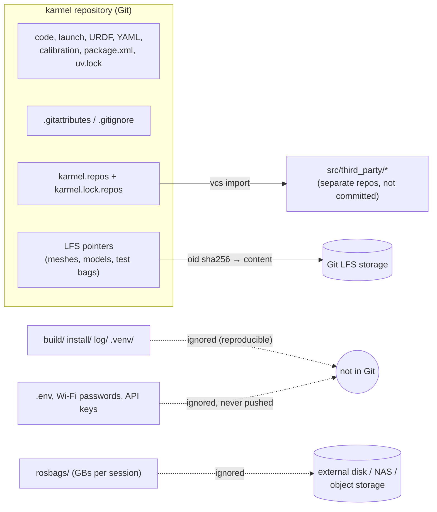

# FL.11 — Git for robotics: large files, bags and models

<!-- glance:start -->
<!-- generated by tools/build.py from curriculum/syllabus.yaml — edit the syllabus, not this block -->

| | |
|---|---|
| **Track** | Optional foundation |
| **Difficulty** | Beginner |
| **Time** | 35 min |
| **Hardware** | none |
| **Software** | git |
| **Prerequisites** | [FL.03 The shell for Windows developers](FL.03-shell-basics.md) |
| **Skip if** | You know what not to commit and how to handle large binaries. |

<!-- glance:end -->

## What you will learn

- Decide what belongs in a robot repository and what doesn't: colcon outputs, venvs, rosbags, models, meshes, calibration, secrets.
- Write a robotics `.gitignore` and `.gitattributes`, and prove with `git check-ignore` which rule matches.
- Put large binaries (meshes, ONNX models, selected bags) in Git LFS, and recognize an LFS pointer file.
- Stop oversized files at commit time with a hook.
- Compose a multi-repository ROS 2 workspace with `vcstool` `.repos` files, pinned to exact commits.

## Why it matters

You know Git well. What's different in robotics is the **data**. A single ROS 2 recording from the webcam
([07.08](../../07-sensors/07.08-rgb-cameras.md)) grows by over a gigabyte per minute, a trained detector is tens of megabytes, and the
URDF meshes for the arm are binary STL files. A robot workspace also pulls in third-party driver repositories, and `colcon build` creates
`build/`, `install/` and `log/` trees with thousands of files. Commit these by accident and the repository becomes unusable to clone on
the Pi. [03.11 Git workflow, CI and reproducibility](../../03-robot-software/03.11-ci-and-reproducibility.md) builds CI on top of the
conventions set here, and the SLAM and learning modules produce exactly the files this lesson teaches you to manage.

<!-- prereqs:start -->
## Prerequisites

You need these first:

- [FL.03 The shell for Windows developers](FL.03-shell-basics.md)

### Optional prerequisite links

None.

Check your readiness: `python course.py why FL.11`
<!-- prereqs:end -->

## Concept

### Three kinds of files in a robot repo

1. **Source of truth, small, text**: code, launch files, URDF/xacro, YAML parameters, **calibration results** (camera intrinsics, wheel
   radius, [03.06](../../03-robot-software/03.06-configuration-and-calibration.md)), `package.xml`, `uv.lock`. Commit normally. Calibration
   is data *about this robot*, and losing it costs an afternoon of re-measuring.
2. **Large binaries you want versioned**: meshes (`.stl`, `.dae`), trained models (`.onnx`, `.pt`), a few reference bags for regression
   tests, occupancy maps (`.pgm`). Use **Git LFS**, where Git stores a small pointer and the file content lives in LFS storage.
3. **Generated or bulky and reproducible, or secret**: `build/ install/ log/`, `.venv/`, `__pycache__/`, everyday recordings, Docker
   images, `.env` with API keys, Wi-Fi passwords. **Never commit.** Ignore them, and store recordings elsewhere (external disk, NAS,
   object storage) with a note of where.

For a .NET developer: category 3 is `bin/` and `obj/` plus `appsettings.Development.json` secrets. Category 2 is what you'd otherwise put in
a NuGet package or blob storage. The robotics difference is volume: sensor data dwarfs code.

### Why Git itself struggles with big binaries

Every version of every file is stored forever and cloned by everyone. A 30 MB model retrained 20 times adds 600 MB to every clone, including the
one on the Pi's SD card, even if you only need the latest. Binary files also don't diff or merge. Git LFS fixes the first problem:
clones download only the versions they check out. GitHub also **blocks** pushes containing a file over 100 MiB.

### Many repositories, one workspace

A ROS 2 workspace `src/` typically contains *your* packages plus third-party ones (a LiDAR driver, a fork of a controller). Instead of
submodules, the ROS ecosystem uses **vcstool** with a YAML `.repos` file: a list of repositories, URLs and versions. `vcs import` clones them all,
and `vcs export --exact` records the exact commits you tested with. It's the lockfile for source dependencies.

> [!TIP]
> **Ask your teacher:** "When should a robot project use Git LFS, DVC or plain object storage for rosbags? Give me the trade-offs for a solo developer and for a 10-person team."

## Technical explanation

### Level 1 — How big is robot data? (numbers first)

Raw data rate of a sensor stream:

$$
\text{rate} = \text{bytes per message} \times \text{messages per second}
$$

- **Webcam**, uncompressed `sensor_msgs/Image`, 640×480, RGB (3 bytes/pixel), 30 Hz:
  $640 \times 480 \times 3 = 921{,}600$ bytes/frame. $\times 30 = 27{,}648{,}000$ bytes/s $\approx 27.6$ MB/s, which is
  $\approx 1.66$ GB per minute and $\approx 16.6$ GB for a 10-minute session.
- **2D LiDAR**, 360 ranges + 360 intensities as float32 at 10 Hz: $\approx 10 \times (360 \cdot 4 \cdot 2 + 100) = 29{,}800$ bytes/s
  $\approx 1.8$ MB per minute.
- **IMU** at 100 Hz, about 130 bytes each: 13 kB/s.

So the camera is ~900× the LiDAR. Record compressed image topics, record only what you need (`ros2 bag record` with explicit topics), and
never put everyday bags in Git. `ros2 bag record` on Jazzy writes a directory with `metadata.yaml` and `<name>_0.mcap` (MCAP has been the
default storage format since Iron).

### Level 2 — `.gitignore` and `.gitattributes` for a ROS 2 repo

```gitignore
# colcon workspace outputs
build/
install/
log/
# Python
__pycache__/
*.pyc
.venv/
# recordings: keep them out of git (or in LFS on purpose, see .gitattributes)
rosbags/
*.db3
# secrets and machine-local settings
.env
*.local.yaml
```

Check which rule catches a path (verified on Ubuntu 24.04, Git 2.43):

```text
$ git check-ignore -v build/a rosbags/run1/run1_0.mcap .env
.gitignore:2:build/	build/a
.gitignore:10:rosbags/	rosbags/run1/run1_0.mcap
.gitignore:13:.env	.env
```

`.gitattributes` sets how files are *treated*:

```gitattributes
# Line endings: scripts must stay LF even when checked out on Windows (FL.03)
*.sh      text eol=lf
*.py      text eol=lf
# Large binaries in Git LFS
*.onnx    filter=lfs diff=lfs merge=lfs -text
*.mcap    filter=lfs diff=lfs merge=lfs -text
meshes/**/*.stl filter=lfs diff=lfs merge=lfs -text
```

Watch the ordering: `rosbags/` is ignored, but `*.mcap` is LFS-tracked. That way a deliberately chosen regression bag in `test/data/` can be
committed via LFS, while day-to-day recordings under `rosbags/` never are.

### Level 3 — Git LFS in practice

```bash
sudo apt install git-lfs           # Ubuntu 24.04: git-lfs 3.4.1
git lfs install                    # once per user: adds the LFS filters to ~/.gitconfig
git lfs track "*.mcap" "*.onnx" "meshes/**/*.stl"   # writes .gitattributes
git add .gitattributes
git add models/detector.onnx && git commit -m "detector v3"
git lfs ls-files                   # which files are in LFS
```

What Git actually stores for an LFS file is a **pointer**, verified with `git show HEAD:models/detector.onnx`:

```text
version https://git-lfs.github.com/spec/v1
oid sha256:e7b79896037007698c265570e753e29c51f158683e7d1a43a5a8223c788d8d91
size 3000000
```

The working tree has the real 2.9 MB file. The repository history has these three lines. On clone, LFS downloads the content for the checked-out
commit only. Useful variations:

- `GIT_LFS_SKIP_SMUDGE=1 git clone …`: clone pointers only (CI jobs or a Pi that doesn't need the models), then `git lfs pull --include="models/*"`.
- `git lfs migrate import --include="*.onnx" --everything`: move files **already committed** normally into LFS. It rewrites history, so coordinate
  with everyone and force-push.
- LFS storage and bandwidth are billed or limited per hosting plan. Check your provider's current quotas before committing gigabytes.

### Level 4 — Multi-repo workspaces with vcstool

`karmel.repos`:

```yaml
repositories:
  third_party/ros2_examples:
    type: git
    url: https://github.com/ros2/examples.git
    version: jazzy
```

```bash
sudo apt install python3-vcstool         # from the ROS apt repository (0.3.0 on noble)
mkdir -p src
vcs import --shallow src < karmel.repos  # clone every entry into src/<key>
vcs status src                           # git status in every repo
vcs pull src                             # update branches
vcs export --exact src > karmel.lock.repos   # same file format, but version = exact commit SHA
vcs diff src
```

Verified output of `vcs export --exact src` after importing the example:

```text
repositories:
  third_party/ros2_examples:
    type: git
    url: https://github.com/ros2/examples.git
    version: 07008852303f2a35a91c65d78046b274a35477ea
```

Commit both files: `karmel.repos` (what you *want*, branches) and `karmel.lock.repos` (what you *tested*, SHAs). On the Pi or in CI, run
`vcs import src < karmel.lock.repos` to get the exact same sources. The `src` directory must exist first, or vcs answers
`error: argument path: Path 'src' does not exist.` (On Ubuntu 24.04, vcs also prints a harmless `DeprecationWarning: pkg_resources is deprecated`.)

**vcstool vs submodules:** submodules pin SHAs inside the parent repo's history and need `git submodule update --init --recursive`. vcstool keeps
the list in a readable YAML file and is what ROS tooling and tutorials expect. Use it for `src/` and keep the third-party repos out of your own
repository (add `src/third_party/` to `.gitignore`).

## Diagram



## Code

A pre-commit hook that blocks big binaries unless they're tracked by LFS. It checks the **staged** blob size, handles spaces in file names,
and tells you the exact fix. Keep it in the repo (`tools/`) and link it into `.git/hooks`.

`tools/check-large-files.sh`:

```bash
#!/usr/bin/env bash
# check-large-files.sh — refuse to commit big binaries that are not tracked by Git LFS.
# Install as a hook:  ln -s ../../tools/check-large-files.sh .git/hooks/pre-commit
set -euo pipefail

limit_kb="${MAX_FILE_KB:-1024}"     # 1 MB default; code and configs are far smaller
status=0

# Staged files that were added, copied or modified (NUL-separated to survive spaces in names).
while IFS= read -r -d '' path; do
  size_kb=$(( $(git cat-file -s ":$path") / 1024 ))    # size of the staged blob
  if (( size_kb <= limit_kb )); then
    continue
  fi
  if [[ "$(git check-attr filter -- "$path" | awk '{print $NF}')" == "lfs" ]]; then
    continue                                            # staged blob is a small LFS pointer anyway
  fi
  echo "BLOCKED: $path is ${size_kb} KB (limit ${limit_kb} KB) and not tracked by Git LFS" >&2
  echo "         fix: git lfs track '*.${path##*.}' && git add .gitattributes && git add '$path'" >&2
  echo "         or:  add it to .gitignore if it is a recording/build output" >&2
  status=1
done < <(git diff --cached --name-only --diff-filter=ACM -z)

exit "$status"
```

The symlink target is relative to `.git/hooks/`, hence `../../tools/…` ([FL.04](FL.04-filesystem.md) on relative symlinks). For a team, run the
same script in CI, because local hooks aren't cloned.

## Exercise

Run these in `docker run --rm -it -v "${PWD}:/s" ubuntu:24.04 bash` after
`apt update && apt install -y git git-lfs` and a `git config --global user.name/user.email`. Use `ros:jazzy-ros-base` for E4.

### Exercise FL.11-E1 — Data budget `[numerical]`

Hardware: none.

1. Compute the raw data rate for a 1280×720 RGB camera at 15 Hz in MB/s and GB/minute.
2. A depth camera publishes 640×480 depth images as 16-bit (2 bytes/pixel) at 30 Hz, *plus* the 640×480 RGB stream at 30 Hz. How long until a 64 GB SD card is full?
3. A 25 MB ONNX model is retrained and committed weekly for a year *without* LFS. How much does it add to every clone?

### Exercise FL.11-E2 — Ignore and track `[coding]`

Hardware: none.

1. `git init karmel && cd karmel && git lfs install`.
2. Create the `.gitignore` from Level 2 and `git lfs track "*.mcap" "*.onnx" "meshes/**/*.stl"`, then `cat .gitattributes`.
3. Create `build/a install/b log/c src/karmel_bringup/__init__.py rosbags/run1/run1_0.mcap .env` (use `mkdir -p` and `touch`),
   a 3 MB `models/detector.onnx` (`head -c 3000000 /dev/urandom > models/detector.onnx`) and a 200 kB `meshes/base/chassis.stl`.
4. `git check-ignore -v build/a rosbags/run1/run1_0.mcap .env`, `git add . && git status --short`.
5. Commit, then `git lfs ls-files` and `git show HEAD:models/detector.onnx`.

### Exercise FL.11-E3 — The hook catches you `[debugging]`

Hardware: none. In a fresh repo, install `check-large-files.sh` as the pre-commit hook. **Predict** each result:

1. Commit a 3 MB `models/detector.onnx` without LFS.
2. `git lfs track "*.onnx"`, add `.gitattributes`, re-add the model, and commit.
3. Commit a 2 MB file named `models/my map.pgm` (with a space).

### Exercise FL.11-E4 — A pinned multi-repo workspace `[coding]`

Hardware: none. In `ros:jazzy-ros-base` (`apt update && apt install -y python3-vcstool`):

1. Create `~/ws/karmel.repos` as in Level 4 and `mkdir -p ~/ws/src`.
2. `vcs import --shallow src < karmel.repos`, then `vcs status src`.
3. `vcs export --exact src`.
4. Change a file in the imported repo, then run `vcs status src` and `vcs diff src | head -8`.

## Expected result

**FL.11-E1:** (1) $1280 \times 720 \times 3 \times 15 = 41{,}472{,}000$ B/s ≈ 41.5 MB/s ≈ 2.49 GB/min. (2) Depth $640 \cdot 480 \cdot 2 \cdot 30 = 18.4$ MB/s,
plus RGB 27.6 MB/s, totals 46.1 MB/s. $64{,}000 / 46.1 \approx 1{,}388$ s ≈ **23 minutes** (less in practice, because the OS and ROS already use part of the card).
(3) $52 \times 25 = 1{,}300$ MB ≈ 1.3 GB added to every clone forever, even though only the latest model is used. With LFS, a clone downloads 25 MB.

**FL.11-E2:** `.gitattributes`:

```text
*.mcap filter=lfs diff=lfs merge=lfs -text
*.onnx filter=lfs diff=lfs merge=lfs -text
meshes/**/*.stl filter=lfs diff=lfs merge=lfs -text
```

(line order may differ). `check-ignore` prints the three `.gitignore:<line>:<pattern>` lines from Level 2. `git status --short` lists only

```text
A  .gitattributes
A  .gitignore
A  meshes/base/chassis.stl
A  models/detector.onnx
A  src/karmel_bringup/__init__.py
```

(no build, install, log, rosbags or `.env`). `git lfs ls-files` shows two lines, `<10-hex-digits> * meshes/base/chassis.stl` and `… * models/detector.onnx`.
`git show` prints the three-line pointer (`version https://git-lfs.github.com/spec/v1`, `oid sha256:…`, `size 3000000`).

**FL.11-E3:** (1) blocked, exit 1:

```text
BLOCKED: models/detector.onnx is 2929 KB (limit 1024 KB) and not tracked by Git LFS
         fix: git lfs track '*.onnx' && git add .gitattributes && git add 'models/detector.onnx'
         or:  add it to .gitignore if it is a recording/build output
```

(2) the commit succeeds, and `git lfs ls-files` lists `models/detector.onnx`. (3) blocked:
`BLOCKED: models/my map.pgm is 1953 KB (limit 1024 KB) and not tracked by Git LFS` with a `git lfs track '*.pgm'` suggestion. The space in the name
is handled correctly.

**FL.11-E4:** Import prints `=== src/third_party/ros2_examples (git) ===` and `Cloning into '.'...`. Status prints `On branch jazzy`,
`Your branch is up to date with 'origin/jazzy'.` and `nothing to commit, working tree clean`. Export prints the `.repos` YAML with
`version:` set to a 40-hex-digit SHA (it changes as the branch moves). After editing, status shows `modified:   <file>` and diff starts with
`=== src/third_party/ros2_examples (git) ===` followed by a normal `diff --git` header.

## Troubleshooting

### Symptom: `remote: error: File … is 312.00 MB; this exceeds GitHub's file size limit of 100.00 MB`

The file is in a local commit, so adding it to `.gitignore` now isn't enough.

1. Unpushed and in the last commit: `git rm --cached <file>`, add it to `.gitignore`, `git commit --amend`.
2. Deeper in unpushed history: `git lfs migrate import --include="<pattern>"` (rewrites local history, then push), or an interactive rebase that drops it.
3. Already pushed to a shared branch: coordinate before rewriting. It may be simpler to keep the history and move the file to LFS going forward.

### Symptom: after cloning, models are 130-byte text files and loading fails

You have LFS **pointers**, not content. `git lfs install` (once per user), then `git lfs pull`. In Docker/CI make sure `git-lfs` is installed
*before* cloning, or run `git lfs pull` after.

### Symptom: `git status` shows thousands of files after `colcon build`

`.gitignore` is missing or in the wrong directory (it must be at the repo root, or patterns need the right path). Test with `git check-ignore -v build/x`.

### Symptom: `vcs import` fails or does nothing

1. `Path 'src' does not exist`: `mkdir -p src` first.
2. `Authentication failed` for a private repo: use an SSH URL (`git@github.com:…`) and your SSH key ([FL.08](FL.08-ssh-remote-dev.md)).
3. Existing directory: vcs won't overwrite local changes. Use `--skip-existing` or `--force` deliberately.

## Common mistakes

- **Committing `build/`, `install/`, `log/` or `.venv/`**: huge, machine-specific, reproducible anyway.
- **Committing everyday rosbags**, even via LFS: that's storage abuse. Keep a few curated test bags, and store the rest outside Git with a README index.
- **Not committing calibration YAML** because "it's data": it's the robot's configuration.
- **Tracking with LFS *after* the first commit** and assuming history is fixed: `track` only affects new commits (use `migrate`).
- **Secrets in launch files or `netplan` YAML** committed to a public repo. Use `.env`/local files and ignore them. Rotate anything that leaked.
- **Pinning third-party repos to branches only**: the workspace changes under you. Also commit `vcs export --exact` output.
- **CRLF in shell scripts** from Windows checkouts: add `*.sh text eol=lf`.

## Knowledge check

1. Put each in "commit", "LFS" or "ignore": `install/`, `camera_calibration.yaml`, `chassis.stl`, a 12 GB bag from last night, `.env` with an OpenAI key, `detector.onnx`, `uv.lock`.
   <details><summary>Answer</summary>

   Commit: `camera_calibration.yaml`, `uv.lock`. LFS: `chassis.stl`, `detector.onnx`. Ignore: `install/`, the 12 GB bag (store it outside Git),
   `.env` (never commit secrets).
   </details>

2. What does Git store in history for a file tracked by LFS?
   <details><summary>Answer</summary>

   A small pointer text file with the LFS spec version, the SHA-256 `oid` of the content and its `size`. The content lives in LFS storage and is
   downloaded for checked-out versions.
   </details>

3. Compute the raw data rate of a 320×240 RGB image stream at 30 Hz. Would 10 minutes fit in a 1 GB budget?
   <details><summary>Answer</summary>

   $320 \cdot 240 \cdot 3 \cdot 30 = 6{,}912{,}000$ B/s ≈ 6.9 MB/s, so 10 min ≈ 4.1 GB. No, it doesn't fit in 1 GB. Record compressed images or a lower rate.
   </details>

4. You added `*.onnx` to LFS tracking today, but `detector.onnx` was committed normally last month. Is the repository fixed?
   <details><summary>Answer</summary>

   No. Old commits still contain the full blob, and every clone downloads it. Use `git lfs migrate import --include="*.onnx"` to rewrite history
   (coordinate with collaborators), or accept the history as is.
   </details>

5. Why commit both `karmel.repos` and `karmel.lock.repos`?
   <details><summary>Answer</summary>

   `karmel.repos` expresses intent (branches to follow). The `--exact` export pins the exact commit SHAs you tested, so the Pi and CI can reproduce
   the same sources. It's the same idea as `pyproject.toml` + `uv.lock`.
   </details>

6. A teammate's clone crashes on loading `detector.onnx` with "invalid protobuf", and the file is 133 bytes. Diagnose.
   <details><summary>Answer</summary>

   They have the LFS pointer, not the model: Git LFS wasn't installed/initialized when they cloned. Run `git lfs install && git lfs pull`.
   </details>

## Practical challenge

Turn your robot project into a clean, reproducible repository:

- Root `.gitignore` and `.gitattributes` covering colcon outputs, Python, recordings, secrets, LF endings for scripts, and LFS for meshes, models and
  curated test bags.
- `tools/check-large-files.sh` installed as a pre-commit hook **and** run in CI on every push (any CI provider, or a local `act`/Docker run).
- `karmel.repos` + `karmel.lock.repos` for at least one third-party package, with `src/third_party/` ignored.
- `test/data/README.md` listing each LFS test bag: what it contains, duration, topics, size, and which test uses it. Plus a `docs/recordings.md`
  that says where non-Git recordings live.

Acceptance criteria: a fresh `git clone` + `git lfs pull` + `vcs import src < karmel.lock.repos` + `colcon build` works in `ros:jazzy-ros-base`.
`git count-objects -vH` shows `size-pack` under 20 MB. Deliberately committing a 5 MB `.pgm` without LFS is blocked locally and fails in CI.

## You can skip this if…

You know what not to commit and how to handle large binaries, and you answer knowledge-check questions 1, 4 and 5 correctly without looking. Then:
`python course.py skip FL.11 --reason "I manage large files and multi-repo workspaces"`.

## Go deeper

- https://git-lfs.com/ — Git LFS home: install, tracking, and how pointers work.
- https://github.com/git-lfs/git-lfs/blob/main/docs/man/git-lfs-migrate.adoc — `git lfs migrate`, for moving existing history into LFS.
- https://docs.github.com/en/repositories/working-with-files/managing-large-files/about-large-files-on-github — GitHub's file size limits and LFS behavior.
- https://github.com/dirk-thomas/vcstool — vcstool: `.repos` format and all commands.
- https://git-scm.com/book/en/v2 — Pro Git. The chapters on attributes (`.gitattributes`) and hooks back this lesson.
- https://docs.ros.org/en/jazzy/Tutorials/Beginner-CLI-Tools/Recording-And-Playing-Back-Data/Recording-And-Playing-Back-Data.html — recording bags, so you know what you're managing.

## Progress checkpoint

- [ ] I can classify robot files into commit / LFS / ignore and justify it with data-rate numbers.
- [ ] I can write and verify a robotics `.gitignore` and `.gitattributes`.
- [ ] I can put large binaries into LFS, recognize pointer files, and fix a clone without LFS content.
- [ ] I can block oversized commits with a hook.
- [ ] I can build a pinned multi-repo workspace with vcstool.

`python course.py complete FL.11` (exercises done) · `python course.py master FL.11` (challenge done) ·
`python course.py struggle FL.11 "what was hard"`.

Next: [FL.12 — Docker for robotics: devices, GUIs and host networking](FL.12-docker-for-robotics.md).
