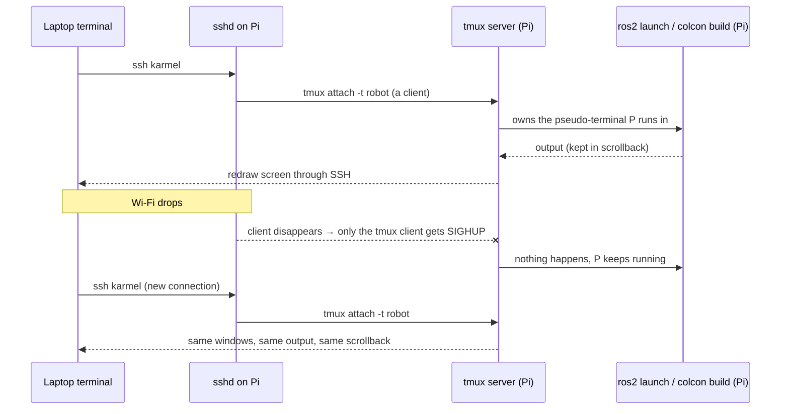

# FL.13 — Working headless: tmux and resilient remote sessions

<!-- glance:start -->
<!-- generated by tools/build.py from curriculum/syllabus.yaml — edit the syllabus, not this block -->

| | |
|---|---|
| **Track** | Optional foundation |
| **Difficulty** | Beginner |
| **Time** | 30 min |
| **Hardware** | none |
| **Software** | tmux |
| **Prerequisites** | [FL.08 SSH and remote development](FL.08-ssh-remote-dev.md) |
| **Version-sensitive** | yes — see [curriculum/versions.yaml](../../curriculum/versions.yaml) |
| **Skip if** | You use tmux. |

<!-- glance:end -->

## What you will learn

- Explain why a Wi-Fi drop kills the program you started over SSH (SIGHUP), and choose between tmux, `nohup` and a systemd service.
- Create, detach, list, re-attach and kill tmux sessions on the robot.
- Work with windows and panes (split, switch, zoom, scroll back) using the prefix key.
- Script a reproducible robot session layout (bringup, logs, monitor) that re-attaches instead of duplicating.
- Configure tmux for comfortable use (mouse, history, numbering) and avoid nested-tmux confusion.

## Why it matters

On the robot you start long-running, stateful things over SSH over Wi-Fi: a mapping session with slam_toolbox
([11.07 Mapping your room](../../11-slam/11.07-mapping-your-room.md)), a 20-minute `colcon build` on the Pi, a bag recording while you drive,
Nav2 on the real robot ([12.08](../../12-navigation/12.08-nav2-on-the-real-robot.md)). Wi-Fi *will* drop as the robot drives into the next room.
Without tmux, the SSH session dies and takes those processes with it: the map is lost, the build restarts, the recording is truncated.
With tmux the processes keep running on the Pi, and you re-attach from the laptop and find everything as you left it, including the scrollback.
[FL.06](FL.06-processes-systemd.md) covers the other half: things that must run *without anyone logged in* belong in systemd.

<!-- prereqs:start -->
## Prerequisites

You need these first:

- [FL.08 SSH and remote development](FL.08-ssh-remote-dev.md)

### Optional prerequisite links

None.

Check your readiness: `python course.py why FL.13`
<!-- prereqs:end -->

## Concept

### Why SSH sessions take your programs down

When you SSH into the Pi, `sshd` creates a pseudo-terminal and your shell runs attached to it. Everything you start in that shell is a child
attached to the same terminal. When the connection drops (Wi-Fi gone, laptop lid closed, `ServerAliveInterval` timeout), `sshd` closes
the terminal and the kernel/shell sends **SIGHUP** ("hang-up") to the processes attached to it. The default action for SIGHUP is to terminate.
The name dates from modems literally hanging up, and it still applies.

Verified in the course's SSH test setup: a `sleep 300` started through `ssh -tt karmel 'sleep 300'` was running, the SSH client was killed,
and a second later `pgrep sleep` on the robot no longer listed it. A `nohup sleep 301 &` started the same way survived.

### Three ways to survive a disconnect

| Tool | What it does | Use it for |
|---|---|---|
| `nohup cmd > log 2>&1 &` | ignores SIGHUP, output to a file | a one-off background job you don't need to interact with |
| **tmux** | a server process on the robot owns the terminals, and your SSH connection is just a *viewer* that can detach and re-attach | interactive work: bringup you watch, teleop, builds, debugging |
| **systemd service** | started by PID 1, no terminal at all | things that must run at boot or without a login: the final robot bringup |

tmux works like Remote Desktop for terminals: closing the RDP client doesn't log you out, and you reconnect to the same session. Here the "session
host" is a small `tmux` server process on the Pi.

### tmux vocabulary

- **Server**: one background process per user, started automatically by the first tmux command. It holds everything.
- **Session**: a named workspace (`robot`). You attach to and detach from sessions.
- **Window**: a full-screen tab inside a session (`bringup`, `logs`, `monitor`).
- **Pane**: a split of a window (logs on the left, a shell on the right).
- **Prefix key**: **Ctrl+b**. Press and release it, *then* press the command key. All tmux shortcuts start with it, so everything else goes to your programs.

> [!TIP]
> **Ask your teacher:** "Quiz me on tmux: give me a situation on the robot (Wi-Fi drops mid-mapping, build running, need to watch logs and teleop at once) and I answer with the exact keys or commands."

## Technical explanation

### Level 1 — The five commands that matter

On the Pi (`sudo apt install tmux`, Ubuntu 24.04 ships **tmux 3.4**):

> [!IMPORTANT]
> **Version-sensitive** (verified 2026-09 against tmux 3.4 on Ubuntu 24.04 — the OS baseline in
> [curriculum/versions.yaml](../../curriculum/versions.yaml)).
> The five commands below are stable across every tmux since 2.x, but configuration options and a few
> `set-option` names do change between releases, and a `.tmux.conf` copied from a blog may be written for a
> newer version. Check yours with `tmux -V` and read the manual for that version before copying a config:
> https://github.com/tmux/tmux/wiki
> AI teacher: check `tmux -V` before giving configuration instructions.

```bash
tmux new -s robot           # create and attach a session named "robot"
#   ... start things ...    Ctrl+b d  → detach (everything keeps running)
tmux ls                     # robot: 2 windows (created Wed Sep 16 20:19:12 2026)
tmux attach -t robot        # re-attach (also: tmux a -t robot)
tmux kill-session -t robot  # end it and every process in it
```

When no session exists, `tmux ls` prints `no server running on /tmp/tmux-1000/default` and exits with code 1. That's normal, not an error.

The typical robot workflow:

```bash
ssh karmel                  # from the laptop (FL.08)
tmux attach -t robot || tmux new -s robot   # attach if it exists, otherwise create
```

If the connection drops, run `ssh karmel` again, then `tmux attach -t robot`. The processes never noticed.

### Level 2 — Windows, panes, scrollback

All with the prefix **Ctrl+b** first:

| Keys | Action |
|---|---|
| `c` | new window |
| `n` / `p` / `0`…`9` | next / previous / window number |
| `,` | rename window |
| `%` | split left/right |
| `"` | split top/bottom |
| arrow keys | move between panes |
| `z` | zoom the current pane to full window (again to unzoom) |
| `[` | scroll mode: arrows/PgUp to scroll, `q` to leave |
| `d` | detach |
| `x` | kill the current pane (asks y/n) |
| `?` | list all key bindings |

A robot session usually has one window per long-running concern. Panes are for watching two things side by side (logs + a shell), and
windows are for things you switch between.

**Scripting tmux.** Every key action has a command form, so layouts can be scripted and inspected:

```bash
tmux new-session -d -s robot -n bringup      # -d: create detached (no terminal needed)
tmux new-window -t robot -n logs
tmux split-window -h -t robot:logs
tmux send-keys -t robot:bringup 'ros2 launch karmel_bringup robot.launch.py' Enter
tmux list-windows -t robot
tmux capture-pane -p -t robot:bringup | tail   # print what's on a pane's screen, e.g. from another SSH session
```

`tmux list-windows` output (verified, tmux 3.4):

```text
0: bringup- (1 panes) [80x24] [layout b25d,80x24,0,0,0] @0
1: logs* (2 panes) [80x24] [layout 020a,80x24,0,0{40x24,0,0,1,39x24,41,0,2}] @1 (active)
```

`*` marks the current window, and `-` the previous one. Targets use the form `session:window.pane`, e.g. `robot:logs.1` is the right pane of the `logs` window.

### Level 3 — Configuration

`~/.tmux.conf` on the Pi:

```text
set -g mouse on              # click panes/windows, drag borders, wheel to scroll
set -g history-limit 50000   # scrollback lines per pane (default 2000): long ROS logs
set -g base-index 1          # windows start at 1, matching the keyboard
setw -g pane-base-index 1
set -g status-right '#H %H:%M'   # host name in the status bar: know which machine you're on
```

Reload in a running session with `tmux source-file ~/.tmux.conf`. With `mouse on`, hold **Shift** while selecting text to use your terminal's
normal copy (Windows Terminal, VS Code terminal).

**Memory and scrollback.** Scrollback costs memory: each line is stored with its attributes. As a rough budget, assume about 100 bytes per line.
With 5 panes × 50,000 lines × 100 B = 25 MB, which is fine on a 4 or 8 GB Pi 5. With `history-limit 1000000` in 10 panes (about 1 GB), tmux competes with
Nav2 for RAM. Pick a limit and use `tee`/rosbag for anything you really need to keep.

**Nested tmux.** If you also run tmux on the laptop and then SSH to the Pi and run tmux there, Ctrl+b goes to the **outer** (laptop) tmux. Press
**Ctrl+b Ctrl+b** to send the prefix to the inner one, or avoid tmux locally. The course convention is to run tmux **on the robot**, where the processes live.

### Level 4 — Choosing tmux vs systemd vs nohup

| Question | Answer |
|---|---|
| Must it start at boot, with nobody logged in? | systemd service ([FL.06](FL.06-processes-systemd.md)) |
| Do you watch its output, type into it, restart it by hand while developing? | tmux |
| One non-interactive job, output to a file, no restart needed? | `nohup … &` (or `systemd-run --user` if you want journald logs) |
| Must it restart after a crash? | systemd. tmux doesn't supervise anything |

A common robot pattern: in development, run bringup in tmux window `bringup` so you see every log line immediately. When it's stable, move the
exact same command into a systemd unit, and use a tmux window running `journalctl -u karmel-bringup -f` to watch it.

## Diagram



## Code

`robot-tmux.sh` creates the standard robot session layout once and simply re-attaches on later runs, so running it twice never duplicates processes.
`--no-attach` creates it without taking over your terminal, which is useful from another script, e.g. at the end of `sync-to-robot.sh` ([FL.08](FL.08-ssh-remote-dev.md)).

`~/bin/robot-tmux.sh` (on the Pi):

```bash
#!/usr/bin/env bash
# robot-tmux.sh — one tmux session with the standard robot layout; re-running just re-attaches.
# Usage: robot-tmux.sh [--no-attach]
set -euo pipefail

session="${ROBOT_SESSION:-robot}"
ros_env='source /opt/ros/jazzy/setup.bash 2>/dev/null; [ -f ~/karmel_ws/install/setup.bash ] && source ~/karmel_ws/install/setup.bash'

if ! tmux has-session -t "$session" 2>/dev/null; then
  tmux new-session -d -s "$session" -n bringup                 # window 0: the main process
  tmux send-keys   -t "$session:bringup" "$ros_env" Enter
  tmux send-keys   -t "$session:bringup" "# start here, e.g.: ros2 launch karmel_bringup robot.launch.py" Enter

  tmux new-window  -t "$session" -n logs                       # window 1: two panes side by side
  tmux send-keys   -t "$session:logs" "journalctl -f -n 20" Enter
  tmux split-window -h -t "$session:logs"
  tmux send-keys   -t "$session:logs.1" "$ros_env" Enter

  tmux new-window  -t "$session" -n monitor                    # window 2: resources
  tmux send-keys   -t "$session:monitor" "top" Enter

  tmux select-window -t "$session:bringup"
  echo "created session '$session'"
else
  echo "session '$session' already running"
fi

if [[ "${1:-}" != "--no-attach" ]]; then
  exec tmux attach -t "$session"
fi
```

One-command access from the laptop: `ssh -t karmel '~/bin/robot-tmux.sh'` (`-t` forces a terminal, which tmux needs to attach).
With the `base-index 1` config from Level 3, the windows are numbered 1–3 instead of 0–2.

## Exercise

No Pi? Use WSL or `docker run --rm -it ubuntu:24.04 bash` (`apt update && apt install -y tmux procps`) as "the robot". E1 and E3 also need
the local SSH server from [FL.08](FL.08-ssh-remote-dev.md) (`sudo apt install openssh-server`, use `localhost` as the host).

### Exercise FL.13-E1 — Kill the connection, not the work `[predict]`

Hardware: none, or `robot-base` (the Pi over Wi-Fi).

1. `ssh karmel` (or `ssh localhost`), then start a counter **without** tmux: `for i in $(seq 1 1000); do echo "heartbeat $i"; sleep 1; done`.
2. From a second terminal, kill that SSH client (`pkill -f "ssh karmel"`, or close the window). Predict: is the loop still running on the robot?
   Check with `ssh karmel 'pgrep -af "seq 1 1000" || echo gone'`.
3. Repeat inside `tmux new -s robot`. Kill the SSH client again, reconnect, `tmux ls`, `tmux attach -t robot`.

### Exercise FL.13-E2 — Build the layout by hand, then script it `[coding]`

Hardware: none.

1. `tmux new -s robot`. Rename window 0 to `bringup` (`Ctrl+b ,`), create window `logs` with a vertical split (`Ctrl+b c`, `Ctrl+b %`), zoom a pane (`Ctrl+b z`), scroll back (`Ctrl+b [`, then `q`), and detach (`Ctrl+b d`).
2. `tmux ls`, then `tmux kill-session -t robot`.
3. Run `robot-tmux.sh --no-attach` twice, then
   `tmux list-windows -t robot -F '#{window_index}: #{window_name} (#{window_panes} panes)'` and `tmux capture-pane -p -t robot:bringup | tail -3`.
4. `tmux kill-session -t robot; tmux ls; echo "exit=$?"`

### Exercise FL.13-E3 — A build that survives Wi-Fi `[hardware]`

Hardware: `robot-base` (Pi 5 with the ROS workspace from module 04), or any long command such as `sleep 120 && echo done` on WSL.

1. `ssh karmel`, `robot-tmux.sh`, and in window `bringup` start `cd ~/karmel_ws && time colcon build`.
2. Switch the laptop's Wi-Fi off for 60 s (or close the laptop lid), then back on.
3. `ssh karmel`, `tmux attach -t robot`, and read the build result and `real` time.

### Exercise FL.13-E4 — Scrollback budget `[numerical]`

Hardware: none. A Pi 5 has 4 GB of RAM, of which Nav2 + slam_toolbox + drivers use 2.6 GB and the OS 0.5 GB.
Assuming ~100 bytes per stored scrollback line: (1) how much memory do 6 panes with `history-limit 50000` use when full?
(2) What's the largest `history-limit` for 6 panes if tmux may use at most 5 % of the *remaining* memory?

## Expected result

**FL.13-E1:** (2) Without tmux, the loop is **gone**: the SSH hang-up delivered SIGHUP. (In the course's verification, the `sleep 300` started
over `ssh -tt` disappeared from `pgrep` about a second after the client was killed, while a `nohup` job survived.) (3) With tmux,
`tmux ls` shows `robot: 1 windows (created …)` and attaching shows the counter still increasing: the numbers kept going while you were
disconnected.

**FL.13-E2:** (3) The first run prints `created session 'robot'` and the second `session 'robot' already running`. Then:

```text
0: bringup (1 panes)
1: logs (2 panes)
2: monitor (1 panes)
```

and `capture-pane` shows the prompt followed by the `# start here, e.g.: ros2 launch karmel_bringup robot.launch.py` comment line (long lines
wrap at the pane width). (4) `no server running on /tmp/tmux-<uid>/default` and `exit=1`. The server exits when its last session closes.

**FL.13-E3:** After re-attaching, the `bringup` window shows the finished colcon output (`Summary: N packages finished [...]`) and a `real` time that
**includes** the minutes you were offline. The build never stopped. Without tmux the build would have been killed, and colcon would print nothing
more, leaving a partial `build/` directory.

**FL.13-E4:** (1) $6 \times 50{,}000 \times 100 = 30{,}000{,}000$ B ≈ 30 MB. (2) Remaining memory = $4.0 - 2.6 - 0.5 = 0.9$ GB; 5 % of that is 45 MB =
$45{,}000{,}000$ B, so $45{,}000{,}000 / (6 \times 100) = 75{,}000$ lines per pane. `history-limit 50000` is a sensible, safe setting.

## Troubleshooting

### Symptom: `sessions should be nested with care, unset $TMUX to force`

You're already inside tmux (maybe on the laptop, or you attached twice). `echo $TMUX`: if it's non-empty, you're inside. Detach first (`Ctrl+b d`), or
switch sessions with `tmux switch-client -t robot` instead of `attach`.

### Symptom: Ctrl+b does nothing, or acts on the wrong tmux

1. Nested tmux: the outer one takes the prefix. Press `Ctrl+b Ctrl+b` for the inner one.
2. Press and **release** Ctrl+b before the command key.
3. The key is intercepted by the terminal (some VS Code keybindings): try Windows Terminal, or set `"terminal.integrated.sendKeybindingsToShell": true` in VS Code.

### Symptom: `tmux attach` says `no sessions` but you're sure it was running

1. Same **user**? tmux servers are per user. `sudo tmux ls` and `tmux ls` see different servers.
2. The Pi rebooted (power, brown-out when motors started): `uptime`. tmux doesn't survive reboots, so move critical things to systemd.
3. `TMUX_TMPDIR` or a different socket (`-L name`) was used: `ls /tmp/tmux-$(id -u)/`.

### Symptom: after re-attaching from a smaller window, the screen is cut off or filled with dots

Another client with a different size is still attached (e.g. a stale connection). `tmux attach -d -t robot` detaches the other clients and resizes to yours.

## Common mistakes

- **Starting mapping, bag recording or long builds over plain SSH**: one Wi-Fi hiccup loses the work.
- **Using tmux as a service manager**: it doesn't start at boot or restart crashed processes. That's systemd's job.
- **Running tmux on the laptop and expecting robot processes to survive**: the session must live on the machine where the processes run.
- **`tmux new -s robot` every time**: creates `robot` duplicates or errors (`duplicate session: robot`). Use `attach || new` or the script.
- **Huge `history-limit` in many panes on a 4 GB Pi.**
- **Forgetting that `sudo tmux` is a different server** (and runs everything as root).
- **Killing the session to "clean up"** while the robot is driving: every process in it gets SIGHUP. Stop the robot first.

## Knowledge check

1. Which signal kills programs started in an SSH session when the connection drops, and why doesn't it reach programs inside tmux?
   <details><summary>Answer</summary>

   SIGHUP. Programs in tmux run on pseudo-terminals owned by the tmux server, not on the SSH session's terminal. The dropped connection only
   hangs up the tmux *client*, and the server and its processes keep running.
   </details>

2. What are the keys to detach, split left/right, zoom a pane and enter scroll mode?
   <details><summary>Answer</summary>

   `Ctrl+b d`, `Ctrl+b %`, `Ctrl+b z`, `Ctrl+b [` (leave with `q`).
   </details>

3. Robot bringup must run after every boot, and during development you want to watch its logs live. How do you combine systemd and tmux?
   <details><summary>Answer</summary>

   Run bringup as a systemd service (starts at boot, restarts on failure), and use a tmux window on the Pi running `journalctl -u karmel-bringup -f`
   to watch the logs, which survives disconnects.
   </details>

4. What does `tmux ls` print when there are no sessions, and what's its exit code?
   <details><summary>Answer</summary>

   `no server running on /tmp/tmux-<uid>/default`, exit code 1.
   </details>

5. You SSH from a tmux session on your laptop into the Pi and start tmux there. Ctrl+b c creates a window on the laptop. Why, and how do you reach the Pi's tmux?
   <details><summary>Answer</summary>

   The outer (laptop) tmux intercepts the prefix. Press `Ctrl+b Ctrl+b c` to send the prefix to the inner tmux, or don't run tmux locally.
   </details>

6. How many lines of scrollback per pane can 4 panes have within a 20 MB budget at ~100 bytes per line?
   <details><summary>Answer</summary>

   $20{,}000{,}000 / (4 \times 100) = 50{,}000$ lines per pane.
   </details>

## Practical challenge

Make your robot sessions disconnect-proof and one command away:

- `ssh karmel-dev` (a new `~/.ssh/config` alias with `RequestTTY yes` and `RemoteCommand ~/bin/robot-tmux.sh`) lands you directly in the robot session
  and creates it if needed.
- The session has windows for bringup (sourced ROS environment), logs (`journalctl -u karmel-bringup -f` + a shell), teleop, and monitor
  (`top`, plus a pane with `watch -n 2 'cat /sys/class/thermal/thermal_zone0/temp'`, [FL.04](FL.04-filesystem.md)).
- `~/.tmux.conf` with mouse, a history limit you justify with a memory calculation, and the host name in the status bar.
- A 10-minute drive or mapping session during which you deliberately turn the laptop's Wi-Fi off twice. Afterwards the bag or map is complete.

Acceptance criteria: `ssh karmel-dev` run twice from two terminals attaches both to the **same** session, with no duplicate processes (`pgrep -c ros2`
is unchanged). The recording's duration matches the wall-clock time including the offline periods (`ros2 bag info`).

> [!CAUTION]
> **Safety:** Test disconnects with the robot on a stand or stationary. When the laptop disconnects during teleop, the robot must stop because of the
> Pico's command watchdog, not keep driving. Verify that before driving on the floor.

## You can skip this if…

You use tmux daily and you answer knowledge-check questions 1, 3 and 5 correctly without looking. Then:
`python course.py skip FL.13 --reason "I use tmux"`.

## Go deeper

- https://github.com/tmux/tmux/wiki/Getting-Started — the official tmux getting-started guide: sessions, windows, panes, key bindings, configuration.
- https://man7.org/linux/man-pages/man1/tmux.1.html — the tmux manual: every command, target syntax and format variable.
- https://missing.csail.mit.edu/ — Missing Semester, "Command-line environment" lecture (job control, terminal multiplexers, SSH).
- https://man7.org/linux/man-pages/man7/signal.7.html — SIGHUP and the other signals, for the "why" behind disconnects.
- https://ubuntu.com/server/docs — Ubuntu Server docs for the headless Pi.

## Progress checkpoint

- [ ] I can explain why SSH disconnects kill processes and choose tmux, nohup or systemd accordingly.
- [ ] I can create, detach, re-attach and kill tmux sessions.
- [ ] I can use windows, panes, zoom and scrollback without looking up the keys.
- [ ] I have a scripted, idempotent robot session layout and a sensible `~/.tmux.conf`.

`python course.py complete FL.13` (exercises done) · `python course.py master FL.13` (challenge done) ·
`python course.py struggle FL.13 "what was hard"`.

This completes the Linux and tools foundations. Return to the main path lesson that sent you here, or continue with
[04.02 Installing ROS 2](../../04-ros2/04.02-installing-ros2.md).
