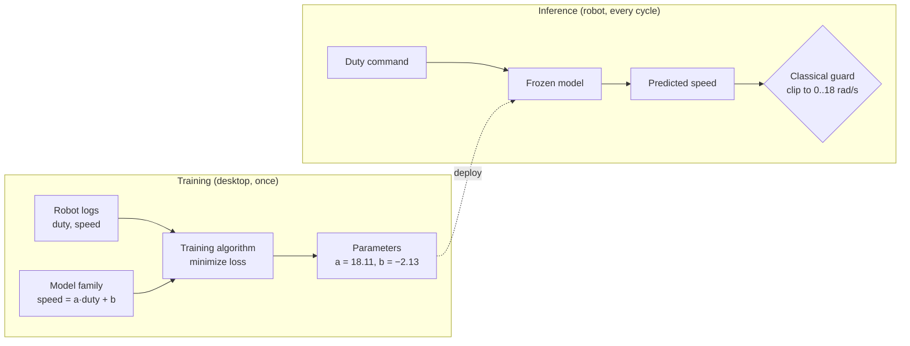

# FML.01 — What machine learning is — and isn't

<!-- glance:start -->
<!-- generated by tools/build.py from curriculum/syllabus.yaml — edit the syllabus, not this block -->

| | |
|---|---|
| **Track** | Optional foundation |
| **Difficulty** | Beginner |
| **Time** | 40 min |
| **Hardware** | none |
| **Software** | none |
| **Prerequisites** | none |
| **Skip if** | You can explain training vs inference and when ML is appropriate. |

<!-- glance:end -->

## What you will learn

- Explain the difference between writing a rule and learning a function from data, using a robot motor as the example.
- Name the parts of every ML system: features, labels, model, parameters, loss, training, inference.
- Separate *training* (offline, expensive, once) from *inference* (online, cheap, every control cycle) and say where each runs on a robot.
- Decide, for a given robot component, whether ML is the right tool or whether a classical method wins.
- Train and query your first model in a dozen lines of numpy, and see it fail outside its data.

## Why it matters

Your robot will use learned components in several places: an object detector that turns camera pixels into boxes ([13.09](../../13-computer-vision/13.09-cnns-for-robot-vision.md), [13.10](../../13-computer-vision/13.10-object-detection-models.md)), a learned motor model that makes speed control tighter ([16.05](../../16-machine-learning/16.05-learning-dynamics.md)), policies trained by reinforcement learning ([17.01](../../17-reinforcement-learning/17.01-rl-framing.md)) or by imitating your demonstrations ([18.02](../../18-embodied-ai/18.02-imitation-learning-behavior-cloning.md)). It will also have many places where ML is the *wrong* tool: a PID loop, odometry, a watchdog that cuts the motors.

You have used LLMs, so you know what a trained model looks like from the outside. This lesson looks at the inside, from zero, with robot data. [16.01](../../16-machine-learning/16.01-where-ml-helps-robots.md) builds on it to argue ML vs classical for each layer of the robot stack.

<!-- prereqs:start -->
## Prerequisites

None — you can start here.

### Optional prerequisite links

None.

Check your readiness: `python course.py why FML.01`
<!-- prereqs:end -->

## Concept

### Two ways to get a function

Your robot needs a function: *"if I send duty cycle `d` to the left motor, how fast will the wheel turn?"* (Duty cycle = the fraction of time the motor driver switches the battery onto the motor; 0.5 means half the time. See [01.08](../../01-first-robot/01.08-first-motor-spin.md).)

**Way 1: write the rule.** The motor's datasheet says "no-load speed 18 rad/s". You write `speed = 18 * duty`. That's a program: a human encoded knowledge as code.

**Way 2: learn the rule.** You put the robot on a stand, send 40 different duty cycles, log the speed the encoders measured, and let an algorithm find the line that best fits those 40 points. The *shape* of the function (a straight line) is still your choice; the *numbers* in it (slope, offset) come from data.

Way 2 wins here, and not by a little. The datasheet rule ignores that the motor doesn't move at all below about 12 % duty (friction: the *deadband*), and that a half-empty battery gives less voltage. The log contains all of that, so the learned line does too.

That's all machine learning is: **pick a family of functions with adjustable numbers, then pick the numbers that make the function agree with examples.** Everything else — neural networks, transformers, diffusion — is a bigger family of functions, a better way of scoring agreement, or a faster way of finding the numbers.

### The analogy you already know

Think of a model as a service whose code is fixed but whose configuration file has a million entries you could never tune by hand. *Training* is an automated job that tunes the configuration against a test suite (the examples). *Inference* is calling the deployed service. The test suite only covers the situations you recorded, so the service behaves well on inputs that look like the test suite and can do anything at all on inputs that don't. Robots meet inputs that don't look like the test suite every day: a new floor, a dead battery, sunlight on the camera.

### What ML is not

- **Not magic understanding.** A model that learned "speed vs duty" at 11.1 V has no idea what a battery is.
- **Not a replacement for physics you already know.** If an equation describes the thing well (wheel odometry, a rotation matrix), use the equation. ML is for when the rule is unknown, too messy to write (what does a "cup" look like in pixels?), or has parameters you can't measure directly.
- **Not safe by default.** A learned component can output anything. Robots put classical guards around it: speed limits, watchdogs, sanity checks.

> [!TIP]
> **Ask your teacher:** "Give me three parts of a home robot where a learned model beats hand-written code, and three where it would be a mistake. For each, say what data you would need."

## Technical explanation

### Level 1 — The vocabulary

| Term | Meaning | Motor example |
|---|---|---|
| Example / sample | One recorded situation | one row of the log |
| Features (inputs, $x$) | What the model gets to see | duty cycle (and later battery voltage) |
| Label (target, $y$) | The correct answer for that sample | measured wheel speed (rad/s) |
| Model $f_\theta$ | A family of functions with adjustable parameters $\theta$ | $\hat y = a \cdot d + b$ |
| Parameters $\theta$ | The adjustable numbers ("weights") | $a$, $b$ |
| Loss | A number that says how wrong the model is on the data | mean squared error |
| Training | Searching for the $\theta$ with the lowest loss | `np.polyfit` |
| Inference | Running the trained model on a new input | `a * 0.4 + b` in the control loop |
| Generalization | Doing well on data *not* used for training | new duty cycles, new days |

### Level 2 — When ML is appropriate on a robot

Ask four questions:

1. **Is there a reliable rule already?** Kinematics, coordinate transforms, Kalman filters: yes → don't learn it.
2. **Is the input high-dimensional and messy?** Camera images (640×480×3 = 921,600 numbers), LiDAR scans, audio: ML is usually the only practical option.
3. **Can you get data that looks like deployment?** If you can only collect data on your desk but the robot works in the kitchen, expect trouble ([06.10](../../06-simulation/06.10-sim-to-real-gap.md) discusses the same gap for simulation).
4. **What happens when it's wrong?** A misdetected cup is an annoyance. A learned emergency-stop is unacceptable. Wrong-but-bounded is OK; wrong-and-unbounded needs a classical guard.

| Robot component | Usual choice | Why |
|---|---|---|
| Encoder ticks → wheel speed | Classical | Exact geometry |
| PID speed control | Classical (maybe learned feedforward) | Well understood, provable behavior |
| Motor model with deadband and battery sag | ML *or* system identification | Parameters unknown, easy to log |
| Camera → "there's a cup at pixel (320, 240)" | ML | No writable rule for "cup" |
| Obstacle stop within 20 cm | Classical | Must never fail silently |
| "Fold the towel" from demonstrations | ML (imitation learning) | Nobody can write that controller |

### Level 3 — The math of "learning"

A model is a function with parameters:

$$\hat y = f_\theta(x)$$

Training picks the parameters that minimize the average loss over the $N$ training examples:

$$\theta^* = \arg\min_\theta \; \frac{1}{N}\sum_{i=1}^{N} L\big(f_\theta(x_i),\, y_i\big)$$

For regression the usual loss is the squared error $L = (\hat y - y)^2$, so the objective is the mean squared error (MSE). [FML.04](FML.04-loss-functions.md) explains why, and [FML.05](FML.05-gradient-descent.md) explains how the $\arg\min$ is actually found.

**Numerical example.** Three logged samples at 11.1 V (computed with Python from the course's motor model):

| duty $d$ | measured speed $y$ (rad/s) |
|---|---|
| 0.3 | 3.248 |
| 0.5 | 6.800 |
| 0.7 | 10.352 |

*Datasheet rule* $\hat y = 18d + 0$: predictions 5.4, 9.0, 12.6; errors 2.152, 2.2, 2.248;
MSE $= (2.152^2 + 2.2^2 + 2.248^2)/3 = 4.84$ (rad/s)².

*Learned line* $\hat y = 17.76d - 2.08$ (what `np.polyfit` returns for these three points): errors 0, 0, 0; MSE $= 0$.

The learned intercept, −2.08 rad/s, is the deadband showing up in the numbers: the line crosses zero speed at $d = 2.08/17.76 = 0.117$, right where the motor starts turning.

### Level 4 — Training vs inference on a real robot

| | Training | Inference |
|---|---|---|
| When | Offline, once or occasionally | Every control/perception cycle |
| Where | Desktop, laptop, cloud GPU | Raspberry Pi 5, Jetson, sometimes the Pico |
| Cost | Seconds (this lesson) to days (a VLA) | Microseconds (a line) to ~1 s (a large VLA) |
| Needs | All the data, the loss, gradients | Only the frozen parameters and the forward computation |

Inference cost is a *real-time budget*. A 50 Hz speed loop has 20 ms per cycle; a line costs microseconds, fine. A camera detector at 10 Hz has 100 ms; a big network on a Pi CPU can blow that ([16.04](../../16-machine-learning/16.04-models-on-edge-compute.md)). This is why robots often train big and deploy small.

### The families of ML you will meet in this course

- **Supervised learning** — examples come with labels: motor models, detectors, behavior cloning. [FML.02](FML.02-supervised-learning.md).
- **Unsupervised learning** — no labels, find structure: clustering sensor readings, compressing scans. [FML.11](FML.11-unsupervised-learning.md).
- **Self-supervised / contrastive** — invent labels from the data itself: CLIP-style embeddings. [FML.09](FML.09-embeddings.md).
- **Generative models** — learn to *sample* realistic outputs: diffusion policies. [FML.12](FML.12-generative-models-diffusion.md).
- **Reinforcement learning** — learn from reward by trying things: module [17](../../17-reinforcement-learning/17.01-rl-framing.md).

## Diagram



## Code

Save as `fml01_first_model.py` in any scratch folder and run `python fml01_first_model.py` (numpy only). It simulates a logging session, compares the datasheet rule with a learned line, then queries the learned line inside and outside the range it was trained on.

```python
"""FML.01 — the smallest possible machine-learning workflow on robot data.

A wheel is driven at different PWM duty cycles; we log the wheel speed it reaches.
We compare a hand-written rule (from the motor's datasheet) with a model *learned* from the log.
"""
from __future__ import annotations

import time

import numpy as np

BATTERY_V = 11.1  # nominal 3S Li-ion pack


def true_wheel_speed(duty: np.ndarray, battery_v: float) -> np.ndarray:
    """The 'physics' we pretend not to know: deadband, then linear, then saturation (rad/s)."""
    return np.clip(1.6 * np.maximum(0.0, duty * battery_v - 1.3), 0.0, 18.0)


def log_experiment(rng: np.random.Generator, n: int, lo: float, hi: float) -> tuple[np.ndarray, np.ndarray]:
    """Simulate a logging session: random duty cycles, noisy speed measurements."""
    duty = rng.uniform(lo, hi, n)
    speed = true_wheel_speed(duty, BATTERY_V) + rng.normal(0.0, 0.3, n)  # encoder noise
    return duty, speed


def datasheet_rule(duty: np.ndarray) -> np.ndarray:
    """Hand-written rule: 'no-load speed 18 rad/s at 100 % duty', assumed proportional."""
    return 18.0 * duty


def rmse(pred: np.ndarray, target: np.ndarray) -> float:
    return float(np.sqrt(np.mean((pred - target) ** 2)))


def main() -> None:
    rng = np.random.default_rng(0)

    # 1) DATA: 40 logged samples with duty between 0.2 and 0.6 (the range we happened to test)
    duty_train, speed_train = log_experiment(rng, 40, 0.2, 0.6)

    # 2) TRAINING: choose the parameters (slope, intercept) that best fit the log
    slope, intercept = np.polyfit(duty_train, speed_train, deg=1)
    print(f"learned model: speed = {slope:.2f} * duty + {intercept:.2f}")

    # 3) EVALUATION on NEW data from the same range
    duty_test, speed_test = log_experiment(rng, 200, 0.2, 0.6)
    learned = slope * duty_test + intercept
    print(f"RMSE datasheet rule : {rmse(datasheet_rule(duty_test), speed_test):.2f} rad/s")
    print(f"RMSE learned model  : {rmse(learned, speed_test):.2f} rad/s")

    # 4) INFERENCE: use the frozen parameters on single new inputs
    for d in (0.40, 0.05, 1.00):
        t0 = time.perf_counter()
        pred = slope * d + intercept
        dt_us = (time.perf_counter() - t0) * 1e6
        truth = float(true_wheel_speed(np.array([d]), BATTERY_V)[0])
        print(f"duty={d:.2f}: predicted {pred:6.2f} rad/s, true {truth:6.2f} rad/s  ({dt_us:.1f} us)")


if __name__ == "__main__":
    main()
```

Output (tested with Python 3.14, numpy 2.5; timings vary by machine):

```text
learned model: speed = 18.11 * duty + -2.13
RMSE datasheet rule : 2.21 rad/s
RMSE learned model  : 0.32 rad/s
duty=0.40: predicted   5.11 rad/s, true   5.02 rad/s  (3.7 us)
duty=0.05: predicted  -1.23 rad/s, true   0.00 rad/s  (0.6 us)
duty=1.00: predicted  15.98 rad/s, true  15.68 rad/s  (0.2 us)
```

Read it line by line: the learned model is 7× more accurate than the datasheet rule on new data from the same range. RMSE (root mean squared error) is in the same unit as the label, rad/s, and 0.32 is close to the 0.3 rad/s encoder noise, which no model can remove. At duty 0.05 the model predicts a *negative* speed: physically impossible, because the log never went below 0.2. At duty 1.00 it happens to be right, because this motor really is linear up there. The model can't tell you which of those two situations you're in.

## Exercise

### Exercise FML.01-E1 — Predict the extrapolation `[predict]`

Hardware: none.

1. Before running anything, write down what the learned line from the Code section predicts at duty 0.10 and at duty 0.0, and what the true speeds are. Use $\hat y = 18.11d - 2.13$ and the fact that the motor doesn't turn below duty ≈ 0.12 at 11.1 V.
2. Add `0.10` and `0.00` to the tuple in step 4 and run the script.
3. In one sentence: what should a robot do with a learned model's output for inputs outside the training range?

### Exercise FML.01-E2 — Collect better data `[coding]`

Hardware: none.

1. Change the training call to `log_experiment(rng, 40, 0.0, 1.0)` so the log covers the whole duty range, deadband included.
2. Run it. Compare the learned slope and intercept and the prediction at duty 0.05 with the original run.
3. Explain why the prediction at 0.05 improved but is still not exactly 0.

### Exercise FML.01-E3 — Training by hand `[numerical]`

Hardware: none.

With the three samples from Level 3 — (0.3, 3.248), (0.5, 6.800), (0.7, 10.352) — compute the MSE of the model $\hat y = 17d - 1.5$ by hand (calculator allowed). Is it better or worse than the datasheet rule's 4.84? Check with three lines of numpy.

### Exercise FML.01-E4 — ML or not? `[predict]`

Hardware: none.

For each component, answer "classical", "ML" or "ML with a classical guard", with one sentence of reasoning: (a) converting LiDAR ranges and angles to x/y points; (b) recognizing whether the robot is in the kitchen or the bedroom from a camera image; (c) stopping the motors if no command arrives for 300 ms; (d) predicting the duty cycle needed for 0.5 m/s on carpet vs tiles; (e) choosing a grasp on an unknown object.

## Expected result

- **FML.01-E1:** predictions: duty 0.10 → $18.11 \cdot 0.10 - 2.13 = -0.32$ rad/s (true 0.00); duty 0.00 → −2.13 rad/s (true 0.00). The script prints exactly these (±0.01). Answer to step 3: treat outputs outside the training distribution as untrusted — clamp them to physically valid values (here ≥ 0), or refuse and fall back to a safe default.
- **FML.01-E2:** `speed = 16.73 * duty + -1.23`; duty 0.05 → −0.40 rad/s (closer to the true 0, still wrong); duty 0.10 → +0.44 rad/s (true 0). Surprise: the learned model's RMSE on the 0.2–0.6 test set *rises* from 0.32 to 0.53 rad/s. The straight line now has to compromise between the flat deadband and the sloped region, and fits neither perfectly. *A straight line cannot represent a deadband*: the model family is the problem, not the data. [FML.06](FML.06-neural-networks.md) fixes that with a nonlinear model.
- **FML.01-E3:** predictions 3.6, 7.0, 10.4; errors 0.352, 0.2, 0.048; MSE $= (0.1239 + 0.04 + 0.0023)/3 = 0.0554$ (rad/s)². Much better than 4.84, worse than 0.
- **FML.01-E4:** (a) classical — exact trigonometry ([FM.04](../mathematics/FM.04-coordinate-systems.md)); (b) ML — no writable rule for "kitchen" in pixels; (c) classical — a safety function must be simple and verifiable; (d) ML or system identification, *with* a classical guard (clamp duty to ±1, PID corrects the residual error); (e) ML with a classical guard — learned grasp proposals, checked by collision and reachability tests.

## Troubleshooting

### Symptom: my numbers differ from the lesson output

1. Timings (`us` column) always differ — ignore them.
2. Check the seed: `np.random.default_rng(0)`. A different seed gives different samples and slightly different weights (slope 17.5–18.5 is normal).
3. Check numpy ≥ 1.17 (`python -c "import numpy; print(numpy.__version__)"`); older versions don't have `default_rng`.
4. If the slope is wildly different (e.g. 180), look for a unit error: duty must be 0..1, not 0..100.

### Symptom: the model is great on my test data and bad on the robot

This is the most common ML failure in robotics. Work through it in order:
1. **Same range?** Plot the training inputs and the inputs the robot actually sees. If the robot runs at duty 0.9 and you trained on 0.2–0.6, you are extrapolating.
2. **Same conditions?** Battery voltage, floor, payload, temperature. A model trained on a full battery doesn't know about a half-empty one.
3. **Same preprocessing?** Units, scaling, sign conventions (left wheel reversed?) must match exactly between training and inference.
4. **Test data leaked?** If test samples were recorded seconds apart from training samples, the test score is optimistic. [FML.03](FML.03-train-validation-test.md) shows how to split properly.

### Symptom: `RankWarning: Polyfit may be poorly conditioned`

You have too few distinct inputs for the polynomial degree (for example, all duties identical). Log a wider spread of inputs.

## Common mistakes

- **Treating a learned model as a law of physics.** It is a summary of the data you logged. Always ask: what did the data *not* include?
- **Using ML where an equation exists.** Learning odometry from data when $v = r\omega$ is exact wastes data and adds error.
- **Evaluating on the training data.** A model can memorize. Always report error on data it didn't train on.
- **Ignoring inference cost.** A model that takes 200 ms can't sit inside a 50 Hz loop, however accurate it is.
- **No guard rails.** Clamp, sanity-check and time out learned outputs before they reach actuators.

## Knowledge check

1. What is the difference between a model's *parameters* and its *features*?
   <details><summary>Answer</summary>

   Features are the inputs the model sees for each sample (duty cycle, battery voltage). Parameters are the adjustable numbers inside the model (slope, intercept, network weights) that training chooses and that stay fixed during inference.
   </details>

2. The learned line is $\hat y = 18.11d - 2.13$. At what duty does it predict zero speed, and what physical effect does that represent?
   <details><summary>Answer</summary>

   $d = 2.13/18.11 = 0.118$. It represents the deadband: below ≈12 % duty, friction stops the motor turning (the course robot's config lists `duty_deadband: 0.12`).
   </details>

3. Where do training and inference usually run for a detector on the course robot, and why the split?
   <details><summary>Answer</summary>

   Training on a desktop/cloud GPU (needs all data, gradients, lots of compute, done once); inference on the Pi 5 or Jetson (only the frozen weights and a forward pass, done every frame within a latency budget).
   </details>

4. Predict: a model trained on logs from a full battery (12.4–12.6 V) is used when the battery reads 10.2 V. What happens to its speed predictions, and what's the fix?
   <details><summary>Answer</summary>

   It over-predicts speed (the same duty gives less voltage at the motor) because it has never seen low voltage and doesn't take voltage as an input. Fix: log across the whole battery range and add battery voltage as a feature ([FML.02](FML.02-supervised-learning.md) does exactly this).
   </details>

5. Name one robot function you should never replace with a learned model, and why.
   <details><summary>Answer</summary>

   The motor watchdog / emergency stop (or obstacle stop at minimum distance). It must be simple, verifiable and fail-safe; a learned model can produce arbitrary outputs on unseen inputs.
   </details>

6. Your model has RMSE 0.32 rad/s and the encoder noise is σ = 0.3 rad/s. Is it worth building a much bigger model to reduce the error?
   <details><summary>Answer</summary>

   Not on this data: RMSE ≈ noise level means the model already explains almost everything explainable; the remaining error is measurement noise. Improve the measurement (filtering, more encoder resolution) or collect data where the model is actually wrong (outside the range).
   </details>

## Practical challenge

Write a one-page "ML decision record" (like an architecture decision record) for your robot, covering at least five components from sensing to actuation. For each: the decision (classical / ML / ML + guard), the data you would need (what, how many samples, under which conditions), the failure mode if the model is wrong, and the inference latency budget.

Then back one decision with an experiment: extend `fml01_first_model.py` so the simulated battery voltage varies per logging session, show the error of a model trained at 12.5 V when evaluated at 10.0 V, and show that logging across voltages fixes it.

Acceptance criteria:
- Five components covered, each with data, failure mode and a latency number in ms.
- The experiment prints RMSE for "train high voltage → test low voltage" and "train all voltages → test low voltage", and the second is at least 2× smaller.

## You can skip this if…

You can answer knowledge-check questions 3, 4 and 6 correctly without looking, and you can explain in two sentences why a learned model's predictions outside its training range can't be trusted. Then: `python course.py skip FML.01 --reason "know training vs inference and when ML fits"`.

## Go deeper

- Google, Machine Learning Crash Course — https://developers.google.com/machine-learning/crash-course — short, practical modules on the vocabulary of this lesson; do the "Introduction to ML" and "Linear regression" units.
- fast.ai, Practical Deep Learning for Coders — https://course.fast.ai/ — top-down course for engineers; lesson 1 gets you a working image model before any theory.
- Dive into Deep Learning, chapter 1 (introduction) and linear regression — https://d2l.ai/chapter_linear-regression/index.html — free interactive textbook with runnable PyTorch code; the reference book for this foundation module.
- Stanford CS229 lecture notes — https://cs229.stanford.edu/main_notes.pdf — the classical theory, if you want the formal version of Level 3.
- Hugging Face Robotics Course — https://huggingface.co/learn/robotics-course — where classical robotics meets robot learning; read after this module.

## Progress checkpoint

- [ ] I can explain the difference between writing a rule and learning it, with the motor example.
- [ ] I can name features, labels, parameters, loss, training and inference in a concrete system.
- [ ] I can say where training and inference run on the robot and what the latency budget is.
- [ ] I can argue ML vs classical for a robot component, including the guard rail.
- [ ] I ran the script and saw the model fail outside its training range.

`python course.py complete FML.01` (exercises done) · `python course.py master FML.01` (challenge done) · `python course.py struggle FML.01 "what was hard"`.

Next: [FML.02 — Supervised learning: regression and classification](FML.02-supervised-learning.md).
