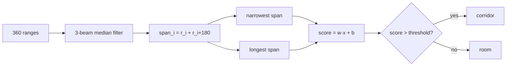

# FML.02 — Supervised learning: regression and classification

<!-- glance:start -->
<!-- generated by tools/build.py from curriculum/syllabus.yaml — edit the syllabus, not this block -->

| | |
|---|---|
| **Track** | Optional foundation |
| **Difficulty** | Beginner |
| **Time** | 1 h |
| **Hardware** | none |
| **Software** | python, numpy |
| **Prerequisites** | [FML.01 What machine learning is — and isn't](FML.01-what-is-ml.md) |
| **Optional prerequisites** | [FM.19 Linear systems and least squares](../mathematics/FM.19-linear-systems-least-squares.md) |
| **Skip if** | You have trained regression and classification models. |

<!-- glance:end -->

## What you will learn

- Frame a robot problem as supervised learning: choose features, labels and a model family.
- Fit a regression model (motor speed from duty cycle and battery voltage) with least squares and report its error in physical units.
- Engineer features that make a simple model work — and see how much they matter.
- Build a classifier that labels a LiDAR scan "corridor" or "room", and read its confusion matrix, precision and recall.
- Choose a decision threshold based on what a wrong answer costs the robot.

## Why it matters

Most learned components on a robot are supervised: examples go in, correct answers come out. A *regression* model predicts a number — the wheel speed a duty cycle will produce, the distance to an object, the next joint angle. A *classification* model predicts a category — corridor or room, cup or bowl, safe or unsafe grasp.

[16.05](../../16-machine-learning/16.05-learning-dynamics.md) fits a real motor model from your robot's logs; this lesson is its foundation. [13.10](../../13-computer-vision/13.10-object-detection-models.md) detectors are classification plus box regression. Behavior cloning in [18.02](../../18-embodied-ai/18.02-imitation-learning-behavior-cloning.md) is regression from observations to actions. Same recipe every time.

<!-- prereqs:start -->
## Prerequisites

You need these first:

- [FML.01 What machine learning is — and isn't](FML.01-what-is-ml.md)

### Optional prerequisite links

New to any of these? Take the foundation lesson first; skip it if you already know it.

- [FM.19 Linear systems and least squares](../mathematics/FM.19-linear-systems-least-squares.md)

Check your readiness: `python course.py why FML.02`
<!-- prereqs:end -->

## Concept

### The recipe

Supervised learning always has the same four ingredients:

1. **Examples** $(x_i, y_i)$ — logged inputs with the correct answer attached.
2. **A model family** — straight lines, planes, neural networks.
3. **A loss** — how wrong a prediction is.
4. **An optimizer** — finds the parameters with the lowest total loss.

The difference between regression and classification is only what $y$ is: a real number (rad/s, metres) or a class (corridor / room).

### Regression: a motor model that knows about the battery

In [FML.01](FML.01-what-is-ml.md) the model only saw duty cycle. But the same duty gives less speed on a half-empty battery: the motor sees roughly `duty × battery voltage`. So the robot logs both, and the model gets both as features.

Here's the interesting part. A model that is linear in *duty* and *volts* separately, $\hat y = w_1 d + w_2 V + b$, can't express "duty *times* voltage". You can hand it that product as a third feature. The model is still linear in its *parameters* (still just least squares), but now it can represent the physics. This is **feature engineering**: you put domain knowledge into the inputs so a simple model can do the job.

### Classification: corridor or room?

A 2D LiDAR spins and returns 360 distances, one per degree ([00.03](../../00-orientation/00.03-actuators-and-sensors-field-guide.md)). A navigation behavior might drive differently in a corridor (stay centered, higher speed) than in a room (explore, slower). Can a model tell which one it's in?

Giving a simple model all 360 raw numbers doesn't work well: the robot can face any direction, so "beam 90 is short" means nothing on its own. Features that don't depend on heading do: the *narrowest* wall-to-wall span through the robot (short in a corridor), the *longest* span (very long in a corridor). With the right two features, even a straight line separates the classes almost perfectly. With the obvious-but-wrong features (mean range, nearest range), it's barely better than a coin flip.

This is also exactly the pain CNNs and transformers remove: they learn their own features from raw data ([FML.08](FML.08-cnns.md), [FML.10](FML.10-transformers-attention.md), which revisits this scan task without hand-made features).

> [!TIP]
> **Ask your teacher:** "I have a regression problem on my robot. Walk me through choosing features, including one feature I should *not* use because it won't be available at run time."

## Technical explanation

### Level 1 — Regression vs classification

| | Regression | Classification |
|---|---|---|
| Label $y$ | real number | one of $K$ classes |
| Robot examples | wheel speed, distance to wall, grasp width | corridor/room, object class, "will this grasp succeed" |
| Typical error metric | RMSE in the label's unit | accuracy, precision, recall |
| Typical loss | squared error | cross-entropy ([FML.04](FML.04-loss-functions.md)) |

### Level 2 — Practical workflow

1. **Define what the model gets at run time.** Only features the robot actually has when it needs the prediction. Future values and labels-in-disguise are leaks.
2. **Log examples over the conditions you'll deploy in** (whole battery range, all floors).
3. **Split** into training and test data (properly: [FML.03](FML.03-train-validation-test.md)).
4. **Start with the simplest model** (linear), measure test error in physical units.
5. **Improve features before improving the model.** Then try a bigger model ([FML.06](FML.06-neural-networks.md)).
6. **For classifiers, pick the threshold** from the cost of each error type.

### Level 3 — Linear least squares

Stack the $N$ examples as rows of a feature matrix $X$ (with a final column of ones for the bias) and the labels as a vector $y$. A linear model predicts $\hat y = Xw$. Minimizing the sum of squared errors $\lVert Xw - y\rVert^2$ has a closed-form solution, the **normal equations**:

$$w^* = (X^\top X)^{-1} X^\top y$$

([FM.19](../mathematics/FM.19-linear-systems-least-squares.md) derives this; numerically, `np.linalg.lstsq` solves it without forming the inverse.)

**Numerical example.** Feature $u = d \cdot V$ (effective motor voltage), three samples: $u = 3, 6, 9$ V with speeds $y = 2.7, 7.5, 12.3$ rad/s. With a bias column:

$$X = \begin{bmatrix}3 & 1\\6 & 1\\9 & 1\end{bmatrix},\quad
X^\top X = \begin{bmatrix}126 & 18\\18 & 3\end{bmatrix},\quad
X^\top y = \begin{bmatrix}163.8\\22.5\end{bmatrix}$$

Solving $X^\top X\, w = X^\top y$ gives $w = (1.6,\ -2.1)$: speed $= 1.6\,u - 2.1$. Physically: 1.6 rad/s per volt, and the motor starts turning at $u = 2.1/1.6 = 1.31$ V.

**Linear classification by regression.** Encode corridor as $+1$, room as $-1$, fit least squares on those targets, and classify as corridor when the score $s = w^\top x + b > 0$. It's a quick first classifier (the same code as regression). [FML.04](FML.04-loss-functions.md) shows why a proper classification loss (cross-entropy) is better.

With the engineered features the fitted classifier is
$s = -0.241 \cdot \text{narrowest} + 0.106 \cdot \text{longest} - 1.071$.
A scan with narrowest span 1.5 m and longest 22 m: $s = -0.362 + 2.332 - 1.071 = 0.90 > 0$ → corridor. A scan with 5 m and 9 m: $s = -1.205 + 0.954 - 1.071 = -1.32$ → room.

### Level 3b — Metrics for classifiers

For the positive class (corridor), the **confusion matrix** counts: TP (corridor called corridor), FP (room called corridor), FN (corridor called room), TN.

$$\text{accuracy} = \frac{TP+TN}{N},\quad \text{precision} = \frac{TP}{TP+FP},\quad \text{recall} = \frac{TP}{TP+FN}$$

From the run below with engineered features (TP=195, FP=7, FN=0, TN=198):
accuracy $= 393/400 = 0.983$; precision $= 195/202 = 0.965$; recall $= 195/195 = 1.0$.

Which matters more is a robot decision. If "corridor" unlocks a higher speed, a false positive (room called corridor) is the dangerous error → favor precision by raising the threshold.

### Level 4 — Implementation notes

- **Always include a bias column.** Without it the model is forced through the origin: zero duty *and zero volts* → zero speed, but it can't represent the deadband offset.
- **Features at run time.** Battery voltage is in every telemetry frame (`batt_mV` in the [Pi ↔ Pico protocol](../../labs/README.md)), so it's a legitimate feature. "Speed measured 100 ms later" is not.
- **Dropouts.** Real LiDARs drop beams (dark or shiny surfaces). The generator reports them as the 12 m maximum; a 3-beam median filter removes isolated dropouts before computing spans.
- **Circular data.** Beam 359 is next to beam 0 — `np.roll` wraps around, which is why the median filter uses it.

## Diagram

```text
Opposite-beam spans from the robot R (top view)

 corridor (width 1.6 m)                          room (5 m x 4 m)
 ─────────────────────────────────────           ┌───────────────────┐
            ▲ 0.8 m                               │         ▲ 2.1 m   │
 ◄──── 12 m ──── R ──── 12 m ────►                │ ◄─2.4─ R ──2.6──► │
            ▼ 0.8 m                               │         ▼ 1.9 m   │
 ─────────────────────────────────────           └───────────────────┘
 narrowest span = 0.8 + 0.8 = 1.6 m               narrowest span = 2.1 + 1.9 = 4.0 m
 longest span  = 12 + 12  = 24 m (max range)      longest span  ≈ diagonal ≈ 6.4 m
```



## Code

Save as `fml02_supervised.py` and run `python fml02_supervised.py` (numpy only, runs in under a second). Part 1 fits two motor models; part 2 generates LiDAR scans in simulated corridors and rooms and trains two classifiers.

```python
"""FML.02 — supervised learning on robot data: regression (motor model) and classification (LiDAR scans)."""
from __future__ import annotations

import numpy as np

# ----------------------------------------------------------------------------- data generators


def motor_dataset(rng: np.random.Generator, n: int) -> tuple[np.ndarray, np.ndarray]:
    """Features: duty (0..1), battery voltage (9.9..12.6 V). Label: wheel speed (rad/s)."""
    duty = rng.uniform(0.0, 1.0, n)
    volts = rng.uniform(9.9, 12.6, n)
    speed = np.clip(1.6 * np.maximum(0.0, duty * volts - 1.3), 0.0, 18.0) + rng.normal(0.0, 0.3, n)
    return np.column_stack([duty, volts]), speed


def lidar_scan(rng: np.random.Generator, length: float, width: float, x: float, y: float) -> np.ndarray:
    """360-beam scan (1 degree steps) from (x, y) inside an empty rectangle [0,length]x[0,width]."""
    heading = rng.uniform(-np.pi, np.pi)
    ang = heading + np.deg2rad(np.arange(360))
    c, s = np.cos(ang), np.sin(ang)
    with np.errstate(divide="ignore"):
        tx = np.where(c > 0, (length - x) / c, np.where(c < 0, -x / c, np.inf))
        ty = np.where(s > 0, (width - y) / s, np.where(s < 0, -y / s, np.inf))
    r = np.minimum(tx, ty) + rng.normal(0.0, 0.02, 360)  # 2 cm range noise
    r = np.minimum(r, 12.0)                              # 12 m maximum range
    r[rng.random(360) < 0.03] = 12.0                     # 3 % dropouts reported as max range
    return r


def scan_dataset(rng: np.random.Generator, n: int) -> tuple[np.ndarray, np.ndarray]:
    """Label 1 = corridor, 0 = room."""
    scans, labels = [], []
    for _ in range(n):
        if rng.random() < 0.5:  # corridor: long and narrow
            length, width = 30.0, rng.uniform(1.0, 2.5)
            x, y, label = rng.uniform(5, 25), rng.uniform(0.3, width - 0.3), 1
        else:                   # room: anything from a small office to a big hall
            length, width = rng.uniform(2.5, 9.0), rng.uniform(2.5, 9.0)
            x, y, label = rng.uniform(0.3, length - 0.3), rng.uniform(0.3, width - 0.3), 0
        scans.append(lidar_scan(rng, length, width, x, y))
        labels.append(label)
    return np.array(scans), np.array(labels)


def naive_features(scans: np.ndarray) -> np.ndarray:
    """Obvious first try: average range and nearest range."""
    return np.column_stack([scans.mean(axis=1), scans.min(axis=1)])


def engineered_features(scans: np.ndarray) -> np.ndarray:
    """Remove single-beam dropouts, then measure wall-to-wall spans through the robot."""
    stacked = np.stack([np.roll(scans, 1, axis=1), scans, np.roll(scans, -1, axis=1)])
    clean = np.median(stacked, axis=0)             # 3-beam median filter
    span = clean[:, :180] + clean[:, 180:]         # beam i + opposite beam i+180
    return np.column_stack([span.min(axis=1), span.max(axis=1)])  # narrowest, longest span


# ----------------------------------------------------------------------------- models


def add_bias(x: np.ndarray) -> np.ndarray:
    return np.column_stack([x, np.ones(len(x))])


def fit_least_squares(x: np.ndarray, y: np.ndarray) -> np.ndarray:
    w, *_ = np.linalg.lstsq(add_bias(x), y, rcond=None)
    return w


def predict(w: np.ndarray, x: np.ndarray) -> np.ndarray:
    return add_bias(x) @ w


def main() -> None:
    rng = np.random.default_rng(42)

    # ---------------- regression: learn a motor model
    x_train, y_train = motor_dataset(rng, 300)
    x_test, y_test = motor_dataset(rng, 1000)

    def rmse(p: np.ndarray, t: np.ndarray) -> float:
        return float(np.sqrt(np.mean((p - t) ** 2)))

    w_raw = fit_least_squares(x_train, y_train)
    print("Model A  speed = w1*duty + w2*volts + b")
    print(f"  weights {np.round(w_raw, 3)}  test RMSE {rmse(predict(w_raw, x_test), y_test):.2f} rad/s")

    def with_product(x: np.ndarray) -> np.ndarray:  # feature engineering: electrical power ~ duty*volts
        return np.column_stack([x, x[:, 0] * x[:, 1]])

    w_prod = fit_least_squares(with_product(x_train), y_train)
    print("Model B  speed = w1*duty + w2*volts + w3*duty*volts + b")
    print(f"  weights {np.round(w_prod, 3)}  test RMSE {rmse(predict(w_prod, with_product(x_test)), y_test):.2f} rad/s")
    query = np.array([[0.5, 10.0], [0.5, 12.6]])
    print(f"  duty 0.5 at 10.0 V -> {predict(w_prod, with_product(query))[0]:.2f} rad/s, "
          f"at 12.6 V -> {predict(w_prod, with_product(query))[1]:.2f} rad/s")

    # ---------------- classification: corridor or room?
    s_train, c_train = scan_dataset(rng, 400)
    s_test, c_test = scan_dataset(rng, 400)
    targets = np.where(c_train == 1, 1.0, -1.0)  # regress on +1 / -1, then threshold at 0
    for name, features in (("naive", naive_features), ("engineered", engineered_features)):
        w_cls = fit_least_squares(features(s_train), targets)
        pred = (predict(w_cls, features(s_test)) > 0).astype(int)
        tp = int(np.sum((pred == 1) & (c_test == 1)))
        fp = int(np.sum((pred == 1) & (c_test == 0)))
        fn = int(np.sum((pred == 0) & (c_test == 1)))
        tn = int(np.sum((pred == 0) & (c_test == 0)))
        print(f"Corridor classifier, {name} features: weights {np.round(w_cls, 3)}")
        print(f"  test accuracy {np.mean(pred == c_test):.3f}   TP={tp} FP={fp} FN={fn} TN={tn}")


if __name__ == "__main__":
    main()
```

Output (Python 3.14, numpy 2.5):

```text
Model A  speed = w1*duty + w2*volts + b
  weights [17.273  0.712 -9.617]  test RMSE 0.57 rad/s
Model B  speed = w1*duty + w2*volts + w3*duty*volts + b
  weights [-3.255 -0.196  1.837  0.514]  test RMSE 0.44 rad/s
  duty 0.5 at 10.0 V -> 6.11 rad/s, at 12.6 V -> 7.98 rad/s
Corridor classifier, naive features: weights [-0.063 -0.877  0.805]
  test accuracy 0.677   TP=144 FP=78 FN=51 TN=127
Corridor classifier, engineered features: weights [-0.241  0.106 -1.071]
  test accuracy 0.983   TP=195 FP=7 FN=0 TN=198
```

What to notice:
- Model B's weights look odd (negative $w_1$ and $w_2$), yet it's better. Individual weights of correlated features aren't physically meaningful; the *predictions* are what count. True values for the query: 5.92 and 8.00 rad/s; Model B says 6.11 and 7.98.
- Model B still has RMSE 0.44 against 0.30 noise: a plane in (duty, volts, duty·volts) can't bend to zero at the deadband.
- Same model, same data, different features: 67.7 % vs 98.3 % accuracy.

## Exercise

### Exercise FML.02-E1 — Predict, then add the physics `[predict]`

Hardware: none.

1. Predict: if you give the linear model *one* feature, $\max(0,\ d \cdot V - 1.3)$ (the effective voltage above the deadband), will its test RMSE be above or below Model B's 0.44? What slope do you expect?
2. Add that model to the script (`np.maximum(0, x[:, 0] * x[:, 1] - 1.3)[:, None]` as the feature) and run it.

### Exercise FML.02-E2 — Normal equations by hand `[numerical]`

Hardware: none.

Using the three samples in Level 3 but with the third speed changed from 12.3 to 11.7 rad/s, compute $X^\top y$ and solve the 2×2 system for $w$ by hand. Verify with `np.linalg.lstsq`.

### Exercise FML.02-E3 — Choose the threshold `[coding]`

Hardware: none.

The robot drives at 0.5 m/s in corridors and 0.2 m/s in rooms, so calling a room "corridor" is the dangerous mistake. In the engineered-features classifier, compute accuracy, precision and recall for thresholds −0.5, 0 and 0.5 (replace `> 0` with `> threshold`). Which threshold do you pick, and what does it cost?

### Exercise FML.02-E4 — Debug a feature that doesn't exist at run time `[debugging]`

Hardware: none.

A colleague adds "speed measured 0.2 s later" as a feature to a model that predicts wheel speed from duty and voltage, and reports RMSE 0.05 rad/s. Explain what went wrong and what RMSE you'd expect on the robot.

## Expected result

- **FML.02-E1:** RMSE ≈ 0.30 rad/s (0.296 in the tested run), right at the noise floor, below Model B. Weights ≈ [1.599, −0.014]: slope 1.6 rad/s per volt above the deadband, intercept ≈ 0 — the model recovered the generator's physics exactly. Lesson: the right feature beats a bigger model.
- **FML.02-E2:** $X^\top y = [3\cdot2.7 + 6\cdot7.5 + 9\cdot11.7,\ 2.7+7.5+11.7] = [158.4,\ 21.9]$. Solving $\begin{bmatrix}126 & 18\\18 & 3\end{bmatrix} w = \begin{bmatrix}158.4\\21.9\end{bmatrix}$: from the second row $w_2 = (21.9 - 18w_1)/3$; substituting into the first row, $126w_1 + 6(21.9 - 18w_1) = 158.4$ → $18w_1 = 27$ → $w_1 = 1.5$, $w_2 = (21.9 - 27)/3 = -1.7$. `lstsq` returns `[1.5, -1.7]`.
- **FML.02-E3:** tested run: threshold −0.5 → accuracy 0.850, precision 0.765, recall 1.00; threshold 0 → 0.983, 0.965, 1.00; threshold 0.5 → 0.905, precision 0.982, recall 0.821 (FP drops from 7 to 3, FN rises from 0 to 35). Pick 0.5 (or higher) for this robot: it costs driving slowly in about 18 % of corridors, which is only lost time.
- **FML.02-E4:** a *leak*: the feature contains the answer (speed 0.2 s later ≈ speed now, motor time constant 0.08 s), and it doesn't exist when the model must predict. On the robot the feature is unavailable, so the model can't run at all — or, if someone feeds a stale value, errors are far larger than 0.05. Expected honest RMSE ≈ 0.3–0.45 rad/s as in the lesson.

## Troubleshooting

### Symptom: least-squares weights are huge (e.g. ±10,000) and flip sign between runs

1. Check for duplicated or nearly identical features (duty and duty·1.0001). Correlated features make $X^\top X$ nearly singular.
2. Print `np.linalg.cond(X)`. Above ~1e8, drop a feature or add a little ridge regularization: `np.linalg.solve(X.T @ X + 1e-3 * np.eye(k), X.T @ y)`.
3. Judge the model by test RMSE, not by the weights.

### Symptom: the classifier's accuracy is ~50 %

1. Check label balance: `np.bincount(labels)`. If it's 50/50 and you get 50 %, the model predicts one class for everything.
2. Print feature percentiles per class (as in the lesson's development). If the distributions overlap completely, the features carry no information — engineer better ones.
3. Check the sign convention: targets must be +1/−1 (not 1/0) when thresholding at 0.

### Symptom: good test accuracy, bad on the robot

1. Did the test scans come from the same simulated rooms as the training scans? Real rooms have furniture, open doors and people.
2. Is the heading really random in training? If all training scans faced along the corridor, a heading-dependent feature can look perfect offline.
3. Log real scans, label a few dozen by hand, and evaluate on those.

## Common mistakes

- **Features the robot won't have at run time** (future measurements, labels in disguise). Ask for each feature: "is this in the message the robot receives at prediction time?"
- **Reading physics into correlated weights.** With duty, volts and duty·volts together, individual weights trade off against each other.
- **Reporting only accuracy.** With 95 % rooms and 5 % corridors, "always room" gets 95 %. Look at precision and recall per class.
- **Leaving the threshold at 0 or 0.5 by default.** The threshold is a safety/performance decision.
- **Skipping the bias column.** Forces the model through the origin and hides offsets like a deadband.

## Knowledge check

1. For each, regression or classification? (a) predicting grasp width in mm; (b) predicting whether a door is open; (c) predicting the battery voltage in 10 minutes.
   <details><summary>Answer</summary>

   (a) regression; (b) classification; (c) regression. The label type decides, not the domain.
   </details>

2. Why can a model that is linear in its parameters still represent $\text{speed} \propto d \cdot V$?
   <details><summary>Answer</summary>

   Because you can compute $d \cdot V$ yourself and give it as a feature. "Linear" refers to how the parameters enter ($\hat y = w^\top \phi(x)$), not to the features $\phi(x)$, which can be any function of the raw inputs.
   </details>

3. With $X^\top X = \begin{bmatrix}126 & 18\\18 & 3\end{bmatrix}$ and $X^\top y = [163.8, 22.5]$, verify that $w = (1.6, -2.1)$ solves the normal equations.
   <details><summary>Answer</summary>

   Row 1: $126 \cdot 1.6 + 18 \cdot (-2.1) = 201.6 - 37.8 = 163.8$ ✓. Row 2: $18 \cdot 1.6 + 3 \cdot (-2.1) = 28.8 - 6.3 = 22.5$ ✓.
   </details>

4. A corridor classifier has TP=160, FP=3, FN=35, TN=202. Compute precision and recall.
   <details><summary>Answer</summary>

   Precision $= 160/163 = 0.982$. Recall $= 160/195 = 0.821$.
   </details>

5. Why do the mean range and nearest range work so badly as features for corridor vs room?
   <details><summary>Answer</summary>

   Their distributions overlap heavily: a robot near a wall in a big room has a short nearest range, like in a corridor; rooms up to 9 m and corridors with beams to 12 m give similar mean ranges. The features don't capture what makes a corridor a corridor — narrow in one direction, very long in the perpendicular one.
   </details>

6. Predict: you train the engineered-features classifier only on scans where the robot faces along the corridor, then deploy it on a robot that turns freely. Does accuracy drop?
   <details><summary>Answer</summary>

   No (or barely): the span features (sum of opposite beams, min and max over all directions) don't depend on heading. A feature like "range of beam 0" would break. Designing features that are invariant to things that don't matter is a core skill (CNNs build in translation invariance for the same reason).
   </details>

7. Your motor model has test RMSE 0.44 rad/s and the encoder noise is 0.30 rad/s. Where is the remaining error most likely coming from?
   <details><summary>Answer</summary>

   Model family mismatch: the linear model can't represent the deadband (the flat zero region at low duty). The residuals will be largest at low duty. A hinge feature or a neural network fixes it.
   </details>

## Practical challenge

Extend the corridor/room problem to **three classes**: corridor, room, and **doorway** (the robot stands in a 0.9 m opening between a room and a corridor — generate it as a room scan where a 10–15° sector of beams is replaced by long ranges). Design at least one new feature, train a *one-vs-rest* set of three least-squares classifiers (each: this class = +1, others = −1; predict the class with the highest score), and report a 3×3 confusion matrix on 600 test scans.

Acceptance criteria:
- Overall test accuracy ≥ 0.85.
- A 3×3 confusion matrix printed with rows = true class, columns = predicted class.
- One paragraph: which confusion is most common, and what it would do to the robot's behavior.

## You can skip this if…

You can answer knowledge-check questions 2, 4 and 6 without looking, and you have previously fit a regression model and evaluated a classifier with precision and recall. Then: `python course.py skip FML.02 --reason "trained regression and classification models before"`.

## Go deeper

- Dive into Deep Learning, "Linear Neural Networks for Regression" — https://d2l.ai/chapter_linear-regression/index.html — linear regression from scratch and in PyTorch, with the probabilistic view.
- Stanford CS231n notes, "Linear classification" — https://cs231n.github.io/linear-classify/ — linear classifiers explained geometrically, with images as the running example.
- Google Machine Learning Crash Course — https://developers.google.com/machine-learning/crash-course — classification, thresholds, precision/recall modules with interactive widgets.
- Stanford CS229 lecture notes — https://cs229.stanford.edu/main_notes.pdf — part I (linear regression, normal equations) and logistic regression, for the math.
- fast.ai, Practical Deep Learning for Coders — https://course.fast.ai/ — top-down alternative if you prefer to see big models working first.

## Progress checkpoint

- [ ] I can frame a robot prediction as regression or classification and name its features and label.
- [ ] I fitted a least-squares model and reported its error in rad/s.
- [ ] I saw feature engineering take a classifier from 68 % to 98 %.
- [ ] I can compute precision and recall from a confusion matrix.
- [ ] I can choose a threshold from the cost of each error on the robot.

`python course.py complete FML.02` (exercises done) · `python course.py master FML.02` (challenge done) · `python course.py struggle FML.02 "what was hard"`.

Next: [FML.03 — Training, validation and test sets; overfitting](FML.03-train-validation-test.md).
