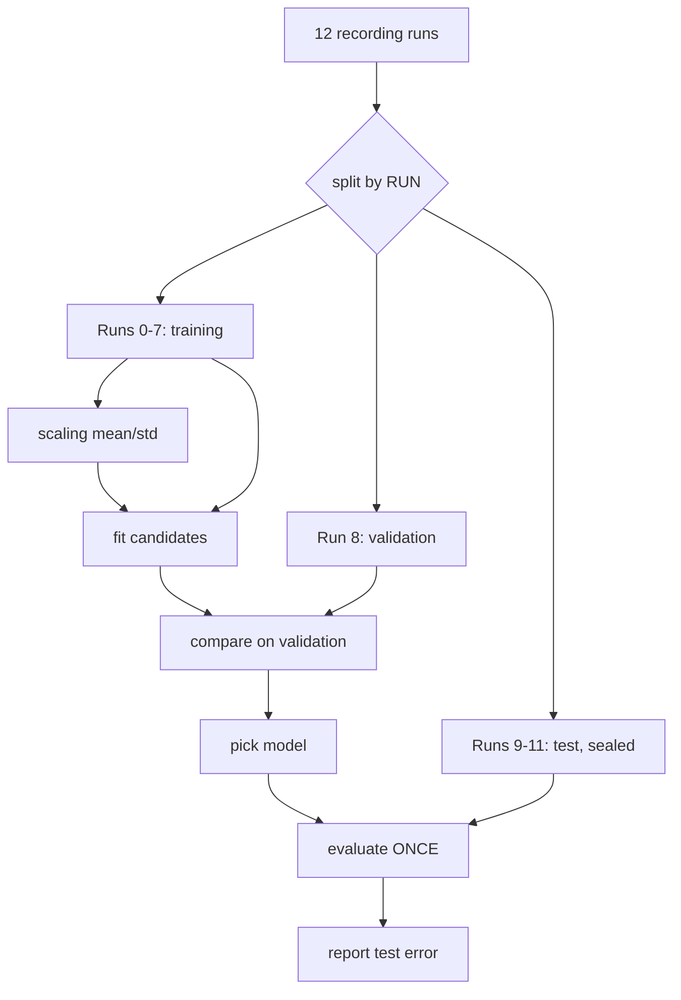

# FML.03 — Training, validation and test sets; overfitting

<!-- glance:start -->
<!-- generated by tools/build.py from curriculum/syllabus.yaml — edit the syllabus, not this block -->

| | |
|---|---|
| **Track** | Optional foundation |
| **Difficulty** | Beginner |
| **Time** | 45 min |
| **Hardware** | none |
| **Software** | python |
| **Prerequisites** | [FML.02 Supervised learning: regression and classification](FML.02-supervised-learning.md) |
| **Skip if** | You split data correctly and recognize leakage. |

<!-- glance:end -->

## What you will learn

- Split data into training, validation and test sets and say what each is allowed to influence.
- Recognize overfitting and underfitting from a table of training and validation errors.
- Use a validation set to choose model complexity, and touch the test set exactly once.
- Detect data leakage in robot logs (time-correlated samples, per-run conditions, preprocessing statistics) and split by run or episode instead.
- Run leave-one-run-out cross-validation when you only have a handful of recording sessions.

## Why it matters

Every learned robot component gets a number attached: "98 % accuracy", "RMSE 0.3 rad/s". That number decides whether the model goes on the robot. If it was measured wrong, you find out when the robot drives into the kitchen table.

Robot data is especially easy to measure wrong. Sensors log at 50 Hz, so neighbouring samples are near-copies. Each recording session has its own battery charge, floor and lighting. Shuffle all samples into train and test, and the test set is full of near-copies of training samples: the score looks great and means nothing. [16.02](../../16-machine-learning/16.02-robot-data.md) turns rosbags into datasets and [16.03](../../16-machine-learning/16.03-fine-tuning-a-detector.md) fine-tunes a detector — both depend on splitting correctly. [16.06](../../16-machine-learning/16.06-evaluating-ml-in-robots.md) goes further: evaluating the model inside the running robot.

<!-- prereqs:start -->
## Prerequisites

You need these first:

- [FML.02 Supervised learning: regression and classification](FML.02-supervised-learning.md)

### Optional prerequisite links

None.

Check your readiness: `python course.py why FML.03`
<!-- prereqs:end -->

## Concept

### The exam analogy

Training data is the textbook. Validation data is the practice exams you use to decide how to study. Test data is the final exam, sealed until the end. If you peek at the final exam while studying, your grade stops measuring what you know. And if the final exam's questions are the textbook's exercises with the numbers changed by 1 %, the grade measures memory, not understanding.

### Overfitting and underfitting

A model **underfits** when it's too simple for the pattern: a straight line through a motor curve with a deadband. Error is high on training data *and* on new data.

A model **overfits** when it's flexible enough to fit the noise: a degree-10 polynomial through 12 noisy points bends through every point, and between and beyond them it swings wildly. Training error is tiny, error on new data is huge.

You can't see either from training error alone — training error always goes down as the model gets more flexible. You need data the model didn't train on.

### Leakage: when test data isn't really new

Leakage is any way information from the test set sneaks into training. In robotics the usual culprits:

- **Time correlation.** At 50 Hz, the sample at t = 3.00 s and the one at t = 3.02 s are nearly identical. If one is in training and the other in test, the model "predicts" the test sample by remembering its neighbour.
- **Per-session conditions.** Each run has its own floor friction and battery voltage. A random split puts every run in both sets, so the model never faces a run it hasn't seen — but on deployment every day is a new run.
- **Preprocessing statistics.** Computing the mean and standard deviation for scaling on *all* data, test included, lets test statistics shape the model.

The fix is to split at the level where independence really holds: by run, by day, by room, by robot.

> [!TIP]
> **Ask your teacher:** "Here's how my robot dataset was recorded: [describe sessions, rooms, days]. What's the right unit to split by, and how many sessions should go to test?"

## Technical explanation

### Level 1 — The three sets

| Set | Used for | May influence | Typical share |
|---|---|---|---|
| Training | fitting parameters | weights | 60–80 % |
| Validation | choosing hyper-parameters (model size, degree, learning rate, epochs, features, threshold) | your decisions | 10–20 % |
| Test | one final, honest estimate | nothing | 10–20 % |

A **hyper-parameter** is any choice not learned by the optimizer: polynomial degree, network width, learning rate, number of training epochs.

### Level 2 — The workflow

1. Decide the split unit (sample? run? day? room?). For robot logs: never sample.
2. Split *first*, before looking at the data closely or computing any statistics.
3. Fit scaling statistics (mean, std) on training data only; apply them to validation and test.
4. Train candidates, compare them on validation, pick one.
5. Retrain the pick on train + validation if you like.
6. Evaluate once on test. Report that number. If you then change the model because of the test score, the test set has become a validation set — you need a new one.

With few runs (say 12), a fixed split wastes data. **Leave-one-run-out cross-validation**: train on 11 runs, evaluate on the 12th, repeat for each run, average the 12 scores. The spread across runs is itself valuable: it tells you how different a new day can be.

### Level 3 — Why the error curve is U-shaped

Expected squared error on new data decomposes as

$$\mathbb{E}\big[(y - \hat y)^2\big] = \underbrace{\text{bias}^2}_{\text{model too simple}} + \underbrace{\text{variance}}_{\text{model too sensitive to the sample}} + \underbrace{\sigma^2}_{\text{noise}}$$

Flexible models have low bias and high variance; simple models the opposite. Validation error, as a function of complexity, falls (bias shrinks) and then rises (variance grows). The noise $\sigma^2$ is a floor no model can go below.

**Numerical example** (from the run below, noise σ = 0.5 rad/s, so the RMSE floor is 0.5):

| degree | train RMSE | val RMSE | diagnosis |
|---|---|---|---|
| 1 | 0.32 | 0.64 | underfits the deadband bend |
| 4 | 0.27 | 0.58 | best on validation |
| 8 | 0.16 | 66.17 | overfits: fits the 12 points, explodes in between |

Train RMSE 0.16 is *below* the noise level 0.5. That alone proves overfitting: the model is fitting noise.

### Level 4 — Measuring leakage in robot logs

The script simulates 12 runs of 10 s at 50 Hz (500 samples each). Each run has its own battery voltage and an unknown floor loss of 0–2 rad/s. The model is k-nearest-neighbours regression (predict the average speed of the 5 most similar logged samples) — a model that memorizes, which makes leakage very visible.

- Random split: test RMSE 0.35 rad/s — almost the noise floor (0.30). Every test sample has neighbours from its own run, same floor, 20 ms apart.
- Split by run (runs 9–11 held out): test RMSE 0.63 rad/s. That's the number that predicts tomorrow on a new floor.

The random-split number overstates quality by 1.8×. Nothing in the code "cheated" explicitly — the split did.

## Diagram



```text
Random split of a 50 Hz log (x = train, o = test)       Split by run
run 1: x x o x x x o x x o x x x o x x   <- neighbours   run 1: x x x x x x x x x x
run 2: x o x x x x x o x x x x o x x x      leak          run 2: x x x x x x x x x x
run 3: o x x x o x x x x x o x x x x o                    run 3: o o o o o o o o o o
       every test sample has a 20 ms-old twin in train           a whole unseen run
```

## Code

Save as `fml03_splits.py`, run `python fml03_splits.py` (numpy only, about a second).

```python
"""FML.03 — overfitting, model selection with a validation set, and data leakage in robot logs."""
from __future__ import annotations

import numpy as np
from numpy.polynomial import Polynomial

# ----------------------------------------------------------------------------- part 1: overfitting


def wheel_speed(duty: np.ndarray) -> np.ndarray:
    return np.clip(1.6 * np.maximum(0.0, duty * 11.1 - 1.3), 0.0, 18.0)


def rmse(pred: np.ndarray, target: np.ndarray) -> float:
    return float(np.sqrt(np.mean((pred - target) ** 2)))


def polynomial_sweep(rng: np.random.Generator) -> None:
    def sample(n: int) -> tuple[np.ndarray, np.ndarray]:
        d = rng.uniform(0.0, 1.0, n)
        return d, wheel_speed(d) + rng.normal(0.0, 0.5, n)

    d_tr, y_tr = sample(12)    # a tiny training log
    d_va, y_va = sample(50)    # validation: used to CHOOSE the degree
    d_te, y_te = sample(1000)  # test: touched once, at the very end
    print("degree  train_RMSE  val_RMSE")
    best = (np.inf, 0)
    for degree in range(1, 11):
        p = Polynomial.fit(d_tr, y_tr, degree)
        tr, va = rmse(p(d_tr), y_tr), rmse(p(d_va), y_va)
        best = min(best, (va, degree))
        print(f"{degree:6d}  {tr:10.2f}  {va:8.2f}")
    chosen = Polynomial.fit(d_tr, y_tr, best[1])
    print(f"chosen degree {best[1]} -> test RMSE {rmse(chosen(d_te), y_te):.2f} rad/s")


# ----------------------------------------------------------------------------- part 2: leakage


def robot_logs(rng: np.random.Generator, runs: int = 12, samples: int = 500) -> tuple[np.ndarray, np.ndarray, np.ndarray]:
    """Each run = 10 s at 50 Hz on one floor with one battery charge. Returns X, y, run_id."""
    xs, ys, ids = [], [], []
    for run in range(runs):
        volts = rng.uniform(10.0, 12.6)            # battery voltage: nearly constant within a run
        floor_loss = rng.uniform(0.0, 2.0)         # carpet vs tiles: unknown per-run speed loss (rad/s)
        duty = np.clip(0.5 + np.cumsum(rng.normal(0, 0.02, samples)), 0.15, 1.0)  # slowly varying command
        volts_log = volts - 0.05 * np.arange(samples) / samples + rng.normal(0, 0.01, samples)
        speed = np.maximum(0.0, 1.6 * (duty * volts_log - 1.3) - floor_loss) + rng.normal(0, 0.3, samples)
        xs.append(np.column_stack([duty, volts_log]))
        ys.append(speed)
        ids.append(np.full(samples, run))
    return np.vstack(xs), np.concatenate(ys), np.concatenate(ids)


def knn_predict(x_train: np.ndarray, y_train: np.ndarray, x_query: np.ndarray, k: int = 5) -> np.ndarray:
    mean, std = x_train.mean(axis=0), x_train.std(axis=0)   # scaling statistics from TRAIN only
    a, b = (x_train - mean) / std, (x_query - mean) / std
    d2 = (b ** 2).sum(1)[:, None] - 2 * b @ a.T + (a ** 2).sum(1)[None, :]
    nearest = np.argpartition(d2, k, axis=1)[:, :k]
    return y_train[nearest].mean(axis=1)


def leakage_demo(rng: np.random.Generator) -> None:
    x, y, run = robot_logs(rng)
    # WRONG: shuffle all 6000 samples and take 25 % as test
    idx = rng.permutation(len(y))
    te, tr = idx[: len(y) // 4], idx[len(y) // 4:]
    print(f"random split  test RMSE {rmse(knn_predict(x[tr], y[tr], x[te]), y[te]):.2f} rad/s")
    # RIGHT: whole runs go to test (runs 9, 10, 11 were never seen)
    te_mask = run >= 9
    pred = knn_predict(x[~te_mask], y[~te_mask], x[te_mask])
    print(f"split by run  test RMSE {rmse(pred, y[te_mask]):.2f} rad/s")


def main() -> None:
    rng = np.random.default_rng(3)
    polynomial_sweep(rng)
    leakage_demo(rng)


if __name__ == "__main__":
    main()
```

Output (Python 3.14, numpy 2.5):

```text
degree  train_RMSE  val_RMSE
     1        0.32      0.64
     2        0.32      0.61
     3        0.28      0.95
     4        0.27      0.58
     5        0.26      1.67
     6        0.20      8.20
     7        0.19      4.16
     8        0.16     66.17
     9        0.16    165.13
    10        0.10   5467.37
chosen degree 4 -> test RMSE 0.54 rad/s
random split  test RMSE 0.35 rad/s
split by run  test RMSE 0.63 rad/s
```

Notice validation RMSE isn't a smooth U with only 12 training points (degree 3 is worse than 4). Small data makes model selection noisy too — one more reason to prefer simple models and more data. The enormous values at high degree come from validation duties that fall outside the range of the 12 training duties: high-degree polynomials explode when extrapolating.

## Exercise

### Exercise FML.03-E1 — Predict the error table `[predict]`

Hardware: none.

Before changing anything: if the training log grows from 12 to 200 samples, what happens to (a) train RMSE of degree 1, (b) validation RMSE of degree 10, (c) the gap between train and validation RMSE for high degrees? Write your predictions, then change `sample(12)` to `sample(200)` and run.

### Exercise FML.03-E2 — Diagnose from numbers `[numerical]`

Hardware: none.

Four trained wheel-speed models, noise σ ≈ 0.3 rad/s. Diagnose each (underfit / overfit / good / suspicious) and say what you'd do next:

| model | train RMSE | val RMSE |
|---|---|---|
| A | 0.95 | 0.97 |
| B | 0.05 | 1.40 |
| C | 0.31 | 0.34 |
| D | 0.30 | 0.12 |

### Exercise FML.03-E3 — Leave-one-run-out cross-validation `[coding]`

Hardware: none.

Add a function to `fml03_splits.py` that, for each of the 12 runs, trains `knn_predict` on the other 11 runs and computes RMSE on the held-out run. Print all 12 RMSEs, their mean, and the worst run.

### Exercise FML.03-E4 — Find the leak `[debugging]`

Hardware: none.

A teammate's pipeline: (1) load all 12 runs; (2) compute `mean, std` over all samples and standardize; (3) drop samples where speed < 0.5; (4) shuffle; (5) take 20 % as test; (6) train, tune the number of neighbours `k` on the test set, report test RMSE. List every leak or methodology error and rewrite the pipeline as a numbered list.

## Expected result

- **FML.03-E1:** with 200 samples: degree-1 train RMSE rises to ≈ 0.58 (with 12 points a line could fit them closely; with 200 the deadband bend is visible), validation RMSE for degree 10 drops from thousands to ≈ 0.48, and train and validation RMSE stay within ≈ 0.05 of each other for every degree (all ≈ 0.47–0.58, close to the 0.5 noise floor). More data is the strongest cure for overfitting. Chosen degree 3, test RMSE ≈ 0.54.
- **FML.03-E2:** A underfits (both high, far above noise) → richer features or model. B overfits (train far below noise, val high) → simpler model, regularization, more data. C good (both ≈ noise). D suspicious: validation error below the noise floor and below training error means the validation set leaks (near-duplicates of training samples, or it's easier) → check the split.
- **FML.03-E3:** tested run: per-run RMSE `[0.82 0.81 0.74 0.70 0.53 0.67 1.21 1.40 0.38 0.66 0.75 0.42]`, mean ≈ 0.76 rad/s, worst run 7 (1.40). The mean is higher than the fixed "runs 9–11" split (0.63) because the runs differ a lot; the spread (0.38–1.40) tells you a new floor can triple the error — a finding worth more than any single number.
- **FML.03-E4:** leaks: (2) scaling statistics computed on test data; (4)+(5) sample-level shuffle leaks near-duplicate neighbours and per-run conditions; (6) tuning `k` on the test set makes it a validation set, so the reported number is optimistic. (3) is fine if the same filter applies at run time — otherwise it hides the deadband. Rewrite: split runs into train (8) / validation (1–2) / test (2–3) first; filter consistently; fit mean/std on train runs; tune `k` on validation runs (or leave-one-run-out on train+val); evaluate once on test runs.

## Troubleshooting

### Symptom: validation score is excellent, robot performance is poor

1. Check the split unit. Print, for a few test samples, the time gap to the nearest training sample from the same run. Milliseconds → leakage.
2. Check coverage: are the test runs from the same room/floor/battery range as deployment?
3. Check preprocessing: are scaling statistics fitted on training data only, and saved with the model?
4. Re-evaluate with split-by-run. If the score drops a lot, the earlier score was leakage.

### Symptom: the chosen hyper-parameter changes every time I re-run

1. Validation set too small (e.g. 50 samples from one run). Use more runs or leave-one-run-out.
2. Differences between candidates are within noise. Pick the simplest candidate within one standard deviation of the best.

### Symptom: test error much worse than validation error

1. You tuned many choices on validation (features, sizes, epochs, thresholds) → you overfit the validation set. Expected; the test number is the honest one.
2. Test runs differ systematically (new room). That's information: collect training data from such conditions.

## Common mistakes

- **Shuffling time-series samples before splitting.** Split by run, episode or day.
- **Scaling with statistics from all data.** Fit scalers on training data only and ship them with the model.
- **Looking at the test score repeatedly.** Every look that changes a decision turns test into validation.
- **Declaring victory on training error.** Train RMSE below the sensor noise is a red flag, not a success.
- **One validation run.** A single run can be unusually easy or hard; use several or cross-validate.

## Knowledge check

1. What may each of the training, validation and test sets influence?
   <details><summary>Answer</summary>

   Training: the model's parameters. Validation: your choices (hyper-parameters, features, model type, threshold, when to stop). Test: nothing — it only measures, once.
   </details>

2. Train RMSE 0.10 rad/s, sensor noise σ = 0.5 rad/s, val RMSE 5.4 rad/s. Diagnose.
   <details><summary>Answer</summary>

   Severe overfitting: train error below the noise floor means the model fits noise; the huge validation error shows it doesn't generalize. Use a simpler model or more data.
   </details>

3. Why is splitting a 50 Hz log randomly by sample a leak, even though no sample appears in both sets?
   <details><summary>Answer</summary>

   Consecutive samples 20 ms apart are nearly identical (motor time constant 0.08 s, same run conditions). A test sample's near-twin is in training, so the model can "remember" instead of generalize. Independence holds between runs, not between samples.
   </details>

4. In the lesson's run, random split gives 0.35 rad/s and split-by-run 0.63 rad/s. Which do you report, and what does the other number tell you?
   <details><summary>Answer</summary>

   Report 0.63 — it estimates performance on a new run (new floor, new battery). 0.35 ≈ noise floor estimates performance on runs already seen, which never happens in deployment. The gap measures how much of the model's apparent skill is memorizing per-run conditions.
   </details>

5. You computed normalization mean and std on the full dataset, then split. Is the test score still valid?
   <details><summary>Answer</summary>

   It's slightly leaky: test data influenced preprocessing. For large datasets the effect is often small, but for small robot datasets or distribution shifts between runs it can matter. Fit statistics on training data only.
   </details>

6. Predict: validation RMSE is *lower* than training RMSE and below the noise floor. What's the most likely cause?
   <details><summary>Answer</summary>

   Leakage or a validation set that isn't comparable (duplicates of training samples, or only easy conditions). Noise can't be predicted, so honest error can't go below the noise floor.
   </details>

7. You have 5 recording sessions. Describe leave-one-run-out cross-validation for them and what you report.
   <details><summary>Answer</summary>

   Five rounds: train on 4 sessions, evaluate on the held-out one. Report the mean of the 5 scores and their spread (min–max or std). The spread shows how much a new session can differ.
   </details>

## Practical challenge

Build a leakage-proof evaluation harness for robot logs. Write `evaluate_by_group(x, y, groups, fit, predict)` that runs leave-one-group-out cross-validation, fits any preprocessing inside each fold on the training groups only, and returns per-group scores. Apply it to the `robot_logs` data with two models: k-NN (from the lesson) and a least-squares model on the hinge feature $\max(0, d\cdot V - 1.3)$ from [FML.02](FML.02-supervised-learning.md). Then answer: which model generalizes better to new runs, and does the ranking agree with a random split?

Acceptance criteria:
- Preprocessing (mean/std) is computed inside the fold — shown in code.
- A table with per-run RMSE for both models, plus mean and worst run.
- A random-split comparison, and one paragraph explaining any ranking flip.

## You can skip this if…

You can answer knowledge-check questions 3, 4 and 6 without looking and you routinely split robot or time-series data by session. Then: `python course.py skip FML.03 --reason "split data correctly and recognize leakage"`.

## Go deeper

- Google Machine Learning Crash Course, "Overfitting" — https://developers.google.com/machine-learning/crash-course/overfitting — train/validation/test, generalization curves, with interactive figures.
- MLU-Explain, "The Bias-Variance Tradeoff" — https://mlu-explain.github.io/bias-variance/ — Amazon's visual explainer of Level 3.
- Dive into Deep Learning, "Linear Neural Networks for Regression" (generalization section) — https://d2l.ai/chapter_linear-regression/index.html — model selection, underfitting and overfitting with code.
- Stanford CS229 lecture notes — https://cs229.stanford.edu/main_notes.pdf — the bias–variance decomposition and cross-validation, formally.
- scikit-learn user guide, "Cross-validation" — https://scikit-learn.org/stable/modules/cross_validation.html — once you know the concepts, `GroupKFold` and `LeaveOneGroupOut` do group-aware splits for you; read the "groups" and "time series" sections.

## Progress checkpoint

- [ ] I can say what the training, validation and test sets are each allowed to influence.
- [ ] I can diagnose underfitting and overfitting from train/validation errors and the noise floor.
- [ ] I measured the difference between a random split and a split by run on robot logs.
- [ ] I can run leave-one-run-out cross-validation and interpret the spread.

`python course.py complete FML.03` (exercises done) · `python course.py master FML.03` (challenge done) · `python course.py struggle FML.03 "what was hard"`.

Next: [FML.04 — Loss functions](FML.04-loss-functions.md).
