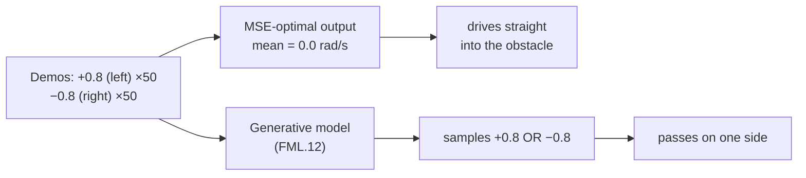

# FML.04 — Loss functions

<!-- glance:start -->
<!-- generated by tools/build.py from curriculum/syllabus.yaml — edit the syllabus, not this block -->

| | |
|---|---|
| **Track** | Optional foundation |
| **Difficulty** | Beginner |
| **Time** | 40 min |
| **Hardware** | none |
| **Software** | python |
| **Prerequisites** | [FML.02 Supervised learning: regression and classification](FML.02-supervised-learning.md) |
| **Skip if** | You know MSE vs cross-entropy and why. |

<!-- glance:end -->

## What you will learn

- Compute mean squared error, mean absolute error and Huber loss by hand and in numpy.
- Predict what a loss "wants": MSE pulls toward the mean, MAE toward the median — and what that does with glitchy sensor readings.
- Compute binary and softmax cross-entropy and explain why it replaces squared error for classification.
- Explain why MSE on multimodal robot demonstrations produces an action that crashes into the obstacle — the reason diffusion policies exist.
- Implement numerically stable softmax / cross-entropy and recognize the `NaN` symptoms of an unstable one.

## Why it matters

A loss function is the *only* thing a model is told about what "good" means. Everything the model learns, it learns to lower that one number. Choose the wrong loss and the model faithfully optimizes the wrong thing.

Robotics makes this concrete. A ToF sensor occasionally reports its maximum range when it misses the target; with MSE, three glitches out of twenty move your distance estimate by a metre. A human demonstrator passes an obstacle sometimes on the left, sometimes on the right; with MSE, the learned policy averages the two and drives straight into it. [18.02](../../18-embodied-ai/18.02-imitation-learning-behavior-cloning.md) (behavior cloning) and [18.05](../../18-embodied-ai/18.05-diffusion-policies.md) (diffusion policies) build directly on this lesson, and [16.05](../../16-machine-learning/16.05-learning-dynamics.md) chooses a loss for a motor model.

<!-- prereqs:start -->
## Prerequisites

You need these first:

- [FML.02 Supervised learning: regression and classification](FML.02-supervised-learning.md)

### Optional prerequisite links

None.

Check your readiness: `python course.py why FML.04`
<!-- prereqs:end -->

## Concept

### A loss is a price list for mistakes

Think of the loss as an SLA penalty clause. MSE says "small misses are nearly free, big misses are catastrophic" — the penalty grows with the square of the miss. MAE says "every centimetre costs the same". Huber says "small misses cost like MSE, big ones like MAE". Cross-entropy says "being confidently wrong is very expensive; being unsure is moderately expensive".

The model will do whatever minimizes the bill. So ask: *what behavior does this price list reward?*

### MSE wants the mean, MAE wants the median

The simplest possible model predicts one constant for everything. Which constant minimizes each loss?

- MSE → the **mean** of the targets.
- MAE → the **median**.

Twenty ToF readings of a wall at 1.20 m, three of them glitched to 8.19 m (the sensor returned its maximum when it lost the target): the mean is 2.25 m, the median is 1.20 m. A model trained with MSE on data with such outliers gets dragged toward them. Huber gets almost the median's robustness and keeps smooth gradients near zero error.

### Classification needs a different price list

In [FML.02](FML.02-supervised-learning.md) we classified by regressing onto +1/−1. That has a silly property: a corridor scan scored +3 ("very clearly a corridor") gets a squared error of $(3-1)^2 = 4$ — the model is *punished for being confidently right*. It spends its capacity pulling easy examples back to exactly +1 instead of fixing the hard ones.

Cross-entropy asks the model for a **probability** of the true class and charges $-\ln p$. Correct and confident ($p = 0.99$): 0.01. Unsure ($p = 0.5$): 0.69. Confidently wrong ($p = 0.01$): 4.6. Being more right never costs more.

### The averaging trap

Demonstrations: 50 times the operator turned left at +0.8 rad/s, 50 times right at −0.8 rad/s. Both are fine. MSE's best single answer is the mean: **0 rad/s — straight into the obstacle.** No amount of data or model size fixes this, because the *loss* rewards the average. Robots need models that can represent "left OR right", not "the average of left and right". That's what the generative models in [FML.12](FML.12-generative-models-diffusion.md) do.

> [!TIP]
> **Ask your teacher:** "Show me, with a 10-sample numerical example, why MSE on bimodal demonstrations gives the average action, and what a mixture or a diffusion model would output instead."

## Technical explanation

### Level 1 — The losses you'll meet

| Loss | Formula (per sample) | Use | Robot example |
|---|---|---|---|
| MSE (L2) | $(\hat y - y)^2$ | regression, Gaussian noise | motor speed, joint angles |
| MAE (L1) | $\lvert\hat y - y\rvert$ | regression with outliers | ToF distance with glitches; ACT uses L1 on actions |
| Huber | $\tfrac12 e^2$ if $\lvert e\rvert\le\delta$, else $\delta(\lvert e\rvert - \tfrac12\delta)$ | robust regression | odometry calibration with wheel slip |
| Binary cross-entropy | $-[y\ln p + (1-y)\ln(1-p)]$ | two classes | corridor vs room, grasp success |
| Softmax cross-entropy | $-\ln p_{\text{true}}$, $p = \mathrm{softmax}(z)$ | $K$ classes | object class; next action token in a VLA |

### Level 2 — Choosing in practice

1. Start with what the noise looks like. Roughly Gaussian (encoder noise) → MSE. Occasional wild outliers (ToF glitches, LiDAR dropouts, mislabeled frames) → Huber or MAE.
2. Units matter: MSE is in unit² (rad²/s²); report RMSE (same unit as the label) to humans.
3. Classification → cross-entropy on **logits** (raw scores), using the framework's combined function (`nn.CrossEntropyLoss`, `nn.BCEWithLogitsLoss`) for numerical stability.
4. If several different answers are all correct (multimodal), no pointwise regression loss works. Use classification over discretized actions, a mixture model, or a generative model.
5. The loss you train on and the metric you report can differ (train with cross-entropy, report precision/recall).

### Level 3 — Why these losses (the math)

**MSE = Gaussian maximum likelihood.** If $y = f(x) + \varepsilon$ with $\varepsilon \sim \mathcal N(0, \sigma^2)$ ([FM.14](../mathematics/FM.14-distributions-gaussians-noise.md)), the negative log-likelihood of one sample is

$$-\ln p(y\mid x) = \frac{(y - \hat y)^2}{2\sigma^2} + \tfrac12\ln(2\pi\sigma^2)$$

With σ fixed, minimizing it = minimizing squared error. *Numerical example:* ToF noise σ = 0.05 m, prediction 1.20 m, reading 1.25 m: NLL $= 0.05^2/(2\cdot0.05^2) + \tfrac12\ln(2\pi\cdot0.0025) = 0.5 - 2.077 = -1.577$.

**Why the mean and the median.** For a constant $c$: $\frac{d}{dc}\frac1N\sum(c - y_i)^2 = \frac2N\sum(c - y_i) = 0 \Rightarrow c = \bar y$. For MAE the derivative is $\frac1N\sum \mathrm{sign}(c - y_i)$, zero when as many points are above as below: the median. Gradient size also explains robustness: a residual of 3.0 m pushes MSE's gradient with strength $2\cdot 3 = 6$, MAE's with strength 1.

**Numerical example.** Residuals $e = [0.1, -0.2, 0.1, 3.0]$ m:
- MSE $= (0.01 + 0.04 + 0.01 + 9)/4 = 2.265$ — 99 % of it from the outlier.
- MAE $= (0.1 + 0.2 + 0.1 + 3.0)/4 = 0.85$.
- Huber, δ = 1: $[0.005, 0.02, 0.005, 1\cdot(3 - 0.5)] \to (0.005 + 0.02 + 0.005 + 2.5)/4 = 0.6325$.

**Cross-entropy from probabilities.** A classifier outputs logits $z_k$; softmax turns them into probabilities:

$$p_k = \frac{e^{z_k}}{\sum_j e^{z_j}}, \qquad L = -\ln p_{\text{true}}$$

*Numerical example:* classes (corridor, room, doorway), logits $z = [2.0, 0.5, -1.0]$. $e^z = [7.389, 1.649, 0.368]$, sum 9.406, $p = [0.786, 0.175, 0.039]$. If the truth is corridor: $L = -\ln 0.786 = 0.241$. If the truth is doorway: $L = -\ln 0.039 = 3.241$.

For two classes, softmax becomes the sigmoid $p = 1/(1 + e^{-z})$. Logit $z = 2.2$: $p = 0.900$; loss $0.105$ if the label is 1, $2.305$ if it is 0.

Cross-entropy is also maximum likelihood — of a categorical distribution — which is why the same loss trains an LLM's next token and a VLA's next action token ([18.07](../../18-embodied-ai/18.07-vision-language-action-models.md)).

### Level 4 — Numerical stability

- $e^{1000}$ overflows. Naive `np.exp(z) / np.exp(z).sum()` with logits [1000, 999, 998] returns `[nan nan nan]`. Subtracting the max logit first changes nothing mathematically (it cancels) and gives [0.665, 0.245, 0.090].
- $\ln 0 = -\infty$. A sigmoid of a logit 40 is exactly 1.0 in float64, so $-\ln(1 - p)$ = inf → `NaN` gradients. Compute the loss from the logit instead: $L = z + \ln(1 + e^{-z}) = 40.0$. PyTorch's `BCEWithLogitsLoss` and `CrossEntropyLoss` do this for you — pass logits, never probabilities.

## Diagram

```text
 loss                                         residual e = prediction − target
  4 |  MSE: e²          *                   *
    |                    *                 *
  3 |                     *               *
    |                      *             *
  2 |  MAE: |e|  .          *           *          .
    |              .         *         *         .
  1 |  Huber(δ=1)    . ooo    *       *    ooo .
    |                    . oo  **   **  oo .
  0 +-----------------------ooo***ooo---------------------
     -3     -2     -1        0        1      2      3
  Huber = MSE shape inside |e| ≤ 1, MAE slope outside: outliers stop dominating.
```



## Code

Save as `fml04_losses.py`, run `python fml04_losses.py` (numpy only, about a second).

```python
"""FML.04 — loss functions on robot data: MSE vs MAE vs Huber, cross-entropy, and the averaging trap."""
from __future__ import annotations

import numpy as np


def mse(pred: np.ndarray, target: np.ndarray) -> float:
    return float(np.mean((pred - target) ** 2))


def mae(pred: np.ndarray, target: np.ndarray) -> float:
    return float(np.mean(np.abs(pred - target)))


def huber(pred: np.ndarray, target: np.ndarray, delta: float) -> float:
    e = np.abs(pred - target)
    return float(np.mean(np.where(e <= delta, 0.5 * e ** 2, delta * (e - 0.5 * delta))))


def binary_cross_entropy(p_true_class: np.ndarray) -> np.ndarray:
    return -np.log(p_true_class)


def softmax(logits: np.ndarray) -> np.ndarray:
    z = logits - logits.max()  # numerical stability: shift so the largest logit is 0
    e = np.exp(z)
    return e / e.sum()


def best_constant(values: np.ndarray, loss, lo: float, hi: float, **kw) -> float:
    """Brute force: which single value minimizes the loss over all values? (0.1 mm / 0.1 mrad grid)"""
    candidates = np.arange(lo, hi, 1e-4)
    losses = [loss(np.full_like(values, c), values, **kw) for c in candidates]
    return float(candidates[int(np.argmin(losses))])


def main() -> None:
    rng = np.random.default_rng(7)

    # 1) Regression losses: 20 ToF readings of a wall at 1.20 m, three of them glitched to 8.19 m
    readings = 1.20 + rng.normal(0.0, 0.01, 20)
    readings[[4, 11, 17]] = 8.19
    print(f"mean {readings.mean():.3f} m   median {np.median(readings):.3f} m")
    print(f"best constant under MSE   : {best_constant(readings, mse, 1.0, 3.0):.3f} m")
    print(f"best constant under MAE   : {best_constant(readings, mae, 1.0, 3.0):.3f} m")
    print(f"best constant under Huber : {best_constant(readings, huber, 1.0, 3.0, delta=0.05):.3f} m")

    # 2) Classification losses: probability the model gave to the TRUE class
    for p in (0.99, 0.9, 0.6, 0.5, 0.1, 0.01):
        print(f"p(true)={p:4.2f}  cross-entropy={binary_cross_entropy(np.array(p)):.3f}")

    # squared error on +1/-1 targets punishes a confidently CORRECT score
    for score in (1.0, 3.0, -0.2):
        print(f"corridor (target +1), score {score:+.1f}: squared error {(score - 1.0) ** 2:.2f}")

    # 3) Softmax cross-entropy for 3 classes: corridor, room, doorway
    logits = np.array([2.0, 0.5, -1.0])
    probs = softmax(logits)
    print(f"softmax {np.round(probs, 3)}  CE if corridor {-np.log(probs[0]):.3f}  CE if doorway {-np.log(probs[2]):.3f}")

    # 4) The averaging trap: demonstrations pass an obstacle on the left OR on the right
    demos = np.concatenate([rng.normal(+0.8, 0.05, 50), rng.normal(-0.8, 0.05, 50)])  # yaw rate, rad/s
    print(f"MSE-optimal single command: {best_constant(demos, mse, -1.0, 1.0):+.3f} rad/s")


if __name__ == "__main__":
    main()
```

Output (Python 3.14, numpy 2.5):

```text
mean 2.246 m   median 1.200 m
best constant under MSE   : 2.246 m
best constant under MAE   : 1.200 m
best constant under Huber : 1.205 m
p(true)=0.99  cross-entropy=0.010
p(true)=0.90  cross-entropy=0.105
p(true)=0.60  cross-entropy=0.511
p(true)=0.50  cross-entropy=0.693
p(true)=0.10  cross-entropy=2.303
p(true)=0.01  cross-entropy=4.605
corridor (target +1), score +1.0: squared error 0.00
corridor (target +1), score +3.0: squared error 4.00
corridor (target +1), score -0.2: squared error 1.44
softmax [0.786 0.175 0.039]  CE if corridor 0.241  CE if doorway 3.241
MSE-optimal single command: -0.006 rad/s
```

The brute-force search confirms the calculus: the MSE optimum *is* the mean, the MAE optimum *is* the median, and on bimodal demonstrations the MSE optimum is ≈ 0 rad/s — a command none of the 100 demonstrators ever gave. Note the squared-error lines: score +3.0 (confidently correct) costs 4.00, more than score −0.2 (wrong!) at 1.44.

## Exercise

### Exercise FML.04-E1 — Losses by hand `[numerical]`

Hardware: none.

Residuals of a distance model: $e = [0.1, -0.2, 0.1, 3.0]$ m. Compute MSE, MAE and Huber with δ = 0.1 by hand. Then remove the outlier (3.0) and recompute MSE and MAE. By what factor did each drop?

### Exercise FML.04-E2 — Predict the MAE answer on bimodal demos `[predict]`

Hardware: none.

For the 100 left/right demonstrations in the script, predict the MAE-optimal constant command *before* running. Then add `best_constant(demos, mae, -1.0, 1.0)` to the script, and also print `mae(np.full_like(demos, c), demos)` for c in `np.linspace(-1, 1, 9)`. Does MAE solve the averaging trap?

### Exercise FML.04-E3 — Break and fix softmax `[debugging]`

Hardware: none.

1. Write `naive_softmax(z) = np.exp(z) / np.exp(z).sum()` and call it on `np.array([1000., 999., 998.])`. What do you get?
2. Call the script's `softmax` on the same input. Explain in one sentence why subtracting `z.max()` is mathematically allowed.
3. Compute the binary cross-entropy for logit $z = 40$ and label 0 in two ways: `-np.log(1 - sigmoid(z))` and `z + np.log1p(np.exp(-z))`.

### Exercise FML.04-E4 — Choose the loss `[predict]`

Hardware: none.

For each, pick a loss and justify in one sentence: (a) predicting wheel speed from duty with Gaussian encoder noise; (b) predicting distance from a ToF sensor whose training labels contain ~5 % glitched max-range values; (c) predicting which of 5 rooms the robot is in; (d) predicting the gripper's yaw for grasping a mug that can be approached from either side of its handle (two equally good yaws 180° apart).

## Expected result

- **FML.04-E1:** δ = 0.1: per-sample Huber $[0.005,\ 0.1(0.2 - 0.05) = 0.015,\ 0.005,\ 0.1(3.0 - 0.05) = 0.295]$, mean **0.080**. MSE 2.265, MAE 0.85. Without the outlier: MSE $= 0.06/3 = 0.020$ (dropped 113×), MAE $= 0.4/3 = 0.133$ (dropped 6.4×). MSE is far more sensitive to a single outlier.
- **FML.04-E2:** MAE's loss is *flat* between the two clusters: the printout shows 0.7972 for every c from −0.5 to +0.5 (0.9944 at −1, 1.0056 at +1). Any command between about −0.69 and +0.67 is "optimal" — the brute force returns −0.685, an arbitrary point on the flat stretch. MAE doesn't fix the trap: a single-valued prediction can't represent two modes.
- **FML.04-E3:** (1) `[nan nan nan]` with an overflow `RuntimeWarning`. (2) `[0.665 0.245 0.090]`; subtracting a constant from all logits multiplies numerator and denominator by the same $e^{-c}$. (3) `-np.log(1 - sigmoid(40))` → `inf` (sigmoid rounds to exactly 1.0, divide-by-zero warning); the logit form gives 40.0.
- **FML.04-E4:** (a) MSE — Gaussian noise, MSE is its maximum likelihood; (b) Huber or MAE — robust to the glitched labels (or clean the labels); (c) softmax cross-entropy over 5 classes; (d) not MSE/MAE on raw yaw (would average to a yaw pointing at the handle's side) — use a multimodal model (classification over yaw bins, a mixture, or a generative model), or a symmetry-aware loss like $\min(\lvert e\rvert, \lvert e - \pi\rvert)$.

## Troubleshooting

### Symptom: training loss becomes `nan` or `inf`

1. Print the loss every step; find the first bad step.
2. Classification: are you taking `log` of a probability that can hit 0 or 1? Switch to a logits-based loss (`BCEWithLogitsLoss`, `CrossEntropyLoss`, or the log-sum-exp form).
3. Regression: are the labels in huge units (mm instead of m, 1e4 values)? Squared errors overflow and gradients explode. Scale labels.
4. Still unstable: the learning rate is too high ([FML.05](FML.05-gradient-descent.md)).

### Symptom: regression model is consistently offset toward outliers

1. Plot the residual histogram. A long tail or a spike at a sensor limit (4.0 m, 8.19 m, 12 m) means glitches.
2. Remove impossible labels if you can justify it, or switch to Huber.
3. Re-check: after the change, is the median residual near 0?

### Symptom: a behavior-cloned policy hesitates or drives into obstacles that demonstrators avoided

1. Plot the demonstrated actions for similar observations. Two clusters → multimodality.
2. MSE/L1 regression is averaging them. Options: add information that disambiguates (goal side), discretize actions and use cross-entropy, or use a generative policy ([18.05](../../18-embodied-ai/18.05-diffusion-policies.md)).

## Common mistakes

- **Passing probabilities to a loss that expects logits** (e.g., applying softmax before `nn.CrossEntropyLoss`). It still "trains", but worse and with odd gradients.
- **Reporting MSE to humans.** Say "RMSE 0.3 rad/s", not "MSE 0.09 rad²/s²".
- **Using MSE with glitchy labels** without checking the residual distribution.
- **Regressing onto class labels** (+1/−1 or 0/1 with MSE) instead of cross-entropy.
- **Assuming more data fixes multimodality.** The mean of more left/right demos is still straight ahead.

## Knowledge check

1. Which constant minimizes MSE over a set of targets, and which minimizes MAE?
   <details><summary>Answer</summary>

   MSE: the mean. MAE: the median (any value between the two middle values when the count is even).
   </details>

2. Twenty readings at 1.20 m plus three glitches at 8.19 m. Roughly what does an MSE-trained constant predict, and what does an MAE-trained one predict?
   <details><summary>Answer</summary>

   MSE: the mean ≈ 2.25 m (the lesson's data gives 2.246). MAE: the median = 1.20 m.
   </details>

3. Logits [2.0, 0.5, −1.0], true class index 0. Compute the cross-entropy.
   <details><summary>Answer</summary>

   Softmax = [0.786, 0.175, 0.039]; loss = −ln 0.786 = 0.241.
   </details>

4. Why is squared error on +1/−1 targets a poor classification loss?
   <details><summary>Answer</summary>

   It penalizes confident correct predictions (score +3 for a +1 target costs 4), so the model wastes effort on easy examples. Cross-entropy never charges more for being more right.
   </details>

5. Predict: a policy is trained with MSE on demonstrations that avoid a centred obstacle 50 % left (+0.8 rad/s), 50 % right (−0.8 rad/s). What does it command, and what happens?
   <details><summary>Answer</summary>

   ≈ 0 rad/s, the mean: it drives straight into the obstacle — an action no demonstrator took.
   </details>

6. Your loss is `nan` after 300 steps of training a grasp-success classifier that computes `-log(sigmoid(z))`. Most likely cause and fix?
   <details><summary>Answer</summary>

   The sigmoid saturated to exactly 0 or 1 for a large |z|, giving log(0). Compute the loss from logits with a stable formula (`BCEWithLogitsLoss` / log-sum-exp).
   </details>

7. What probabilistic assumption makes MSE the "right" loss?
   <details><summary>Answer</summary>

   Additive Gaussian noise with constant variance on the target: minimizing MSE is maximizing the Gaussian likelihood.
   </details>

## Practical challenge

Implement a **mixture-of-two-Gaussians** output for the left/right obstacle demos, trained by minimizing negative log-likelihood with gradient descent (numerical gradients are fine for 5 parameters: two means, two log-standard-deviations, one mixing logit). Compare with the MSE solution.

Acceptance criteria:
- The fitted means are within 0.05 rad/s of +0.8 and −0.8, mixing weight 0.5 ± 0.1.
- Sampling 1000 commands from the mixture: fewer than 2 % have |command| < 0.3 rad/s.
- One paragraph: why this works here, and why it gets hard for 7-joint arm actions over 50 time steps (which is the motivation for [FML.12](FML.12-generative-models-diffusion.md)).

## You can skip this if…

You can answer knowledge-check questions 3, 5 and 6 without looking, and you know why `CrossEntropyLoss` takes logits. Then: `python course.py skip FML.04 --reason "know MSE vs cross-entropy and why"`.

## Go deeper

- Dive into Deep Learning, "Linear Neural Networks for Classification" and softmax regression — https://d2l.ai/chapter_linear-regression/index.html — from the same book: squared loss as maximum likelihood; follow on to the classification chapter for cross-entropy.
- Stanford CS231n notes, "Linear classification" — https://cs231n.github.io/linear-classify/ — softmax, cross-entropy and the numeric-stability trick, with interactive intuition.
- Understanding Deep Learning (Prince), chapter 5 "Loss functions" — https://udlbook.github.io/udlbook/ — free book; derives every loss here from maximum likelihood.
- Diffusion Policy (Chi et al., 2023) — https://arxiv.org/abs/2303.04137 — section on multimodal action distributions: the averaging trap as a real robotics result.
- Karpathy, Neural Networks: Zero to Hero — https://karpathy.ai/zero-to-hero.html — the makemore videos build cross-entropy from counts and show the `log(0)` pitfalls live.

## Progress checkpoint

- [ ] I can compute MSE, MAE, Huber and cross-entropy by hand for a few samples.
- [ ] I can predict which constant each regression loss prefers and what outliers do to it.
- [ ] I can explain why cross-entropy, on logits, is the classification loss.
- [ ] I can explain the averaging trap on multimodal demonstrations.
- [ ] I can recognize and fix numerically unstable softmax/log losses.

`python course.py complete FML.04` (exercises done) · `python course.py master FML.04` (challenge done) · `python course.py struggle FML.04 "what was hard"`.

Next: [FML.05 — Gradient descent](FML.05-gradient-descent.md).
