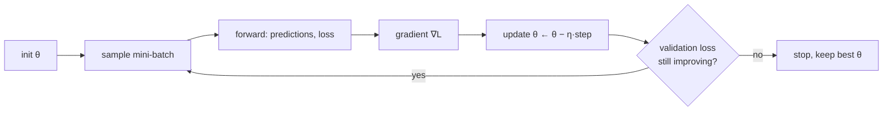

# FML.05 — Gradient descent

<!-- glance:start -->
<!-- generated by tools/build.py from curriculum/syllabus.yaml — edit the syllabus, not this block -->

| | |
|---|---|
| **Track** | Optional foundation |
| **Difficulty** | Intermediate |
| **Time** | 50 min |
| **Hardware** | none |
| **Software** | python, numpy |
| **Prerequisites** | [FML.04 Loss functions](FML.04-loss-functions.md) |
| **Optional prerequisites** | [FM.17 Calculus for robots: derivatives, rates and partial derivatives](../mathematics/FM.17-derivatives.md) |
| **Skip if** | You have implemented gradient descent by hand. |

<!-- glance:end -->

## What you will learn

- Derive the gradient of the MSE loss for a linear model and take one gradient-descent step by hand.
- Implement batch gradient descent, mini-batch SGD and Adam from scratch in numpy.
- Choose a learning rate: see convergence, slow crawling, oscillation and divergence, and compute the divergence limit.
- Explain why feature scaling makes gradient descent 40× more tolerant, and why Adam copes with unscaled features.
- Read a loss curve and decide what to change.

## Why it matters

Least squares has a closed-form answer ([FML.02](FML.02-supervised-learning.md)). Almost nothing else does: not a neural network, not a detector, not a diffusion policy. Every one of those is trained by some version of gradient descent — repeatedly nudging millions of parameters downhill on the loss.

When you fine-tune a detector in [16.03](../../16-machine-learning/16.03-fine-tuning-a-detector.md) or train a policy with LeRobot in [18.06](../../18-embodied-ai/18.06-train-first-policy-lerobot.md), you'll set a learning rate, pick an optimizer (usually Adam/AdamW), and watch a loss curve. Policy gradients in [17.05](../../17-reinforcement-learning/17.05-policy-gradients.md) are gradient *ascent* on expected reward. This lesson makes those knobs concrete on a problem small enough to see everything: the motor model.

<!-- prereqs:start -->
## Prerequisites

You need these first:

- [FML.04 Loss functions](FML.04-loss-functions.md)

### Optional prerequisite links

New to any of these? Take the foundation lesson first; skip it if you already know it.

- [FM.17 Calculus for robots: derivatives, rates and partial derivatives](../mathematics/FM.17-derivatives.md)

Check your readiness: `python course.py why FML.05`
<!-- prereqs:end -->

## Concept

### Walking downhill in fog

You stand on a hillside in thick fog and want to reach the valley floor. You can't see the valley, but you can feel the slope under your feet. Strategy: take a step in the steepest downhill direction, feel again, repeat.

- The **position** is the parameter vector (for the motor model: slope and intercept).
- The **height** is the loss.
- The **slope under your feet** is the gradient: the vector of partial derivatives of the loss with respect to each parameter ([FM.17](../mathematics/FM.17-derivatives.md)).
- The **step length** is the learning rate times the gradient.

Too short a step and you need all day. Too long and you overshoot the valley, land higher on the other side, and — if steps are long enough — bounce out of the valley altogether.

### Why not just try all parameter values?

With 2 parameters and 1000 candidate values each, that's 10⁶ loss evaluations. A small CNN has 7,000 parameters; SmolVLA has ~450 million. Gradients tell you, from one computation, which way to move *every* parameter at once.

### Three refinements you'll always see

- **Mini-batch SGD:** feel the slope using a random handful of examples (a mini-batch) instead of all of them. Noisier, much cheaper per step, and it's how every large model is trained.
- **Momentum:** keep some of the previous step's direction, like a ball rolling downhill. It speeds through long, gentle valleys and damps zig-zagging.
- **Adam:** momentum plus an automatic, per-parameter step size, so parameters with big gradients don't dominate. The default optimizer for deep learning, including robot policies.

> [!TIP]
> **Ask your teacher:** "Draw me a 2D loss landscape as contour lines for a badly scaled problem, show the zig-zag path of gradient descent, and then show what momentum and Adam do differently."

## Technical explanation

### Level 1 — The update rule

$$\theta \leftarrow \theta - \eta\, \nabla_\theta L(\theta)$$

$\eta$ (eta) is the **learning rate**. That's the whole algorithm. Everything else is about computing $\nabla L$ cheaply and choosing $\eta$ well.

### Level 2 — Practical knobs

| Knob | Typical value | Symptom if wrong |
|---|---|---|
| Learning rate (SGD) | 0.01–0.1 on scaled data | too low: loss crawls; too high: loss oscillates or goes to `inf` |
| Learning rate (Adam) | 1e-3 (networks), up to 0.3 on tiny convex problems | too high: loss spikes; too low: slow |
| Batch size | 32–256 | tiny: very noisy loss; huge: few updates per epoch |
| Epochs | until validation loss stops improving | too many: overfitting ([FML.03](FML.03-train-validation-test.md)) |
| Feature scaling | mean 0, std 1 | unscaled: plain GD needs a tiny learning rate and crawls |

**Epoch** = one pass over the training data. With 300 samples and batch 32, one epoch is 10 updates.

### Level 3 — The math

**Gradient of MSE for a linear model.** With feature matrix $X$ (bias column included), $L(w) = \frac1N\lVert Xw - y\rVert^2$. Its gradient is

$$\nabla_w L = \frac{2}{N} X^\top (Xw - y)$$

**One step by hand.** The three samples from FML.02: $u = 3, 6, 9$ V, $y = 2.7, 7.5, 12.3$ rad/s, $X = [[3,1],[6,1],[9,1]]$, start $w = (0, 0)$, $\eta = 0.01$.

- Predictions $Xw = (0,0,0)$, errors $= -y$. Loss $= (2.7^2 + 7.5^2 + 12.3^2)/3 = 71.61$.
- $X^\top(Xw - y) = -X^\top y = -(163.8,\ 22.5)$, so $\nabla L = \frac23 \cdot (-163.8, -22.5) = (-109.2,\ -15.0)$.
- $w \leftarrow (0,0) - 0.01 \cdot (-109.2, -15.0) = (1.092,\ 0.150)$.
- New predictions $(3.426, 6.702, 9.978)$, new loss $= 2.185$. One step removed 97 % of the loss.

**How big can the learning rate be?** For a quadratic loss the curvature is the Hessian $H = \frac2N X^\top X$. Gradient descent converges only if

$$\eta < \frac{2}{\lambda_{\max}(H)}$$

where $\lambda_{\max}$ is the largest eigenvalue. Beyond that, the error along the steepest direction is multiplied by $\lvert 1 - \eta\lambda\rvert > 1$ every step and explodes.

*Numerical example (the script's motor data).* Standardized feature: $\lambda_{\max} = 2.00$ → diverges for $\eta > 1.0$. At exactly $\eta = 1.0$, $\lvert 1 - \eta\lambda\rvert = 1$: the parameters jump between 0 and twice the optimum forever. Unscaled feature ($u$ in volts, 0–12.6): eigenvalues 0.52 and 83.4 → diverges for $\eta > 0.024$, but the flat direction only shrinks by $(1 - 0.012 \cdot 0.52) = 0.994$ per step at $\eta = 0.012$. The ratio 83.4/0.52 = 161 is the **condition number**; large means slow plain gradient descent.

**Momentum:**
$$v \leftarrow \beta v + \nabla L, \qquad \theta \leftarrow \theta - \eta v \quad (\beta \approx 0.9)$$

**Adam** keeps running averages of the gradient ($m$) and the squared gradient ($v$), corrects their start-up bias, and divides:

$$m \leftarrow \beta_1 m + (1-\beta_1) g,\quad v \leftarrow \beta_2 v + (1-\beta_2) g^2,\quad
\hat m = \frac{m}{1-\beta_1^t},\ \hat v = \frac{v}{1-\beta_2^t},\quad
\theta \leftarrow \theta - \eta \frac{\hat m}{\sqrt{\hat v} + \epsilon}$$

*Numerical example, first step* ($t = 1$, $\beta_1 = 0.9$, $\beta_2 = 0.999$): $m = 0.1g$, $\hat m = g$; $v = 0.001g^2$, $\hat v = g^2$; step $= \eta\, g / \lvert g\rvert = \eta \cdot \mathrm{sign}(g)$. With $\eta = 0.3$ and gradients $(-109.2, -15.0)$, both parameters move by exactly +0.3, whatever the gradient's size. That per-parameter normalization is why Adam is insensitive to feature scale.

### Level 4 — Implementation notes

- **Vectorize the gradient** (`X.T @ err`), never loop over samples in Python.
- **Shuffle every epoch** for SGD so mini-batches aren't correlated (robot logs are time-ordered!).
- **Log the loss every N steps** and plot it (log scale). It's your only window into training.
- **Stop on validation loss**, not training loss.
- In PyTorch ([FML.07](FML.07-backprop-pytorch.md)) the three lines of Adam become `torch.optim.Adam(model.parameters(), lr=1e-3)`; the ideas are identical.

## Diagram

```text
Loss contours (top view) for an unscaled problem: long, narrow valley

   w_bias ▲
          │   ╭───────────────────────────────────────╮
          │  ╭┼──────────────────────────────────────╮│
          │ ╭┼┼──────────────── * minimum ──────────╮││
          │  ╰┼──────────────────────────────────────╯│
          │   ╰───────────────────────────────────────╯
          └──────────────────────────────────────────────► w_slope
   plain GD:  ↘↗↘↗↘↗↘↗→→→→→→→  zig-zags across the narrow direction, crawls along the long one
   momentum:  ↘↗↘→→→→→→→→      zig-zags cancel, speed builds along the valley
   Adam:      ↘→→→→→           each parameter gets its own step size
```



## Code

Save as `fml05_gradient_descent.py`, run `python fml05_gradient_descent.py` (numpy only, under a second). The feature is the effective motor voltage $d \cdot V$; the model is the line from FML.02.

```python
"""FML.05 — gradient descent, SGD and Adam from scratch in numpy, on the motor model."""
from __future__ import annotations

import numpy as np


def motor_dataset(rng: np.random.Generator, n: int) -> tuple[np.ndarray, np.ndarray]:
    duty = rng.uniform(0.0, 1.0, n)
    volts = rng.uniform(9.9, 12.6, n)
    speed = np.clip(1.6 * np.maximum(0.0, duty * volts - 1.3), 0.0, 18.0) + rng.normal(0.0, 0.3, n)
    return (duty * volts)[:, None], speed  # one feature: effective motor voltage duty*volts (V)


def standardize(x: np.ndarray, mean: np.ndarray, std: np.ndarray) -> np.ndarray:
    return (x - mean) / std


def with_bias(x: np.ndarray) -> np.ndarray:
    return np.column_stack([x, np.ones(len(x))])


def loss_and_grad(w: np.ndarray, x: np.ndarray, y: np.ndarray) -> tuple[float, np.ndarray]:
    """MSE loss L = mean((Xw - y)^2) and its gradient dL/dw = 2/N * X^T (Xw - y)."""
    err = x @ w - y
    return float(np.mean(err ** 2)), 2.0 / len(y) * (x.T @ err)


def gradient_descent(x: np.ndarray, y: np.ndarray, lr: float, steps: int) -> tuple[np.ndarray, list[float]]:
    w = np.zeros(x.shape[1])
    history = []
    for _ in range(steps):
        loss, grad = loss_and_grad(w, x, y)
        history.append(loss)
        w = w - lr * grad
    return w, history


def sgd(x: np.ndarray, y: np.ndarray, lr: float, epochs: int, batch: int, rng: np.random.Generator) -> np.ndarray:
    w = np.zeros(x.shape[1])
    for _ in range(epochs):
        order = rng.permutation(len(y))
        for start in range(0, len(y), batch):
            idx = order[start:start + batch]
            _, grad = loss_and_grad(w, x[idx], y[idx])
            w -= lr * grad
    return w


def adam(x: np.ndarray, y: np.ndarray, lr: float, steps: int,
         beta1: float = 0.9, beta2: float = 0.999, eps: float = 1e-8) -> tuple[np.ndarray, list[float]]:
    w = np.zeros(x.shape[1])
    m = np.zeros_like(w)  # running mean of gradients (momentum)
    v = np.zeros_like(w)  # running mean of squared gradients (per-parameter scale)
    history = []
    for t in range(1, steps + 1):
        loss, g = loss_and_grad(w, x, y)
        history.append(loss)
        m = beta1 * m + (1 - beta1) * g
        v = beta2 * v + (1 - beta2) * g ** 2
        m_hat, v_hat = m / (1 - beta1 ** t), v / (1 - beta2 ** t)
        w -= lr * m_hat / (np.sqrt(v_hat) + eps)
    return w, history


def main() -> None:
    rng = np.random.default_rng(42)
    x_raw, y = motor_dataset(rng, 300)
    mean, std = x_raw.mean(axis=0), x_raw.std(axis=0)
    x = with_bias(standardize(x_raw, mean, std))

    w_exact, *_ = np.linalg.lstsq(x, y, rcond=None)
    best = float(np.mean((x @ w_exact - y) ** 2))
    print(f"closed-form least squares: w={np.round(w_exact, 3)}  MSE={best:.4f}")
    slope = w_exact[0] / std[0]
    print(f"  in physical units: speed = {slope:.3f} rad/s per V * (duty*volts) + {w_exact[1] - slope * mean[0]:.3f}")

    curvature = np.linalg.eigvalsh(2.0 / len(y) * x.T @ x).max()
    print(f"largest curvature {curvature:.2f} -> GD diverges for lr > {2 / curvature:.3f}")

    for lr in (0.05, 0.5, 1.0, 1.1):
        w, hist = gradient_descent(x, y, lr, steps=50)
        print(f"GD lr={lr:<4}  loss after 1/5/50 steps: {hist[1]:10.4g} {hist[5]:10.4g} {hist[-1]:10.4g}  w={np.round(w, 3)}")

    w_sgd = sgd(x, y, lr=0.02, epochs=30, batch=32, rng=rng)
    print(f"SGD (batch 32, 30 epochs): w={np.round(w_sgd, 3)}  MSE={np.mean((x @ w_sgd - y) ** 2):.4f}")

    # unscaled features: plain GD needs a 40x smaller lr and crawls; Adam rescales each parameter
    x_unscaled = with_bias(x_raw)
    curv_raw = np.linalg.eigvalsh(2.0 / len(y) * x_unscaled.T @ x_unscaled).max()
    lr_raw = 1.0 / curv_raw
    _, hist_gd = gradient_descent(x_unscaled, y, lr_raw, steps=2000)
    _, hist_adam = adam(x_unscaled, y, lr=0.3, steps=2000)
    for name, hist in ((f"GD   lr={lr_raw:.4f}", hist_gd), ("Adam lr=0.3   ", hist_adam)):
        print(f"unscaled, {name}: MSE after 20/100/200/2000 steps "
              f"{hist[20]:.3f} {hist[100]:.3f} {hist[200]:.3f} {hist[-1]:.3f}")


if __name__ == "__main__":
    main()
```

Output (Python 3.14, numpy 2.5):

```text
closed-form least squares: w=[5.077 6.806]  MSE=0.2066
  in physical units: speed = 1.545 rad/s per V * (duty*volts) + -1.678
largest curvature 2.00 -> GD diverges for lr > 1.000
GD lr=0.05  loss after 1/5/50 steps:      58.61      25.35      0.209  w=[5.051 6.771]
GD lr=0.5   loss after 1/5/50 steps:     0.2066     0.2066     0.2066  w=[5.077 6.806]
GD lr=1.0   loss after 1/5/50 steps:       72.3       72.3       72.3  w=[-0.  0.]
GD lr=1.1   loss after 1/5/50 steps:        104      446.6  4.146e+09  w=[-46195.775 -61932.071]
SGD (batch 32, 30 epochs): w=[5.086 6.809]  MSE=0.2067
unscaled, GD   lr=0.0120: MSE after 20/100/200/2000 steps 0.912 0.467 0.282 0.207
unscaled, Adam lr=0.3   : MSE after 20/100/200/2000 steps 5.698 0.207 0.207 0.207
```

Reading it:
- `lr=0.5` on this perfectly scaled problem is the ideal step ($\eta = 1/\lambda$): one step lands on the optimum.
- `lr=1.0` sits exactly on the stability edge: the loss never changes, the parameters bounce.
- `lr=1.1` is 10 % past the edge and reaches $10^9$ in 50 steps.
- SGD with noisy mini-batches reaches practically the same weights as the closed form.
- The learned physical model, 1.545 rad/s per volt with the motor starting at $1.678/1.545 = 1.09$ V, is close to the generator's truth (1.6 rad/s per volt, 1.3 V deadband): the straight line compromises around the deadband bend.
- On unscaled features, plain GD's best-safe learning rate still needs ~450 steps to get within 2 % of the optimum; Adam needs ~75.

## Exercise

### Exercise FML.05-E1 — One step by hand `[numerical]`

Hardware: none.

Starting from $w = (1.092, 0.150)$ (after the first step in Level 3), compute the second gradient-descent step with $\eta = 0.01$ on the three samples. Report the new $w$ and the loss. Check with `loss_and_grad` from the script.

### Exercise FML.05-E2 — Predict the learning-rate behavior `[predict]`

Hardware: none.

For the standardized problem ($\lambda_{\max} = 2.0$), predict for $\eta = 0.25$, $0.75$ and $0.99$: converges monotonically, converges while oscillating, or diverges? Then run `gradient_descent(x, y, lr, steps=50)` for each and print the loss after steps 1, 2, 3 and 50.

### Exercise FML.05-E3 — Add momentum `[coding]`

Hardware: none.

Implement `momentum(x, y, lr, steps, beta=0.9)` in the script. On the **unscaled** features, find how many steps each method needs to get the MSE below 0.21: plain GD with $\eta = 0.012$ and $0.02$, momentum with $\eta = 0.01$, Adam with $\eta = 0.3$. Also try plain GD with $\eta = 0.025$.

### Exercise FML.05-E4 — Read the loss curve `[debugging]`

Hardware: none.

A teammate trains a small network on logged wheel data and sends you three loss logs (loss printed every 100 steps). Diagnose each and suggest one change:
- (a) `12.1, 11.9, 11.8, 11.6, 11.5, 11.4 …`
- (b) `3.2, 0.9, 5.6, 0.4, 18.3, nan`
- (c) `2.1, 0.6, 0.31, 0.30, 0.30, 0.30` with validation `2.2, 0.7, 0.45, 0.52, 0.61, 0.70`

## Expected result

- **FML.05-E1:** predictions $Xw = (3.426, 6.702, 9.978)$, errors $(0.726, -0.798, -2.322)$; $X^\top e = (2.178 - 4.788 - 20.898,\ 0.726 - 0.798 - 2.322) = (-23.508,\ -2.394)$; $\nabla L = \frac23 \cdot$ that $= (-15.672,\ -1.596)$; new $w = (1.24872,\ 0.16596)$, loss $= 0.765$. The script's `loss_and_grad` gives the same numbers. The first step removed 97 % of the loss, the second only 65 % of what was left: the steep direction (slope) is nearly solved, the flat direction (intercept) crawls.
- **FML.05-E2:** contraction factor $\lvert 1 - \eta\lambda\rvert$ = 0.5 for η = 0.25, 0.5 for η = 0.75, 0.98 for η = 0.99. Output: η = 0.25 and η = 0.75 print *identical* losses, `18.23 4.713 1.333 … 0.2066` — same factor 0.5, but 0.25 approaches the minimum from one side while 0.75 overshoots and alternates sides (print `w` to see it). η = 0.99 oscillates and barely converges: `69.45 66.71 64.07 …` and still 9.77 after 50 steps. None diverge; divergence needs $\eta > 1.0$.
- **FML.05-E3:** tested: GD η=0.012 → 449 steps; GD η=0.02 → 269 steps; GD η=0.025 → diverges (above $2/83.4 = 0.024$); momentum η=0.01 → 56 steps; Adam η=0.3 → 74 steps. Your exact counts may differ by a few steps if you define "below 0.21" at a different index; the ranking shouldn't change.
- **FML.05-E4:** (a) learning rate too low (or unscaled features) — raise η ×3–10 or standardize; (b) learning rate too high: oscillating, then exploding to `nan` — lower η ×3–10 (and check for label outliers); (c) training fine, validation rising after the 3rd log: overfitting — stop earlier (keep the checkpoint with lowest validation loss), add data or regularization.

## Troubleshooting

### Symptom: the loss goes up, or becomes `inf`/`nan`

1. Lower the learning rate by 10×. If that fixes it, search upward by factors of 3.
2. Standardize features (and labels in odd units). Compute the largest curvature if the model is linear.
3. Check the gradient sign: `w = w - lr * grad`, not `+`.
4. Check for outliers producing huge errors (see [FML.04](FML.04-loss-functions.md)); consider Huber loss.

### Symptom: the loss decreases but painfully slowly

1. Plot the loss on a log axis. A straight, shallow line = learning rate too small or bad conditioning.
2. Standardize features; try momentum or Adam.
3. Check whether you're at the noise floor already (MSE ≈ σ²): then nothing is wrong.

### Symptom: SGD loss is very noisy

1. Noise per step is normal; compare epoch averages.
2. Increase the batch size or decrease the learning rate.
3. Make sure data are shuffled each epoch — time-ordered robot logs make consecutive batches all "fast driving" then all "slow driving".

## Common mistakes

- **Forgetting to scale features**, then using a tiny learning rate and concluding "gradient descent is slow".
- **Using one learning rate for every problem.** Adam's 1e-3 default is for networks; tiny convex problems can take far more.
- **Judging training by the last loss value** instead of the curve and the validation loss.
- **Not shuffling** time-ordered data for SGD.
- **Confusing epochs and steps** when comparing runs with different batch sizes.

## Knowledge check

1. Write the gradient-descent update rule and name each symbol.
   <details><summary>Answer</summary>

   $\theta \leftarrow \theta - \eta \nabla_\theta L(\theta)$: θ the parameters, η the learning rate, ∇L the gradient of the loss with respect to the parameters.
   </details>

2. For $L = \frac1N\lVert Xw - y\rVert^2$, what is $\nabla_w L$?
   <details><summary>Answer</summary>

   $\frac{2}{N}X^\top(Xw - y)$.
   </details>

3. The largest Hessian eigenvalue is 83.4. Above which learning rate does plain GD diverge?
   <details><summary>Answer</summary>

   $2/83.4 = 0.024$.
   </details>

4. Predict: on a problem with $\lambda_{\max} = 2$, what happens at exactly $\eta = 1.0$?
   <details><summary>Answer</summary>

   $\lvert 1 - \eta\lambda\rvert = 1$: the error along that direction flips sign each step without shrinking. The loss stays constant and the parameters oscillate forever (the script's `lr=1.0` line).
   </details>

5. What is the size of Adam's very first update for each parameter, and why?
   <details><summary>Answer</summary>

   ≈ η for every parameter with a nonzero gradient (η·sign(g)): bias correction makes $\hat m = g$ and $\hat v = g^2$ at t = 1, so $\hat m/\sqrt{\hat v} = \pm 1$.
   </details>

6. Your SGD run on robot logs shows the loss alternating between low and high every few hundred steps in a regular pattern. What's the likely bug?
   <details><summary>Answer</summary>

   Data not shuffled: batches follow the time order of the logs (e.g. stretches of fast driving then slow driving), so the model keeps re-adapting. Shuffle each epoch.
   </details>

7. Why does standardizing features help plain gradient descent so much?
   <details><summary>Answer</summary>

   It makes the loss landscape round instead of a narrow valley (condition number near 1), so a single learning rate is good for all directions. Unscaled, the safe learning rate is set by the steepest direction and the flat direction crawls.
   </details>

## Practical challenge

Train **logistic regression** for the corridor/room classifier from [FML.02](FML.02-supervised-learning.md) with gradient descent and binary cross-entropy, from scratch in numpy. Use the two engineered span features, standardized. Derive (or look up) the gradient $\nabla_w L = \frac1N X^\top(\sigma(Xw) - y)$ with labels 0/1, verify it with finite differences on 3 samples, then train with Adam.

Acceptance criteria:
- Gradient check: relative error between analytic and finite-difference gradient < 1e-6.
- Test accuracy ≥ 0.97 on 400 test scans, and a printed loss curve (every 100 steps) that decreases.
- A one-paragraph comparison with the least-squares classifier from FML.02: accuracy, and what the output now means (a probability).

## You can skip this if…

You can answer knowledge-check questions 3, 4 and 5 without looking and you have implemented gradient descent by hand before. Then: `python course.py skip FML.05 --reason "implemented gradient descent by hand"`.

## Go deeper

- 3Blue1Brown, Neural networks series (chapter "Gradient descent, how neural networks learn") — https://www.3blue1brown.com/topics/neural-networks — the best visual intuition for this lesson.
- Dive into Deep Learning, "Optimization Algorithms" — https://d2l.ai/chapter_optimization/index.html — GD, SGD, momentum, Adam with runnable code and convergence plots.
- Stanford CS231n notes, "Optimization: stochastic gradient descent" — https://cs231n.github.io/optimization-2/ — gradients and backprop intuition, continuing into FML.07.
- Kingma & Ba, "Adam: A Method for Stochastic Optimization" (2014) — https://arxiv.org/abs/1412.6980 — the original paper; section 2 is the algorithm box you implemented.
- FM.20 in this course — [Optimization basics](../mathematics/FM.20-optimization-basics.md) — the same ideas extended to Gauss–Newton and Levenberg–Marquardt, used in SLAM and calibration.

## Progress checkpoint

- [ ] I can compute a gradient-descent step by hand for a linear model.
- [ ] I implemented GD, SGD and Adam in numpy.
- [ ] I can predict convergence, oscillation or divergence from the learning rate and curvature.
- [ ] I can explain why feature scaling matters and what Adam does about it.
- [ ] I can diagnose a loss curve and say what to change.

`python course.py complete FML.05` (exercises done) · `python course.py master FML.05` (challenge done) · `python course.py struggle FML.05 "what was hard"`.

Next: [FML.06 — Neural networks from zero](FML.06-neural-networks.md).
