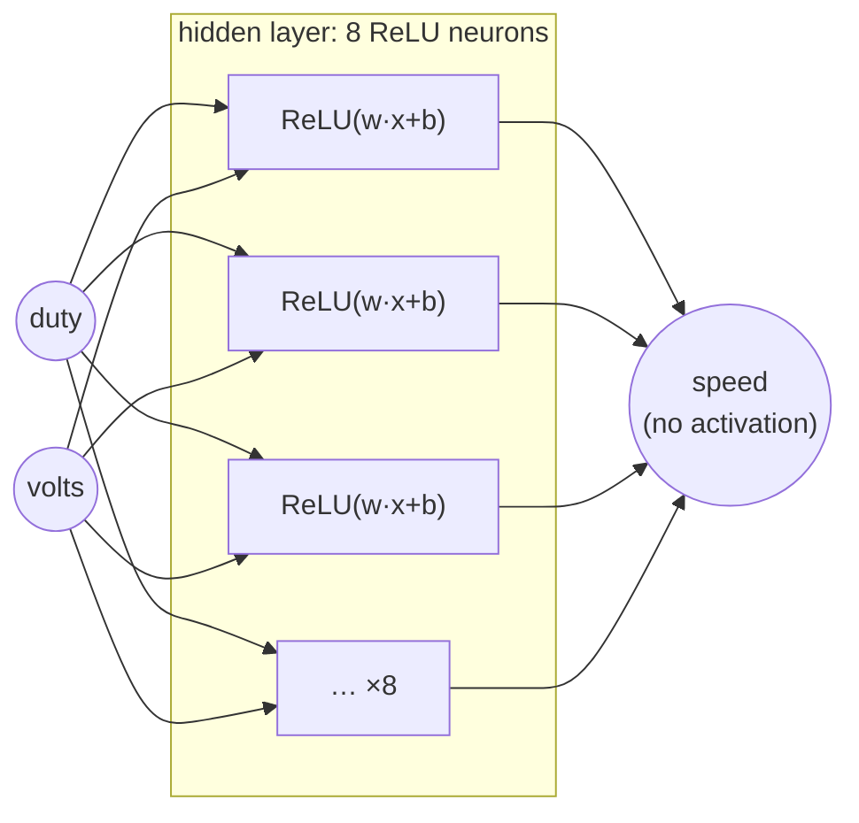

# FML.06 — Neural networks from zero

<!-- glance:start -->
<!-- generated by tools/build.py from curriculum/syllabus.yaml — edit the syllabus, not this block -->

| | |
|---|---|
| **Track** | Optional foundation |
| **Difficulty** | Intermediate |
| **Time** | 1 h |
| **Hardware** | none |
| **Software** | python, numpy |
| **Prerequisites** | [FML.05 Gradient descent](FML.05-gradient-descent.md) |
| **Optional prerequisites** | [FM.07 Matrices and matrix multiplication](../mathematics/FM.07-matrices.md) |
| **Skip if** | You can build an MLP from scratch. |

<!-- glance:end -->

## What you will learn

- Compute the output of a neuron and of a small multi-layer perceptron (MLP) by hand.
- Explain why a nonlinear activation (ReLU) is essential, and show that stacked linear layers collapse into one.
- Read a network's shape (inputs, hidden width, outputs) and count its parameters.
- Build and train a 2-8-1 MLP in plain numpy that learns a motor deadband a linear model can't represent.
- Explain why training with numerical gradients doesn't scale, setting up backpropagation.

## Why it matters

In [FML.02](FML.02-supervised-learning.md) a linear model hit a wall: it couldn't bend at the motor's deadband unless *you* hand-designed the bend as a feature. Neural networks learn such bends themselves. That's the whole point: a family of functions flexible enough to fit deadbands, friction, camera pixels or grasp motions, trained with the same gradient descent you just built ([FML.05](FML.05-gradient-descent.md)).

Every learned model later in the course is built from the pieces in this lesson. The CNN in [13.09](../../13-computer-vision/13.09-cnns-for-robot-vision.md) ends in an MLP head. The Q-network in [17.04](../../17-reinforcement-learning/17.04-deep-q-networks.md) is an MLP. Every transformer block ([FML.10](FML.10-transformers-attention.md)) contains an MLP, and so does every VLA's action head ([18.07](../../18-embodied-ai/18.07-vision-language-action-models.md)).

<!-- prereqs:start -->
## Prerequisites

You need these first:

- [FML.05 Gradient descent](FML.05-gradient-descent.md)

### Optional prerequisite links

New to any of these? Take the foundation lesson first; skip it if you already know it.

- [FM.07 Matrices and matrix multiplication](../mathematics/FM.07-matrices.md)

Check your readiness: `python course.py why FML.06`
<!-- prereqs:end -->

## Concept

### A neuron is a tiny linear model plus a kink

One artificial neuron takes some inputs, computes a weighted sum plus a bias (exactly the linear model from FML.02), and passes the result through an **activation function**. The most common one, **ReLU**, is almost insultingly simple: `max(0, z)`. Negative in, zero out; positive passes through.

Here's the robot connection: *a single ReLU neuron is a deadband.* Feed it the effective motor voltage $u = d \cdot V$, give it weight 1.6 and bias −2.08, and it outputs $\max(0,\ 1.6u - 2.08)$: zero speed until the motor overcomes friction, then a straight line. That's the physics of FML.01's motor in one neuron.

### A network is many kinks added together

A layer is many neurons side by side, each with its own weights. An MLP stacks layers: inputs → hidden layer(s) → output. Each hidden neuron contributes one kink at a different place and angle; the output layer adds them up. With enough kinks you can approximate any reasonable curve — a deadband, a saturation, a friction curve that changes with battery voltage — and the network *learns* where to put the kinks.

### Why the kink is everything

Remove the activation and every layer is a linear function of the previous one. A linear function of a linear function is linear. A 100-layer network without activations is exactly as expressive as FML.02's plane. The code below proves it numerically: 8 hidden neurons *without* ReLU get the same error as the plain linear model.

### How do we train it (for now)?

Gradient descent needs the gradient of the loss with respect to every weight. In this lesson we get it the dumbest honest way: nudge each weight up and down by a tiny amount, re-run the whole network, and see how the loss changes. It works and hides nothing. It also costs two full forward passes *per parameter per step*. For 33 parameters that's fine; for the 11 million weights of a ResNet-18 it's hopeless. [FML.07](FML.07-backprop-pytorch.md) replaces it with backpropagation, which gets all gradients in about the cost of one extra forward pass.

> [!TIP]
> **Ask your teacher:** "Build a 1-input network with 3 ReLU neurons by hand (choose the weights yourself) that outputs 0 below 1 V, rises with slope 1.6 above that, and flattens at 18 rad/s. Then check it in numpy."

## Technical explanation

### Level 1 — Vocabulary

| Term | Meaning |
|---|---|
| Neuron / unit | $a = \phi(w^\top x + b)$ |
| Activation $\phi$ | the nonlinearity: ReLU $\max(0,z)$, tanh, sigmoid, SiLU/GELU (smooth ReLUs in transformers) |
| Layer (dense / fully connected / `Linear`) | many neurons: $h = \phi(W x + b)$, $W$ is (out × in) |
| Hidden layer | any layer between input and output |
| Width | neurons per hidden layer |
| Depth | number of layers |
| MLP | multi-layer perceptron: stack of dense layers with activations |
| Parameters | all $W$ and $b$ entries |

### Level 2 — Practical design choices

- **Inputs:** standardize them (mean 0, std 1). Networks train badly on raw volts and millimetres.
- **Hidden activation:** ReLU is the default; SiLU/GELU in transformers and diffusion models.
- **Output layer:** *no* activation for regression (speed can be any number); logits for classification (softmax happens inside the loss, [FML.04](FML.04-loss-functions.md)).
- **Width/depth:** start small (1–2 hidden layers, 16–64 units for robot sensor data), grow only if validation error says so.
- **Initialization:** random small weights, scaled by fan-in (He initialization for ReLU: std $=\sqrt{2/n_{\text{in}}}$). All-zero weights make every neuron identical forever.

### Level 3 — The math

**Forward pass of a 1-hidden-layer MLP** with input $x \in \mathbb{R}^{n}$, hidden width $H$:

$$z = W_1 x + b_1,\quad h = \mathrm{ReLU}(z),\quad \hat y = W_2 h + b_2$$

Shapes: $W_1$ is $H\times n$, $b_1$ is $H$, $W_2$ is $1\times H$, $b_2$ is 1.
**Parameter count:** $nH + H + H + 1$. For $n = 2$, $H = 8$: $16 + 8 + 8 + 1 = 33$.

**Collapse without activation:** $\hat y = W_2(W_1x + b_1) + b_2 = (W_2W_1)x + (W_2b_1 + b_2)$ — a single linear layer with weights $W_2W_1$.

**Numerical example: a hand-built motor network.** Input $u = d\cdot V$ (volts). Two hidden ReLU neurons, output = neuron 1 − neuron 2:

$$h_1 = \mathrm{ReLU}(1.6u - 2.08),\quad h_2 = \mathrm{ReLU}(1.6u - 20.08),\quad \hat y = h_1 - h_2$$

| duty, battery | $u$ (V) | $h_1$ | $h_2$ | $\hat y$ (rad/s) | meaning |
|---|---|---|---|---|---|
| 0.10, 10.8 V | 1.08 | ReLU(−0.352) = 0 | 0 | 0 | inside the deadband |
| 0.50, 10.8 V | 5.40 | 6.56 | 0 | 6.56 | linear region |
| 1.00, 12.6 V | 12.6 | 18.08 | ReLU(0.08) = 0.08 | 18.00 | saturation at 18 rad/s |

Two neurons: deadband, slope and saturation. Training finds numbers like these automatically, from data.

**Universal approximation (intuition).** A sum of enough ReLU kinks can approximate any continuous function on a bounded input range as closely as you like. It says nothing about how much data or training that takes — which is why architecture choices (CNNs, transformers) matter.

**Numerical gradient** for parameter $\theta_i$ (central difference, [FM.17](../mathematics/FM.17-derivatives.md)):

$$\frac{\partial L}{\partial \theta_i} \approx \frac{L(\theta_i + \epsilon) - L(\theta_i - \epsilon)}{2\epsilon}$$

Cost per step: $2P$ forward passes for $P$ parameters. 33 parameters × 2 × 1000 steps = 66,000 forward passes of 300 samples.

### Level 4 — Implementation choices in the code

- All parameters live in one flat vector `theta`; `unpack` slices it into $W_1, b_1, W_2, b_2$. That makes the numerical gradient a simple loop.
- Inputs are standardized with *training* statistics ([FML.03](FML.03-train-validation-test.md)).
- The optimizer is Adam from [FML.05](FML.05-gradient-descent.md), written out in three lines.
- `use_relu=False` builds the same network with the activation removed, to demonstrate the collapse.

## Diagram



```text
How ReLU kinks add up to a motor curve (speed vs effective voltage u)

 h1 = ReLU(1.6u − 2.08)          h2 = ReLU(1.6u − 20.08)         ŷ = h1 − h2
 18 |               /             18 |                             18 |           ______
    |             /                  |                                |         /
    |           /                    |                                |       /
    |         /                      |                   /            |     /
  0 |______/_________               0 |________________/___         0 |___/____________
    0   1.3        12.6 V             0             12.55 12.6 V      0 1.3    12.55 V
```

## Code

Save as `fml06_mlp_numpy.py`, run `python fml06_mlp_numpy.py` (numpy only). It trains the same 2-8-1 network twice — without and with ReLU — on the motor data from FML.02.

```python
"""FML.06 — a neural network from zero in numpy: learn the motor's deadband that a linear model cannot.

Gradients are computed numerically (finite differences) so that nothing is hidden.
FML.07 replaces this slow trick with backpropagation.
"""
from __future__ import annotations

import time
from dataclasses import dataclass

import numpy as np


def motor_dataset(rng: np.random.Generator, n: int) -> tuple[np.ndarray, np.ndarray]:
    duty = rng.uniform(0.0, 1.0, n)
    volts = rng.uniform(9.9, 12.6, n)
    speed = np.clip(1.6 * np.maximum(0.0, duty * volts - 1.3), 0.0, 18.0) + rng.normal(0.0, 0.3, n)
    return np.column_stack([duty, volts]), speed


@dataclass
class MLP:
    """2 inputs -> hidden layer (ReLU) -> 1 output. All parameters live in one flat vector."""
    n_in: int
    n_hidden: int
    use_relu: bool = True

    def n_params(self) -> int:
        return self.n_in * self.n_hidden + self.n_hidden + self.n_hidden + 1

    def init(self, rng: np.random.Generator) -> np.ndarray:
        w1 = rng.normal(0.0, np.sqrt(2.0 / self.n_in), (self.n_hidden, self.n_in))  # He initialization
        w2 = rng.normal(0.0, np.sqrt(1.0 / self.n_hidden), (1, self.n_hidden))
        return np.concatenate([w1.ravel(), np.zeros(self.n_hidden), w2.ravel(), np.zeros(1)])

    def unpack(self, theta: np.ndarray) -> tuple[np.ndarray, np.ndarray, np.ndarray, np.ndarray]:
        i = self.n_in * self.n_hidden
        w1 = theta[:i].reshape(self.n_hidden, self.n_in)
        b1 = theta[i:i + self.n_hidden]
        w2 = theta[i + self.n_hidden:i + 2 * self.n_hidden].reshape(1, self.n_hidden)
        b2 = theta[-1:]
        return w1, b1, w2, b2

    def forward(self, theta: np.ndarray, x: np.ndarray) -> np.ndarray:
        w1, b1, w2, b2 = self.unpack(theta)
        z = x @ w1.T + b1                                  # weighted sums, shape (N, hidden)
        h = np.maximum(0.0, z) if self.use_relu else z     # activation
        return (h @ w2.T + b2)[:, 0]                       # output, shape (N,)


def mse(model: MLP, theta: np.ndarray, x: np.ndarray, y: np.ndarray) -> float:
    return float(np.mean((model.forward(theta, x) - y) ** 2))


def numerical_gradient(model: MLP, theta: np.ndarray, x: np.ndarray, y: np.ndarray, eps: float = 1e-5) -> np.ndarray:
    grad = np.zeros_like(theta)
    for i in range(len(theta)):             # 2 forward passes PER PARAMETER: fine for 33, hopeless for 10 million
        old = theta[i]
        theta[i] = old + eps
        up = mse(model, theta, x, y)
        theta[i] = old - eps
        down = mse(model, theta, x, y)
        theta[i] = old
        grad[i] = (up - down) / (2 * eps)
    return grad


def train(model: MLP, x: np.ndarray, y: np.ndarray, steps: int, lr: float, seed: int = 0) -> np.ndarray:
    theta = model.init(np.random.default_rng(seed))
    m, v = np.zeros_like(theta), np.zeros_like(theta)       # Adam state (FML.05)
    for t in range(1, steps + 1):
        g = numerical_gradient(model, theta, x, y)
        m = 0.9 * m + 0.1 * g
        v = 0.999 * v + 0.001 * g ** 2
        theta -= lr * (m / (1 - 0.9 ** t)) / (np.sqrt(v / (1 - 0.999 ** t)) + 1e-8)
    return theta


def main() -> None:
    rng = np.random.default_rng(42)
    x_tr, y_tr = motor_dataset(rng, 300)
    x_te, y_te = motor_dataset(rng, 1000)
    mean, std = x_tr.mean(axis=0), x_tr.std(axis=0)
    x_tr_s, x_te_s = (x_tr - mean) / std, (x_te - mean) / std

    for hidden, relu in ((8, False), (8, True)):
        model = MLP(n_in=2, n_hidden=hidden, use_relu=relu)
        t0 = time.perf_counter()
        theta = train(model, x_tr_s, y_tr, steps=1000, lr=0.02)
        rmse = np.sqrt(mse(model, theta, x_te_s, y_te))
        print(f"hidden={hidden:2d} relu={relu!s:5}  params={model.n_params()}  "
              f"test RMSE {rmse:.2f} rad/s  ({time.perf_counter() - t0:.1f} s)")

    q = (np.array([[0.05, 10.8], [0.10, 10.8], [0.20, 10.8], [0.50, 10.8]]) - mean) / std
    print("duty 0.05/0.10/0.20/0.50 at 10.8 V ->", np.round(model.forward(theta, q), 2),
          "(truth 0.00 0.00 1.38 6.56)")


if __name__ == "__main__":
    main()
```

Output (Python 3.14, numpy 2.5; the seconds depend on your machine and on what else is running):

```text
hidden= 8 relu=False  params=33  test RMSE 0.57 rad/s  (1.0 s)
hidden= 8 relu=True   params=33  test RMSE 0.36 rad/s  (1.0 s)
duty 0.05/0.10/0.20/0.50 at 10.8 V -> [-0.27  0.35  1.61  6.57] (truth 0.00 0.00 1.38 6.56)
```

Compare with FML.02: the linear model on raw features had RMSE 0.57 — the network without activations gets *exactly* that, because it is a linear model. With ReLU, 0.36, close to the 0.30 noise floor and without anyone designing the duty·volts or deadband features. The predictions near the deadband are the hardest part (−0.27 and 0.35 instead of 0): only 300 samples, few of them in the deadband, and 8 kinks to share.

## Exercise

### Exercise FML.06-E1 — Forward pass by hand `[numerical]`

Hardware: none.

Using the hand-built 2-neuron motor network from Level 3, compute $\hat y$ for (a) duty 0.2 at 9.9 V; (b) duty 0.8 at 12.0 V; (c) duty 1.0 at 12.6 V but with the second neuron's bias changed to −15.0. Explain (c) physically.

### Exercise FML.06-E2 — Predict the collapse `[predict]`

Hardware: none.

Before running: a network with **three** hidden layers of 8 neurons, all without activation, trained on the motor data. What test RMSE do you expect, and how many parameters does it have? Then write down the single equivalent linear layer's weight shape.

### Exercise FML.06-E3 — Width vs accuracy vs cost `[coding]`

Hardware: none.

Change the loop to train ReLU networks with hidden width 1, 2, 4, 8 and 16. Print parameter count, test RMSE and training time. Plot or tabulate time vs parameter count.

### Exercise FML.06-E4 — Swap the activation `[coding]`

Hardware: none.

Add a `tanh` option to `MLP.forward` (`np.tanh(z)`) and train hidden width 8 with it. Compare test RMSE with ReLU.

## Expected result

- **FML.06-E1:** (a) $u = 1.98$: $h_1 = \mathrm{ReLU}(3.168 - 2.08) = 1.088$, $h_2 = 0$, $\hat y = 1.09$ rad/s. (b) $u = 9.6$: $h_1 = 15.36 - 2.08 = 13.28$, $h_2 = \mathrm{ReLU}(15.36 - 20.08) = 0$, $\hat y = 13.28$. (c) $h_1 = 18.08$, $h_2 = \mathrm{ReLU}(20.16 - 15.0) = 5.16$, $\hat y = 12.92$: the second kink moved from $u = 12.55$ V to $u = 15/1.6 = 9.4$ V, so above 9.4 V both neurons rise with slope 1.6, their difference is constant, and the model claims the motor saturates at 12.9 rad/s instead of 18. One bias changes the behavior of a whole input region.
- **FML.06-E2:** RMSE ≈ 0.57 rad/s, the same as the linear model (it *is* one). Parameters: $2\cdot8+8$ + $8\cdot8+8$ + $8\cdot8+8$ + $8+1$ = 24 + 72 + 72 + 9 = **177**. Equivalent single layer: weights 1×2 plus one bias (3 parameters). 174 parameters of pure redundancy.
- **FML.06-E3:** tested run (RMSE; your values may vary ±0.03): width 1 → 5 params, 0.43; width 2 → 9 params, 0.38; width 4 → 17 params, ≈ 0.41; width 8 → 33 params, 0.36; width 16 → 65 params, 0.33. RMSE isn't monotonic at small widths (random initialization matters when there are few neurons). Training time grows roughly linearly with parameter count (twice the parameters → about twice the forward passes); on a loaded machine the 16-wide run took over a minute. Extrapolate: 11 million parameters ≈ years. That's the case for backprop.
- **FML.06-E4:** tanh reaches ≈ 0.34 rad/s, comparable to ReLU here. For small smooth problems the choice barely matters; ReLU wins in deep networks because it doesn't saturate (tanh's gradient → 0 for large |z|) and is cheap.

## Troubleshooting

### Symptom: the ReLU network is no better than the linear model

1. Check that the activation is actually applied (`use_relu=True`, and `np.maximum(0.0, z)`, not `np.maximum(z, z)`).
2. Check input standardization. With raw volts (≈11) and duty (≈0.5), many ReLUs start fully on or fully off.
3. Check for **dead ReLUs**: print `(z > 0).mean(axis=0)` for the hidden layer. Neurons that are never active get zero gradient and never recover. Lower the learning rate or re-initialize.
4. Train longer / raise the learning rate a little and watch the training loss.

### Symptom: training is extremely slow

1. Expected with numerical gradients: cost ∝ parameters × samples × steps. Reduce width or steps for experiments.
2. Make sure `forward` is vectorized (matrix multiplies over all samples at once, no per-sample Python loop).
3. The real fix is backprop ([FML.07](FML.07-backprop-pytorch.md)).

### Symptom: results change a lot between runs

1. Different `seed` → different initial weights → different local solution. Small networks are especially sensitive.
2. Compare several seeds and report mean ± spread, or use a slightly wider network.

## Common mistakes

- **Forgetting the activation** (or putting one only on the output). The network silently becomes linear.
- **Putting ReLU on the regression output.** Then the network can't predict negative values (reverse wheel speed).
- **Initializing all weights to zero.** Every hidden neuron computes the same thing and gets the same update: width 8 behaves like width 1.
- **Unscaled inputs.** Especially bad with ReLU: whole neurons start dead.
- **Judging a network by its parameter count.** Width 16 isn't automatically better than width 8; measure validation error.

## Knowledge check

1. What does a single neuron compute?
   <details><summary>Answer</summary>

   A weighted sum of its inputs plus a bias, passed through an activation: $a = \phi(w^\top x + b)$.
   </details>

2. Why does a deep network with no activation functions have the same expressive power as a linear model?
   <details><summary>Answer</summary>

   Composition of linear (affine) maps is affine: $W_2(W_1x + b_1) + b_2 = (W_2W_1)x + (W_2b_1 + b_2)$. Any depth collapses to one layer.
   </details>

3. How many parameters does a 3-16-16-2 MLP have?
   <details><summary>Answer</summary>

   $(3\cdot16 + 16) + (16\cdot16 + 16) + (16\cdot2 + 2) = 64 + 272 + 34 = 370$.
   </details>

4. Compute $\mathrm{ReLU}(1.6u - 2.08)$ for $u = 1.0$ and $u = 4.0$.
   <details><summary>Answer</summary>

   $u = 1.0$: ReLU(−0.48) = 0. $u = 4.0$: ReLU(4.32) = 4.32.
   </details>

5. Predict: you train a 2-8-1 network with ReLU on the output neuron too, on data that includes the wheel spinning backwards (negative speeds). What happens?
   <details><summary>Answer</summary>

   It can never predict negative speeds — the output is clipped at 0 — so all reverse samples have large errors. Regression outputs must be linear (no activation).
   </details>

6. Training with numerical gradients: a network has 50,000 parameters and one forward pass on the training set takes 2 ms. How long is one gradient step?
   <details><summary>Answer</summary>

   $2 \times 50{,}000 \times 2$ ms = 200 s per step. Backprop would take roughly 2–3 forward-pass costs ≈ 6 ms.
   </details>

7. After training, 5 of your 8 hidden neurons output 0 for every training sample. What is this called, and what does it do to the model?
   <details><summary>Answer</summary>

   Dead ReLUs. They receive zero gradient and never change, so the network effectively has width 3. Causes: too high a learning rate, bad initialization, unscaled inputs.
   </details>

## Practical challenge

Build a **2-input network that controls the motor**: given the *desired* wheel speed (0–15 rad/s) and the battery voltage (9.9–12.6 V), output the duty cycle. Generate training data by sampling duty and voltage, simulating speed with the FML.02 generator, and swapping inputs and output (the network learns the inverse model). Train with the numerical-gradient MLP from this lesson.

Acceptance criteria:
- Validation RMSE ≤ 0.03 duty on 500 samples above the deadband.
- For target 8.0 rad/s the predicted duty at 10.5 V is higher than at 12.5 V, and both are within 0.03 of the physics answer $d = (8/1.6 + 1.3)/V$ (0.600 and 0.504).
- A sentence on what a speed controller should do with this output (hint: [08.09](../../08-control/08.09-feedforward-exact-speed.md), feedforward + PID).

[FML.07](FML.07-backprop-pytorch.md) solves the same problem in PyTorch — compare your training time with it.

## You can skip this if…

You can answer knowledge-check questions 2, 3 and 5 without looking and you have built and trained an MLP without a deep-learning framework before. Then: `python course.py skip FML.06 --reason "can build an MLP from scratch"`.

## Go deeper

- 3Blue1Brown, Neural networks series — https://www.3blue1brown.com/topics/neural-networks — chapters 1–2: what neurons and layers compute, beautifully animated.
- Stanford CS231n notes, "Neural Networks Part 1: Setting up the Architecture" — https://cs231n.github.io/neural-networks-1/ — neurons, activations, layer sizes and parameter counts.
- Dive into Deep Learning, "Multilayer Perceptrons" — https://d2l.ai/chapter_multilayer-perceptrons/index.html — MLPs from scratch and concise, with activation-function plots.
- Karpathy, Neural Networks: Zero to Hero — https://karpathy.ai/zero-to-hero.html — video 1 (micrograd) builds a neuron and an MLP from scalars; the perfect bridge to FML.07.
- Understanding Deep Learning (Prince), chapters 3–4 — https://udlbook.github.io/udlbook/ — shallow and deep networks as piecewise-linear functions, the "kinks" view of this lesson made rigorous.

## Progress checkpoint

- [ ] I can compute a neuron's and a small MLP's output by hand.
- [ ] I can explain why nonlinear activations are needed and demonstrate the collapse.
- [ ] I can count an MLP's parameters from its layer sizes.
- [ ] I trained a numpy MLP that beats a linear model on the motor data.
- [ ] I can explain why numerical gradients don't scale.

`python course.py complete FML.06` (exercises done) · `python course.py master FML.06` (challenge done) · `python course.py struggle FML.06 "what was hard"`.

Next: [FML.07 — Backpropagation and PyTorch basics](FML.07-backprop-pytorch.md).
