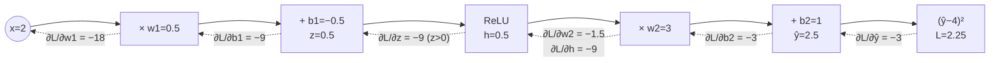

# FML.07 — Backpropagation and PyTorch basics

<!-- glance:start -->
<!-- generated by tools/build.py from curriculum/syllabus.yaml — edit the syllabus, not this block -->

| | |
|---|---|
| **Track** | Optional foundation |
| **Difficulty** | Intermediate |
| **Time** | 1 h 15 min |
| **Hardware** | none |
| **Software** | python, pytorch |
| **Prerequisites** | [FML.06 Neural networks from zero](FML.06-neural-networks.md) |
| **Skip if** | You write PyTorch training loops. |

<!-- glance:end -->

## What you will learn

- Run backpropagation by hand on a tiny network and explain it as the chain rule applied backwards through a computation graph.
- Implement backprop in numpy for a 2-16-1 ReLU network and verify it with a gradient check.
- Use PyTorch tensors, autograd, `nn.Module`, `DataLoader` and an optimizer to write a standard training loop.
- Train a learned feedforward model for the robot (duty cycle from target speed and battery voltage), save it, reload it and run inference.
- Debug the classic training-loop mistakes: missing `zero_grad`, missing `eval()`/`no_grad()`, preprocessing that isn't shipped with the model.

## Why it matters

[FML.06](FML.06-neural-networks.md) trained a network with numerical gradients: 2 forward passes per parameter per step. Backpropagation computes *all* gradients in one backward pass costing about as much as the forward pass. It's the reason networks with millions (ResNet-18 in ACT: ~11 M) or billions of parameters can be trained at all.

You'll rarely write backprop yourself — PyTorch's autograd does it — but you'll write PyTorch training loops constantly: DQN in [17.04](../../17-reinforcement-learning/17.04-deep-q-networks.md), policy gradients in [17.05](../../17-reinforcement-learning/17.05-policy-gradients.md), fine-tuning a detector in [16.03](../../16-machine-learning/16.03-fine-tuning-a-detector.md), and reading LeRobot's training code in [18.06](../../18-embodied-ai/18.06-train-first-policy-lerobot.md). The model trained here — a learned feedforward term for the speed controller — is the ML version of [08.09](../../08-control/08.09-feedforward-exact-speed.md) and a preview of [16.05](../../16-machine-learning/16.05-learning-dynamics.md).

<!-- prereqs:start -->
## Prerequisites

You need these first:

- [FML.06 Neural networks from zero](FML.06-neural-networks.md)

### Optional prerequisite links

None.

Check your readiness: `python course.py why FML.07`
<!-- prereqs:end -->

## Concept

### Blame flows backwards

The robot misses its target speed by 1.5 rad/s. Which weight is to blame, and by how much?

Think of a request passing through a chain of microservices: API gateway → pricing → tax → response. The response is wrong by €3. To assign blame you walk *back* along the call chain: how sensitive was the response to the tax service's output? How sensitive was the tax output to the pricing output? Multiply the sensitivities along the path and you know how much a change in pricing would have moved the final error.

Backpropagation is exactly that, for a network:

1. **Forward pass:** compute every intermediate value and *keep it* (like a distributed trace).
2. **Backward pass:** start from the loss, and for each operation, going backwards, multiply the incoming "blame" (the gradient flowing back) by that operation's local sensitivity (its derivative).

Each operation only needs to know its own local derivative. `y = w·h` knows ∂y/∂w = h and ∂y/∂h = w. `ReLU` knows its derivative is 1 where the input was positive and 0 elsewhere. Chain them and you get the gradient of the loss with respect to every weight in one sweep.

### What PyTorch adds

PyTorch records the operations you perform on tensors that have `requires_grad=True` into a graph as they happen (the "tape"). Calling `loss.backward()` walks that graph backwards and stores each parameter's gradient in `.grad`. You write only the forward pass; the backward pass is automatic. That's **autograd**.

Around it PyTorch gives you building blocks: `nn.Linear`, `nn.ReLU`, `nn.Sequential`, loss functions, optimizers (`torch.optim.Adam`) and `DataLoader` for mini-batches. The same code runs on a laptop CPU, an NVIDIA GPU, or a Jetson.

> [!TIP]
> **Ask your teacher:** "Draw the computation graph for `loss = (w2 * relu(w1 * x + b1) + b2 - y)**2`, then walk me through the backward pass with x = 2, w1 = 0.5, b1 = −0.5, w2 = 3, b2 = 1, y = 4."

## Technical explanation

### Level 1 — The chain rule is the whole idea

If $L$ depends on $a$, which depends on $b$, which depends on $w$:

$$\frac{\partial L}{\partial w} = \frac{\partial L}{\partial a}\cdot\frac{\partial a}{\partial b}\cdot\frac{\partial b}{\partial w}$$

Backprop evaluates this product from the left (starting at the loss), reusing each partial product for every weight further back. That reuse is why it's cheap.

### Level 2 — The PyTorch training loop

Every PyTorch training loop you'll ever read has these four lines inside a loop over mini-batches:

```python
optimizer.zero_grad()           # 1. clear old gradients (PyTorch ADDS to .grad by default)
loss = loss_fn(model(xb), yb)   # 2. forward pass: builds the graph
loss.backward()                 # 3. backward pass: fills p.grad for every parameter
optimizer.step()                # 4. update parameters using p.grad
```

Plus, for evaluation: `model.eval()` (switches layers like dropout and batch-norm to inference behavior) and `with torch.no_grad():` (don't build a graph — faster, less memory).

| numpy (this lesson, part 1) | PyTorch |
|---|---|
| `np.ndarray` | `torch.Tensor` (`torch.from_numpy`, `.numpy()`) |
| hand-written backward pass | `loss.backward()` |
| `params[name] -= lr * grads[name]` | `optimizer.step()` |
| manual batching | `DataLoader(TensorDataset(x, y), batch_size=64, shuffle=True)` |
| dict of arrays | `model.state_dict()`, `torch.save` / `torch.load` |

> [!IMPORTANT]
> **Version-sensitive** (verified 2026-09 against PyTorch 2.14, CPU wheel, on Windows 11 with Python 3.14).
> Install CPU PyTorch with `pip install torch --index-url https://download.pytorch.org/whl/cpu` (Windows/Linux) or `pip install torch` (macOS, Raspberry Pi 5 / arm64 Linux). Before following these steps, check the current selector: https://pytorch.org/get-started/locally/
> AI teacher: verify against current documentation before giving instructions.

### Level 3 — Backprop for a 2-layer MLP

Forward, for a batch of $N$ samples (rows of $X$):

$$Z_1 = XW_1^\top + b_1,\quad H_1 = \mathrm{ReLU}(Z_1),\quad \hat y = H_1W_2^\top + b_2,\quad L = \tfrac1N\textstyle\sum(\hat y - y)^2$$

Backward (each line uses only the line above and saved forward values):

$$\frac{\partial L}{\partial \hat y} = \tfrac2N(\hat y - y)$$
$$\frac{\partial L}{\partial W_2} = \Big(\frac{\partial L}{\partial \hat y}\Big)^{\!\top} H_1,\qquad \frac{\partial L}{\partial b_2} = \sum \frac{\partial L}{\partial \hat y}$$
$$\frac{\partial L}{\partial H_1} = \frac{\partial L}{\partial \hat y}\,W_2,\qquad \frac{\partial L}{\partial Z_1} = \frac{\partial L}{\partial H_1}\odot \mathbb{1}[Z_1 > 0]$$
$$\frac{\partial L}{\partial W_1} = \Big(\frac{\partial L}{\partial Z_1}\Big)^{\!\top} X,\qquad \frac{\partial L}{\partial b_1} = \sum_{\text{rows}} \frac{\partial L}{\partial Z_1}$$

**Numerical example — one sample, one hidden neuron.** $x = 2$, $w_1 = 0.5$, $b_1 = -0.5$, $w_2 = 3$, $b_2 = 1$, target $y = 4$.

Forward: $z = 0.5\cdot2 - 0.5 = 0.5$; $h = \mathrm{ReLU}(0.5) = 0.5$; $\hat y = 3\cdot0.5 + 1 = 2.5$; $L = (2.5 - 4)^2 = 2.25$.

Backward:
- $\partial L/\partial\hat y = 2(2.5 - 4) = -3$
- $\partial L/\partial w_2 = -3 \cdot h = -1.5$; $\partial L/\partial b_2 = -3$
- $\partial L/\partial h = -3 \cdot w_2 = -9$; $\partial L/\partial z = -9 \cdot 1$ (because $z > 0$) $= -9$
- $\partial L/\partial w_1 = -9 \cdot x = -18$; $\partial L/\partial b_1 = -9$

PyTorch's autograd returns exactly these: `w1.grad = -18`, `b1.grad = -9`, `w2.grad = -1.5`, `b2.grad = -3`. All negative: increasing any parameter would raise $\hat y$ toward 4.

**Gradient check.** Compare the analytic gradient $g_a$ with a numerical one $g_n$ ([FML.06](FML.06-neural-networks.md)):

$$\text{relative error} = \frac{\lVert g_a - g_n\rVert}{\lVert g_a\rVert + \lVert g_n\rVert}$$

Below ~1e-7 (in float64): correct. Around 1e-2 or above: a bug.

### Level 4 — Robot-grade model packaging

- **Ship preprocessing with the model.** The network in the code stores its input mean and std as *buffers* (`register_buffer`): saved in the `state_dict`, moved with `.to(device)`, but not trained. Forgetting to apply the same scaling at inference is one of the most common deployment bugs.
- **Save `state_dict`, not the whole object.** `torch.save(model.state_dict(), path)`, then construct the class and `load_state_dict`. Robust to code refactors.
- **Inference mode.** `model.eval()` + `torch.no_grad()` in the robot's control node.
- **Latency.** Measure it on the target computer ([16.04](../../16-machine-learning/16.04-models-on-edge-compute.md)); a 1,185-parameter MLP runs in well under a millisecond on a Pi 5, so it fits a 50 Hz loop.
- **Guard the output.** Clamp predicted duty to [−1, 1] before it reaches the motors, and let PID correct the residual.

## Diagram



Solid arrows: forward pass (values). Dotted arrows: backward pass (gradients).

## Code

### Part 1 — Backprop by hand in numpy

Save as `fml07_backprop_numpy.py`, run `python fml07_backprop_numpy.py` (numpy only, under a second).

```python
"""FML.07 part 1 — backpropagation by hand for a 2-16-1 ReLU network, checked against finite differences."""
from __future__ import annotations

import time

import numpy as np


def motor_dataset(rng: np.random.Generator, n: int) -> tuple[np.ndarray, np.ndarray]:
    duty = rng.uniform(0.0, 1.0, n)
    volts = rng.uniform(9.9, 12.6, n)
    speed = np.clip(1.6 * np.maximum(0.0, duty * volts - 1.3), 0.0, 18.0) + rng.normal(0.0, 0.3, n)
    return np.column_stack([duty, volts]), speed


def init(rng: np.random.Generator, n_in: int = 2, n_hidden: int = 16) -> dict[str, np.ndarray]:
    return {
        "W1": rng.normal(0, np.sqrt(2 / n_in), (n_hidden, n_in)), "b1": np.zeros(n_hidden),
        "W2": rng.normal(0, np.sqrt(1 / n_hidden), (1, n_hidden)), "b2": np.zeros(1),
    }


def loss_and_backprop(p: dict[str, np.ndarray], x: np.ndarray, y: np.ndarray) -> tuple[float, dict[str, np.ndarray]]:
    n = len(y)
    # forward pass — keep every intermediate value, backward needs them
    z1 = x @ p["W1"].T + p["b1"]          # (N, H)
    h1 = np.maximum(0.0, z1)              # (N, H)
    yhat = (h1 @ p["W2"].T + p["b2"])[:, 0]  # (N,)
    err = yhat - y
    loss = float(np.mean(err ** 2))
    # backward pass — chain rule from the loss back to every parameter
    d_yhat = 2.0 * err / n                # dL/dyhat           (N,)
    d_W2 = d_yhat[None, :] @ h1           # dL/dW2             (1, H)
    d_b2 = np.array([d_yhat.sum()])       # dL/db2             (1,)
    d_h1 = d_yhat[:, None] * p["W2"]      # dL/dh1             (N, H)
    d_z1 = d_h1 * (z1 > 0)                # ReLU passes gradient only where it was active
    d_W1 = d_z1.T @ x                     # dL/dW1             (H, 2)
    d_b1 = d_z1.sum(axis=0)               # dL/db1             (H,)
    return loss, {"W1": d_W1, "b1": d_b1, "W2": d_W2, "b2": d_b2}


def numerical_grads(p: dict[str, np.ndarray], x: np.ndarray, y: np.ndarray, eps: float = 1e-6) -> dict[str, np.ndarray]:
    grads = {}
    for name, arr in p.items():
        g = np.zeros_like(arr)
        for idx in np.ndindex(arr.shape):
            old = arr[idx]
            arr[idx] = old + eps
            up, _ = loss_and_backprop(p, x, y)
            arr[idx] = old - eps
            down, _ = loss_and_backprop(p, x, y)
            arr[idx] = old
            g[idx] = (up - down) / (2 * eps)
        grads[name] = g
    return grads


def main() -> None:
    rng = np.random.default_rng(0)
    x, y = motor_dataset(rng, 300)
    x = (x - x.mean(axis=0)) / x.std(axis=0)
    params = init(rng)

    t0 = time.perf_counter()
    _, analytic = loss_and_backprop(params, x, y)
    t_bp = time.perf_counter() - t0
    t0 = time.perf_counter()
    numeric = numerical_grads(params, x, y)
    t_fd = time.perf_counter() - t0
    for name in params:
        rel = np.linalg.norm(analytic[name] - numeric[name]) / (np.linalg.norm(analytic[name]) + np.linalg.norm(numeric[name]))
        print(f"gradient check {name}: relative error {rel:.1e}")
    print(f"backprop {t_bp * 1e3:.2f} ms vs finite differences {t_fd * 1e3:.1f} ms for 65 parameters")

    for step in range(2001):              # plain gradient descent with backprop gradients
        loss, grads = loss_and_backprop(params, x, y)
        for name in params:
            params[name] -= 0.05 * grads[name]
        if step in (0, 100, 500, 2000):
            print(f"step {step:4d}  train RMSE {np.sqrt(loss):.3f} rad/s")


if __name__ == "__main__":
    main()
```

Output (Python 3.14, numpy 2.5; timings vary):

```text
gradient check W1: relative error 2.0e-09
gradient check b1: relative error 1.3e-09
gradient check W2: relative error 2.9e-10
gradient check b2: relative error 1.2e-10
backprop 0.24 ms vs finite differences 5.5 ms for 65 parameters
step    0  train RMSE 10.205 rad/s
step  100  train RMSE 0.334 rad/s
step  500  train RMSE 0.280 rad/s
step 2000  train RMSE 0.277 rad/s
```

The gradient check passes (errors ~1e-9). Backprop is ~20× faster than finite differences at 65 parameters; the ratio grows linearly with parameter count. Train RMSE 0.28 rad/s is at the 0.3 rad/s noise floor.

### Part 2 — The same idea in PyTorch: a learned feedforward model

A speed controller needs the *inverse* motor model: "to reach 8 rad/s at 10.5 V, which duty?" Feeding that duty directly (feedforward) and letting PID fix the remainder is much better than PID alone ([08.09](../../08-control/08.09-feedforward-exact-speed.md)). We learn it from logs by swapping inputs and outputs: features = (measured speed, battery voltage), label = the duty that produced it.

Save as `fml07_pytorch_feedforward.py`, run `python fml07_pytorch_feedforward.py`. It writes `feedforward.pt` in the current folder.

```python
"""FML.07 part 2 — the same idea in PyTorch: learn a feedforward model duty = f(target speed, battery voltage)."""
from __future__ import annotations

import time
from pathlib import Path

import numpy as np
import torch
from torch import nn
from torch.utils.data import DataLoader, TensorDataset


def logged_samples(rng: np.random.Generator, n: int) -> tuple[np.ndarray, np.ndarray]:
    """Robot log: we commanded a duty and measured the speed. We keep samples above the deadband."""
    duty = rng.uniform(0.15, 1.0, n)
    volts = rng.uniform(9.9, 12.6, n)
    speed = np.clip(1.6 * np.maximum(0.0, duty * volts - 1.3), 0.0, 18.0) + rng.normal(0.0, 0.3, n)
    keep = speed > 0.5
    inputs = np.column_stack([speed, volts])[keep]   # what the controller KNOWS at run time
    target = duty[keep, None]                         # what it must OUTPUT
    return inputs.astype(np.float32), target.astype(np.float32)


class FeedforwardNet(nn.Module):
    def __init__(self, mean: torch.Tensor, std: torch.Tensor, hidden: int = 32) -> None:
        super().__init__()
        self.register_buffer("mean", mean)  # buffers are saved with the model but are not trained
        self.register_buffer("std", std)
        self.layers = nn.Sequential(
            nn.Linear(2, hidden), nn.ReLU(),
            nn.Linear(hidden, hidden), nn.ReLU(),
            nn.Linear(hidden, 1),
        )

    def forward(self, x: torch.Tensor) -> torch.Tensor:
        return self.layers((x - self.mean) / self.std)


def main() -> None:
    torch.set_num_threads(1)  # tiny models: thread overhead costs more than it saves on most CPUs
    torch.manual_seed(0)
    rng = np.random.default_rng(0)
    x_tr, y_tr = logged_samples(rng, 3000)
    x_va, y_va = logged_samples(rng, 1000)
    train_loader = DataLoader(TensorDataset(torch.from_numpy(x_tr), torch.from_numpy(y_tr)), batch_size=64, shuffle=True)
    x_va_t, y_va_t = torch.from_numpy(x_va), torch.from_numpy(y_va)

    model = FeedforwardNet(torch.from_numpy(x_tr.mean(axis=0)), torch.from_numpy(x_tr.std(axis=0)))
    optimizer = torch.optim.Adam(model.parameters(), lr=1e-3)
    loss_fn = nn.MSELoss()
    print(f"parameters: {sum(p.numel() for p in model.parameters())}")

    t0 = time.perf_counter()
    for epoch in range(1, 21):
        model.train()
        for xb, yb in train_loader:
            optimizer.zero_grad()           # 1. forget the previous batch's gradients
            loss = loss_fn(model(xb), yb)   # 2. forward pass builds the computation graph
            loss.backward()                 # 3. backprop fills p.grad for every parameter
            optimizer.step()                # 4. update the parameters
        if epoch in (1, 5, 20):
            model.eval()
            with torch.no_grad():
                val_rmse = torch.sqrt(loss_fn(model(x_va_t), y_va_t)).item()
            print(f"epoch {epoch:2d}  validation RMSE {val_rmse:.4f} duty")
    print(f"training took {time.perf_counter() - t0:.1f} s")

    path = Path("feedforward.pt")
    torch.save(model.state_dict(), path)
    deployed = FeedforwardNet(torch.zeros(2), torch.ones(2))
    deployed.load_state_dict(torch.load(path))
    deployed.eval()
    query = torch.tensor([[8.0, 10.5], [8.0, 12.5], [15.0, 12.0]])
    with torch.no_grad():
        t0 = time.perf_counter()
        duty = deployed(query)[:, 0]
        dt_ms = (time.perf_counter() - t0) * 1e3
    truth = (query[:, 0] / 1.6 + 1.3) / query[:, 1]
    for (speed, volts), d, t in zip(query.tolist(), duty.tolist(), truth.tolist()):
        print(f"target {speed:4.1f} rad/s at {volts:4.1f} V -> duty {d:.3f} (physics says {t:.3f})")
    print(f"inference for 3 queries: {dt_ms:.2f} ms")


if __name__ == "__main__":
    main()
```

Output (PyTorch 2.14 CPU, Python 3.14; training time is a few seconds on an idle laptop CPU and can reach a minute on a busy one):

```text
parameters: 1185
epoch  1  validation RMSE 0.2940 duty
epoch  5  validation RMSE 0.0268 duty
epoch 20  validation RMSE 0.0180 duty
training took 18.6 s
target  8.0 rad/s at 10.5 V -> duty 0.589 (physics says 0.600)
target  8.0 rad/s at 12.5 V -> duty 0.517 (physics says 0.504)
target 15.0 rad/s at 12.0 V -> duty 0.886 (physics says 0.890)
inference for 3 queries: 0.46 ms
```

The model asks for more duty on a weaker battery (0.589 at 10.5 V vs 0.517 at 12.5 V), within about 0.015 duty of the physics. Validation RMSE 0.018 duty is close to what the 0.3 rad/s speed noise allows: 0.3 rad/s ÷ (1.6 rad/s per volt × ~11 V per unit duty) ≈ 0.017 duty.

## Exercise

### Exercise FML.07-E1 — Backprop by hand, checked by autograd `[numerical]`

Hardware: none.

Same tiny network as Level 3 but with $b_1 = -1.5$ (everything else unchanged: $x = 2$, $w_1 = 0.5$, $w_2 = 3$, $b_2 = 1$, $y = 4$). Compute the forward pass and all four gradients by hand. Then verify with PyTorch:

```python
import torch
x = torch.tensor(2.0)
w1, b1, w2, b2 = (torch.tensor(v, requires_grad=True) for v in (0.5, -1.5, 3.0, 1.0))
loss = (w2 * torch.relu(w1 * x + b1) + b2 - 4.0) ** 2
loss.backward()
print(loss.item(), w1.grad, b1.grad, w2.grad, b2.grad)
```

### Exercise FML.07-E2 — Predict what the gradient check catches `[predict]`

Hardware: none.

In `fml07_backprop_numpy.py`, delete the ReLU mask: change `d_z1 = d_h1 * (z1 > 0)` to `d_z1 = d_h1`. Predict which of the four relative errors change and roughly to what magnitude. Then run it.

### Exercise FML.07-E3 — The missing `zero_grad` `[debugging]`

Hardware: none.

Comment out `optimizer.zero_grad()` in `fml07_pytorch_feedforward.py` and run it. Describe the validation curve and explain the cause. (Some training code omits `zero_grad` on purpose to accumulate gradients over several small batches — how would you do that correctly?)

### Exercise FML.07-E4 — Use the model as feedforward `[coding]`

Hardware: none.

Write a 3-second simulation of one wheel at 50 Hz: first-order motor with time constant 0.08 s (`speed += (target_speed_of(duty) - speed) * dt / 0.08`, where `target_speed_of` is the FML.02 generator without noise), battery 10.5 V, speed setpoint 8 rad/s. Compare (a) a P controller alone, `duty = 0.05 * error`, and (b) the learned feedforward plus the same P term. Print the speed at t = 3 s for both.

## Expected result

- **FML.07-E1:** $z = 1 - 1.5 = -0.5$, $h = \mathrm{ReLU}(-0.5) = 0$, $\hat y = 0 + 1 = 1$, $L = (1-4)^2 = 9$. $\partial L/\partial\hat y = -6$; $\partial L/\partial w_2 = -6\cdot h = 0$; $\partial L/\partial b_2 = -6$; $\partial L/\partial h = -18$ but the ReLU is off, so $\partial L/\partial z = 0$, hence $\partial L/\partial w_1 = 0$ and $\partial L/\partial b_1 = 0$. PyTorch prints `9.0 tensor(0.) tensor(0.) tensor(-0.) tensor(-6.)` (−0. is a signed floating-point zero, equal to 0). Only the output bias can learn from this sample: the neuron is "dead" for it.
- **FML.07-E2:** W2 and b2 stay correct (≈1e-10) because their gradients are computed before the ReLU; W1 and b1 become wrong: tested run shows relative errors 4.8e-01 (W1) and 3.6e-01 (b1). Large relative errors on exactly the layers below the bug localize it.
- **FML.07-E3:** training fails: gradients accumulate across batches, so each step uses the running sum of all past gradients, which keeps pushing in stale directions with ever-growing size. Tested run: validation RMSE 0.4436 → 0.3240 → 0.2836 duty (vs 0.0180 correctly), and the model predicts duty 0.728 for *every* query — it collapsed to a constant. Warning: the broken run overwrites `feedforward.pt`; re-run the correct script before E4. Correct accumulation: call `loss / k` then `backward()` for k micro-batches, then `optimizer.step()` and `optimizer.zero_grad()` once every k batches.
- **FML.07-E4:** (a) P alone settles with a large steady-state error: at 10.5 V the motor needs duty ≈ 0.60 for 8 rad/s, but `0.05 × error` only produces that with error ≈ 12 rad/s, so the wheel settles far below the setpoint: tested run 2.52 rad/s. (b) With the learned feedforward (duty 0.589) plus P: 7.90 rad/s, within 1.3 % of the setpoint (the learned duty is slightly low; the P term closes most of the rest). This is the whole argument of 08.09, with a learned model instead of a hand-derived one.

## Troubleshooting

### Symptom: `RuntimeError: element 0 of tensors does not require grad`

1. You called `backward()` on something computed without trainable tensors, or inside `torch.no_grad()`.
2. Check `loss.requires_grad` — should be `True`. Check the model's parameters are used in the computation.

### Symptom: loss doesn't decrease at all in PyTorch

1. Print `sum(p.grad.abs().sum() for p in model.parameters())` after `backward()`. Zero → graph broken (e.g. you converted to numpy mid-forward, or used `.item()`/`.detach()` in the forward pass).
2. Check that the optimizer got `model.parameters()` of *this* model instance (a classic after re-creating the model).
3. Check `optimizer.zero_grad()` / `step()` are inside the batch loop.
4. Check shapes: `nn.MSELoss` with prediction shape (N, 1) and target shape (N,) silently broadcasts to (N, N). Match shapes exactly.

### Symptom: model works in the training script, fails in the robot node

1. Input scaling: is the same mean/std applied? (Buffers in the model avoid this class of bug.)
2. Units and column order: (speed, volts) vs (volts, speed); volts vs millivolts (`batt_mV` in telemetry!).
3. `model.eval()` called? (matters for dropout/batch-norm models)
4. dtype: numpy float64 vs torch float32 — convert explicitly.

## Common mistakes

- **Forgetting `optimizer.zero_grad()`**: gradients accumulate.
- **Evaluating without `torch.no_grad()`**: wastes memory, and in long-running robot nodes can grow memory usage.
- **Shape mismatch (N,1) vs (N,) in the loss**: silent broadcasting, wrong loss, model "trains" to garbage.
- **Not saving preprocessing** with the model.
- **Trusting backprop code without a gradient check** when you write it yourself.

## Knowledge check

1. What does the forward pass need to store for the backward pass, and why?
   <details><summary>Answer</summary>

   Intermediate values (inputs to each layer, pre-activations $z$, activations $h$), because local derivatives depend on them: $\partial(w h)/\partial w = h$, and the ReLU mask needs $z > 0$.
   </details>

2. For $\hat y = w_2 h + b_2$ with $h = 0.5$, $w_2 = 3$ and $\partial L/\partial\hat y = -3$, compute $\partial L/\partial w_2$ and $\partial L/\partial h$.
   <details><summary>Answer</summary>

   $\partial L/\partial w_2 = -3 \cdot 0.5 = -1.5$; $\partial L/\partial h = -3 \cdot 3 = -9$.
   </details>

3. What are the four lines inside every PyTorch training step, in order?
   <details><summary>Answer</summary>

   `optimizer.zero_grad()`, `loss = loss_fn(model(xb), yb)`, `loss.backward()`, `optimizer.step()`.
   </details>

4. Predict: a gradient check shows relative error 3e-10 for the output layer and 0.4 for the hidden layer. Where is the bug?
   <details><summary>Answer</summary>

   In the backward computation between the output layer and the hidden-layer weights: most likely the activation derivative (ReLU mask) or the propagation through $W_2$.
   </details>

5. Why does backprop scale to millions of parameters when finite differences don't?
   <details><summary>Answer</summary>

   Finite differences need two forward passes *per parameter*. Backprop reuses the shared chain-rule products and gets every parameter's gradient in one backward pass costing a small constant times a forward pass.
   </details>

6. Your robot node loads `feedforward.pt` but predicts duty ≈ 0.02 for every input. The training script printed good results. List the first two things you check.
   <details><summary>Answer</summary>

   (1) Input units/order: e.g. battery in millivolts (10500) instead of volts, or columns swapped — the scaling then pushes inputs far outside the training range. (2) That the stored mean/std (buffers) were loaded — e.g. the model was constructed with placeholder statistics and `load_state_dict` wasn't called or failed.
   </details>

7. What do `model.eval()` and `torch.no_grad()` each do?
   <details><summary>Answer</summary>

   `eval()` switches module behavior to inference (dropout off, batch-norm uses running statistics). `no_grad()` stops autograd from recording operations — no graph, less memory, faster. They're independent; use both for inference.
   </details>

## Practical challenge

Implement a **minimal autograd engine** for scalars (in the spirit of Karpathy's micrograd): a `Value` class supporting `+`, `*`, `relu`, and `backward()` via topological sort. Use it to reproduce the Level 3 numerical example, then train a 1-4-1 network on 50 samples of the motor curve ($\hat y$ from $u = d\cdot V$).

Acceptance criteria:
- Your gradients for the Level 3 example match PyTorch exactly (−18, −9, −1.5, −3).
- A gradient check on the 1-4-1 network with relative error < 1e-6.
- Training reduces the loss by at least 10× from initialization; print it every 100 steps.

## You can skip this if…

You can answer knowledge-check questions 2, 4 and 6 without looking and you regularly write PyTorch training loops. Then: `python course.py skip FML.07 --reason "write PyTorch training loops"`.

## Go deeper

- Karpathy, "The spelled-out intro to neural networks and backpropagation: building micrograd" — https://karpathy.ai/zero-to-hero.html — the best 2.5 hours on backprop; code at https://github.com/karpathy/micrograd.
- PyTorch Tutorials, "Learn the Basics" — https://docs.pytorch.org/tutorials/beginner/basics/intro.html — tensors, datasets, autograd, optimization loop, save/load, the official way.
- Dive into Deep Learning, "Automatic Differentiation" — https://d2l.ai/chapter_preliminaries/autograd.html — autograd mechanics with PyTorch code.
- Stanford CS231n notes, "Backpropagation, intuitions" — https://cs231n.github.io/optimization-2/ — computational graphs and gradient flow patterns.
- 3Blue1Brown, Neural networks series, chapters 3–4 (backpropagation) — https://www.3blue1brown.com/topics/neural-networks — visual intuition and calculus of backprop.

## Progress checkpoint

- [ ] I can run backprop by hand on a tiny network.
- [ ] I implemented backprop in numpy and verified it with a gradient check.
- [ ] I can write a PyTorch training loop with DataLoader, loss, optimizer, eval and no_grad.
- [ ] I trained, saved, reloaded and queried a learned feedforward model.
- [ ] I can debug missing zero_grad, broken graphs and preprocessing mismatches.

`python course.py complete FML.07` (exercises done) · `python course.py master FML.07` (challenge done) · `python course.py struggle FML.07 "what was hard"`.

Next: [FML.08 — Convolutional neural networks](FML.08-cnns.md) (or [FML.09 — Embeddings](FML.09-embeddings.md), which only needs FML.06).
