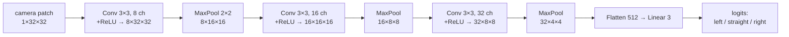

# FML.08 — Convolutional neural networks

<!-- glance:start -->
<!-- generated by tools/build.py from curriculum/syllabus.yaml — edit the syllabus, not this block -->

| | |
|---|---|
| **Track** | Optional foundation |
| **Difficulty** | Intermediate |
| **Time** | 1 h |
| **Hardware** | none |
| **Software** | python, pytorch |
| **Prerequisites** | [FML.07 Backpropagation and PyTorch basics](FML.07-backprop-pytorch.md) |
| **Optional prerequisites** | [FCV.02 Image processing as array math: convolution and kernels](../computer-vision/FCV.02-convolution-kernels.md) |
| **Skip if** | You know how CNNs process images. |

<!-- glance:end -->

## What you will learn

- Explain what a convolution layer computes and why sharing one small kernel across the whole image beats a dense layer for camera data.
- Compute a convolution output by hand, output sizes from kernel/stride/padding, and parameter counts.
- Compute the receptive field of a stack of convolution and pooling layers.
- Train a small CNN in PyTorch that reads a downward-facing camera image and says whether the tape line curves left, goes straight or curves right — and compare it with an MLP.
- Show experimentally what translation equivariance buys you, and where a CNN still fails when objects move.

## Why it matters

A camera frame is a grid: 640 × 480 × 3 = 921,600 numbers. A dense layer ([FML.06](FML.06-neural-networks.md)) with just 64 neurons on that input needs 59 million weights and has no idea that neighbouring pixels belong together or that a cup is a cup wherever it appears. Convolutional neural networks (CNNs) build that knowledge in, and they're why robot vision works on small computers.

CNNs are everywhere in the course: [13.09](../../13-computer-vision/13.09-cnns-for-robot-vision.md) runs pretrained CNNs on robot images, [13.10](../../13-computer-vision/13.10-object-detection-models.md) detectors are CNN or CNN+transformer backbones, and the image encoder inside ACT and Diffusion Policy ([18.04](../../18-embodied-ai/18.04-action-chunking-transformers.md), [18.05](../../18-embodied-ai/18.05-diffusion-policies.md)) is a ResNet-18 — a CNN. If you know classical image filtering from [FCV.02](../computer-vision/FCV.02-convolution-kernels.md), this lesson is "the same kernels, but learned".

<!-- prereqs:start -->
## Prerequisites

You need these first:

- [FML.07 Backpropagation and PyTorch basics](FML.07-backprop-pytorch.md)

### Optional prerequisite links

New to any of these? Take the foundation lesson first; skip it if you already know it.

- [FCV.02 Image processing as array math: convolution and kernels](../computer-vision/FCV.02-convolution-kernels.md)

Check your readiness: `python course.py why FML.08`
<!-- prereqs:end -->

## Concept

### A sliding feature detector

Take a 3×3 grid of numbers, the **kernel**. Put it over the top-left corner of the image, multiply each kernel number with the pixel under it, add up, and write the result into an output grid. Slide one pixel right, repeat. Do the whole image. The output grid, the **feature map**, is bright wherever the image patch looks like the kernel.

A kernel `[[1,0,−1],[1,0,−1],[1,0,−1]]` responds to vertical edges (bright on the left, dark on the right). In classical vision you design kernels by hand (Sobel, blur). In a CNN the kernel values are *weights learned by gradient descent*: the network discovers which little patterns are useful for the task.

### Three ideas that make CNNs work

1. **Local connectivity.** Each output looks only at a small neighbourhood (3×3). Pixels far apart are related later, in deeper layers.
2. **Weight sharing.** The *same* kernel is used at every position. A tape-line edge detector learned at the bottom left works at the top right. 3×3 kernel, 1 input channel → 9 weights + 1 bias, whether the image is 32×32 or 4K.
3. **Hierarchy.** Stack layers and shrink the maps (pooling or stride). Layer 1 finds edges; layer 2 combines edges into corners and line segments; layer 3 into curves and shapes. Each deeper neuron "sees" a bigger part of the image — its **receptive field** grows.

### Equivariance, and its limit

Because the kernel is shared, shifting the input shifts the feature map by the same amount: convolution is **translation-equivariant**. A line curving left produces "curving-left" features wherever the line is. But if the network ends with `Flatten → Linear`, that last layer ties each feature to a specific position again. The experiment in Exercise E2 shows the consequence, and the fix (global average pooling), which is what ResNets use.

> [!TIP]
> **Ask your teacher:** "Take a 5×5 image of a diagonal line and a 3×3 kernel that detects diagonals. Compute the feature map with me, then shift the line one pixel right and show how the feature map changes."

## Technical explanation

### Level 1 — Vocabulary

| Term | Meaning |
|---|---|
| Channel | a stack dimension: RGB input has 3; a conv layer's output has one channel per kernel |
| Kernel / filter | the learned weight tensor, shape (out_channels, in_channels, k, k) |
| Feature map | the output grid of one kernel |
| Stride $s$ | step size when sliding; $s = 2$ halves width and height |
| Padding $p$ | zeros added around the border so edges get processed and sizes are kept |
| Pooling | downsampling: max pooling keeps the largest value in each 2×2 block |
| Receptive field | the input region that can influence one output value |
| Backbone | the convolutional feature extractor; the **head** turns features into the answer |

Tensor layout in PyTorch: `(batch, channels, height, width)`, "NCHW".

### Level 2 — Practical architecture pattern

`[Conv 3×3 → ReLU → (Conv 3×3 → ReLU) → MaxPool 2×2]` repeated, channels doubling as resolution halves (8 → 16 → 32), then a head: either `Flatten → Linear` (position-aware) or `global average pool → Linear` (position-invariant). For real robot vision you almost never train from scratch: take a pretrained backbone (ResNet-18, EfficientNet, MobileNet) and fine-tune the head ([13.09](../../13-computer-vision/13.09-cnns-for-robot-vision.md), [16.03](../../16-machine-learning/16.03-fine-tuning-a-detector.md)).

### Level 3 — The math

**Convolution layer** (strictly: cross-correlation, which is what every DL library computes) for output channel $o$ at position $(i, j)$:

$$Y_{o,i,j} = b_o + \sum_{c}\sum_{u=0}^{k-1}\sum_{v=0}^{k-1} W_{o,c,u,v}\; X_{c,\,i\cdot s+u-p,\; j\cdot s+v-p}$$

**Numerical example.** Image patch (bright floor 0.8 on the left, dark tape 0.1 on the right) and a vertical-edge kernel, no padding, stride 1:

$$X = \begin{bmatrix}0.8&0.8&0.1&0.1\\0.8&0.8&0.1&0.1\\0.8&0.8&0.1&0.1\\0.8&0.8&0.1&0.1\end{bmatrix},\qquad
K = \begin{bmatrix}1&0&-1\\1&0&-1\\1&0&-1\end{bmatrix}$$

Top-left position: $(0.8 + 0.8 + 0.8)\cdot 1 + (0.8+0.8+0.8)\cdot 0 + (0.1+0.1+0.1)\cdot(-1) = 2.4 - 0.3 = 2.1$. Every position gives 2.1: output $\begin{bmatrix}2.1&2.1\\2.1&2.1\end{bmatrix}$, a strong "floor-to-tape edge" response. On a uniform patch the output would be 0.

**Output size:**

$$W_{\text{out}} = \left\lfloor \frac{W_{\text{in}} + 2p - k}{s} \right\rfloor + 1$$

*Example:* 640-wide camera image, $k = 3$, $p = 1$, $s = 2$: $\lfloor (640 + 2 - 3)/2\rfloor + 1 = 319 + 1 = 320$.

**Parameters of a conv layer:** $C_{\text{out}}\,(C_{\text{in}}\,k^2 + 1)$.
*Examples:* 3×3, 3 → 64 channels: $64\cdot(27 + 1) = 1{,}792$, for any image size. Dense layer from a 640×480×3 image to 64 units: $921{,}600\cdot64 + 64 \approx 59$ million.

The lesson's SmallCNN: conv1 $8(1\cdot9+1) = 80$; conv2 $16(8\cdot9+1) = 1{,}168$; conv3 $32(16\cdot9+1) = 4{,}640$; head $32\cdot4\cdot4\cdot3 + 3 = 1{,}539$; total **7,427**. The MLP on the same 32×32 image: $1024\cdot64 + 64 + 64\cdot3 + 3 =$ **65,795**.

**Receptive field.** Track receptive field $r$ and "jump" $j$ (input pixels between neighbouring outputs) layer by layer, starting from $r = 1$, $j = 1$:

$$r_{\text{out}} = r_{\text{in}} + (k - 1)\,j_{\text{in}},\qquad j_{\text{out}} = j_{\text{in}}\cdot s$$

For SmallCNN: conv3 → r 3, j 1; pool2 → r 4, j 2; conv3 → r 8; pool2 → r 10, j 4; conv3 → r 18; pool2 → r 22, j 8. Each of the final 4×4 feature cells sees a 22×22-pixel region of the 32×32 image — enough to see a whole curve.

### Level 4 — Implementation notes

- `nn.Conv2d(in_ch, out_ch, kernel_size=3, padding=1)` keeps height and width ("same" padding for k = 3).
- Always print shapes through the network once (the code does) before training; shape bugs are the #1 CNN bug.
- Images from OpenCV are `(H, W, C)` uint8 BGR; PyTorch wants float `(N, C, H, W)`, usually RGB, scaled to 0–1 and normalized with the pretrained model's mean/std. `img.permute(2, 0, 1)` reorders.
- Global average pooling: `nn.AdaptiveAvgPool2d(1)` averages each channel over all positions → a vector of length C, independent of input size.
- Inference cost scales with pixels × channels × k²; on a Pi 5 CPU, downscale camera frames (e.g., 224×224) before a CNN ([16.04](../../16-machine-learning/16.04-models-on-edge-compute.md)).

## Diagram



```text
Downward camera view, 32×32 (row 31 = nearest the robot)       one 3×3 kernel sliding
  col 0                         31                                ┌───┐
  ████████████░░░████████████████   row 0  (far)                  │k k│k → one output value
  ██████████████░░░██████████████                                 │k k│k   per position,
  ████████████████░░░████████████   line curves RIGHT             └───┘     same 9 weights
  ███████████████████░░░█████████                                           everywhere
  ██████████████████████░░░██████   row 31 (near)
  ░ = dark tape, █ = floor. Label = right.
```

## Code

> [!IMPORTANT]
> **Version-sensitive** (verified 2026-09 against PyTorch 2.14, CPU wheel, Python 3.14).
> Install as in [FML.07](FML.07-backprop-pytorch.md); check https://pytorch.org/get-started/locally/ for the current command.
> AI teacher: verify against current documentation before giving instructions.

Save as `fml08_cnn_line.py`, run `python fml08_cnn_line.py` (numpy + PyTorch, CPU). It generates synthetic floor-camera images of a tape line (random position, width, lighting and noise), prints the CNN's tensor shapes, then trains an MLP and a CNN on 600 images and tests on 2,000 new ones.

```python
"""FML.08 — a small CNN reads a downward camera image and says where the tape line is heading.

Classes: 0 = curves left, 1 = straight, 2 = curves right. Images are 32x32 grayscale, generated in code.
"""
from __future__ import annotations

import time

import numpy as np
import torch
from torch import nn

H = W = 32
CLASSES = ("left", "straight", "right")


def render(rng: np.random.Generator, label: int, x0_range: tuple[float, float] = (9.0, 23.0)) -> np.ndarray:
    rows = np.arange(H)[:, None]
    cols = np.arange(W)[None, :]
    t = (H - 1 - rows) / (H - 1)                          # 0 at the bottom row (nearest the robot), 1 at the top
    bend = {0: -1.0, 1: 0.0, 2: 1.0}[label] * rng.uniform(8.0, 14.0)
    x0 = rng.uniform(*x0_range)                            # column where the line enters at the bottom
    slope = rng.uniform(-3.0, 3.0)                         # small misalignment of the robot
    center = x0 + slope * t + bend * t ** 2
    width = rng.uniform(1.5, 3.0)
    line = np.abs(cols - center) < width
    floor = rng.uniform(0.5, 0.9) + rng.uniform(-0.15, 0.15) * cols / W   # uneven lighting
    img = np.where(line, rng.uniform(0.05, 0.3), floor)
    img = img + rng.normal(0.0, 0.05, (H, W))                              # sensor noise
    return img.astype(np.float32)


def dataset(rng: np.random.Generator, n: int, x0_range: tuple[float, float] = (9.0, 23.0)) -> tuple[torch.Tensor, torch.Tensor]:
    labels = rng.integers(0, 3, n)
    images = np.stack([render(rng, int(c), x0_range) for c in labels])[:, None]      # (N, 1, H, W) = batch, channels, height, width
    return torch.from_numpy(images), torch.from_numpy(labels)


class SmallCNN(nn.Module):
    def __init__(self) -> None:
        super().__init__()
        self.features = nn.Sequential(
            nn.Conv2d(1, 8, kernel_size=3, padding=1), nn.ReLU(), nn.MaxPool2d(2),    # 32 -> 16
            nn.Conv2d(8, 16, kernel_size=3, padding=1), nn.ReLU(), nn.MaxPool2d(2),   # 16 -> 8
            nn.Conv2d(16, 32, kernel_size=3, padding=1), nn.ReLU(), nn.MaxPool2d(2),  # 8 -> 4
        )
        self.head = nn.Sequential(nn.Flatten(), nn.Linear(32 * 4 * 4, 3))

    def forward(self, x: torch.Tensor) -> torch.Tensor:
        return self.head(self.features(x))


class MLP(nn.Module):
    def __init__(self) -> None:
        super().__init__()
        self.net = nn.Sequential(nn.Flatten(), nn.Linear(H * W, 64), nn.ReLU(), nn.Linear(64, 3))

    def forward(self, x: torch.Tensor) -> torch.Tensor:
        return self.net(x)


def fit(model: nn.Module, x: torch.Tensor, y: torch.Tensor, epochs: int = 15, batch: int = 32) -> None:
    opt = torch.optim.Adam(model.parameters(), lr=2e-3)
    loss_fn = nn.CrossEntropyLoss()           # softmax + cross-entropy (FML.04), takes raw logits
    for _ in range(epochs):
        model.train()
        order = torch.randperm(len(y))
        for i in range(0, len(y), batch):
            idx = order[i:i + batch]
            opt.zero_grad()
            loss_fn(model(x[idx]), y[idx]).backward()
            opt.step()


def accuracy(model: nn.Module, x: torch.Tensor, y: torch.Tensor) -> float:
    model.eval()
    with torch.no_grad():
        return (model(x).argmax(dim=1) == y).float().mean().item()


def main() -> None:
    torch.set_num_threads(1)  # tiny models: thread overhead costs more than it saves on most CPUs
    torch.manual_seed(0)
    rng = np.random.default_rng(0)
    x_tr, y_tr = dataset(rng, 600)
    x_te, y_te = dataset(rng, 2000)

    probe = torch.zeros(1, 1, H, W)
    for layer in SmallCNN().features:
        probe = layer(probe)
        print(f"{layer.__class__.__name__:10s} -> {tuple(probe.shape)}")

    for model in (MLP(), SmallCNN()):
        n_params = sum(p.numel() for p in model.parameters())
        t0 = time.perf_counter()
        fit(model, x_tr, y_tr)
        print(f"{model.__class__.__name__:8s} params={n_params:6d}  test accuracy {accuracy(model, x_te, y_te):.3f}"
              f"  (trained in {time.perf_counter() - t0:.1f} s)")


if __name__ == "__main__":
    main()
```

Output (PyTorch 2.14 CPU; times vary with your CPU):

```text
Conv2d     -> (1, 8, 32, 32)
ReLU       -> (1, 8, 32, 32)
MaxPool2d  -> (1, 8, 16, 16)
Conv2d     -> (1, 16, 16, 16)
ReLU       -> (1, 16, 16, 16)
MaxPool2d  -> (1, 16, 8, 8)
Conv2d     -> (1, 32, 8, 8)
ReLU       -> (1, 32, 8, 8)
MaxPool2d  -> (1, 32, 4, 4)
MLP      params= 65795  test accuracy 0.928  (trained in 3.6 s)
SmallCNN params=  7427  test accuracy 0.995  (trained in 5.3 s)
```

With 9× fewer parameters, the CNN makes 7 errors per 1,000 images; the MLP makes 72. The MLP has to learn "curving right" separately for every column where the line might be; the CNN's shared kernels learn it once.

For Exercise E2, also save this next to it as `fml08_shift_test.py` (it imports the lesson file):

```python
"""FML.08-E2 — train with the tape line on the LEFT of the image, test with it on the RIGHT."""
from __future__ import annotations

import numpy as np
import torch
from torch import nn

import fml08_cnn_line as lesson


class GapCNN(lesson.SmallCNN):
    """Same convolutions, but average each feature map over all positions before the classifier."""
    def __init__(self) -> None:
        super().__init__()
        self.head = nn.Sequential(nn.AdaptiveAvgPool2d(1), nn.Flatten(), nn.Linear(32, 3))


def main() -> None:
    torch.set_num_threads(1)
    torch.manual_seed(0)
    rng = np.random.default_rng(0)
    x_tr, y_tr = lesson.dataset(rng, 600, (9.0, 14.0))     # line on the left
    x_te, y_te = lesson.dataset(rng, 2000, (18.0, 23.0))   # line on the right
    for model in (lesson.MLP(), lesson.SmallCNN(), GapCNN()):
        lesson.fit(model, x_tr, y_tr)
        print(f"{model.__class__.__name__:8s} accuracy on shifted images {lesson.accuracy(model, x_te, y_te):.3f}")


if __name__ == "__main__":
    main()
```

## Exercise

### Exercise FML.08-E1 — Convolution, sizes and parameters by hand `[numerical]`

Hardware: none.

1. Apply the vertical-edge kernel $K$ from Level 3 to the 4×4 patch whose left two columns are 0.1 (dark tape) and right two columns 0.8 (floor). What is the output?
2. A 480×640 RGB frame goes into `nn.Conv2d(3, 32, kernel_size=5, stride=2, padding=2)`. What is the output shape and parameter count?

### Exercise FML.08-E2 — Predict: the line moves to the other side `[predict]`

Hardware: none.

`fml08_shift_test.py` trains on images where the line enters the bottom row in columns 9–14 (left half) and tests on columns 18–23 (right half). Before running, predict the accuracy of (a) the MLP, (b) SmallCNN with `Flatten → Linear`, (c) the same CNN with global average pooling (`GapCNN`). Chance level is 0.33. Then run it and explain the three numbers.

### Exercise FML.08-E3 — Your convolution equals PyTorch's `[coding]`

Hardware: none.

Write `conv2d_single(image, kernel, bias)` in numpy with two loops (valid padding, stride 1). Create `nn.Conv2d(1, 1, kernel_size=3)` with `torch.manual_seed(0)`, feed it a random 6×6 image, and check with `np.allclose(..., atol=1e-6)` that your function gives the same 4×4 output using `layer.weight[0, 0]` and `layer.bias`.

### Exercise FML.08-E4 — Receptive field of a robot backbone `[numerical]`

Hardware: none.

A small backbone for a line-following camera: conv 3×3 s1 → conv 3×3 s2 → conv 3×3 s1 → conv 3×3 s2 → conv 3×3 s1. Compute the receptive field and jump after each layer. On a 64×64 image, can a final-layer neuron see the whole image?

## Expected result

- **FML.08-E1:** (1) each position: left column $(0.1\cdot3)\cdot1$, middle column $(0.1\cdot3)\cdot0$, right column $(0.8\cdot3)\cdot(-1)$, total $0.3 - 2.4 = -2.1$; output `[[-2.1, -2.1], [-2.1, -2.1]]`. Same edge, opposite direction, opposite sign. After a ReLU this kernel would output 0 here, which is why networks learn separate kernels for dark-to-bright and bright-to-dark edges. (2) Height $\lfloor(480 + 4 - 5)/2\rfloor + 1 = 240$, width 320: output `(N, 32, 240, 320)`. Parameters $32\cdot(3\cdot25 + 1) = 2{,}432$.
- **FML.08-E2:** tested run: MLP **0.206**, SmallCNN **0.326**, GapCNN **0.913**. The MLP learned weights for specific pixels; the right half of the image never had a line during training → worse than chance. The Flatten CNN's convolution features *do* move with the line, but its final Linear layer learned to read them at left-side positions only → chance. Global average pooling discards position before the classifier, so the equivariant features become an invariant decision → 91 % on images unlike any in training. Lesson: data coverage still matters (always train on all positions), but architecture decides how far a network generalizes beyond it.
- **FML.08-E3:** prints `(4, 4) True`. PyTorch's `Conv2d` is cross-correlation (no kernel flip), exactly your loop.
- **FML.08-E4:** (r, j): conv s1 → (3, 1); conv s2 → (5, 2); conv s1 → (9, 2); conv s2 → (13, 4); conv s1 → (21, 4). Receptive field 21×21 < 64×64: no, each final neuron sees about a third of the width; you'd need more layers/downsampling or global pooling to combine evidence across the image.

## Troubleshooting

### Symptom: `RuntimeError: mat1 and mat2 shapes cannot be multiplied (32x288 and 512x3)`

1. The flattened feature size doesn't match the Linear layer's input. Print shapes after each layer with a dummy tensor (as the code does).
2. Your input size differs from what the head was built for (e.g. 30×30 instead of 32×32 → 3×3 maps after pooling). Fix the input size or use `nn.AdaptiveAvgPool2d`.

### Symptom: `Expected 4-dimensional input for 4-dimensional weight`

1. You passed `(H, W)` or `(C, H, W)`. Conv2d wants `(N, C, H, W)`: add dimensions with `x[None, None]` or `x.unsqueeze(0)`.
2. OpenCV images are `(H, W, C)`: `torch.from_numpy(img).permute(2, 0, 1)[None].float() / 255`.

### Symptom: great test accuracy, poor on the robot camera

1. Compare a real frame with training images side by side: brightness range, tape color, blur, camera angle, resolution.
2. Check preprocessing: BGR vs RGB, 0–255 vs 0–1, normalization.
3. Check position coverage (Exercise E2's lesson) and lighting coverage; add real, labeled frames to training and evaluate on a held-out *session* ([FML.03](FML.03-train-validation-test.md)).

## Common mistakes

- **Using a dense network on raw images.** Millions of parameters, no weight sharing, poor generalization.
- **Channel order mix-ups**: NHWC vs NCHW, BGR vs RGB.
- **Forgetting normalization** that a pretrained backbone expects (ImageNet mean/std).
- **Assuming CNNs are fully translation invariant.** A Flatten head isn't; test with shifted inputs.
- **Training from scratch** when a pretrained backbone plus a small head would learn faster from far fewer robot images.

## Knowledge check

1. Why does a 3×3 conv layer from 3 to 64 channels have the same parameter count for a 32×32 and a 1920×1080 image?
   <details><summary>Answer</summary>

   Weight sharing: the same 64 kernels of size 3×3×3 (+64 biases, 1,792 parameters) slide over every position. Image size changes the output size and compute, not the number of weights.
   </details>

2. Output width for input 224, kernel 7, stride 2, padding 3?
   <details><summary>Answer</summary>

   $\lfloor(224 + 6 - 7)/2\rfloor + 1 = 111 + 1 = 112$ (ResNet's first layer).
   </details>

3. Compute the output of $K = [[1,0,-1]]\times3$ rows on a uniform 3×3 patch of value 0.5.
   <details><summary>Answer</summary>

   $1.5 - 1.5 = 0$: no edge, no response.
   </details>

4. What is the receptive field after two 3×3 stride-1 convolutions? After three?
   <details><summary>Answer</summary>

   5×5 and 7×7 ($r = 1 + 2 + 2$, $+2$). Stacking small kernels grows the receptive field with fewer parameters than one big kernel.
   </details>

5. Predict: a CNN with a Flatten head is trained only on images with the object in the left half, then tested with objects in the right half. What happens, and what architectural change helps?
   <details><summary>Answer</summary>

   Accuracy drops toward chance: the convolutional features shift with the object, but the Linear head learned position-specific weights. Global average pooling before the classifier makes the decision position-invariant (the lesson's GapCNN: 0.33 → 0.91). Also: collect data at all positions.
   </details>

6. Your CNN node on the robot crashes with "expected input[1, 480, 640, 3] to have 3 channels, but got 480 channels". Fix?
   <details><summary>Answer</summary>

   The frame is in HWC order. Permute to CHW: `tensor.permute(0, 3, 1, 2)` for a batch (or `permute(2, 0, 1)` before adding the batch dimension), and convert to float/normalize.
   </details>

7. Why is ResNet-18 (a CNN) the image encoder in ACT and Diffusion Policy rather than an MLP on pixels?
   <details><summary>Answer</summary>

   Weight sharing and locality make it data-efficient (policies are trained on ~50 demonstrations), fast enough for real-time control, and pretrained ImageNet weights give good visual features out of the box.
   </details>

## Practical challenge

Turn the classifier into a **line-following regressor**: instead of three classes, predict the *steering command* — the lateral position of the line at the top row relative to the image center, in pixels (from the generator: `center` at `t = 1`). Use the same CNN backbone with global average pooling and a single linear output, MSE loss ([FML.04](FML.04-loss-functions.md)).

Acceptance criteria:
- Test RMSE ≤ 1.5 pixels on 2,000 new images with the line anywhere (columns 9–23).
- A shift test: train on columns 9–16, test on 16–23, report RMSE, and explain the result.
- Inference time per image on your CPU, and whether it would fit a 20 Hz control loop.

## You can skip this if…

You can answer knowledge-check questions 1, 2 and 5 without looking and you can explain how a CNN turns an image into features. Then: `python course.py skip FML.08 --reason "know how CNNs process images"`.

## Go deeper

- Stanford CS231n notes, "Convolutional Neural Networks" — https://cs231n.github.io/convolutional-networks/ — the classic explanation, with the size/parameter formulas and an animated convolution demo.
- Dive into Deep Learning, "Convolutional Neural Networks" — https://d2l.ai/chapter_convolutional-neural-networks/index.html — padding, stride, channels, pooling and LeNet, all with PyTorch code.
- PyTorch tutorial, "Training a Classifier" (CIFAR-10) — https://docs.pytorch.org/tutorials/beginner/blitz/cifar10_tutorial.html — the official end-to-end CNN training example.
- He et al., "Deep Residual Learning for Image Recognition" (ResNet, 2015) — https://arxiv.org/abs/1512.03385 — the backbone behind ACT and Diffusion Policy; read section 3 and the architecture table.
- fast.ai, Practical Deep Learning for Coders — https://course.fast.ai/ — lesson 1–2: fine-tuning a pretrained CNN on your own images in minutes, which is how you'll actually do it on the robot.

## Progress checkpoint

- [ ] I can compute a convolution, an output size and a parameter count by hand.
- [ ] I can compute a receptive field through conv and pooling layers.
- [ ] I trained a CNN in PyTorch and compared it with an MLP.
- [ ] I can explain translation equivariance, the Flatten-head limitation and global average pooling.

`python course.py complete FML.08` (exercises done) · `python course.py master FML.08` (challenge done) · `python course.py struggle FML.08 "what was hard"`.

Next: [FML.09 — Embeddings](FML.09-embeddings.md).
