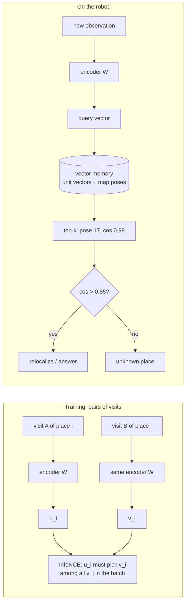

# FML.09 — Embeddings

<!-- glance:start -->
<!-- generated by tools/build.py from curriculum/syllabus.yaml — edit the syllabus, not this block -->

| | |
|---|---|
| **Track** | Optional foundation |
| **Difficulty** | Intermediate |
| **Time** | 45 min |
| **Hardware** | none |
| **Software** | python |
| **Prerequisites** | [FML.06 Neural networks from zero](FML.06-neural-networks.md) |
| **Optional prerequisites** | [FM.06 Dot product and cross product](../mathematics/FM.06-dot-and-cross-product.md) |
| **Skip if** | You use embeddings and similarity search. |

<!-- glance:end -->

## What you will learn

- Explain what an embedding is: a learned vector where "similar for the task" means "close in space".
- Compute cosine similarity by hand and use it for nearest-neighbour search.
- Explain contrastive learning and compute the InfoNCE loss for a small batch, including the role of temperature.
- Train a contrastive encoder in numpy that recognizes places from LiDAR + camera observations despite people, pose errors and lighting changes.
- Build a vector memory that stores embeddings with map poses and answers "where have I seen this?" — the structure behind CLIP-based object search (13.13) and robot semantic memory (19.08).

## Why it matters

You've used embeddings for RAG: text chunks become vectors, a query becomes a vector, the nearest vectors come back. Robots use exactly the same machinery, with different inputs:

- **Open-vocabulary perception.** CLIP maps images and text into one space, so "a red mug" can be matched against camera crops without ever training a mug detector. [13.13](../../13-computer-vision/13.13-embeddings-open-vocabulary.md) uses CLIP, OWLv2 and Grounding DINO on the robot.
- **Semantic memory.** The agent stores what it saw, where and when as vectors with map poses, then answers "where did I last see my keys?" by similarity search. [19.08](../../19-llm-robot-agents/19.08-memory-and-world-model.md) builds it.
- **Place recognition.** "Have I been here before?" closes loops in SLAM and relocalizes a kidnapped robot (module [11](../../11-slam/11.01-map-representations.md)).
- **Policy inputs.** VLAs feed image and language embeddings to their action heads ([18.07](../../18-embodied-ai/18.07-vision-language-action-models.md)).

This lesson builds a working place-recognition embedding from zero in numpy, so none of those later lessons are magic.

<!-- prereqs:start -->
## Prerequisites

You need these first:

- [FML.06 Neural networks from zero](FML.06-neural-networks.md)

### Optional prerequisite links

New to any of these? Take the foundation lesson first; skip it if you already know it.

- [FM.06 Dot product and cross product](../mathematics/FM.06-dot-and-cross-product.md)

Check your readiness: `python course.py why FML.09`
<!-- prereqs:end -->

## Concept

### A coordinate system for "sameness"

A LiDAR scan plus a camera color histogram is 96 numbers. Two observations of the same room on different days differ in many of those numbers: people walk through the scan, the robot stands 20 cm off, the evening lamps turn every color warmer. Two different rooms can look numerically closer than that. Raw vectors measure *pixel* similarity; we want *place* similarity.

An **embedding** is a function (an encoder) that maps each observation to a shorter vector, trained so that observations of the *same* place land close together and *different* places land far apart. Distance in the embedding space then means what you care about. What counts as "same" is decided entirely by the training data.

### How to train it without labels: contrastive learning

You don't need anyone to name the rooms. You only need pairs you *know* are the same thing:

- two visits of the same place (the robot's odometry says it's back at the same spot),
- two augmented crops of one image (SimCLR),
- an image and its caption (CLIP, 400 million pairs from the web).

Training shows the encoder a batch of such pairs. For each item, its partner is the **positive**; every other item in the batch is a **negative**. The loss (InfoNCE) is simply softmax cross-entropy ([FML.04](FML.04-loss-functions.md)): "among all these candidates, pick your partner." The encoder learns to ignore whatever varies between positives (people, lighting, small pose errors) and keep whatever distinguishes places (room geometry, wall colors).

### Cosine similarity and vector search

Similarity is usually the **cosine of the angle** between two embeddings: 1 = same direction, 0 = unrelated, −1 = opposite. Normalize every vector to length 1 and cosine is just a dot product, so a memory of 100,000 embeddings is one matrix multiplication away from an answer (or an approximate-nearest-neighbour index like a vector database when it gets bigger).

> [!TIP]
> **Ask your teacher:** "Explain CLIP's training objective using the same batch-of-pairs picture as this lesson, then explain why that lets a robot find 'the blue watering can' without a detector trained on watering cans."

## Technical explanation

### Level 1 — Vocabulary

| Term | Meaning | Robot example |
|---|---|---|
| Embedding | vector representation from an encoder | 16-D place code; 512-D CLIP image vector |
| Encoder | the function producing it | a matrix here; a ViT in CLIP |
| Cosine similarity | $\cos\theta$ between two vectors | 0.99 = same place |
| Positive / negative pair | should be close / far | two visits of room 17 / room 17 vs room 30 |
| Contrastive loss (InfoNCE) | cross-entropy "pick your positive" | trains the encoder |
| Temperature τ | sharpens or softens the softmax | 0.07–0.1 typical |
| Recall@k | fraction of queries whose true match is in the top k | place recognition metric |

### Level 2 — Practical use

1. **Pick or train the encoder.** For images and text, use a pretrained one (CLIP/SigLIP/DINOv2, [13.13](../../13-computer-vision/13.13-embeddings-open-vocabulary.md)). For robot-specific signals (scans, proprioception) you may train your own, as here.
2. **Normalize** embeddings to unit length before storing.
3. **Store** each vector with its metadata: map pose, timestamp, camera frame id, label.
4. **Query** with top-k cosine similarity; for thousands of entries brute force is fine, for millions use an ANN index (FAISS, a vector database).
5. **Threshold.** Always return the similarity score and reject weak matches. "The best match" for a place you've never visited is still *something*.
6. **Evaluate** with recall@k on held-out places/sessions ([FML.03](FML.03-train-validation-test.md)).

### Level 3 — The math

**Cosine similarity:**

$$\cos(a, b) = \frac{a \cdot b}{\lVert a\rVert\,\lVert b\rVert}$$

*Numerical example:* $a = (0.9, 0.1, 0.4)$, $b = (0.8, 0.3, 0.5)$. $a\cdot b = 0.72 + 0.03 + 0.20 = 0.95$. $\lVert a\rVert = \sqrt{0.81 + 0.01 + 0.16} = 0.990$, $\lVert b\rVert = \sqrt{0.64 + 0.09 + 0.25} = 0.990$. $\cos = 0.95/(0.990 \cdot 0.990) = 0.969$: very similar. Dot products and norms come from [FM.06](../mathematics/FM.06-dot-and-cross-product.md).

**InfoNCE loss.** A batch of $N$ positive pairs $(x_i, x_i^+)$, encoder $f$, unit-normalized embeddings $u_i = f(x_i)/\lVert f(x_i)\rVert$, $v_j = f(x_j^+)/\lVert f(x_j^+)\rVert$:

$$L = -\frac1N\sum_{i=1}^{N} \ln \frac{\exp(u_i\cdot v_i/\tau)}{\sum_{j=1}^{N}\exp(u_i\cdot v_j/\tau)}$$

Each row is a softmax cross-entropy whose correct "class" is the partner. With random embeddings the loss is about $\ln N$ (guessing among $N$).

*Numerical example:* one anchor, 4 candidates with cosine similarities $[0.9, 0.2, 0.1, -0.3]$, the first being the positive.
- $\tau = 0.1$: logits $[9, 2, 1, -3]$ → softmax $[0.9987, 0.0009, 0.0003, 0.0000]$ → loss $-\ln 0.9987 = 0.0013$.
- $\tau = 1.0$: logits $[0.9, 0.2, 0.1, -0.3]$ → softmax $[0.445, 0.221, 0.200, 0.134]$ → loss $0.810$ (random guessing: $\ln 4 = 1.386$).

Small τ makes small similarity differences decisive; that's why contrastive models use τ ≈ 0.07–0.1.

**Gradient through the normalization** (used in the code): for $u = z/\lVert z\rVert$, $\;\partial L/\partial z = (g - u\,(u\cdot g))/\lVert z\rVert$ where $g = \partial L/\partial u$. It removes the component along $u$: changing a vector's length doesn't change its direction.

**CLIP in one line.** Same loss, but $x_i$ is an image, $x_i^+$ its caption, and there are two encoders (image ViT, text transformer) projecting into a shared space. Then "a photo of a red mug" can be compared with any camera crop.

### Level 4 — What the code does

- **Data:** 400 simulated rooms (random size, 2–5 round furniture items, a color histogram). An observation = 72 LiDAR log-ranges + 24 color bins. A *visit* adds pose error (σ = 20 cm, 3°), two walking people, range noise, and a random lighting change (brightness and warm/cool shift of the whole histogram).
- **Database:** one clean observation per test place (the map). **Queries:** a new visit to each test place.
- **Baseline:** cosine similarity on the raw 96 numbers (mean-centered).
- **Encoder:** a single 16×96 matrix, trained with InfoNCE on pairs of visits to 300 *training* places, 128 pairs per batch, Adam, gradient derived by hand (FML.07's backprop, specialized). Test places are never seen in training.
- **Memory:** `VectorMemory` stores unit vectors with a pose and returns top-k with scores.

## Diagram



```text
Embedding space (2-D sketch of 16-D)

        room 30 ●  ○ room 30, evening lamps
                     ▲ positives pulled together
   room 17 ●○  ◄──── query "place 17" lands here: cos 0.99 with room 17
        ▼ negatives pushed apart
                        ● room 33
   ○ new, never-visited room: nearest is room 8 with cos 0.67 → below threshold → "unknown"
```

## Code

Save both files in the same folder. Run `python fml09_embeddings.py` (numpy only, a few seconds), then `python fml09_place_memory.py`.

`fml09_embeddings.py`:

```python
"""FML.09 — embeddings: place recognition from LiDAR + camera colors with cosine similarity and a contrastive encoder.

Pure numpy. The encoder is a single matrix; the gradient of the InfoNCE loss is written out by hand.
"""
from __future__ import annotations

from dataclasses import dataclass

import numpy as np

BEAMS = 72   # LiDAR: one beam every 5 degrees
COLORS = 24  # camera: a 24-bin color histogram
_rng_light = np.random.default_rng(12345)
WARM_COOL = _rng_light.normal(0.0, 1.0, COLORS) / np.sqrt(COLORS) * 3  # how color temperature shifts the histogram


@dataclass(frozen=True)
class Place:
    length: float
    width: float
    furniture: np.ndarray  # (k, 3): x, y, radius of round obstacles
    x: float
    y: float
    colors: np.ndarray     # (24,) what the camera's color histogram looks like here in neutral light


def random_place(rng: np.random.Generator) -> Place:
    length, width = rng.uniform(3.0, 8.0), rng.uniform(3.0, 8.0)
    k = rng.integers(2, 6)
    furniture = np.column_stack([rng.uniform(0.5, length - 0.5, k), rng.uniform(0.5, width - 0.5, k), rng.uniform(0.2, 0.6, k)])
    return Place(length, width, furniture, rng.uniform(1.0, length - 1.0), rng.uniform(1.0, width - 1.0),
                 rng.normal(0.0, 0.3, COLORS))


def ray_circles(px: float, py: float, c: np.ndarray, s: np.ndarray, circles: np.ndarray) -> np.ndarray:
    """Distance along each ray to the nearest circle (inf if none)."""
    best = np.full(len(c), np.inf)
    for cx, cy, r in circles:
        ox, oy = px - cx, py - cy
        b = ox * c + oy * s
        disc = b ** 2 - (ox ** 2 + oy ** 2 - r ** 2)
        t = -b - np.sqrt(np.maximum(disc, 0.0))
        best = np.where((disc > 0) & (t > 0), np.minimum(best, t), best)
    return best


def observe(rng: np.random.Generator, place: Place, clean: bool = False) -> np.ndarray:
    """One observation = 72 log-ranges + 24 color bins.

    Not clean = the robot is ~20 cm off, a few degrees rotated, two people walk by,
    and the lighting is different (sunny morning vs lamps at night).
    """
    px, py, yaw = place.x, place.y, 0.0
    obstacles = place.furniture
    colors = place.colors.copy()
    if not clean:
        px, py = px + rng.normal(0, 0.2), py + rng.normal(0, 0.2)
        yaw = rng.normal(0.0, np.deg2rad(3.0))
        people = np.column_stack([px + rng.uniform(-2, 2, 2), py + rng.uniform(-2, 2, 2), np.full(2, 0.25)])
        far_enough = np.hypot(people[:, 0] - px, people[:, 1] - py) > 0.5
        obstacles = np.vstack([obstacles, people[far_enough]])
        brightness, warmth = rng.normal(0.0, 1.0), rng.normal(0.0, 1.0)
        colors += brightness + warmth * WARM_COOL + rng.normal(0.0, 0.05, COLORS)
    ang = yaw + np.deg2rad(np.arange(BEAMS) * 360 / BEAMS)
    c, s = np.cos(ang), np.sin(ang)
    with np.errstate(divide="ignore"):
        tx = np.where(c > 0, (place.length - px) / c, np.where(c < 0, -px / c, np.inf))
        ty = np.where(s > 0, (place.width - py) / s, np.where(s < 0, -py / s, np.inf))
    r = np.minimum(np.minimum(tx, ty), ray_circles(px, py, c, s, obstacles))
    if not clean:
        r = r + rng.normal(0, 0.02, BEAMS)
    log_range = np.log(np.clip(r, 0.1, 12.0))  # 10 cm matters more at 0.5 m than at 8 m
    return np.concatenate([log_range, colors])


def normalize(v: np.ndarray) -> np.ndarray:
    return v / np.linalg.norm(v, axis=-1, keepdims=True)


def cosine_similarity(a: np.ndarray, b: np.ndarray) -> np.ndarray:
    return normalize(a) @ normalize(b).T


def recall_at_1(query_emb: np.ndarray, db_emb: np.ndarray) -> float:
    """Fraction of queries whose most similar database entry is the correct place (row i <-> place i)."""
    sims = cosine_similarity(query_emb, db_emb)
    return float(np.mean(np.argmax(sims, axis=1) == np.arange(len(query_emb))))


def info_nce_and_grad(w: np.ndarray, xa: np.ndarray, xb: np.ndarray, tau: float) -> tuple[float, np.ndarray]:
    """InfoNCE loss for a batch of positive pairs (xa[i], xb[i]); every other row is a negative."""
    n = len(xa)
    za, zb = xa @ w.T, xb @ w.T
    na, nb = np.linalg.norm(za, axis=1, keepdims=True), np.linalg.norm(zb, axis=1, keepdims=True)
    ua, ub = za / na, zb / nb
    logits = ua @ ub.T / tau
    logits -= logits.max(axis=1, keepdims=True)
    probs = np.exp(logits) / np.exp(logits).sum(axis=1, keepdims=True)
    loss = float(-np.mean(np.log(probs[np.arange(n), np.arange(n)])))
    d_logits = (probs - np.eye(n)) / n
    d_ua, d_ub = d_logits @ ub / tau, d_logits.T @ ua / tau
    d_za = (d_ua - ua * np.sum(d_ua * ua, axis=1, keepdims=True)) / na   # gradient through normalization
    d_zb = (d_ub - ub * np.sum(d_ub * ub, axis=1, keepdims=True)) / nb
    return loss, d_za.T @ xa + d_zb.T @ xb


def train_encoder(rng: np.random.Generator, views: np.ndarray, mean: np.ndarray, dim: int = 16,
                  steps: int = 2000, verbose: bool = True) -> np.ndarray:
    """Contrastive training: two visits of the same place = positive pair. Returns W (dim x 96)."""
    n_places, n_visits, n_features = views.shape
    w = rng.normal(0, 0.1, (dim, n_features))
    m, v = np.zeros_like(w), np.zeros_like(w)
    for step in range(1, steps + 1):
        places = rng.choice(n_places, 128, replace=False)
        pick = rng.integers(0, n_visits, (128, 2))
        xa = views[places, pick[:, 0]] - mean   # visit A of each place
        xb = views[places, pick[:, 1]] - mean   # visit B of the SAME place = positive pair
        loss, g = info_nce_and_grad(w, xa, xb, tau=0.1)
        m, v = 0.9 * m + 0.1 * g, 0.999 * v + 0.001 * g ** 2
        w -= 3e-3 * (m / (1 - 0.9 ** step)) / (np.sqrt(v / (1 - 0.999 ** step)) + 1e-8)
        if verbose and step in (1, 200, 2000):
            print(f"step {step:4d}  InfoNCE loss {loss:.3f}  (random guessing: ln(128) = {np.log(128):.3f})")
    return w


def main() -> None:
    rng = np.random.default_rng(1)
    train_places = [random_place(rng) for _ in range(300)]
    test_places = [random_place(rng) for _ in range(100)]    # never seen during training

    database = np.stack([observe(rng, p, clean=True) for p in test_places])   # the map: one stored observation per place
    queries = np.stack([observe(rng, p) for p in test_places])                # the robot comes back another day
    views = np.stack([[observe(rng, p) for _ in range(16)] for p in train_places])  # (300, 16, 96) training visits
    mean = views.reshape(-1, views.shape[-1]).mean(axis=0)
    print(f"raw 96-D observations, cosine: recall@1 = {recall_at_1(queries - mean, database - mean):.2f}")
    print(f"raw LiDAR part only, cosine:   recall@1 = {recall_at_1((queries - mean)[:, :BEAMS], (database - mean)[:, :BEAMS]):.2f}")

    w = train_encoder(rng, views, mean)
    q_emb, db_emb = (queries - mean) @ w.T, (database - mean) @ w.T
    print(f"learned {w.shape[0]}-D embedding, cosine: recall@1 = {recall_at_1(q_emb, db_emb):.2f}")


if __name__ == "__main__":
    main()
```

Output (Python 3.14, numpy 2.5):

```text
raw 96-D observations, cosine: recall@1 = 0.66
raw LiDAR part only, cosine:   recall@1 = 0.65
step    1  InfoNCE loss 5.242  (random guessing: ln(128) = 4.852)
step  200  InfoNCE loss 0.374  (random guessing: ln(128) = 4.852)
step 2000  InfoNCE loss 0.093  (random guessing: ln(128) = 4.852)
learned 16-D embedding, cosine: recall@1 = 1.00
```

Raw observations find the right place only 66 % of the time: lighting shifts swamp the color part and people and pose errors disturb the LiDAR part. The learned 16-D embedding — 6× shorter — finds all 100 unseen places. It learned *which directions in the 96-D input vary between visits* (lighting, people) and squashed them.

`fml09_place_memory.py`:

```python
"""FML.09 part 2 — a vector memory: store (embedding, map pose) while exploring, ask "where have I seen this?" later.

The same data structure holds CLIP image embeddings of objects in lesson 19.08; here it holds place embeddings.
"""
from __future__ import annotations

from dataclasses import dataclass, field

import numpy as np

import fml09_embeddings as emb


@dataclass
class VectorMemory:
    dim: int
    keys: list[np.ndarray] = field(default_factory=list)
    poses: list[tuple[float, float]] = field(default_factory=list)

    def add(self, embedding: np.ndarray, pose: tuple[float, float]) -> None:
        self.keys.append(embedding / np.linalg.norm(embedding))      # store unit vectors
        self.poses.append(pose)

    def query(self, embedding: np.ndarray, k: int = 3) -> list[tuple[float, tuple[float, float]]]:
        sims = np.stack(self.keys) @ (embedding / np.linalg.norm(embedding))  # cosine = dot of unit vectors
        best = np.argsort(-sims)[:k]
        return [(float(sims[i]), self.poses[i]) for i in best]


def main() -> None:
    rng = np.random.default_rng(1)
    train_places = [emb.random_place(rng) for _ in range(300)]
    views = np.stack([[emb.observe(rng, p) for _ in range(16)] for p in train_places])
    mean = views.reshape(-1, views.shape[-1]).mean(axis=0)
    w = emb.train_encoder(rng, views, mean, verbose=False)

    # Explore a new building: 50 places, each stored once with the map position where it was seen.
    building = [emb.random_place(rng) for _ in range(50)]
    memory = VectorMemory(dim=w.shape[0])
    for i, place in enumerate(building):
        memory.add(w @ (emb.observe(rng, place) - mean), pose=(float(i), 0.0))   # pose = (place index, 0) for readability

    # Days later the robot is carried to place 17 (kidnapped robot): where am I?
    for name, place in (("place 17", building[17]), ("a room never visited", emb.random_place(rng))):
        hits = memory.query(w @ (emb.observe(rng, place) - mean))
        print(f"{name:22s} top-3: " + ", ".join(f"pose {p[0]:.0f} (cos {s:.2f})" for s, p in hits))


if __name__ == "__main__":
    main()
```

Output:

```text
place 17               top-3: pose 17 (cos 0.99), pose 30 (cos 0.77), pose 33 (cos 0.58)
a room never visited   top-3: pose 8 (cos 0.67), pose 9 (cos 0.62), pose 36 (cos 0.46)
```

For the known place the right answer wins by a wide margin. For an unknown room, the memory *still returns a best match* — only the score (0.67) says it's wrong. Swap the place encoder for CLIP and the poses for object positions, and this class is the core of [19.08](../../19-llm-robot-agents/19.08-memory-and-world-model.md).

## Exercise

### Exercise FML.09-E1 — Cosine similarity by hand `[numerical]`

Hardware: none.

With $a = (0.9, 0.1, 0.4)$ and $c = (-0.2, 0.9, 0.1)$, compute $\cos(a, c)$ by hand. Then compute $\cos(a, 2a)$ and $\cos(a, -a)$ without a calculator. What does the result for $2a$ tell you about why embeddings are normalized?

### Exercise FML.09-E2 — InfoNCE with a hard negative `[numerical]`

Hardware: none.

Anchor similarities to 4 candidates: $[0.9, 0.85, 0.1, -0.3]$, positive first, τ = 0.1. Compute the softmax probabilities and the loss. Compare with the lesson's $[0.9, 0.2, 0.1, -0.3]$ (loss 0.0013). Which pairs does training "work hardest" on?

### Exercise FML.09-E3 — Choose the "unknown place" threshold `[predict]`

Hardware: none.

Before running more code: using the two outputs of `fml09_place_memory.py`, propose a cosine threshold for "I recognize this place". Then extend the script to query all 50 known places (a new visit each) and 50 never-visited rooms, and print the *lowest* top-1 similarity among known places and the *highest* top-1 similarity among unknown rooms. Did your threshold separate them?

### Exercise FML.09-E4 — How many dimensions? `[coding]`

Hardware: none.

Call `train_encoder(np.random.default_rng(5), views, mean, dim=d, verbose=False)` for d = 2, 4, 16, 64 (reusing the data built in `main`) and print recall@1 on the test queries for each. Where do returns stop?

## Expected result

- **FML.09-E1:** $a\cdot c = -0.18 + 0.09 + 0.04 = -0.05$; $\lVert c\rVert = \sqrt{0.04 + 0.81 + 0.01} = 0.927$; $\cos = -0.05/(0.990\cdot0.927) = -0.054$: unrelated. $\cos(a, 2a) = 1$ and $\cos(a, -a) = -1$. Cosine ignores length; normalizing makes a dot product equal to cosine and stops "loud" observations (long vectors) dominating a dot-product search.
- **FML.09-E2:** logits $[9, 8.5, 1, -3]$ → softmax $[0.6223, 0.3775, 0.0002, 0.0000]$, loss $= -\ln 0.6223 = 0.474$ — 380× larger than with the easy negative. The gradient is concentrated on **hard negatives** (different places that look alike); easy negatives contribute almost nothing. That's why large batches (more chances of hard negatives) help contrastive training.
- **FML.09-E3:** a threshold around 0.85 is a reasonable first proposal from the two outputs (0.99 known vs 0.67 unknown). Tested run (queries continuing with the same generator after `main`'s setup): all 50 known places matched the correct pose; lowest known top-1 similarity **0.906** (median 0.96); highest unknown top-1 similarity **0.790** (median 0.54). Any threshold between 0.79 and 0.90 separates them; 0.85 sits in the middle. With more rooms the ranges would start to overlap and the threshold becomes a precision/recall trade-off, exactly like [FML.02](FML.02-supervised-learning.md)'s classifier threshold.
- **FML.09-E4:** tested run: d = 2 → 0.10, d = 4 → 0.86, d = 16 → 1.00, d = 64 → 1.00. Two numbers can't separate 100 places; 16 are enough for this simulated world. Real CLIP embeddings use 512–1024 dimensions because they separate millions of concepts.

## Troubleshooting

### Symptom: recall doesn't improve during contrastive training

1. Print the InfoNCE loss. Stuck near $\ln(\text{batch})$ → nothing learned: check that positive pairs are really the same place (index alignment bug `xa[i]` ↔ `xb[i]`).
2. Check the gradient with finite differences on a tiny batch ([FML.07](FML.07-backprop-pytorch.md)); the normalization gradient is easy to get wrong.
3. Temperature: τ = 1 makes the task too soft; try 0.05–0.1.
4. Duplicates in a batch (the same place twice) create false negatives; sample places without replacement.

### Symptom: similarity search returns confident wrong matches on the robot

1. Check preprocessing matches training (mean subtraction, log-ranges, color bin order).
2. Check that stored and query vectors are both normalized.
3. Inspect the top-5 scores: if many are near-equal, places are genuinely ambiguous → add information (more sensors) or require agreement over several consecutive frames.
4. Distribution shift: the real building has features the simulator didn't (glass walls, mirrors). Collect real pairs and fine-tune.

### Symptom: unknown places get matched to something

That's what nearest-neighbour search does. Apply a threshold on similarity, and if possible a margin test (top-1 must beat top-2 by ≥ 0.1).

## Common mistakes

- **Comparing un-normalized vectors with a dot product.** Long vectors win regardless of direction.
- **Trusting top-1 without its score.** There is always a nearest neighbour.
- **Mixing embeddings from different models** (or model versions) in one memory. Their spaces are unrelated; re-embed everything when you change the encoder.
- **Evaluating on training places.** Recall on the places used for contrastive training is meaningless; hold out places and sessions.
- **Assuming a general-purpose embedding captures what your robot needs.** CLIP knows "mug", not "*my* mug on *this* shelf"; store poses and timestamps too.

## Knowledge check

1. Define an embedding in one sentence, and give one robot example.
   <details><summary>Answer</summary>

   A learned vector representation in which distance reflects task-relevant similarity; e.g. a CLIP image embedding of a camera crop, or a place embedding of a LiDAR scan.
   </details>

2. Compute $\cos(a, b)$ for $a = (1, 0)$ and $b = (1, 1)$.
   <details><summary>Answer</summary>

   $a\cdot b = 1$; $\lVert a\rVert = 1$, $\lVert b\rVert = \sqrt2$; $\cos = 1/\sqrt2 = 0.707$ (45°).
   </details>

3. What are the positives and negatives in CLIP's training, and what is the loss?
   <details><summary>Answer</summary>

   Positive: an image and its own caption. Negatives: that image with every other caption in the batch (and vice versa). Loss: symmetric InfoNCE — softmax cross-entropy over the batch's similarity matrix, targets on the diagonal.
   </details>

4. With random embeddings and batch size 128, what InfoNCE loss do you expect, and why?
   <details><summary>Answer</summary>

   About $\ln 128 = 4.85$: picking the positive among 128 roughly equally likely candidates.
   </details>

5. Predict: you lower the temperature τ from 0.1 to 0.01. What happens to the loss's sensitivity to small similarity differences, and what risk appears?
   <details><summary>Answer</summary>

   Logits scale ×10, so tiny differences become decisive (sharper softmax). Risks: very large gradients on the hardest negatives, unstable training, over-penalizing near-duplicate negatives that are actually the same place.
   </details>

6. Your semantic memory answers "where are my keys?" with a pose in the kitchen, similarity 0.21. What should the agent say?
   <details><summary>Answer</summary>

   That it doesn't know / hasn't seen them: 0.21 is far below any sensible match threshold. Returning the pose would be a confident hallucination.
   </details>

7. After upgrading the CLIP model, all memory queries return nonsense. Why?
   <details><summary>Answer</summary>

   Stored vectors came from the old model's embedding space; the new model's space is different, so similarities between old keys and new queries are meaningless. Re-embed the stored images with the new model (keep the images/crops, not only vectors).
   </details>

## Practical challenge

Build a **semantic object memory** for the simulated robot. Simulate 30 object sightings: each object type (mug, keys, book, …, 8 types) has a fixed random "true" 32-D embedding; each sighting adds noise (σ = 0.3 per dimension) and gets a map pose (x, y) and a timestamp. Store them in `VectorMemory` extended with timestamps. Implement `where_is(query_embedding, now)` returning the most recent pose among matches above a threshold, or "not seen".

Acceptance criteria:
- For each of the 8 object types, querying with a fresh noisy embedding returns the pose of that type's *latest* sighting.
- Querying with a random vector returns "not seen".
- The threshold is chosen from measured similarity distributions (print known-match and non-match similarity ranges), not guessed.

## You can skip this if…

You can answer knowledge-check questions 3, 4 and 6 without looking and you have built similarity search over embeddings (RAG or similar) before. Then: `python course.py skip FML.09 --reason "use embeddings and similarity search"`.

## Go deeper

- Radford et al., "Learning Transferable Visual Models From Natural Language Supervision" (CLIP, 2021) — https://arxiv.org/abs/2103.00020 — section 2.3 and Figure 3 give the whole training loop in 20 lines of pseudocode.
- van den Oord et al., "Representation Learning with Contrastive Predictive Coding" (2018) — https://arxiv.org/abs/1807.03748 — where the InfoNCE loss comes from.
- Chen et al., "A Simple Framework for Contrastive Learning of Visual Representations" (SimCLR, 2020) — https://arxiv.org/abs/2002.05709 — contrastive learning with augmentations; shows the effect of temperature and batch size.
- Hugging Face Community Computer Vision Course — https://huggingface.co/learn/computer-vision-course/unit0/welcome/welcome — practical units on CLIP-style multimodal models with runnable notebooks.
- Understanding Deep Learning (Prince) — https://udlbook.github.io/udlbook/ — free book; the chapters on transformers and unsupervised learning frame embeddings formally.

## Progress checkpoint

- [ ] I can explain what an embedding is and why it beats raw-vector similarity.
- [ ] I can compute cosine similarity and an InfoNCE loss by hand.
- [ ] I trained a contrastive encoder and measured recall@1 on unseen places.
- [ ] I built a vector memory that returns poses with scores and rejects unknown queries.

`python course.py complete FML.09` (exercises done) · `python course.py master FML.09` (challenge done) · `python course.py struggle FML.09 "what was hard"`.

Next: [FML.10 — Transformers and attention](FML.10-transformers-attention.md).
