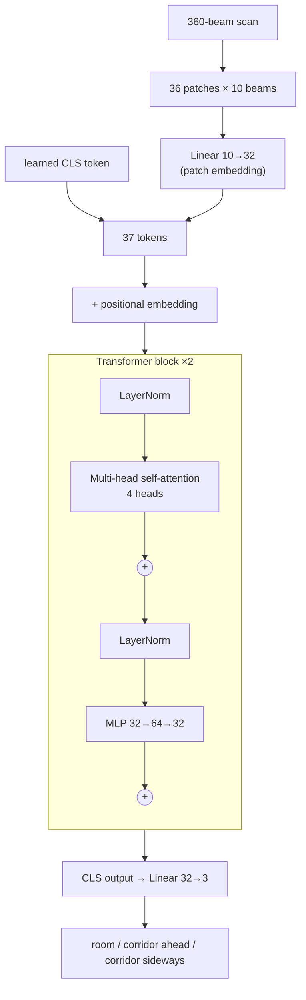
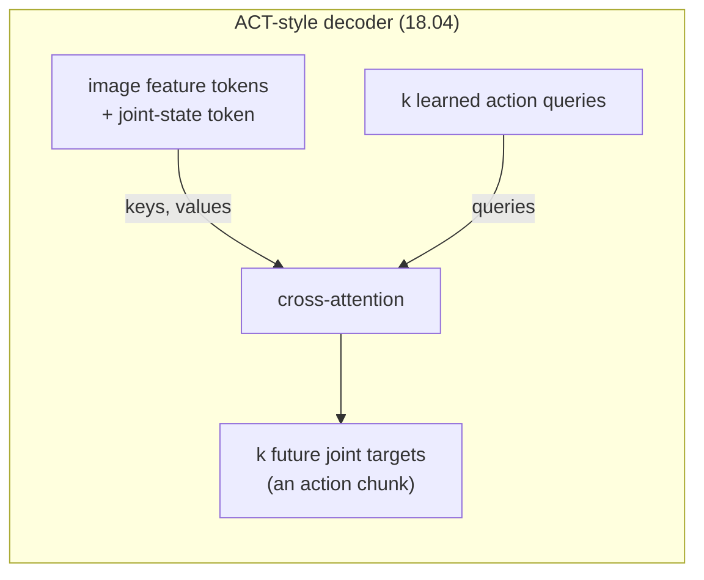

# FML.10 — Transformers and attention

<!-- glance:start -->
<!-- generated by tools/build.py from curriculum/syllabus.yaml — edit the syllabus, not this block -->

| | |
|---|---|
| **Track** | Optional foundation |
| **Difficulty** | Intermediate |
| **Time** | 1 h 15 min |
| **Hardware** | none |
| **Software** | python, pytorch |
| **Prerequisites** | [FML.09 Embeddings](FML.09-embeddings.md)<br>[FML.07 Backpropagation and PyTorch basics](FML.07-backprop-pytorch.md) |
| **Skip if** | You understand self-attention and ViTs. |

<!-- glance:end -->

## What you will learn

- Explain tokens as the universal interface: text pieces, image patches, LiDAR sectors, joint states and robot actions all become vectors in a sequence.
- Compute scaled dot-product attention by hand (queries, keys, values, softmax) and implement it in numpy, checked against PyTorch.
- Describe a transformer block (multi-head attention, MLP, residuals, layer norm), causal masks, cross-attention and positional embeddings.
- Explain a vision transformer (ViT): patches → tokens → CLS token → classifier, and compute token counts and attention cost for robot camera resolutions.
- Train a tiny ViT-style transformer on raw LiDAR scans and show experimentally why positional embeddings matter.

## Why it matters

You use transformers every day through LLMs. On robots they do much more than text:

- **ACT** ([18.04](../../18-embodied-ai/18.04-action-chunking-transformers.md)) — the first policy you'll train — is a transformer: camera-feature tokens and joint-state tokens go in, a decoder with learned *query tokens* outputs a chunk of future joint targets via cross-attention.
- **VLAs** ([18.07](../../18-embodied-ai/18.07-vision-language-action-models.md)) — RT-2, OpenVLA, π0, SmolVLA — put image patches, language tokens and robot state in one token sequence; actions come out either as discrete action tokens or through an action expert.
- **Vision encoders** — CLIP, SigLIP, DINOv2 — are ViTs ([13.13](../../13-computer-vision/13.13-embeddings-open-vocabulary.md), [13.14](../../13-computer-vision/13.14-vision-language-models.md)).

The robot-specific questions are *which tokens*, *how many* (latency grows quadratically) and *how position/time is encoded*. That's what this lesson gives you, from zero.

<!-- prereqs:start -->
## Prerequisites

You need these first:

- [FML.09 Embeddings](FML.09-embeddings.md)
- [FML.07 Backpropagation and PyTorch basics](FML.07-backprop-pytorch.md)

### Optional prerequisite links

None.

Check your readiness: `python course.py why FML.10`
<!-- prereqs:end -->

## Concept

### Everything becomes a token

A transformer doesn't know what text or images are. It takes a **set of vectors** (tokens), lets every token look at every other token, and updates each one. To use it, you chop your input into pieces and embed each piece as a vector ([FML.09](FML.09-embeddings.md)):

| Input | One token = | Count |
|---|---|---|
| Instruction "pick up the red cup" | a sub-word piece | ~6–8 |
| 224×224 camera image, patch 16 | one 16×16×3 patch, flattened and projected | 196 |
| 360-beam LiDAR scan, patch 10 | a 10° sector | 36 |
| Robot state | the 6 joint angles, projected | 1 |
| Action chunk | one future timestep of joint targets (or a discretized action bin) | 50–100 |

### Attention: a soft database lookup

You know key–value stores. Attention is a *soft* lookup:

- Each token emits a **query** ("what am I looking for?"), a **key** ("what do I contain?") and a **value** ("what do I hand over if selected?").
- A token's query is compared (dot product) with every key → similarity scores.
- Softmax turns scores into weights that sum to 1.
- The token's new representation is the weighted average of all values.

Instead of returning exactly one row, it returns a blend, weighted by relevance — and because it's all matrix multiplications, it's differentiable, so the network *learns* what to ask for and what to advertise. Example: the language token "red cup" learns to put high weight on image-patch tokens that contain red cup pixels. That's grounding.

### What attention doesn't know: order

Attention treats its input as a set. Shuffle the tokens and the outputs shuffle identically — nothing else changes. But beam 90 of a LiDAR scan is "to the left" and patch 0 of an image is "top-left". So transformers add a **positional embedding** to each token: a learned (or sinusoidal) vector per position. The experiment in this lesson removes it and watches accuracy fall from 98 % to 69 % on a task where direction matters.

### The block and the stack

A transformer block = attention (tokens exchange information) + a small MLP applied to each token separately (tokens process what they gathered), each wrapped in a residual connection ("add the input back") and layer normalization. Stack 2 blocks (this lesson), 12 (ViT-Base), or dozens (VLA backbones).

> [!TIP]
> **Ask your teacher:** "Walk me through ACT's architecture as tokens: what goes into the encoder, what the decoder's queries are, and where cross-attention happens. Then compare it with how π0 feeds images, text and actions to its model."

## Technical explanation

### Level 1 — Vocabulary

| Term | Meaning |
|---|---|
| Token | one vector in the input sequence, dimension $d$ |
| $Q, K, V$ | queries, keys, values: learned linear projections of tokens |
| Self-attention | $Q$, $K$, $V$ all from the same sequence |
| Cross-attention | $Q$ from one sequence (e.g. action queries), $K, V$ from another (image tokens) |
| Multi-head | several attentions in parallel, each with its own projections, outputs concatenated |
| Causal mask | token $i$ may only attend to tokens $\le i$ (autoregressive generation) |
| Positional embedding | vector added to each token to encode its position |
| CLS token | an extra learned token whose final state summarizes the sequence |
| Encoder / decoder | bidirectional stack / causal (or query-based) stack |

### Level 2 — Practical design on a robot

- **Token budget = latency budget.** Attention cost grows with $n^2$. Downscale images (224×224), use bigger patches, or compress image features (ACT feeds ResNet feature maps, not raw patches).
- **Position matters in robotics**: image layout, beam angle, timestep in an action chunk. Don't drop positional embeddings.
- **Pretrained encoders** (SigLIP, DINOv2) plus a small task-specific transformer is the common pattern; you rarely train a ViT from scratch on robot data.
- **Outputs:** classification via a CLS token; per-token outputs for dense tasks; learned query tokens + cross-attention for a fixed number of outputs (DETR boxes, ACT action chunks).

### Level 3 — The math

**Scaled dot-product attention** for $n_q$ queries and $n$ key/value tokens, key dimension $d_k$:

$$\mathrm{Attention}(Q, K, V) = \mathrm{softmax}\!\left(\frac{QK^\top}{\sqrt{d_k}}\right)V$$

with $Q = XW_Q$, $K = XW_K$, $V = XW_V$ for self-attention. Dividing by $\sqrt{d_k}$ keeps dot products from growing with dimension, so the softmax doesn't saturate.

**Numerical example (2 tokens, $d_k = 2$).** $q_1 = (1, 0)$, $q_2 = (0, 1)$; $k_1 = (1, 0)$, $k_2 = (0, 1)$; $v_1 = (1, 2)$, $v_2 = (3, 4)$.

- Token 1 scores: $q_1\cdot k_1 = 1$, $q_1\cdot k_2 = 0$; scaled by $1/\sqrt2$: $(0.707, 0)$.
- Softmax: $e^{0.707} = 2.028$, $e^0 = 1$ → weights $(2.028/3.028,\ 1/3.028) = (0.670,\ 0.330)$.
- Output: $0.670\,(1, 2) + 0.330\,(3, 4) = (1.660,\ 2.660)$.

Token 1 "looked mostly at itself" because its query matched its own key. Numpy code below prints `[[0.6698 0.3302] …]` and output `[1.6605 2.6605]`.

**Multi-head:** $h$ heads with $d_k = d/h$ each; concatenate, then an output projection $W_O$. Parameters of one attention layer: $4(d^2 + d)$ ($W_Q, W_K, W_V, W_O$ with biases). $d = 32$: $4\cdot(1024 + 32) = 4{,}224$.

**Transformer block (pre-norm, as in the code):**

$$x \leftarrow x + \mathrm{MHA}(\mathrm{LN}(x)),\qquad x \leftarrow x + \mathrm{MLP}(\mathrm{LN}(x))$$

**Causal mask:** set scores to $-\infty$ where $j > i$ before the softmax, so those weights are exactly 0.

**Cost.** The attention matrix has $n^2$ entries per head per layer.
- ViT on 224×224, patch 16: $n = 14\times14 = 196$ (+1 CLS) → ~38,000 entries.
- Full 640×480 camera, patch 16: $n = 40\times30 = 1{,}200$ → 1.44 million entries, **37×** more.
- A VLA with 3 cameras at 256 tokens each plus 48 text tokens: $n = 816$ → 665,856 entries per head per layer.

**Vision transformer (ViT):** split the image into $P\times P$ patches, flatten each ($P^2 C$ numbers), project to $d$ with a linear layer, prepend a CLS token, add positional embeddings, run the encoder, classify from the CLS output. The code does exactly this for a 1-D LiDAR scan: 36 patches of 10 beams.

### Level 4 — Implementation in PyTorch

- `torch.nn.functional.scaled_dot_product_attention(q, k, v, attn_mask=None, is_causal=False)` is the fused, fast implementation.
- `nn.TransformerEncoderLayer(d_model, nhead, dim_feedforward, dropout, batch_first=True, norm_first=True)` is a full block; `nn.TransformerEncoder(layer, num_layers)` stacks it.
- `batch_first=True` → tensors are `(batch, tokens, dim)`.
- The lesson's model has 18,755 parameters: patch embedding 352, CLS 32, positions 37×32 = 1,184, two blocks of 8,544 each (attention 4,224 + MLP 4,192 + two LayerNorms 128), head 99.

> [!IMPORTANT]
> **Version-sensitive** (verified 2026-09 against PyTorch 2.14, CPU wheel, Python 3.14).
> `scaled_dot_product_attention` and `TransformerEncoderLayer` arguments evolve between releases; check https://docs.pytorch.org/docs/stable/generated/torch.nn.functional.scaled_dot_product_attention.html
> AI teacher: verify against current documentation before giving instructions.

## Diagram





## Code

### Part 1 — Attention from scratch

Save as `fml10_attention_numpy.py`, run `python fml10_attention_numpy.py`. It needs numpy; if PyTorch is installed it also checks the result against PyTorch.

```python
"""FML.10 part 1 — scaled dot-product attention in numpy, checked against PyTorch."""
from __future__ import annotations

import numpy as np


def softmax(x: np.ndarray, axis: int = -1) -> np.ndarray:
    e = np.exp(x - x.max(axis=axis, keepdims=True))
    return e / e.sum(axis=axis, keepdims=True)


def attention(q: np.ndarray, k: np.ndarray, v: np.ndarray, mask: np.ndarray | None = None) -> tuple[np.ndarray, np.ndarray]:
    """q: (n_q, d_k), k: (n_kv, d_k), v: (n_kv, d_v). mask[i, j] = False blocks query i from key j."""
    scores = q @ k.T / np.sqrt(k.shape[-1])
    if mask is not None:
        scores = np.where(mask, scores, -np.inf)
    weights = softmax(scores, axis=-1)          # each row sums to 1: "how much does token i look at token j"
    return weights @ v, weights


def main() -> None:
    # Three tokens from a robot's world: a LiDAR patch, a camera patch, the language instruction.
    x = np.array([
        [1.0, 0.0, 1.0, 0.0],   # token 0: "obstacle ahead at 0.4 m" (LiDAR patch)
        [0.0, 1.0, 0.0, 1.0],   # token 1: "red cup, left of image"  (camera patch)
        [1.0, 1.0, 0.0, 0.0],   # token 2: "pick up the red cup"      (text)
    ])
    rng = np.random.default_rng(0)
    d = 2
    w_q, w_k, w_v = (rng.normal(0, 1, (d, 4)) for _ in range(3))   # learned in a real model
    q, k, v = x @ w_q.T, x @ w_k.T, x @ w_v.T

    out, weights = attention(q, k, v)
    np.set_printoptions(precision=3, suppress=True)
    print("attention weights (row = query token, column = key token):")
    print(weights)
    print("outputs:")
    print(out)

    causal = np.tril(np.ones((3, 3), dtype=bool))  # token i may only look at tokens 0..i
    _, w_causal = attention(q, k, v, causal)
    print("causal weights:")
    print(w_causal)

    perm = np.array([2, 0, 1])
    out_perm, _ = attention(q[perm], k[perm], v[perm])
    print("shuffle the tokens -> outputs shuffle the same way:", np.allclose(out_perm, out[perm]))

    try:
        import torch
        import torch.nn.functional as F
        t = lambda a: torch.tensor(a, dtype=torch.float64)[None]  # add a batch dimension
        ref = F.scaled_dot_product_attention(t(q), t(k), t(v))[0].numpy()
        print("matches torch.nn.functional.scaled_dot_product_attention:", np.allclose(ref, out))
    except ImportError:
        print("PyTorch not installed: skipped the comparison")


if __name__ == "__main__":
    main()
```

Output:

```text
attention weights (row = query token, column = key token):
[[0.151 0.663 0.186]
 [0.067 0.757 0.176]
 [0.383 0.278 0.339]]
outputs:
[[ 0.301  1.249]
 [ 0.389  1.465]
 [-0.141  0.592]]
causal weights:
[[1.    0.    0.   ]
 [0.081 0.919 0.   ]
 [0.383 0.278 0.339]]
shuffle the tokens -> outputs shuffle the same way: True
matches torch.nn.functional.scaled_dot_product_attention: True
```

Every row of weights sums to 1. With the causal mask, token 0 can only attend to itself (weight 1.0) and the last row is unchanged (it could already see everything before it). The shuffle test is the permutation-equivariance property: attention has no notion of order.

### Part 2 — A tiny transformer reads raw LiDAR scans

Now the scan task gets harder than in [FML.02](FML.02-supervised-learning.md): three classes — **room**, **corridor running ahead/behind** the robot, **corridor running left/right** of it. The second and third look identical except for *which direction* the long beams point, so the model must know which patch is which. No hand-made features: the model sees 360 log-ranges.

Save as `fml10_tiny_vit_lidar.py`, run `python fml10_tiny_vit_lidar.py` (PyTorch CPU; about 20 s per model on a laptop CPU).

```python
"""FML.10 part 2 — a tiny vision-transformer-style model that reads a raw LiDAR scan as 36 patch tokens.

Task, from the raw 360 ranges (no hand-made features, compare FML.02):
  0 = room, 1 = corridor running ahead/behind the robot, 2 = corridor running left/right of the robot.
"""
from __future__ import annotations

import time

import numpy as np
import torch
from torch import nn


def lidar_scan(rng: np.random.Generator, length: float, width: float, x: float, y: float, heading: float) -> np.ndarray:
    ang = heading + np.deg2rad(np.arange(360))
    c, s = np.cos(ang), np.sin(ang)
    with np.errstate(divide="ignore"):
        tx = np.where(c > 0, (length - x) / c, np.where(c < 0, -x / c, np.inf))
        ty = np.where(s > 0, (width - y) / s, np.where(s < 0, -y / s, np.inf))
    r = np.minimum(np.minimum(tx, ty) + rng.normal(0.0, 0.02, 360), 12.0)
    r[rng.random(360) < 0.03] = 12.0
    return r


def scan_dataset(rng: np.random.Generator, n: int) -> tuple[torch.Tensor, torch.Tensor]:
    scans, labels = [], []
    for _ in range(n):
        heading = rng.uniform(-np.pi, np.pi)                     # robot heading relative to the building's x axis
        if rng.random() < 2 / 3:                                  # corridor along the building's x axis
            length, width = 30.0, rng.uniform(1.0, 2.5)
            x, y = rng.uniform(5, 25), rng.uniform(0.3, width - 0.3)
            label = 1 if abs(np.cos(heading)) > np.cos(np.pi / 4) else 2
        else:
            length, width = rng.uniform(2.5, 9.0), rng.uniform(2.5, 9.0)
            x, y, label = rng.uniform(0.3, length - 0.3), rng.uniform(0.3, width - 0.3), 0
        scans.append(lidar_scan(rng, length, width, x, y, heading))
        labels.append(label)
    x_np = np.log(np.array(scans, dtype=np.float32))             # log-range, like FML.09
    return torch.from_numpy(x_np), torch.tensor(labels)


class TinyScanTransformer(nn.Module):
    def __init__(self, patch: int = 10, dim: int = 32, heads: int = 4, layers: int = 2, use_position: bool = True) -> None:
        super().__init__()
        self.patch = patch
        n_tokens = 360 // patch
        self.embed = nn.Linear(patch, dim)                                   # patch -> token (like ViT's 16x16 patches)
        self.cls = nn.Parameter(torch.zeros(1, 1, dim))                      # a learned "summary" token
        self.pos = nn.Parameter(torch.randn(1, n_tokens + 1, dim) * 0.02) if use_position else None
        block = nn.TransformerEncoderLayer(dim, heads, dim_feedforward=64, dropout=0.0, batch_first=True, norm_first=True)
        self.encoder = nn.TransformerEncoder(block, layers, enable_nested_tensor=False)
        self.head = nn.Linear(dim, 3)

    def forward(self, scans: torch.Tensor) -> torch.Tensor:
        tokens = self.embed(scans.reshape(len(scans), -1, self.patch))      # (B, 36, dim)
        tokens = torch.cat([self.cls.expand(len(scans), -1, -1), tokens], dim=1)  # (B, 37, dim)
        if self.pos is not None:
            tokens = tokens + self.pos
        return self.head(self.encoder(tokens)[:, 0])                         # read the answer from the CLS token


def train_and_test(use_position: bool, data: tuple[torch.Tensor, ...]) -> None:
    x_tr, y_tr, x_te, y_te = data
    torch.manual_seed(0)
    model = TinyScanTransformer(use_position=use_position)
    opt = torch.optim.AdamW(model.parameters(), lr=1e-3)
    loss_fn = nn.CrossEntropyLoss()
    t0 = time.perf_counter()
    for _ in range(15):
        model.train()
        order = torch.randperm(len(y_tr))
        for i in range(0, len(y_tr), 64):
            idx = order[i:i + 64]
            opt.zero_grad()
            loss_fn(model(x_tr[idx]), y_tr[idx]).backward()
            opt.step()
    model.eval()
    with torch.no_grad():
        acc = (model(x_te).argmax(1) == y_te).float().mean().item()
    n = sum(p.numel() for p in model.parameters())
    print(f"positional embedding={use_position!s:5}  params={n}  test accuracy {acc:.3f}  ({time.perf_counter() - t0:.1f} s)")


def main() -> None:
    torch.set_num_threads(1)  # tiny models: thread overhead costs more than it saves on most CPUs
    rng = np.random.default_rng(42)
    x_tr, y_tr = scan_dataset(rng, 2000)
    x_te, y_te = scan_dataset(rng, 1000)
    for use_position in (True, False):
        train_and_test(use_position, (x_tr, y_tr, x_te, y_te))


if __name__ == "__main__":
    main()
```

Output (PyTorch 2.14 CPU; times vary):

```text
positional embedding=True   params=18755  test accuracy 0.982  (22.5 s)
positional embedding=False  params=17571  test accuracy 0.687  (20.5 s)
```

With positions, 98 %. Without, the model still separates rooms from corridors (that doesn't need direction — note 0.687 is well above the 0.33 chance level) but can't tell "corridor ahead" from "corridor sideways": shuffling patches doesn't change what it computes. The CLS token is the only extra token, and it's identical in every input, so the model is blind to which patch sits at 0° (straight ahead).

## Exercise

### Exercise FML.10-E1 — Attention by hand `[numerical]`

Hardware: none.

Same 2-token example as Level 3, but token 1's query becomes $q_1 = (2, 0)$. Compute token 1's attention weights and output by hand (use $e^{1.414} = 4.113$). Did it attend more or less to itself? Why? Check with `attention()` from Part 1.

### Exercise FML.10-E2 — Predict the positional-embedding ablation `[predict]`

Hardware: none.

Before running Part 2, predict the test accuracy without positional embedding: ≈ 0.33, ≈ 0.67 or ≈ 0.98? Justify from the class definitions. Then run it.

### Exercise FML.10-E3 — Prove the causal mask blocks the future `[coding]`

Hardware: none.

With `attention()` from Part 1: create 3 random tokens `x` (shape 3×2) and use `q = k = v = x` with the causal mask. Change only token 2 (e.g. add 5 to it) and recompute. Check with `np.allclose` that outputs of tokens 0 and 1 are unchanged and token 2's output changed. Why does an autoregressive action or text generator need this property during training?

### Exercise FML.10-E4 — Token and attention budget for a VLA `[numerical]`

Hardware: none.

A robot VLA uses a vision encoder with 224×224 inputs and patch size 14, three cameras, a 48-token instruction, 1 state token and a 50-step action chunk handled by a separate action expert (not in this sequence). (a) Tokens per camera? (b) Sequence length? (c) Attention entries per head per layer? (d) If you switch to 448×448 inputs, by what factor does (c) grow?

## Expected result

- **FML.10-E1:** scores $q_1\cdot k_1 = 2$, $q_1\cdot k_2 = 0$; scaled $(1.414, 0)$; weights $(4.113/5.113,\ 1/5.113) = (0.804,\ 0.196)$; output $0.804(1,2) + 0.196(3,4) = (1.391,\ 2.391)$. More self-attention: a longer query (larger dot product) makes the softmax sharper. `attention()` prints weights `[0.8044 0.1956]` and output `[1.3911 2.3911]`. This is also why the $\sqrt{d_k}$ scaling exists.
- **FML.10-E2:** ≈ 0.67 (tested 0.687). One third of the data are rooms (distinguishable without direction); the two corridor classes are identical up to rotation, so without positions the model can at best guess between them: $1/3 + (2/3)\cdot\tfrac12 = 0.67$. With positions: 0.982.
- **FML.10-E3:** `np.allclose(o1[:2], o2[:2])` → `True`, `np.allclose(o1[2], o2[2])` → `False`. During training the model predicts every position of a known sequence in parallel; without the mask, position $i$ could simply read the answer at position $i+1$ (leakage, [FML.03](FML.03-train-validation-test.md)), and at inference time — when the future doesn't exist yet — it would fail.
- **FML.10-E4:** (a) $224/14 = 16$ → $16^2 = 256$ tokens; (b) $3\cdot256 + 48 + 1 = 817$; (c) $817^2 = 667{,}489$; (d) 448/14 = 32 → 1,024 tokens per camera, sequence $3{,}121$, entries $\approx 9.74$ million: ×14.6. Doubling image resolution roughly ×15 attention cost — a real latency decision on a Jetson ([16.04](../../16-machine-learning/16.04-models-on-edge-compute.md)).

## Troubleshooting

### Symptom: `RuntimeError` about shapes in `TransformerEncoderLayer`

1. Check `batch_first=True` and that your tensor is `(batch, tokens, dim)`, not `(tokens, batch, dim)`.
2. `d_model` must be divisible by `nhead`.
3. Positional embedding shape must broadcast: `(1, tokens, dim)`, and `tokens` must include the CLS token.

### Symptom: the transformer trains much worse than a CNN/MLP on a small robot dataset

1. Transformers have weak built-in assumptions and need more data. Use a pretrained encoder, fewer layers, or a CNN front end (as ACT does).
2. Check positional embeddings exist and are added (not concatenated along the wrong axis).
3. Learning rate: transformers like warm-up and AdamW with lr ~1e-4–1e-3; try lower.

### Symptom: inference too slow on the robot

1. Count tokens; cost ∝ layers × $n^2$. Reduce resolution, increase patch size, crop to the region of interest.
2. Use `scaled_dot_product_attention` (fused kernels), half precision on GPU, and batch cameras together.
3. Measure on the target device, not the desktop.

## Common mistakes

- **Dropping or mis-indexing positional embeddings**, making the model blind to direction/time.
- **Forgetting the causal mask** when training a generator, so training accuracy is perfect and inference is garbage.
- **Underestimating quadratic cost**: "just use full-resolution images" multiplies latency by 10–40×.
- **Confusing self- and cross-attention**: ACT's action queries attend *to* image tokens; image tokens don't attend to future actions.
- **Reading attention weights as explanations.** They show information flow in one layer, not a faithful reason for the decision.

## Knowledge check

1. Write the scaled dot-product attention formula and say what each of Q, K, V is for.
   <details><summary>Answer</summary>

   $\mathrm{softmax}(QK^\top/\sqrt{d_k})\,V$. Queries: what each token looks for; keys: what each token offers to be matched on; values: the content passed along when matched.
   </details>

2. Why divide by $\sqrt{d_k}$?
   <details><summary>Answer</summary>

   Dot products of random vectors grow in magnitude with dimension (std ∝ $\sqrt{d_k}$). Without scaling the softmax saturates to near one-hot, and gradients vanish.
   </details>

3. How many tokens does a ViT produce for a 224×224 image with patch size 16, including the CLS token?
   <details><summary>Answer</summary>

   $14 \times 14 + 1 = 197$.
   </details>

4. Predict: you shuffle the order of the patch tokens of a scan fed into a transformer with no positional embeddings. What happens to the CLS output?
   <details><summary>Answer</summary>

   Nothing: self-attention is permutation-equivariant, and the CLS token pools over all tokens symmetrically, so its output is identical. The model cannot use order.
   </details>

5. What is cross-attention, and where does ACT use it?
   <details><summary>Answer</summary>

   Attention where queries come from one sequence and keys/values from another. In ACT's decoder, learned action-query tokens (one per future timestep of the chunk) attend to the encoder's image/state tokens to produce the action chunk.
   </details>

6. Your VLA runs at 3 Hz on the robot after you raised camera resolution from 224 to 448. Give the most likely reason and two fixes.
   <details><summary>Answer</summary>

   Token count ×4 per camera → attention cost ≈ ×16 (quadratic). Fixes: go back to 224 or crop the region of interest; fewer cameras/tokens (token pruning/pooling); offload inference or use async/chunked execution ([18.07](../../18-embodied-ai/18.07-vision-language-action-models.md)).
   </details>

7. What does a causal mask guarantee, and why is it needed during training?
   <details><summary>Answer</summary>

   Token $i$'s output depends only on tokens $0..i$. Training predicts all positions in parallel; without the mask the model would read future targets and learn nothing usable for step-by-step generation.
   </details>

## Practical challenge

Build a **mini action-chunking decoder** in PyTorch. Input: a LiDAR scan (as 36 patch tokens, like Part 2) of a corridor with an obstacle at a random distance ahead. Output: a chunk of the next 10 forward speeds (m/s) that slow the robot smoothly to stop 0.3 m before the obstacle (generate the targets with a simple formula, e.g. $v_t = \min(0.5, k\cdot\text{remaining distance})$ integrated over 0.1 s steps). Architecture: a 2-layer encoder over scan tokens, and 10 learned query tokens that cross-attend to it (`nn.TransformerDecoder`), each decoded to one speed.

Acceptance criteria:
- Test RMSE of the speed chunk ≤ 0.03 m/s on unseen obstacle distances.
- Removing the query tokens' positional information (identical queries) makes all 10 outputs identical — show it.
- One paragraph relating your model to ACT ([18.04](../../18-embodied-ai/18.04-action-chunking-transformers.md)).

## You can skip this if…

You can answer knowledge-check questions 2, 4 and 5 without looking, you can compute attention for 2 tokens by hand, and you can explain how a ViT turns an image into tokens. Then: `python course.py skip FML.10 --reason "understand self-attention and ViTs"`.

## Go deeper

- Vaswani et al., "Attention Is All You Need" (2017) — https://arxiv.org/abs/1706.03762 — the original transformer; section 3 is the architecture in four pages.
- Dosovitskiy et al., "An Image is Worth 16x16 Words" (ViT, 2020) — https://arxiv.org/abs/2010.11929 — section 3.1 describes exactly the patch → token pipeline used here.
- Jay Alammar, "The Illustrated Transformer" — https://jalammar.github.io/illustrated-transformer/ — step-by-step pictures of Q, K, V and multi-head attention.
- Dive into Deep Learning, "Attention Mechanisms and Transformers" — https://d2l.ai/chapter_attention-mechanisms-and-transformers/index.html — attention, multi-head attention, positional encoding and ViT with PyTorch code.
- Karpathy, Neural Networks: Zero to Hero ("Let's build GPT") — https://karpathy.ai/zero-to-hero.html — builds a transformer from an empty file, causal mask included.
- Zhao et al., "Learning Fine-Grained Bimanual Manipulation with Low-Cost Hardware" (ACT, 2023) — https://arxiv.org/abs/2304.13705 — read section IV after this lesson; you now know every block in its architecture figure.

## Progress checkpoint

- [ ] I can explain how text, image patches, scans, states and actions become tokens.
- [ ] I can compute attention for a few tokens by hand and implemented it in numpy.
- [ ] I can describe a transformer block, causal masks, cross-attention and positional embeddings.
- [ ] I can compute ViT token counts and attention cost for a robot camera setup.
- [ ] I trained a tiny transformer on LiDAR scans and measured the effect of positional embeddings.

`python course.py complete FML.10` (exercises done) · `python course.py master FML.10` (challenge done) · `python course.py struggle FML.10 "what was hard"`.

Next: [FML.11 — Unsupervised learning: clustering, PCA, autoencoders](FML.11-unsupervised-learning.md).
