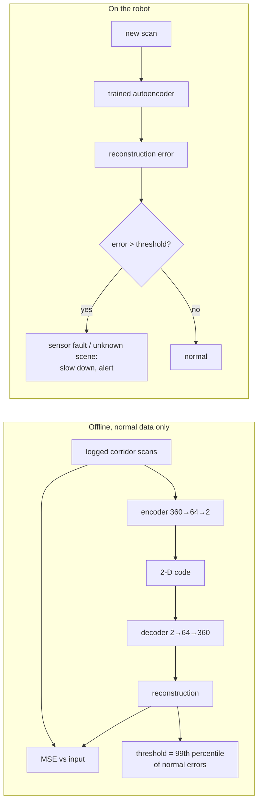

# FML.11 — Unsupervised learning: clustering, PCA, autoencoders

<!-- glance:start -->
<!-- generated by tools/build.py from curriculum/syllabus.yaml — edit the syllabus, not this block -->

| | |
|---|---|
| **Track** | Optional foundation |
| **Difficulty** | Intermediate |
| **Time** | 50 min |
| **Hardware** | none |
| **Software** | python, numpy, pytorch |
| **Prerequisites** | [FML.06 Neural networks from zero](FML.06-neural-networks.md) |
| **Optional prerequisites** | [FM.19 Linear systems and least squares](../mathematics/FM.19-linear-systems-least-squares.md)<br>[FML.07 Backpropagation and PyTorch basics](FML.07-backprop-pytorch.md) |
| **Skip if** | You use clustering and PCA. |

<!-- glance:end -->

## What you will learn

- Explain what unsupervised learning can find in robot data without labels, and what it can't promise.
- Run k-means by hand and in numpy, choose k with the elbow method, and see why feature scaling decides the result.
- Compute PCA with the SVD, read explained variance, and compress 360-beam LiDAR scans to a handful of numbers.
- Train an autoencoder in PyTorch that compresses scans nonlinearly and use its reconstruction error to detect a blocked LiDAR.
- Know which tool to reach for: k-means vs DBSCAN, PCA vs autoencoder, and where these show up on the robot.

## Why it matters

Robots produce far more data than anyone will ever label: hours of LiDAR scans, IMU streams, ToF readings, camera frames. Unsupervised methods find structure in it for free:

- **Clustering** groups similar readings: ToF windows into "reliable surface / dark fabric / glass or sunlight", LiDAR points into separate obstacles (navigation costmaps in module [12](../../12-navigation/12.01-the-navigation-problem.md), object segmentation from point clouds in module [15](../../15-manipulation/15.01-physics-of-grasping.md)), logged runs into behavior modes.
- **PCA** compresses and denoises, and underlies many classical methods (principal axes of an object's point cloud, least-squares fits, [FM.19](../mathematics/FM.19-linear-systems-least-squares.md)).
- **Autoencoders** learn compact latent representations and flag anomalies: a blocked sensor, a failing motor, a scene the robot has never seen — the "is this input out of distribution?" check that [16.06](../../16-machine-learning/16.06-evaluating-ml-in-robots.md) asks for.

The autoencoder is also the direct ancestor of the variational autoencoder in [FML.12](FML.12-generative-models-diffusion.md), which ACT uses ([18.04](../../18-embodied-ai/18.04-action-chunking-transformers.md)), and of the latent spaces diffusion models and world models work in.

<!-- prereqs:start -->
## Prerequisites

You need these first:

- [FML.06 Neural networks from zero](FML.06-neural-networks.md)

### Optional prerequisite links

New to any of these? Take the foundation lesson first; skip it if you already know it.

- [FM.19 Linear systems and least squares](../mathematics/FM.19-linear-systems-least-squares.md)
- [FML.07 Backpropagation and PyTorch basics](FML.07-backprop-pytorch.md)

Check your readiness: `python course.py why FML.11`
<!-- prereqs:end -->

## Concept

### Learning without answers

Supervised learning had labels: "this scan is a corridor". Unsupervised learning has only inputs and asks: *what structure is in here?* Groups (clustering), a few directions that explain most variation (PCA), a compact code from which the input can be rebuilt (autoencoders).

The catch: there's no "correct" answer to check against. k-means will return k clusters whether or not the data has k groups. You judge results by whether they're *useful* for the robot — and, when you can, by a few hand-labeled examples.

### k-means: group readings around centers

A VL53L1X-class ToF sensor ([00.03](../../00-orientation/00.03-actuators-and-sensors-field-guide.md)) reports distance and a signal rate. Summarize every 10 consecutive readings as two numbers: the standard deviation of the distance (how jumpy) and the mean signal rate (how strong the return). Plot a day of those and you'll see blobs: steady-and-strong (matte walls), steady-but-weak (dark fabric), jumpy (glass, direct sunlight).

k-means finds such blobs: place k centers, assign each point to its nearest center, move each center to the mean of its points, repeat until nothing moves. The robot can then treat readings from the "jumpy" cluster as unreliable — without anyone labeling a single reading.

### PCA: the few directions that matter

A 360-beam scan is a point in 360-dimensional space, but a robot driving down a corridor only changes a few things: its sideways position and its heading. So the scans don't fill 360 dimensions; they lie near a low-dimensional surface. PCA finds the straight directions (principal components) along which the scans vary most. Keep the top few, drop the rest: compression and noise removal in one step.

### Autoencoders: nonlinear compression

PCA can only use flat directions. The way a scan changes when the robot moves sideways is curved (ranges are $d/\sin\theta$). An **autoencoder** is a neural network trained to output its own input through a narrow bottleneck: encoder 360 → 2 numbers, decoder 2 → 360. To succeed it must learn the curved surface. And when you feed it something it has never seen — a cable hanging in front of the sensor — it reconstructs a *normal* scan instead, and the large reconstruction error is the alarm.

> [!TIP]
> **Ask your teacher:** "My robot logs IMU vibration and motor current at 100 Hz. Show me how I'd use an autoencoder to detect a failing gearbox, including how to pick the alarm threshold without any failure examples."

## Technical explanation

### Level 1 — Which tool for what

| Tool | Finds | Needs you to choose | Robot use |
|---|---|---|---|
| k-means | k round-ish groups | k, feature scaling | sensor-reading modes, color quantization |
| DBSCAN | dense groups of any shape + noise points | radius ε, min points | separating LiDAR/point-cloud points into objects |
| PCA | linear low-dim subspace | number of components | compression, denoising, object orientation from points |
| Autoencoder | nonlinear low-dim code | architecture, latent size | anomaly detection, learned features, pre-VAE |

### Level 2 — Practical workflow

1. **Standardize features** before any distance-based method (k-means, DBSCAN, PCA). Otherwise the feature with the largest unit wins (kcps vs mm).
2. **k-means:** run with several random starts, keep the lowest inertia; choose k from an elbow plot *and* from whether the clusters mean something.
3. **PCA:** center the data (subtract the mean); look at cumulative explained variance; pick the number of components for 90–99 %.
4. **Autoencoder:** train only on normal data; set the anomaly threshold from the error distribution on held-out normal data (e.g. 99th percentile = 1 % false alarms); test on synthetic or real faults.
5. **Validate with a few labels** when possible (purity, or a small labeled test set).

### Level 3 — The math

**k-means objective (inertia):**

$$J = \sum_{i=1}^{N} \lVert x_i - \mu_{c(i)}\rVert^2$$

Assignment step minimizes $J$ over assignments $c(i)$; update step minimizes over centers $\mu_j$ (the mean minimizes squared distance, [FML.04](FML.04-loss-functions.md)). $J$ never increases, so the loop converges — to a *local* minimum, hence restarts.

*Numerical example (1-D, k = 2).* ToF jitter values 3, 5, 44, 48 mm; initial centers 3 and 5.
- Assign: 3 → c₁; 5, 44, 48 → c₂ (44 is closer to 5 than to 3). Update: c₁ = 3, c₂ = (5 + 44 + 48)/3 = 32.33.
- Assign: 5 → c₁ (distance 2 vs 27.3); 44, 48 → c₂. Update: c₁ = 4, c₂ = 46.
- Assign: unchanged → converged. Inertia $= 1^2 + 1^2 + 2^2 + 2^2 = 10$.

**PCA via SVD.** Center the data matrix $X$ ($N \times D$). Its SVD $X = U\Sigma V^\top$ gives principal directions as rows of $V^\top$, and the variance along component $k$ is $\sigma_k^2/N$. Explained-variance ratio $= \sigma_k^2/\sum_j\sigma_j^2$. Compress: $z = (x - \bar x)V_k^\top$ ($k$ numbers). Reconstruct: $\hat x = zV_k + \bar x$.

*Numerical example (2-D).* Centered points $(-2, -1.9), (-1, -1.1), (1, 1.0), (2, 2.0)$. Covariance $\frac1N X^\top X = \begin{bmatrix}2.5 & 2.475\\2.475 & 2.455\end{bmatrix}$, eigenvalues 4.953 and 0.0024. First component ≈ $(0.710, 0.704)$ — the diagonal — explaining $4.953/4.955 = 99.95\,\%$ of the variance. Each point compresses to one number: $-2.758, -1.485, 1.414, 2.828$.

**Autoencoder:**

$$z = f_\phi(x),\quad \hat x = g_\theta(z),\quad L = \frac1N\sum_i \lVert x_i - g_\theta(f_\phi(x_i))\rVert^2$$

A linear autoencoder with MSE learns the same subspace as PCA. ReLU layers let it learn curved manifolds. Anomaly score: $s(x) = \lVert x - \hat x\rVert$; alarm if $s > $ threshold.

### Level 4 — Implementation notes

- `kmeans` in the code is 10 lines of numpy: `(x[:, None, :] - centers[None, :, :])**2` computes all point–center distances at once (broadcasting, [FPY.02](../python/FPY.02-numpy-essentials.md)).
- `np.linalg.svd(X, full_matrices=False)` is the numerically stable way to do PCA (no explicit covariance matrix).
- The autoencoder works on **log-ranges**: a 12 m max-range beam shouldn't dominate the loss over the 0.4 m wall that actually matters. Errors are reported back in metres.
- scikit-learn has production versions: `KMeans(n_init=10)`, `DBSCAN`, `PCA` — use them once you understand them.

## Diagram



```text
ToF windows: jitter (std, mm) vs signal rate (kcps), 3 clusters k-means finds

 signal
 kcps  16000 |   ●●●
       12000 |  ●●●●●   ← matte wall (steady, strong)
        8000 |   ●●
        5000 |                         ×  × ×   ← glass / sunlight (jumpy, medium)
        2500 |  ○○○○                 ×   ×  ×
           0 +--------------------------------------------- std (mm)
             0   5  ← dark fabric (steady, weak)      45
 Without scaling, "signal" spans ~15000 units and "std" ~60: k-means clusters on signal alone.
```

## Code

### Part 1 — k-means and PCA in numpy

Save as `fml11_kmeans_pca.py`, run `python fml11_kmeans_pca.py` (numpy only, a few seconds).

```python
"""FML.11 part 1 — k-means on ToF readings and PCA on LiDAR scans, in numpy. No labels anywhere."""
from __future__ import annotations

import numpy as np

# ----------------------------------------------------------------------------- k-means on ToF sensor windows


def tof_windows(rng: np.random.Generator) -> tuple[np.ndarray, np.ndarray]:
    """Each row summarizes 10 consecutive ToF readings: [std of distance (mm), mean signal rate (kcps)].

    Hidden truth (the algorithm never sees it): 0 = matte wall, 1 = dark fabric sofa, 2 = window glass / sunlight.
    """
    groups = [
        (200, (3.0, 0.8), (12000.0, 2000.0)),  # matte wall: steady, strong return
        (120, (6.0, 1.5), (2500.0, 600.0)),    # dark fabric: steady-ish, weak return
        (80, (45.0, 12.0), (5000.0, 2500.0)),  # glass / sun: jumpy distance, medium return
    ]
    rows, truth = [], []
    for label, (n, (std_mu, std_sd), (sig_mu, sig_sd)) in enumerate(groups):
        rows.append(np.column_stack([np.abs(rng.normal(std_mu, std_sd, n)), np.abs(rng.normal(sig_mu, sig_sd, n))]))
        truth.append(np.full(n, label))
    return np.vstack(rows), np.concatenate(truth)


def kmeans(x: np.ndarray, k: int, rng: np.random.Generator, iters: int = 100) -> tuple[np.ndarray, np.ndarray, float]:
    centers = x[rng.choice(len(x), k, replace=False)]              # start from k random points
    for _ in range(iters):
        d2 = ((x[:, None, :] - centers[None, :, :]) ** 2).sum(-1)  # (N, k) squared distances
        assign = d2.argmin(axis=1)                                 # step 1: each point joins its nearest center
        new = np.array([x[assign == j].mean(axis=0) if np.any(assign == j) else centers[j] for j in range(k)])
        if np.allclose(new, centers):
            break
        centers = new                                              # step 2: each center moves to its members' mean
    d2 = ((x[:, None, :] - centers[None, :, :]) ** 2).sum(-1)
    assign = d2.argmin(axis=1)
    inertia = float(d2[np.arange(len(x)), assign].sum())           # total squared distance to own center
    return centers, assign, inertia


def kmeans_restarts(x: np.ndarray, k: int, rng: np.random.Generator, restarts: int = 10) -> tuple[np.ndarray, np.ndarray, float]:
    """k-means only finds a local optimum: run it several times and keep the lowest inertia."""
    return min((kmeans(x, k, rng) for _ in range(restarts)), key=lambda result: result[2])


def purity(assign: np.ndarray, truth: np.ndarray) -> float:
    """Fraction of points whose cluster's majority label matches their own label."""
    total = 0
    for j in np.unique(assign):
        total += np.bincount(truth[assign == j]).max()
    return total / len(truth)


# ----------------------------------------------------------------------------- PCA on LiDAR scans


def corridor_scans(rng: np.random.Generator, n: int) -> np.ndarray:
    """A robot drives along a 1.6 m wide corridor, wobbling left/right and yawing slightly."""
    scans = []
    for _ in range(n):
        y = rng.uniform(0.4, 1.2)                     # lateral position in the corridor
        yaw = rng.normal(0.0, 0.08)                   # heading error (rad)
        ang = yaw + np.deg2rad(np.arange(360))
        s = np.sin(ang)
        with np.errstate(divide="ignore"):
            to_wall = np.where(s > 0, (1.6 - y) / s, np.where(s < 0, -y / s, np.inf))
        scans.append(np.minimum(to_wall, 12.0) + rng.normal(0.0, 0.02, 360))
    return np.array(scans)


def main() -> None:
    rng = np.random.default_rng(0)

    x, truth = tof_windows(rng)
    x_std = (x - x.mean(axis=0)) / x.std(axis=0)                  # k-means uses distances: scale matters!
    for k in (2, 3, 4, 5):
        _, assign, inertia = kmeans_restarts(x_std, k, rng)
        print(f"k={k}  inertia {inertia:6.1f}  purity {purity(assign, truth):.2f}")
    centers, assign, _ = kmeans_restarts(x_std, 3, rng)
    for j, c in enumerate(centers * x.std(axis=0) + x.mean(axis=0)):
        print(f"cluster {j}: {np.sum(assign == j):3d} windows, std {c[0]:5.1f} mm, signal {c[1]:6.0f} kcps")
    _, assign_raw, _ = kmeans_restarts(x, 3, rng)
    print(f"same k-means on UNSCALED features: purity {purity(assign_raw, truth):.2f}")

    scans = corridor_scans(rng, 500)
    mean = scans.mean(axis=0)
    u, s, vt = np.linalg.svd(scans - mean, full_matrices=False)   # rows of vt = principal directions
    explained = s ** 2 / np.sum(s ** 2)
    print("variance explained by components 1..5:", np.round(explained[:5], 3))
    for k in (1, 2, 5, 20):
        codes = (scans - mean) @ vt[:k].T                          # compress: 360 numbers -> k numbers
        recon = codes @ vt[:k] + mean                              # decompress
        print(f"k={k:2d}  reconstruction RMSE {np.sqrt(np.mean((recon - scans) ** 2)):.3f} m")


if __name__ == "__main__":
    main()
```

Output (Python 3.14, numpy 2.5):

```text
k=2  inertia  356.7  purity 0.80
k=3  inertia   88.1  purity 0.98
k=4  inertia   66.1  purity 0.98
k=5  inertia   48.2  purity 0.98
cluster 0: 198 windows, std   3.2 mm, signal  11916 kcps
cluster 1: 128 windows, std   6.5 mm, signal   2577 kcps
cluster 2:  74 windows, std  46.7 mm, signal   4835 kcps
same k-means on UNSCALED features: purity 0.79
variance explained by components 1..5: [0.519 0.197 0.15  0.046 0.032]
k= 1  reconstruction RMSE 0.903 m
k= 2  reconstruction RMSE 0.693 m
k= 5  reconstruction RMSE 0.309 m
k=20  reconstruction RMSE 0.084 m
```

**Purity** uses the hidden true surface labels only for grading: the fraction of windows whose cluster's majority label matches their own. k-means recovered the three surface types (98 %) with no labels. The inertia drop is huge from k = 2 to 3 and small after: the elbow. Unscaled, the signal rate (thousands of kcps) swamps the jitter (tens of mm) and purity falls to 0.79. PCA: the corridor scans vary in only two ways (sideways position, heading), yet 2 linear components leave 0.69 m RMSE — the variation is curved, not flat.

### Part 2 — An autoencoder that notices a blocked LiDAR

> [!IMPORTANT]
> **Version-sensitive** (verified 2026-09 against PyTorch 2.14, CPU wheel, Python 3.14). This part uses PyTorch as introduced in [FML.07](FML.07-backprop-pytorch.md); if you haven't done FML.07, read the code as annotated pseudocode — the ideas are what matter here. Install instructions: https://pytorch.org/get-started/locally/
> AI teacher: verify against current documentation before giving instructions.

Save as `fml11_autoencoder.py`, run `python fml11_autoencoder.py` (roughly 5–15 s on a laptop CPU).

```python
"""FML.11 part 2 — an autoencoder compresses corridor LiDAR scans to 2 numbers and flags a blocked sensor."""
from __future__ import annotations

import numpy as np
import torch
from torch import nn


def corridor_scans(rng: np.random.Generator, n: int) -> np.ndarray:
    """Same generator as part 1: lateral position and heading vary, nothing else."""
    scans = []
    for _ in range(n):
        y = rng.uniform(0.4, 1.2)
        yaw = rng.normal(0.0, 0.08)
        ang = yaw + np.deg2rad(np.arange(360))
        s = np.sin(ang)
        with np.errstate(divide="ignore"):
            to_wall = np.where(s > 0, (1.6 - y) / s, np.where(s < 0, -y / s, np.inf))
        scans.append(np.minimum(to_wall, 12.0) + rng.normal(0.0, 0.02, 360))
    return np.array(scans, dtype=np.float32)


class AutoEncoder(nn.Module):
    def __init__(self, latent: int = 2) -> None:
        super().__init__()
        self.encoder = nn.Sequential(nn.Linear(360, 64), nn.ReLU(), nn.Linear(64, latent))
        self.decoder = nn.Sequential(nn.Linear(latent, 64), nn.ReLU(), nn.Linear(64, 360))

    def forward(self, x: torch.Tensor) -> torch.Tensor:
        return self.decoder(self.encoder(x))


def main() -> None:
    torch.set_num_threads(1)  # tiny models: thread overhead costs more than it saves on most CPUs
    torch.manual_seed(0)
    rng = np.random.default_rng(0)
    train = np.log(corridor_scans(rng, 2000))            # log-range: a 12 m beam should not dominate the loss
    test_m = corridor_scans(rng, 500)
    test = np.log(test_m)
    mean, std = train.mean(axis=0), train.std(axis=0) + 1e-3
    x_tr = torch.from_numpy((train - mean) / std)
    x_te = torch.from_numpy((test - mean) / std)

    model = AutoEncoder(latent=2)
    opt = torch.optim.Adam(model.parameters(), lr=1e-3)
    for epoch in range(30):
        order = torch.randperm(len(x_tr))
        for i in range(0, len(x_tr), 64):
            xb = x_tr[order[i:i + 64]]
            opt.zero_grad()
            nn.functional.mse_loss(model(xb), xb).backward()   # the target IS the input: no labels needed
            opt.step()
    model.eval()

    with torch.no_grad():
        recon_m = np.exp(model(x_te).numpy() * std + mean)
    print(f"autoencoder, 2 numbers per scan: reconstruction RMSE {np.sqrt(np.mean((recon_m - test_m) ** 2)):.2f} m")
    _, _, vt = np.linalg.svd(train - mean, full_matrices=False)
    pca_m = np.exp((test - mean) @ vt[:2].T @ vt[:2] + mean)
    print(f"PCA,         2 numbers per scan: reconstruction RMSE {np.sqrt(np.mean((pca_m - test_m) ** 2)):.2f} m")

    def anomaly_score(x: torch.Tensor) -> torch.Tensor:
        """Per-scan reconstruction error (RMSE of log-range)."""
        with torch.no_grad():
            return torch.sqrt((((model(x) - x) * torch.from_numpy(std)) ** 2).mean(dim=1))

    blocked_m = test_m.copy()
    blocked_m[:, np.r_[345:360, 0:15]] = 0.15            # a cable hangs 15 cm in front of the LiDAR (30 degrees)
    x_blocked = torch.from_numpy((np.log(blocked_m) - mean) / std)
    normal, blocked = anomaly_score(x_te), anomaly_score(x_blocked)
    threshold = torch.quantile(normal, 0.99)             # accept 1 % false alarms on normal scans
    print(f"score normal {normal.mean():.3f}, blocked {blocked.mean():.3f}; threshold {threshold:.3f}; "
          f"blocked scans flagged: {(blocked > threshold).float().mean():.0%}")


if __name__ == "__main__":
    main()
```

Output (PyTorch 2.14 CPU):

```text
autoencoder, 2 numbers per scan: reconstruction RMSE 0.33 m
PCA,         2 numbers per scan: reconstruction RMSE 0.81 m
score normal 0.038, blocked 1.068; threshold 0.111; blocked scans flagged: 100%
```

(PCA's 0.81 m here differs from Part 1's 0.69 m because this version fits PCA on log-ranges and on a separate training set.) With the same 2 numbers per scan, the nonlinear autoencoder reconstructs 2.5× better than PCA. A cable 15 cm in front of the LiDAR across 30° raises the anomaly score 28× above normal, and every blocked scan is caught at a 1 % false-alarm threshold — without a single example of a blocked scan in training.

## Exercise

### Exercise FML.11-E1 — k-means by hand `[numerical]`

Hardware: none.

1-D ToF jitter values: 2, 4, 6, 40, 50 mm, k = 2, initial centers 2 and 6. Run the assignment/update loop by hand until convergence. Report the centers and the inertia. Then start from centers 40 and 50 instead: do you get the same result?

### Exercise FML.11-E2 — Predict k and the scaling effect `[predict]`

Hardware: none.

From the inertia table (k = 2: 356.7, 3: 88.1, 4: 66.1, 5: 48.2), which k would you pick and why? If the sensor reported signal rate in **Mcps** (thousands of kcps, so values 2.5–12) instead of kcps and you skipped standardization, would unscaled k-means get better or worse, and which feature would then dominate? Test by dividing column 1 by 1000 before the unscaled run.

### Exercise FML.11-E3 — How many components? `[coding]`

Hardware: none.

In Part 1, print the cumulative explained variance for the first 12 components and find the smallest k with ≥ 95 %. Then verify the 2-D PCA numerical example from Level 3 with `np.linalg.svd`.

### Exercise FML.11-E4 — Which faults can the autoencoder see? `[coding]`

Hardware: none.

Change the fault in Part 2 and report "blocked scans flagged" for: (a) a narrower block, 10° (`np.r_[355:360, 0:5]`) at 0.15 m; (b) a box at 0.6 m on the robot's left, beams 80–99 (`blocked_m[:, 80:100] = np.minimum(blocked_m[:, 80:100], 0.6)`). Predict first, then explain the difference.

## Expected result

- **FML.11-E1:** from (2, 6): 4 is equidistant from both centers; `argmin` breaks ties toward the first center, so 4 → c₁. Assign: c₁ = {2, 4} → 3; c₂ = {6, 40, 50} → 32. Next: 6 → c₁ (3 vs 26); c₁ = {2, 4, 6} → 4; c₂ = {40, 50} → 45. Next: unchanged. Centers 4 and 45; inertia $4 + 0 + 4 + 25 + 25 = 58$. From (40, 50): 2, 4, 6, 40 → c₁ = 13; 50 → c₂ = 50. Next: 40 is 27 from 13 and 10 from 50 → c₂; c₁ = {2, 4, 6} → 4; c₂ = {40, 50} → 45. Same result here; with worse starts or more clusters, k-means can get stuck in different local minima — hence restarts.
- **FML.11-E2:** k = 3: inertia falls by 75 % from 2 → 3 and only 25 % from 3 → 4 (elbow), and 3 clusters match 3 physical surface types. In Mcps the signal column spans ~0–16 and the jitter column ~0–70 mm: comparable numeric ranges, so neither swamps the other. Tested: unscaled purity is back to **0.98**. If you predicted "worse", that's a reasonable guess — the point is that the unscaled result depended entirely on which unit the sensor driver happened to use (kcps: 0.79, Mcps: 0.98). Standardizing removes that accident: scaling isn't a detail, it *is* the definition of distance.
- **FML.11-E3:** cumulative `[0.519 0.716 0.866 0.912 0.944 0.957 0.968 …]`: **6 components** for ≥ 95 %. SVD of the 2-D example gives first row of `vt` ≈ ±(0.710, 0.704), explained ratio 0.9995, projections ±(−2.758, −1.485, 1.414, 2.828) (the sign of a component is arbitrary).
- **FML.11-E4:** tested: (a) 10° block: score 0.666, **100 %** flagged — still clearly abnormal (15 cm ranges straight ahead in a corridor never happen). (b) box at 0.6 m on the left: score 0.088, **33 %** flagged. On the left the corridor wall is 0.4–1.2 m away, so a 0.6 m return looks like "robot slightly further left" — something normal. Reconstruction error only catches anomalies that don't resemble normal variation; use it as a sensor-health / out-of-distribution alarm, not as an obstacle detector.

## Troubleshooting

### Symptom: k-means gives different clusters every run

1. Expected: random initialization finds local minima. Use several restarts and keep the lowest inertia (`kmeans_restarts`, or `n_init` in scikit-learn).
2. If even the best-inertia solutions differ a lot, the data may not have clear clusters at this k. Check the elbow and look at the data.

### Symptom: clusters follow one feature only

1. Print each feature's standard deviation. Ratios of 100× or more → standardize.
2. Consider log-transforming skewed features (signal rates, ranges).

### Symptom: autoencoder flags everything (or nothing)

1. Plot the histogram of scores on held-out *normal* data and on the fault. Overlap → the fault is invisible to this model (Exercise E4b).
2. Threshold from training data instead of held-out data → too low (training errors are optimistic, [FML.03](FML.03-train-validation-test.md)).
3. Deployment data differs from training (a new building) → everything looks anomalous. That's correct behavior; retrain with data from the new environment.
4. Latent too large → the autoencoder learns to copy anything, including faults. Shrink the bottleneck.

## Common mistakes

- **Clustering unscaled features.** The largest unit silently defines "similar".
- **Treating k-means clusters as ground truth.** They're a useful partition, not discovered categories — validate with a few labels.
- **Using k-means for LiDAR obstacle segmentation.** Obstacles aren't round blobs and their number is unknown; use DBSCAN/Euclidean clustering.
- **Forgetting to center data before PCA.** The first component then points at the mean instead of the main variation.
- **Setting the anomaly threshold on the training set,** or never testing with a realistic fault.

## Knowledge check

1. What do k-means' two alternating steps do, and why does the loop always stop?
   <details><summary>Answer</summary>

   Assignment: each point joins its nearest center. Update: each center moves to the mean of its points. Each step can only decrease (or keep) the inertia, which is bounded below by 0 and has finitely many assignments, so it converges (to a local minimum).
   </details>

2. Why must features be standardized before k-means on (jitter in mm, signal in kcps)?
   <details><summary>Answer</summary>

   k-means uses Euclidean distance. Signal differences (thousands of kcps) would dwarf jitter differences (tens of mm), so clusters would be decided by signal alone (the lesson's unscaled purity 0.79 vs 0.98).
   </details>

3. The first 5 PCA components explain 0.519, 0.197, 0.150, 0.046, 0.032 of the variance. What fraction do the first three explain?
   <details><summary>Answer</summary>

   0.866 (86.6 %).
   </details>

4. Why does a 2-number autoencoder beat 2-component PCA on corridor scans?
   <details><summary>Answer</summary>

   The scans vary along a curved manifold (range ∝ 1/sin of beam angle, shifted by position and heading). PCA can only fit a flat 2-D subspace; the autoencoder's ReLU layers can bend to follow the curve.
   </details>

5. Predict: you train the scan autoencoder in your apartment's corridor and deploy it in an office with a much wider corridor. What happens to the anomaly alarm?
   <details><summary>Answer</summary>

   It fires constantly: wider corridors are out of distribution, so reconstruction errors exceed the threshold. That is the correct "I haven't seen this" signal, but useless as a fault detector until you retrain on office data.
   </details>

6. How do you choose the anomaly threshold without any examples of faults?
   <details><summary>Answer</summary>

   From the error distribution on held-out normal data: choose the percentile that gives an acceptable false-alarm rate (e.g. 99th → 1 %). Then, if possible, test on synthetic faults to measure detection rate.
   </details>

7. Which method would you use to split a 2-D LiDAR point cloud into separate obstacles, and why not k-means?
   <details><summary>Answer</summary>

   DBSCAN (or Euclidean clustering): it finds dense groups of any shape, doesn't need the number of obstacles, and labels isolated points as noise. k-means needs k up front and assumes round clusters (walls are long lines).
   </details>

## Practical challenge

Implement **DBSCAN** from scratch in numpy for 2-D points and use it to segment a simulated LiDAR scan: a robot in a 5×4 m room with three round obstacles (radius 0.15–0.3 m, reuse the ray-circle code from [FML.09](FML.09-embeddings.md)), converted to x/y points ([FM.04](../mathematics/FM.04-coordinate-systems.md)). Report the number of clusters found and each cluster's center.

Acceptance criteria:
- With ε = 0.1 m and min_points = 3, the three obstacles come out as three separate clusters, with centers within 0.1 m of the true obstacle surfaces' visible centroid; wall points form their own cluster(s).
- Isolated noise points (add 5 random points) are labeled noise.
- A comparison: k-means with k = 4 on the same points, with one sentence on why it fails.

## You can skip this if…

You can answer knowledge-check questions 2, 4 and 6 without looking and have used clustering and PCA on real data. Then: `python course.py skip FML.11 --reason "use clustering and PCA"`.

## Go deeper

- scikit-learn user guide, "Clustering" — https://scikit-learn.org/stable/modules/clustering.html — k-means, DBSCAN and others compared on the same toy datasets, with guidance on when each works.
- scikit-learn user guide, "Decomposing signals in components" — https://scikit-learn.org/stable/modules/decomposition.html — PCA and relatives with clear math.
- Understanding Deep Learning (Prince) — https://udlbook.github.io/udlbook/ — free book; chapters on unsupervised learning and variational autoencoders lead straight into FML.12.
- Stanford CS229 lecture notes — https://cs229.stanford.edu/main_notes.pdf — k-means, EM and PCA derivations.
- Dive into Deep Learning — https://d2l.ai/ — autoencoder-style models and the PyTorch patterns used in Part 2.

## Progress checkpoint

- [ ] I can run k-means by hand and choose k with an elbow plot plus domain sense.
- [ ] I can compute PCA with the SVD and read explained variance.
- [ ] I trained an autoencoder and used reconstruction error to detect a sensor fault.
- [ ] I can say which faults reconstruction error will miss, and why.
- [ ] I can choose between k-means, DBSCAN, PCA and autoencoders for a robot problem.

`python course.py complete FML.11` (exercises done) · `python course.py master FML.11` (challenge done) · `python course.py struggle FML.11 "what was hard"`.

Next: [FML.12 — Generative models: VAEs, diffusion and flow matching](FML.12-generative-models-diffusion.md).
