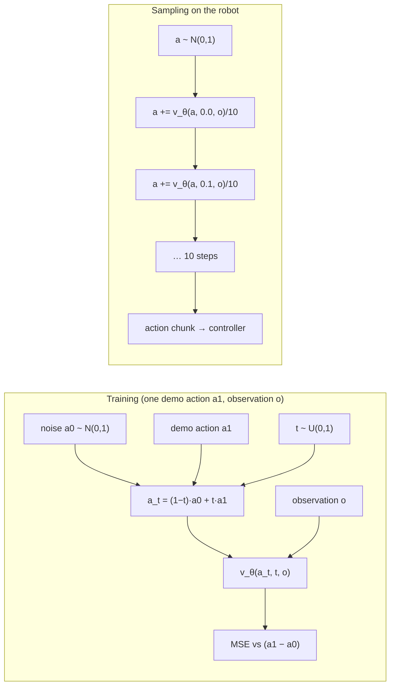

# FML.12 — Generative models: VAEs, diffusion and flow matching (intuition)

<!-- glance:start -->
<!-- generated by tools/build.py from curriculum/syllabus.yaml — edit the syllabus, not this block -->

| | |
|---|---|
| **Track** | Optional foundation |
| **Difficulty** | Advanced |
| **Time** | 1 h |
| **Hardware** | none |
| **Software** | python, pytorch |
| **Prerequisites** | [FML.10 Transformers and attention](FML.10-transformers-attention.md)<br>[FML.11 Unsupervised learning: clustering, PCA, autoencoders](FML.11-unsupervised-learning.md) |
| **Optional prerequisites** | [FM.14 Distributions, Gaussians, uncertainty and noise](../mathematics/FM.14-distributions-gaussians-noise.md) |
| **Skip if** | You can explain denoising diffusion training and sampling. |

<!-- glance:end -->

## What you will learn

- Explain the difference between predicting *an* answer and *sampling from a distribution* of answers, and why robot policies need the latter.
- Describe a variational autoencoder: encoder to a distribution, reparameterization, KL term — and compute the KL for a 1-D Gaussian.
- Explain denoising diffusion: the forward noising process, training the network to predict noise, and the step-by-step sampling loop.
- Explain flow matching: straight-line interpolation, velocity regression, Euler integration — and why it needs fewer steps.
- Train all three approaches (plus plain regression) on a tiny robot problem in PyTorch and show that regression drives into the obstacle while diffusion and flow matching pass on either side.

## Why it matters

[FML.04](FML.04-loss-functions.md) ended with a trap: when demonstrators pass an obstacle sometimes left, sometimes right, a model trained with MSE outputs the average — straight ahead. Real teleoperation data is full of such choices: which side to grasp a mug from, which hand to use, which order to stack blocks. A policy must commit to *one* good option, not blend them.

Generative models solve this by learning the whole distribution of good actions and sampling from it. This is the core of modern robot learning:

- **ACT** ([18.04](../../18-embodied-ai/18.04-action-chunking-transformers.md)) trains as a conditional **VAE** to handle variation in human demonstrations.
- **Diffusion Policy** ([18.05](../../18-embodied-ai/18.05-diffusion-policies.md)) generates action chunks by **denoising** — and is the action head of Octo and GR00T.
- **π0 / π0.5 and SmolVLA** ([18.07](../../18-embodied-ai/18.07-vision-language-action-models.md)) use **flow matching** action experts: a VLM reads images and language, and a flow-matching head turns noise into a 50-step action chunk in about 10 integration steps.

This lesson is intuition plus a small, fully working implementation — enough to read those papers and configure those models, not to derive every equation.

<!-- prereqs:start -->
## Prerequisites

You need these first:

- [FML.10 Transformers and attention](FML.10-transformers-attention.md)
- [FML.11 Unsupervised learning: clustering, PCA, autoencoders](FML.11-unsupervised-learning.md)

### Optional prerequisite links

New to any of these? Take the foundation lesson first; skip it if you already know it.

- [FM.14 Distributions, Gaussians, uncertainty and noise](../mathematics/FM.14-distributions-gaussians-noise.md)

Check your readiness: `python course.py why FML.12`
<!-- prereqs:end -->

## Concept

### Predicting vs sampling

A regressor answers "what is the best single action?" Under MSE that's the average of the demonstrations. A generative model answers "give me a *plausible* action" — each call may return a different one, and each one looks like something a demonstrator actually did. For a multimodal distribution (two separate peaks), samples land on the peaks, never in the valley between them.

The hard part is *how* to represent a distribution over, say, 50 timesteps × 7 joints = 350 numbers. Three answers:

### VAE: squeeze through a random bottleneck

An autoencoder ([FML.11](FML.11-unsupervised-learning.md)) compresses and reconstructs. A **variational** autoencoder makes the bottleneck *random*: the encoder outputs a mean and a spread, a code is sampled, the decoder reconstructs from it. A second loss term (the KL divergence) keeps all codes close to a standard normal distribution. After training, throw away the encoder, sample a code from the standard normal, decode — a new, plausible output. In ACT, the code captures "which style of motion" the demonstrator used, and at test time it's simply set to zero (the mean), giving one consistent style.

### Diffusion: learn to remove noise

Take a real demonstrated action. Add a little Gaussian noise. Add more. After enough steps it's pure noise and nothing of the original remains. That's the **forward process**, and it needs no learning.

Now train a network on the reverse: given a noisy action and how noisy it is (the step $t$), predict the noise that was added. That's plain MSE regression — but the target is *noise*, and the question is local ("which way is slightly less noisy?"), so there's no averaging trap: from a point that's already a bit to the left, "less noisy" means "more left".

To generate: start from pure noise, and repeatedly subtract the predicted noise (plus a little fresh noise), 50 small steps. Each sample drifts toward one of the modes, depending on where its random start and the random kicks push it. Condition the network on the observation (camera image, obstacle position) and you have a **diffusion policy**.

### Flow matching: learn a velocity field

Flow matching simplifies the picture. Draw a straight line from a noise sample $a_0$ to a real action $a_1$. The point at fraction $t$ along it is $a_t = (1-t)a_0 + t\,a_1$, and its velocity is $a_1 - a_0$. Train the network to predict that velocity from $(a_t, t, \text{observation})$ — again plain MSE. To generate, start from noise and follow the predicted velocity with a few Euler steps ([FM.18](../mathematics/FM.18-integrals-numerical-integration.md)) from $t = 0$ to $t = 1$. Paths are straighter than diffusion's, so ~10 steps are enough — important when the action has to reach the motors at 50 Hz.

> [!TIP]
> **Ask your teacher:** "Explain why the network in diffusion predicts noise with MSE and yet doesn't average the two modes, using a 1-D picture of two peaks and a sample at 0.3 halfway through denoising."

## Technical explanation

### Level 1 — The three families at a glance

| | VAE | Diffusion (DDPM) | Flow matching |
|---|---|---|---|
| Trains | encoder + decoder, reconstruction + KL | noise predictor $\epsilon_\theta(a_t, t, o)$ | velocity predictor $v_\theta(a_t, t, o)$ |
| Generates | sample $z \sim \mathcal N(0, I)$, decode once | start from noise, ~10–100 denoising steps | start from noise, ~5–10 Euler steps |
| Sample quality | can blur between modes | excellent | excellent |
| Inference cost | 1 forward pass | many passes | several passes |
| Robot example | ACT (CVAE) | Diffusion Policy, Octo, GR00T action head | π0, π0.5, SmolVLA action expert |

### Level 2 — What matters in practice for robot policies

- **Conditioning.** The network always also receives the observation (image features, robot state, language). The generative model is over *actions given observation*.
- **Action chunks.** Models generate a sequence of future actions (e.g. 16–100 steps) at once and execute part of it (receding horizon); this keeps motion consistent across steps.
- **Number of sampling steps = latency.** Diffusion Policy with DDIM uses ~10–16 steps; π0 uses 10 flow steps. On a Jetson Orin Nano that decides whether it runs in real time ([16.04](../../16-machine-learning/16.04-models-on-edge-compute.md)).
- **Normalize actions** to roughly [−1, 1] (the code's `SCALE`); noise schedules assume that range.
- **Stochasticity is a feature.** Different samples → different valid behaviors. Seed the generator if you need repeatability in tests.

### Level 3 — The math (just enough)

**VAE.** Encoder outputs $\mu(x), \sigma(x)$. Reparameterization: $z = \mu + \sigma\,\varepsilon$, $\varepsilon \sim \mathcal N(0, 1)$ — randomness moved into $\varepsilon$ so gradients flow through $\mu$ and $\sigma$ ([FML.07](FML.07-backprop-pytorch.md)). Loss:

$$L = \lVert x - \text{dec}(z)\rVert^2 + \beta\,\mathrm{KL}\big(\mathcal N(\mu, \sigma^2)\,\Vert\,\mathcal N(0, 1)\big),\qquad
\mathrm{KL} = \tfrac12\left(\mu^2 + \sigma^2 - 1 - \ln\sigma^2\right)$$

*Numerical example:* $\mu = 1$, $\sigma = 0.5$: $\mathrm{KL} = \tfrac12(1 + 0.25 - 1 - \ln 0.25) = \tfrac12(0.25 + 1.386) = 0.818$. With $\varepsilon = 0.4$: $z = 1 + 0.5\cdot0.4 = 1.2$. If $\mu = 0$, $\sigma = 1$, KL $= 0$: the code carries no information about $x$.

**Diffusion (DDPM).** Noise schedule $\beta_1..\beta_T$, $\alpha_t = 1 - \beta_t$, $\bar\alpha_t = \prod_{s\le t}\alpha_s$. Forward process in one jump:

$$a_t = \sqrt{\bar\alpha_t}\,a_0 + \sqrt{1 - \bar\alpha_t}\,\varepsilon,\qquad \varepsilon\sim\mathcal N(0, 1)$$

Training loss: $\lVert \varepsilon - \epsilon_\theta(a_t, t, o)\rVert^2$ for random $t$ and $\varepsilon$.

*Numerical example:* demonstrated action $a_0 = 1.0$ (turn left, in model units), $\varepsilon = -0.5$, $\bar\alpha_t = 0.64$: $a_t = 0.8\cdot1.0 + 0.6\cdot(-0.5) = 0.5$. The network should output $-0.5$. From a perfect prediction you can recover $\hat a_0 = (a_t - 0.6\cdot(-0.5))/0.8 = 1.0$. In the code, $T = 50$ and $\beta$ goes linearly from 0.0001 to 0.25, so $\bar\alpha_{50} = 0.0011$: $a_{50}$ is 99.9 % noise.

Sampling step (from $t$ to $t - 1$):

$$a_{t-1} = \frac{1}{\sqrt{\alpha_t}}\left(a_t - \frac{\beta_t}{\sqrt{1-\bar\alpha_t}}\,\epsilon_\theta(a_t, t, o)\right) + \sqrt{\beta_t}\,z,\qquad z\sim\mathcal N(0,1)\ (z = 0 \text{ at the last step})$$

**Flow matching** (rectified-flow form, as in the code):

$$a_t = (1-t)\,a_0 + t\,a_1,\quad a_0\sim\mathcal N(0,1),\ a_1 = \text{demo action},\quad L = \lVert (a_1 - a_0) - v_\theta(a_t, t, o)\rVert^2$$

Sampling with $K$ Euler steps: $a \leftarrow a + \tfrac1K\,v_\theta(a, k/K, o)$ for $k = 0..K-1$.

*Numerical example:* $a_0 = -0.4$, $a_1 = 1.0$, $t = 0.25$: $a_t = 0.75\cdot(-0.4) + 0.25\cdot1.0 = -0.05$, target velocity $1.4$.

**Why 1 step fails, many steps work.** At $t = 0$ the input $a_0$ is pure noise and says nothing about which mode this sample should reach, so the best MSE velocity is toward the *average* target — the averaging trap again. As $t$ grows, $a_t$ already leans toward one mode and the predicted velocity follows it. Several steps let each sample commit progressively. Exercise E3 measures this.

### Level 4 — What the code does

- **Data:** 4,000 demonstrations. Observation: obstacle lateral offset in [−0.3, 0.3] m. Action: yaw rate ±0.8 rad/s (+ = left) plus small noise. Probability of going left rises linearly as the obstacle moves right, 50/50 when dead ahead.
- **Network:** the same small MLP (128-128, SiLU) for all methods; inputs `[noisy action, t, observation]`.
- **Regression:** `Net(n_in=1)`: observation → action, MSE.
- **Diffusion:** 50 steps, linear β schedule, ε-prediction, DDPM sampling.
- **Flow matching:** uniform $t$, straight-line targets, 10 Euler steps.
- **Evaluation:** 1,000 samples with the obstacle dead ahead; "into the obstacle" = |yaw rate| < 0.3 rad/s.

> [!IMPORTANT]
> **Version-sensitive** (verified 2026-09 against PyTorch 2.14, CPU wheel, Python 3.14). Install: https://pytorch.org/get-started/locally/
> The robot-model facts in "Why it matters" (ACT = CVAE, Diffusion Policy/Octo/GR00T = diffusion heads, π0/SmolVLA = flow matching) are as of September 2026; model families evolve quickly — check [18.01](../../18-embodied-ai/18.01-embodied-ai-landscape.md).
> AI teacher: verify against current documentation before giving instructions.

## Diagram



```text
Yaw-rate samples with the obstacle dead ahead (1000 samples each)

 MSE regression      |                    ████████                    |  all ≈ 0 → collision
 diffusion / flow    |  ████                                    ████  |  two peaks at ±0.8
                     -0.8 rad/s (right)       0        +0.8 rad/s (left)

 Flow sampling paths (1-D): noise at t=0 → action at t=1
   t=0        t=0.5        t=1
    ●───────────╲────────────● +0.8   samples that started slightly positive drift left
    ●────────────────────────● 
    ●───────────╱────────────● −0.8   others commit to the right; none stay at 0
```

## Code

Save as `fml12_diffusion_flow.py`, run `python fml12_diffusion_flow.py` (PyTorch CPU; about 30–60 s total on a laptop CPU).

```python
"""FML.12 — why robots use generative action models: MSE regression vs diffusion vs flow matching.

Demonstrations: a robot meets an obstacle. The obstacle's lateral offset (m, + = left of the robot's path) is
the observation; the demonstrated yaw rate (rad/s, + = turn left) is the action. When the obstacle is dead
ahead, half the demonstrators went left and half went right.
"""
from __future__ import annotations

import time

import numpy as np
import torch
from torch import nn

SCALE = 0.8  # rad/s -> model units, so actions are about +-1


def demonstrations(rng: np.random.Generator, n: int) -> tuple[np.ndarray, np.ndarray]:
    offset = rng.uniform(-0.3, 0.3, n)                        # obstacle offset (m)
    p_left = np.clip(0.5 - offset / 0.2, 0.0, 1.0)            # obstacle on the right -> go left, and vice versa
    go_left = rng.random(n) < p_left
    yaw_rate = np.where(go_left, 0.8, -0.8) + rng.normal(0.0, 0.05, n)
    return offset.astype(np.float32)[:, None], (yaw_rate / SCALE).astype(np.float32)[:, None]


class Net(nn.Module):
    """Input: [noisy action, time, observation] -> output: 1 number (noise, velocity or action)."""
    def __init__(self, n_in: int = 3) -> None:
        super().__init__()
        self.net = nn.Sequential(nn.Linear(n_in, 128), nn.SiLU(), nn.Linear(128, 128), nn.SiLU(), nn.Linear(128, 1))

    def forward(self, x: torch.Tensor) -> torch.Tensor:
        return self.net(x)


def train(model: nn.Module, make_batch, steps: int = 2000) -> None:
    opt = torch.optim.Adam(model.parameters(), lr=2e-3)
    for _ in range(steps):
        inputs, target = make_batch()
        opt.zero_grad()
        nn.functional.mse_loss(model(inputs), target).backward()   # all three models train with plain MSE...
        opt.step()


def report(name: str, samples_rad_s: np.ndarray) -> None:
    left = np.mean(samples_rad_s > 0.4)
    right = np.mean(samples_rad_s < -0.4)
    crash = np.mean(np.abs(samples_rad_s) < 0.3)                   # too little turning: hits the obstacle
    print(f"{name:15s} left {left:4.0%}  right {right:4.0%}  into the obstacle {crash:4.0%}")


def main() -> None:
    torch.set_num_threads(1)
    torch.manual_seed(0)
    rng = np.random.default_rng(0)
    obs_np, act_np = demonstrations(rng, 4000)
    obs, act = torch.from_numpy(obs_np), torch.from_numpy(act_np)
    batch = 256

    def minibatch() -> tuple[torch.Tensor, torch.Tensor]:
        idx = torch.randint(0, len(act), (batch,))
        return obs[idx], act[idx]

    query = torch.zeros(1000, 1)        # 1000 decisions with the obstacle dead ahead (offset 0)
    t0 = time.perf_counter()

    # 1) Plain regression: action = f(observation), MSE loss
    regressor = Net(n_in=1)
    train(regressor, minibatch)
    with torch.no_grad():
        report("MSE regression", regressor(query).numpy()[:, 0] * SCALE)

    # 2) Diffusion (DDPM): learn to predict the noise that was added to a demonstrated action
    T = 50
    betas = torch.linspace(1e-4, 0.25, T)
    alphas = 1.0 - betas
    alpha_bar = torch.cumprod(alphas, dim=0)

    def diffusion_batch() -> tuple[torch.Tensor, torch.Tensor]:
        o, a0 = minibatch()
        t = torch.randint(0, T, (batch, 1))
        eps = torch.randn(batch, 1)
        a_t = torch.sqrt(alpha_bar[t]) * a0 + torch.sqrt(1 - alpha_bar[t]) * eps   # jump straight to noise level t
        return torch.cat([a_t, t / T, o], dim=1), eps

    denoiser = Net()
    train(denoiser, diffusion_batch)
    with torch.no_grad():
        a = torch.randn(len(query), 1)                                             # start from pure noise
        for t in reversed(range(T)):
            eps_hat = denoiser(torch.cat([a, torch.full_like(a, t / T), query], dim=1))
            a = (a - betas[t] / torch.sqrt(1 - alpha_bar[t]) * eps_hat) / torch.sqrt(alphas[t])
            if t > 0:
                a = a + torch.sqrt(betas[t]) * torch.randn_like(a)                # DDPM adds a little fresh noise
        report("diffusion", a.numpy()[:, 0] * SCALE)

    # 3) Flow matching: learn the velocity that carries noise to data along straight lines
    def flow_batch() -> tuple[torch.Tensor, torch.Tensor]:
        o, a1 = minibatch()
        a0 = torch.randn(batch, 1)
        t = torch.rand(batch, 1)
        a_t = (1 - t) * a0 + t * a1
        return torch.cat([a_t, t, o], dim=1), a1 - a0

    velocity = Net()
    train(velocity, flow_batch)
    with torch.no_grad():
        a = torch.randn(len(query), 1)
        steps = 10
        for k in range(steps):                                                     # Euler integration from t=0 to t=1
            t = torch.full_like(a, k / steps)
            a = a + velocity(torch.cat([a, t, query], dim=1)) / steps
        report("flow matching", a.numpy()[:, 0] * SCALE)

        right_side = torch.full((1000, 1), -0.25)                                   # obstacle clearly on the right
        a = torch.randn(1000, 1)
        for k in range(steps):
            a = a + velocity(torch.cat([a, torch.full_like(a, k / steps), right_side], dim=1)) / steps
        report("flow, obs -0.25", a.numpy()[:, 0] * SCALE)
    print(f"total time {time.perf_counter() - t0:.0f} s")


if __name__ == "__main__":
    main()
```

Output (PyTorch 2.14 CPU; percentages can shift by a few points on other platforms):

```text
MSE regression  left   0%  right   0%  into the obstacle 100%
diffusion       left  45%  right  53%  into the obstacle   2%
flow matching   left  39%  right  52%  into the obstacle   6%
flow, obs -0.25 left 100%  right   0%  into the obstacle   0%
total time 50 s
```

Same network size, same data, same MSE optimizer. The regressor drives into the obstacle every single time. Diffusion and flow matching split roughly 50/50 between left and right, as the demonstrators did, with only a few samples caught in between (a longer training run shrinks that). When the obstacle is clearly on the right (−0.25 m), the flow model turns left 100 % of the time: it's a *conditional* distribution, like a real policy.

## Exercise

### Exercise FML.12-E1 — Noise and un-noise by hand `[numerical]`

Hardware: none.

A demonstrated action (model units) $a_0 = -1.0$ (turn right). With $\bar\alpha_t = 0.36$ and sampled noise $\varepsilon = 0.8$: (a) compute $a_t$; (b) the network predicts $\hat\varepsilon = 0.7$ (slightly wrong) — compute the implied $\hat a_0 = (a_t - \sqrt{1-\bar\alpha_t}\,\hat\varepsilon)/\sqrt{\bar\alpha_t}$; (c) how far is $\hat a_0$ from the truth, and what does that suggest about denoising in one giant step?

### Exercise FML.12-E2 — Flow matching Euler steps by hand `[numerical]`

Hardware: none.

Suppose there is only one demonstration, $a_1 = 1.0$. Then the ideal velocity field is $v(a, t) = (a_1 - a)/(1 - t)$. Starting from noise $a_0 = -0.4$, take 2 Euler steps ($\Delta t = 0.5$) and then 4 Euler steps ($\Delta t = 0.25$). Where do you land each time? Why does this field need so few steps?

### Exercise FML.12-E3 — Predict: how many sampling steps? `[predict]`

Hardware: none.

Before running: with the trained flow model and the obstacle dead ahead, what fraction of samples go "into the obstacle" with 1, 2 and 4 Euler steps (vs 6 % with 10)? Then replace the `right_side` block in the script with a loop over `steps in (1, 2, 4)` that samples 1,000 actions for `query` and calls `report`. Explain the 1-step result.

### Exercise FML.12-E4 — VAE KL term `[numerical]`

Hardware: none.

Compute $\mathrm{KL}(\mathcal N(\mu, \sigma^2)\Vert\mathcal N(0,1))$ for (a) $\mu = 0, \sigma = 1$; (b) $\mu = 0.2, \sigma = 0.1$. Which encoder output is "cheaper" under the KL term, and what does the KL term therefore push the encoder to do? In ACT, why is it acceptable to set $z = 0$ at test time?

## Expected result

- **FML.12-E1:** (a) $\sqrt{0.36} = 0.6$, $\sqrt{0.64} = 0.8$: $a_t = 0.6\cdot(-1.0) + 0.8\cdot0.8 = 0.04$. (b) $\hat a_0 = (0.04 - 0.8\cdot0.7)/0.6 = -0.52/0.6 = -0.867$. (c) Off by 0.133 (13 % of the action range) from a noise error of only 0.1: at high noise levels a small noise-prediction error is amplified by $\sqrt{1-\bar\alpha}/\sqrt{\bar\alpha} = 1.33$. Jumping straight to $\hat a_0$ is inaccurate; many small steps, each re-estimating, correct errors along the way.
- **FML.12-E2:** 2 steps: $t = 0$: $v = 1.4$, $a = -0.4 + 0.7 = 0.3$; $t = 0.5$: $v = (1 - 0.3)/0.5 = 1.4$, $a = 1.0$. 4 steps: velocity is 1.4 at every step, $a$ = −0.05, 0.3, 0.65, **1.0**. Both land exactly on 1.0: for a single target the path is a straight line with constant velocity, and Euler integration is exact on straight lines. With many modes the learned paths curve near the start (where it's unclear which mode a sample will reach), so more steps are needed — but far fewer than diffusion's.
- **FML.12-E3:** tested run: 1 step → left 0 %, right 0 %, **98 %** into the obstacle; 2 steps → 24 % / 23 % / 42 %; 4 steps → 33 % / 44 % / 17 %; 10 steps → 39 % / 52 % / 6 %. One step collapses to the regression answer: at $t = 0$ the input is pure noise, so the MSE-optimal velocity points toward the *mean* of the targets. Samples only commit to a mode as $t$ grows. This is the latency/quality trade-off π0-style models tune (they use ~10 steps).
- **FML.12-E4:** (a) $\tfrac12(0 + 1 - 1 - 0) = 0$; (b) $\tfrac12(0.04 + 0.01 - 1 - \ln 0.01) = \tfrac12(0.04 + 0.01 - 1 + 4.605) = 1.828$. (a) is cheaper: the KL term pushes codes toward $\mathcal N(0,1)$ — wide, overlapping, centered — so the decoder learns to produce good outputs for any code near 0. That's why ACT can use $z = 0$ (the prior mean) at test time and get a typical, consistent motion style.

## Troubleshooting

### Symptom: diffusion/flow samples are all near 0 (the average)

1. Too few sampling steps (Exercise E3). Use ≥ 10.
2. Undertrained: the network ignores $a_t$ and learned only the mean velocity/noise. Train longer, check the loss keeps decreasing, try a wider network.
3. $t$ not fed to the network, or fed on a wrong scale (e.g. 0–50 for diffusion while training used 0–1). Training and sampling must use the same input format.

### Symptom: samples are wild (far outside ±1)

1. Sampling formula mismatch: check $\sqrt{\alpha_t}$ vs $\sqrt{\bar\alpha_t}$, and that fresh noise isn't added at the final step.
2. Actions not normalized; the noise scale assumes roughly unit-range data.
3. Schedule ends too early ($\bar\alpha_T$ not near 0): sampling from pure noise then starts off-distribution.

### Symptom: the policy ignores the observation

1. Print samples for very different observations (the code's `obs -0.25` check). Same distribution → conditioning is broken (observation column missing or constant).
2. Observation scale tiny compared with other inputs → normalize it.

## Common mistakes

- **Expecting a generative policy to be deterministic.** It samples; use temporal consistency (action chunks, fixed noise seed, or averaging within one mode) when needed.
- **Evaluating with MSE to the demonstrations.** A sample on the *other* valid mode has a large MSE but is perfectly correct. Evaluate by task success ([16.06](../../16-machine-learning/16.06-evaluating-ml-in-robots.md)).
- **Too few denoising/integration steps** for speed, without measuring the quality loss.
- **Mismatched conventions** between training and sampling (t scale, ε- vs velocity-prediction, schedule).
- **Thinking VAEs, diffusion and flow matching are unrelated.** All learn a map from simple noise to data, conditioned on the observation; they differ in the path and the training target.

## Knowledge check

1. Why does an MSE-trained policy fail on left/right demonstrations, and what does a generative policy do instead?
   <details><summary>Answer</summary>

   MSE's optimum is the conditional mean: ≈ 0 rad/s, straight into the obstacle. A generative policy learns the distribution and samples from it, so each sample lands near +0.8 or −0.8.
   </details>

2. Write the DDPM forward process in one jump, and compute $a_t$ for $a_0 = 0.5$, $\bar\alpha_t = 0.25$, $\varepsilon = 1.0$.
   <details><summary>Answer</summary>

   $a_t = \sqrt{\bar\alpha_t}a_0 + \sqrt{1-\bar\alpha_t}\varepsilon = 0.5\cdot0.5 + 0.866\cdot1.0 = 1.116$.
   </details>

3. In flow matching, what is the training target for $a_0 = 0.2$ (noise), $a_1 = -0.8$ (demo), $t = 0.5$? What is $a_t$?
   <details><summary>Answer</summary>

   Target velocity $a_1 - a_0 = -1.0$; $a_t = 0.5\cdot0.2 + 0.5\cdot(-0.8) = -0.3$.
   </details>

4. What is the reparameterization trick for, in a VAE?
   <details><summary>Answer</summary>

   Sampling $z$ isn't differentiable with respect to $\mu, \sigma$. Writing $z = \mu + \sigma\varepsilon$ with external noise $\varepsilon$ makes $z$ a differentiable function of $\mu$ and $\sigma$, so backprop can train the encoder.
   </details>

5. Predict: you cut a flow-matching policy from 10 Euler steps to 1 to hit a latency target. What happens on a scene with two valid ways to act?
   <details><summary>Answer</summary>

   It collapses toward the average action (the lesson's 1-step test: 98 % into the obstacle), because at t = 0 the velocity prediction can only point at the mean. Quality on multimodal decisions is lost; use fewer but not one step, a distilled/consistency model, or asynchronous chunked inference.
   </details>

6. Name the generative approach used in the action part of: ACT, Diffusion Policy, π0.
   <details><summary>Answer</summary>

   ACT: conditional VAE (with a transformer). Diffusion Policy: denoising diffusion. π0: flow matching (action expert on a VLM).
   </details>

7. Your diffusion policy gives the same distribution of actions no matter where the obstacle is. What do you check first?
   <details><summary>Answer</summary>

   That the observation actually reaches the network in both training and sampling (correct column, not constant, normalized). Then print sampled actions for two very different observations.
   </details>

## Practical challenge

Extend the script from 1-D actions to **2-D action chunks**: the action is the robot's (x, y) position at 8 future timesteps (16 numbers) passing an obstacle at the origin, generated as smooth arcs around the left or right side (50/50 when the obstacle is centered). Train a conditional flow-matching model with the same recipe (network input = noisy 16-D chunk, t, obstacle offset).

Acceptance criteria:
- Sampling 500 chunks for a centered obstacle: ≥ 90 % of trajectories keep ≥ 0.25 m from the obstacle at every timestep, with both sides represented (each ≥ 30 %).
- The MSE-regression baseline on the same data: report the fraction that pass within 0.25 m (expected: most).
- A plot or ASCII sketch of 20 sampled trajectories, and one paragraph relating your model to π0's flow-matching action expert ([18.07](../../18-embodied-ai/18.07-vision-language-action-models.md)): what plays the role of your obstacle offset there?

## You can skip this if…

You can answer knowledge-check questions 1, 3 and 5 without looking, and you can explain in your own words how a denoising diffusion model is trained and how it samples. Then: `python course.py skip FML.12 --reason "can explain diffusion training and sampling"`.

## Go deeper

- Chi et al., "Diffusion Policy: Visuomotor Policy Learning via Action Diffusion" (2023) — https://arxiv.org/abs/2303.04137 — the robotics paper this lesson prepares you for; read sections III–IV. Project page: https://diffusion-policy.cs.columbia.edu/
- Black et al., "π0: A Vision-Language-Action Flow Model for General Robot Control" (2024) — https://arxiv.org/abs/2410.24164 — flow matching as a VLA action expert; section III.
- Ho, Jain, Abbeel, "Denoising Diffusion Probabilistic Models" (2020) — https://arxiv.org/abs/2006.11239 — the DDPM algorithm boxes you implemented.
- Lipman et al., "Flow Matching for Generative Modeling" (2022) — https://arxiv.org/abs/2210.02747 — and Liu et al., "Flow Straight and Fast" (rectified flow) — https://arxiv.org/abs/2209.03003 — the two papers behind straight-line flow matching.
- Kingma & Welling, "Auto-Encoding Variational Bayes" (VAE, 2013) — https://arxiv.org/abs/1312.6114 — the reparameterization trick, section 2.4.
- Lilian Weng, "What are Diffusion Models?" — https://lilianweng.github.io/posts/2021-07-11-diffusion-models/ — the clearest long-form derivation of the diffusion math.
- "Diffusion Meets Flow Matching: Two Sides of the Same Coin" — https://diffusionflow.github.io/ — interactive explanation of why the two families are closely related.

## Progress checkpoint

- [ ] I can explain why robot policies need generative models, with the obstacle example.
- [ ] I can describe VAE training (reparameterization, KL) and compute a 1-D KL.
- [ ] I can explain diffusion's forward process, noise-prediction training and sampling loop.
- [ ] I can explain flow matching's training target and Euler sampling, and the step-count trade-off.
- [ ] I ran regression, diffusion and flow matching on the same data and interpreted the results.

`python course.py complete FML.12` (exercises done) · `python course.py master FML.12` (challenge done) · `python course.py struggle FML.12 "what was hard"`.

Next: this completes the machine-learning foundations. Return to the main path — [18.05 — Diffusion policies](../../18-embodied-ai/18.05-diffusion-policies.md) or [18.07 — Vision-language-action models](../../18-embodied-ai/18.07-vision-language-action-models.md) are where these ideas drive a real robot.
