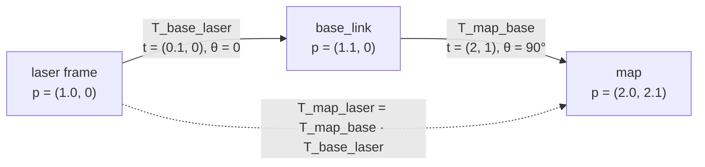

# FM.09 — 2D/3D transformations and homogeneous coordinates

<!-- glance:start -->
<!-- generated by tools/build.py from curriculum/syllabus.yaml — edit the syllabus, not this block -->

| | |
|---|---|
| **Track** | Optional foundation |
| **Difficulty** | Intermediate |
| **Time** | 1 h |
| **Hardware** | none |
| **Software** | python, numpy |
| **Prerequisites** | [FM.08 Matrices as transformations and basis vectors](FM.08-matrices-as-transformations.md) |
| **Skip if** | You understand why translation needs an extra dimension. |

<!-- glance:end -->

## What you will learn

- Explain why rotation plus translation can't be one 2×2 (or 3×3) matrix, and how adding a coordinate fixes it.
- Build 3×3 (2D) and 4×4 (3D) homogeneous transforms and apply them to points ($w = 1$) and to directions ($w = 0$).
- Chain transforms (`map ← base_link ← lidar`) with the notation $T_{A\,B}$, where the inner frame names cancel.
- Invert a rigid transform in closed form: $T^{-1} = \begin{pmatrix} R^T & -R^T\mathbf{t} \\ 0 & 1\end{pmatrix}$.
- Transform thousands of sensor points in one vectorized numpy call.

## Why it matters

A robot is a tree of frames: `map → odom → base_link → laser`, `base_link → camera_link → camera_optical_frame`, `base_link → arm_base → … → gripper`. Every edge is a rotation **and** a translation. Homogeneous coordinates turn each edge into one matrix, so walking the tree is just multiplying matrices. That is exactly what TF2 does for you ([05.07](../../05-frames-and-transforms/05.07-tf2-broadcast-listen.md)).

The main-path lessons that need this are [05.04](../../05-frames-and-transforms/05.04-homogeneous-transforms.md) (homogeneous transforms and chains), [13.05](../../13-computer-vision/13.05-pinhole-camera-model.md) (projecting 3D points into a camera), [14.04](../../14-robotic-arm/14.04-forward-kinematics.md) (arm forward kinematics is a product of 4×4 matrices) and [FCV.04](../computer-vision/FCV.04-projective-geometry.md) (homographies). Also [05.10](../../05-frames-and-transforms/05.10-object-from-camera-to-map.md), [11.04](../../11-slam/11.04-scan-matching-icp.md) (ICP estimates a transform) and [15.03](../../15-manipulation/15.03-hand-eye-calibration.md) (hand–eye calibration solves for one).

<!-- prereqs:start -->
## Prerequisites

You need these first:

- [FM.08 Matrices as transformations and basis vectors](FM.08-matrices-as-transformations.md)

### Optional prerequisite links

None.

Check your readiness: `python course.py why FM.09`
<!-- prereqs:end -->

## Concept

In [FM.08](FM.08-matrices-as-transformations.md), matrices could rotate, scale and shear, but they couldn't **move** anything. The origin always stayed put. A robot's LiDAR, however, often sits away from the robot's center, say 0.1 m in front of it. To get a LiDAR point into the robot frame, you rotate it (if the LiDAR is mounted at an angle) **and add** the mounting offset:

$$\mathbf{p}_{\text{robot}} = R\,\mathbf{p}_{\text{lidar}} + \mathbf{t}$$

That works, but chaining three frames gets ugly: $R_1(R_2(R_3\mathbf{p} + \mathbf{t}_3) + \mathbf{t}_2) + \mathbf{t}_1$. Inverting it is worse.

**The trick:** write every 2D point with an extra 1 at the end, $(x, y, 1)$, and pack $R$ and $\mathbf{t}$ into a 3×3 matrix:

$$T = \begin{pmatrix} R & \mathbf{t} \\ 0\ \ 0 & 1 \end{pmatrix}, \qquad T\begin{pmatrix}\mathbf{p} \\ 1\end{pmatrix} = \begin{pmatrix} R\mathbf{p} + \mathbf{t} \\ 1\end{pmatrix}$$

The extra 1 multiplies the translation column, so the translation gets added. Now a mounting offset is a matrix, a robot pose is a matrix, and "LiDAR point → robot → map" is two matrix multiplications. It's the same idea as wrapping heterogeneous operations behind one interface so they compose.

And there's a bonus. Write **directions** (velocities, normals, axes) with a **0** at the end, $(v_x, v_y, 0)$. The 0 cancels the translation: moving the robot doesn't change which way "forward" points. The distinction between points and vectors from [FM.05](FM.05-vectors.md) becomes one bit.

> [!TIP]
> **Ask your teacher:** "Draw a robot, a LiDAR on it and a wall point as an ASCII top view. Let me write T_map_base and T_base_laser, then compute the wall point in the map by hand before you show the numpy answer."

## Technical explanation

### Level 1 — Intuition: one matrix per frame edge

A transform $T_{A\,B}$ answers "where is frame B, as seen from frame A?" It is **the pose of B in A**. It also converts coordinates: a point known in B becomes the same point expressed in A:

$$\mathbf{p}_A = T_{A\,B}\,\mathbf{p}_B$$

Chains cancel like fractions: $T_{A\,C} = T_{A\,B}\,T_{B\,C}$. The inner **B**s must match. If they don't, the product is a bug. [05.03](../../05-frames-and-transforms/05.03-rigid-transforms-2d.md) uses the same notation.

### Level 2 — Practical: the LiDAR point in the map (2D)

karmel is at $(2, 1)$ in the map, heading $+90°$. Suppose its LiDAR is mounted 0.1 m forward of `base_link`, not rotated. (The default `labs/config/karmel.yaml` centers it; measure yours.) The LiDAR sees a wall point 1.0 m straight ahead of itself.

$$T_{\text{map base}} = \begin{pmatrix} \cos 90° & -\sin 90° & 2 \\ \sin 90° & \cos 90° & 1 \\ 0 & 0 & 1\end{pmatrix} = \begin{pmatrix} 0 & -1 & 2 \\ 1 & 0 & 1 \\ 0 & 0 & 1\end{pmatrix}, \qquad T_{\text{base laser}} = \begin{pmatrix} 1 & 0 & 0.1 \\ 0 & 1 & 0 \\ 0 & 0 & 1\end{pmatrix}$$

Step by step:

1. In the LiDAR frame: $\mathbf{p}_{\text{laser}} = (1.0, 0, 1)$.
2. In the robot frame: $T_{\text{base laser}}\mathbf{p}_{\text{laser}} = (1.1, 0, 1)$. It is 1.1 m ahead of the robot center.
3. In the map: $T_{\text{map base}}(1.1, 0, 1)^T = (0\cdot1.1 - 1\cdot0 + 2,\ 1\cdot1.1 + 0 + 1,\ 1) = (2.0, 2.1, 1)$.

The robot faces $+y$ in the map, so "1.1 m ahead" moved the point from $y = 1$ to $y = 2.1$. ✓

Or precompute $T_{\text{map laser}} = T_{\text{map base}}T_{\text{base laser}} = \begin{pmatrix} 0 & -1 & 2 \\ 1 & 0 & 1.1 \\ 0 & 0 & 1\end{pmatrix}$ once per scan and apply it to all 360 points.

**Direction vs point.** The LiDAR's forward axis $(1, 0, \mathbf{0})$ maps to $(0, 1, 0)$ in the map: rotated, not shifted. The point $(1, 0, \mathbf{1})$ maps to $(2, 2.1, 1)$.

**A scan point at an angle.** Now the robot is at $(1, 2)$ with heading 30°, and the beam at −45° has range 2.0 m. Polar → Cartesian ([FM.04](FM.04-coordinate-systems.md)) gives $(1.4142, -1.4142)$ in the laser frame. Then $T_{\text{map base}}T_{\text{base laser}}$ gives **(3.0185, 1.5324)** in the map. You'll check this in the Code section.

### Level 3 — Mathematics

**2D homogeneous rigid transform** (the group SE(2)):

$$T = \begin{pmatrix} \cos\theta & -\sin\theta & t_x \\ \sin\theta & \cos\theta & t_y \\ 0 & 0 & 1\end{pmatrix}$$

**3D** (SE(3)): a 4×4 with a 3×3 rotation $R$ ([FM.10](FM.10-rotation-matrices.md)) and a translation $\mathbf{t} \in \mathbb{R}^3$:

$$T = \begin{pmatrix} R & \mathbf{t} \\ \mathbf{0}^T & 1\end{pmatrix}, \qquad \text{points } (x, y, z, 1),\ \ \text{directions } (x, y, z, 0)$$

**Composition** is not commutative. With $A$ = "translate 1 m along x" and $B$ = "rotate 90°", apply both to the point $(1, 0)$:
- $AB$: rotate first, giving $(0, 1)$, then translate, giving $(1, 1)$.
- $BA$: translate first, giving $(2, 0)$, then rotate, giving $(0, 2)$.

As robot motion, $T_{\text{new}} = T_{\text{old}}\,\Delta T$ applies a motion $\Delta T$ expressed in the *robot's own frame* (drive forward 1 m, then turn). Pre-multiplying, $\Delta T\,T_{\text{old}}$, applies it in the *map* frame. Odometry uses the first.

Drive-a-square check ([01.12](../../01-first-robot/01.12-encoder-distance-and-square.md)): $\Delta T$ = "forward 1 m, then turn +90°" = $\begin{pmatrix} 0 & -1 & 1 \\ 1 & 0 & 0 \\ 0 & 0 & 1\end{pmatrix}$. Then $\Delta T^4 = I$. Four sides and you're back where you started, facing the same way.

**Inverse** of a rigid transform. From $\mathbf{p}_A = R\mathbf{p}_B + \mathbf{t}$, solve for $\mathbf{p}_B = R^T(\mathbf{p}_A - \mathbf{t}) = R^T\mathbf{p}_A - R^T\mathbf{t}$:

$$T_{B\,A} = T_{A\,B}^{-1} = \begin{pmatrix} R^T & -R^T\mathbf{t} \\ \mathbf{0}^T & 1\end{pmatrix}$$

Numbers: $T_{\text{map base}}$ above has $R^T = \begin{pmatrix} 0 & 1 \\ -1 & 0\end{pmatrix}$ and $-R^T\mathbf{t} = -(1, -2) = (-1, 2)$. A landmark at $(3, 3)$ in the map is at $T^{-1}(3, 3, 1)^T = (2, -1)$ in the robot frame: 2 m ahead, 1 m to the right. Check: the robot faces $+y$, and the landmark is 2 m further along $y$ and 1 m further along $x$, which is the robot's right. ✓

**Relative pose** between two robot poses: $\Delta T = T_1^{-1}T_2$. From $(1, 1, 0°)$ to $(1.5, 1.5, 90°)$, $\Delta T$ has translation $(0.5, 0.5)$ and rotation 90°. In the robot's starting frame, it moved 0.5 m forward and 0.5 m left while turning left 90°. Scan matching ([11.04](../../11-slam/11.04-scan-matching-icp.md)) and pose graphs ([11.05](../../11-slam/11.05-pose-graphs-loop-closure.md)) work with exactly these deltas.

**3D example: camera to map.** karmel's camera is at $(0.10, 0, 0.10)$ in `base_link`, looking forward, and publishes in the optical frame. Its rotation $R_{\text{base optical}}$ comes from [FM.08](FM.08-matrices-as-transformations.md). A detection at $(0.1, -0.05, 2.0)$ in the optical frame becomes

$$T_{\text{base optical}}\,\mathbf{p} = R\mathbf{p} + \mathbf{t} = (2.0, -0.1, 0.05) + (0.10, 0, 0.10) = (2.10, -0.10, 0.15)$$

With the robot at map $(1, 2, 0)$ and yaw 90°, the detection lands at **(1.10, 4.10, 0.15)** in the map.

**Beyond rigid.** The same 3×3/4×4 form with a non-rotation upper-left block gives **affine** transforms. Unit conversion is one example: $\operatorname{diag}(0.001, 0.001, 1)$ turns mm into m, so $(1500, -200, 1)$ becomes $(1.5, -0.2, 1)$. Allow the last row to be something other than $(0, 0, 1)$ and you get **projective** transforms. A camera matrix produces $(u w, v w, w)$ and you divide by $w$: $K(0.2, -0.1, 2.0)^T = (740, 430, 2)$ gives pixel $(370, 215)$. That's why the extra coordinate is called *homogeneous*: $(740, 430, 2)$ and $(370, 215, 1)$ are the same image point. See [FCV.04](../computer-vision/FCV.04-projective-geometry.md) and [13.05](../../13-computer-vision/13.05-pinhole-camera-model.md).

### Level 4 — Implementation

- Build from parts: `T = np.eye(4); T[:3, :3] = R; T[:3, 3] = t`.
- Transform N points stored as rows: `(P @ R.T) + t`. This is identical to padding with ones and using `@ T.T`, but it doesn't allocate the padded array.
- Invert rigid transforms with the closed form, not `np.linalg.inv`. It is exact (no rounding creep in $R$) and makes the rigid-body assumption explicit.
- Name variables `T_map_base`, `T_base_laser`, and check that adjacent names match in every product: `T_map_base @ T_base_laser` ✓, `T_base_laser @ T_map_base` ✗.
- ROS messages don't carry matrices. `geometry_msgs/Transform` has a translation plus a **quaternion** ([FM.12](FM.12-quaternions.md)). You convert to a matrix to compute, and back to publish.

## Diagram



```text
 Top view (map frame)                       homogeneous vectors
                                            point      (x, y, 1)  ← translation applies
  y                                         direction  (x, y, 0)  ← translation ignored
  ▲
  │        ● wall point (2.0, 2.1)          T = [ R   t ]
  │        │                                    [ 0   1 ]
  │        │ 1.0 m (laser +x)
  │        ▲ laser at (2.0, 1.1)            T⁻¹ = [ Rᵀ  −Rᵀt ]
  │        │ 0.1 m                                [ 0     1  ]
  │        ● base_link at (2, 1), heading +90°
  │
  └────────────────────────► x
```

## Code

Save as `fm09_homogeneous.py` and run `python fm09_homogeneous.py`. It needs numpy.

```python
"""FM.09 — homogeneous transforms in 2D and 3D: build, chain, invert, apply."""
import math

import numpy as np

np.set_printoptions(precision=4, suppress=True)


def se2(x: float, y: float, theta: float) -> np.ndarray:
    c, s = math.cos(theta), math.sin(theta)
    return np.array([[c, -s, x], [s, c, y], [0.0, 0.0, 1.0]])


def se3(R: np.ndarray, t: np.ndarray) -> np.ndarray:
    T = np.eye(4)
    T[:3, :3] = R
    T[:3, 3] = t
    return T


def rot_z(a: float) -> np.ndarray:
    c, s = math.cos(a), math.sin(a)
    return np.array([[c, -s, 0.0], [s, c, 0.0], [0.0, 0.0, 1.0]])


def invert(T: np.ndarray) -> np.ndarray:
    """Closed-form inverse of a rigid transform (works for 3x3 and 4x4)."""
    n = T.shape[0] - 1
    R, t = T[:n, :n], T[:n, n]
    Ti = np.eye(n + 1)
    Ti[:n, :n] = R.T
    Ti[:n, n] = -R.T @ t
    return Ti


def transform_points(T: np.ndarray, P: np.ndarray) -> np.ndarray:
    """Apply T to an (N, d) array of points (d = 2 or 3)."""
    n = T.shape[0] - 1
    return P @ T[:n, :n].T + T[:n, n]


def transform_directions(T: np.ndarray, V: np.ndarray) -> np.ndarray:
    n = T.shape[0] - 1
    return V @ T[:n, :n].T          # w = 0: rotation only


if __name__ == "__main__":
    T_map_base = se2(2.0, 1.0, math.pi / 2)
    T_base_laser = se2(0.1, 0.0, 0.0)
    T_map_laser = T_map_base @ T_base_laser
    print("T_map_laser =\n", T_map_laser)
    print("wall point in map:", T_map_laser @ np.array([1.0, 0.0, 1.0]))
    print("laser x-axis in map (w=0):", T_map_laser @ np.array([1.0, 0.0, 0.0]))

    print("landmark (3,3) in base_link:", invert(T_map_base) @ np.array([3.0, 3.0, 1.0]))
    print("closed-form inverse == np.linalg.inv:", np.allclose(invert(T_map_base), np.linalg.inv(T_map_base)))

    step = se2(1.0, 0.0, math.pi / 2)            # forward 1 m, then turn left 90 degrees
    print("square of four steps == identity:", np.allclose(np.linalg.matrix_power(step, 4), np.eye(3)))

    angles = np.radians([-45.0, 0.0, 45.0])
    ranges = np.array([2.0, 1.0, 1.5])
    scan = np.column_stack((ranges * np.cos(angles), ranges * np.sin(angles)))
    print("scan in map (robot at (1,2), 30 deg):\n",
          transform_points(se2(1.0, 2.0, math.radians(30)) @ T_base_laser, scan))

    R_base_optical = np.column_stack(([0, -1, 0], [0, 0, -1], [1, 0, 0])).astype(float)
    T_base_optical = se3(R_base_optical, np.array([0.10, 0.0, 0.10]))
    T_map_base3 = se3(rot_z(math.pi / 2), np.array([1.0, 2.0, 0.0]))
    det_optical = np.array([[0.1, -0.05, 2.0]])
    print("detection in base_link:", transform_points(T_base_optical, det_optical))
    print("detection in map:      ", transform_points(T_map_base3 @ T_base_optical, det_optical))
    print("optical z-axis in map: ", transform_directions(T_map_base3 @ T_base_optical, np.array([[0.0, 0.0, 1.0]])))
```

Output:

```text
T_map_laser =
 [[ 0.  -1.   2. ]
 [ 1.   0.   1.1]
 [ 0.   0.   1. ]]
wall point in map: [2.  2.1 1. ]
laser x-axis in map (w=0): [0. 1. 0.]
landmark (3,3) in base_link: [ 2. -1.  1.]
closed-form inverse == np.linalg.inv: True
square of four steps == identity: True
scan in map (robot at (1,2), 30 deg):
 [[3.0185 1.5324]
 [1.9526 2.55  ]
 [1.4748 3.4989]]
detection in base_link: [[ 2.1  -0.1   0.15]]
detection in map:       [[1.1  4.1  0.15]]
optical z-axis in map:  [[0. 1. 0.]]
```

## Exercise

All exercises need hardware: none.

### Exercise FM.09-E1 — A rear-facing sensor `[numerical]`

karmel is at $(3, -1)$ with heading $-90°$. A rear sensor is mounted at $(0.2, 0.05)$ in `base_link` but faces backward (yaw 180°). It sees an object 0.5 m straight ahead of the sensor. Write $T_{\text{map base}}$ and $T_{\text{base sensor}}$, compute $T_{\text{map sensor}}$, and find the object in the map. Sanity-check the answer with a sketch.

### Exercise FM.09-E2 — Where is the landmark relative to me? `[numerical]`

Using $T_{\text{map base}}$ = robot at $(2, 1)$, heading $90°$: compute $T^{-1}$ with the closed form, and find the robot-frame coordinates of map points $(2, 3)$ and $(0, 1)$. Describe each in words (ahead/behind, left/right).

### Exercise FM.09-E3 — Predict: point or direction? `[predict]`

Apply $T = $ `se2(5, -3, 0)` (pure translation) to (a) the point $(1, 2)$, (b) the velocity $(1, 2)$ m/s, (c) the difference of two points $\mathbf{p}_2 - \mathbf{p}_1$ with $\mathbf{p}_1 = (0, 0)$ and $\mathbf{p}_2 = (1, 2)$, transformed as points first and then subtracted. **Predict** all three before computing. What does (c) tell you about $w$?

### Exercise FM.09-E4 — Debug the transform chain `[debugging]`

This code should put a LiDAR point into the map, but it gives the wrong answer for any robot heading other than 0. Find the bug using the name-cancellation rule, then fix it.

```python
import math

import numpy as np


def se2(x, y, th):
    c, s = math.cos(th), math.sin(th)
    return np.array([[c, -s, x], [s, c, y], [0, 0, 1.0]])


T_map_base = se2(2.0, 1.0, math.pi / 2)
T_base_laser = se2(0.1, 0.0, 0.0)
p_laser = np.array([1.0, 0.0, 1.0])
p_map = T_base_laser @ T_map_base @ p_laser
print(p_map)
```

### Exercise FM.09-E5 — Arm on a mobile base `[coding]`

A small arm is bolted to karmel at $(0.05, 0, 0.07)$ in `base_link` with no rotation. Its forward kinematics says the gripper is at $(0.2, 0, 0.1)$ in the arm-base frame. karmel is at map $(1, 2, 0)$ with yaw 90°. Using `se3` and `rot_z`, compute the gripper position in the map. Then compute where a cup at map $(1.0, 2.3, 0.15)$ is in the **arm-base** frame (you need an inverse). ([15.10](../../15-manipulation/15.10-mobile-manipulation.md) does this for real.)

## Expected result

- **FM.09-E1:** $T_{\text{map base}}$ = `[[0, 1, 3], [-1, 0, -1], [0, 0, 1]]`. $T_{\text{base sensor}}$ = `[[-1, 0, 0.2], [0, -1, 0.05], [0, 0, 1]]`. $T_{\text{map sensor}}$ = **[[0, −1, 3.05], [1, 0, −1.2], [0, 0, 1]]**, so the sensor faces map $+y$. Object: **(3.05, −0.70)**. The sketch: the robot faces $-y$, so its rear sensor faces $+y$, and the object is 0.5 m further along $+y$ from the sensor at $(3.05, -1.2)$.
- **FM.09-E2:** $T^{-1}$ = **[[0, 1, −1], [−1, 0, 2], [0, 0, 1]]**. $(2, 3)$ → **(2, 0)**: 2 m straight ahead. $(0, 1)$ → **(0, 2)**: 2 m to the left.
- **FM.09-E3:** (a) **(6, −1)**: points move. (b) **(1, 2)**: velocities are directions, $w = 0$, unaffected by translation. (c) $(6, -1) - (5, -3) = $ **(1, 2)**: the translation cancels. Point − point has $w = 1 - 1 = 0$, a direction, consistent with FM.05.
- **FM.09-E4:** `T_base_laser @ T_map_base` doesn't cancel (base…laser · map…base). It must be `T_map_base @ T_base_laser`. The buggy code prints **[2.1, 2.0, 1]** instead of **[2.0, 2.1, 1]**. It only coincides with the correct answer when both rotations are zero.
- **FM.09-E5:** Gripper in map: **(1.0, 2.25, 0.17)**. Cup in the arm-base frame: $T_{\text{arm map}} = (T_{\text{map base}}T_{\text{base arm}})^{-1}$ gives **(0.25, 0.0, 0.08)**: 0.25 m ahead of the arm base and 0.08 m up.

<details><summary>Reference solution for FM.09-E5</summary>

```python
import math

import numpy as np


def se3(R, t):
    T = np.eye(4)
    T[:3, :3] = R
    T[:3, 3] = t
    return T


def rot_z(a):
    c, s = math.cos(a), math.sin(a)
    return np.array([[c, -s, 0.0], [s, c, 0.0], [0.0, 0.0, 1.0]])


def invert(T):
    R, t = T[:3, :3], T[:3, 3]
    return se3(R.T, -R.T @ t)


T_map_base = se3(rot_z(math.pi / 2), np.array([1.0, 2.0, 0.0]))
T_base_arm = se3(np.eye(3), np.array([0.05, 0.0, 0.07]))
T_map_arm = T_map_base @ T_base_arm
print("gripper in map:", (T_map_arm @ np.array([0.2, 0.0, 0.1, 1.0]))[:3].round(4))
print("cup in arm frame:", (invert(T_map_arm) @ np.array([1.0, 2.3, 0.15, 1.0]))[:3].round(4))
```
</details>

## Troubleshooting

### Symptom: points are in the right place only when the robot faces 0°

1. The product order is wrong. Write the frame names under each factor and check that the inner names cancel ($T_{A\,B}T_{B\,C}$).
2. Or you applied the rotation and translation in the wrong order by hand: $R(\mathbf{p} + \mathbf{t})$ instead of $R\mathbf{p} + \mathbf{t}$.

### Symptom: the result is exactly mirrored or off by the robot's position

1. You used $T_{A\,B}$ where you needed $T_{B\,A}$. Print both and test a point you can reason about (the other frame's origin: $T_{A\,B}(0, 0, 1)^T$ must equal B's origin in A).
2. A mirror (not an offset) means a rotation block with det −1 ([FM.08](FM.08-matrices-as-transformations.md)).

### Symptom: velocities or normals come out shifted by the robot's position

You transformed a direction as a point ($w = 1$). Use $w = 0$ or rotation only.

### Symptom: after many compositions the matrix isn't a clean rotation anymore

Rounding errors accumulate in $R$. Re-orthonormalize periodically ([FM.10](FM.10-rotation-matrices.md)), or store poses as $(x, y, \theta)$ / quaternion + translation and rebuild the matrix when needed.

## Common mistakes

- **Multiplying in the wrong order.** Use `T_a_b` names and check the cancellation.
- **Transforming directions as points.** Velocities, axes and normals get $w = 0$.
- **Forgetting that $T_{A\,B}$ maps B-coordinates *into* A.** It is also the pose of B in A. Both readings are the same matrix.
- **`np.linalg.inv` everywhere.** The closed form is exact and documents intent.
- **Padding each point in a Python loop.** Use `P @ R.T + t` for whole scans.
- **Mixing 2D (3×3) and 3D (4×4) transforms** in one chain. Pick one dimension per pipeline.

## Knowledge check

1. Why do we append a 1 to points?
   <details><summary>Answer</summary>

   So the translation column of the matrix gets multiplied by 1 and added. Rotation and translation become one matrix, and chaining becomes matrix multiplication.
   </details>

2. What is the robot-frame position of the map origin if the robot is at $(4, 0)$ with heading 180°?
   <details><summary>Answer</summary>

   $T^{-1}$ has $R^T = R(-180°) = -I$ and $-R^T\mathbf{t} = (4, 0)$. The origin $(0, 0)$ maps to $(4, 0)$: 4 m ahead. The robot faces $-x$, toward the origin, 4 m away. ✓
   </details>

3. Given $T_{\text{odom base}}$ and $T_{\text{map odom}}$, how do you get the robot pose in the map?
   <details><summary>Answer</summary>

   $T_{\text{map base}} = T_{\text{map odom}}\,T_{\text{odom base}}$. This is the REP-105 chain ([05.06](../../05-frames-and-transforms/05.06-frame-conventions-rep103-rep105.md)).
   </details>

4. Predict: you apply a 4×4 transform to the direction $(0, 0, 1, 0)$. Can the result have a non-zero fourth component?
   <details><summary>Answer</summary>

   Not for rigid or affine transforms: the last row is $(0, 0, 0, 1)$, so $w$ stays 0. Only projective transforms change $w$.
   </details>

5. A robot moves "0.5 m forward then turns 90° left" in its own frame, starting at pose $T_0$. Is the new pose $T_0\,\Delta T$ or $\Delta T\,T_0$?
   <details><summary>Answer</summary>

   $T_0\,\Delta T$. The motion is expressed in the robot's (moving) frame, so it goes on the right. $\Delta T\,T_0$ would apply the motion in map axes about the map origin.
   </details>

6. Debugging: a colleague computes `T_inv = T.copy(); T_inv[:2, 2] *= -1` to invert a 2D pose. For which poses is that correct?
   <details><summary>Answer</summary>

   Only when the rotation is identity (θ = 0), and even then they didn't transpose $R$. In general the inverse translation is $-R^T\mathbf{t}$, not $-\mathbf{t}$, and the rotation must become $R^T$.
   </details>

## Practical challenge

Write a tiny **transform tree** class in pure numpy: `set_transform(parent, child, T)`, and `lookup(target, source)` that returns $T_{\text{target source}}$ for any two frames in the tree, walking up to the common ancestor and inverting edges as needed. Build karmel's tree: `map → odom → base_link → {laser, camera_link → camera_optical_frame, imu_link}` with plausible numbers from `labs/config/karmel.yaml`.

**Acceptance criteria:** `lookup("map", "camera_optical_frame")` applied to an optical point gives the same result as multiplying the chain by hand. `lookup(a, b) @ lookup(b, a)` is identity for every pair within 1e-12. Looking up a frame that isn't in the tree raises a clear error. This is a toy TF2, and [05.07](../../05-frames-and-transforms/05.07-tf2-broadcast-listen.md) will feel familiar.

## You can skip this if…

You answer knowledge-check questions 2, 5 and 6 correctly without looking, and you can write the closed-form inverse of a 4×4 rigid transform from memory.

`python course.py skip FM.09 --reason "I understand why translation needs an extra dimension and chain 4x4 transforms routinely"`

## Go deeper

- Wikipedia, Homogeneous coordinates: https://en.wikipedia.org/wiki/Homogeneous_coordinates — the projective-geometry origin of the extra coordinate.
- Wikipedia, Transformation matrix: https://en.wikipedia.org/wiki/Transformation_matrix — affine and projective forms, with examples.
- Modern Robotics (Lynch & Park), free book and videos: https://hades.mech.northwestern.edu/index.php/Modern_Robotics — chapter 3 treats SE(3) rigorously, with the notation used in arm kinematics.
- ROS 2 Jazzy, tf2 concepts: https://docs.ros.org/en/jazzy/Concepts/Intermediate/About-Tf2.html — how ROS stores and chains the transforms you just computed by hand.
- QUT Robot Academy (Peter Corke): https://robotacademy.net.au/ — short video lessons on 2D/3D pose representation.

## Progress checkpoint

- [ ] I build 3×3 and 4×4 homogeneous transforms and apply them to points and directions.
- [ ] I chain transforms with `T_a_b` naming and check that inner frames cancel.
- [ ] I invert rigid transforms in closed form.
- [ ] I transform whole point clouds with vectorized numpy.

`python course.py complete FM.09` (exercises done) · `python course.py master FM.09` (challenge done) · `python course.py struggle FM.09 "what was hard"`

Next: [FM.10 — Rotation matrices](FM.10-rotation-matrices.md).
