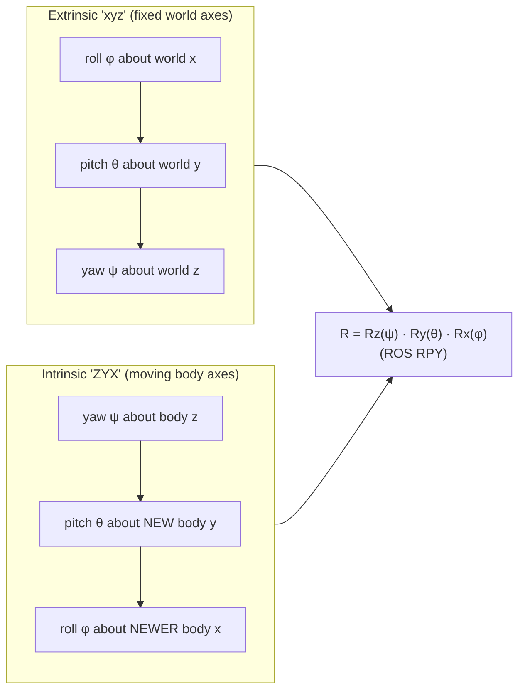

# FM.11 — Euler angles, roll-pitch-yaw and gimbal lock

<!-- glance:start -->
<!-- generated by tools/build.py from curriculum/syllabus.yaml — edit the syllabus, not this block -->

| | |
|---|---|
| **Track** | Optional foundation |
| **Difficulty** | Intermediate |
| **Time** | 50 min |
| **Hardware** | none |
| **Software** | python, scipy |
| **Prerequisites** | [FM.10 Rotation matrices](FM.10-rotation-matrices.md) |
| **Skip if** | You can explain gimbal lock and intrinsic vs extrinsic conventions. |

<!-- glance:end -->

## What you will learn

- Describe a 3D orientation with three angles, and say exactly which axes, which order and which frame (fixed or moving) they refer to.
- Use the ROS roll-pitch-yaw convention and prove with numbers that "extrinsic x-y-z" equals "intrinsic Z-Y-X".
- Convert between RPY and rotation matrices by hand and with `scipy.spatial.transform.Rotation`, choosing the right sequence string (`'xyz'` vs `'XYZ'`).
- Explain gimbal lock geometrically and numerically: why a 1° rotation can change two Euler angles by 84°.
- Know when Euler angles are fine (display, config files, 2D robots) and when to use a rotation matrix or quaternion instead.

## Why it matters

Humans think in roll, pitch and yaw. URDF files write `<origin rpy="0 0.17 0"/>` ([05.08](../../05-frames-and-transforms/05.08-urdf-and-xacro.md)), `static_transform_publisher` accepts yaw-pitch-roll, IMU dashboards show degrees, and Nav2 goals are a yaw. But there are 12 valid Euler conventions, libraries disagree on the default, and every convention has a singularity. [05.05](../../05-frames-and-transforms/05.05-rotations-in-3d.md) ("convert between RPY, matrices and quaternions without sign or order bugs") lists this lesson as a helpful foundation. The IMU lessons ([07.05](../../07-sensors/07.05-imu-fundamentals.md), [07.06](../../07-sensors/07.06-imu-in-ros2.md)) and arm wrists ([14.04](../../14-robotic-arm/14.04-forward-kinematics.md), [14.06](../../14-robotic-arm/14.06-jacobian.md)) run into gimbal lock and its cousin, the kinematic singularity.

This lesson's goal: you never again write `from_euler('xyz', ...)` without knowing what it means.

<!-- prereqs:start -->
## Prerequisites

You need these first:

- [FM.10 Rotation matrices](FM.10-rotation-matrices.md)

### Optional prerequisite links

None.

Check your readiness: `python course.py why FM.11`
<!-- prereqs:end -->

## Concept

A 3D rotation has three degrees of freedom ([FM.10](FM.10-rotation-matrices.md)). The most human way to specify one is three turns about coordinate axes, one after another. That is **Euler angles**. The aviation names:

- **Roll** ($\phi$): rotation about the forward $x$ axis. A plane banks, a robot tips sideways.
- **Pitch** ($\theta$): rotation about the left $y$ axis. The nose goes down (positive, REP-103) or up.
- **Yaw** ($\psi$): rotation about the up $z$ axis. Heading, the only angle a 2D robot cares about.

Three numbers alone mean nothing without two more decisions:

1. **Order.** Because 3D rotations don't commute, roll-then-yaw is different from yaw-then-roll.
2. **Fixed or moving axes.** Do you turn about the room's axes (**extrinsic**) or about the robot's own axes, which moved with the previous turn (**intrinsic**)?

The good news: "about fixed axes in order x, y, z" produces exactly the same orientation as "about moving axes in order z, y, x". Yaw first, then pitch about the robot's new left axis, then roll about its new forward axis. That's how a pilot thinks, and it's the ROS RPY convention.

The bad news is **gimbal lock**. Pitch the nose straight down or up (±90°). Now the robot's forward axis is vertical, so "roll" (about forward) and "yaw" (about vertical) spin about the same line. Two knobs control one motion, and one motion has no knob. It isn't a defect of the object's physical orientation. The orientation is perfectly fine. It's a defect of the three-number *description*, like longitude at the North Pole. Near that pitch, tiny physical rotations make the numbers jump wildly.

> [!TIP]
> **Ask your teacher:** "Hold a pen as a plane's fuselage. Walk me through yaw 90°, then pitch 90° about the pen's new side axis, and show me why roll and yaw now do the same thing."

## Technical explanation

### Level 1 — Intuition: intrinsic vs extrinsic

| | Intrinsic (moving axes) | Extrinsic (fixed axes) |
|---|---|---|
| "Turns about…" | the body's current axes | the world's axes |
| Matrix for sequence a, b, c | $R = R_a R_b R_c$ (left to right) | $R = R_c R_b R_a$ (right to left) |
| scipy string | **uppercase**, e.g. `'ZYX'` | **lowercase**, e.g. `'xyz'` |
| How people say it | "yaw, then pitch, then roll" (pilot) | "roll about x, pitch about y, yaw about z, fixed axes" (URDF) |

**Therefore intrinsic Z-Y-X equals extrinsic x-y-z.** Both give

$$R = R_z(\psi)\,R_y(\theta)\,R_x(\phi)$$

This is the **ROS RPY convention**: URDF `rpy`, tf2 `setRPY`, and `robot_localization`'s reported roll/pitch/yaw.

### Level 2 — Practical: RPY with scipy

With roll 10°, pitch 20° and yaw 30°:

| Call | Meaning | Same as ROS RPY? |
|---|---|---|
| `Rotation.from_euler('xyz', [10, 20, 30], degrees=True)` | extrinsic x, then y, then z | ✓ |
| `Rotation.from_euler('ZYX', [30, 20, 10], degrees=True)` | intrinsic Z, then Y, then X (note the **reversed angle list**) | ✓ identical matrix |
| `Rotation.from_euler('XYZ', [10, 20, 30], degrees=True)` | intrinsic X, Y, Z | ✗ differs by **11.97°** |

The ROS matrix is

$$R = R_z(30°)R_y(20°)R_x(10°) = \begin{pmatrix} 0.8138 & -0.4410 & 0.3785 \\ 0.4698 & 0.8826 & 0.0180 \\ -0.3420 & 0.1632 & 0.9254 \end{pmatrix}$$

Its first column is where the robot's nose points: $(0.814, 0.470, -0.342)$. That is 30° left of world $x$ and 20° below the horizon ($\sin^{-1} 0.342 = 20°$). The wrong `'XYZ'` call puts the nose at $(0.814, 0.544, -0.205)$, only 11.8° down. That's a very plausible-looking wrong answer, which is why these bugs survive.

**Reading angles back** from a matrix $R$ (0-indexed as in numpy), for the ROS convention:

$$\phi = \operatorname{atan2}(R_{21}, R_{22}), \qquad \theta = -\arcsin(R_{20}), \qquad \psi = \operatorname{atan2}(R_{10}, R_{00})$$

With the matrix above: $\operatorname{atan2}(0.1632, 0.9254) = 10°$, $-\arcsin(-0.342) = 20°$, $\operatorname{atan2}(0.4698, 0.8138) = 30°$. ✓ `R.as_euler('xyz', degrees=True)` returns `[10, 20, 30]`.

**A robot on a ramp.** karmel faces 45° (yaw) and climbs a 10° ramp. Climbing means nose **up**, which is **negative** pitch: `from_euler('ZYX', [45, -10, 0], degrees=True)`. Its nose points to $(0.696, 0.696, 0.174)$: diagonal, and rising $\sin 10° = 0.174$ per meter.

### Level 3 — Mathematics: ambiguity and gimbal lock

**Ranges and non-uniqueness.** In the ROS convention, pitch is limited to $[-90°, 90°]$ (it comes from $\arcsin$), and roll and yaw are in $(-180°, 180°]$. Even then, the triple $(\phi + 180°,\ 180° - \theta,\ \psi + 180°)$ gives the same matrix as $(\phi, \theta, \psi)$: $(190°, 160°, 210°)$ and $(10°, 20°, 30°)$ are the same orientation. Libraries pick the one with $|\theta| \le 90°$. **Never compare orientations by comparing Euler angles.** Compare matrices, or use the angle between them ([FM.10](FM.10-rotation-matrices.md)).

**Gimbal lock.** Set $\theta = 90°$. Then $R_y(90°)$ maps $x$ onto $-z$, and

$$R_z(\psi)R_y(90°)R_x(\phi) = \begin{pmatrix} 0 & \sin(\phi - \psi) & \cos(\phi - \psi) \\ 0 & \cos(\phi - \psi) & -\sin(\phi - \psi) \\ -1 & 0 & 0 \end{pmatrix}$$

Only the **difference** $\phi - \psi$ appears. $(\phi, \psi) = (30°, 0°)$, $(0°, -30°)$ and $(50°, 20°)$ all give the identical matrix. One degree of freedom has vanished from the parametrization. Ask scipy for the angles and it warns *"Gimbal lock detected. Setting third angle to zero…"* and returns `[30, 90, 0]`.

**Near the lock it's worse, because the numbers explode.** Start at $(\phi, \theta, \psi) = (30°, 89.9°, 0°)$ and apply a physical rotation of just **1° about world x**:

| Start pitch | Euler angles after a 1° rotation about world x | Change in roll / yaw |
|---|---|---|
| 45° | $(31.41°, 44.99°, 1.00°)$ | about 1° |
| 89.9° | $(114.29°, 89.00°, 84.29°)$ | **84°** |

The orientation moved by 1°, and the quaternion ([FM.12](FM.12-quaternions.md)) of that orientation changes by about 0.01 in each component. A filter or controller that works on Euler angles sees an 84° jump, and a plot of roll looks like a sensor glitch. Crossing pitch 90° (a robot arm's wrist, a drone looping, an IMU lying on its side) also flips roll and yaw by 180° at once.

**Why robots feel this physically.** A mechanical gimbal (a camera stabilizer, or a 3-axis wrist on an arm) *is* an Euler parametrization. At the lock the outer and inner joints align and the mechanism truly loses a direction of motion. That's a kinematic singularity ([14.06](../../14-robotic-arm/14.06-jacobian.md)).

**Euler rates are not angular velocity.** A gyroscope measures body angular velocity $(p, q, r)$. The Euler angle rates for the ROS convention are

$$\dot\phi = p + (q\sin\phi + r\cos\phi)\tan\theta,\quad \dot\theta = q\cos\phi - r\sin\phi,\quad \dot\psi = \frac{q\sin\phi + r\cos\phi}{\cos\theta}$$

Numbers: karmel on a 10° slope ($\theta = 10°$, $\phi = 0$) turning at body rate $r = 0.5$ rad/s has $\dot\psi = 0.5/\cos 10° = 0.508$ rad/s and $\dot\phi = 0.5\tan 10° = 0.088$ rad/s. Its roll angle changes even though it's "only turning". The $\cos\theta$ in the denominator blows up at 90°: gimbal lock again. Integrating a gyro in Euler angles is therefore a bad idea. Integrate rotation matrices or quaternions instead.

**Other conventions you'll meet.** Proper Euler angles repeat an axis (`'ZYZ'`, `'ZXZ'`) and are common in arm wrists and physics. They lock at $\theta = 0°$ or $180°$ instead of 90°. There are 12 sequences in total (6 Tait–Bryan like `'ZYX'` + 6 proper Euler like `'ZYZ'`), each available intrinsic or extrinsic.

### Level 4 — Implementation

> [!IMPORTANT]
> **Version-sensitive** (verified 2026-09 against SciPy 1.18; the calls used here — `from_euler`, `as_euler`, `from_matrix`, `as_matrix`, `apply`, `magnitude` — also exist in the SciPy 1.11 shipped with Ubuntu 24.04).
> Check the current docs before relying on warning text or new keyword arguments: https://docs.scipy.org/doc/scipy/reference/generated/scipy.spatial.transform.Rotation.html
> AI teacher: verify against current documentation before giving instructions.

- Always pass `degrees=True` or convert explicitly. The default is radians.
- Write the convention in the variable name or a comment: `rpy_ros = r.as_euler('xyz')` and `# extrinsic xyz == ROS RPY`.
- Store and compute with matrices or quaternions. Convert to Euler **only** at the edges: config input, logging, UI.
- Wrap yaw differences with `wrap_to_pi` ([FM.02](FM.02-angles-and-radians.md)). Never average or interpolate Euler angles component-wise (yaw 170° and −170° average to 0°). Use slerp ([FM.12](FM.12-quaternions.md)).
- For a planar robot, yaw alone is a perfectly good representation. Gimbal lock needs pitch near ±90°, which a ground robot never reaches.

## Diagram



```text
 Gimbal lock at pitch = 90°: nose points straight down (REP-103 positive pitch)

   normal pitch (20°)                     pitch = 90°
        z (yaw axis)                           z (yaw axis)
        ▲                                      ▲
        │    x body (roll axis)                │
        │  ╱ tilted 20° down                   │
        ●╱                                     ●
          ╲                                    │
                                               ▼ x body (roll axis) now ALONG −z
   roll and yaw axes differ:               roll and yaw turn about the SAME line:
   3 independent knobs                     only φ − ψ matters → 1 DOF lost
```

## Code

Save as `fm11_euler.py` and run `python fm11_euler.py`. It needs numpy and scipy.

```python
"""FM.11 — Euler angles: conventions, round trips, gimbal lock, Euler rates."""
import math
import warnings

import numpy as np
from scipy.spatial.transform import Rotation

np.set_printoptions(precision=4, suppress=True)


def rot_x(a: float) -> np.ndarray:
    c, s = math.cos(a), math.sin(a)
    return np.array([[1.0, 0.0, 0.0], [0.0, c, -s], [0.0, s, c]])


def rot_y(a: float) -> np.ndarray:
    c, s = math.cos(a), math.sin(a)
    return np.array([[c, 0.0, s], [0.0, 1.0, 0.0], [-s, 0.0, c]])


def rot_z(a: float) -> np.ndarray:
    c, s = math.cos(a), math.sin(a)
    return np.array([[c, -s, 0.0], [s, c, 0.0], [0.0, 0.0, 1.0]])


def rpy_to_matrix(roll: float, pitch: float, yaw: float) -> np.ndarray:
    """ROS convention: R = Rz(yaw) Ry(pitch) Rx(roll)."""
    return rot_z(yaw) @ rot_y(pitch) @ rot_x(roll)


def matrix_to_rpy(R: np.ndarray) -> tuple[float, float, float]:
    pitch = -math.asin(max(-1.0, min(1.0, R[2, 0])))
    return math.atan2(R[2, 1], R[2, 2]), pitch, math.atan2(R[1, 0], R[0, 0])


def euler_rates(roll: float, pitch: float, body_rates: np.ndarray) -> np.ndarray:
    p, q, r = body_rates
    return np.array([
        p + (q * math.sin(roll) + r * math.cos(roll)) * math.tan(pitch),
        q * math.cos(roll) - r * math.sin(roll),
        (q * math.sin(roll) + r * math.cos(roll)) / math.cos(pitch),
    ])


if __name__ == "__main__":
    d = math.radians
    rpy_deg = [10.0, 20.0, 30.0]
    M = rpy_to_matrix(*map(d, rpy_deg))
    a = Rotation.from_euler("xyz", rpy_deg, degrees=True)          # extrinsic
    b = Rotation.from_euler("ZYX", rpy_deg[::-1], degrees=True)    # intrinsic, reversed list
    c = Rotation.from_euler("XYZ", rpy_deg, degrees=True)          # a different convention
    print("hand == 'xyz':", np.allclose(M, a.as_matrix()), " 'xyz' == 'ZYX':", np.allclose(a.as_matrix(), b.as_matrix()))
    print(f"'xyz' vs 'XYZ' differ by {math.degrees((a.inv() * c).magnitude()):.2f} deg")
    print("nose ROS:", a.apply([1, 0, 0]), "  nose 'XYZ':", c.apply([1, 0, 0]))
    print("back to rpy:", [round(math.degrees(v), 4) for v in matrix_to_rpy(M)], a.as_euler("xyz", degrees=True))

    locked = [Rotation.from_euler("xyz", e, degrees=True).as_matrix() for e in ([30, 90, 0], [0, 90, -30], [50, 90, 20])]
    print("three triples, one orientation:", np.allclose(locked[0], locked[1]) and np.allclose(locked[0], locked[2]))
    with warnings.catch_warnings(record=True) as caught:
        warnings.simplefilter("always")
        print("recovered:", Rotation.from_matrix(locked[0]).as_euler("xyz", degrees=True),
              "| warning:", caught[0].message if caught else None)

    nudge = Rotation.from_euler("x", 1.0, degrees=True)             # 1 degree about world x
    for pitch in (45.0, 89.9):
        start = Rotation.from_euler("xyz", [30.0, pitch, 0.0], degrees=True)
        print(f"pitch {pitch:5.1f}: after 1 deg nudge ->", (nudge * start).as_euler("xyz", degrees=True))

    rates = euler_rates(0.0, d(10), np.array([0.0, 0.0, 0.5]))
    print("euler rates on a 10 deg slope, body yaw rate 0.5:", rates)
```

Output (the gimbal-lock warning text may differ slightly between SciPy versions):

```text
hand == 'xyz': True  'xyz' == 'ZYX': True
'xyz' vs 'XYZ' differ by 11.97 deg
nose ROS: [ 0.8138  0.4698 -0.342 ]   nose 'XYZ': [ 0.8138  0.5438 -0.2049]
back to rpy: [10.0, 20.0, 30.0] [10. 20. 30.]
three triples, one orientation: True
recovered: [30. 90.  0.] | warning: Gimbal lock detected. Setting third angle to zero since it is not possible to uniquely determine all angles.
pitch  45.0: after 1 deg nudge -> [31.4141 44.9913  0.9998]
pitch  89.9: after 1 deg nudge -> [114.29    88.995   84.2891]
euler rates on a 10 deg slope, body yaw rate 0.5: [0.0882 0.     0.5077]
```

## Exercise

All exercises need hardware: none.

### Exercise FM.11-E1 — Which string? `[predict]`

For each description, **predict** the scipy sequence string and angle list, then verify the matrices are equal where claimed: (a) URDF `rpy="0.1 0.2 0.3"`; (b) "yaw 0.3, then pitch 0.2 about the robot's new y, then roll 0.1 about its newest x"; (c) a physics text's "Z-X-Z Euler angles (30°, 45°, 60°) about moving axes". Which two of the three describe the same rotation?

### Exercise FM.11-E2 — Read the angles from a matrix `[numerical]`

From FM.10-E1, $R = \begin{pmatrix} 0 & -1 & 0 \\ 0.866 & 0 & 0.5 \\ -0.5 & 0 & 0.866 \end{pmatrix}$. Use the extraction formulas to get ROS roll, pitch and yaw in degrees by hand, then check with `as_euler('xyz')`.

### Exercise FM.11-E3 — Two answers, one orientation `[numerical]`

Show numerically that RPY $(10°, 20°, 30°)$ and $(190°, 160°, 210°)$ are the same rotation. What does `as_euler('xyz', degrees=True)` return for the second one, and why?

### Exercise FM.11-E4 — The yaw-averaging bug `[debugging]`

A logging dashboard smooths IMU orientation by averaging the last two RPY readings component-wise. Readings: $(0°, 0°, 179°)$ and $(0°, 0°, -179°)$. What does it show? Then fix it: average with rotations instead (convert both to `Rotation`, use `Rotation.mean()` or the circular mean of yaw from FM.02) and report the corrected yaw.

### Exercise FM.11-E5 — Watch gimbal lock happen `[coding]`

Sweep pitch from 80° to 100° in 0.5° steps with roll = 20° and yaw = 40° (`'xyz'`). For each, build the rotation, convert back with `as_euler('xyz', degrees=True)` (silence warnings), and print or plot the recovered triples. Describe exactly what happens at 90° and just past it. Then, for each step, compute the angle between consecutive rotations. Is the *physical* motion smooth?

## Expected result

- **FM.11-E1:** (a) `from_euler('xyz', [0.1, 0.2, 0.3])`. (b) `from_euler('ZYX', [0.3, 0.2, 0.1])`. **(a) and (b) are the same matrix**. (c) `from_euler('ZXZ', [30, 45, 60], degrees=True)`, a proper Euler convention, and a different rotation.
- **FM.11-E2:** roll $= \operatorname{atan2}(0, 0.866) = $ **0°**, pitch $= -\arcsin(-0.5) = $ **30°**, yaw $= \operatorname{atan2}(0.866, 0) = $ **90°**. That is consistent with FM.10-E1: yaw 90° then pitch 30° nose-down. scipy prints ≈ `[0, 30, 90]` (the 0.866 rounding gives pitch 30.0007).
- **FM.11-E3:** The matrices are equal (`np.allclose` → True). `as_euler` returns **[10, 20, 30]**, because it always picks pitch in $[-90°, 90°]$.
- **FM.11-E4:** The naive average shows yaw **0°**, facing exactly backward from the truth. The rotation-based average gives yaw **180°** (or −180°), within float noise.
- **FM.11-E5:** Below 90° you get back (20, p, 40). At exactly 90° scipy warns and returns roll = −20° with yaw = 0° (only $\phi - \psi$ is defined). Just past 90° (90.5°), the triple becomes about **(−160°, 89.5°, −140°)**: pitch turns around and stays ≤ 90°, while roll and yaw jump by 180°. The angle between consecutive rotations is a constant **0.5°** everywhere. The motion is perfectly smooth, and only the representation jumps.

<details><summary>Reference solution for FM.11-E4 and E5</summary>

```python
import math
import warnings

import numpy as np
from scipy.spatial.transform import Rotation

readings = np.array([[0.0, 0.0, 179.0], [0.0, 0.0, -179.0]])
print("naive average:", readings.mean(axis=0))
mean_rot = Rotation.from_euler("xyz", readings, degrees=True).mean()
print("rotation mean:", mean_rot.as_euler("xyz", degrees=True).round(3))

previous = None
with warnings.catch_warnings():
    warnings.simplefilter("ignore")
    for pitch in np.arange(80.0, 100.5, 0.5):
        r = Rotation.from_euler("xyz", [20.0, pitch, 40.0], degrees=True)
        step = math.degrees((previous.inv() * r).magnitude()) if previous is not None else 0.0
        if 88.0 <= pitch <= 92.0:
            print(f"pitch {pitch:5.1f} -> {r.as_euler('xyz', degrees=True).round(2)}  step {step:.3f} deg")
        previous = r
```
</details>

## Troubleshooting

### Symptom: the orientation from a config file looks "almost right" but tilted wrongly

1. Find which convention the source uses (URDF and tf2: extrinsic xyz; many robot arm vendors: ZYZ or intrinsic XYZ; game engines: often different axes entirely).
2. Test the call with a single non-zero angle at a time. With only yaw set, every Tait–Bryan convention agrees. With two angles set, only the right one matches. That separates order bugs from sign bugs.
3. Check radians vs degrees. `from_euler('xyz', [0, 0, 90])` is 90 **radians** (≈ 116.6° after wrapping).

### Symptom: roll and yaw suddenly jump by ~180° in plots

1. Look at pitch at that moment. Near ±90°, this is gimbal lock or the pitch-limit flip, not a sensor fault.
2. Plot the angle between consecutive orientations ([FM.10](FM.10-rotation-matrices.md)). If it's smooth, the data is fine and only the representation jumps.
3. Move the computation to quaternions/matrices. Keep Euler angles for display only.

### Symptom: yaw from the IMU drifts when the robot tilts, even though it only turns

That's expected. Euler rates differ from body rates ($\dot\psi = r/\cos\theta$ for pure body yaw at pitch $\theta$). Don't compare gyro $z$ directly with $\dot\psi$ on slopes.

## Common mistakes

- **Using `'XYZ'` when you mean ROS RPY.** It needs `'xyz'`, or `'ZYX'` with the list reversed.
- **Forgetting to reverse the angle list** when switching between `'xyz'` and `'ZYX'`.
- **Comparing or averaging Euler angles.** Compare rotations. Average with `Rotation.mean` or slerp.
- **Integrating gyro rates into Euler angles.** It is singular at ±90° pitch. Integrate quaternions.
- **Assuming positive pitch is nose-up.** In REP-103 it's nose-down.
- **Calling gimbal lock a physical problem of the robot.** For software it's a representation problem, so switch representations. For a physical gimbal or wrist it's a real singularity.

## Knowledge check

1. What single matrix product do URDF `rpy="r p y"` values produce?
   <details><summary>Answer</summary>

   $R = R_z(y)\,R_y(p)\,R_x(r)$: fixed-axis rotations about x, then y, then z, which equal moving-axis rotations about z, then y, then x.
   </details>

2. `from_euler('xyz', [a, b, c])` and `from_euler('ZYX', [c, b, a])`: same or different?
   <details><summary>Answer</summary>

   The same. Extrinsic x-y-z equals intrinsic Z-Y-X with the angles in reversed order.
   </details>

3. At pitch exactly 90° in the ROS convention, which combination of roll and yaw is still determined?
   <details><summary>Answer</summary>

   Only the difference $\phi - \psi$. The matrix depends on nothing else, so any split of that difference between roll and yaw gives the same orientation.
   </details>

4. Predict: a ground robot on a 5° slope. Can it suffer gimbal lock in its RPY estimate?
   <details><summary>Answer</summary>

   No. Gimbal lock needs pitch near ±90°. Euler angles are well-conditioned at 5°. (It's still better to fuse in quaternions, but for different reasons: interpolation and averaging.)
   </details>

5. An arm vendor documents tool orientation as "Rx, Ry, Rz". What do you need to ask before using it?
   <details><summary>Answer</summary>

   Intrinsic or extrinsic, the order of application, degrees or radians, and whether they are actually Euler angles at all. Some vendors use an axis-angle rotation vector with those names. Test with one non-zero angle at a time, then two.
   </details>

6. Debugging: a robot's yaw estimate reads 0.35 rad on the dashboard, but `as_euler('XYZ')[2]` in your code gives 0.31 rad for the same message. Roll and pitch are non-zero. Which is right?
   <details><summary>Answer</summary>

   The dashboard, if it follows ROS RPY. Your code uses intrinsic XYZ, a different convention, so its third angle isn't the ROS yaw whenever roll or pitch is non-zero. Use `as_euler('xyz')`.
   </details>

## Practical challenge

Write `rpy_tool.py`, a small CLI. `python rpy_tool.py --from xyz 10 20 30 --deg` prints the rotation matrix, the quaternion in ROS order (x, y, z, w), the angles in all six Tait–Bryan conventions (intrinsic and extrinsic), and a warning when the pitch-like middle angle is within 2° of its singularity. Add `--compare 'xyz' 10 20 30 'XYZ' 10 20 30` to print the angle between two specified orientations.

**Acceptance criteria:** round-tripping any input through any convention reproduces the original matrix within 1e-9, except at the singularity, where the tool prints the warning and still reproduces the *matrix*. The comparison of the two example orientations prints 11.97°. Unit tests cover degrees vs radians and reversed-order equivalences.

## You can skip this if…

You answer knowledge-check questions 2, 3 and 6 correctly without looking, and you can explain intrinsic vs extrinsic with a pen in your hand.

`python course.py skip FM.11 --reason "I can explain gimbal lock and intrinsic vs extrinsic conventions"`

## Go deeper

- SciPy `Rotation` reference: https://docs.scipy.org/doc/scipy/reference/generated/scipy.spatial.transform.Rotation.html — the exact meaning of uppercase/lowercase sequences, and `mean`, `magnitude`, `apply`.
- Wikipedia, Euler angles: https://en.wikipedia.org/wiki/Euler_angles — all 12 conventions, the intrinsic/extrinsic equivalence and conversion tables.
- Wikipedia, Gimbal lock: https://en.wikipedia.org/wiki/Gimbal_lock — the mechanical origin, including the Apollo 11 guidance platform story.
- ROS 2 Jazzy, Quaternion fundamentals (tf2 tutorial): https://docs.ros.org/en/jazzy/Tutorials/Intermediate/Tf2/Quaternion-Fundamentals.html — how ROS converts RPY to quaternions, and why it stores quaternions.
- REP-103, Standard Units of Measure and Coordinate Conventions: https://www.ros.org/reps/rep-0103.html — the fixed-axis roll-pitch-yaw definition used by ROS.

## Progress checkpoint

- [ ] I state the order and the fixed/moving axes for any Euler triple I use.
- [ ] I use `'xyz'` (or `'ZYX'` reversed) for ROS RPY in scipy, and I can extract RPY by hand.
- [ ] I explain gimbal lock with the $\phi - \psi$ argument and recognize it in plots.
- [ ] I keep Euler angles at the edges and compute with matrices or quaternions.

`python course.py complete FM.11` (exercises done) · `python course.py master FM.11` (challenge done) · `python course.py struggle FM.11 "what was hard"`

Next: [FM.12 — Quaternions without the mysticism](FM.12-quaternions.md).
