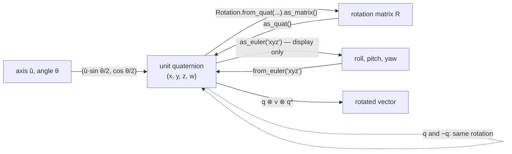

# FM.12 — Quaternions without the mysticism

<!-- glance:start -->
<!-- generated by tools/build.py from curriculum/syllabus.yaml — edit the syllabus, not this block -->

| | |
|---|---|
| **Track** | Optional foundation |
| **Difficulty** | Intermediate |
| **Time** | 1 h 15 min |
| **Hardware** | none |
| **Software** | python, scipy |
| **Prerequisites** | [FM.11 Euler angles](FM.11-euler-angles.md) |
| **Skip if** | You use quaternions and know q and -q represent the same rotation. |

<!-- glance:end -->

## What you will learn

- Read a unit quaternion as "an axis and an angle, packed into four numbers", and write one by hand for a yaw or any axis-angle rotation.
- Get yaw out of a ROS quaternion correctly (and see when the popular shortcut is wrong), and build the quaternion for a 2D robot's heading.
- Compose and invert orientations with the Hamilton product and the conjugate, and rotate a vector with $q\,\mathbf{v}\,q^*$.
- Explain why $q$ and $-q$ are the same rotation, and handle it when measuring the angle between orientations and when interpolating with slerp.
- Integrate gyro rates into a quaternion, and avoid the xyzw/wxyz convention bugs across ROS, scipy, Eigen and simulators.

## Why it matters

ROS stores **every** 3D orientation as a quaternion: `geometry_msgs/Quaternion` inside every `Pose`, `Transform`, `Odometry` and `Imu` message. When your IMU driver publishes `sensor_msgs/Imu` ([07.06](../../07-sensors/07.06-imu-in-ros2.md)), the `orientation` field is `x, y, z, w`. When odometry publishes the robot heading ([09.07](../../09-odometry/09.07-odometry-in-ros2.md)), yaw is encoded as a quaternion. TF2 transforms ([05.07](../../05-frames-and-transforms/05.07-tf2-broadcast-listen.md)) and Nav2 goals ([12.09](../../12-navigation/12.09-waypoints-and-missions.md)) are too. [05.05](../../05-frames-and-transforms/05.05-rotations-in-3d.md) lists this lesson as a helpful foundation, and orientation filters ([07.06](../../07-sensors/07.06-imu-in-ros2.md), [10.07](../../10-localization/10.07-fusing-imu-and-odometry.md)) integrate gyros in quaternions. Arm poses ([14.08](../../14-robotic-arm/14.08-arm-urdf-and-ros2-control.md), [14.09](../../14-robotic-arm/14.09-moveit2-motion-planning.md)) use them as well.

You don't need 4D geometry to use them well. You need four facts, two formulas and a healthy suspicion of component order.

<!-- prereqs:start -->
## Prerequisites

You need these first:

- [FM.11 Euler angles](FM.11-euler-angles.md)

### Optional prerequisite links

None.

Check your readiness: `python course.py why FM.12`
<!-- prereqs:end -->

## Concept

Every 3D rotation, however complicated, is a single turn by some angle $\theta$ about some axis $\hat{\mathbf{u}}$ (Euler's rotation theorem, [FM.10](FM.10-rotation-matrices.md)). So an orientation could be stored as four numbers: the axis (3) plus the angle (1). A **unit quaternion** is exactly that, with a twist: it stores **half** the angle, as sine and cosine:

$$q = \big(\underbrace{\hat{\mathbf{u}}\sin\tfrac{\theta}{2}}_{x,\ y,\ z},\ \ \underbrace{\cos\tfrac{\theta}{2}}_{w}\big)$$

Why this packing instead of the obvious one?

- **No gimbal lock** ([FM.11](FM.11-euler-angles.md)). Every orientation has a smooth neighborhood of quaternions around it.
- **Cheap, stable composition.** Multiplying two quaternions is 16 multiply-adds, and fixing numerical drift is just dividing by the norm. A matrix needs an SVD for that ([FM.10](FM.10-rotation-matrices.md)).
- **Meaningful interpolation.** Halfway between two orientations is well-defined (slerp).
- **Only one redundant number**, fixed by the constraint $x^2 + y^2 + z^2 + w^2 = 1$, compared with six constraints on a 3×3 matrix.

The price is two quirks:

1. **Double cover:** $q$ and $-q$ are the same rotation. Turning by $\theta$ about $\hat{\mathbf{u}}$ equals turning by $\theta - 360°$ about $\hat{\mathbf{u}}$, and the half-angle flips the sign of all four numbers. Most "quaternion bugs" are this.
2. **Convention chaos:** some libraries write $(x, y, z, w)$, others $(w, x, y, z)$. The numbers look plausible either way.

Think of a quaternion like a UUID or a JWT: you don't read it by eye, you use well-tested functions to create, combine and decode it, and you know the few invariants that matter.

> [!TIP]
> **Ask your teacher:** "Give me three orientations as roll-pitch-yaw, let me write their quaternions by hand using the half-angle rule where possible, and check me with scipy. Then show me one that looks different but is the same rotation."

## Technical explanation

### Level 1 — Intuition: axis and half-angle

| Rotation | Axis $\hat{\mathbf{u}}$ | $\theta$ | $q = (x, y, z, w)$ |
|---|---|---|---|
| none (identity) | any | 0° | $(0, 0, 0, 1)$ |
| yaw +90° | $(0, 0, 1)$ | 90° | $(0, 0, 0.7071, 0.7071)$ |
| yaw −120° | $(0, 0, 1)$ | −120° | $(0, 0, -0.8660, 0.5)$ |
| pitch 10° (nose down) | $(0, 1, 0)$ | 10° | $(0, 0.0872, 0, 0.9962)$ |
| roll 180° (upside down) | $(1, 0, 0)$ | 180° | $(1, 0, 0, 0)$ |
| 120° about $(1,1,1)/\sqrt3$ | diagonal | 120° | $(0.5, 0.5, 0.5, 0.5)$ |

Read it backward: $w = \cos(\theta/2)$ tells you **how much** it rotates ($w = 1$: not at all; $w = 0$: 180°), and $(x, y, z)$ points along the **axis**.

### Level 2 — Practical: the ROS quaternion

**A 2D robot's heading.** For pure yaw $\psi$, the quaternion is $(0, 0, \sin\frac{\psi}{2}, \cos\frac{\psi}{2})$, and the inverse is $\psi = 2\operatorname{atan2}(z, w)$. Odometry for karmel facing −120°: `orientation = (x=0, y=0, z=-0.8660, w=0.5)`. You will write these two lines in [09.07](../../09-odometry/09.07-odometry-in-ros2.md).

**Yaw from a full 3D quaternion.** An IMU message reports `orientation = (x=0.0068, y=0.0971, z=0.3774, w=0.9209)`. That is roll 5°, pitch 10°, yaw 45°. The shortcut $2\operatorname{atan2}(z, w)$ gives **44.56°**, which is wrong whenever roll and pitch are both non-zero. The ROS-RPY yaw formula is exact:

$$\psi = \operatorname{atan2}\big(2(wz + xy),\ 1 - 2(y^2 + z^2)\big) = \operatorname{atan2}(0.7058, 0.7057) = 45.00°$$

Or let scipy do it: `Rotation.from_quat([x, y, z, w]).as_euler('xyz')[2]`. (ROS order and scipy's default order are both $x, y, z, w$.)

**The `sensor_msgs/Imu` message** ([definition](https://github.com/ros2/common_interfaces/blob/jazzy/sensor_msgs/msg/Imu.msg)) has `orientation` (a quaternion), `angular_velocity` (rad/s, body frame) and `linear_acceleration` (m/s²), each with a 3×3 covariance. If the IMU provides **no** orientation estimate (a raw gyro+accelerometer chip), the driver sets `orientation_covariance[0] = -1` and you must ignore the quaternion, which is often left as all zeros. An all-zero quaternion is not a rotation, and feeding it to scipy raises an error.

### Level 3 — Mathematics

**Definition.** A quaternion is $q = w + x\mathbf{i} + y\mathbf{j} + z\mathbf{k}$ with $\mathbf{i}^2 = \mathbf{j}^2 = \mathbf{k}^2 = \mathbf{ijk} = -1$. You never need those rules directly, because they are already baked into the product formula below. Write $q = (\mathbf{v}, w)$ with vector part $\mathbf{v} = (x, y, z)$.

**Hamilton product** (composition):

$$q_a \otimes q_b = \big(w_a\mathbf{v}_b + w_b\mathbf{v}_a + \mathbf{v}_a\times\mathbf{v}_b,\ \ w_aw_b - \mathbf{v}_a\cdot\mathbf{v}_b\big)$$

It matches matrix composition, $R(q_a \otimes q_b) = R(q_a)R(q_b)$, and just like matrices it **doesn't commute** because of the cross product ([FM.06](FM.06-dot-and-cross-product.md)). Example: $q_a$ = yaw 90° $= (0, 0, 0.7071, 0.7071)$ and $q_b$ = roll 90° $= (0.7071, 0, 0, 0.7071)$:

- $\mathbf{v}_a\times\mathbf{v}_b = (0, 0, 0.7071)\times(0.7071, 0, 0) = (0, 0.5, 0)$
- vector part: $0.7071(0.7071, 0, 0) + 0.7071(0, 0, 0.7071) + (0, 0.5, 0) = (0.5, 0.5, 0.5)$
- scalar part: $0.5 - 0 = 0.5$

So $q_a \otimes q_b = (0.5, 0.5, 0.5, 0.5)$: 120° about $(1, 1, 1)/\sqrt3$, the same result as $R_zR_x$ in [FM.10](FM.10-rotation-matrices.md). In the other order, $q_b \otimes q_a = (0.5, -0.5, 0.5, 0.5)$.

Frame naming works as with matrices: $q_{\text{map cam}} = q_{\text{map base}} \otimes q_{\text{base cam}}$. Robot yaw 90° composed with a camera pitched down 10° gives $(-0.0616, 0.0616, 0.7044, 0.7044)$, and the camera looks along $(0, 0.985, -0.174)$ in the map.

**Conjugate and inverse.** $q^* = (-\mathbf{v}, w)$. For unit quaternions $q^{-1} = q^*$: the same axis, the opposite angle. It is as cheap as the transpose of a rotation matrix.

**Rotating a vector.** Embed $\mathbf{p}$ as the pure quaternion $(\mathbf{p}, 0)$:

$$(\mathbf{p}', 0) = q \otimes (\mathbf{p}, 0) \otimes q^*$$

With $q$ = yaw 90°, $\mathbf{p} = (1, 0, 0)$ becomes $(0, 1, 0)$. The two multiplications are why the angle is halved: each one applies half the turn.

**Double cover.** $-q = (-\hat{\mathbf{u}}\sin\frac{\theta}{2}, -\cos\frac{\theta}{2}) = (\hat{\mathbf{u}}\sin\frac{\theta - 360°}{2}, \cos\frac{\theta - 360°}{2})$. It is the same rotation, and in the vector formula the two signs cancel. scipy turns yaw 350° into $(0, 0, 0.0872, -0.9962)$, while yaw 10° is $(0, 0, 0.0872, 0.9962)$. These are 20° apart physically, yet their 4D dot product is $-0.985$, so they look almost opposite.

**Angle between two orientations.**

$$\Delta\theta = 2\arccos\big(|q_1 \cdot q_2|\big)$$

**The absolute value is essential.** For yaw 10° vs yaw 350°: without it you get 340°, with it **20°**. This is the quaternion version of the trace formula ([FM.10](FM.10-rotation-matrices.md)). The FM.10-E5 IMU error comes out the same, 3.605°.

**Slerp** (spherical linear interpolation) moves along the shortest arc at constant angular speed:

$$\operatorname{slerp}(q_1, q_2, t) = \frac{\sin((1-t)\Omega)}{\sin\Omega}q_1 + \frac{\sin(t\Omega)}{\sin\Omega}q_2, \qquad \cos\Omega = q_1\cdot q_2 \ \ (\text{flip } q_2 \text{ first if negative})$$

From yaw 0° to yaw 90° at $t = 0.25$: $(0, 0, 0.1951, 0.9808)$, which is exactly yaw 22.5°. From yaw 170° to −170°, scipy's `Slerp` gives the midpoint **180°** (the 20° short way). Naively averaging the components $(0, 0, 0.9962, 0.0872)$ and $(0, 0, -0.9962, 0.0872)$ gives $(0, 0, 0, 0.0872)$. Normalized, that is the identity: yaw **0°**, the opposite direction. The sign check matters.

**Integrating a gyroscope.** With body angular velocity $\boldsymbol{\omega}$ held for $\Delta t$, the incremental rotation has axis $\boldsymbol{\omega}/\lVert\boldsymbol{\omega}\rVert$ and angle $\lVert\boldsymbol{\omega}\rVert\Delta t$:

$$q_{k+1} = q_k \otimes \Big(\tfrac{\boldsymbol{\omega}}{\lVert\boldsymbol{\omega}\rVert}\sin\tfrac{\lVert\boldsymbol{\omega}\rVert\Delta t}{2},\ \cos\tfrac{\lVert\boldsymbol{\omega}\rVert\Delta t}{2}\Big)$$

It is post-multiplied because $\boldsymbol{\omega}$ is measured in the body frame. Example: 0.5 rad/s about $z$ at 100 Hz for 2 s (200 steps) gives $(0, 0, 0.4794, 0.8776)$: yaw exactly 1 rad = 57.30°, with norm $1 - 2\times10^{-15}$. Renormalize every step anyway. It costs nothing. Real filters (Madgwick, the EKF in `robot_localization`) add accelerometer corrections on top of this step ([07.06](../../07-sensors/07.06-imu-in-ros2.md), [10.07](../../10-localization/10.07-fusing-imu-and-odometry.md)).

### Level 4 — Implementation and the convention zoo

> [!IMPORTANT]
> **Version-sensitive** (verified 2026-09 against SciPy 1.18, ROS 2 Jazzy messages, and Ubuntu 24.04's `python3-scipy` 1.11.4).
> `Rotation.from_quat`/`as_quat` default to scalar-last (x, y, z, w), matching ROS. The `scalar_first=True` keyword exists only in SciPy ≥ 1.14, so code using it fails with the apt SciPy on Ubuntu 24.04. Check: https://docs.scipy.org/doc/scipy/reference/generated/scipy.spatial.transform.Rotation.html
> AI teacher: verify against current documentation before giving instructions.

| Library / format | Order in arrays or constructors |
|---|---|
| ROS messages (`geometry_msgs/Quaternion`), tf2 `Quaternion(x, y, z, w)` | x, y, z, **w** |
| SciPy `Rotation.from_quat` / `as_quat` (default) | x, y, z, **w** |
| Eigen `Quaterniond(w, x, y, z)` constructor | **w**, x, y, z (but `.coeffs()` returns x, y, z, w) |
| MuJoCo, `transforms3d` | **w**, x, y, z |

**The xyzw/wxyz bug in numbers.** Yaw 90° is $(0, 0, 0.7071, 0.7071)$ in xyzw. Reorder it to wxyz, $(0.7071, 0, 0, 0.7071)$, and pass that to a function expecting xyzw: you get **roll 90°**. It is a valid unit quaternion, so nothing crashes. The robot model just lies on its side in RViz.

Habits:

- Name the order in variables: `q_xyzw`, `q_wxyz`. Convert at library boundaries in exactly one helper.
- Normalize anything that crosses a boundary: `q / np.linalg.norm(q)`. scipy normalizes on input (`from_quat([0, 0, 1, 1])` becomes yaw 90°), but ROS doesn't check.
- Don't compare quaternions with `np.allclose(q1, q2)`. Use `abs(q1 @ q2) > 1 - 1e-9` or the angle formula.
- For a canonical sign in logs or hashes, force $w \ge 0$: `q = -q if q[3] < 0 else q`.
- In scipy, several single-axis rotations need a column: `from_euler('z', [[170], [-170]], degrees=True)`. A flat list is interpreted differently across versions.

## Diagram



```text
 Why half angles: the double cover, drawn on w (cos θ/2) for rotations about one axis

   θ (physical)    0°        90°        180°        270°        360°
   w = cos θ/2    +1.00     +0.71      0.00       −0.71       −1.00
   q             (0,0,0,1) (0,0,.71,.71) (0,0,1,0) (0,0,.71,−.71) (0,0,0,−1)
                   ▲                                                ▲
                   └──────────── same physical orientation ─────────┘

 Slerp from yaw 170° to yaw −170° (top view)

        naive component average → yaw 0°  ✗ (turns the long way, 340°)
               ▲
   −170°  ●────●────●  170°      slerp with sign check → 180° ✓ (20° arc)
             180°
```

## Code

Save as `fm12_quaternions.py` and run `python fm12_quaternions.py`. It needs numpy and scipy.

```python
"""FM.12 — quaternions: build, compose, rotate, compare, interpolate, integrate (x, y, z, w order)."""
import math

import numpy as np
from scipy.spatial.transform import Rotation, Slerp

np.set_printoptions(precision=4, suppress=True)


def quat_from_axis_angle(axis: np.ndarray, angle: float) -> np.ndarray:
    u = np.asarray(axis, dtype=float)
    u = u / np.linalg.norm(u)
    return np.append(u * math.sin(angle / 2.0), math.cos(angle / 2.0))


def quat_from_yaw(yaw: float) -> np.ndarray:
    return np.array([0.0, 0.0, math.sin(yaw / 2.0), math.cos(yaw / 2.0)])


def yaw_from_quat(q: np.ndarray) -> float:
    """ROS-RPY yaw; exact for any orientation."""
    x, y, z, w = q
    return math.atan2(2.0 * (w * z + x * y), 1.0 - 2.0 * (y * y + z * z))


def qmul(a: np.ndarray, b: np.ndarray) -> np.ndarray:
    """Hamilton product a (x) b, both (x, y, z, w)."""
    va, wa = a[:3], a[3]
    vb, wb = b[:3], b[3]
    return np.append(wa * vb + wb * va + np.cross(va, vb), wa * wb - va @ vb)


def qconj(q: np.ndarray) -> np.ndarray:
    return np.array([-q[0], -q[1], -q[2], q[3]])


def rotate(q: np.ndarray, p: np.ndarray) -> np.ndarray:
    return qmul(qmul(q, np.append(p, 0.0)), qconj(q))[:3]


def angle_between(q1: np.ndarray, q2: np.ndarray) -> float:
    return 2.0 * math.acos(min(1.0, abs(float(q1 @ q2))))


def integrate_gyro(q: np.ndarray, omega_body: np.ndarray, dt: float) -> np.ndarray:
    rate = float(np.linalg.norm(omega_body))
    if rate < 1e-12:
        return q
    q_next = qmul(q, quat_from_axis_angle(omega_body, rate * dt))
    return q_next / np.linalg.norm(q_next)


if __name__ == "__main__":
    d = math.radians
    print("yaw -120 deg:", quat_from_yaw(d(-120)), " back:", round(math.degrees(2 * math.atan2(-0.8660, 0.5)), 2))
    print("120 deg about (1,1,1):", quat_from_axis_angle([1, 1, 1], d(120)))

    q_imu = Rotation.from_euler("xyz", [5, 10, 45], degrees=True).as_quat()
    print("IMU quaternion:", q_imu,
          f" shortcut yaw {math.degrees(2 * math.atan2(q_imu[2], q_imu[3])):.2f}"
          f"  exact yaw {math.degrees(yaw_from_quat(q_imu)):.2f}")

    qa, qb = quat_from_yaw(d(90)), quat_from_axis_angle([1, 0, 0], d(90))
    print("qa*qb:", qmul(qa, qb), " scipy:", (Rotation.from_quat(qa) * Rotation.from_quat(qb)).as_quat(),
          " qb*qa:", qmul(qb, qa))
    print("rotate x by yaw 90:", rotate(qa, np.array([1.0, 0.0, 0.0])))

    q_map_cam = qmul(quat_from_yaw(d(90)), quat_from_axis_angle([0, 1, 0], d(10)))
    print("q_map_cam:", q_map_cam, " camera looks along:", rotate(q_map_cam, np.array([1.0, 0.0, 0.0])))

    q10 = Rotation.from_euler("z", 10, degrees=True).as_quat()
    q350 = Rotation.from_euler("z", 350, degrees=True).as_quat()
    print("yaw 350 as quat:", q350, " dot with yaw 10:", round(float(q10 @ q350), 4),
          f" angle {math.degrees(angle_between(q10, q350)):.2f} deg")

    keys = Rotation.from_euler("z", [[170.0], [-170.0]], degrees=True)
    mid = Slerp([0.0, 1.0], keys)([0.5])
    naive = keys.as_quat().mean(axis=0)
    print("slerp midpoint yaw:", mid.as_euler("xyz", degrees=True)[0][2].round(2),
          " naive average yaw:", Rotation.from_quat(naive / np.linalg.norm(naive)).as_euler("xyz", degrees=True)[2].round(2))

    q = np.array([0.0, 0.0, 0.0, 1.0])
    for _ in range(200):
        q = integrate_gyro(q, np.array([0.0, 0.0, 0.5]), 0.01)
    print("gyro 0.5 rad/s for 2 s:", q, f" yaw {math.degrees(yaw_from_quat(q)):.2f} deg")

    q_xyzw = quat_from_yaw(d(90))
    q_wxyz = np.roll(q_xyzw, 1)
    print("wxyz passed as xyzw ->", Rotation.from_quat(q_wxyz).as_euler("xyz", degrees=True), "(roll 90, not yaw 90)")
```

Output:

```text
yaw -120 deg: [ 0.     0.    -0.866  0.5  ]  back: -120.0
120 deg about (1,1,1): [0.5 0.5 0.5 0.5]
IMU quaternion: [0.0068 0.0971 0.3774 0.9209]  shortcut yaw 44.56  exact yaw 45.00
qa*qb: [0.5 0.5 0.5 0.5]  scipy: [0.5 0.5 0.5 0.5]  qb*qa: [ 0.5 -0.5  0.5  0.5]
rotate x by yaw 90: [0. 1. 0.]
q_map_cam: [-0.0616  0.0616  0.7044  0.7044]  camera looks along: [ 0.      0.9848 -0.1736]
yaw 350 as quat: [ 0.      0.      0.0872 -0.9962]  dot with yaw 10: -0.9848  angle 20.00 deg
slerp midpoint yaw: 180.0  naive average yaw: 0.0
gyro 0.5 rad/s for 2 s: [0.     0.     0.4794 0.8776]  yaw 57.30 deg
wxyz passed as xyzw -> [90.  0.  0.] (roll 90, not yaw 90)
```

## Exercise

All exercises need hardware: none.

### Exercise FM.12-E1 — Quaternions by hand `[numerical]`

Write the $(x, y, z, w)$ quaternion by hand for: (a) yaw −30°; (b) yaw 135°; (c) roll 180°; (d) 90° about the axis $(0, 1, 1)/\sqrt2$. Check each with `Rotation.from_rotvec` or `from_euler`.

### Exercise FM.12-E2 — Decode an odometry message `[numerical]`

A `nav_msgs/Odometry` message from a 2D robot has `orientation = (0.0, 0.0, -0.3827, 0.9239)`. What is the heading in degrees? A second message has `(0.0, 0.0, 0.9239, 0.3827)`. What heading, and how many degrees did the robot turn between them (shortest way)?

### Exercise FM.12-E3 — Predict the sign flip `[predict]`

Before running: (a) is `Rotation.from_quat([0, 0, -0.7071, -0.7071])` a left or right turn, and by how much? (b) What does `np.allclose(q, -q)` return for it, and what does `abs(q @ -q)` return? (c) If a logger stores yaw 179° and yaw −179° as quaternions, will their $w$ components have the same sign? Then check.

### Exercise FM.12-E4 — Implement and verify the product `[coding]`

Implement `qmul` yourself from the formula (don't copy the Code section). Test it against scipy on 1000 random rotations (`Rotation.random(1000, random_state=0)`): check `R(qmul(a, b)) == R(a) @ R(b)` using matrices, and check that `rotate(q, p)` matches `Rotation.from_quat(q).apply(p)`. Then write `slerp(q1, q2, t)` from the formula, including the sign flip, and compare it with scipy's `Slerp` at $t \in \{0, 0.25, 0.5, 1\}$ for yaw 170° → −170°.

### Exercise FM.12-E5 — The IMU mounting bug `[debugging]`

An IMU is mounted upside down (rolled 180° about x) on an upright karmel that faces yaw 30°. The IMU reports its own orientation, `orientation = (0.9659, 0.2588, 0.0, 0.0)`. A teammate publishes that directly as the robot orientation, and the robot model in RViz appears upside down. With $q_{\text{base imu}}$ = roll 180° $= (1, 0, 0, 0)$, compute $q_{\text{world base}} = q_{\text{world imu}} \otimes q_{\text{base imu}}^{*}$. Give the result as a quaternion and as RPY, and check the reported quaternion's RPY too. (In ROS you'd publish the mounting as a static TF instead. See [07.06](../../07-sensors/07.06-imu-in-ros2.md).)

## Expected result

- **FM.12-E1:** (a) **(0, 0, −0.2588, 0.9659)**. (b) **(0, 0, 0.9239, 0.3827)**. (c) **(1, 0, 0, 0)** (or its negative). (d) $\sin 45° / \sqrt2 = 0.5$, so **(0, 0.5, 0.5, 0.7071)**.
- **FM.12-E2:** First: $2\operatorname{atan2}(-0.3827, 0.9239) = $ **−45°**. Second: $2\operatorname{atan2}(0.9239, 0.3827) = $ **+135°**. Turn: $q_1\cdot q_2 = (-0.3827)(0.9239) + (0.9239)(0.3827) = 0$, so $2\arccos 0 = $ **180°**, which agrees with $135° - (-45°)$. Always compute the dot product over all four components rather than eyeballing it.
- **FM.12-E3:** (a) It is $-q$ of yaw +90°, so a **left turn of 90°** (`as_euler` → `[0, 0, 90]`). (b) `np.allclose(q, -q)` → **False**. `abs(q @ -q)` → **1.0**: the same rotation. (c) **Yes** for $w$, **no** for $z$. Yaw 179° is $(0, 0, 0.99996, 0.0087)$ and yaw −179° is $(0, 0, -0.99996, 0.0087)$: $w$ keeps its sign, $z$ flips. The dot product is $-0.9998$, so they are only 2° apart despite looking opposite.
- **FM.12-E4:** All 1000 matrix products and vector rotations agree within 1e-12. Your slerp returns yaw **170°, 175°, 180°, −170°** at $t = 0, 0.25, 0.5, 1$, matching scipy.
- **FM.12-E5:** The reported quaternion is RPY **(180°, 0°, 30°)**: upside down, which is what RViz showed. $q_{\text{world base}} = (0.9659, 0.2588, 0, 0) \otimes (-1, 0, 0, 0) = $ **(0, 0, 0.2588, 0.9659)** (up to sign), which is RPY **(0°, 0°, 30°)**: upright and facing 30°, as the robot really is.

<details><summary>Reference solution for FM.12-E4 (slerp) and E5</summary>

```python
import math

import numpy as np
from scipy.spatial.transform import Rotation, Slerp


def qmul(a, b):
    va, wa, vb, wb = a[:3], a[3], b[:3], b[3]
    return np.append(wa * vb + wb * va + np.cross(va, vb), wa * wb - va @ vb)


def slerp(q1, q2, t):
    dot = float(q1 @ q2)
    if dot < 0.0:                       # take the short way: q2 and -q2 are the same rotation
        q2, dot = -q2, -dot
    if dot > 0.9995:                    # nearly identical: linear interpolation is fine
        q = q1 + t * (q2 - q1)
        return q / np.linalg.norm(q)
    omega = math.acos(dot)
    return (math.sin((1 - t) * omega) * q1 + math.sin(t * omega) * q2) / math.sin(omega)


rots = Rotation.random(1000, random_state=0)
a, b = rots.as_quat(), rots.inv().as_quat()[::-1]
ok = all(np.allclose(Rotation.from_quat(qmul(x, y)).as_matrix(),
                     Rotation.from_quat(x).as_matrix() @ Rotation.from_quat(y).as_matrix()) for x, y in zip(a, b))
print("qmul matches matrices:", ok)

keys = Rotation.from_euler("z", [[170.0], [-170.0]], degrees=True)
q1, q2 = keys.as_quat()
reference = Slerp([0.0, 1.0], keys)
for t in (0.0, 0.25, 0.5, 1.0):
    mine = Rotation.from_quat(slerp(q1, q2, t)).as_euler("xyz", degrees=True)[2]
    theirs = reference([t]).as_euler("xyz", degrees=True)[0][2]
    print(f"t={t:.2f} mine={mine:8.2f} scipy={theirs:8.2f}")

q_world_imu = np.array([0.9659, 0.2588, 0.0, 0.0])
q_base_imu = np.array([1.0, 0.0, 0.0, 0.0])
q_base_imu_conj = np.array([-1.0, 0.0, 0.0, 0.0])
q_world_base = qmul(q_world_imu, q_base_imu_conj)
print("reported RPY:", Rotation.from_quat(q_world_imu).as_euler("xyz", degrees=True).round(2))
print("q_world_base:", q_world_base.round(4), Rotation.from_quat(q_world_base).as_euler("xyz", degrees=True).round(2))
```
</details>

## Troubleshooting

### Symptom: the robot model is rotated by exactly 90° or 180° about a strange axis

1. Suspect component order. Print the quaternion and check whether the "w" slot holds the largest value for a small rotation. For yaw 10°, xyzw is `(0, 0, 0.087, 0.996)`. If you see `(0.996, 0, 0, 0.087)`, it's wxyz.
2. Find every boundary (ROS msg ↔ numpy ↔ Eigen ↔ simulator) and make each conversion explicit.

### Symptom: orientation error or interpolation takes the long way (≈ 340° instead of 20°)

1. Look for $\arccos(q_1 \cdot q_2)$ without `abs`, or slerp/averaging without the sign flip.
2. Use library functions (`Slerp`, `Rotation.mean`, `(r1.inv() * r2).magnitude()`) unless you have a reason not to.

### Symptom: scipy raises `ValueError` about a zero-norm quaternion

1. The IMU doesn't provide orientation, so check `orientation_covariance[0] == -1` and skip the quaternion.
2. Or a message was default-constructed and never filled. `Quaternion()` in ROS defaults to (0, 0, 0, 1) in Jazzy messages, but hand-built numpy arrays often start as zeros.

### Symptom: yaw from a quaternion is slightly wrong only when the robot tilts

You're using the pure-yaw shortcut $2\operatorname{atan2}(z, w)$. Use the full formula or `as_euler('xyz')[2]`.

## Common mistakes

- **Mixing xyzw and wxyz.** It is the most common quaternion bug. Name the order in the variable.
- **Comparing quaternions component-wise.** $q$ and $-q$ are equal rotations. Compare with $|q_1 \cdot q_2|$.
- **Forgetting to normalize** after integration, arithmetic or reading user input.
- **Using $2\operatorname{atan2}(z, w)$ for yaw on a tilted robot.** It's exact only for pure yaw (or pure roll+yaw).
- **Reading a quaternion's components as angles.** $z = 0.38$ is not "0.38 rad of yaw". Convert.
- **Using `scalar_first=True`** in code that must run on Ubuntu 24.04's apt SciPy.
- **Averaging or linearly interpolating** quaternions without the sign check.

## Knowledge check

1. What rotation does $q = (0, 0, 0, -1)$ represent?
   <details><summary>Answer</summary>

   The identity (no rotation). It is $-1\cdot(0, 0, 0, 1)$: a 360° turn, which is the same orientation.
   </details>

2. Write the quaternion for a robot heading of 60°, and recover the heading from it.
   <details><summary>Answer</summary>

   $(0, 0, \sin 30°, \cos 30°) = (0, 0, 0.5, 0.8660)$. Heading $= 2\operatorname{atan2}(0.5, 0.866) = 60°$.
   </details>

3. Why does $q_a \otimes q_b \ne q_b \otimes q_a$ in general, and when are they equal?
   <details><summary>Answer</summary>

   The product contains $\mathbf{v}_a\times\mathbf{v}_b$, which flips sign when you swap them. They are equal when the vector parts are parallel (rotations about the same axis), for example two yaws.
   </details>

4. Predict: two orientation estimates are $(0, 0, 0.7071, 0.7071)$ and $(0, 0, -0.7071, -0.7071)$. What is the error angle?
   <details><summary>Answer</summary>

   0°. They are $q$ and $-q$: $|q_1 \cdot q_2| = 1$, so $2\arccos 1 = 0$.
   </details>

5. An `Imu` message has `orientation_covariance[0] = -1`. What do you do with `orientation`?
   <details><summary>Answer</summary>

   Ignore it. The driver is telling you it provides no orientation estimate. Estimate orientation yourself from `angular_velocity` and `linear_acceleration` with a filter (for example Madgwick).
   </details>

6. Debugging: after switching simulators, robots spawned with no rotation face backward, and robots spawned with yaw 90° lie on their side. Explain.
   <details><summary>Answer</summary>

   Your code sends ROS/scipy order (x, y, z, w) and the new simulator reads (w, x, y, z). The identity $(0, 0, 0, 1)$ is read as $w = 0$, $z = 1$: a 180° turn about $z$, so the robot faces backward. Yaw 90° $(0, 0, 0.707, 0.707)$ is read as $w = 0$ with axis $(0, 0.707, 0.707)$: 180° about a tilted axis, which puts the robot's up axis along world $y$. Convert explicitly at the boundary.
   </details>

7. How many degrees of freedom does a unit quaternion have, and why four numbers?
   <details><summary>Answer</summary>

   Three, like every 3D rotation. The fourth number is removed by the unit-norm constraint. Four numbers with one constraint avoid the singularities that any 3-number parametrization (like Euler angles) must have somewhere.
   </details>

## Practical challenge

Build `imu_attitude.py`: a complementary filter in quaternions. Simulate 60 s at 100 Hz of an IMU on a robot that yaws sinusoidally ($\pm 90°$, period 10 s) while rocking in pitch ($\pm 10°$, period 3 s). Generate body gyro rates with bias $(0.01, -0.02, 0.005)$ rad/s and noise $\sigma = 0.005$, and accelerometer readings of gravity in the body frame with noise $\sigma = 0.05$. Integrate the gyro with `integrate_gyro`, and every step nudge roll and pitch toward the accelerometer's tilt estimate by slerping 2% of the way.

**Acceptance criteria:** over the last 30 s, the roll/pitch error (angle between estimated and true "up" vectors) stays below 1.5°, while pure gyro integration drifts beyond 10°. Yaw drift is reported honestly: the accelerometer can't correct it, and you can explain why (gravity carries no heading information). Every quaternion stays within 1e-9 of unit norm. No Euler angles are used inside the filter, only for plots.

## You can skip this if…

You answer knowledge-check questions 4, 6 and 7 correctly without looking, and you can write the yaw-from-quaternion formula and the xyzw quaternion for any heading from memory.

`python course.py skip FM.12 --reason "I use quaternions and know q and -q represent the same rotation"`

## Go deeper

- Ben Eater & 3Blue1Brown, Visualizing quaternions (interactive): https://eater.net/quaternions — the best intuition for why half angles and 4D appear. Do the interactive chapters.
- 3Blue1Brown, "Quaternions and 3d rotation, explained interactively": https://www.3blue1brown.com/lessons/quaternions-and-3d-rotation — a companion to the above, focused on $q\,v\,q^{-1}$.
- ROS 2 Jazzy, Quaternion fundamentals: https://docs.ros.org/en/jazzy/Tutorials/Intermediate/Tf2/Quaternion-Fundamentals.html — ROS order, RPY conversion and applying rotations in tf2.
- SciPy `Rotation` reference: https://docs.scipy.org/doc/scipy/reference/generated/scipy.spatial.transform.Rotation.html — `from_quat`, `as_quat`, `mean`, `magnitude`, and the `scalar_first` note. See also `Slerp`: https://docs.scipy.org/doc/scipy/reference/generated/scipy.spatial.transform.Slerp.html
- `sensor_msgs/Imu` message definition (Jazzy): https://github.com/ros2/common_interfaces/blob/jazzy/sensor_msgs/msg/Imu.msg — the covariance −1 convention in the authors' words.
- Solà, "Quaternion kinematics for the error-state Kalman filter": https://arxiv.org/abs/1711.02508 — the reference for Hamilton vs JPL conventions and IMU filtering math, when you go deep.

## Progress checkpoint

- [ ] I write quaternions for yaw and axis-angle rotations by hand, in ROS (x, y, z, w) order.
- [ ] I extract yaw correctly from a 3D quaternion and know when the shortcut fails.
- [ ] I compose, invert and rotate vectors with quaternions, and handle $q$ vs $-q$ in comparisons and slerp.
- [ ] I integrate gyro rates into a normalized quaternion and guard every library boundary against xyzw/wxyz bugs.

`python course.py complete FM.12` (exercises done) · `python course.py master FM.12` (challenge done) · `python course.py struggle FM.12 "what was hard"`

Next: back to the main path at [05.05 — 3D rotations in practice](../../05-frames-and-transforms/05.05-rotations-in-3d.md), or continue the foundations with [FM.13 — Probability from zero](FM.13-probability-basics.md).
