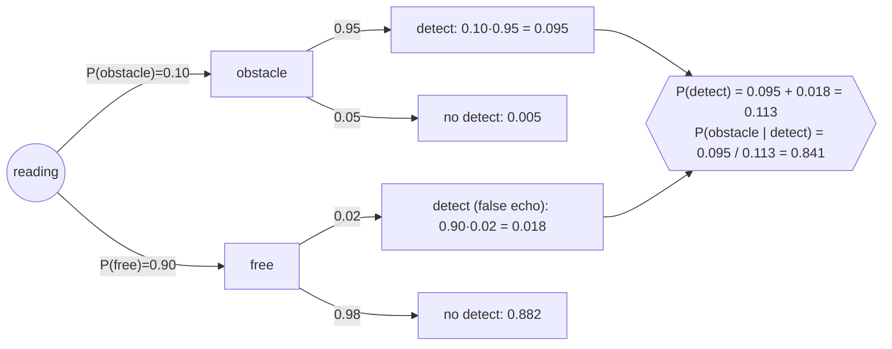

# FM.13 — Probability from zero

<!-- glance:start -->
<!-- generated by tools/build.py from curriculum/syllabus.yaml — edit the syllabus, not this block -->

| | |
|---|---|
| **Track** | Optional foundation |
| **Difficulty** | Beginner |
| **Time** | 50 min |
| **Hardware** | none |
| **Software** | python, numpy |
| **Prerequisites** | none |
| **Skip if** | You are comfortable with conditional probability. |

<!-- glance:end -->

## What you will learn

- Say what a probability, an event and a random variable are, in terms of what a robot's sensor log contains.
- Combine probabilities with the sum rule, the product rule and the complement ("at least one…").
- Estimate a conditional probability from logged data and tell $P(A \mid B)$ apart from $P(B \mid A)$.
- Test whether two sensor failures are independent, and see what happens to your math when they are not.
- Check any probability calculation with a ten-line Monte Carlo simulation in numpy.

## Why it matters

A robot never *knows* where it is or what is in front of it. The ultrasonic sensor sometimes hears an echo that isn't there, the wheel slips on a tile joint, the camera is blinded by the low sun through the window. Every modern robotics algorithm you will meet in this course treats that uncertainty explicitly, with probability: localization keeps a *belief* instead of a position ([10.01](../../10-localization/10.01-what-is-localization.md)), the Bayes filter updates that belief with evidence ([10.03](../../10-localization/10.03-bayes-filter.md)), the Kalman filters ([10.04](../../10-localization/10.04-kalman-filter-1d.md)–[10.06](../../10-localization/10.06-extended-kalman-filter.md)) and particle filters ([10.08](../../10-localization/10.08-particle-filter-mcl.md)) are probability machines, and reinforcement learning's exploration ([17.02](../../17-reinforcement-learning/17.02-value-exploration.md)) is built on expected values.

This lesson is the vocabulary for all of that. It is also directly practical: when you characterize a sensor in [07.01](../../07-sensors/07.01-sensor-fundamentals.md) you will be estimating probabilities from logs, and when you decide whether two sensors give you redundancy you are asking an independence question. The next lessons build on this one: distributions and Gaussians ([FM.14](FM.14-distributions-gaussians-noise.md)) and Bayes' rule ([FM.16](FM.16-bayes-rule.md)).

<!-- prereqs:start -->
## Prerequisites

None — you can start here.

### Optional prerequisite links

None.

Check your readiness: `python course.py why FM.13`
<!-- prereqs:end -->

## Concept

Think about the front range sensor on karmel, the course robot. Every 50 ms it reports either "obstacle within 30 cm" or "clear". You log a million readings while driving around your apartment, and you also record (from an overhead camera, say) whether an obstacle was *really* there.

**Probability as long-run frequency.** If 2 out of every 100 readings in free space say "obstacle", the probability of a false echo is 0.02. Probability is a number between 0 (never) and 1 (always) that says how often something happens if you repeat the situation many times. The more readings you log, the closer the observed fraction gets to the true value. That is the *law of large numbers*, and it is why you can measure probabilities from data at all.

**Probability as degree of belief.** "There is a 70% chance the robot is in the kitchen" is not about repeating anything — the robot is in exactly one room. Here probability measures *how sure you are*. Robotics uses both readings, and the same rules apply to both. Localization is entirely the second kind: a belief that gets sharper as evidence arrives.

**Events and random variables.** An *event* is a yes/no statement about the outcome: "the sensor reports an obstacle", "the wheel slipped". A *random variable* is a number whose value depends on chance: "the number of false echoes in the next 10 readings", "the measured distance in meters". Events are like booleans in your log; random variables are like numeric columns.

**Conditional probability** is the probability of something *given that you already know* something else. It is a `WHERE` clause. "Of all readings where an obstacle really was there, what fraction did the sensor detect?" is $P(\text{detect} \mid \text{obstacle})$ — filter the log to rows with an obstacle, then count detections. Swapping the two sides gives a *different* query with a different answer: "of all readings where the sensor said obstacle, how many really had one?" That second number is what the robot needs when deciding whether to brake, and confusing the two is the most common probability mistake in engineering.

**Independence** means knowing one thing tells you nothing about the other. Two sensors from different physical principles (ultrasonic and bump switch) fail roughly independently. Two cameras facing the same window do not: when the low sun blinds one, it blinds the other. Redundancy only buys you safety when failures are independent — the same lesson you know from distributed systems, where two replicas in the same rack are not really two replicas.

> [!TIP]
> **Ask your teacher:** "Give me three robotics examples where $P(A \mid B)$ and $P(B \mid A)$ are very different, and explain which one the robot actually needs."

## Technical explanation

### Level 1 — The objects

- **Sample space** $\Omega$: every possible outcome. For one sensor reading with ground truth: {(obstacle, detect), (obstacle, no detect), (free, detect), (free, no detect)}.
- **Event** $A$: a subset of outcomes, e.g. "detect" = {(obstacle, detect), (free, detect)}.
- **Probability** $P(A)$: a number in $[0, 1]$ with $P(\Omega) = 1$.
- **Random variable** $X$: a function from outcomes to numbers. *Discrete* ones take countable values (number of false echoes: 0, 1, 2, …); *continuous* ones take any real value (measured range in meters). [FM.14](FM.14-distributions-gaussians-noise.md) handles continuous ones.

### Level 2 — The rules you actually use

**Complement.** $P(\text{not } A) = 1 - P(A)$.

**Sum rule for mutually exclusive events** (they cannot both happen): $P(A \text{ or } B) = P(A) + P(B)$. In general, $P(A \text{ or } B) = P(A) + P(B) - P(A \text{ and } B)$, subtracting the overlap you counted twice.

**Conditional probability.**

$$P(A \mid B) = \frac{P(A \text{ and } B)}{P(B)}, \qquad P(B) > 0$$

**Product rule** (the same equation rearranged):

$$P(A \text{ and } B) = P(A \mid B)\,P(B) = P(B \mid A)\,P(A)$$

**Independence.** $A$ and $B$ are independent exactly when

$$P(A \text{ and } B) = P(A)\,P(B) \quad\Longleftrightarrow\quad P(A \mid B) = P(A)$$

**Law of total probability.** If the world is in exactly one of the states $B_1, \dots, B_n$:

$$P(A) = \sum_i P(A \mid B_i)\,P(B_i)$$

This one looks innocent, but it is the *prediction step* of every Bayes filter you will write: "probability I'm in cell 5 now = sum over where I was before × probability of moving from there to cell 5".

**Numerical example — the sensor model.** Suppose, for karmel's range sensor in your apartment:

| Quantity | Value |
|---|---|
| $P(\text{obstacle})$ | 0.10 |
| $P(\text{detect} \mid \text{obstacle})$ | 0.95 |
| $P(\text{detect} \mid \text{free})$ (false echo) | 0.02 |

Total probability of a detection:

$$P(\text{detect}) = 0.95 \cdot 0.10 + 0.02 \cdot 0.90 = 0.095 + 0.018 = 0.113$$

Probability an obstacle is really there *given* the sensor says so:

$$P(\text{obstacle} \mid \text{detect}) = \frac{P(\text{detect} \mid \text{obstacle})P(\text{obstacle})}{P(\text{detect})} = \frac{0.095}{0.113} = 0.841$$

So a sensor that detects 95% of obstacles is right only 84% of the times it fires, because free space is nine times more common than obstacles. You just derived Bayes' rule; [FM.16](FM.16-bayes-rule.md) makes it a tool.

### Level 3 — Repeated trials and "at least one"

For $k$ independent readings, each with false-echo probability $p$:

$$P(\text{no false echo in } k) = (1-p)^k, \qquad P(\text{at least one}) = 1 - (1-p)^k$$

**Numerical example.** $p = 0.02$, $k = 10$ readings (half a second at 20 Hz): $1 - 0.98^{10} = 1 - 0.8171 = 0.183$. A 2% false-echo rate produces a phantom obstacle in about 18% of half-second windows. That is why a robot that brakes on any single reading stutters, and why [07.01](../../07-sensors/07.01-sensor-fundamentals.md) filters readings.

**Random variables and expected value.** Let $X$ = number of false echoes in those 10 readings. Its *probability mass function* (PMF) lists $P(X = x)$ for every $x$:

$$P(X = x) = \binom{k}{x} p^x (1-p)^{k-x}$$

(the binomial distribution: choose which $x$ readings are the bad ones, multiply the independent probabilities). The *expected value* is the probability-weighted average:

$$E[X] = \sum_x x\,P(X = x) = k\,p$$

**Numerical example.** $P(X=0) = 0.8171$, $P(X=1) = 10 \cdot 0.02 \cdot 0.98^9 = 0.1667$, $P(X=2) = 0.0153$, and $E[X] = 10 \cdot 0.02 = 0.2$ false echoes per window.

**Majority voting.** Three independent sensors, each correct with probability 0.9. The vote is right when all three are right or exactly two are:

$$0.9^3 + 3 \cdot 0.9^2 \cdot 0.1 = 0.729 + 0.243 = 0.972$$

### Level 4 — When independence is false

Two cameras fail with probability 0.30 each when the sun is low (20% of the time) and 0.01 otherwise. Each camera's overall failure rate (total probability): $0.2 \cdot 0.30 + 0.8 \cdot 0.01 = 0.068$. If you assumed independence, both fail with $0.068^2 = 0.0046$. In reality, *given the sun state* they are independent, so

$$P(\text{both fail}) = 0.2 \cdot 0.30^2 + 0.8 \cdot 0.01^2 = 0.01808$$

— 3.9 times more than the independence assumption predicts. The shared cause (sun) makes them *correlated*, even though neither camera "knows" about the other. The fix in the math is to condition on the common cause; the fix in the robot is diverse sensors (a LiDAR doesn't care about the sun the way a camera does).

## Diagram

A probability tree for the range sensor: multiply along branches (product rule), add leaves that belong to the same event (sum rule / total probability).



The four leaves sum to 1.000, which is a quick sanity check on any tree you draw.

## Code

Save as `fm13_probability.py` anywhere and run `python fm13_probability.py` (needs only numpy). It checks every number in the technical explanation by simulation — the habit to keep: *if you are unsure of a probability, simulate it*.

```python
"""fm13_probability.py — probability experiments for a robot's range sensor.

Run:  python fm13_probability.py
Needs: numpy
"""
from __future__ import annotations

from dataclasses import dataclass

import numpy as np


@dataclass(frozen=True)
class RangeSensorModel:
    p_obstacle: float = 0.10          # P(an obstacle is really in front)
    p_detect_given_obst: float = 0.95  # P(sensor says "obstacle" | obstacle)
    p_detect_given_free: float = 0.02  # P(sensor says "obstacle" | free)  (false echo)


def law_of_large_numbers(rng: np.random.Generator, p: float = 0.02) -> None:
    print("1) Frequency of false echoes converges to p =", p)
    for n in (10, 100, 1_000, 10_000, 1_000_000):
        echoes = rng.random(n) < p          # True where a false echo happened
        print(f"   n={n:>9,d}  frequency={echoes.mean():.4f}")


def at_least_one(rng: np.random.Generator, p: float = 0.02, k: int = 10, trials: int = 200_000) -> None:
    analytic = 1 - (1 - p) ** k
    sims = (rng.random((trials, k)) < p).any(axis=1).mean()
    print(f"2) P(at least one false echo in {k} readings): analytic={analytic:.4f}  simulated={sims:.4f}")


def number_of_echoes_pmf(rng: np.random.Generator, p: float = 0.02, k: int = 10, trials: int = 200_000) -> None:
    counts = (rng.random((trials, k)) < p).sum(axis=1)   # random variable X = echoes per 10 readings
    print(f"3) Random variable X = false echoes in {k} readings")
    for x in range(4):
        print(f"   P(X={x}) simulated={np.mean(counts == x):.4f}")
    print(f"   E[X] simulated={counts.mean():.4f}  analytic k*p={k * p:.4f}")


def conditional_from_log(rng: np.random.Generator, m: RangeSensorModel, n: int = 100_000) -> None:
    obstacle = rng.random(n) < m.p_obstacle
    p_detect = np.where(obstacle, m.p_detect_given_obst, m.p_detect_given_free)
    detect = rng.random(n) < p_detect
    both = np.sum(obstacle & detect)
    print("4) Conditional probabilities estimated from a simulated log of", n, "readings")
    print(f"   P(detect | obstacle) = {both / obstacle.sum():.4f}   (model: {m.p_detect_given_obst})")
    print(f"   P(obstacle | detect) = {both / detect.sum():.4f}   (not the same thing!)")
    exact = (m.p_obstacle * m.p_detect_given_obst) / (
        m.p_obstacle * m.p_detect_given_obst + (1 - m.p_obstacle) * m.p_detect_given_free)
    print(f"   exact P(obstacle | detect) = {exact:.4f}")


def independence(rng: np.random.Generator, n: int = 1_000_000) -> None:
    # Two sensors. Case A: truly independent failures. Case B: common cause (low sun blinds both).
    fail_a = rng.random(n) < 0.068
    fail_b = rng.random(n) < 0.068
    print("5) Independence check: compare P(A and B) with P(A)P(B)")
    print(f"   independent:  P(A)P(B)={fail_a.mean() * fail_b.mean():.5f}  P(A and B)={np.mean(fail_a & fail_b):.5f}")
    sun = rng.random(n) < 0.2
    p_fail = np.where(sun, 0.30, 0.01)
    fail_a = rng.random(n) < p_fail
    fail_b = rng.random(n) < p_fail
    pa, pb, pab = fail_a.mean(), fail_b.mean(), np.mean(fail_a & fail_b)
    print(f"   common cause: P(A)={pa:.4f} P(B)={pb:.4f} P(A)P(B)={pa * pb:.5f}  P(A and B)={pab:.5f}  ratio={pab / (pa * pb):.2f}")


def majority_vote(rng: np.random.Generator, p_correct: float = 0.9, n: int = 1_000_000) -> None:
    correct = rng.random((n, 3)) < p_correct
    analytic = p_correct**3 + 3 * p_correct**2 * (1 - p_correct)
    print(f"6) Majority of 3 independent sensors (each {p_correct}): analytic={analytic:.4f} simulated={np.mean(correct.sum(axis=1) >= 2):.4f}")


def main() -> None:
    rng = np.random.default_rng(seed=13)
    law_of_large_numbers(rng)
    at_least_one(rng)
    number_of_echoes_pmf(rng)
    conditional_from_log(rng, RangeSensorModel())
    independence(rng)
    majority_vote(rng)


if __name__ == "__main__":
    main()
```

Output (numpy 2.x, seed 13; exact digits of simulated values may differ slightly on other numpy versions, analytic values never do):

```text
1) Frequency of false echoes converges to p = 0.02
   n=       10  frequency=0.1000
   n=      100  frequency=0.0100
   n=    1,000  frequency=0.0240
   n=   10,000  frequency=0.0199
   n=1,000,000  frequency=0.0200
2) P(at least one false echo in 10 readings): analytic=0.1829  simulated=0.1823
3) Random variable X = false echoes in 10 readings
   P(X=0) simulated=0.8189
   P(X=1) simulated=0.1651
   P(X=2) simulated=0.0150
   P(X=3) simulated=0.0009
   E[X] simulated=0.1981  analytic k*p=0.2000
4) Conditional probabilities estimated from a simulated log of 100000 readings
   P(detect | obstacle) = 0.9518   (model: 0.95)
   P(obstacle | detect) = 0.8403   (not the same thing!)
   exact P(obstacle | detect) = 0.8407
5) Independence check: compare P(A and B) with P(A)P(B)
   independent:  P(A)P(B)=0.00459  P(A and B)=0.00460
   common cause: P(A)=0.0679 P(B)=0.0680 P(A)P(B)=0.00462  P(A and B)=0.01806  ratio=3.91
6) Majority of 3 independent sensors (each 0.9): analytic=0.9720 simulated=0.9720
```

Look at line 1: with 10 readings the estimate is 0.10 (five times too high), with 100 it is 0.01 (half). Small logs lie. [FM.21](FM.21-statistics-for-experiments.md) teaches how to put error bars on such estimates.

## Exercise

All exercises need hardware: **none**.

### Exercise FM.13-E1 — Encoder dropouts over a test day `[numerical]`

Goal: use the complement rule and expected value.
An encoder cable on karmel has a loose crimp: in each 2-minute test run there is an independent 1% chance of a dropout. You do 50 runs. By hand (or a calculator), compute (a) the probability that no run has a dropout, (b) the probability of at least one dropout, (c) the expected number of dropouts. Give 3 decimals.

### Exercise FM.13-E2 — Conditional probabilities from a log table `[numerical]`

Goal: read conditional probabilities out of counts, with the right denominator.
You logged 1,000 readings with ground truth:

| | sensor: detect | sensor: no detect |
|---|---|---|
| obstacle really there | 76 | 4 |
| free | 46 | 874 |

Compute $P(\text{obstacle})$, $P(\text{detect} \mid \text{obstacle})$, $P(\text{detect} \mid \text{free})$, $P(\text{obstacle} \mid \text{detect})$. Then check independence: is $P(\text{obstacle and detect}) = P(\text{obstacle})\,P(\text{detect})$?

### Exercise FM.13-E3 — Two sensors or three? `[predict]`

Goal: build intuition about redundancy.
Before computing anything, write down your guess: which is more likely to be right about "obstacle or not" — (a) one sensor that is right 95% of the time, or (b) a majority vote of three independent sensors each right 90% of the time? Then compute both. Finally predict (don't compute yet) whether (b) still wins if all three sensors are cameras facing the same sunny window.

### Exercise FM.13-E4 — An independence checker `[coding]`

Goal: detect hidden common causes in logged data.
Write `independence_ratio(a: np.ndarray, b: np.ndarray) -> float` returning $P(A \text{ and } B) / (P(A)P(B))$ for two boolean arrays. Test it on (1) two independent boolean arrays with $p = 0.068$ each, one million samples, and (2) the sun-blinded cameras from Level 4 (sun with probability 0.2; failure probability 0.30 in sun, 0.01 otherwise). Use `np.random.default_rng(seed=4)`.

### Exercise FM.13-E5 — The braking bug `[debugging]`

Goal: spot the wrong denominator.
A teammate wrote this to decide how much to trust a detection before an emergency stop:

```python
def trust_in_detection(obstacle: np.ndarray, detect: np.ndarray) -> float:
    """P(obstacle really there | sensor says obstacle)."""
    return np.sum(obstacle & detect) / np.sum(obstacle)
```

On the log from E2 it returns a reassuring number. What does it return, what does it actually compute, what is the correct value, and what is the one-token fix?

## Expected result

- **FM.13-E1:** (a) $0.99^{50} = 0.605$; (b) $1 - 0.605 = 0.395$; (c) $50 \cdot 0.01 = 0.500$ dropouts. A "1% problem" shows up on 40% of test days.
- **FM.13-E2:** $P(\text{obstacle}) = 80/1000 = 0.080$; $P(\text{detect} \mid \text{obstacle}) = 76/80 = 0.950$; $P(\text{detect} \mid \text{free}) = 46/920 = 0.050$; $P(\text{obstacle} \mid \text{detect}) = 76/122 = 0.623$. Not independent: $P(\text{obstacle and detect}) = 0.076$ but $0.080 \cdot 0.122 = 0.00976$ — the ratio is 7.8, as it should be for a sensor that works (a sensor independent of reality is useless).
- **FM.13-E3:** (a) 0.950; (b) $0.9^3 + 3 \cdot 0.9^2 \cdot 0.1 = 0.972$, so three mediocre independent sensors beat one good one. With a common cause (same window) the failures are correlated, all three tend to fail together, and the vote can easily be worse than 0.95 — the 0.972 formula no longer applies.
- **FM.13-E4:** case (1) ratio within 0.97–1.03; case (2) ratio 3.9 ± 0.15 (exact value $0.01808/0.068^2 = 3.91$).
- **FM.13-E5:** it returns $76/80 = 0.95$, which is $P(\text{detect} \mid \text{obstacle})$ — the detection rate. The correct value is $76/122 = 0.623$. Fix: divide by `np.sum(detect)` instead of `np.sum(obstacle)`.

## Troubleshooting

### Symptom: your simulated probability disagrees with your formula

1. Is the difference within sampling noise? For an estimate from $n$ trials, the typical error is about $\sqrt{p(1-p)/n}$. For $p = 0.18$, $n = 200{,}000$ that is 0.0009, so 0.1823 vs 0.1829 is fine. Increase $n$ tenfold: the gap should shrink by about $\sqrt{10} \approx 3$.
2. If the gap stays large, check the denominator of every conditional probability: what are you filtering on?
3. Check the independence assumption in your formula. Did the simulation draw both events from one shared random variable (a common cause)? Then multiplying probabilities is wrong.
4. Check boolean logic in numpy: use `&`, `|`, `~` on arrays, not `and`, `or`, `not`, and parenthesize comparisons: `(x < p) & (y < q)`.

### Symptom: probabilities that sum to more than 1

1. List the outcomes you added. Are they mutually exclusive? If two events can happen together, subtract $P(A \text{ and } B)$.
2. For a tree, only the leaves sum to 1; adding a branch probability and a leaf under it double-counts.

### Symptom: an estimate that is exactly 0 or 1

You probably have too few samples for a rare event (zero false echoes in 30 readings does not mean $p = 0$). Log more, or report "fewer than about 3/n" — the rule of three from [FM.21](FM.21-statistics-for-experiments.md) territory.

## Common mistakes

- **Swapping the conditional.** $P(\text{detect} \mid \text{obstacle}) = 0.95$ does not mean a detection is 95% trustworthy. Always say out loud which side is "given".
- **Multiplying probabilities of correlated failures.** Two sensors on the same power rail, same cable harness or same field of view share causes. Multiply only after you've argued independence.
- **Adding probabilities of overlapping events.** "Left encoder fails (5%) or right encoder fails (5%) = 10%" is only approximately right; exactly it is $1 - 0.95^2 = 9.75\%$ when independent.
- **Trusting small logs.** Ten readings with one false echo is not "10% false echoes". See line 1 of the program output.
- **Using Python `and`/`or` on numpy arrays.** It raises `ValueError: The truth value of an array… is ambiguous`. Use `&` / `|`.

## Knowledge check

1. What is the difference between an event and a random variable? Give a robot example of each.
   <details><summary>Answer</summary>

   An event is a yes/no statement about the outcome ("the bump switch is pressed"); it has a probability. A random variable is a number that depends on chance ("measured range in meters", "number of wheel slips in a run"); it has a distribution. In a log, events are boolean columns and random variables are numeric columns.
   </details>

2. A LiDAR scan has 360 beams, each with an independent 0.1% chance of a spurious return. What is the probability that a scan contains at least one spurious return?
   <details><summary>Answer</summary>

   $1 - 0.999^{360} = 1 - 0.6976 = 0.302$. About 30% of scans contain a phantom point, which is why scan processing always filters isolated points.
   </details>

3. $P(\text{wheel slip} \mid \text{wet floor}) = 0.4$, $P(\text{wet floor}) = 0.05$, $P(\text{wheel slip} \mid \text{dry floor}) = 0.02$. What is $P(\text{wheel slip})$?
   <details><summary>Answer</summary>

   Law of total probability: $0.4 \cdot 0.05 + 0.02 \cdot 0.95 = 0.020 + 0.019 = 0.039$.
   </details>

4. Using the numbers from question 3, what is $P(\text{wet floor} \mid \text{wheel slip})$?
   <details><summary>Answer</summary>

   $P(\text{wet and slip}) / P(\text{slip}) = 0.020 / 0.039 = 0.513$. A slip makes "wet floor" about ten times more likely than the 5% prior. This is Bayes' rule, covered in [FM.16](FM.16-bayes-rule.md).
   </details>

5. Predict: you run the false-echo simulation with $n = 50$ readings instead of $n = 1{,}000{,}000$, ten times with different seeds. What do you expect the ten estimates of $p = 0.02$ to look like?
   <details><summary>Answer</summary>

   They jump around a lot: typical error $\sqrt{0.02 \cdot 0.98/50} \approx 0.02$, as big as $p$ itself. Many runs give 0.00 (no echoes at all), some give 0.04 or 0.06. Small samples cannot pin down rare-event probabilities.
   </details>

6. Debugging: two ultrasonic sensors mounted side by side each have 5% false echoes. Your safety analysis says "both false at once: 0.25%". In testing it happens 3% of the time. What is the likely explanation?
   <details><summary>Answer</summary>

   The failures are not independent. Side-by-side ultrasonic sensors share causes: they can hear each other's pings (crosstalk), and they see the same soft or angled surfaces. $P(A \text{ and } B) = 0.03$ is 12× $P(A)P(B)$. Fire them alternately and re-measure the joint rate instead of assuming it.
   </details>

7. Why does a Bayes filter need the law of total probability?
   <details><summary>Answer</summary>

   To predict where the robot is after moving: the probability of being in a cell now is the sum, over every cell it might have been in, of (probability it was there) × (probability the motion took it here). That is exactly $P(A) = \sum_i P(A \mid B_i)P(B_i)$. See [10.03](../../10-localization/10.03-bayes-filter.md).
   </details>

## Practical challenge

Write a simulation of a "stop if obstacle" rule for karmel using the sensor model from Level 2 (obstacle 10%, detection 95%, false echo 2%, readings independent given the truth). Compare three braking rules over 100,000 simulated half-second windows (10 readings each, the truth stays constant within a window): (a) brake if **any** reading says obstacle, (b) brake if **at least 3 of 10** say obstacle, (c) brake if **all 10** do.

Acceptance criteria:
- For each rule, report $P(\text{brake} \mid \text{free})$ (phantom stops) and $P(\text{no brake} \mid \text{obstacle})$ (missed obstacles), both from simulation and from the binomial formula; simulation and formula agree within 0.005.
- Rule (a) should give about 18% phantom stops; you can explain why rule (b) has both numbers far below 1%.
- A short paragraph: which rule would you ship on a robot that drives at 0.3 m/s in a home, and why.

## You can skip this if…

You answer knowledge-check questions 3, 4 and 6 correctly without looking, and you can explain in one sentence why $P(A \mid B) \neq P(B \mid A)$ in general. Then:

`python course.py skip FM.13 --reason "comfortable with conditional probability and independence"`

## Go deeper

- https://seeing-theory.brown.edu/ — Seeing Theory (Brown University): interactive visual chapters on basic probability, compound probability and conditional probability. Best 30 minutes to cement this lesson.
- https://www.khanacademy.org/math/statistics-probability/probability-library — Khan Academy probability: many small practice problems if you want drill.
- https://www.3blue1brown.com/topics/probability — 3Blue1Brown's probability lessons: geometric intuition for conditional probability and Bayes.
- https://mitpress.mit.edu/9780262201629/probabilistic-robotics/ — Thrun, Burgard, Fox, *Probabilistic Robotics*, chapter 2: the probability review every robotics engineer uses as the reference.
- https://github.com/rlabbe/Kalman-and-Bayesian-Filters-in-Python — Labbe's free Jupyter book; its first chapters build probability intuition with code before filters.

## Progress checkpoint

- [ ] I can define events, random variables and probability using a sensor log as the example.
- [ ] I can compute "at least one" probabilities and expected counts for repeated independent readings.
- [ ] I can estimate $P(A \mid B)$ from a table of counts and never confuse it with $P(B \mid A)$.
- [ ] I can test independence from data and explain why common causes break redundancy.
- [ ] I can verify a probability calculation with a Monte Carlo simulation.

`python course.py complete FM.13` (exercises done) · `python course.py master FM.13` (challenge done) · `python course.py struggle FM.13 "what was hard"`

Next: [FM.14 — Distributions, Gaussians, uncertainty and noise](FM.14-distributions-gaussians-noise.md).
