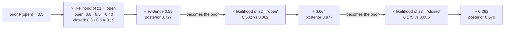

# FM.16 — Bayes' rule — updating beliefs with evidence

<!-- glance:start -->
<!-- generated by tools/build.py from curriculum/syllabus.yaml — edit the syllabus, not this block -->

| | |
|---|---|
| **Track** | Optional foundation |
| **Difficulty** | Intermediate |
| **Time** | 50 min |
| **Hardware** | none |
| **Software** | python, numpy |
| **Prerequisites** | [FM.13 Probability from zero](FM.13-probability-basics.md) |
| **Skip if** | You apply Bayes' rule to sensor updates. |

<!-- glance:end -->

## What you will learn

- Name the four parts of Bayes' rule — prior, likelihood, evidence, posterior — and compute each for a robot sensor.
- Update a belief sequentially as readings arrive, and verify the result with a Monte Carlo simulation.
- Use the log-odds form, where each reading *adds* a number, and clamp it so the robot can change its mind.
- Recognize the base-rate effect: why a 99%-accurate cliff alarm is usually a false alarm.
- Apply Bayes' rule to many hypotheses (which cell am I in?) and to continuous Gaussians (the seed of the Kalman filter).

## Why it matters

karmel's camera classifier looks at a doorway and says "open". Is the door open? The classifier is right 80% of the time on open doors but also says "open" 30% of the time on closed ones (a dark corridor behind a glass door fools it). One reading is weak evidence. Three readings — open, open, closed — are better evidence, but how much better, and what should the robot believe now?

Bayes' rule is the exact answer to "how should evidence change what I believe?", and it is the engine of probabilistic robotics. The Bayes filter ([10.03](../../10-localization/10.03-bayes-filter.md)) is Bayes' rule applied every time a sensor reading arrives. The Kalman filter ([10.04](../../10-localization/10.04-kalman-filter-1d.md)–[10.06](../../10-localization/10.06-extended-kalman-filter.md)) is Bayes' rule when everything is Gaussian. Particle filters ([10.08](../../10-localization/10.08-particle-filter-mcl.md)) weight particles by the likelihood. Occupancy grid mapping ([11.02](../../11-slam/11.02-occupancy-grid-mapping.md)) is Bayes' rule in log-odds, once per grid cell. You need conditional probability from [FM.13](FM.13-probability-basics.md).

<!-- prereqs:start -->
## Prerequisites

You need these first:

- [FM.13 Probability from zero](FM.13-probability-basics.md)

### Optional prerequisite links

None.

Check your readiness: `python course.py why FM.16`
<!-- prereqs:end -->

## Concept

Before looking, the robot already has an opinion: half the doors in this apartment are usually open. That opinion is the **prior**.

Then a reading arrives: "open". The question Bayes asks is not "how often is the sensor right?" but "**how much more likely is this reading if the door is open than if it is closed?**" The sensor says "open" 80% of the time for open doors and 30% for closed ones. So "open" is 0.8/0.3 = 2.67 times more likely coming from an open door. That ratio of **likelihoods** is the strength of the evidence.

Bayes' rule says: **new belief ∝ likelihood × old belief**, then rescale so the probabilities of all possibilities add up to 1. That rescaling divides by the **evidence**, the total probability of seeing that reading at all. The result is the **posterior**, which becomes the prior for the next reading.

A few consequences you should feel before seeing any formula:

- **Weak sensors still help, if you have many readings.** Each reading multiplies the odds by 2.67 or by 0.29. Five agreeing readings multiply by 2.67⁵ ≈ 134.
- **Rare things stay rare unless evidence is strong.** If only 1 in 1,000 floor edges is a real cliff, an alarm that is wrong 1% of the time will cry wolf about 10 times for every real cliff.
- **Certainty is a trap.** A prior of exactly 0 or 1 multiplies every future likelihood by 0 or keeps it at 1 — the robot can never change its mind. Real systems clamp beliefs away from 0 and 1.
- **A useless sensor changes nothing.** If a reading is equally likely either way, the likelihood ratio is 1 and the posterior equals the prior.

The distributed-systems analogy: the prior is your cached value, each reading is an event with a "trust weight", and the posterior is the cache after applying the event. The log-odds form below literally turns it into an event-sourced running sum.

> [!TIP]
> **Ask your teacher:** "Explain prior, likelihood and posterior using karmel deciding whether it's in the kitchen or the hallway, then show me the same update in log-odds."

## Technical explanation

### Level 1 — The rule

From the product rule, $P(A \text{ and } B) = P(B \mid A)P(A) = P(A \mid B)P(B)$. Divide by $P(B)$:

$$\underbrace{P(x \mid z)}_{\text{posterior}} = \frac{\overbrace{P(z \mid x)}^{\text{likelihood}}\;\overbrace{P(x)}^{\text{prior}}}{\underbrace{P(z)}_{\text{evidence}}}, \qquad P(z) = \sum_{x'} P(z \mid x')\,P(x')$$

Here $x$ is the hidden state (door open or closed, robot's cell, wall distance) and $z$ the measurement. The **likelihood** $P(z \mid x)$ is your *sensor model*: you get it by calibration, "when the door was really open, how often did the classifier say open?". The evidence is just the normalizer, so in practice you compute likelihood × prior for every $x$ and divide by the sum.

The ingredients for the door:

| | door open | door closed |
|---|---|---|
| $P(z = \text{"open"} \mid x)$ | 0.8 | 0.3 |
| $P(z = \text{"closed"} \mid x)$ | 0.2 | 0.7 |
| prior $P(x)$ | 0.5 | 0.5 |

### Level 2 — The door, step by step

**Reading 1: "open".** Unnormalized: open $0.8 \cdot 0.5 = 0.40$, closed $0.3 \cdot 0.5 = 0.15$. Evidence $= 0.55$. Posterior $P(\text{open}) = 0.40/0.55 = 0.7273$.

**Reading 2: "open"** (prior is now 0.7273): open $0.8 \cdot 0.7273 = 0.5818$, closed $0.3 \cdot 0.2727 = 0.0818$. Posterior $= 0.5818/0.6636 = 0.8767$.

**Reading 3: "closed"**: open $0.2 \cdot 0.8767 = 0.1753$, closed $0.7 \cdot 0.1233 = 0.0863$. Posterior $= 0.1753/0.2617 = 0.6702$.

This works only if readings are **conditionally independent given the state**: once you know the door is open, one reading's error doesn't predict the next one's. Three frames from a camera that hasn't moved, looking at the same glare, violate that. Take readings from different viewpoints or spaced in time.

**The frequency check.** What does "0.6702" mean physically? Imagine 2 million doors, half open. Simulate the sensor on all of them. Keep only the doors that produced "open, open, closed". Of those, 67% are open. The code below does exactly that and gets 0.6687 — a good way to convince yourself Bayes' rule isn't a trick.

### Level 3 — Odds, log-odds and the base rate

Divide Bayes' rule for "open" by Bayes' rule for "closed": the evidence cancels.

$$\underbrace{\frac{P(\text{open} \mid z)}{P(\text{closed} \mid z)}}_{\text{posterior odds}} = \underbrace{\frac{P(z \mid \text{open})}{P(z \mid \text{closed})}}_{\text{likelihood ratio}} \cdot \underbrace{\frac{P(\text{open})}{P(\text{closed})}}_{\text{prior odds}}$$

Take logs. With $l = \ln\frac{p}{1-p}$ (the **log-odds**), each reading **adds** its log-likelihood ratio:

$$l_t = l_{t-1} + \ln\frac{P(z_t \mid \text{open})}{P(z_t \mid \text{closed})}, \qquad p = \frac{1}{1 + e^{-l}}$$

**Numerical example.** $\ln(0.8/0.3) = +0.9808$ for "open", $\ln(0.2/0.7) = -1.2528$ for "closed". Start at $l = 0$ ($p = 0.5$). Open, open, closed: $0 + 0.9808 + 0.9808 - 1.2528 = 0.7089$, and $1/(1+e^{-0.7089}) = 0.6702$. Same answer, no division, numerically stable near 0 and 1, and a single float per hypothesis. That is why occupancy grids ([11.02](../../11-slam/11.02-occupancy-grid-mapping.md)) store log-odds per cell, and why the "logits" in a neural network classifier are log-odds too.

**Clamping.** If you let $l$ grow without bound, a cell that was "occupied" for 20 scans needs 20 contrary scans to flip. Clamping $l$ to e.g. $[-3.5, 3.5]$ ($p \in [0.029, 0.971]$) keeps the map responsive when a door closes or a chair moves.

**Base rate.** A cliff sensor: $P(\text{cliff}) = 0.001$, $P(\text{alarm} \mid \text{cliff}) = 0.99$, $P(\text{alarm} \mid \text{no cliff}) = 0.01$.

$$P(\text{cliff} \mid \text{alarm}) = \frac{0.99 \cdot 0.001}{0.99 \cdot 0.001 + 0.01 \cdot 0.999} = \frac{0.00099}{0.01098} = 0.0902$$

Only 9% of alarms are real cliffs. A second *independent* alarm (a different sensor) raises it to 0.9075. Engineering conclusion: for safety, still stop on the first alarm (the cost of falling down stairs is much higher than a pause), but don't log every alarm as "cliff detected" — that's a decision problem layered on top of the probability, not a different probability.

### Level 4 — Many hypotheses and continuous states

**Discrete: which cell?** karmel is in one of 5 hallway cells, uniform prior 0.2 each. There are doors at cells 1 and 3. It sees a door; the likelihood is 0.8 at door cells, 0.3 elsewhere. Unnormalized: $[0.06, 0.16, 0.06, 0.16, 0.06]$, sum 0.50, posterior $[0.12, 0.32, 0.12, 0.32, 0.12]$. The belief now has two peaks — Bayes' rule is happy with ambiguity that a single "best guess" can't represent. Adding motion between readings (the law of total probability from [FM.13](FM.13-probability-basics.md)) turns this into the histogram filter of [10.03](../../10-localization/10.03-bayes-filter.md).

**Continuous: two Gaussians.** Prior from the map and odometry: the wall is $\mathcal{N}(2.0, 0.3^2)$ m ahead. The range sensor reads 2.2 m with σ = 0.1 m, so the likelihood is $\propto \exp(-\frac{(2.2-x)^2}{2\cdot0.1^2})$. Multiplying two Gaussians in $x$ gives a Gaussian with

$$\frac{1}{\sigma_\text{post}^2} = \frac{1}{\sigma_\text{prior}^2} + \frac{1}{\sigma_z^2}, \qquad \mu_\text{post} = \sigma_\text{post}^2\left(\frac{\mu_\text{prior}}{\sigma_\text{prior}^2} + \frac{z}{\sigma_z^2}\right)$$

**Numerical example.** $1/\sigma^2 = 1/0.09 + 1/0.01 = 11.11 + 100 = 111.1$, so $\sigma_\text{post} = 0.0949$ m. $\mu_\text{post} = 0.009 \cdot (22.22 + 220) = 2.180$ m. The posterior lies closer to the precise measurement and is more certain than either source alone. Information (1/variance) adds. The code confirms this by multiplying the two curves on a 20,001-point grid. This two-line update, rewritten with a "gain", *is* the 1D Kalman filter of [10.04](../../10-localization/10.04-kalman-filter-1d.md).

## Diagram



The same chain in log-odds is a running sum: `0 → +0.981 → +1.962 → +0.709`.

## Code

Save as `fm16_bayes.py` and run `python fm16_bayes.py` (numpy only; `np.trapezoid` needs numpy ≥ 2.0). Every analytic result is checked either by simulation or by brute-force numerical integration.

```python
"""fm16_bayes.py — Bayes' rule for "is the door open?", verified by simulation.

Run:  python fm16_bayes.py
Needs: numpy
"""
from __future__ import annotations

import math
from dataclasses import dataclass

import numpy as np


@dataclass(frozen=True)
class DoorSensor:
    """Likelihoods P(z | state). z is what the camera classifier reports."""
    p_z_open_given_open: float = 0.8
    p_z_open_given_closed: float = 0.3

    def likelihood(self, z_open: bool, door_open: bool) -> float:
        p = self.p_z_open_given_open if door_open else self.p_z_open_given_closed
        return p if z_open else 1.0 - p


def bayes_update(prior_open: float, z_open: bool, sensor: DoorSensor) -> float:
    unnorm_open = sensor.likelihood(z_open, True) * prior_open
    unnorm_closed = sensor.likelihood(z_open, False) * (1.0 - prior_open)
    evidence = unnorm_open + unnorm_closed            # P(z), the normalizer
    return unnorm_open / evidence


def log_odds(p: float) -> float:
    return math.log(p / (1.0 - p))


def prob(l: float) -> float:
    return 1.0 / (1.0 + math.exp(-l))


def simulate_posterior(prior_open: float, readings: list[bool], sensor: DoorSensor,
                       n: int, rng: np.random.Generator) -> float:
    """Frequency interpretation: generate many worlds, keep those that produced these readings."""
    door_open = rng.random(n) < prior_open
    keep = np.ones(n, dtype=bool)
    for z in readings:
        p_z_open = np.where(door_open, sensor.p_z_open_given_open, sensor.p_z_open_given_closed)
        z_sim = rng.random(n) < p_z_open
        keep &= z_sim == z
    return door_open[keep].mean()


def main() -> None:
    rng = np.random.default_rng(seed=16)
    sensor = DoorSensor()
    readings = [True, True, False]  # "open", "open", "closed"

    print("1) Sequential Bayes updates, prior P(open)=0.5")
    belief = 0.5
    for i, z in enumerate(readings, start=1):
        belief = bayes_update(belief, z, sensor)
        sim = simulate_posterior(0.5, readings[:i], sensor, 2_000_000, rng)
        print(f"   after z{i}={'open  ' if z else 'closed'}: P(open)={belief:.4f}   simulated={sim:.4f}")

    print("2) Same thing in log-odds: add log-likelihood ratios")
    llr_open = math.log(sensor.p_z_open_given_open / sensor.p_z_open_given_closed)
    llr_closed = math.log((1 - sensor.p_z_open_given_open) / (1 - sensor.p_z_open_given_closed))
    l = log_odds(0.5)
    for z in readings:
        l += llr_open if z else llr_closed
        print(f"   l={l:+.4f}  ->  P(open)={prob(l):.4f}")
    print(f"   LLR(z=open)={llr_open:+.4f}  LLR(z=closed)={llr_closed:+.4f}")

    print("3) Base rate: cliff detector, P(cliff)=0.001, P(alarm|cliff)=0.99, P(alarm|no cliff)=0.01")
    p_cliff = 0.001
    for k in (1, 2):
        p_cliff = 0.99 * p_cliff / (0.99 * p_cliff + 0.01 * (1 - p_cliff))
        print(f"   after {k} independent alarm(s): P(cliff | alarms)={p_cliff:.4f}")

    print("4) More than two hypotheses: which of 5 hallway cells? (doors at cells 1 and 3)")
    doors = np.array([0, 1, 0, 1, 0], dtype=bool)
    prior = np.full(5, 0.2)
    likelihood = np.where(doors, 0.8, 0.3)          # P(z=door seen | cell)
    posterior = likelihood * prior
    posterior /= posterior.sum()
    print("   posterior after seeing a door:", posterior.round(4).tolist())

    print("5) Continuous: Gaussian prior x Gaussian likelihood (range to a wall)")
    x = np.linspace(1.0, 3.0, 20_001)
    prior_pdf = np.exp(-0.5 * ((x - 2.0) / 0.3) ** 2)
    like = np.exp(-0.5 * ((x - 2.2) / 0.1) ** 2)
    post = prior_pdf * like
    post /= np.trapezoid(post, x)
    mean = np.trapezoid(x * post, x)
    std = math.sqrt(np.trapezoid((x - mean) ** 2 * post, x))
    var_formula = 1 / (1 / 0.3**2 + 1 / 0.1**2)
    mean_formula = var_formula * (2.0 / 0.3**2 + 2.2 / 0.1**2)
    print(f"   grid:    mean={mean:.4f} m  std={std:.4f} m")
    print(f"   formula: mean={mean_formula:.4f} m  std={math.sqrt(var_formula):.4f} m")

    print("6) A prior of exactly 1.0 can never change")
    print(f"   bayes_update(1.0, z=closed) = {bayes_update(1.0, False, sensor):.4f}")


if __name__ == "__main__":
    main()
```

Output (numpy 2.x, seed 16):

```text
1) Sequential Bayes updates, prior P(open)=0.5
   after z1=open  : P(open)=0.7273   simulated=0.7272
   after z2=open  : P(open)=0.8767   simulated=0.8767
   after z3=closed: P(open)=0.6702   simulated=0.6687
2) Same thing in log-odds: add log-likelihood ratios
   l=+0.9808  ->  P(open)=0.7273
   l=+1.9617  ->  P(open)=0.8767
   l=+0.7089  ->  P(open)=0.6702
   LLR(z=open)=+0.9808  LLR(z=closed)=-1.2528
3) Base rate: cliff detector, P(cliff)=0.001, P(alarm|cliff)=0.99, P(alarm|no cliff)=0.01
   after 1 independent alarm(s): P(cliff | alarms)=0.0902
   after 2 independent alarm(s): P(cliff | alarms)=0.9075
4) More than two hypotheses: which of 5 hallway cells? (doors at cells 1 and 3)
   posterior after seeing a door: [0.12, 0.32, 0.12, 0.32, 0.12]
5) Continuous: Gaussian prior x Gaussian likelihood (range to a wall)
   grid:    mean=2.1800 m  std=0.0949 m
   formula: mean=2.1800 m  std=0.0949 m
6) A prior of exactly 1.0 can never change
   bayes_update(1.0, z=closed) = 1.0000
```

The simulated value after three readings (0.6687) is less precise than after one, because only about 10% (0.0955) of the simulated worlds produce that exact sequence — conditioning on more evidence throws away more samples. Particle filters fight the same effect with resampling ([10.08](../../10-localization/10.08-particle-filter-mcl.md)).

## Exercise

All exercises need hardware: **none**.

### Exercise FM.16-E1 — The door, by hand `[numerical]`

Goal: run Bayes updates without code.
With the door sensor (0.8 / 0.3) and prior 0.5, compute $P(\text{open})$ after the sequence "open, open, closed" by hand, showing unnormalized values and the evidence at each step. Then compute the result for the sequence in a different order: "closed, open, open". Explain why the answers are equal.

### Exercise FM.16-E2 — The cliff alarm `[numerical]`

Goal: feel the base rate.
With $P(\text{cliff}) = 0.001$, $P(\text{alarm} \mid \text{cliff}) = 0.99$, $P(\text{alarm} \mid \text{no cliff}) = 0.01$: (a) compute $P(\text{cliff} \mid \text{alarm})$; (b) compute it after a second, independent sensor also alarms (same accuracy); (c) how small must the false-alarm rate be for a *single* alarm to give $P(\text{cliff} \mid \text{alarm}) \geq 0.5$?

### Exercise FM.16-E3 — Useless and backwards sensors `[predict]`

Goal: build intuition for what makes evidence informative.
Predict, then compute, $P(\text{open} \mid z = \text{"open"})$ from prior 0.5 for two broken sensors: (a) $P(\text{"open"} \mid \text{open}) = P(\text{"open"} \mid \text{closed}) = 0.6$; (b) a classifier with labels swapped: $P(\text{"open"} \mid \text{open}) = 0.3$, $P(\text{"open"} \mid \text{closed}) = 0.8$. Is sensor (b) useless?

### Exercise FM.16-E4 — A log-odds occupancy cell with clamping `[coding]`

Goal: implement the update used by every occupancy grid.
A LiDAR beam either "hits" a grid cell or passes through it ("miss"). Model: $P(\text{hit} \mid \text{occupied}) = 0.7$, $P(\text{hit} \mid \text{free}) = 0.3$. Write `update(l: float, hit: bool, clamp: float | None) -> float` using log-likelihood ratios, starting from $l = 0$. Report $p$ after (a) 5 hits and 2 misses without clamping; (b) 20 hits followed by 5 misses without clamping; (c) the same as (b) with $l$ clamped to $[-3.5, 3.5]$ after every update.

### Exercise FM.16-E5 — The robot that thinks every door is closed `[debugging]`

Goal: find two classic Bayes bugs.
This code is meant to track $P(\text{open})$:

```python
def update(p_open: float, z_open: bool) -> float:
    like = 0.8 if z_open else 0.2          # P(z | open)
    return like * p_open

belief = 0.5
for z in [True, True]:
    belief = update(belief, z)
print("P(open) =", belief)                 # robot treats the door as closed if < 0.5
```

(a) What does it print and what is the correct value? (b) What is missing? (c) A teammate "fixes" the problem by initializing `belief = 1.0` "because doors are usually open". What goes wrong now?

## Expected result

- **FM.16-E1:** 0.7273 → 0.8767 → 0.6702 (unnormalized pairs 0.40/0.15, 0.5818/0.0818, 0.1753/0.0863). "Closed, open, open": 0.10/0.35 → P = 0.2222; then 0.1778/0.2333 → 0.4324; then 0.3459/0.1703 → **0.6702**. Equal because multiplication is commutative: the posterior odds are prior odds × 2.67 × 2.67 × 0.286 regardless of order (given conditional independence).
- **FM.16-E2:** (a) 0.0902; (b) 0.9075; (c) need $0.99 \cdot 0.001 \geq f \cdot 0.999$ → $f \leq 0.00099$, a false-alarm rate below about 0.1%.
- **FM.16-E3:** (a) 0.5 exactly — likelihood ratio 1, no information. (b) $0.3 \cdot 0.5 / (0.3 \cdot 0.5 + 0.8 \cdot 0.5) = 0.2727$. Not useless: it is informative with an inverted meaning. Bayes handles it automatically if the likelihood table is measured, not assumed.
- **FM.16-E4:** LLR hit $= \ln(7/3) = +0.8473$, miss $= -0.8473$. (a) $l = 3 \cdot 0.8473 = 2.542$, $p = 0.9270$. (b) $l = 15 \cdot 0.8473 = 12.71$, $p = 0.999997$ — the cell still looks occupied after 5 "it's gone" readings. (c) $l$ saturates at 3.5, then $3.5 - 5 \cdot 0.8473 = -0.736$, $p = 0.324$ — the map has noticed the door opened.
- **FM.16-E5:** (a) prints `P(open) = 0.32000000000000006`; correct value is 0.8767. (b) The likelihood for the "closed" hypothesis and the normalization are missing: the code multiplies probabilities that shrink every step. It needs `like_closed * (1 - p_open)` and division by the sum. (c) With a prior of exactly 1.0, the correctly normalized update always returns 1.0 (the "closed" branch is multiplied by 0), so the robot can never believe a door is closed. Use a prior like 0.7 and clamp beliefs to e.g. [0.01, 0.99].

## Troubleshooting

### Symptom: the belief goes to 0 or 1 after a few readings and never recovers

1. Print the log-odds. Is it running away past ±10? Readings are probably not conditionally independent (same camera frame processed repeatedly, same beam hitting the same glass). Subsample readings or reduce the likelihood ratio.
2. Did any likelihood equal exactly 0? One "impossible" reading zeros a hypothesis forever. Put a floor under likelihoods (e.g. mix with a small uniform "random reading" probability, as in the sensor mixture model of [FM.14](FM.14-distributions-gaussians-noise.md)).
3. Clamp the belief or log-odds.

### Symptom: posteriors that don't sum to 1, or that shrink every step

You forgot to normalize, or normalized over only some hypotheses. Compute `unnormalized` for **every** hypothesis, then divide by their sum. Assert `abs(sum(posterior) - 1) < 1e-9` in tests.

### Symptom: your Bayes answer disagrees with your simulation

1. Is the simulation conditioning on the *exact* reading sequence? Filter worlds on all readings with `&`.
2. Check the rows/columns of the likelihood table: $P(z \mid x)$ columns sum to 1 over $z$, not over $x$. 0.8 and 0.3 don't sum to 1 and they don't have to.
3. Too few matching samples? Report how many worlds were kept; below ~10,000 expect differences in the second decimal.

## Common mistakes

- **Using $P(x \mid z)$ as the sensor model.** Calibration gives $P(z \mid x)$ ("when the door was open, what did it say?"). Bayes turns that around; don't turn it around yourself.
- **Ignoring the prior.** A 99% accurate detector of a 0.1% event is mostly false alarms.
- **Priors of exactly 0 or 1.** They can never be updated. Always leave some probability for "I might be wrong".
- **Counting the same evidence twice.** Re-publishing the same scan, or fusing a filtered and an unfiltered version of the same sensor, overconfidently doubles its likelihood.
- **Forgetting the normalizer** when there are more than two hypotheses: divide by the sum over *all* of them.
- **Confusing the probability with the decision.** "9% chance of a cliff" can still mean "stop now", because the costs are asymmetric.

## Knowledge check

1. Name the four terms of Bayes' rule and say which one comes from sensor calibration.
   <details><summary>Answer</summary>

   Prior $P(x)$, likelihood $P(z \mid x)$, evidence $P(z)$, posterior $P(x \mid z)$. The likelihood comes from calibration: record the true state and what the sensor reported.
   </details>

2. Prior $P(\text{kitchen}) = 0.2$. The robot hears the fridge hum: $P(\text{hum} \mid \text{kitchen}) = 0.9$, $P(\text{hum} \mid \text{elsewhere}) = 0.1$. What is $P(\text{kitchen} \mid \text{hum})$?
   <details><summary>Answer</summary>

   $0.18 / (0.18 + 0.08) = 0.692$.
   </details>

3. In log-odds, what is $l$ for $p = 0.5$, $p = 0.9$ and $p = 0.1$?
   <details><summary>Answer</summary>

   $0$, $\ln 9 = 2.197$, $\ln(1/9) = -2.197$. Symmetric around 0.
   </details>

4. Predict: prior $\mathcal{N}(5.0, 0.2^2)$ m, measurement 5.4 m with σ = 0.2 m. Posterior mean and σ?
   <details><summary>Answer</summary>

   Equal certainties, so the mean is halfway: 5.2 m. Information adds: $1/\sigma^2 = 25 + 25 = 50$, $\sigma = 0.141$ m ($0.2/\sqrt2$).
   </details>

5. Why do occupancy grids store log-odds instead of probabilities?
   <details><summary>Answer</summary>

   The update becomes addition (fast, one float per cell), there's no normalization step, it's numerically stable near 0 and 1, and clamping is a trivial `min/max`.
   </details>

6. Debugging: a robot's door belief jumps to 0.9999 within one second of looking at a door, even though the classifier is only 80% accurate. The camera runs at 30 fps. What's wrong?
   <details><summary>Answer</summary>

   30 near-identical frames of the same scene are not conditionally independent readings; their errors are correlated (same lighting, same viewpoint). Treating them as 30 independent pieces of evidence makes the belief overconfident. Use one reading per viewpoint change or per second, or reduce the per-frame likelihood ratio.
   </details>

7. In the 5-cell hallway example, why is the posterior $[0.12, 0.32, 0.12, 0.32, 0.12]$ and not just "cell 1"?
   <details><summary>Answer</summary>

   Two cells have doors, and the sensor also sees "doors" at non-door cells 30% of the time. Bayes keeps every hypothesis weighted by how well it explains the reading; the ambiguity is resolved only by later readings combined with motion (the Bayes filter, [10.03](../../10-localization/10.03-bayes-filter.md)).
   </details>

## Practical challenge

Implement a measurement-only Bayes localizer on a 1D circular corridor of 20 cells with doors at cells 2, 5, 11 and 17. The robot sits still in cell 11 and takes readings; a reading is "door" with probability 0.8 at a door cell and 0.15 elsewhere.

Acceptance criteria:
- `update(belief: np.ndarray, z_door: bool) -> np.ndarray` normalizes and is covered by a pytest test that checks the posterior sums to 1 and matches a hand-computed 3-cell case.
- A simulation with `np.random.default_rng(seed=0)` shows the belief after 1, 5 and 20 readings as bar charts.
- You explain, with numbers, why a stationary robot can never tell cell 11 from cells 2, 5 and 17 no matter how many readings it takes — and what single addition (hint: motion + [10.03](../../10-localization/10.03-bayes-filter.md)) breaks the tie.

## You can skip this if…

You answer knowledge-check questions 2, 4 and 6 correctly without looking, and you can do the door update in log-odds on paper. Then:

`python course.py skip FM.16 --reason "apply Bayes' rule to sensor updates"`

## Go deeper

- https://www.3blue1brown.com/lessons/bayes-theorem — 3Blue1Brown on Bayes' theorem: the geometric "restrict the population" picture that matches the simulation in this lesson.
- https://seeing-theory.brown.edu/ — Seeing Theory, chapter "Bayesian Inference": interactive priors and posteriors.
- https://github.com/rlabbe/Kalman-and-Bayesian-Filters-in-Python — Labbe, chapters "Discrete Bayes Filter" and "Probabilities, Gaussians, and Bayes' Theorem": the hallway-with-doors example built into a filter with code.
- https://mitpress.mit.edu/9780262201629/probabilistic-robotics/ — *Probabilistic Robotics*, chapter 2 (Bayes filters, with a door example) and chapter 9 (log-odds occupancy grid mapping).
- https://www.youtube.com/@CyrillStachniss/playlists — Cyrill Stachniss's lectures on Bayes filters and occupancy grids: clear, rigorous, robotics-first.

## Progress checkpoint

- [ ] I can compute a posterior from a prior and a likelihood table, including normalization.
- [ ] I can update a belief sequentially and verify it with a Monte Carlo simulation.
- [ ] I can do the same update in log-odds and explain why clamping matters.
- [ ] I can explain the base-rate effect with a robot sensor example.
- [ ] I can multiply a Gaussian prior and a Gaussian measurement and predict the posterior mean and σ.

`python course.py complete FM.16` (exercises done) · `python course.py master FM.16` (challenge done) · `python course.py struggle FM.16 "what was hard"`

Next: [FM.17 — Calculus for robots: derivatives, rates and partial derivatives](FM.17-derivatives.md).
