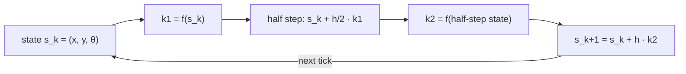

# FM.18 — Integrals and numerical integration (how simulators move time forward)

<!-- glance:start -->
<!-- generated by tools/build.py from curriculum/syllabus.yaml — edit the syllabus, not this block -->

| | |
|---|---|
| **Track** | Optional foundation |
| **Difficulty** | Intermediate |
| **Time** | 50 min |
| **Hardware** | none |
| **Software** | python, numpy |
| **Prerequisites** | [FM.17 Calculus for robots: derivatives, rates and partial derivatives](FM.17-derivatives.md) |
| **Skip if** | You know Euler integration and its error behavior. |

<!-- glance:end -->

## What you will learn

- Explain an integral as accumulation — distance from speed, heading from turn rate — and compute simple ones exactly.
- Approximate integrals from sampled data with Riemann and trapezoidal sums and estimate their error.
- Simulate robot motion with explicit Euler, midpoint (RK2) and RK4 steps, and measure how error scales with the time step.
- Recognize numerical instability (a simulation that explodes) and choose a stable time step or an exact discretization.
- Predict how sensor bias grows when integrated: linearly for gyro heading, quadratically for accelerometer position.

## Why it matters

A derivative turns position into velocity; an integral turns it back. Almost everything a robot "knows" about where it has been comes from integrating: wheel speeds into position (dead reckoning, [09.03](../../09-odometry/09.03-dead-reckoning-integration.md)), gyro rate into heading ([07.05](../../07-sensors/07.05-imu-fundamentals.md)), accumulated error into the I term of a PID controller ([08.05](../../08-control/08.05-integral-control.md)). And every simulator — the course's own 100-line simulator ([06.02](../../06-simulation/06.02-course-mini-simulator.md)), Gazebo, MuJoCo, Isaac Sim — moves the world forward by numerically integrating differential equations one time step at a time ([FCT.03](../control-theory/FCT.03-differential-equations-simulation.md)).

The choice of integration method and time step decides whether your simulated robot drives the circle it was commanded, drifts off it, or flies to infinity. You'll see all three in this lesson. You need derivatives from [FM.17](FM.17-derivatives.md).

<!-- prereqs:start -->
## Prerequisites

You need these first:

- [FM.17 Calculus for robots: derivatives, rates and partial derivatives](FM.17-derivatives.md)

### Optional prerequisite links

None.

Check your readiness: `python course.py why FM.18`
<!-- prereqs:end -->

## Concept

**An integral is a running total.** If you drive at 0.3 m/s for 2 s, you've covered 0.6 m: speed × time. If the speed changes, chop time into small slices, compute speed × slice duration for each, and add them up. As the slices get thinner the total approaches the exact distance. On a plot of speed against time, that total is the **area under the curve**. The integral of speed is distance; the integral of turn rate is heading change; the integral of acceleration is speed.

**Integration undoes differentiation** (the *fundamental theorem of calculus*). The derivative of position is velocity; the integral of velocity is the change in position. So when a robot only measures rates (wheel speed, gyro rate), integrating recovers the quantities it cares about — plus a starting value, which integration can't know.

**Robots integrate numerically, one step at a time.** The robot's loop every 10 ms does: `x += v * cos(theta) * dt; y += v * sin(theta) * dt; theta += omega * dt`. That is **Euler's method**: assume the rate stays constant over the step. It's simple and it's wrong in a predictable way: when the robot is turning, the heading at the *start* of the step is used for the whole step, so the robot cuts outside the true arc. Smaller steps shrink the error proportionally.

**Better methods sample the rate more cleverly.** The **midpoint method (RK2)** first takes half a step to find the heading at the middle of the interval, then uses *that* heading for the full step. It's like aiming a car by where the road will be halfway through the curve instead of where you are now. For the same step size its error is hundreds of times smaller, and it shrinks with the *square* of the step. **RK4** samples four times per step and is the workhorse of offline simulation.

**Errors add up, and bias adds up fastest.** Integrating a rate that has a constant bias adds that bias every step, forever: a gyro that reads 0.01 rad/s when still makes the robot believe it turned 34° after a minute. Integrate *twice* (accelerometer → speed → position) and a tiny bias grows with time squared: 90 m of fake position after one minute. That is why nobody gets position from a cheap accelerometer alone.

**Too big a step can explode.** A motor's speed settles toward its target with a time constant of 50 ms. Simulate it with Euler steps longer than 100 ms and each step overshoots more than the last — the simulation diverges even though the real motor is perfectly calm. Simulators have a maximum stable step for a reason.

> [!TIP]
> **Ask your teacher:** "Draw me one Euler step and one midpoint step for a robot turning at 0.5 rad/s, and explain geometrically why the midpoint step lands closer to the circle."

## Technical explanation

### Level 1 — The integral and its rules

$$x(T) = x(0) + \int_0^T v(t)\,dt, \qquad \frac{d}{dT}\int_0^T v(t)\,dt = v(T)$$

Every derivative rule from [FM.17](FM.17-derivatives.md) run backwards gives an integral:

| $v(t)$ | $\int_0^T v(t)\,dt$ |
|---|---|
| $c$ | $cT$ |
| $a t$ | $\frac{1}{2}aT^2$ |
| $\cos(\omega t)$ | $\frac{1}{\omega}\sin(\omega T)$ |
| $e^{-t/\tau}$ | $\tau\,(1 - e^{-T/\tau})$ |

**Numerical example — motor spin-up.** karmel starts from rest; its speed follows $v(t) = 0.3\,(1 - e^{-t/0.4})$ m/s. Distance after 3 s:

$$\int_0^3 0.3\,(1 - e^{-t/0.4})\,dt = 0.3\left(3 - 0.4\,(1 - e^{-7.5})\right) = 0.78007 \text{ m}$$

Compare with the naive "0.3 m/s × 3 s = 0.9 m": the spin-up costs 12 cm.

### Level 2 — Integrating samples: Riemann and trapezoid

With samples $v_k = v(k\,\Delta t)$:

$$\text{left Riemann: } \sum_{k=0}^{N-1} v_k\,\Delta t, \qquad \text{trapezoid: } \sum_{k=0}^{N-1} \frac{v_k + v_{k+1}}{2}\,\Delta t$$

The left sum is exactly what Euler integration does. Its error is proportional to $\Delta t$ (first order); the trapezoid rule's error is proportional to $\Delta t^2$ (second order).

**Numerical example.** The spin-up profile sampled at $\Delta t = 0.1$ s: left sum 0.76445 m (error −15.6 mm), trapezoid 0.77944 m (error −0.6 mm). At $\Delta t = 0.01$ s: −1.5 mm vs −0.01 mm. Ten times smaller step: 10× better for left Riemann, 100× better for trapezoid.

On a robot the trapezoid rule is free: when integrating a gyro, use the average of the previous and current reading, `theta += 0.5 * (w_prev + w_now) * dt`.

### Level 3 — Ordinary differential equations and step methods

A robot's motion is an **ordinary differential equation** (ODE): the rate of change of the state is a function of the state. The unicycle (differential-drive) model with state $\mathbf{s} = (x, y, \theta)$, speed $v$ and turn rate $\omega$:

$$\dot{\mathbf{s}} = f(\mathbf{s}, t) = \begin{bmatrix} v\cos\theta \\ v\sin\theta \\ \omega \end{bmatrix}$$

Step methods with step $h$:

$$\text{Euler: } \mathbf{s}_{k+1} = \mathbf{s}_k + h\,f(\mathbf{s}_k, t_k)$$

$$\text{Midpoint (RK2): } \mathbf{k}_1 = f(\mathbf{s}_k, t_k),\quad \mathbf{s}_{k+1} = \mathbf{s}_k + h\,f\!\left(\mathbf{s}_k + \tfrac{h}{2}\mathbf{k}_1,\ t_k + \tfrac{h}{2}\right)$$

$$\text{RK4: } \mathbf{s}_{k+1} = \mathbf{s}_k + \tfrac{h}{6}(\mathbf{k}_1 + 2\mathbf{k}_2 + 2\mathbf{k}_3 + \mathbf{k}_4)$$

(with $\mathbf{k}_2, \mathbf{k}_3$ evaluated at half steps and $\mathbf{k}_4$ at the full step; see the code). A method of **order $p$** has *global* error (after a fixed simulated time) proportional to $h^p$: Euler $p = 1$, RK2 $p = 2$, RK4 $p = 4$. Halving $h$ divides the error by 2, 4 and 16 respectively, at a cost of 1, 2 and 4 evaluations of $f$ per step.

**Numerical example — driving a circle.** $v = 0.2$ m/s, $\omega = 0.5$ rad/s, starting at the origin facing $+x$. The exact path is a circle of radius $v/\omega = 0.4$ m: $x = 0.4\sin(0.5t)$, $y = 0.4(1 - \cos 0.5t)$. After 10 s the robot should be at $(-0.38357, 0.28654)$. Final position error:

| $h$ [s] | Euler | RK2 (midpoint) | RK4 |
|---|---|---|---|
| 0.50 | 59.9 mm | 1.25 mm | 0.00065 mm |
| 0.10 | 12.0 mm | 0.050 mm | 1.0e-6 mm |
| 0.01 | 1.2 mm | 0.0005 mm | 1.5e-10 mm |

Euler at 100 Hz on karmel (h = 0.01 s) is off by 1.2 mm after 10 s of turning; at 10 Hz by 12 mm. For odometry that's usually small next to wheel slip — but it's free to fix. For a differential drive with constant $v$ and $\omega$ over a step the exact arc update is known in closed form; [09.03](../../09-odometry/09.03-dead-reckoning-integration.md) derives it and compares it with Euler and midpoint on real encoder data.

### Level 4 — Stability and integrated bias

**Stability.** A first-order motor model $\tau\,\dot\omega = \omega_\text{target} - \omega$ with $\tau = 0.05$ s. The Euler update is

$$\omega_{k+1} - \omega_\text{target} = \left(1 - \frac{h}{\tau}\right)(\omega_k - \omega_\text{target})$$

The error is multiplied by $(1 - h/\tau)$ every step. If $|1 - h/\tau| > 1$, i.e. $h > 2\tau = 0.1$ s, it grows without bound.

| $h$ | $h/\tau$ | factor per step | $\omega$ after 20 steps (target 10 rad/s) |
|---|---|---|---|
| 0.005 | 0.1 | +0.90 | 8.78 (still converging smoothly) |
| 0.05 | 1.0 | 0.00 | 10.00 (lands exactly in one step) |
| 0.09 | 1.8 | −0.80 | 9.88 (oscillates, slowly converges) |
| 0.11 | 2.2 | −1.20 | **−373** (oscillates and explodes) |

Fixes: make $h$ much smaller than the fastest time constant in the system (rule of thumb $h \le \tau/10$), use an implicit method, or use the **exact discretization** $\omega_{k+1} = \omega_\text{target} + (\omega_k - \omega_\text{target})\,e^{-h/\tau}$, which is stable for any $h$. Stiff physics (stiff contacts, fast motors next to a slow robot body) is why physics engines use small steps or implicit integrators.

**Integrating bias.** A constant bias $b$ on a rate integrates to an error $b\,t$; on an acceleration it integrates twice to $\frac{1}{2}b\,t^2$.

**Numerical example.** Gyro bias 0.01 rad/s: heading error 0.1 rad (5.7°) after 10 s, 0.6 rad (34.4°) after 60 s. Accelerometer bias 0.05 m/s² (a tilt of 0.3° lets gravity leak in): position error 2.5 m after 10 s, 90 m after 60 s. Heading error also turns into position error: driving straight at $v$ with heading error $\theta(t) = bt$, the sideways error is $\int_0^T v\sin(bt)\,dt = \frac{v}{b}(1 - \cos bT)$. Random noise, by contrast, integrates to a random walk growing like $\sqrt t$ ([FM.14](FM.14-distributions-gaussians-noise.md)).

## Diagram

```text
 One step of a robot turning left (true path = arc)

                       true arc ╭──────● true position after h
                             ╭──╯
                          ╭──╯      ● midpoint (RK2): uses heading at t + h/2 → lands close to the arc
                       ╭──╯       ↗
                    ╭──╯       ↗
                 ╭──╯       ↗             ● Euler: uses heading at t for the whole step
                 ●──────────────────────► → overshoots outside the arc
             robot at t, heading θ(t)

 Error vs step size (log-log): slope = order of the method

  error ▲
   1e-1 ┤ ●
   1e-2 ┤    ●  Euler        (slope 1: ×10 step → ×10 error)
   1e-3 ┤ ●      ●
   1e-4 ┤    ●     RK2       (slope 2: ×10 step → ×100 error)
   1e-6 ┤ ●      ●
   1e-9 ┤    ●     RK4       (slope 4: ×10 step → ×10,000 error)
        └──┬────┬─────┬────► step h
          0.5  0.1   0.01
```



## Code

Save as `fm18_integration.py` and run `python fm18_integration.py` (numpy ≥ 2.0 for `np.trapezoid`, matplotlib). It integrates the spin-up profile, drives the circle with three methods at five step sizes (plot in `fm18_circle.png`), shows Euler instability on a motor model, and prints bias growth.

```python
"""fm18_integration.py — integrating robot motion: Riemann sums, Euler, RK2, RK4, stability.

Run:  python fm18_integration.py      (writes fm18_circle.png)
Needs: numpy, matplotlib
"""
from __future__ import annotations

import math
from collections.abc import Callable
from pathlib import Path

import matplotlib

matplotlib.use("Agg")
import matplotlib.pyplot as plt
import numpy as np

OUT = Path(__file__).resolve().parent
Deriv = Callable[[np.ndarray, float], np.ndarray]   # f(state, t) -> d(state)/dt


def euler_step(f: Deriv, s: np.ndarray, t: float, dt: float) -> np.ndarray:
    return s + dt * f(s, t)


def rk2_step(f: Deriv, s: np.ndarray, t: float, dt: float) -> np.ndarray:
    """Midpoint method: take half a step, use the slope there for the full step."""
    k1 = f(s, t)
    k2 = f(s + 0.5 * dt * k1, t + 0.5 * dt)
    return s + dt * k2


def rk4_step(f: Deriv, s: np.ndarray, t: float, dt: float) -> np.ndarray:
    k1 = f(s, t)
    k2 = f(s + 0.5 * dt * k1, t + 0.5 * dt)
    k3 = f(s + 0.5 * dt * k2, t + 0.5 * dt)
    k4 = f(s + dt * k3, t + dt)
    return s + dt / 6.0 * (k1 + 2 * k2 + 2 * k3 + k4)


def simulate(step: Callable, f: Deriv, s0: np.ndarray, dt: float, t_end: float) -> np.ndarray:
    n = int(round(t_end / dt))
    traj = np.empty((n + 1, s0.size))
    traj[0] = s0
    for i in range(n):
        traj[i + 1] = step(f, traj[i], i * dt, dt)
    return traj


def distance_from_velocity_samples() -> None:
    # Robot starts from rest; speed rises like a motor spin-up: v(t) = 0.3 (1 - exp(-t / 0.4)) m/s.
    def v(t: np.ndarray) -> np.ndarray:
        return 0.3 * (1.0 - np.exp(-t / 0.4))

    t_end = 3.0
    exact = 0.3 * (t_end - 0.4 * (1.0 - math.exp(-t_end / 0.4)))
    print(f"1) Distance = integral of speed over 3 s. Exact = {exact:.5f} m")
    for dt in (0.5, 0.1, 0.01):
        t = np.arange(0.0, t_end + 1e-9, dt)
        vs = v(t)
        left = np.sum(vs[:-1]) * dt
        trap = np.trapezoid(vs, t)
        print(f"   dt={dt:<5} left Riemann={left:.5f} m (err {left - exact:+.5f})   "
              f"trapezoid={trap:.5f} m (err {trap - exact:+.5f})")


def unicycle(v: float, w: float) -> Deriv:
    def f(s: np.ndarray, t: float) -> np.ndarray:
        return np.array([v * math.cos(s[2]), v * math.sin(s[2]), w])
    return f


def circle_errors() -> None:
    v, w, t_end = 0.2, 0.5, 10.0
    r = v / w
    exact = np.array([r * math.sin(w * t_end), r * (1 - math.cos(w * t_end))])
    f = unicycle(v, w)
    s0 = np.zeros(3)
    print(f"2) Unicycle v={v} m/s, w={w} rad/s for {t_end} s (circle radius {r} m). Exact end = {exact.round(5).tolist()}")
    print("      dt      Euler err [m]   RK2 err [m]    RK4 err [m]")
    fig, ax = plt.subplots(figsize=(5, 5))
    for dt in (0.5, 0.2, 0.1, 0.05, 0.01):
        errs = []
        for name, step in (("Euler", euler_step), ("RK2", rk2_step), ("RK4", rk4_step)):
            traj = simulate(step, f, s0, dt, t_end)
            errs.append(np.linalg.norm(traj[-1, :2] - exact))
            if dt == 0.5 and name != "RK4":
                ax.plot(traj[:, 0], traj[:, 1], "o-", ms=3, label=f"{name}, dt=0.5 s")
        print(f"   {dt:6.2f}   {errs[0]:12.3e}   {errs[1]:12.3e}   {errs[2]:12.3e}")
    tt = np.linspace(0, t_end, 400)
    ax.plot(r * np.sin(w * tt), r * (1 - np.cos(w * tt)), "k", lw=2, label="exact")
    ax.set_aspect("equal")
    ax.legend()
    ax.set_xlabel("x [m]")
    ax.set_ylabel("y [m]")
    fig.tight_layout()
    fig.savefig(OUT / "fm18_circle.png", dpi=120)


def stability() -> None:
    # First-order motor model: tau * d(omega)/dt = K*u - omega, tau = 0.05 s, K*u = 10 rad/s.
    tau, target = 0.05, 10.0

    def f(s: np.ndarray, t: float) -> np.ndarray:
        return np.array([(target - s[0]) / tau])

    print("3) Explicit Euler on a motor with time constant tau=0.05 s (exact: settles at 10 rad/s)")
    for dt in (0.005, 0.05, 0.09, 0.11):
        traj = simulate(euler_step, f, np.array([0.0]), dt, 20 * dt)
        print(f"   dt={dt:<5} (dt/tau={dt / tau:4.1f}): omega after 20 steps = {traj[-1, 0]:12.4f} rad/s, "
              f"error factor per step = {1 - dt / tau:+.2f}")
    exact_step = lambda s, dt: target + (s - target) * math.exp(-dt / tau)
    s = 0.0
    for _ in range(20):
        s = exact_step(s, 0.11)
    print(f"   exact discretization, dt=0.11: omega after 20 steps = {s:.4f} rad/s")


def imu_drift() -> None:
    print("4) Integrating sensor bias")
    for t in (1.0, 10.0, 60.0):
        print(f"   t={t:>4.0f} s: gyro bias 0.01 rad/s -> heading error {0.01 * t:.2f} rad "
              f"({math.degrees(0.01 * t):5.1f} deg); accel bias 0.05 m/s^2 -> position error {0.5 * 0.05 * t * t:7.2f} m")


def main() -> None:
    distance_from_velocity_samples()
    circle_errors()
    stability()
    imu_drift()
    print("wrote fm18_circle.png")


if __name__ == "__main__":
    main()
```

Output:

```text
1) Distance = integral of speed over 3 s. Exact = 0.78007 m
   dt=0.5   left Riemann=0.68988 m (err -0.09018)   trapezoid=0.76484 m (err -0.01522)
   dt=0.1   left Riemann=0.76445 m (err -0.01562)   trapezoid=0.77944 m (err -0.00062)
   dt=0.01  left Riemann=0.77856 m (err -0.00151)   trapezoid=0.78006 m (err -0.00001)
2) Unicycle v=0.2 m/s, w=0.5 rad/s for 10.0 s (circle radius 0.4 m). Exact end = [-0.38357, 0.28654]
      dt      Euler err [m]   RK2 err [m]    RK4 err [m]
     0.50      5.990e-02      1.249e-03      6.506e-07
     0.20      2.394e-02      1.995e-04      1.663e-08
     0.10      1.197e-02      4.988e-05      1.039e-09
     0.05      5.985e-03      1.247e-05      6.494e-11
     0.01      1.197e-03      4.987e-07      1.460e-13
3) Explicit Euler on a motor with time constant tau=0.05 s (exact: settles at 10 rad/s)
   dt=0.005 (dt/tau= 0.1): omega after 20 steps =       8.7842 rad/s, error factor per step = +0.90
   dt=0.05  (dt/tau= 1.0): omega after 20 steps =      10.0000 rad/s, error factor per step = +0.00
   dt=0.09  (dt/tau= 1.8): omega after 20 steps =       9.8847 rad/s, error factor per step = -0.80
   dt=0.11  (dt/tau= 2.2): omega after 20 steps =    -373.3760 rad/s, error factor per step = -1.20
   exact discretization, dt=0.11: omega after 20 steps = 10.0000 rad/s
4) Integrating sensor bias
   t=   1 s: gyro bias 0.01 rad/s -> heading error 0.01 rad (  0.6 deg); accel bias 0.05 m/s^2 -> position error    0.03 m
   t=  10 s: gyro bias 0.01 rad/s -> heading error 0.10 rad (  5.7 deg); accel bias 0.05 m/s^2 -> position error    2.50 m
   t=  60 s: gyro bias 0.01 rad/s -> heading error 0.60 rad ( 34.4 deg); accel bias 0.05 m/s^2 -> position error   90.00 m
wrote fm18_circle.png
```

In `fm18_circle.png` the black exact semicircle-and-a-bit runs from the origin around to (−0.38, 0.29). The orange RK2 dots (dt = 0.5 s) sit on it. The blue Euler polyline bulges outside the arc on the right-hand side (each step follows the *old* heading) and finishes about 6 cm from the true end point.

## Exercise

All exercises need hardware: **none**. (You'll apply E3 to real encoder logs from the `robot-base` in [09.03](../../09-odometry/09.03-dead-reckoning-integration.md).)

### Exercise FM.18-E1 — Distance from logged speeds `[numerical]`

Goal: integrate samples by hand with two rules.
karmel logs its speed every 0.2 s while accelerating at 0.5 m/s² up to 0.3 m/s and then cruising: $t$ = 0, 0.2, 0.4, 0.6, 0.8, 1.0 s → $v$ = 0, 0.10, 0.20, 0.30, 0.30, 0.30 m/s. Compute the distance over the first second (a) exactly from the description, (b) with the left Riemann sum, (c) with the trapezoidal rule.

### Exercise FM.18-E2 — Halve the step `[predict]`

Goal: know the order of each method.
In the circle table, at $h = 0.10$ s the errors are 12.0 mm (Euler), 0.050 mm (RK2), 1.0e-6 mm (RK4). **Before running**, predict each error at $h = 0.025$ s. Then add 0.025 to the `dt` list and run.

### Exercise FM.18-E3 — Write your own second-order step `[coding]`

Goal: implement and verify an RK2 variant.
Implement **Heun's method** (a different RK2): $\mathbf{k}_1 = f(\mathbf{s}_k)$, $\mathbf{k}_2 = f(\mathbf{s}_k + h\mathbf{k}_1)$, $\mathbf{s}_{k+1} = \mathbf{s}_k + \frac{h}{2}(\mathbf{k}_1 + \mathbf{k}_2)$. Use it on the circle ($v = 0.2$, $\omega = 0.5$, 10 s) with $h = 0.1$ and $h = 0.05$. Report both errors and the ratio, and compare with the midpoint method's numbers.

### Exercise FM.18-E4 — How far off is the IMU-only robot? `[numerical]`

Goal: integrate bias analytically.
(a) An uncalibrated gyro has bias 0.02 rad/s. karmel drives "straight" at 0.3 m/s for 30 s, steering by the gyro, so its true heading error grows as $\theta(t) = 0.02\,t$. What is the heading error at 30 s in degrees? (b) How far sideways has it drifted? Use $\int_0^T v\sin(bt)\,dt = \frac{v}{b}(1 - \cos bT)$, and compare with the small-angle approximation $\frac{1}{2}vbT^2$. (c) A still robot with accelerometer bias 0.05 m/s²: position error after 5 s?

### Exercise FM.18-E5 — The simulator that explodes `[debugging]`

Goal: diagnose and fix numerical instability.
A teammate's motor simulation (τ = 0.05 s, Euler) runs fine in the unit tests at `dt = 0.001` but prints `omega = -373` (then `nan` after a few hundred steps) when the whole simulator is switched to `dt = 0.11` "to run faster". (a) Show with the per-step error factor why it diverges. (b) What is the largest stable Euler step, and what step would you actually use? (c) Replace the Euler update with the exact discretization and show it gives 10.0000 rad/s after 20 steps at `dt = 0.11`.

## Expected result

- **FM.18-E1:** (a) accelerate 0.6 s: $\frac{1}{2} \cdot 0.5 \cdot 0.6^2 = 0.09$ m, then cruise 0.4 s: 0.12 m, total **0.21 m**; (b) left Riemann $0.2 \cdot (0 + 0.1 + 0.2 + 0.3 + 0.3) = 0.18$ m (14% low); (c) trapezoid $0.2 \cdot (0/2 + 0.1 + 0.2 + 0.3 + 0.3 + 0.3/2) = 0.21$ m — exact here, because the profile is straight between samples.
- **FM.18-E2:** $h$ divided by 4: Euler ≈ 12.0/4 = 3.0 mm, RK2 ≈ 0.050/16 = 0.0031 mm, RK4 ≈ 1.0e-6/256 ≈ 4e-9 mm. The run agrees within a few percent (RK4 can hit roundoff near 1e-13 m).
- **FM.18-E3:** Heun: ≈ 9.97e-5 m at $h = 0.1$ and ≈ 2.5e-5 m at $h = 0.05$, ratio ≈ 4 (second order). Midpoint gave 4.99e-5 and 1.25e-5 — also second order, with half the error constant for this problem.
- **FM.18-E4:** (a) 0.6 rad = 34.4°; (b) $\frac{0.3}{0.02}(1 - \cos 0.6) = 2.62$ m; small-angle $\frac{1}{2} \cdot 0.3 \cdot 0.02 \cdot 900 = 2.70$ m (3% high at 34°); (c) $\frac{1}{2} \cdot 0.05 \cdot 25 = 0.625$ m.
- **FM.18-E5:** (a) factor $1 - 0.11/0.05 = -1.2$; $|{-1.2}| > 1$ so the error flips sign and grows 20% per step: $1.2^{20} \approx 38$, and $10 - 10 \cdot 38.3 = -373$. (b) Stable for $h < 2\tau = 0.1$ s; for accuracy use $h \le \tau/10 = 0.005$ s (or a smaller simulator substep for the motor only). (c) `omega = target + (omega - target) * exp(-dt / tau)` gives 10.0000 rad/s.

## Troubleshooting

### Symptom: the simulated robot slowly spirals or drifts off a commanded circle

1. Halve the time step. If the drift halves, it's Euler integration error; switch to midpoint/RK4 or the exact arc update. If it doesn't change, it's something else.
2. Check angle units and wrapping: $\theta$ in radians, and don't wrap $\theta$ inside the RK sub-steps in a way that breaks continuity.
3. Check you pass the *time* to $f$ when inputs vary with time; RK methods need the input at $t + h/2$.

### Symptom: the simulation produces `nan` or values that grow exponentially

1. Find the fastest time constant in the model (motor electrical/mechanical τ, stiff spring). Is $h > 2\tau$ (Euler) or roughly $2.8\tau$ (RK4)? Then it's instability, not a physics bug.
2. Reduce $h$, substep only the fast part, or use an exact/implicit update.
3. If $h$ is already small, look for a sign error making the system genuinely unstable (e.g. $\dot\omega = (\omega - \text{target})/\tau$).

### Symptom: integrated heading or position drifts even when the robot is still

1. Print the raw rate while stationary. A nonzero mean is bias: estimate it over a few seconds at startup and subtract it ([07.05](../../07-sensors/07.05-imu-fundamentals.md)).
2. Check the time base: using nominal dt instead of measured timestamps integrates timing jitter.
3. If the drift looks like a random walk (wandering both ways, growing like $\sqrt t$), it's noise, not bias; only external references (landmarks, [10.01](../../10-localization/10.01-what-is-localization.md)) bound it.

## Common mistakes

- **Using Euler with a large step and blaming the physics.** Always run a step-size halving test.
- **Ignoring stability limits.** Explicit methods explode when $h$ is large relative to the fastest time constant.
- **Updating $\theta$ before using it for $x$ and $y$ in the same step** (or vice versa) without meaning to: it silently changes the method. Compute all rates from the old state, then update.
- **Integrating raw accelerometer data to get position.** Bias grows quadratically; it only works for fractions of a second or with frequent corrections.
- **Forgetting the initial value.** An integral gives change; the starting pose must come from somewhere.
- **Using `np.trapz`.** Renamed to `np.trapezoid` in numpy 2.0; the old name is deprecated.

## Knowledge check

1. A robot's speed is $v(t) = 0.4t$ m/s for $0 \le t \le 2$ s. How far does it travel?
   <details><summary>Answer</summary>

   $\int_0^2 0.4t\,dt = 0.2 \cdot 2^2 = 0.8$ m.
   </details>

2. Why is the trapezoid rule more accurate than the left Riemann sum for the same samples?
   <details><summary>Answer</summary>

   It uses both ends of each interval, so a linearly changing rate is integrated exactly; the leftover error comes from curvature and scales with $\Delta t^2$. The left sum assumes the rate stays at its starting value, an error proportional to $\Delta t$.
   </details>

3. Euler integration of a turning robot gives 8 mm error at $h = 0.02$ s. Roughly what at $h = 0.01$ s? And for a midpoint method with 0.3 mm error at $h = 0.02$ s?
   <details><summary>Answer</summary>

   Euler (first order): ≈ 4 mm. Midpoint (second order): ≈ 0.075 mm.
   </details>

4. Predict: you simulate a motor with τ = 20 ms using Euler at 50 Hz. What happens?
   <details><summary>Answer</summary>

   $h = 0.02$ s $= \tau$, factor $1 - 1 = 0$: it jumps to the target in one step and stays — stable but it hides the real 20 ms dynamics entirely. At 25 Hz ($h = 2\tau$) it would oscillate forever; slower than that it explodes. Use ≤ 2 ms steps for the motor.
   </details>

5. A gyro bias of 0.005 rad/s is not calibrated out. How many degrees of heading error after 2 minutes?
   <details><summary>Answer</summary>

   $0.005 \cdot 120 = 0.6$ rad = 34.4°.
   </details>

6. Debugging: dead reckoning looks perfect on straight lines but the robot's estimated path after many turns ends up consistently outside the real one. The loop runs at 5 Hz. Which cause is most likely, and how would you confirm it cheaply?
   <details><summary>Answer</summary>

   Euler integration error: at 5 Hz each step follows the old heading and cuts outside every arc. Confirm by re-integrating the same logged wheel speeds with a midpoint or exact-arc update (or at a higher rate from the raw ticks): if the path moves onto the real one, that was it. Wheel slip would not depend on the integration method.
   </details>

7. Why do physics engines like Gazebo or MuJoCo use step sizes of around a millisecond even for slow robots?
   <details><summary>Answer</summary>

   Stability and accuracy are governed by the *fastest* dynamics in the model — stiff contacts, joint controllers, motor models with millisecond time constants — not by how fast the robot drives. Large steps make those parts diverge or jitter.
   </details>

## Practical challenge

Write a small integration library and prove its orders of accuracy automatically.

Acceptance criteria:
- `integrate(f, s0, t_end, h, method)` supports `"euler"`, `"midpoint"`, `"heun"` and `"rk4"`, with type hints and a docstring.
- A pytest test estimates the order of each method on the unicycle circle by fitting the slope of log(error) vs log(h) over $h \in \{0.2, 0.1, 0.05, 0.025\}$ and asserts slopes within ±0.2 of 1, 2, 2 and 4.
- A second test integrates $\dot x = -x/\tau$ with Euler at $h = 2.2\tau$ and asserts divergence, and at $h = 0.1\tau$ asserts error below 5% of the exact $e^{-t/\tau}$ after $5\tau$.
- A one-paragraph note: which method you'd use in karmel's 50 Hz odometry loop and which in an offline simulator, with the evaluation cost per step as part of the argument.

## You can skip this if…

You answer knowledge-check questions 3, 4 and 6 correctly without looking, and you can explain why Euler has first-order global error and when it becomes unstable. Then:

`python course.py skip FM.18 --reason "know Euler integration and its error behaviour"`

## Go deeper

- https://www.3blue1brown.com/topics/calculus — 3Blue1Brown, *Essence of Calculus*: integration as area and the fundamental theorem (chapters 8–9).
- https://en.wikipedia.org/wiki/Runge%E2%80%93Kutta_methods — Runge–Kutta methods: the family behind RK2/RK4, with Butcher tableaux if you want to derive your own.
- https://docs.scipy.org/doc/scipy/reference/generated/scipy.integrate.solve_ivp.html — SciPy's `solve_ivp`: adaptive-step RK45 and implicit solvers for stiff systems; use it offline instead of hand-written loops.
- https://underactuated.csail.mit.edu/ — Tedrake, *Underactuated Robotics*: simulation and time-stepping in the context of real robot dynamics.
- https://github.com/rlabbe/Kalman-and-Bayesian-Filters-in-Python — Labbe's chapter on the EKF and appendices discuss integrating nonlinear process models (Euler vs RK4) inside filters.

## Progress checkpoint

- [ ] I can compute simple integrals exactly and from samples with the trapezoid rule.
- [ ] I can implement Euler, midpoint and RK4 steps for a robot motion model.
- [ ] I can measure how error scales with step size and name each method's order.
- [ ] I can identify an unstable time step and fix it.
- [ ] I can predict position and heading drift from integrated sensor bias.

`python course.py complete FM.18` (exercises done) · `python course.py master FM.18` (challenge done) · `python course.py struggle FM.18 "what was hard"`

Next: [FM.19 — Linear systems and least squares](FM.19-linear-systems-least-squares.md).
