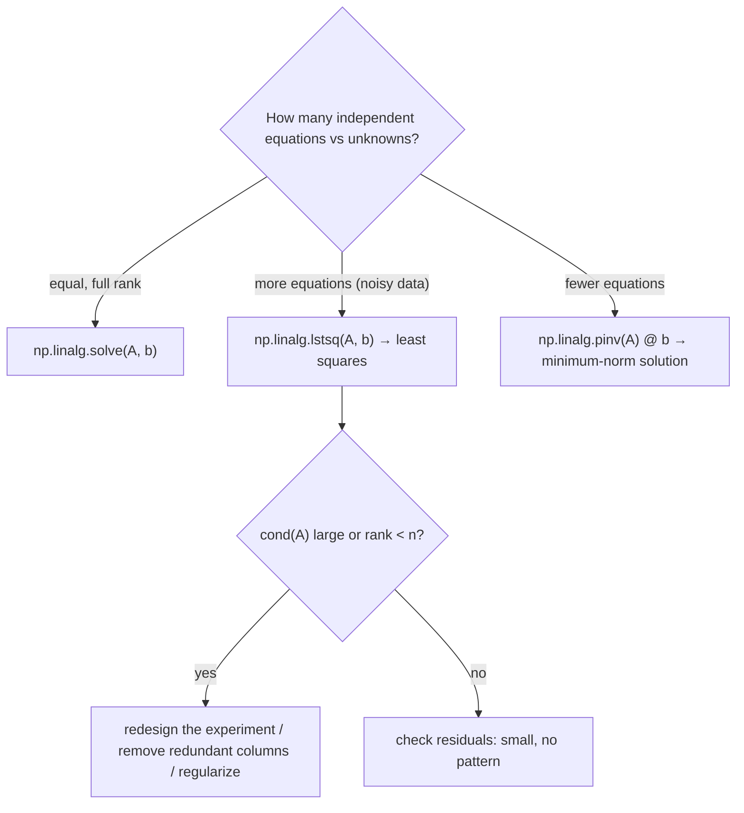

# FM.19 — Linear systems and least squares

<!-- glance:start -->
<!-- generated by tools/build.py from curriculum/syllabus.yaml — edit the syllabus, not this block -->

| | |
|---|---|
| **Track** | Optional foundation |
| **Difficulty** | Intermediate |
| **Time** | 1 h |
| **Hardware** | none |
| **Software** | python, numpy |
| **Prerequisites** | [FM.07 Matrices and matrix multiplication](FM.07-matrices.md) |
| **Skip if** | You fit models with least squares and know the pseudo-inverse. |

<!-- glance:end -->

## What you will learn

- Write a robot problem as $A\mathbf{x} = \mathbf{b}$ and solve it correctly with `np.linalg.solve`.
- Fit model parameters (wheel radius, sensor calibration, motor gain) to noisy measurements with least squares.
- Derive and use the normal equations, and know why `lstsq` is preferred over inverting $A^\top A$.
- Diagnose ill-conditioned and rank-deficient problems with the condition number and singular values.
- Use the pseudo-inverse and the SVD for over- and under-determined systems, such as a redundant arm.

## Why it matters

karmel's wheels are nominally 90 mm in diameter (45 mm radius), but the tyres compress under the robot's 1.6 kg. If the true effective radius is 44.60 mm and the code uses 45.00 mm, odometry over-reports every distance by 0.9%: 1.8 cm error per 2 m before anything else goes wrong. You fix that by driving the robot several times, measuring with a tape, and finding the radius that best explains all runs at once. "Best explains noisy data" is **least squares**, the most used algorithm in engineering.

It shows up throughout the course: calibrating odometry ([09.05](../../09-odometry/09.05-calibrating-odometry.md)), identifying a motor model from logged data ([16.05](../../16-machine-learning/16.05-learning-dynamics.md)), aligning two LiDAR scans with an SVD in ICP ([11.04](../../11-slam/11.04-scan-matching-icp.md)), solving for arm joint speeds with the pseudo-inverse and damped least squares ([14.06](../../14-robotic-arm/14.06-jacobian.md)), and at the heart of linear regression and PCA in the ML track ([FML.02](../machine-learning/FML.02-supervised-learning.md), [FML.11](../machine-learning/FML.11-unsupervised-learning.md)). Its nonlinear big brother — Gauss-Newton and Levenberg-Marquardt, which power SLAM back-ends and numerical IK — is the next lesson ([FM.20](FM.20-optimization-basics.md)). You need matrix multiplication, transpose and inverse from [FM.07](FM.07-matrices.md).

<!-- prereqs:start -->
## Prerequisites

You need these first:

- [FM.07 Matrices and matrix multiplication](FM.07-matrices.md)

### Optional prerequisite links

None.

Check your readiness: `python course.py why FM.19`
<!-- prereqs:end -->

## Concept

**A linear system is a set of equations where every unknown appears only multiplied by a constant.** "Left wheel speed plus right wheel speed, times r/2, equals the forward speed" is linear in the wheel speeds. Stack the equations: the constants form a matrix $A$, the unknowns a vector $\mathbf{x}$, the right-hand sides a vector $\mathbf{b}$. Solving $A\mathbf{x} = \mathbf{b}$ means finding the unknowns that satisfy all equations.

**Three situations:**
- **As many independent equations as unknowns** → exactly one solution. "Which wheel speeds give 0.3 m/s forward and 1 rad/s turn?"
- **More equations than unknowns** (overdetermined) → usually *no* exact solution, because measurements are noisy. Eight test runs each say something slightly different about one wheel radius. You want the value that disagrees with the data *least*.
- **Fewer equations than unknowns** (underdetermined) → infinitely many solutions. A 3-joint arm can move its tip in 2D in infinitely many ways. You want a "nicest" one, e.g. the smallest joint speeds.

**Least squares** picks the answer that minimizes the sum of squared *residuals* — the differences between what the model predicts and what you measured. Squares punish big misses more than small ones, are smooth to optimize, and, when the noise is Gaussian, give exactly the most likely parameters ([FM.14](FM.14-distributions-gaussians-noise.md)). Geometrically, least squares finds the point in the space of "things the model can produce" closest to the data — a perpendicular projection.

**Not all problems are equally solvable.** If your motor test only used duty cycles between 90% and 100%, the data can't tell a steeper line with a lower offset from a flatter line with a higher one. The system is **ill-conditioned**: tiny noise causes huge parameter swings. The **condition number** measures this, and it tells you to collect better data, not to write cleverer code. If two columns are *exactly* redundant (wheel angle and tick count, which differ only by a constant factor) the problem is **rank-deficient** and has no unique answer at all.

**The SVD is the X-ray of a matrix.** It breaks any matrix into "rotate, stretch along perpendicular axes, rotate". The stretch factors (singular values) show which directions the matrix amplifies and which it crushes. A near-zero singular value means an ill-conditioned problem — or, for an arm Jacobian, a singularity where the tip can't move in some direction.

> [!TIP]
> **Ask your teacher:** "Show me least squares as a projection: draw the column space of a 3×1 matrix, the data vector and the residual, and explain why the residual is perpendicular."

## Technical explanation

### Level 1 — Square systems

$$A\mathbf{x} = \mathbf{b}, \qquad A \in \mathbb{R}^{n\times n}$$

Unique solution when $\det A \neq 0$ (equivalently rank $n$). Solve with `np.linalg.solve(A, b)` (LU factorization), **not** `np.linalg.inv(A) @ b`: solve is faster, more accurate, and fails loudly on singular matrices.

**Numerical example — inverse kinematics of a differential drive.** Forward: $v = \frac{r}{2}(\omega_L + \omega_R)$, $\omega = \frac{r}{b}(\omega_R - \omega_L)$ with $r = 0.045$ m, $b = 0.200$ m.

$$\begin{bmatrix} 0.0225 & 0.0225 \\ -0.225 & 0.225 \end{bmatrix}\begin{bmatrix}\omega_L \\ \omega_R\end{bmatrix} = \begin{bmatrix} 0.3 \\ 1.0 \end{bmatrix} \Rightarrow \omega_L = 4.4444,\ \omega_R = 8.8889 \text{ rad/s}$$

Check by hand: $\omega_R = (v + \omega b/2)/r = (0.3 + 0.1)/0.045 = 8.889$. ✓

### Level 2 — Overdetermined systems and least squares

With $m > n$ equations, minimize

$$J(\mathbf{x}) = \|A\mathbf{x} - \mathbf{b}\|^2 = \sum_{i=1}^{m}(\mathbf{a}_i^\top\mathbf{x} - b_i)^2$$

Setting the gradient ([FM.17](FM.17-derivatives.md)) to zero, $\nabla J = 2A^\top(A\mathbf{x} - \mathbf{b}) = 0$, gives the **normal equations**:

$$A^\top A\,\mathbf{x} = A^\top\mathbf{b} \quad\Rightarrow\quad \hat{\mathbf{x}} = (A^\top A)^{-1}A^\top\mathbf{b}$$

The residual $\mathbf{b} - A\hat{\mathbf{x}}$ is perpendicular to every column of $A$ ($A^\top\mathbf{r} = 0$): the projection picture.

**One unknown.** For the model $d_i = r\,\phi_i$ (distance = radius × wheel angle), $A$ is a single column of $\phi_i$ and

$$\hat r = \frac{\sum_i \phi_i d_i}{\sum_i \phi_i^2}$$

**Numerical example — karmel's wheel radius.** Eight runs; wheel angle $\phi = \text{ticks} \cdot 2\pi/2464$:

| run | ticks | $\phi$ [rad] | tape [m] |
|---|---|---|---|
| 1 | 4398 | 11.215 | 0.502 |
| 2 | 4410 | 11.245 | 0.502 |
| 3 | 8810 | 22.465 | 0.999 |
| 4 | 8792 | 22.420 | 1.000 |
| 5 | 13222 | 33.716 | 1.503 |
| 6 | 13166 | 33.573 | 1.494 |
| 7 | 17626 | 44.946 | 2.008 |
| 8 | 17586 | 44.844 | 2.000 |

Least squares gives $\hat r = 44.597$ mm. Residuals are between −3.2 and +3.6 mm (tape reading and small slip), residual std 2.3 mm. With the nominal 45.0 mm the 2 m run would be predicted 18.0 mm too long.

**How sure are we?** With residual std $s$, the standard deviation of a one-parameter estimate is $\sigma_{\hat r} = s/\sqrt{\sum\phi_i^2}$ = 26 µm here. In general $\operatorname{Cov}(\hat{\mathbf{x}}) = s^2 (A^\top A)^{-1}$ — the covariance matrix of [FM.15](FM.15-covariance-multivariate-gaussians.md). Long runs ($\phi$ large) pin down $r$ better than short ones.

**More parameters.** Adding a start-line offset $c$ ($d = r\phi + c$) is just another column of ones: $A = [\boldsymbol\phi,\ \mathbf{1}]$. Result: $r = 44.609$ mm, $c = -0.43$ mm — the offset is negligible, so the simpler model is fine.

**Weighted least squares.** If measurement $i$ has noise $\sigma_i$, minimize $\sum_i (\mathbf{a}_i^\top\mathbf{x} - b_i)^2/\sigma_i^2$: solve $A^\top W A\,\mathbf{x} = A^\top W\mathbf{b}$ with $W = \operatorname{diag}(1/\sigma_i^2)$. A laser-measured run then counts more than a tape-measured one. Kalman filters and pose graphs are weighted least squares in disguise.

### Level 3 — Conditioning and rank

The **condition number** $\kappa(A) = \sigma_\text{max}/\sigma_\text{min}$ (ratio of largest to smallest singular value) bounds how much relative noise in $\mathbf{b}$ can be amplified in $\mathbf{x}$. Forming $A^\top A$ **squares** it: $\kappa(A^\top A) = \kappa(A)^2$. That is why `np.linalg.lstsq` (which uses the SVD) is preferred over solving the normal equations when $\kappa$ is large.

**Numerical example — fitting a motor model** $\omega = k\,u + c$ from 10 duty cycles, noise 0.3 rad/s, true $k = 20$, $c = -2$:

| duty range | $\kappa(A)$ | $\kappa(A^\top A)$ | std of $\hat k$ | std of $\hat c$ |
|---|---|---|---|---|
| 0.9 – 1.0 | 59.6 | 3,556 | 2.85 | 2.71 |
| 0.2 – 1.0 | 5.4 | 29 | 0.36 | 0.24 |

Same noise, same number of points, **8× more uncertainty** from a narrow test range. The fix is in the experiment design: excite the system across its range.

**Rank deficiency.** If one column is a multiple of another (wheel angle and raw ticks), $A^\top A$ is singular and the model has infinitely many equally good parameter combinations. `lstsq` returns the **minimum-norm** one, and predictions are still fine (0.5001 m for run 1), but individual coefficients are meaningless. `inv(A.T @ A)` may raise `LinAlgError` or, worse, silently return nonsense.

### Level 4 — Pseudo-inverse and SVD

Every matrix $A \in \mathbb{R}^{m\times n}$ has a **singular value decomposition**

$$A = U\Sigma V^\top$$

with orthonormal $U$ ($m\times m$) and $V$ ($n\times n$) and non-negative singular values $\sigma_1 \geq \sigma_2 \geq \dots$ on the diagonal of $\Sigma$. Read it as: rotate the input by $V^\top$, stretch axis $i$ by $\sigma_i$, rotate by $U$. The number of nonzero singular values is the rank.

The **pseudo-inverse** $A^+ = V\Sigma^+U^\top$ (invert nonzero $\sigma_i$, leave zeros) solves every case:
- overdetermined, full rank: $A^+\mathbf{b}$ is the least-squares solution, $A^+ = (A^\top A)^{-1}A^\top$;
- underdetermined, full rank: $A^+\mathbf{b}$ is the exact solution with the **smallest norm**, $A^+ = A^\top(AA^\top)^{-1}$;
- rank-deficient: the minimum-norm least-squares solution.

**Numerical example — a redundant arm.** A planar 3-link arm (0.12, 0.10, 0.06 m) at $q = (30°, 60°, -30°)$ has a 2×3 tip Jacobian $J$ ([FM.17](FM.17-derivatives.md)). To move the tip at (0.05, 0) m/s, $\dot{\mathbf{q}} = J^+\mathbf{v}$ gives (0.1067, −0.4787, 0.0024) rad/s with norm 0.490. Adding any multiple of the null-space direction (the last row of $V^\top$) moves the joints without moving the tip: (0.002, −0.4996, 0.4908) also works, with norm 0.700. The pseudo-inverse picks the gentlest motion.

**Numerical example — approaching a singularity.** For the 2-link arm (0.12, 0.10 m) with $q_1 = 30°$, the smaller singular value of $J$ as the elbow straightens: 0.0698 at $q_2 = 90°$, 0.0257 at 30°, 0.0043 at 5°, 0 at 0°. The Jacobian's pseudo-inverse multiplies by $1/\sigma_\text{min}$, so near-straight elbows demand enormous joint speeds. Damped least squares, $(J^\top J + \lambda^2 I)^{-1}J^\top$, caps that ([14.06](../../14-robotic-arm/14.06-jacobian.md)) — and it's the same trick as Levenberg-Marquardt in [FM.20](FM.20-optimization-basics.md).

## Diagram

```text
 Least squares as a projection (A has one column φ, data vector d has 8 entries)

                     d  (measured distances)
                     ●
                    /│
                   / │  residual r = d − r̂φ   (perpendicular to φ: φᵀr = 0)
                  /  │
                 /   │
   origin ●─────────●──────────────────────────►  span of φ  ("every distance a radius could explain")
                   r̂φ  (best prediction)

 SVD of a 2×2 Jacobian: unit circle of joint speeds → ellipse of tip velocities

      joint space (q̇)                      Vᵀ rotate    Σ stretch      U rotate        tip space (v)
         ╭───╮                                                                         ╭────────────╮
        │  •  │    ────────────────────────────────────────────────────────────►     │      •       │  σ₁ = 0.242
         ╰───╯                                                                         ╰────────────╯  σ₂ = 0.004 (elbow 5°)
                                                                          nearly flat → tip can barely move along that axis
```



## Code

Save as `fm19_least_squares.py` and run `python fm19_least_squares.py` (numpy + matplotlib). It solves the wheel-speed system, fits the wheel radius four equivalent ways (plot in `fm19_wheel_radius.png`), measures the effect of conditioning with 1,000 simulated motor tests, handles a rank-deficient design, a redundant arm, and a Jacobian near a singularity.

```python
"""fm19_least_squares.py — linear systems and least squares on robot problems.

Run:  python fm19_least_squares.py      (writes fm19_wheel_radius.png)
Needs: numpy, matplotlib
"""
from __future__ import annotations

import math
from pathlib import Path

import matplotlib

matplotlib.use("Agg")
import matplotlib.pyplot as plt
import numpy as np

OUT = Path(__file__).resolve().parent
TICKS_PER_REV = 2464          # karmel: 11 PPR x 56:1 gearbox x 4 (quadrature)
NOMINAL_RADIUS_M = 0.045
WHEEL_SEPARATION_M = 0.200

# Eight straight runs of karmel: encoder ticks (average of both wheels) and tape-measured distance.
RUN_TICKS = np.array([4398, 4410, 8810, 8792, 13222, 13166, 17626, 17586])
RUN_DIST_M = np.array([0.502, 0.502, 0.999, 1.000, 1.503, 1.494, 2.008, 2.000])


def square_system() -> None:
    """Which wheel speeds give v = 0.3 m/s and omega = 1.0 rad/s?"""
    r, b = NOMINAL_RADIUS_M, WHEEL_SEPARATION_M
    A = np.array([[r / 2, r / 2],        # v     = r (wL + wR) / 2
                  [-r / b, r / b]])      # omega = r (wR - wL) / b
    rhs = np.array([0.3, 1.0])
    wl, wr = np.linalg.solve(A, rhs)
    print("1) Square system A w = [v, omega]")
    print(f"   wL={wl:.4f} rad/s  wR={wr:.4f} rad/s   det(A)={np.linalg.det(A):.6f}  cond(A)={np.linalg.cond(A):.2f}")


def wheel_radius_fit() -> None:
    phi = RUN_TICKS * 2 * math.pi / TICKS_PER_REV          # wheel angle [rad]
    print("2) Least-squares wheel radius from 8 runs: d = r * phi")
    r_closed = np.sum(phi * RUN_DIST_M) / np.sum(phi * phi)
    A = phi[:, None]
    r_lstsq = np.linalg.lstsq(A, RUN_DIST_M, rcond=None)[0][0]
    r_normal = np.linalg.solve(A.T @ A, A.T @ RUN_DIST_M)[0]
    r_pinv = (np.linalg.pinv(A) @ RUN_DIST_M)[0]
    resid = RUN_DIST_M - r_closed * phi
    s = math.sqrt(np.sum(resid**2) / (len(phi) - 1))
    sigma_r = s / math.sqrt(np.sum(phi * phi))
    print(f"   closed form r={r_closed * 1000:.4f} mm   lstsq={r_lstsq * 1000:.4f}   normal eq={r_normal * 1000:.4f}   pinv={r_pinv * 1000:.4f}")
    print(f"   residuals [mm]: {np.round(resid * 1000, 1).tolist()}")
    print(f"   residual std={s * 1000:.2f} mm   std of r estimate={sigma_r * 1e6:.1f} um")
    nominal_err = RUN_DIST_M[-1] - NOMINAL_RADIUS_M * phi[-1]
    print(f"   with nominal r=45.0 mm the 2 m run would be off by {nominal_err * 1000:.1f} mm")

    A2 = np.column_stack((phi, np.ones_like(phi)))          # d = r*phi + c  (start-line offset)
    (r2, c2), *_ = np.linalg.lstsq(A2, RUN_DIST_M, rcond=None)
    print(f"   with offset: r={r2 * 1000:.4f} mm  c={c2 * 1000:.2f} mm")

    fig, ax = plt.subplots(figsize=(6, 3.5))
    ax.plot(phi, RUN_DIST_M, "o", label="runs")
    xs = np.linspace(0, phi.max() * 1.05, 10)
    ax.plot(xs, r_closed * xs, label=f"fit r={r_closed * 1000:.2f} mm")
    ax.plot(xs, NOMINAL_RADIUS_M * xs, "--", label="nominal r=45.00 mm")
    ax.set_xlabel("wheel angle [rad]")
    ax.set_ylabel("measured distance [m]")
    ax.legend()
    fig.tight_layout()
    fig.savefig(OUT / "fm19_wheel_radius.png", dpi=120)


def conditioning(rng: np.random.Generator) -> None:
    """Fit a motor model omega = k*u + c from duty cycles u. Narrow vs wide data range."""
    print("3) Conditioning: motor model omega = k*u + c (true k=20, c=-2), noise 0.3 rad/s, 1000 repeats")
    for lo, hi in ((0.9, 1.0), (0.2, 1.0)):
        u = np.linspace(lo, hi, 10)
        A = np.column_stack((u, np.ones_like(u)))
        estimates = []
        for _ in range(1000):
            omega = 20.0 * u - 2.0 + rng.normal(0, 0.3, u.size)
            estimates.append(np.linalg.lstsq(A, omega, rcond=None)[0])
        est = np.array(estimates)
        print(f"   u in [{lo}, {hi}]: cond(A)={np.linalg.cond(A):7.1f}  cond(A^T A)={np.linalg.cond(A.T @ A):9.1f}  "
              f"std k={est[:, 0].std():.2f}  std c={est[:, 1].std():.2f}")


def rank_deficient() -> None:
    print("4) Rank-deficient design: columns phi and ticks are proportional")
    phi = RUN_TICKS * 2 * math.pi / TICKS_PER_REV
    A = np.column_stack((phi, RUN_TICKS.astype(float)))
    print(f"   rank={np.linalg.matrix_rank(A)}  singular values={np.linalg.svd(A, compute_uv=False).round(6).tolist()}")
    x, *_ = np.linalg.lstsq(A, RUN_DIST_M, rcond=None)
    print(f"   lstsq minimum-norm solution={x.tolist()}  prediction for run 1={A[0] @ x:.4f} m")


def underdetermined_arm() -> None:
    """3-link planar arm: 3 joint speeds, 2 tip velocity components -> infinitely many solutions."""
    l = np.array([0.12, 0.10, 0.06])
    q = np.radians([30.0, 60.0, -30.0])
    cum = np.cumsum(q)
    J = np.zeros((2, 3))
    for j in range(3):
        J[0, j] = -np.sum(l[j:] * np.sin(cum[j:]))
        J[1, j] = np.sum(l[j:] * np.cos(cum[j:]))
    v_tip = np.array([0.05, 0.0])
    qdot = np.linalg.pinv(J) @ v_tip
    print("5) Underdetermined: 3-link arm, tip velocity (0.05, 0) m/s")
    print(f"   J={J.round(5).tolist()}")
    print(f"   pinv solution qdot={qdot.round(4).tolist()} rad/s, norm={np.linalg.norm(qdot):.4f}, J qdot={(J @ qdot).round(6).tolist()}")
    null = np.linalg.svd(J)[2][-1]
    alt = qdot + 0.5 * null
    print(f"   another solution qdot+0.5*null={alt.round(4).tolist()}, norm={np.linalg.norm(alt):.4f}, J qdot={(J @ alt).round(6).tolist()}")


def singular_values_near_singularity() -> None:
    print("6) SVD of the 2-link arm Jacobian (0.12 m, 0.10 m) as the elbow straightens")
    l1, l2, q1 = 0.12, 0.10, math.radians(30)
    for q2_deg in (90.0, 30.0, 5.0, 0.0):
        q2 = math.radians(q2_deg)
        J = np.array([[-l1 * math.sin(q1) - l2 * math.sin(q1 + q2), -l2 * math.sin(q1 + q2)],
                      [l1 * math.cos(q1) + l2 * math.cos(q1 + q2), l2 * math.cos(q1 + q2)]])
        sv = np.linalg.svd(J, compute_uv=False)
        print(f"   q2={q2_deg:4.0f} deg: singular values={sv.round(5).tolist()}  cond={(sv[0] / sv[1]) if sv[1] > 1e-12 else float('inf'):.3g}")


def main() -> None:
    rng = np.random.default_rng(seed=19)
    square_system()
    wheel_radius_fit()
    conditioning(rng)
    rank_deficient()
    underdetermined_arm()
    singular_values_near_singularity()
    print("wrote fm19_wheel_radius.png")


if __name__ == "__main__":
    main()
```

Output (numpy 2.x, seed 19; the conditioning standard deviations vary by a few percent with other seeds):

```text
1) Square system A w = [v, omega]
   wL=4.4444 rad/s  wR=8.8889 rad/s   det(A)=0.010125  cond(A)=10.00
2) Least-squares wheel radius from 8 runs: d = r * phi
   closed form r=44.5965 mm   lstsq=44.5965   normal eq=44.5965   pinv=44.5965
   residuals [mm]: [1.9, 0.5, -2.9, 0.2, -0.6, -3.2, 3.6, 0.1]
   residual std=2.26 mm   std of r estimate=25.9 um
   with nominal r=45.0 mm the 2 m run would be off by -18.0 mm
   with offset: r=44.6093 mm  c=-0.43 mm
3) Conditioning: motor model omega = k*u + c (true k=20, c=-2), noise 0.3 rad/s, 1000 repeats
   u in [0.9, 1.0]: cond(A)=   59.6  cond(A^T A)=   3555.5  std k=2.85  std c=2.71
   u in [0.2, 1.0]: cond(A)=    5.4  cond(A^T A)=     29.1  std k=0.36  std c=0.24
4) Rank-deficient design: columns phi and ticks are proportional
   rank=1  singular values=[34085.503292, 0.0]
   lstsq minimum-norm solution=[2.89985627140939e-07, 0.00011372011970724629]  prediction for run 1=0.5001 m
5) Underdetermined: 3-link arm, tip velocity (0.05, 0) m/s
   J=[[-0.21196, -0.15196, -0.05196], [0.13392, 0.03, 0.03]]
   pinv solution qdot=[0.1067, -0.4787, 0.0024] rad/s, norm=0.4904, J qdot=[0.05, 0.0]
   another solution qdot+0.5*null=[0.002, -0.4996, 0.4908], norm=0.7004, J qdot=[0.05, 0.0]
6) SVD of the 2-link arm Jacobian (0.12 m, 0.10 m) as the elbow straightens
   q2=  90 deg: singular values=[0.17182, 0.06984]  cond=2.46
   q2=  30 deg: singular values=[0.2335, 0.0257]  cond=9.09
   q2=   5 deg: singular values=[0.24143, 0.00433]  cond=55.7
   q2=   0 deg: singular values=[0.24166, 0.0]  cond=inf
wrote fm19_wheel_radius.png
```

`fm19_wheel_radius.png` shows the eight runs as dots on a straight line through the origin, the fitted line through them, and the dashed nominal-radius line diverging above them as the wheel angle grows.

## Exercise

All exercises need hardware: **none**. (In [09.05](../../09-odometry/09.05-calibrating-odometry.md) you will do E2 for real with the `robot-base` and a tape measure.)

### Exercise FM.19-E1 — Wheel speeds for a turn `[numerical]`

Goal: solve a 2×2 system by hand.
With $r = 0.045$ m and $b = 0.200$ m, find $\omega_L$ and $\omega_R$ for $v = 0.2$ m/s and $\omega = -0.5$ rad/s (turning right). Check with `np.linalg.solve`.

### Exercise FM.19-E2 — Wheel radius from three runs `[numerical]`

Goal: apply the one-parameter least-squares formula.
Three runs: 8,800 / 17,600 / 26,400 ticks (2,464 ticks per revolution), tape distances 0.998 / 1.993 / 2.994 m. Compute $\phi_i$, $\sum\phi_i d_i$, $\sum\phi_i^2$, $\hat r$ in mm, and the three residuals in mm.

### Exercise FM.19-E3 — Calibrate the range sensor `[coding]`

Goal: fit a two-parameter linear model with `lstsq`.
Readings of the ultrasonic sensor at tape-measured distances:

| true [m] | 0.200 | 0.400 | 0.600 | 1.000 | 1.500 | 2.000 |
|---|---|---|---|---|---|---|
| raw [m] | 0.212 | 0.415 | 0.618 | 1.030 | 1.540 | 2.050 |

Fit $\text{true} = a\cdot\text{raw} + b$ with `np.linalg.lstsq`. Report $a$, $b$ (mm), the RMS residual (mm), and the corrected distance for a raw reading of 0.800 m.

### Exercise FM.19-E4 — Design the motor test `[predict]`

Goal: see conditioning as an experiment-design problem.
You will fit $\omega = k u + c$ from 10 evenly spaced duty cycles. **Predict** (qualitatively, then roughly by what factor) how the uncertainty of $k$ changes between testing $u \in [0.9, 1.0]$ and $u \in [0.2, 1.0]$. Then compute $\kappa(A)$ for both designs and run section 3 of the program. Finally, compute $\kappa(A)$ for $u \in [-1.0, 1.0]$ (forward and reverse) and explain the result.

### Exercise FM.19-E5 — The calibration that returns nonsense `[debugging]`

Goal: recognise a rank-deficient design.
A teammate fits distance with both wheel angle and raw ticks as features:

```python
A = np.column_stack((phi, ticks.astype(float)))
coef = np.linalg.inv(A.T @ A) @ A.T @ dist
```

using the eight runs from the lesson. It sometimes raises `LinAlgError: Singular matrix`; on other machines it returns coefficients whose predictions are far off. (a) What is `np.linalg.matrix_rank(A)` and why? (b) What does `np.linalg.lstsq` return instead, and are its predictions good? (c) What is the right fix?

## Expected result

- **FM.19-E1:** $\omega_L = (0.2 + 0.5 \cdot 0.100)/0.045 = 5.5556$ rad/s, $\omega_R = (0.2 - 0.050)/0.045 = 3.3333$ rad/s. The left wheel is faster, so the robot turns right (negative ω, REP-103).
- **FM.19-E2:** $\phi = 22.4399, 44.8799, 67.3198$ rad; $\sum\phi d = 313.396$; $\sum\phi^2 = 7049.72$; $\hat r = 0.0444552$ m = **44.455 mm**. Residuals $d - \hat r\phi$: +0.4, −2.1, +1.3 mm.
- **FM.19-E3:** $a = 0.97857$, $b = -6.5$ mm, RMS residual 1.05 mm; raw 0.800 m → $0.97857 \cdot 0.8 - 0.00655 = 0.7763$ m.
- **FM.19-E4:** narrow range → much more uncertain (the two columns $u$ and $\mathbf{1}$ are nearly parallel). $\kappa(A) = 59.6$ vs 5.4; the program gives std $k$ ≈ 2.85 vs 0.36, roughly 8× (proportional to $1/\text{spread of } u$). For $u \in [-1, 1]$, $\kappa(A) = 1.57$: $u$ has zero mean, so the columns $u$ and $\mathbf{1}$ are orthogonal and $\kappa = \|\mathbf{1}\|/\|u\| = 1/\text{RMS}(u) = 1/0.638$ — the best design of the three. (Beware: a real motor has a deadband near $u = 0$, so the linear model itself may not fit there.)
- **FM.19-E5:** (a) rank 1: `ticks` is exactly $\frac{2464}{2\pi}\cdot$`phi`, so the two columns are parallel and $A^\top A$ is singular. (b) `lstsq` returns the minimum-norm pair ≈ (2.90e-7, 1.137e-4) and predicts run 1 as 0.5001 m — predictions are fine, individual coefficients meaningless. On numpy 2.5 / Windows, the `inv` version returned (0.0174, 5.47e-5), which under-predicts every run by about 13%. (c) Remove the redundant column (use `phi` only), and use `lstsq`/`solve` instead of `inv`.

## Troubleshooting

### Symptom: fitted parameters change wildly when you add or remove one data point

1. Compute `np.linalg.cond(A)`. Above ~1e3 for well-scaled data means the design can't separate the parameters. Widen the range of the inputs, or drop a parameter.
2. Scale columns to similar magnitudes (meters vs millimetres vs ticks). Poor scaling inflates κ without being a real problem; standardize, fit, then unscale.
3. Look for one high-leverage point (far from the others) or an outlier with a large residual. Plot residuals.

### Symptom: residuals show a pattern (curve, trend, two clusters)

The model is wrong, not the noise. A curved residual plot means a missing term (e.g. distance-dependent slip); two clusters mean two conditions mixed (forward and reverse runs, two floor types). Add a term or fit the groups separately; don't just collect more data.

### Symptom: `LinAlgError: Singular matrix`

1. `np.linalg.matrix_rank(A)` less than the number of columns → redundant columns or too few distinct measurements (e.g. all runs at the same distance for a model with an offset).
2. For a square system, check the physics: a Jacobian at a singularity, or a wheel separation of 0 from a config typo.
3. If you need *an* answer anyway, use `lstsq` or `pinv` and understand you get the minimum-norm one.

## Common mistakes

- **`np.linalg.inv(A) @ b`** for a square system and **`inv(A.T @ A)`** for least squares. Use `solve` and `lstsq`.
- **Testing only a narrow operating range** and trusting the fitted slope and offset.
- **Mixing units across columns** (mm and m, ticks and radians) and then reading κ as "ill-conditioned".
- **Ignoring residuals.** A fit with a small RMS but a systematic pattern is a wrong model.
- **Fitting outliers.** One run with a wheel stuck on a cable shifts a least-squares fit a lot; look at residuals and use the median/robust tools from [FM.21](FM.21-statistics-for-experiments.md) before fitting.
- **Forgetting that the pseudo-inverse's "minimum norm" is a choice.** For a redundant arm you may prefer a different secondary objective (joint limits), not smallest speed.

## Knowledge check

1. Why does an overdetermined system usually have no exact solution, and what does least squares minimize?
   <details><summary>Answer</summary>

   Noisy measurements are mutually inconsistent, so no parameter value satisfies all equations. Least squares minimizes the sum of squared residuals $\|A\mathbf{x} - \mathbf{b}\|^2$.
   </details>

2. Write the normal equations and state the geometric property of the residual at the solution.
   <details><summary>Answer</summary>

   $A^\top A\,\hat{\mathbf{x}} = A^\top\mathbf{b}$. The residual $\mathbf{b} - A\hat{\mathbf{x}}$ is orthogonal to every column of $A$.
   </details>

3. Runs with wheel angles 20 and 40 rad measured 0.90 m and 1.82 m. Least-squares radius through the origin?
   <details><summary>Answer</summary>

   $\hat r = (20 \cdot 0.90 + 40 \cdot 1.82)/(400 + 1600) = (18 + 72.8)/2000 = 0.0454$ m.
   </details>

4. $\kappa(A) = 300$. What is $\kappa(A^\top A)$, and why does that matter?
   <details><summary>Answer</summary>

   90,000. Solving the normal equations can lose about twice as many digits of accuracy as a QR/SVD-based `lstsq` on $A$ directly.
   </details>

5. Predict: you fit $d = r\phi + c$ but all eight runs were exactly 1.0 m long. What happens?
   <details><summary>Answer</summary>

   The $\phi$ column is nearly constant, almost parallel to the column of ones: κ is huge and $r$ and $c$ trade off against each other (a steep line with a big negative offset fits as well as the true one). Runs of different lengths are required to separate them.
   </details>

6. A 2-link arm's Jacobian has singular values 0.24 and 0.0005. What does that tell you physically?
   <details><summary>Answer</summary>

   The arm is close to a singularity (nearly straight or folded): along one tip direction, even large joint speeds produce almost no tip motion, and the pseudo-inverse will command about $1/0.0005 = 2000$× amplified joint speeds for motion in that direction. Use damped least squares or avoid that configuration.
   </details>

7. Debugging: your calibrated wheel radius is 43.6 mm after runs on carpet and 44.6 mm after runs on tile. Residuals within each floor type are tiny. What's going on, and how do you report the result?
   <details><summary>Answer</summary>

   The effective radius (including slip and wheel sinking into carpet) genuinely depends on the surface — a model difference, not noise. Fit and report per surface, or pick the surface the robot will actually drive on; fitting both together would give a middle value that's wrong on both, with patterned residuals.
   </details>

## Practical challenge

Calibrate karmel's wheel radius **and** wheel separation from simulated square runs using a linear least-squares formulation.

Acceptance criteria:
- Generate 10 runs with `np.random.default_rng(seed=190)`: in each run the robot drives straight for a random length in [0.5, 2.0] m, and spins in place by a random angle in [90°, 360°]. True values: $r = 44.60$ mm, $b = 203.0$ mm. Record left/right ticks (with ±0.3% random slip) and tape-measured distance (σ = 2 mm) and protractor-measured angle (σ = 1°).
- Formulate two linear least-squares problems (one for $r$ from straight runs, one for $r/b$ from spins) and recover $r$ within 0.1 mm and $b$ within 1.5 mm.
- Report the covariance-based standard deviations of both estimates ($s^2(A^\top A)^{-1}$ and error propagation for $b$) and check that the true values lie within about 2σ.
- A short note on why spinning in place is a better experiment for $b$ than driving a large circle.

## You can skip this if…

You answer knowledge-check questions 3, 4, 5 and 6 correctly without looking, and you can explain when to use `solve`, `lstsq` and `pinv`. Then:

`python course.py skip FM.19 --reason "fit models with least squares and know the pseudo-inverse"`

## Go deeper

- https://ocw.mit.edu/courses/18-06-linear-algebra-spring-2010/ — MIT 18.06 (Strang): lectures 15–16 cover projections and least squares; lecture 29 the SVD.
- https://www.3blue1brown.com/topics/linear-algebra — 3Blue1Brown, *Essence of Linear Algebra*: the geometric picture behind rank, column space and inverses.
- https://numpy.org/doc/stable/reference/generated/numpy.linalg.lstsq.html — `np.linalg.lstsq` reference: `rcond`, returned rank and singular values.
- https://cs229.stanford.edu/section/cs229-linalg.pdf — Stanford CS229 "Linear Algebra Review and Reference": normal equations, pseudo-inverse and SVD in 26 pages.
- https://ocw.mit.edu/courses/18-065-matrix-methods-in-data-analysis-signal-processing-and-machine-learning-spring-2018/ — MIT 18.065 (Strang): the SVD, least squares and their use in data science, when you want more depth.
- https://hades.mech.northwestern.edu/index.php/Modern_Robotics — *Modern Robotics*, chapter 6: the pseudo-inverse in numerical inverse kinematics and redundant arms.

## Progress checkpoint

- [ ] I can write a robot relationship as $A\mathbf{x} = \mathbf{b}$ and solve it with `solve`.
- [ ] I can fit calibration parameters with least squares and read residuals and parameter uncertainty.
- [ ] I can recognise ill-conditioning and rank deficiency and fix the experiment rather than the code.
- [ ] I can use the pseudo-inverse and SVD for redundant and near-singular problems.

`python course.py complete FM.19` (exercises done) · `python course.py master FM.19` (challenge done) · `python course.py struggle FM.19 "what was hard"`

Next: [FM.20 — Optimization for robotics and ML: gradient descent to nonlinear least squares](FM.20-optimization-basics.md).
