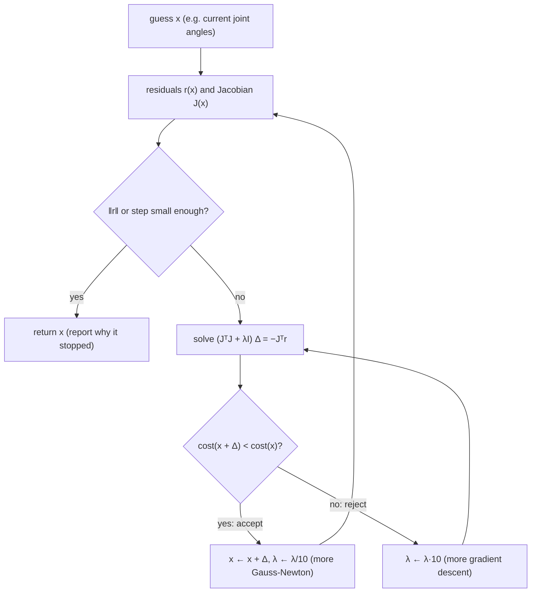

# FM.20 — Optimization for robotics and ML: gradient descent to nonlinear least squares

<!-- glance:start -->
<!-- generated by tools/build.py from curriculum/syllabus.yaml — edit the syllabus, not this block -->

| | |
|---|---|
| **Track** | Optional foundation |
| **Difficulty** | Intermediate |
| **Time** | 1 h 15 min |
| **Hardware** | none |
| **Software** | python, numpy, scipy |
| **Prerequisites** | [FM.19 Linear systems and least squares](FM.19-linear-systems-least-squares.md)<br>[FM.17 Calculus for robots: derivatives, rates and partial derivatives](FM.17-derivatives.md) |
| **Skip if** | You understand gradient descent and Gauss-Newton. |

<!-- glance:end -->

## What you will learn

- Turn a robotics task (reach a target, find a pose from ranges, fit a model) into a cost function to minimize.
- Implement gradient descent, choose a learning rate, and predict when it will diverge.
- Solve nonlinear least-squares problems with Gauss-Newton by repeatedly linearizing with the Jacobian.
- Make Gauss-Newton robust with Levenberg-Marquardt damping, and explain what λ does.
- Recognize local minima, multiple solutions and unreachable targets, and use `scipy.optimize.least_squares` in practice.

## Why it matters

Many robotics questions have no formula for the answer, only a way to *score* a candidate. "Which joint angles put the gripper at (0.15, 0.10) m?" has no simple closed form for most arms, but for any guess you can compute how far the gripper is from the target. "Where is the robot, given ranges to three beacons?" — for any guessed position you can compute how badly the predicted ranges disagree with the measured ones. Optimization turns a score into an answer by improving the guess step by step.

This lesson's three algorithms are everywhere later: numerical inverse kinematics ([14.05](../../14-robotic-arm/14.05-inverse-kinematics.md)) is Gauss-Newton/LM on joint angles; ICP scan matching ([11.04](../../11-slam/11.04-scan-matching-icp.md)) and pose-graph SLAM ([11.05](../../11-slam/11.05-pose-graphs-loop-closure.md)) are nonlinear least squares over poses (SLAM Toolbox uses the Ceres solver, which is LM); model predictive control ([FCT.06](../control-theory/FCT.06-state-space-lqr-mpc.md)) solves an optimization every control cycle; and every neural network is trained by gradient descent ([FML.05](../machine-learning/FML.05-gradient-descent.md)). You need linear least squares ([FM.19](FM.19-linear-systems-least-squares.md)) and Jacobians ([FM.17](FM.17-derivatives.md)).

<!-- prereqs:start -->
## Prerequisites

You need these first:

- [FM.19 Linear systems and least squares](FM.19-linear-systems-least-squares.md)
- [FM.17 Calculus for robots: derivatives, rates and partial derivatives](FM.17-derivatives.md)

### Optional prerequisite links

None.

Check your readiness: `python course.py why FM.20`
<!-- prereqs:end -->

## Concept

**A cost function is a single number that says how bad a candidate is.** For inverse kinematics: the squared distance between where the gripper would be and where you want it. Zero means perfect. The job is to find the input that makes the cost as small as possible — like finding the lowest point of a landscape while standing in fog, feeling only the ground under your feet.

**Gradient descent: walk downhill.** The gradient ([FM.17](FM.17-derivatives.md)) points uphill, so take a step in the opposite direction, scaled by a **learning rate**. Repeat. It needs only first derivatives, is trivial to implement, and scales to millions of parameters — which is why neural networks use it. Its weaknesses: too small a step crawls, too large a step overshoots and can explode, and in long narrow valleys (parameters with very different sensitivities) it zigzags slowly.

**Gauss-Newton: use the structure of least squares.** When the cost is a sum of squared residuals, you can do much better than "walk downhill". Linearize the residuals around the current guess with the Jacobian, and the problem becomes a *linear* least-squares problem — which [FM.19](FM.19-linear-systems-least-squares.md) solves exactly in one shot. Solve it, move there, re-linearize, repeat. Near the answer this converges extremely fast: the arm IK below takes 5 iterations instead of about 200.

**Its weakness is trusting the linearization too much.** Far from the answer, or near a singularity (arm stretched out, target out of reach), the linear model is poor and Gauss-Newton can take absurd jumps — joint angles spinning through thousands of degrees.

**Levenberg-Marquardt: Gauss-Newton with a trust dial.** Add a damping term λ. Small λ → behaves like Gauss-Newton (fast, trusting). Large λ → behaves like a short gradient-descent step (slow, safe). After each step: if the cost went down, trust more (decrease λ); if it went up, reject the step and trust less (increase λ). It's the default nonlinear least-squares solver in robotics libraries for exactly this reason.

**Optimization finds *a* minimum, not necessarily *the* one.** A 2-link arm usually reaches a point in two ways (elbow up, elbow down). Which one you get depends on where you start. Cost landscapes with several valleys need a good initial guess — in SLAM that is odometry; in IK, the current joint angles.

> [!TIP]
> **Ask your teacher:** "Run one Gauss-Newton step and one Levenberg-Marquardt step by hand on a 1D range measurement, and show me how λ moves the step between the Gauss-Newton step and a gradient step."

## Technical explanation

### Level 1 — Cost functions and gradient descent

Minimize $f(\mathbf{x})$. Gradient descent with learning rate $\eta$:

$$\mathbf{x}_{k+1} = \mathbf{x}_k - \eta\,\nabla f(\mathbf{x}_k)$$

**Numerical example.** $f(x) = 2(x-3)^2$, so $f'(x) = 4(x-3)$. From $x_0 = 0$ with $\eta = 0.1$: $f'(0) = -12$, $x_1 = 0 - 0.1 \cdot (-12) = 1.2$; then $x_2 = 1.2 + 0.1 \cdot 7.2 = 1.92$. The error shrinks by a factor $1 - 4\eta = 0.6$ per step.

**Why learning rates diverge.** For a quadratic $f(\mathbf{x}) = \frac{1}{2}\mathbf{x}^\top H\mathbf{x}$ the update is $\mathbf{x}_{k+1} = (I - \eta H)\mathbf{x}_k$. Along each eigen-direction of $H$ with curvature $\lambda_i$ the error is multiplied by $(1 - \eta\lambda_i)$. Convergence requires $|1 - \eta\lambda_i| < 1$ for all $i$:

$$0 < \eta < \frac{2}{\lambda_\text{max}}$$

— the same stability condition as Euler integration in [FM.18](FM.18-integrals-numerical-integration.md) (gradient descent *is* Euler integration of $\dot{\mathbf{x}} = -\nabla f$). The speed is limited by the *flattest* direction: the factor there is $1 - \eta\lambda_\text{min}$. With curvatures 1 and 10 you must keep $\eta < 0.2$ (because of the 10) and then the curvature-1 direction shrinks by at best $1 - 0.2 = 0.8$ per step. The ratio $\lambda_\text{max}/\lambda_\text{min}$ (the condition number again) sets how slow gradient descent is. The program shows: $\eta = 0.05$ needs 270 iterations, $\eta = 0.10$ and $0.19$ both need 132 (worst factor 0.9 in each case: the flat direction at 0.10, the oscillating steep direction $|1 - 1.9|$ at 0.19), $\eta = 0.21$ diverges.

### Level 2 — Nonlinear least squares and Gauss-Newton

Many robotics costs have the form

$$F(\mathbf{x}) = \frac{1}{2}\|\mathbf{r}(\mathbf{x})\|^2 = \frac{1}{2}\sum_i r_i(\mathbf{x})^2$$

with residuals $\mathbf{r}$: predicted minus desired/measured. With the Jacobian $J = \partial\mathbf{r}/\partial\mathbf{x}$, the gradient is $\nabla F = J^\top\mathbf{r}$.

**Gauss-Newton.** Linearize $\mathbf{r}(\mathbf{x} + \boldsymbol\Delta) \approx \mathbf{r} + J\boldsymbol\Delta$ and minimize $\frac{1}{2}\|\mathbf{r} + J\boldsymbol\Delta\|^2$ over $\boldsymbol\Delta$ — a linear least-squares problem whose normal equations are

$$J^\top J\,\boldsymbol\Delta = -J^\top\mathbf{r}, \qquad \mathbf{x} \leftarrow \mathbf{x} + \boldsymbol\Delta$$

$J^\top J$ approximates the curvature (Hessian) of $F$, using only first derivatives. Near a solution with small residuals, convergence is roughly *quadratic*: the number of correct digits doubles each iteration.

**Numerical example — one range measurement.** A beacon at $(0, 1)$ m; the robot is somewhere on the x-axis at $(x, 0)$; the measured range is 2.0 m. Residual $r(x) = \sqrt{x^2 + 1} - 2$, derivative $J = x/\sqrt{x^2+1}$. From $x_0 = 1$: $r = \sqrt2 - 2 = -0.5858$, $J = 0.7071$, GN step $\Delta = -r/J = 0.8284$ → $x_1 = 1.8284$. The true answer is $\sqrt3 = 1.7321$: one step went from 0.73 m error to 0.10 m.

**Numerical example — inverse kinematics.** 2-link arm, $l_1 = 0.12$ m, $l_2 = 0.10$ m, target $\mathbf{p} = (0.15, 0.10)$ m, residual $\mathbf{r}(\mathbf{q}) = \text{fk}(\mathbf{q}) - \mathbf{p}$, Jacobian from [FM.17](FM.17-derivatives.md). From $\mathbf{q}_0 = (10°, 10°)$, stopping at 1 µm:

| method | iterations | solution |
|---|---|---|
| gradient descent, η = 20 | 196 | (2.21°, 70.27°) |
| gradient descent, η = 60 | no convergence in 20,000 | — |
| Gauss-Newton | 5 | (65.17°, −70.28°) |
| Levenberg-Marquardt | 5 | (2.21°, 70.28°) |

(The learning rates look huge because the arm is small: $J^\top J$ has entries around 0.01–0.05 m², so $2/\lambda_\text{max} \approx 35$ at the start.) Gauss-Newton's *first* step was (−118°, +294°): a giant jump that happened to land in the other solution branch, elbow-down. Both are valid IK solutions; the jump shows how little Gauss-Newton cares about staying near the start.

### Level 3 — Levenberg-Marquardt

$$\left(J^\top J + \lambda I\right)\boldsymbol\Delta = -J^\top\mathbf{r}$$

- $\lambda \to 0$: the Gauss-Newton step.
- $\lambda$ large: $\boldsymbol\Delta \approx -\frac{1}{\lambda}J^\top\mathbf{r}$, a short gradient-descent step.
- Adaptation: if $F(\mathbf{x} + \boldsymbol\Delta) < F(\mathbf{x})$ accept the step and divide λ by 10; otherwise reject and multiply λ by 10. (Real implementations use a gain ratio and scale by $\operatorname{diag}(J^\top J)$, but the idea is identical.)

The damping also makes $J^\top J + \lambda I$ invertible when $J^\top J$ is singular — it is exactly damped least squares for arm Jacobians ([14.06](../../14-robotic-arm/14.06-jacobian.md)).

**Numerical example — the same 1D range problem with λ = 0.5.** $\Delta = -Jr/(J^2 + \lambda) = 0.4142/(0.5 + 0.5) = 0.4142$ → $x_1 = 1.4142$. Smaller and more cautious than Gauss-Newton's 0.8284.

**Numerical example — an unreachable target.** Target (0.25, 0) m, but the arm reaches only 0.22 m. There is no zero-residual solution; the best is the stretched arm pointing at the target (residual 0.03 m). Gauss-Newton wanders for 50 iterations and ends at $q_2 = -2579.56°$ with residual 0.0588 m. Levenberg-Marquardt rejects bad steps, raises λ, and converges to (0°, 0°), tip (0.22, 0), residual 0.0300 m — the correct "closest you can get" answer.

### Level 4 — Practice

- **Use a library** for real work: `scipy.optimize.least_squares(fun, x0, jac=..., method="lm")` (or `"trf"` with bounds such as joint limits). Ceres (C++, used by SLAM Toolbox and Cartographer), g2o and GTSAM solve the huge sparse versions in SLAM.
- **Always supply or check the Jacobian.** Numerical Jacobians work but cost $n$ extra evaluations and are less accurate; a wrong analytic Jacobian silently slows or breaks convergence. Gradient-check it ([FM.17](FM.17-derivatives.md)).
- **Initialize well.** Nonlinear problems have multiple minima. Use the current joint angles for IK, odometry for scan matching and pose graphs.
- **Scale parameters and residuals.** Mixing meters and radians, or millimetres and meters, makes the problem ill-conditioned. Weight residuals by $1/\sigma$ so each counts according to its reliability (weighted least squares, [FM.19](FM.19-linear-systems-least-squares.md)).
- **Wrap angles** in residuals and parameters, or you get the 2579° solutions above.
- **Stop sensibly:** small residual, small step, small gradient, or iteration limit — and *report which one* fired, so "didn't converge" isn't mistaken for an answer.
- **Robust costs.** One outlier residual squared dominates the sum. Huber or Cauchy loss (`loss="huber"` in scipy) down-weights it — standard in scan matching.

## Diagram



```text
 Cost landscape of a badly conditioned problem (curvatures 1 and 10)

  x2 ▲        gradient descent zigzags across the steep direction
     │   ╭──────────────────────────────╮
     │  ╱  ●╲    ╱╲    ╱╲                ╲
     │ │      ╲  ╱  ╲  ╱  ╲  ╱╲  ── ── ─ ★ │   ★ = minimum
     │  ╲      ╲╱    ╲╱    ╲╱              ╱
     │   ╰──────────────────────────────╯
     └──────────────────────────────────────► x1
        Gauss-Newton uses curvature (JᵀJ) and heads almost straight for ★
```

## Code

Save as `fm20_optimization.py` and run `python fm20_optimization.py` (numpy + scipy). It compares learning rates on a quadratic, solves the 2-link IK with gradient descent, Gauss-Newton, Levenberg-Marquardt and scipy, shows two IK branches, and tests an unreachable target.

```python
"""fm20_optimization.py — gradient descent, Gauss-Newton and Levenberg-Marquardt on robot problems.

Run:  python fm20_optimization.py
Needs: numpy, scipy
"""
from __future__ import annotations

import math
from dataclasses import dataclass

import numpy as np
from scipy.optimize import least_squares

L1, L2 = 0.12, 0.10   # 2-link planar arm, link lengths [m]


def fk(q: np.ndarray) -> np.ndarray:
    return np.array([L1 * math.cos(q[0]) + L2 * math.cos(q[0] + q[1]),
                     L1 * math.sin(q[0]) + L2 * math.sin(q[0] + q[1])])


def jac(q: np.ndarray) -> np.ndarray:
    s1, c1 = math.sin(q[0]), math.cos(q[0])
    s12, c12 = math.sin(q[0] + q[1]), math.cos(q[0] + q[1])
    return np.array([[-L1 * s1 - L2 * s12, -L2 * s12],
                     [L1 * c1 + L2 * c12, L2 * c12]])


@dataclass
class Result:
    q: np.ndarray
    iterations: int
    residual_m: float
    converged: bool


def gradient_descent(target: np.ndarray, q0: np.ndarray, lr: float, max_iter: int = 20_000, tol: float = 1e-6) -> Result:
    q = q0.copy()
    for k in range(max_iter):
        r = fk(q) - target                      # residual [m]
        if np.linalg.norm(r) < tol:
            return Result(q, k, float(np.linalg.norm(r)), True)
        grad = jac(q).T @ r                     # gradient of 0.5*|r|^2
        q = q - lr * grad
    return Result(q, max_iter, float(np.linalg.norm(fk(q) - target)), False)


def gauss_newton(target: np.ndarray, q0: np.ndarray, max_iter: int = 50, tol: float = 1e-6) -> Result:
    q = q0.copy()
    for k in range(max_iter):
        r = fk(q) - target
        if np.linalg.norm(r) < tol:
            return Result(q, k, float(np.linalg.norm(r)), True)
        J = jac(q)
        try:
            step = np.linalg.solve(J.T @ J, -J.T @ r)
        except np.linalg.LinAlgError:
            return Result(q, k, float(np.linalg.norm(r)), False)
        q = q + step
    return Result(q, max_iter, float(np.linalg.norm(fk(q) - target)), False)


def levenberg_marquardt(target: np.ndarray, q0: np.ndarray, lam: float = 1e-3, max_iter: int = 200,
                        tol: float = 1e-6) -> Result:
    q = q0.copy()
    cost = 0.5 * np.sum((fk(q) - target) ** 2)
    for k in range(max_iter):
        r = fk(q) - target
        J = jac(q)
        g = J.T @ r
        if np.linalg.norm(r) < tol or np.linalg.norm(g) < 1e-12:
            return Result(q, k, float(np.linalg.norm(r)), np.linalg.norm(r) < tol)
        step = np.linalg.solve(J.T @ J + lam * np.eye(2), -g)
        new_cost = 0.5 * np.sum((fk(q + step) - target) ** 2)
        if new_cost < cost:          # accept: trust the quadratic model more
            q, cost, lam = q + step, new_cost, lam / 10
        else:                        # reject: behave more like gradient descent
            lam *= 10
    return Result(q, max_iter, float(np.linalg.norm(fk(q) - target)), False)


def learning_rates() -> None:
    print("1) Gradient descent on f(x) = 0.5*(x1^2 + 10*x2^2), start (1, 1): curvatures 1 and 10, so lr < 2/10")
    H = np.diag([1.0, 10.0])
    for lr in (0.05, 0.10, 0.19, 0.21):
        x = np.array([1.0, 1.0])
        for k in range(1, 2001):
            x = x - lr * (H @ x)
            if np.linalg.norm(x) < 1e-6 or np.linalg.norm(x) > 1e6:
                break
        status = "converged" if np.linalg.norm(x) < 1e-6 else ("DIVERGED" if np.linalg.norm(x) > 1e6 else "not yet")
        print(f"   lr={lr:4.2f}: {status:9s} after {k:4d} iterations, |x|={np.linalg.norm(x):.2e}")


def inverse_kinematics() -> None:
    target = np.array([0.15, 0.10])
    q0 = np.radians([10.0, 10.0])
    print(f"2) IK for target {target.tolist()} m from q0=(10 deg, 10 deg), stop when |residual| < 1 um")
    for name, res in (("gradient descent lr=20", gradient_descent(target, q0, lr=20.0)),
                      ("gradient descent lr=60", gradient_descent(target, q0, lr=60.0)),
                      ("Gauss-Newton          ", gauss_newton(target, q0)),
                      ("Levenberg-Marquardt   ", levenberg_marquardt(target, q0))):
        print(f"   {name}: iterations={res.iterations:5d}  converged={res.converged}  "
              f"q=({math.degrees(res.q[0]):7.2f}, {math.degrees(res.q[1]):7.2f}) deg  residual={res.residual_m:.1e} m")
    sp = least_squares(lambda q: fk(q) - target, q0, jac=jac, method="lm", xtol=1e-12, ftol=1e-12)
    print(f"   scipy least_squares(method='lm'): q=({math.degrees(sp.x[0]):7.2f}, {math.degrees(sp.x[1]):7.2f}) deg  "
          f"evaluations={sp.nfev}")

    J0, r0 = jac(q0), fk(q0) - target
    first = np.linalg.solve(J0.T @ J0, -J0.T @ r0)
    print(f"   Gauss-Newton's first step: ({math.degrees(first[0]):.1f}, {math.degrees(first[1]):.1f}) deg "
          f"-- a jump that lands in the other (elbow-down) solution branch")
    other = levenberg_marquardt(target, np.radians([90.0, -60.0]))
    print(f"   Levenberg-Marquardt from q0=(90, -60) deg: q=({math.degrees(other.q[0]):.2f}, "
          f"{math.degrees(other.q[1]):.2f}) deg, fk={fk(other.q).round(6).tolist()}")


def unreachable() -> None:
    target = np.array([0.25, 0.0])   # reach is only 0.22 m
    q0 = np.radians([10.0, 10.0])
    print(f"3) Unreachable target {target.tolist()} m (max reach {L1 + L2:.2f} m)")
    gn = gauss_newton(target, q0, max_iter=50)
    lm = levenberg_marquardt(target, q0, max_iter=200)
    print(f"   Gauss-Newton       : q=({math.degrees(gn.q[0]):9.2f}, {math.degrees(gn.q[1]):9.2f}) deg  "
          f"cond(J^T J)={np.linalg.cond(jac(gn.q).T @ jac(gn.q)):.1e}  residual={gn.residual_m:.4f} m")
    print(f"   Levenberg-Marquardt: q=({math.degrees(lm.q[0]):9.2f}, {math.degrees(lm.q[1]):9.2f}) deg  "
          f"residual={lm.residual_m:.4f} m  tip={fk(lm.q).round(4).tolist()}")


def main() -> None:
    learning_rates()
    inverse_kinematics()
    unreachable()


if __name__ == "__main__":
    main()
```

Output (numpy 2.x, scipy 1.x; deterministic):

```text
1) Gradient descent on f(x) = 0.5*(x1^2 + 10*x2^2), start (1, 1): curvatures 1 and 10, so lr < 2/10
   lr=0.05: converged after  270 iterations, |x|=9.67e-07
   lr=0.10: converged after  132 iterations, |x|=9.12e-07
   lr=0.19: converged after  132 iterations, |x|=9.12e-07
   lr=0.21: DIVERGED  after  145 iterations, |x|=1.00e+06
2) IK for target [0.15, 0.1] m from q0=(10 deg, 10 deg), stop when |residual| < 1 um
   gradient descent lr=20: iterations=  196  converged=True  q=(   2.21,   70.27) deg  residual=9.8e-07 m
   gradient descent lr=60: iterations=20000  converged=False  q=( -23.54,   75.75) deg  residual=7.2e-02 m
   Gauss-Newton          : iterations=    5  converged=True  q=(  65.17,  -70.28) deg  residual=7.4e-07 m
   Levenberg-Marquardt   : iterations=    5  converged=True  q=(   2.21,   70.28) deg  residual=1.8e-10 m
   scipy least_squares(method='lm'): q=(   2.21,   70.28) deg  evaluations=9
   Gauss-Newton's first step: (-118.3, 294.5) deg -- a jump that lands in the other (elbow-down) solution branch
   Levenberg-Marquardt from q0=(90, -60) deg: q=(65.17, -70.28) deg, fk=[0.15, 0.1]
3) Unreachable target [0.25, 0.0] m (max reach 0.22 m)
   Gauss-Newton       : q=(    27.18,  -2579.56) deg  cond(J^T J)=1.8e+01  residual=0.0588 m
   Levenberg-Marquardt: q=(    -0.00,      0.00) deg  residual=0.0300 m  tip=[0.22, 0.0]
```

## Exercise

All exercises need hardware: **none**. (In [14.05](../../14-robotic-arm/14.05-inverse-kinematics.md) you'll run E5's solver on the simulated arm and then on the `arm`.)

### Exercise FM.20-E1 — Gradient descent by hand `[numerical]`

Goal: compute steps and the stability limit.
For $f(x) = 2(x - 3)^2$: (a) compute $x_1, x_2, x_3$ from $x_0 = 0$ with $\eta = 0.1$; (b) what is the largest learning rate that still converges; (c) what happens with $\eta = 0.25$, and with $\eta = 0.6$ (give $x_1$ and $x_2$)?

### Exercise FM.20-E2 — Which learning rates diverge? `[predict]`

Goal: connect curvature, learning rate and speed.
For $f = \frac{1}{2}(x_1^2 + 10x_2^2)$ from $(1, 1)$, **predict before running**: (a) which of η = 0.05, 0.10, 0.19, 0.21 diverge; (b) why η = 0.10 and η = 0.19 take the *same* number of iterations; (c) roughly how many iterations η = 0.15 needs. Then add 0.15 to the list in `learning_rates()` and run it.

### Exercise FM.20-E3 — Localize from three beacon ranges `[coding]`

Goal: implement Gauss-Newton for trilateration.
UWB beacons at $(0, 0)$, $(3, 0)$ and $(0, 4)$ m. Residuals $r_i(\mathbf{p}) = \|\mathbf{p} - \mathbf{b}_i\| - z_i$, Jacobian rows $(\mathbf{p} - \mathbf{b}_i)^\top/\|\mathbf{p} - \mathbf{b}_i\|$. Starting at $(2, 2)$: (a) with exact ranges from the true position $(1.2, 2.0)$, report the ranges and the iterations until the step is below 1e-10; (b) with measured ranges $z = (2.34, 2.68, 2.33)$ m, report the estimate, the residuals and the distance to the true position. Check (b) with `scipy.optimize.least_squares`.

### Exercise FM.20-E4 — One Gauss-Newton and one LM step `[numerical]`

Goal: see λ interpolate between two behaviours.
Beacon at $(0, 1)$, robot at $(x, 0)$, measured range 2.0 m, start $x_0 = 1$. Compute by hand (a) the Gauss-Newton step and $x_1$; (b) the LM step with λ = 0.5; (c) the LM step with λ = 100 and compare it to $-\frac{1}{\lambda}J r$ (a gradient step); (d) the true solution.

### Exercise FM.20-E5 — The IK solver that returns −2579° `[debugging]`

Goal: make an IK solver safe for a real arm.
Using `gauss_newton` from the program, a teammate's arm demo commands target (0.25, 0) m and the solver returns $q_2 = -2579.56°$ with `converged=False`, which their code ignores and sends to the servos. (a) Why does Gauss-Newton behave this way here? (b) List three changes to the solver/caller that would prevent this reaching the arm. (c) Show that `levenberg_marquardt` gives a sensible answer and what it is.

## Expected result

- **FM.20-E1:** (a) $x_1 = 1.2$, $x_2 = 1.92$, $x_3 = 2.352$ (error × 0.6 each step); (b) curvature $f'' = 4$, so $\eta < 2/4 = 0.5$; (c) $\eta = 0.25$: factor $1 - 1 = 0$, $x_1 = 3$ exactly in one step. $\eta = 0.6$: factor $-1.4$, $x_1 = 7.2$, $x_2 = -2.88$ — oscillating divergence.
- **FM.20-E2:** (a) only 0.21 diverges ($> 2/10$); (b) the per-step factors are $|1 - \eta|$ (flat) and $|1 - 10\eta|$ (steep): 0.9 and 0 at η = 0.10, 0.81 and 0.9 at η = 0.19. The slowest factor is 0.9 in both cases, so both need 132 iterations — at 0.19 the steep direction oscillates slowly instead of the flat one crawling. (c) η = 0.15: factors 0.85 and 0.5, slowest 0.85; $\ln(10^{-6}/\sqrt2)/\ln 0.85 \approx 87$, and the program prints 86.
- **FM.20-E3:** (a) ranges (2.3324, 2.6907, 2.3324) m; converges to (1.200000, 2.000000) in 4–5 iterations. (b) estimate ≈ (1.2117, 2.0031) m, residuals ≈ (0.0011, 0.0053, 0.0057) m, RMS 4.5 mm, 12 mm from the true position; scipy agrees to < 0.1 mm.
- **FM.20-E4:** $r = -0.5858$, $J = 0.7071$. (a) $\Delta = 0.8284$, $x_1 = 1.8284$; (b) $\Delta = -Jr/(J^2 + 0.5) = 0.4142$, $x_1 = 1.4142$; (c) $\Delta = 0.4142/100.5 = 0.00412$ vs gradient step $0.4142/100 = 0.00414$ — nearly identical; (d) $x = \sqrt3 = 1.7321$ m.
- **FM.20-E5:** (a) no exact solution exists; near the stretched configuration $J^\top J$ is nearly singular in one direction and the linearization predicts large improvements from huge joint moves that don't materialize, so plain Gauss-Newton (no step acceptance test) keeps jumping. (b) Any three of: check reachability ($\|\mathbf{p}\| \le l_1 + l_2$) before solving; use LM or a step-acceptance/line-search; wrap angles to $(-\pi, \pi]$; clamp step size; never send a result with `converged=False`; enforce joint limits (e.g. scipy `method="trf"` with bounds). (c) LM returns $q \approx (0°, 0°)$, tip (0.22, 0) m, residual 0.0300 m — the closest reachable point.

## Troubleshooting

### Symptom: gradient descent makes no progress, or the cost goes up

1. Print the cost every iteration. Increasing or oscillating → learning rate too large; halve it until the cost decreases monotonically.
2. Decreasing but extremely slowly → badly conditioned: rescale parameters to similar units, or switch to Gauss-Newton/LM (for least squares) or an adaptive method like Adam (for ML, [FML.05](../machine-learning/FML.05-gradient-descent.md)).
3. Gradient-check your gradient with central differences. A wrong sign makes the cost increase at any learning rate.

### Symptom: Gauss-Newton or LM converges to a wrong or strange answer

1. Check the residual at the result. Nonzero and the problem should have an exact solution → local minimum or wrong branch: try several starting points.
2. Angles far outside $(-\pi, \pi]$ → wrap them; they may be correct modulo 2π.
3. Check Jacobian columns numerically; a wrong Jacobian can still "converge", slowly, to the wrong point.
4. Check the data: one bad measurement (an outlier range) pulls the whole solution. Look at individual residuals and try a robust loss.

### Symptom: `LinAlgError: Singular matrix` inside the solver

$J^\top J$ is singular: fewer independent residuals than parameters (e.g. two beacons for a 2D position that are collinear with the robot), or a kinematic singularity. Use LM (λ > 0), add measurements, or fix the parameterization.

## Common mistakes

- **Ignoring the "converged" flag** and using whatever the solver returned.
- **A fixed learning rate copied from an example** without checking curvature: η that works for one scale diverges for another (η = 20 vs 60 above).
- **Plain Gauss-Newton without step acceptance** in production code. Use LM or a line search.
- **Unwrapped angle residuals**: a bearing error of $2\pi - 0.01$ is really −0.01.
- **Mixing units in parameters** (mm and rad) without scaling.
- **Expecting the global minimum.** Local methods find the valley you start in. Initialize from odometry or the current state.

## Knowledge check

1. Write the gradient-descent update and the condition on η for a quadratic with largest curvature $\lambda_\text{max}$.
   <details><summary>Answer</summary>

   $\mathbf{x} \leftarrow \mathbf{x} - \eta\nabla f(\mathbf{x})$; converges for $0 < \eta < 2/\lambda_\text{max}$.
   </details>

2. For $F = \frac{1}{2}\|\mathbf{r}\|^2$, what are the gradient and the Gauss-Newton step?
   <details><summary>Answer</summary>

   $\nabla F = J^\top\mathbf{r}$. Gauss-Newton: solve $J^\top J\,\boldsymbol\Delta = -J^\top\mathbf{r}$.
   </details>

3. What does λ do in Levenberg-Marquardt, at both extremes?
   <details><summary>Answer</summary>

   λ → 0: pure Gauss-Newton step (fast near the solution). λ → ∞: a tiny step along the negative gradient, $-\frac{1}{\lambda}J^\top\mathbf{r}$ (slow but safe). λ is decreased after successful steps and increased after failed ones.
   </details>

4. Predict: you run 2-link IK from $q_0 = (10°, 10°)$ and from $q_0 = (90°, -60°)$ for the same target. What might differ?
   <details><summary>Answer</summary>

   The solution branch: elbow-up vs elbow-down, both with zero residual. The program shows LM reaching (2.21°, 70.28°) from the first start and (65.17°, −70.28°) from the second.
   </details>

5. Why is gradient descent slow on problems whose parameters have very different sensitivities?
   <details><summary>Answer</summary>

   η must be below $2/\lambda_\text{max}$ to stay stable in the steep direction, so the flat direction (curvature $\lambda_\text{min}$) shrinks only by $1 - \eta\lambda_\text{min}$ per step. Iterations grow roughly with the condition number $\lambda_\text{max}/\lambda_\text{min}$.
   </details>

6. How is pose-graph SLAM an instance of this lesson?
   <details><summary>Answer</summary>

   The unknowns are all robot poses; each odometry or loop-closure constraint gives a residual (predicted relative pose minus measured), weighted by its inverse covariance. The back-end minimizes the sum of squared weighted residuals with Gauss-Newton/LM, exploiting the sparse $J^\top J$ ([11.05](../../11-slam/11.05-pose-graphs-loop-closure.md)).
   </details>

7. Debugging: your trilateration solver works in tests but returns a position 3 m away on the robot, with small residuals. Beacons are at (0,0), (5,0) and (10,0). What's wrong?
   <details><summary>Answer</summary>

   All beacons are collinear, so the problem has two mirror-image solutions (above and below the line), both with the same small residuals. The solver found the mirror one from its initial guess. Add a non-collinear beacon, or initialize on the correct side (e.g. from odometry).
   </details>

## Practical challenge

Write a numerical IK solver for a planar 3-link arm (0.12, 0.10, 0.06 m) that is safe to send to hardware.

Acceptance criteria:
- `solve_ik(target_xy, target_angle, q_current, limits) -> IKResult` minimizes position error (m) and end-effector angle error (rad, wrapped), weighted so that 1 cm ≈ 5°.
- Uses LM (your own or `scipy.optimize.least_squares` with `method="trf"` and joint-limit bounds of ±150°), starts from `q_current`, and returns `converged`, the final residuals and the reason it stopped.
- On 1,000 random reachable targets (generated from random valid joint angles, `np.random.default_rng(seed=20)`), converges on ≥ 98% with position error < 1 mm, and the returned joint angles are within limits every time.
- For 100 random unreachable targets, never reports `converged=True`, and returns the closest reachable pose.
- Reports median iterations and median solve time on your machine.

## You can skip this if…

You answer knowledge-check questions 2, 3, 5 and 7 correctly without looking, and you can write a Levenberg-Marquardt loop from memory. Then:

`python course.py skip FM.20 --reason "understand gradient descent, Gauss-Newton and LM"`

## Go deeper

- https://www2.imm.dtu.dk/pubdb/pubs/3215-full.html — Madsen, Nielsen, Tingleff, *Methods for Non-Linear Least Squares Problems* (DTU lecture notes, 60 pages, free PDF): the clearest derivation of Gauss-Newton and Levenberg-Marquardt with the gain-ratio λ update.
- https://docs.scipy.org/doc/scipy/reference/generated/scipy.optimize.least_squares.html — `scipy.optimize.least_squares`: `lm`, `trf` (with bounds), robust losses, Jacobian options.
- https://cs231n.github.io/optimization-1/ — Stanford CS231n notes on optimization: gradient descent, learning rates and gradient checking from the ML side.
- https://modernrobotics.northwestern.edu/nu-gm-book-resource/6-2-numerical-inverse-kinematics-part-1-of-2/ — *Modern Robotics* video 6.2: Newton-Raphson numerical inverse kinematics with the Jacobian pseudo-inverse.
- https://www.cs.cmu.edu/~kaess/pub/Dellaert17fnt.pdf — Dellaert & Kaess, *Factor Graphs for Robot Perception*: how SLAM becomes large sparse nonlinear least squares solved with Gauss-Newton/LM.
- https://web.stanford.edu/~boyd/cvxbook/ — Boyd & Vandenberghe, *Convex Optimization* (free PDF): the theory behind MPC and when a problem has a single global minimum.

## Progress checkpoint

- [ ] I can express IK, trilateration and calibration as cost functions with residuals.
- [ ] I can implement gradient descent and choose a stable learning rate from the curvature.
- [ ] I can implement Gauss-Newton and explain its fast convergence and failure modes.
- [ ] I can implement Levenberg-Marquardt, explain λ, and use `scipy.optimize.least_squares`.
- [ ] I can handle multiple solutions, unreachable targets and non-convergence safely.

`python course.py complete FM.20` (exercises done) · `python course.py master FM.20` (challenge done) · `python course.py struggle FM.20 "what was hard"`

Next: [FM.21 — Statistics for robot experiments: mean, spread, RMSE, outliers](FM.21-statistics-for-experiments.md).
