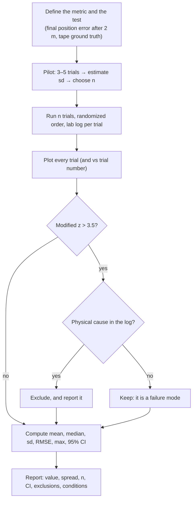

# FM.21 — Statistics for robot experiments: mean, spread, RMSE, outliers

<!-- glance:start -->
<!-- generated by tools/build.py from curriculum/syllabus.yaml — edit the syllabus, not this block -->

| | |
|---|---|
| **Track** | Optional foundation |
| **Difficulty** | Beginner |
| **Time** | 45 min |
| **Hardware** | none |
| **Software** | python, numpy, scipy |
| **Prerequisites** | [FM.14 Distributions, Gaussians, uncertainty and noise](FM.14-distributions-gaussians-noise.md) |
| **Skip if** | You report experiment results with spread and trial counts. |

<!-- glance:end -->

## What you will learn

- Summarize repeated robot trials with mean, median, standard deviation, RMSE and max — and pick the right one for the question.
- Split an error into bias and spread, and check the decomposition $\text{RMSE}^2 = \text{bias}^2 + \sigma^2$.
- Detect outliers with the median absolute deviation instead of silently deleting inconvenient trials.
- Put a 95% confidence interval on a mean with the t-distribution, and verify its coverage by simulation.
- Decide how many trials you need, compare "before vs after", and report a result someone else can trust.

## Why it matters

"I calibrated the odometry and it's much better now" is not a result. "Final position error after a 2 m drive: 0.98 cm mean (sd 0.23, n = 10, 95% CI 0.82–1.14 cm), down from 3.13 cm (sd 0.52, n = 9, one trial excluded: wheel caught cable)" is. Robots are noisy; any single run can be lucky or unlucky. Deciding whether a change helped — a new PID gain, a calibration, a different localization parameter, a retrained policy — needs a handful of repeated trials and the few statistics in this lesson.

You'll use this every time you characterize a sensor ([07.01](../../07-sensors/07.01-sensor-fundamentals.md)), calibrate odometry with repeated square runs ([09.05](../../09-odometry/09.05-calibrating-odometry.md)), and evaluate localization, navigation and learned policies in later modules. It is also the discipline behind ML evaluation in the FML track. You need mean, σ and the Gaussian from [FM.14](FM.14-distributions-gaussians-noise.md).

<!-- prereqs:start -->
## Prerequisites

You need these first:

- [FM.14 Distributions, Gaussians, uncertainty and noise](FM.14-distributions-gaussians-noise.md)

### Optional prerequisite links

None.

Check your readiness: `python course.py why FM.21`
<!-- prereqs:end -->

## Concept

**Repeat, don't anecdote.** Drive karmel 2 m straight ten times and measure where it really stops versus where odometry says it is. You get ten error numbers, not one. The question is always: what do these ten numbers say about the *next* hundred runs?

**Center: mean or median.** The mean (average) uses every value and is what the math likes. The median (middle value) ignores how extreme the extremes are. If one trial is wild — the wheel caught the charging cable and the error was 15.8 cm — the mean jumps from 3.1 to 4.4 cm while the median stays at 3.3 cm. When they disagree a lot, look at the data before believing either.

**Spread: standard deviation.** How much trials differ from each other. It predicts how far a single future run is likely to land from the typical one. It is *not* the uncertainty of the mean — that's much smaller and shrinks with more trials.

**Accuracy in one number: RMSE.** Root-mean-square error squares each error, averages, and takes the root. It punishes big errors, is in the same units as the error, and is the standard metric for "how far off is the estimate" in localization, SLAM and ML. It mixes two things you often want to separate: **bias** (consistently off in one direction — fix with calibration) and **spread** (randomly off — fix with better sensors or filtering). For signed errors, $\text{RMSE}^2 = \text{bias}^2 + \sigma^2$ exactly.

**Outliers: explain before excluding.** A trial far from the rest might be a real failure mode your robot will hit again (then it belongs in the report) or an experimental accident (then exclude it *and say so*). Use a robust rule to flag candidates — the median absolute deviation doesn't get dragged by the outlier itself — and keep a lab log so you can tell which is which.

**Confidence interval: how well do ten trials pin down the mean?** If you repeated the whole 10-trial experiment many times, a 95% confidence interval computed each time would contain the true mean in 95% of experiments. With few trials, you must widen it using the t-distribution; with n = 3 the usual "±1.96 standard errors" is badly overconfident (81% coverage instead of 95%, as the simulation shows).

**Before vs after.** If the confidence intervals don't overlap and the difference matters physically, the change almost certainly helped. When they overlap, a proper test (Welch's t-test) or more trials settles it. And a statistically significant 1 mm improvement may still be irrelevant for a robot that navigates with 5 cm tolerance.

> [!TIP]
> **Ask your teacher:** "I have 10 trials before and 10 after a PID change. Walk me through what to compute, what to plot, and exactly what sentence to write in my report."

## Technical explanation

### Level 1 — Center, spread and max

For $n$ trial errors $e_1, \dots, e_n$:

$$\bar e = \frac{1}{n}\sum e_i, \qquad s = \sqrt{\frac{1}{n-1}\sum (e_i - \bar e)^2}, \qquad \text{RMSE} = \sqrt{\frac{1}{n}\sum e_i^2}, \qquad \text{MAE} = \frac{1}{n}\sum |e_i|$$

The median is the middle sorted value (average of the two middle ones for even $n$). Report the **max** too when safety matters: a navigation stack with 3 cm mean error and 40 cm worst case hits doorframes.

**Numerical example — karmel before calibration.** Final position errors $\|(\Delta x, \Delta y)\|$ after a 2 m straight run, in cm: 3.32, 2.53, 3.83, 3.26, 3.61, 2.22, **15.82**, 3.31, 2.77, 3.31.

| | all 10 trials | trial 7 excluded (n = 9) |
|---|---|---|
| mean | 4.40 | 3.13 |
| median | 3.31 | 3.31 |
| sd | 4.04 | 0.52 |
| RMSE | 5.84 | 3.17 |
| max | 15.82 | 3.83 |

One trial changes the sd by 8× and the RMSE by 1.8×. The median doesn't move.

### Level 2 — Bias, spread and RMSE

For signed errors (e.g. along-track error $\Delta x$, positive = odometry over-reports):

$$\text{RMSE}^2 = \bar e^2 + \sigma^2, \qquad \sigma^2 = \frac{1}{n}\sum(e_i - \bar e)^2$$

(the identity uses the $1/n$ variance; with $n-1$ it's approximately true).

**Numerical example.** Along-track errors before calibration (trial 7 out): bias +2.99 cm, σ 0.48 cm, RMSE $\sqrt{2.99^2 + 0.48^2} = 3.03$ cm — almost entirely bias, the signature of a wrong wheel radius ([FM.19](FM.19-linear-systems-least-squares.md)). After calibration: bias +0.08, σ 0.53, RMSE 0.54 cm — bias gone, the remaining spread is slip and measurement noise. Calibration can't reduce σ; only mechanics, sensors or filtering can.

**Trajectory RMSE.** For a whole run, compute RMSE over time samples of the position error, $\sqrt{\frac{1}{T}\sum_t \|\hat{\mathbf{p}}_t - \mathbf{p}_t\|^2}$ (the "absolute trajectory error" used in SLAM benchmarks), then summarize that number across trials exactly as above.

### Level 3 — Outliers and robust statistics

The **median absolute deviation** $\text{MAD} = \operatorname{median}(|e_i - \operatorname{median}(e)|)$ is a spread measure that ignores extremes. The **modified z-score** (Iglewicz and Hoaglin, recommended in the NIST handbook):

$$M_i = \frac{0.6745\,(e_i - \tilde e)}{\text{MAD}}, \qquad |M_i| > 3.5 \Rightarrow \text{potential outlier}$$

**Numerical example.** For the before-calibration errors, median 3.31, MAD 0.41, and trial 7 has $M = 20.3$; every other trial is within ±1.8. The ordinary z-score is a poor detector for small samples because the outlier inflates the sd it is divided by: here $(15.82 - 4.40)/4.04 = 2.8$, below the usual 3.

**The rule for excluding:** flag with a robust score, check the lab log, exclude only with a physical reason you can state, and report both the exclusion and the numbers with it included. If there's no explanation, the outlier is data about your robot.

### Level 4 — Confidence intervals, comparisons and sample size

**Standard error of the mean:** $\text{SE} = s/\sqrt{n}$. The 95% confidence interval for the mean is

$$\bar e \pm t_{0.975,\,n-1}\,\frac{s}{\sqrt n}$$

where $t_{0.975,\,n-1}$ comes from the t-distribution: 4.303 for n = 3, 2.306 for n = 9, 2.262 for n = 10, 2.045 for n = 30, → 1.96 as n grows (`scipy.stats.t.ppf(0.975, n - 1)`).

**Numerical example.** After calibration: $\bar e = 0.98$, $s = 0.23$, n = 10 → $0.98 \pm 2.262 \cdot 0.23/\sqrt{10} = 0.98 \pm 0.16$ → [0.82, 1.14] cm. Before (n = 9): $3.13 \pm 2.306 \cdot 0.52/3 = 3.13 \pm 0.40$ → [2.73, 3.53] cm. No overlap; Welch's t-test gives t = 11.5, p = 2.5e-7. The improvement is real and large (about 2.2 cm).

**Coverage by simulation** (true mean 3.0, sd 0.6, 20,000 simulated experiments each):

| n | coverage using t | coverage using 1.96 | average CI half-width |
|---|---|---|---|
| 3 | 0.951 | **0.814** | 1.32 cm |
| 10 | 0.951 | 0.918 | 0.42 cm |
| 30 | 0.950 | 0.941 | 0.22 cm |

The t interval does what it promises; the naive one doesn't for small n. The interval shrinks roughly as $1/\sqrt n$: to halve it you need four times the trials.

**How many trials?** Solve $t \cdot s/\sqrt n \le$ desired half-width. With $s \approx 0.5$ cm and ±0.2 cm wanted: $n \approx (2 \cdot 0.5/0.2)^2 = 25$. Do 3–5 pilot trials to estimate $s$ first.

**Assumptions.** t-intervals assume independent trials and roughly Gaussian errors. Distances (always positive, skewed) with n = 5 give lower coverage; the bootstrap (resample your trials with replacement, recompute the statistic, take percentiles) is a practical alternative, e.g. a CI for the median: after calibration, median 1.03 cm, bootstrap 95% CI [0.77, 1.14] cm. Independence fails if trials drift (battery draining, floor warming): randomize order and plot errors against trial number.

**Zero failures.** 0 collisions in $n$ trials does not mean "never collides". The 95% upper bound on the rate is about $3/n$ (the *rule of three*): 30% for n = 10, 10% for n = 30, 3% for n = 100.

## Diagram



```text
 Bias vs spread (errors dx of 10 trials, true position at 0)

 before calibration:                 ●●●●●●●●●            bias +3.0 cm, sd 0.5 cm → RMSE 3.0
 after calibration :   ● ●●●●●●● ●                        bias +0.1 cm, sd 0.5 cm → RMSE 0.5
                    ───┼───────────┼───────────┼──────► dx [cm]
                      −1           0   1   2   3   4
                                   ▲ truth

 95% CI of the mean final error:  before [2.73 ├────●────┤ 3.53]
                                  after  [0.82 ├─●─┤ 1.14]        no overlap → real improvement
```

## Code

Save as `fm21_statistics.py` and run `python fm21_statistics.py` (numpy + scipy). It summarizes the 10 before/after trials, flags the outlier, decomposes RMSE, runs Welch's t-test, checks confidence-interval coverage by simulation, bootstraps a median CI, and prints rule-of-three bounds.

```python
"""fm21_statistics.py — reporting a robot experiment: 10 odometry trials, RMSE, outliers, confidence intervals.

Run:  python fm21_statistics.py
Needs: numpy, scipy
"""
from __future__ import annotations

import math
from dataclasses import dataclass

import numpy as np
from scipy import stats

# karmel drives 2.0 m straight, 10 trials. Final odometry estimate minus ground truth (tape), in cm.
# Trial 7: the robot's wheel caught the charging cable (noted in the lab log).
BEFORE_DX_CM = np.array([3.1, 2.4, 3.8, 2.9, 3.5, 2.2, 14.6, 3.0, 2.7, 3.3])
BEFORE_DY_CM = np.array([-1.2, 0.8, -0.5, 1.5, -0.9, 0.3, 6.1, -1.4, 0.6, -0.2])
# Same test after calibrating the wheel radius (FM.19).
AFTER_DX_CM = np.array([0.4, -0.6, 0.9, -0.2, 0.3, -0.8, 0.5, 0.1, -0.4, 0.6])
AFTER_DY_CM = np.array([-1.0, 0.9, -0.4, 1.3, -1.1, 0.2, 0.7, -1.2, 0.5, -0.3])


@dataclass(frozen=True)
class Summary:
    n: int
    mean: float
    median: float
    std: float
    rmse: float
    max: float
    ci_low: float
    ci_high: float


def summarize(errors: np.ndarray, confidence: float = 0.95) -> Summary:
    n = errors.size
    mean = float(errors.mean())
    std = float(errors.std(ddof=1))
    t = stats.t.ppf(0.5 + confidence / 2, df=n - 1)
    half = t * std / math.sqrt(n)
    return Summary(n, mean, float(np.median(errors)), std, float(np.sqrt(np.mean(errors**2))),
                   float(errors.max()), mean - half, mean + half)


def modified_z(x: np.ndarray) -> np.ndarray:
    """Iglewicz-Hoaglin modified z-score; |M| > 3.5 flags a potential outlier."""
    med = np.median(x)
    mad = np.median(np.abs(x - med))
    return 0.6745 * (x - med) / mad


def show(name: str, s: Summary) -> None:
    print(f"   {name}: n={s.n}  mean={s.mean:.2f}  median={s.median:.2f}  sd={s.std:.2f}  RMSE={s.rmse:.2f}  "
          f"max={s.max:.2f}  95% CI of mean=[{s.ci_low:.2f}, {s.ci_high:.2f}] cm")


def main() -> None:
    rng = np.random.default_rng(seed=21)
    before = np.hypot(BEFORE_DX_CM, BEFORE_DY_CM)
    after = np.hypot(AFTER_DX_CM, AFTER_DY_CM)

    print("1) Final position error |(dx, dy)| per trial [cm]")
    print("   before:", before.round(2).tolist())
    print("   after :", after.round(2).tolist())

    print("2) Summary statistics")
    show("before, all trials   ", summarize(before))
    print(f"   modified z-scores before: {modified_z(before).round(2).tolist()}")
    keep = np.abs(modified_z(before)) <= 3.5
    show("before, trial 7 out  ", summarize(before[keep]))
    show("after                ", summarize(after))

    print("3) Bias vs spread of the along-track error dx (RMSE^2 = bias^2 + sd^2, sd with ddof=0)")
    for name, dx in (("before (trial 7 out)", BEFORE_DX_CM[keep]), ("after", AFTER_DX_CM)):
        bias, sd0 = dx.mean(), dx.std(ddof=0)
        rmse = math.sqrt(np.mean(dx**2))
        print(f"   {name:20s}: bias={bias:+.2f}  sd={sd0:.2f}  RMSE={rmse:.2f}  sqrt(bias^2+sd^2)={math.hypot(bias, sd0):.2f} cm")

    print("4) Did calibration help? Welch's t-test on the final position errors")
    res = stats.ttest_ind(before[keep], after, equal_var=False)
    print(f"   t={res.statistic:.2f}  p={res.pvalue:.2e}")

    print("5) Coverage of the 95% interval, 20,000 simulated experiments per row (true mean 3.0 cm, sd 0.6 cm)")
    for n in (3, 10, 30):
        samples = rng.normal(3.0, 0.6, (20_000, n))
        m = samples.mean(axis=1)
        se = samples.std(axis=1, ddof=1) / math.sqrt(n)
        t = stats.t.ppf(0.975, n - 1)
        cover_t = np.mean(np.abs(m - 3.0) <= t * se)
        cover_z = np.mean(np.abs(m - 3.0) <= 1.96 * se)
        print(f"   n={n:>2}: t={t:.3f}  coverage with t={cover_t:.3f}  with 1.96={cover_z:.3f}  "
              f"mean CI half-width={np.mean(t * se):.2f} cm")

    print("6) Bootstrap 95% CI of the median error after calibration (10,000 resamples)")
    boots = np.median(rng.choice(after, size=(10_000, after.size), replace=True), axis=1)
    print(f"   median={np.median(after):.2f} cm  bootstrap CI=[{np.percentile(boots, 2.5):.2f}, {np.percentile(boots, 97.5):.2f}] cm")

    print("7) Rule of three: 0 collisions in n trials -> 95% upper bound on the collision rate")
    for n in (10, 30, 100):
        exact = 1 - 0.05 ** (1 / n)
        print(f"   n={n:>3}: 3/n={3 / n:.3f}  exact={exact:.3f}")


if __name__ == "__main__":
    main()
```

Output (numpy 2.x, scipy 1.x, seed 21; simulated coverages vary by ±0.005 between seeds):

```text
1) Final position error |(dx, dy)| per trial [cm]
   before: [3.32, 2.53, 3.83, 3.26, 3.61, 2.22, 15.82, 3.31, 2.77, 3.31]
   after : [1.08, 1.08, 0.98, 1.32, 1.14, 0.82, 0.86, 1.2, 0.64, 0.67]
2) Summary statistics
   before, all trials   : n=10  mean=4.40  median=3.31  sd=4.04  RMSE=5.84  max=15.82  95% CI of mean=[1.51, 7.29] cm
   modified z-scores before: [0.03, -1.27, 0.85, -0.07, 0.5, -1.77, 20.34, 0.0, -0.88, -0.0]
   before, trial 7 out  : n=9  mean=3.13  median=3.31  sd=0.52  RMSE=3.17  max=3.83  95% CI of mean=[2.73, 3.53] cm
   after                : n=10  mean=0.98  median=1.03  sd=0.23  RMSE=1.00  max=1.32  95% CI of mean=[0.82, 1.14] cm
3) Bias vs spread of the along-track error dx (RMSE^2 = bias^2 + sd^2, sd with ddof=0)
   before (trial 7 out): bias=+2.99  sd=0.48  RMSE=3.03  sqrt(bias^2+sd^2)=3.03 cm
   after               : bias=+0.08  sd=0.53  RMSE=0.54  sqrt(bias^2+sd^2)=0.54 cm
4) Did calibration help? Welch's t-test on the final position errors
   t=11.46  p=2.50e-07
5) Coverage of the 95% interval, 20,000 simulated experiments per row (true mean 3.0 cm, sd 0.6 cm)
   n= 3: t=4.303  coverage with t=0.951  with 1.96=0.814  mean CI half-width=1.32 cm
   n=10: t=2.262  coverage with t=0.951  with 1.96=0.918  mean CI half-width=0.42 cm
   n=30: t=2.045  coverage with t=0.950  with 1.96=0.941  mean CI half-width=0.22 cm
6) Bootstrap 95% CI of the median error after calibration (10,000 resamples)
   median=1.03 cm  bootstrap CI=[0.77, 1.14] cm
7) Rule of three: 0 collisions in n trials -> 95% upper bound on the collision rate
   n= 10: 3/n=0.300  exact=0.259
   n= 30: 3/n=0.100  exact=0.095
   n=100: 3/n=0.030  exact=0.030
```

## Exercise

All exercises need hardware: **none**. (In [09.05](../../09-odometry/09.05-calibrating-odometry.md) you will collect this kind of data from the `robot-base` and report it with the template from the practical challenge.)

### Exercise FM.21-E1 — Summarize ten trials `[numerical]`

Goal: compute and interpret the standard summary.
Final position errors (cm) of ten runs: 2.1, 1.8, 2.5, 1.9, 2.2, 2.0, 2.4, 1.7, 2.3, 9.8. Compute mean, median, sample sd, RMSE and max. Compute the modified z-score of 9.8 (median and MAD first). Then, assuming the log says trial 10 hit a chair leg, give the mean, sd and 95% CI of the other nine ($t_{0.975,8} = 2.306$).

### Exercise FM.21-E2 — What does one outlier move? `[predict]`

Goal: build intuition for robust vs non-robust statistics.
**Before computing E1**, rank mean, median, sd and RMSE by how much you expect them to change when the 9.8 cm trial is removed (biggest change first). Then check against your E1 numbers (use relative change).

### Exercise FM.21-E3 — When the t-interval lies `[coding]`

Goal: test a statistical method by simulation.
Modify section 5 of the program to draw errors from an exponential distribution with mean 1.0 (`rng.exponential(1.0, (20_000, n))`, a skewed error distribution) with `np.random.default_rng(seed=5)`. Report the t-interval coverage for n = 5 and n = 30. Then implement a percentile bootstrap CI for the mean and report its coverage for n = 5 on 2,000 simulated experiments.

### Exercise FM.21-E4 — Bias or spread? `[numerical]`

Goal: decompose RMSE and pick the right fix.
Along-track errors of five runs (cm): 1.0, 1.4, 0.6, 1.2, 0.8. Compute bias, σ (with $1/n$), RMSE, and verify $\text{RMSE}^2 = \text{bias}^2 + \sigma^2$. Which fix would reduce RMSE the most: calibrating the wheel radius or replacing the tape measure with a laser measure that removes all measurement noise (assume all spread is measurement noise)?

### Exercise FM.21-E5 — The suspicious report `[debugging]`

Goal: spot misleading statistics.
A teammate's report says: *"Odometry error before calibration: 3.13 ± 0.17 cm."* It comes from the lesson's before-calibration data. (a) What does 0.17 appear to be, and why is "±" without a label misleading? (b) What is the correct sd and 95% CI? (c) What else must the sentence mention?

## Expected result

- **FM.21-E1:** mean 2.87, median 2.15, sd 2.45, RMSE 3.69, max 9.8 cm. MAD = 0.25, $M = 0.6745 \cdot (9.8 - 2.15)/0.25 = 20.6$ → outlier. Without it: mean 2.10, sd 0.27, 95% CI $2.10 \pm 2.306 \cdot 0.27/3 = [1.89, 2.31]$ cm.
- **FM.21-E2:** sd changes most (2.45 → 0.27, −89%), then RMSE (3.69 → 2.12, −43%), then mean (2.87 → 2.10, −27%), median least (2.15 → 2.10, −2%).
- **FM.21-E3:** exponential errors: t-interval coverage ≈ 0.88 for n = 5 and ≈ 0.93 for n = 30 (below the promised 0.95; skewness hurts small samples). The percentile bootstrap for n = 5 also under-covers (≈ 0.80 with seed 5) — with five skewed samples no method is reliable; collect more trials.
- **FM.21-E4:** bias 1.00 cm, σ = 0.283 cm, RMSE $\sqrt{1.08} = 1.039$ cm, and $1.00^2 + 0.283^2 = 1.08$ ✓. Calibration removes the bias → RMSE 0.28 cm; perfect measurement removes the spread → RMSE 1.00 cm. Calibrate.
- **FM.21-E5:** (a) 0.17 is the standard error of the mean ($0.52/\sqrt9$), which describes the uncertainty of the mean, not how much runs vary; unlabeled "±" is read as sd by most readers, suggesting runs vary by ±1.7 mm. (b) sd = 0.52 cm; 95% CI of the mean = [2.73, 3.53] cm ($\pm 0.40$). (c) n = 9, that one of 10 trials was excluded and why, the metric and test (final position error after a 2 m straight drive, tape ground truth), and ideally the value with the outlier included (mean 4.40, max 15.82 cm).

## Troubleshooting

### Symptom: results change a lot every time you repeat the experiment

1. Compute the CI half-width. If it's large relative to the effect you care about, you simply need more trials ($n \propto 1/\text{half-width}^2$).
2. Plot error vs trial number. A trend means the trials aren't independent: battery voltage, motor temperature, floor, wheel wear. Control it (charged battery, warm-up runs) or randomize the order of conditions.
3. Check the measurement itself: measure the same stopped robot position three times. If the tape readings differ by 5 mm, your ground truth sets a floor on what you can resolve.

### Symptom: mean and median disagree strongly

Plot the trials. One or two extreme values → run the modified z-score and read the lab log. A skewed but continuous distribution (errors are distances, so they're ≥ 0) → report the median and a percentile range (e.g. 10th–90th) in addition to mean ± sd.

### Symptom: "before" and "after" confidence intervals overlap

1. Overlapping 95% CIs don't prove "no difference". Run Welch's t-test (`scipy.stats.ttest_ind(a, b, equal_var=False)`) or compute a CI on the difference of means.
2. If the difference is physically irrelevant anyway, stop. If it matters, estimate how many trials would resolve it and run them.
3. Make sure conditions were identical: same floor, same battery level, same path, same measurement procedure.

## Common mistakes

- **Reporting one run.** A single run cannot distinguish a lucky result from a real improvement.
- **"±" without saying sd, SE or CI.** They differ by factors of $\sqrt n$ and $t$.
- **Deleting outliers silently**, or deleting them because they're inconvenient rather than explained.
- **Using `np.std` default (`ddof=0`)** on small samples; use `ddof=1` for the sample sd.
- **Using 1.96 instead of the t-value** with n < 30: coverage falls to 81% at n = 3.
- **Reporting only the mean** when the task has a safety margin: include max or a high percentile.
- **Changing two things at once** (recalibrate *and* retune PID), then attributing the improvement to one.
- **Assuming "0 failures in 10 runs" means safe.** The 95% upper bound is ~30%.

## Knowledge check

1. When is the median a better summary than the mean for robot trial errors?
   <details><summary>Answer</summary>

   When the data contain outliers or are strongly skewed (e.g. occasional large failures), and you want the typical run. The mean is still needed for RMSE/bias math and when rare large errors matter to the question.
   </details>

2. Errors $e = (-1, 1, 3)$ cm. Compute bias, σ (1/n), and RMSE, and check the decomposition.
   <details><summary>Answer</summary>

   Bias 1.0; deviations (−2, 0, 2), σ² = 8/3 = 2.667, σ = 1.633; RMSE = $\sqrt{(1 + 1 + 9)/3} = \sqrt{3.667} = 1.915$; $1 + 2.667 = 3.667$ ✓.
   </details>

3. Ten trials give sd 0.8 cm. What is the standard error of the mean and the 95% CI half-width?
   <details><summary>Answer</summary>

   SE = $0.8/\sqrt{10} = 0.253$ cm; half-width = $2.262 \cdot 0.253 = 0.57$ cm.
   </details>

4. You want the 95% CI half-width of the mean to be 0.1 cm and the sd is about 0.5 cm. Roughly how many trials?
   <details><summary>Answer</summary>

   $n \approx (1.96 \cdot 0.5/0.1)^2 \approx 96$ — about 100 trials. Halving the half-width to 0.2 cm needs only about 25.
   </details>

5. Predict: an outlier inflates the sample sd. Why does that make the classic z-score test *worse* at detecting the outlier?
   <details><summary>Answer</summary>

   The z-score divides the outlier's distance by the sd that the outlier itself inflated, so its z shrinks (2.8 instead of a huge value in the lesson's data). The modified z-score uses the median and MAD, which the outlier barely affects (M = 20.3).
   </details>

6. Your robot completed 50 navigation runs with 0 collisions. What can you say about its collision rate?
   <details><summary>Answer</summary>

   With 95% confidence, the per-run collision rate is below about 3/50 = 6%. You cannot claim it's zero.
   </details>

7. Debugging: after tuning, odometry RMSE improved from 3.0 to 2.0 cm in your report, but a colleague can't reproduce it. You ran "before" in the morning with a full battery and "after" in the evening. What went wrong and how do you redo it?
   <details><summary>Answer</summary>

   A confounder: battery voltage (and possibly temperature or floor conditions) changed between conditions, so the difference may not be due to the tuning. Redo with both configurations interleaved in randomized order under the same conditions (e.g. ABBA BAAB blocks), log battery voltage per trial, and compare with a t-test or CI on the difference.
   </details>

## Practical challenge

Write `report.py`, a reusable experiment reporter for the rest of the course.

Acceptance criteria:
- Input: a CSV with columns `condition, trial, error_x_m, error_y_m, note`. Output: for each condition, n, mean, median, sd, RMSE, max, 95% CI of the mean (t-based), bias and σ of `error_x_m`, and modified z-score flags; plus a Welch t-test and the difference of means with its 95% CI when there are exactly two conditions.
- Trials are excluded only if their `note` column is non-empty *and* they are flagged; excluded trials are listed with their notes, and the summary is printed both with and without them.
- A pytest file checks the numbers against this lesson's before/after data (e.g. after-calibration mean 0.98 cm, CI [0.82, 1.14] cm) within ±0.01 cm.
- The script prints a one-sentence result in the form used in "Why it matters" above.

## You can skip this if…

You answer knowledge-check questions 2, 3, 5 and 7 correctly without looking, and you already report experiments with n, spread and a confidence interval. Then:

`python course.py skip FM.21 --reason "report experiment results with spread and trial counts"`

## Go deeper

- https://www.itl.nist.gov/div898/handbook/ — NIST/SEMATECH *e-Handbook of Statistical Methods*: the engineer's reference for measurement, confidence intervals and experiment design.
- https://www.itl.nist.gov/div898/handbook/eda/section3/eda35h.htm — NIST handbook, "Detection of Outliers": the modified z-score and why ordinary z-scores fail in small samples.
- https://seeing-theory.brown.edu/ — Seeing Theory, chapter "Frequentist Inference": interactive confidence-interval coverage, the simulation from this lesson made visual.
- https://greenteapress.com/wp/think-stats-3e/ — Allen Downey, *Think Stats* (3rd ed., free online): exploratory data analysis and estimation in Python, written for programmers.
- https://docs.scipy.org/doc/scipy/reference/generated/scipy.stats.t.html — `scipy.stats.t`: t-distribution quantiles for confidence intervals.
- https://www.stat.berkeley.edu/~stark/SticiGui/Text/index.htm — Stark, *SticiGui* (UC Berkeley, free): careful, readable treatment of what confidence intervals and tests do and don't mean.

## Progress checkpoint

- [ ] I can compute and choose between mean, median, sd, RMSE and max for trial data.
- [ ] I can split RMSE into bias and spread and decide between calibration and better sensing.
- [ ] I can flag outliers with the modified z-score and handle them transparently.
- [ ] I can compute a t-based 95% CI, choose the number of trials, and compare two conditions.
- [ ] I can write a one-sentence result with value, spread, n, CI and exclusions.

`python course.py complete FM.21` (exercises done) · `python course.py master FM.21` (challenge done) · `python course.py struggle FM.21 "what was hard"`

Next: the mathematics foundations end here. Return to the main path lesson that sent you, e.g. [09.05 — Calibrating odometry](../../09-odometry/09.05-calibrating-odometry.md).
