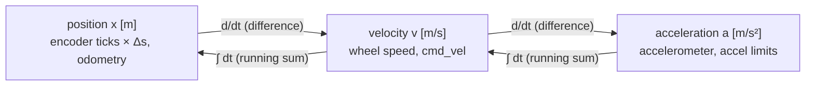

# FP.01 — Units, position, velocity and acceleration

<!-- glance:start -->
<!-- generated by tools/build.py from curriculum/syllabus.yaml — edit the syllabus, not this block -->

| | |
|---|---|
| **Track** | Optional foundation |
| **Difficulty** | Beginner |
| **Time** | 45 min |
| **Hardware** | none |
| **Software** | python |
| **Prerequisites** | none |
| **Optional prerequisites** | [FM.17 Calculus for robots: derivatives, rates and partial derivatives](../mathematics/FM.17-derivatives.md) |
| **Skip if** | You are fluent with SI units and kinematic equations. |

<!-- glance:end -->

## What you will learn

- Convert the units that robot parts come in (rpm, mm, km/h, degrees, ticks) into SI units without slips.
- Explain how position, velocity and acceleration relate to each other, and read that relationship off a plot.
- Use the three constant-acceleration equations to compute stopping distances, move durations and peak speeds.
- Turn encoder ticks into distance and speed, and state the resolution you get at a given sample rate.
- Build a trapezoidal velocity profile in Python and check it by integrating and differentiating numerically.

## Why it matters

Every number the robot uses has a unit. The wheel datasheet says 90 mm, the motor says 205 rpm, the encoder gives ticks, ROS wants metres and radians, and your intuition thinks in km/h. A unit slip does not cause an error message. It gives you a robot that drives 1000 times too far, turns 57 times too much, or brakes too late. REP-103, the ROS convention, fixes SI units everywhere. This lesson makes that habit automatic.

Position, velocity and acceleration are also the vocabulary of every later module. You drive open loop in [01.11](../../01-first-robot/01.11-drive-and-rotate.md) and count ticks in [01.12](../../01-first-robot/01.12-encoder-distance-and-square.md). The course simulator in [06.02](../../06-simulation/06.02-course-mini-simulator.md) moves time forward. [07.05](../../07-sensors/07.05-imu-fundamentals.md) explains why an accelerometer cannot give you position. Wheel-speed estimation in [08.03](../../08-control/08.03-wheel-speed-estimation.md) and motion profiles in [08.11](../../08-control/08.11-rotate-exactly-90.md) come later still, and so do odometry in [09.01](../../09-odometry/09.01-diff-drive-kinematics.md) and the acceleration limits in Nav2. All of them assume what is here.

<!-- prereqs:start -->
## Prerequisites

None — you can start here.

### Optional prerequisite links

New to any of these? Take the foundation lesson first; skip it if you already know it.

- [FM.17 Calculus for robots: derivatives, rates and partial derivatives](../mathematics/FM.17-derivatives.md)

Check your readiness: `python course.py why FP.01`
<!-- prereqs:end -->

## Concept

Think of a robot's motion as three linked logs of the same story.

- **Position** is *where* the robot is, measured from a chosen origin in a chosen direction. It is a number with a unit (metres), and it only makes sense with a reference: "0.8 m forward of where it started".
- **Velocity** is *how fast position changes*. If position goes up by 0.10 m every 0.2 s, velocity is 0.5 m/s. Velocity has a sign: backwards is negative.
- **Acceleration** is *how fast velocity changes*. Going from 0 to 0.5 m/s in 0.5 s means 1.0 m/s² of acceleration. Braking is negative acceleration.

Each one is the *rate of change* of the one before it. Going the other way, each one is the *running total* of the one after it: add up velocity × time and you get distance travelled. A software engineer already knows the pattern. Position is like a counter, velocity is its rate per second, and acceleration is how quickly that rate is changing. Your metrics dashboard shows the same three views of one time series.

Why care about all three and not just speed? The motors can only change the speed so quickly: acceleration is limited by torque, traction and the risk of tipping (lessons [FP.03](FP.03-friction-traction.md), [FP.04](FP.04-torque-gears-wheels.md) and [FP.07](FP.07-center-of-mass-stability.md)). The karmel config caps acceleration at 1.0 m/s² for that reason. And stopping is an acceleration problem: a robot at 0.5 m/s cannot stop instantly. The distance it needs, plus the distance it rolls while the software is still deciding, sets how close it can safely get to a wall or a foot.

Units are the other half of the story. SI units (metre, kilogram, second, radian) are the only ones in which the formulas work *without conversion factors*. If you keep every internal quantity in SI and convert only at the edges (reading a datasheet, printing for a human), whole families of bugs cannot happen. It is the same discipline as storing timestamps in UTC and converting to local time only in the UI.

> [!TIP]
> **Ask your teacher:** "Give me five robot quantities in non-SI units from real datasheets and let me convert them, then check my answers."

## Technical explanation

### Level 1 — The SI units a robot builder uses

| Quantity | SI unit | Common non-SI forms you will meet | Conversion |
|---|---|---|---|
| Length | metre (m) | mm on drawings, cm, inches | 90 mm = 0.090 m |
| Time | second (s) | ms in firmware, µs in timers | 300 ms = 0.300 s |
| Angle | radian (rad) | degrees, revolutions, encoder ticks | 1 rev = 2π rad; 1° = π/180 = 0.017453 rad |
| Angular velocity | rad/s | rpm | rpm × 2π/60 |
| Linear velocity | m/s | km/h, mm/s | 0.5 m/s = 1.8 km/h |
| Acceleration | m/s² | "g" (9.81 m/s²) | 0.1 g = 0.981 m/s² |
| Mass | kg | g | 1600 g = 1.6 kg |
| Force | newton (N) | kgf, "grams" on load cells | 1 kgf = 9.81 N ([FP.02](FP.02-forces-newton.md)) |
| Torque | N·m | kg·cm on hobby motors | 1 kg·cm = 0.0981 N·m ([FP.04](FP.04-torque-gears-wheels.md)) |

The radian is the one that surprises software engineers. It is the angle whose arc length equals the radius, so **arc length = angle in radians × radius** has no conversion factor in it. That is exactly why rim speed is simply $v = \omega r$.

> [!NOTE]
> New to radians? → [FM.02 Angles, degrees and radians](../mathematics/FM.02-angles-and-radians.md). Skip it if you already think in radians.

### Level 2 — Karmel in numbers

From [`labs/config/karmel.yaml`](../../labs/config/karmel.yaml): wheel radius $r = 0.045$ m, gear ratio 56, 11 encoder pulses per motor revolution, 4× quadrature decoding.

**Ticks per wheel revolution:** $11 \times 56 \times 4 = 2464$.

**Distance per tick.** One wheel revolution moves the robot one circumference, $2\pi r$:

$$\Delta s_{tick} = \frac{2\pi r}{N_{ticks}} = \frac{2\pi \times 0.045}{2464} = 1.147\times10^{-4}\ \text{m} = 0.1147\ \text{mm}$$

So driving 3.0 m takes $3.0 / 1.147\times10^{-4} \approx 26{,}144$ ticks (10.61 wheel revolutions).

**rpm to rad/s to m/s.** The motor's datasheet no-load speed is 205 rpm at the gearbox output:

$$\omega = 205 \times \frac{2\pi}{60} = 21.47\ \text{rad/s}, \qquad v = \omega r = 21.47 \times 0.045 = 0.966\ \text{m/s}$$

Under load and at battery voltage the config uses 17 rad/s, which is 0.765 m/s at the rim. The software limit of 0.5 m/s sits below that. That headroom leaves the speed controller something to push with.

### Level 3 — The mathematics: derivatives, integrals and constant acceleration

Velocity is the derivative of position, and acceleration the derivative of velocity:

$$v(t) = \frac{dx}{dt}, \qquad a(t) = \frac{dv}{dt}$$

and, going the other way, position is the integral of velocity:

$$x(t) = x_0 + \int_0^t v(\tau)\, d\tau$$

On a computer you never have a continuous signal, only samples every $\Delta t$. The derivative becomes a difference and the integral a sum:

$$v_k \approx \frac{x_k - x_{k-1}}{\Delta t}, \qquad x_k \approx x_{k-1} + v_k \Delta t$$

*Example:* the encoder count goes from 10,000 to 10,087 ticks between two 50 Hz samples ($\Delta t = 0.02$ s). Then $v \approx 87 \times 1.147\times10^{-4} / 0.02 = 0.499$ m/s.

> [!NOTE]
> New to derivatives or integrals? → [FM.17 Derivatives](../mathematics/FM.17-derivatives.md) and [FM.18 Numerical integration](../mathematics/FM.18-integrals-numerical-integration.md). This lesson only needs the intuition "rate of change" and "running total".

When acceleration $a$ is **constant** (the robot's acceleration phase, or braking at a fixed rate), three equations cover everything:

$$v = v_0 + a t$$
$$x = x_0 + v_0 t + \tfrac{1}{2} a t^2$$
$$v^2 = v_0^2 + 2 a (x - x_0)$$

The third one has no time in it, which makes it the stopping-distance equation. Set the final speed to 0 and solve for distance:

$$d_{brake} = \frac{v_0^2}{2|a|}$$

*Example:* karmel at the 0.5 m/s software limit, braking at the 1.0 m/s² limit: $d = 0.5^2 / (2 \times 1.0) = 0.125$ m, and it takes $t = v_0/|a| = 0.5$ s.

Now add latency. If the stop command is lost and only the Pico's 300 ms watchdog stops the motors, the robot keeps rolling at 0.5 m/s for 0.3 s first: $0.5 \times 0.3 = 0.150$ m. Total: **0.275 m**. More than half the stopping distance is software delay. And because $d_{brake} \propto v^2$, doubling the speed quadruples the braking part.

### Level 3b — Sampling limits what you can measure

The encoder counts whole ticks. At a sample rate $f_s$, the smallest non-zero speed change you can see is one tick per sample:

$$\Delta v_{min} = \Delta s_{tick} \cdot f_s$$

At 50 Hz: $1.147\times10^{-4} \times 50 = 5.74$ mm/s. At 200 Hz: 22.9 mm/s. **Sampling faster makes speed estimates coarser**, unless you average. That tension comes back in [FCT.05](../control-theory/FCT.05-discrete-time-sampling.md) and [08.03](../../08-control/08.03-wheel-speed-estimation.md).

Differentiating also amplifies noise. If each position sample has independent noise with standard deviation $\sigma_x$, the difference of two samples has $\sqrt{2}\sigma_x$, divided by $\Delta t$:

$$\sigma_v = \frac{\sqrt{2}\,\sigma_x}{\Delta t}$$

*Example:* 1 mm of position noise at 50 Hz gives $\sqrt{2}\times0.001/0.02 = 0.071$ m/s of velocity noise, 14% of the robot's cruise speed. The simulation below measures 0.065 m/s. Integration does the opposite: it smooths noise but accumulates any bias. That is why integrating an accelerometer twice to get position drifts away within seconds ([07.05](../../07-sensors/07.05-imu-fundamentals.md)).

### Level 4 — Trapezoidal motion profiles

A robot asked to move 1.0 m should not jump to full speed. A **trapezoidal profile** ramps up at $a_{max}$, cruises at $v_{max}$, and ramps down at $a_{max}$:

- Ramp time $t_a = v_{max}/a_{max} = 0.5/1.0 = 0.5$ s, ramp distance $\tfrac12 a t_a^2 = 0.125$ m (each ramp).
- Cruise distance $1.0 - 2 \times 0.125 = 0.75$ m, cruise time $0.75/0.5 = 1.5$ s.
- Total time **2.5 s**.

If the distance is too short to reach $v_{max}$ (shorter than $v_{max}^2/a_{max} = 0.25$ m here), the trapezoid becomes a **triangle** with peak speed $v_{peak} = \sqrt{a_{max} d}$. For 0.2 m: $v_{peak} = \sqrt{0.2} = 0.447$ m/s, total time $2 v_{peak}/a_{max} = 0.894$ s. Lesson [08.11](../../08-control/08.11-rotate-exactly-90.md) uses the same profile for turning.

## Diagram

The chain of rates, and what each sensor or command sits on:



The 1.0 m trapezoidal move (not to scale):

```text
 v [m/s]
 0.5 ┤      ┌─────────────────────────┐
     │     /                           \
     │    /  cruise 0.75 m, 1.5 s        \
     │   /                                 \
 0.0 ┼──/───────────────────────────────────\──── t [s]
     0  0.5                              2.0  2.5
        ramp 0.125 m                 ramp 0.125 m
 area under the curve = distance = 0.125 + 0.75 + 0.125 = 1.0 m
```

## Code

Save as `fp01_motion.py` anywhere and run `python fp01_motion.py` (needs `numpy` and `matplotlib`; see [labs/README.md](../../labs/README.md) for the environment). It converts karmel's units, computes the braking distance, builds the 1.0 m trapezoid, integrates and differentiates it numerically, and simulates what an encoder and a noisy position sensor would report.

```python
"""FP.01 — units, position, velocity, acceleration on karmel.

Run: python fp01_motion.py   (needs numpy + matplotlib)
"""
from __future__ import annotations

import math
from dataclasses import dataclass

import matplotlib

matplotlib.use("Agg")  # write PNG files, no window needed
import matplotlib.pyplot as plt
import numpy as np


@dataclass(frozen=True)
class Drive:
    wheel_radius_m: float = 0.045
    gear_ratio: float = 56.0
    encoder_cpr_motor: int = 11
    quadrature_multiplier: int = 4

    @property
    def ticks_per_wheel_rev(self) -> int:
        return int(self.encoder_cpr_motor * self.gear_ratio * self.quadrature_multiplier)

    @property
    def metres_per_tick(self) -> float:
        return 2 * math.pi * self.wheel_radius_m / self.ticks_per_wheel_rev


def rpm_to_rad_s(rpm: float) -> float:
    return rpm * 2 * math.pi / 60


def trapezoid_profile(distance_m: float, v_max: float, a_max: float, dt: float):
    """Velocity profile that accelerates at a_max, cruises at v_max, decelerates at a_max."""
    t_acc = v_max / a_max
    d_acc = 0.5 * a_max * t_acc**2
    if 2 * d_acc > distance_m:              # too short to reach v_max: triangle profile
        v_peak = math.sqrt(a_max * distance_m)
        t_acc = v_peak / a_max
        t_cruise = 0.0
    else:
        v_peak = v_max
        t_cruise = (distance_m - 2 * d_acc) / v_max
    t_total = 2 * t_acc + t_cruise
    t = np.arange(0.0, t_total + dt, dt)
    v = np.minimum.reduce([a_max * t, np.full_like(t, v_peak), a_max * (t_total - t)])
    v = np.clip(v, 0.0, None)
    return t, v, t_total, v_peak


def main() -> None:
    d = Drive()
    print(f"ticks per wheel revolution : {d.ticks_per_wheel_rev}")
    print(f"distance per tick          : {d.metres_per_tick * 1000:.4f} mm")
    w_noload = rpm_to_rad_s(205)
    print(f"205 rpm                    : {w_noload:.2f} rad/s -> rim {w_noload * d.wheel_radius_m:.3f} m/s")
    print(f"17 rad/s (loaded max)      : rim {17 * d.wheel_radius_m:.3f} m/s")
    for hz in (50, 200):
        print(f"speed resolution @ {hz:3d} Hz : {d.metres_per_tick * hz * 1000:.2f} mm/s per tick")

    # Stopping distance, with and without the 300 ms watchdog latency
    v, a, latency = 0.5, 1.0, 0.300
    brake = v**2 / (2 * a)
    print(f"braking distance from {v} m/s at {a} m/s^2: {brake:.3f} m in {v / a:.2f} s")
    print(f"... plus {latency * 1000:.0f} ms before braking starts: {brake + v * latency:.3f} m")

    # A 1 m move with the course's software limits
    dt = 0.001
    t, vel, t_total, v_peak = trapezoid_profile(1.0, v_max=0.5, a_max=1.0, dt=dt)
    pos = np.cumsum(vel) * dt                 # numerical integration (rectangle rule)
    acc = np.gradient(vel, dt)                # numerical differentiation
    print(f"1.0 m move: duration {t_total:.3f} s, peak {v_peak:.3f} m/s, "
          f"integrated distance {pos[-1]:.4f} m, max |a| {np.max(np.abs(acc)):.2f} m/s^2")

    # Velocity from noisy position samples at 50 Hz (what an encoder gives you)
    rng = np.random.default_rng(0)
    fs = 50.0
    t_s = np.arange(0.0, t_total, 1 / fs)
    pos_s = np.interp(t_s, t, pos)
    ticks = np.floor(pos_s / d.metres_per_tick)          # encoder quantization
    v_est = np.diff(ticks * d.metres_per_tick) * fs
    noisy = pos_s + rng.normal(0.0, 0.001, pos_s.size)   # 1 mm position noise
    v_noisy = np.diff(noisy) * fs
    print(f"std of velocity error with 1 mm position noise at 50 Hz: "
          f"{np.std(v_noisy - np.diff(pos_s) * fs):.3f} m/s")

    fig, ax = plt.subplots(3, 1, sharex=True, figsize=(7, 7))
    ax[0].plot(t, pos)
    ax[0].set_ylabel("position [m]")
    ax[1].plot(t, vel, label="true")
    ax[1].step(t_s[1:], v_est, where="post", label="from encoder ticks")
    ax[1].plot(t_s[1:], v_noisy, ".", label="from noisy position")
    ax[1].set_ylabel("velocity [m/s]")
    ax[1].legend()
    ax[2].plot(t, acc)
    ax[2].set_ylabel("acceleration [m/s²]")
    ax[2].set_xlabel("time [s]")
    fig.tight_layout()
    fig.savefig("fp01_profile.png", dpi=120)
    print("saved fp01_profile.png")


if __name__ == "__main__":
    main()
```

Output (verified with Python 3.14, numpy 2.5):

```text
ticks per wheel revolution : 2464
distance per tick          : 0.1147 mm
205 rpm                    : 21.47 rad/s -> rim 0.966 m/s
17 rad/s (loaded max)      : rim 0.765 m/s
speed resolution @  50 Hz : 5.74 mm/s per tick
speed resolution @ 200 Hz : 22.95 mm/s per tick
braking distance from 0.5 m/s at 1.0 m/s^2: 0.125 m in 0.50 s
... plus 300 ms before braking starts: 0.275 m
1.0 m move: duration 2.500 s, peak 0.500 m/s, integrated distance 1.0000 m, max |a| 1.00 m/s^2
std of velocity error with 1 mm position noise at 50 Hz: 0.065 m/s
saved fp01_profile.png
```

**The plot `fp01_profile.png`** has three stacked panels sharing a time axis from 0 to 2.5 s.

- **Top, position:** an S-curve. It is a parabola for the first 0.5 s, then a straight line, then flattens into a parabola that ends at exactly 1.0 m.
- **Middle, velocity:** the true velocity is a clean trapezoid, a ramp to 0.5 m/s, flat, then a ramp down. The encoder estimate follows it as a staircase. The estimate from noisy position is a cloud of dots scattered roughly ±0.07 m/s around the trapezoid.
- **Bottom, acceleration:** three flat steps: +1.0 m/s² until 0.5 s, 0 until 2.0 s, −1.0 m/s² until 2.5 s.

## Exercise

### Exercise FP.01-E1 — Unit conversions on the real robot `[numerical]`

Hardware: none. Using the karmel numbers (r = 0.045 m, 2464 ticks per wheel revolution, track width 0.200 m), compute by hand or in a Python REPL:

1. The rim speed in m/s and km/h when the wheel turns at 100 rpm.
2. How many ticks one wheel counts while karmel drives 3.0 m straight.
3. How many ticks each wheel counts while karmel rotates 90° in place. Each wheel travels an arc of radius half the track width, so arc = angle × 0.100 m.
4. The motor-shaft speed in rpm when the robot drives at 0.3 m/s. The gearbox is 1:56, so the motor spins 56 times faster than the wheel.

### Exercise FP.01-E2 — Trapezoidal profile generator `[coding]`

Hardware: none. Write `profile(distance_m, v_max, a_max)` that returns the total duration and peak speed, and handles both the trapezoid and the triangle case. You may start from `trapezoid_profile` above. Test it for (1.0 m, 0.5 m/s, 1.0 m/s²), (0.2 m, 0.5 m/s, 1.0 m/s²) and (2.0 m, 0.3 m/s, 0.5 m/s²). Verify each case by numerically integrating your velocity samples, with dt = 1 ms, and checking that the distance comes out right.

### Exercise FP.01-E3 — Predict the stopping distance `[predict]`

Hardware: none. Write your predictions *before* computing:

1. Karmel drives at 0.25 m/s and brakes at 1.0 m/s² with no latency. How does its braking distance compare with the 0.125 m it needs at 0.5 m/s: half, a quarter, or the same?
2. At 0.5 m/s, the stop command goes missing and the 300 ms watchdog fires. Which is larger, the distance rolled before braking or the braking distance?
3. Now check both with the formulas.

### Exercise FP.01-E4 — Measure it on the robot (optional) `[hardware]`

Hardware: `robot-base`. No-hardware alternative: do the same with the simulator from [06.02](../../06-simulation/06.02-course-mini-simulator.md), or skip it.

> [!CAUTION]
> **Safety:** Test on the floor in a cleared area at least 2 m long, with a hand on the power switch. Keep the speed at 0.3 m/s or less, and never remove the 300 ms watchdog.

After [01.12](../../01-first-robot/01.12-encoder-distance-and-square.md), command 0.3 m/s for 2.0 s and log the ticks at 50 Hz. Compute the distance from the ticks, measure the real distance with a tape measure, and plot the velocity estimate.

## Expected result

**FP.01-E1:**
1. 100 rpm = 10.47 rad/s, so the rim moves at 0.471 m/s = 1.70 km/h.
2. 26,144 ticks (± 1).
3. The arc is (π/2) × 0.100 = 0.1571 m, which is 1369 ticks per wheel (1368.9). The left wheel counts negative and the right positive for a counter-clockwise turn.
4. The wheel turns at 0.3 / 0.045 = 6.667 rad/s = 63.66 rpm, so the motor turns at 63.66 × 56 = **3565 rpm**.

**FP.01-E2:**
- (1.0, 0.5, 1.0): 2.500 s, peak 0.500 m/s.
- (0.2, 0.5, 1.0): triangle, 0.894 s, peak 0.447 m/s.
- (2.0, 0.3, 0.5): ramps of 0.6 s covering 0.09 m each, cruise 1.82 m in 6.067 s, total **7.267 s**, peak 0.300 m/s.

Integrating your samples reproduces each distance to within 0.1%.

**FP.01-E3:**
1. A quarter: 0.25² / 2 = **0.031 m**. Braking distance scales with v².
2. They are close, and the roll wins: 0.150 m before braking against 0.125 m of braking, 0.275 m in total. Latency matters as much as brakes.

**FP.01-E4:** The tick distance and the tape measure agree within about 2–5% before calibration. Wheel radius error dominates, and [09.05](../../09-odometry/09.05-calibrating-odometry.md) fixes it. The velocity plot shows a ramp, a noisy plateau near 0.3 m/s with visible 5.7 mm/s steps, and a ramp down.

## Troubleshooting

### Symptom: the robot drives about 1000× too far or not at all
1. Print the distance per tick. If it is around 0.11 instead of 0.000115, the radius went in as millimetres (45) instead of metres (0.045).
2. If the robot barely moves, look for a conversion done twice, such as dividing by 1000 in both the config loader and the code.
3. Fix it at the boundary: convert once, when reading the datasheet or config, and keep SI internally.

### Symptom: rotations are about 57× too large, or turns go the wrong way
1. 57.3 is 180/π. Degrees went into something that expects radians (`math.sin`, ROS angular velocity, TF).
2. Check the sign convention. REP-103 says counter-clockwise, seen from above, is positive yaw.

### Symptom: the velocity estimate is a noisy mess
1. Compare the noise against the theory: tick resolution × sample rate, and $\sqrt2\sigma_x/\Delta t$.
2. If the steps are exactly one tick's worth, it is quantization. Lower the rate or average over several samples.
3. If the noise is larger than theory, check timestamps. Use the real Δt between samples, not the nominal 0.02 s, because USB jitter changes it.

### Symptom: the integrated position slowly drifts even when the robot stands still
1. Integrating a small constant bias grows linearly (velocity bias) or quadratically (acceleration bias).
2. Check the mean of the signal while stationary and subtract that bias, or use a sensor that measures position directly.

## Common mistakes

- **Mixing mm and m in the same formula.** Datasheets use mm and ROS uses m. Convert at the edge, name variables with units (`wheel_radius_m`) as the course config does.
- **Using degrees with trig functions.** `math.sin(90)` is 0.894, not 1. Keep radians internally and convert only when printing.
- **Confusing rpm with rad/s.** 205 rpm is 21.5 rad/s, not 205. A factor of 9.55 is hiding here.
- **Forgetting latency in stopping distances.** The robot keeps moving at full speed until the command arrives. Delay × speed can be larger than the braking distance itself.
- **Assuming a faster sample rate gives a better speed estimate.** With an encoder, per-sample speed resolution gets coarser as the rate goes up.
- **Using the nominal Δt instead of the measured one** when differentiating logged data from a non-real-time link.

## Knowledge check

1. Convert 150 rpm at the wheel to m/s on karmel's 90 mm wheels.
   <details><summary>Answer</summary>

   150 × 2π/60 = 15.71 rad/s. v = ωr = 15.71 × 0.045 = **0.707 m/s**.
   </details>

2. Why is $v = \omega r$ true with no conversion factor only when ω is in rad/s?
   <details><summary>Answer</summary>

   A radian is defined as the angle whose arc length equals the radius, so arc length = θ(rad) × r. Differentiating in time gives v = ωr. With degrees you would need a factor of π/180, and with rpm a factor of 2π/60.
   </details>

3. Karmel drives at 0.4 m/s and brakes at 0.8 m/s². How far does it travel while braking, and how long does braking take?
   <details><summary>Answer</summary>

   d = v²/(2a) = 0.16/1.6 = **0.100 m**. t = v/a = **0.5 s**.
   </details>

4. Predict: the control loop reads encoder ticks at 200 Hz instead of 50 Hz with no averaging. Does the speed estimate get smoother or noisier? By how much does the step size change?
   <details><summary>Answer</summary>

   Noisier. One tick per sample now means 4× the speed: 0.1147 mm × 200 = 22.9 mm/s steps instead of 5.74 mm/s. A faster loop needs filtering or a different estimator (08.03).
   </details>

5. A 0.2 m move with v_max = 0.5 m/s and a_max = 1.0 m/s² never reaches 0.5 m/s. What is its peak speed and why?
   <details><summary>Answer</summary>

   Accelerating to 0.5 m/s and braking back down takes 2 × 0.125 = 0.25 m, which is more than 0.2 m. The profile becomes a triangle with peak √(a·d) = √0.2 = **0.447 m/s**.
   </details>

6. Debugging: a teammate's odometry says the robot turned 5157° when it turned 90°. What happened?
   <details><summary>Answer</summary>

   5157/90 = 57.3 = 180/π. A value already in degrees (90) was treated as radians and converted to degrees again. Keep every internal angle in radians.
   </details>

7. Why does integrating an accelerometer twice give a position that drifts away within seconds, while differentiating encoder position gives a noisy but not drifting speed?
   <details><summary>Answer</summary>

   Integration accumulates. A constant bias of b m/s² becomes an error of ½bt² in position, which is 0.5 m after 10 s for b = 0.01 m/s². Differentiation amplifies noise but has no memory, so errors do not accumulate.
   </details>

## Practical challenge

Write a small module `motion_units.py` with:

- Unit-safe conversion helpers (`rpm_to_rad_s`, `ticks_to_m`, `deg_to_rad`) with type hints and pytest tests, including round-trip tests.
- `safe_approach_speed(distance_to_obstacle_m, a_brake, latency_s, margin_m)`. It returns the highest speed at which the robot can still stop before the obstacle: solve $v t_{lat} + v^2/(2a) = d - \text{margin}$ for $v$.

**Acceptance criteria:**
- `pytest` passes.
- `safe_approach_speed(0.5, 1.0, 0.3, 0.05)` returns **0.695 m/s** (± 0.001).
- `safe_approach_speed(0.3, 1.0, 0.3, 0.05)` returns **0.468 m/s** (± 0.001).
- The function returns 0.0 when the obstacle is already inside the margin.
- In a short paragraph, explain what happens to the safe speed when latency drops from 300 ms to 50 ms. Compute it for the 0.5 m case (you should get 0.900 m/s).

## You can skip this if…

You get knowledge-check questions 3, 4 and 7 right without looking, and you can compute karmel's distance per tick and its braking distance with latency from memory in under two minutes.

`python course.py skip FP.01 --reason "fluent with SI units and constant-acceleration kinematics"`

## Go deeper

- [OpenStax University Physics Volume 1](https://openstax.org/details/books/university-physics-volume-1): free, rigorous textbook. Chapters 1–3 cover units, and motion along a straight line with exactly these equations.
- [MIT OCW 8.01SC Classical Mechanics](https://ocw.mit.edu/courses/8-01sc-classical-mechanics-fall-2016/): a full self-study course with videos and problem sets, if you want the university version.
- [NIST SP 811, Guide for the Use of the SI](https://www.nist.gov/pml/special-publication-811): the authoritative reference for SI unit names, symbols and conversion factors.
- [3Blue1Brown, Essence of Calculus](https://www.youtube.com/playlist?list=PLZHQObOWTQDMsr9K-rj53DwVRMYO3t5Yr): the best visual intuition for derivatives and integrals as "rate" and "accumulation".

## Progress checkpoint

- [ ] I convert rpm, mm, degrees and ticks to SI units without hesitation.
- [ ] I can explain position, velocity and acceleration as rates and running totals of each other.
- [ ] I can compute a stopping distance including latency.
- [ ] I know the speed resolution an encoder gives at a given sample rate.
- [ ] I can generate and verify a trapezoidal velocity profile in Python.

`python course.py complete FP.01` (exercises done) · `python course.py master FP.01` (challenge done) · `python course.py struggle FP.01 "what was hard"`

Next: [FP.02 — Forces, mass, weight and Newton's laws](FP.02-forces-newton.md).
