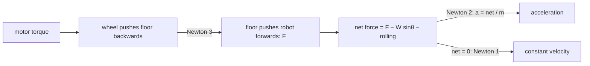

# FP.02 — Forces, mass, weight and Newton's laws

<!-- glance:start -->
<!-- generated by tools/build.py from curriculum/syllabus.yaml — edit the syllabus, not this block -->

| | |
|---|---|
| **Track** | Optional foundation |
| **Difficulty** | Beginner |
| **Time** | 45 min |
| **Hardware** | none |
| **Software** | none |
| **Prerequisites** | [FP.01 Units, position, velocity and acceleration](FP.01-kinematics-units.md) |
| **Optional prerequisites** | [FM.05 Vectors from zero](../mathematics/FM.05-vectors.md) |
| **Skip if** | You draw free-body diagrams comfortably. |

<!-- glance:end -->

## What you will learn

- Tell mass, weight and force apart, and convert "kgf" and "grams" readings into newtons.
- Draw a free-body diagram of the robot with every force that acts on it, including where each one acts.
- Apply Newton's three laws to compute the force karmel's wheels must produce to accelerate on a ramp.
- Compute how the robot's weight is shared between the drive wheels and the caster, and how that changes with slope and acceleration.
- Solve a free-body diagram as a small linear system in Python.

## Why it matters

A motor produces torque, a wheel turns it into a force on the floor, and only that force moves the robot. Every question about "can it climb this, can it accelerate that fast, will it slip, will it tip" starts with a free-body diagram. You will use one to size motors in [FP.04](FP.04-torque-gears-wheels.md), predict slip in [FP.03](FP.03-friction-traction.md) and check stability in [FP.07](FP.07-center-of-mass-stability.md). You will also give Gazebo sensible mass and friction values in [06.05](../../06-simulation/06.05-robot-in-gazebo.md). Later, [15.01](../../15-manipulation/15.01-physics-of-grasping.md) reasons about grasp forces the same way.

Mass is also a hidden parameter in control. When you add the SO-101 arm, the robot's mass goes from 1.6 kg to about 2.25 kg. The same motor command now gives about 30% less acceleration. That is why the controller you tuned in module [08](../../08-control/08.08-tuning-pid.md) behaves differently after the upgrade.

<!-- prereqs:start -->
## Prerequisites

You need these first:

- [FP.01 Units, position, velocity and acceleration](FP.01-kinematics-units.md)

### Optional prerequisite links

New to any of these? Take the foundation lesson first; skip it if you already know it.

- [FM.05 Vectors from zero](../mathematics/FM.05-vectors.md)

Check your readiness: `python course.py why FP.02`
<!-- prereqs:end -->

## Concept

A **force** is a push or a pull. It has a size, measured in newtons (N), and a direction, so it is a vector ([FM.05](../mathematics/FM.05-vectors.md)). Put a 100 g phone on your palm and you feel about 1 N.

**Mass** is how much "stuff" an object has, and it sets how hard the object is to speed up or slow down. It is measured in kilograms and is the same on Earth and on the Moon. **Weight** is the force gravity pulls that mass down with. On Earth, weight = mass × 9.81 m/s². Karmel has 1.6 kg of mass and weighs 15.7 N. A kitchen scale measures weight and displays it divided by 9.81, which is why it says "1600 g".

Newton's three laws, in robot terms:

1. **Inertia.** If the forces on the robot cancel out, its velocity does not change. A robot cruising at a constant 0.3 m/s on a flat floor needs only enough wheel force to cancel rolling resistance. Nothing is "used up" just by moving.
2. **F = m a.** The *net* force (the sum of all forces as vectors) equals mass × acceleration. For a given net force, a heavier robot accelerates less.
3. **Action = reaction.** When a wheel pushes the floor backwards, the floor pushes the wheel forwards with the same force. This is the part people miss: **the robot is pushed by the floor**, not by its motors. The motors only create the push against the floor. On ice there is no reaction force, so there is no motion.

A **free-body diagram** (FBD) is a drawing of one body with every external force as an arrow, drawn where the force acts. It works like a sequence diagram for physics: it makes every interaction explicit, so you can check that the sum is right. For karmel the forces are weight (at the centre of mass), a normal force up from the floor at each contact (two wheels and the caster), the traction force at the drive wheels, and rolling resistance.

> [!TIP]
> **Ask your teacher:** "Walk me through a free-body diagram of karmel braking downhill, one force at a time, and ask me for the direction of each arrow before you tell me."

## Technical explanation

### Level 1 — Units of force you will meet

- **Newton (N):** 1 N accelerates 1 kg at 1 m/s².
- **Kilogram-force (kgf):** the weight of 1 kg, which is 9.81 N. Hobby datasheets use it inside "kg·cm" torque ratings.
- **"Grams"** on a scale or load cell mean grams-force: 100 g on a scale is 0.981 N.

### Level 2 — The forces on karmel

Model values from [`labs/config/karmel.yaml`](../../labs/config/karmel.yaml) and this lesson:

- Mass 1.6 kg. Caster 0.10 m **in front of** the wheel axle (`chassis.caster_offset_x_m: 0.10`).
- Centre of mass (CoM) 0.04 m in front of the axle and 0.05 m above the ground. This is a modelling assumption: the battery sits between the axle and the caster, which is where it has to be if the caster is to carry any load at all. Exercise E4 shows how to measure the real value.
- Rolling-resistance coefficient $c_{rr} = 0.02$, a typical value for rubber tyres on a hard floor. Treat it as an assumption and measure yours if it matters.

Forces:

| Force | Symbol | Acts at | Direction |
|---|---|---|---|
| Weight | $W = mg$ | CoM | straight down |
| Normal force, wheels (two combined) | $N_w$ | wheel contacts | perpendicular to the floor, pushing up |
| Normal force, caster | $N_c$ | caster contact | perpendicular to the floor, pushing up |
| Traction (floor on wheels) | $F$ | wheel contacts | along the floor, forward when driving |
| Rolling resistance | $c_{rr}(N_w+N_c)$ | contacts | along the floor, opposing motion |

On a ramp of angle θ, split the weight into a part along the ramp, $W\sin\theta$, and a part pressing into it, $W\cos\theta$ ([FM.03](../mathematics/FM.03-trigonometry.md) if sin/cos are rusty).

### Level 3 — Newton's second law along the ramp

Sum the forces along the slope (uphill positive) and set the sum equal to $ma$:

$$F - W\sin\theta - c_{rr} W\cos\theta = m a \quad\Rightarrow\quad F = m a + m g \sin\theta + c_{rr} m g \cos\theta$$

**Worked example: climb a 5° ramp while accelerating at 0.3 m/s².**

- Inertial term: $1.6 \times 0.3 = 0.480$ N
- Gravity along the ramp: $1.6 \times 9.81 \times \sin 5° = 15.696 \times 0.08716 = 1.368$ N
- Rolling resistance: $0.02 \times 15.696 \times \cos 5° = 0.313$ N
- **Total traction the two wheels must deliver: $F = 2.161$ N**, so about 1.08 N per wheel.

Notice how small this is: the weight of about 220 g. The gravity term is the biggest one. Doubling the mass doubles every term, so a robot twice as heavy needs twice the force for the same motion.

### Level 3b — Where the weight goes: the no-tipping equation

Perpendicular to the ramp nothing accelerates, so the normal forces carry the perpendicular part of the weight:

$$N_w + N_c = W\cos\theta$$

The robot also does not pitch (rotate nose-up or nose-down), so the **moments** about any point must balance. A moment is force × lever arm; [FP.04](FP.04-torque-gears-wheels.md) calls it torque. Take moments about the wheel contact point, where $F$ and $N_w$ have zero lever arm. Let $d_c = 0.10$ m be the caster distance *ahead* of the axle, $d_g = 0.04$ m the CoM distance ahead of the axle, and $h = 0.05$ m the CoM height:

$$N_c \, d_c = W\cos\theta \, d_g - (W\sin\theta + m a)\, h$$

The **minus** sign is the key insight, and it is the one that flips when you move the caster. The downhill pull and the "inertial" pull $m a$ act at the CoM, *above* the floor, so they tilt load backwards — away from the front contact and onto the drive wheels. With the caster in front, climbing and accelerating *help* traction. (Put the caster behind, as karmel had it until 2026-09, and the same two terms take load off the drive wheels exactly when you need grip.)

*Worked example (5°, 0.3 m/s²):*

$$N_c = \frac{15.636 \times 0.04 - (1.368 + 0.480)\times 0.05}{0.10} = \frac{0.6254 - 0.0924}{0.10} = 5.33\ \text{N}$$

$$N_w = 15.636 - 5.33 = 10.31\ \text{N}$$

Standing still on the flat, the wheels carry 9.42 N and the caster 6.28 N. On the ramp while accelerating, the wheels **gain** 0.89 N of load, about 9%. Traction is proportional to the load on the *driven* wheels ([FP.03](FP.03-friction-traction.md)), so the front caster is working for you here.

It is not free. The same equation says $N_c$ reaches **zero** — the caster lifts and the robot rocks back onto its tail — when $a = g\,d_g/h = 9.81 \times 0.04/0.05 = 7.9$ m/s² on the flat, far above karmel's 1.0 m/s² limit for this model. But the simulated robot's URDF puts its CoM only 1.7 mm ahead of the axle, which gives 0.33 m/s², and it does visibly rock nose-up under a full-rate acceleration step ([`labs/TESTED.md`](../../labs/TESTED.md) §3.1). $d_g$ is the number that decides it, and $d_g$ is where you put the battery.

### Level 4 — A free-body diagram is a linear system

Three unknowns ($F$, $N_w$, $N_c$) and three equations (forces along the slope, forces perpendicular to it, moments) make a 3×3 linear system $A\mathbf{x} = \mathbf{b}$:

$$\begin{bmatrix}1 & -c_{rr} & -c_{rr}\\ 0 & 1 & 1\\ 0 & 0 & d_c\end{bmatrix}\begin{bmatrix}F\\N_w\\N_c\end{bmatrix} = \begin{bmatrix} m a + W\sin\theta\\ W\cos\theta\\ W\cos\theta\, d_g - (W\sin\theta + m a) h\end{bmatrix}$$

`numpy.linalg.solve` does the rest ([FM.19](../mathematics/FM.19-linear-systems-least-squares.md) explains why that works). Writing it this way scales well: add the arm as another mass and it is just more terms in **b**.

## Diagram

Karmel climbing a ramp, seen from its left side (x forward and uphill):

```text
                                  weight W at the CoM, split into:
                                     W sin θ  (along the floor, downhill = backwards)
                                     W cos θ  (into the floor)
                                  inertial term m·a (acts like a backwards pull at the CoM)
                     ┌───────────────────────────────────┐
                     │              ● CoM                │  h = 0.05 m above the floor
                     └──(O)──────────────────────────○───┘
        drive wheel, r = 0.045 m (O)                 ○ caster
                              ▲ N_w                  ▲ N_c
       ═══════════════════════╧══════════════════════╧═════════════════ floor, tilted up by θ
                        x = 0 (axle)  x = +0.04 m   x = +0.10 m
                                      (CoM)         (caster)
                   ──► F (traction, floor on wheel), robot driving towards +x, to the right

  Along the floor:              F − W sin θ − c_rr·W cos θ = m·a
  Perpendicular to the floor:   N_w + N_c = W cos θ
  Moments about wheel contact:  N_c·0.10 = W cos θ·0.04 − (W sin θ + m·a)·0.05
```

How the three laws enter the calculation:



## Code

Save as `fp02_forces.py` and run `python fp02_forces.py`. It solves the free-body diagram for several cases, integrates $F = ma$ forward in time for a constant push, and plots the traction needed and the wheel load against ramp angle.

```python
"""FP.02 — free-body diagram of karmel on a ramp, solved as a linear system.

Run: python fp02_forces.py   (needs numpy + matplotlib)
"""
from __future__ import annotations

import math
from dataclasses import dataclass

import matplotlib

matplotlib.use("Agg")
import matplotlib.pyplot as plt
import numpy as np

G = 9.81  # m/s^2


@dataclass(frozen=True)
class Robot:
    mass_kg: float = 1.6
    com_x_m: float = 0.04         # centre of mass, forward of the wheel axle (negative = behind)
    com_h_m: float = 0.05         # centre of mass height above the ground
    caster_x_m: float = 0.10      # ball caster (karmel.yaml): +0.10 = IN FRONT of the axle
    c_rr: float = 0.02            # rolling-resistance coefficient (assumed: hard floor, rubber tyres)


def solve_fbd(robot: Robot, slope_deg: float, accel: float) -> dict[str, float]:
    """Unknowns: traction force F (along slope), wheel normal N_w, caster normal N_c.

    Frame: x along the slope (uphill = forward), z perpendicular to it, origin at the wheel contact.
    Equations (Newton's 2nd law along x, equilibrium along z, no pitching about the wheel contact):
      F - W sin(th) - c_rr (N_w + N_c) = m a
      N_w + N_c - W cos(th)            = 0
      N_c * caster_x - W cos(th) * com_x + (W sin(th) + m a) * com_h = 0

    The third equation is written for a signed caster_x, so it is correct for a caster at either
    end; only the sign of the load transfer changes.
    """
    th = math.radians(slope_deg)
    m, W = robot.mass_kg, robot.mass_kg * G
    A = np.array([
        [1.0, -robot.c_rr, -robot.c_rr],
        [0.0, 1.0, 1.0],
        [0.0, 0.0, robot.caster_x_m],
    ])
    b = np.array([
        m * accel + W * math.sin(th),
        W * math.cos(th),
        W * math.cos(th) * robot.com_x_m - (W * math.sin(th) + m * accel) * robot.com_h_m,
    ])
    F, N_w, N_c = np.linalg.solve(A, b)
    return {"weight": W, "gravity_along": W * math.sin(th), "inertial": m * accel,
            "rolling": robot.c_rr * (N_w + N_c), "traction": F, "N_wheels": N_w, "N_caster": N_c}


def speed_under_constant_force(robot: Robot, force_n: float, t_end: float, dt: float = 0.001):
    """Newton's 2nd law stepped forward in time on a flat floor: m dv/dt = F - c_rr m g."""
    rolling = robot.c_rr * robot.mass_kg * G
    n = int(round(t_end / dt))
    t = np.arange(n + 1) * dt
    v = np.zeros(n + 1)
    for k in range(n):
        net = force_n - rolling if (v[k] > 0 or force_n > rolling) else 0.0  # static: nothing moves
        v[k + 1] = v[k] + net / robot.mass_kg * dt
    return t, v


def main() -> None:
    karmel = Robot()
    cases = [("standing, flat", 0.0, 0.0), ("0.3 m/s^2, flat", 0.0, 0.3),
             ("0.3 m/s^2, 5 deg ramp", 5.0, 0.3), ("1.0 m/s^2, flat", 0.0, 1.0)]
    print(f"{'case':32s} {'W':>6s} {'W sin':>6s} {'m a':>6s} {'roll':>6s} {'F':>6s} {'N_w':>6s} {'N_c':>6s}   [N]")
    for name, slope, acc in cases:
        s = solve_fbd(karmel, slope, acc)
        print(f"{name:32s} {s['weight']:6.3f} {s['gravity_along']:6.3f} {s['inertial']:6.3f} "
              f"{s['rolling']:6.3f} {s['traction']:6.3f} {s['N_wheels']:6.3f} {s['N_caster']:6.3f}")

    t, v = speed_under_constant_force(karmel, force_n=1.0, t_end=2.0)
    print(f"1.0 N push on the flat: a = {(v[1] - v[0]) / 0.001:.4f} m/s^2, v(2 s) = {v[-1]:.3f} m/s")

    slopes = np.linspace(0, 20, 81)
    F = [solve_fbd(karmel, s, 0.3)["traction"] for s in slopes]
    Nw = [solve_fbd(karmel, s, 0.3)["N_wheels"] for s in slopes]
    fig, ax = plt.subplots(figsize=(7, 4))
    ax.plot(slopes, F, label="traction force needed F [N]")
    ax.plot(slopes, Nw, label="normal force on the drive wheels N_w [N]")
    ax.set_xlabel("ramp angle [deg]")
    ax.set_ylabel("force [N]")
    ax.set_title("karmel climbing at 0.3 m/s²")
    ax.grid(True)
    ax.legend()
    fig.tight_layout()
    fig.savefig("fp02_ramp.png", dpi=120)
    print("saved fp02_ramp.png")


if __name__ == "__main__":
    main()
```

Output:

```text
case                                  W  W sin    m a   roll      F    N_w    N_c   [N]
standing, flat                   15.696  0.000  0.000  0.314  0.314  9.418  6.278
0.3 m/s^2, flat                  15.696  0.000  0.480  0.314  0.794  9.658  6.038
0.3 m/s^2, 5 deg ramp            15.696  1.368  0.480  0.313  2.161 10.306  5.331
1.0 m/s^2, flat                  15.696  0.000  1.600  0.314  1.914 10.218  5.478
1.0 N push on the flat: a = 0.4288 m/s^2, v(2 s) = 0.858 m/s
saved fp02_ramp.png
```

**The plot `fp02_ramp.png`** shows two straight-ish lines against ramp angle (0–20°):

- The traction force needed climbs from 0.79 N on the flat to about 6.14 N at 20°.
- The normal force on the drive wheels *rises* too, from 9.66 N to about 11.77 N, because a front caster sheds load backwards onto the drive wheels as the slope steepens.

The lines therefore never cross in this range: at 20° the ratio $F/N_w$ is only **0.52**, and it reaches a typical rubber-on-hardfloor $\mu = 0.8$ at about **36°**. Traction is not what stops karmel climbing; motor torque is ([FP.04](FP.04-torque-gears-wheels.md)). Redraw the same plot with `caster_x_m = -0.10` and the picture inverts — $N_w$ falls, the lines cross near 19.5°, and grip becomes the limit. One sign in one config file, two different robots.

## Exercise

### Exercise FP.02-E1 — Forces on a steeper ramp `[numerical]`

Hardware: none. Karmel (1.6 kg, same CoM and $c_{rr}$) climbs a **10°** ramp while accelerating at **0.5 m/s²**. By hand, compute (a) the gravity component along the ramp, (b) the rolling resistance, (c) the total traction force $F$, (d) $N_c$ and $N_w$. Then check your answers with `solve_fbd`.

### Exercise FP.02-E2 — Braking downhill `[coding]`

Hardware: none. Use `solve_fbd` to model karmel **facing downhill** on a 5° ramp, braking at 1.0 m/s². Hint: pass `slope_deg=-5`, since the slope now drops in the forward direction, and `accel=-1.0`. Report $F$, $N_w$ and $N_c$. Explain the sign of $F$ and why the wheels carry more load than when standing still.

### Exercise FP.02-E3 — Predict before you compute `[predict]`

Hardware: none. Write down a prediction for each, then check with the code:

1. Double the mass to 3.2 kg with the same CoM position. Does the traction needed for 5°/0.3 m/s² exactly double?
2. Karmel accelerates hard on the flat at 1.0 m/s². Does the caster load go up or down compared with standing still?
3. A robot drives at a constant 0.3 m/s on the flat. What net force acts on it?

### Exercise FP.02-E4 — Measure where the weight goes `[hardware]`

Hardware: `robot-base` plus a kitchen scale. No-hardware alternative: use the numbers given in the expected result.

> [!CAUTION]
> **Safety:** Switch the robot off, so no wheel can spin while you are handling it, and keep fingers clear of the wheels.

1. Weigh the whole robot.
2. Put only the caster on the scale. Rest both wheels on a book whose top is at the same height as the scale's surface, and read the scale.
3. Compute $N_c$ in newtons. The CoM distance *ahead* of the axle follows from the moment balance on the flat: $d_g = d_c\,N_c/W$, with $d_c = +0.10$ m.

## Expected result

**FP.02-E1:**
- (a) $W\sin 10° = 15.696 \times 0.17365 = 2.726$ N.
- (b) $0.02 \times 15.696 \times \cos10° = 0.309$ N.
- (c) $F = 0.800 + 2.726 + 0.309 = 3.835$ N.
- (d) $N_c = 4.420$ N and $N_w = 11.037$ N. The drive wheels now carry 70% of the weight — more than on the flat, because climbing tips load off the front caster and onto them.

`solve_fbd` agrees to three decimals.

**FP.02-E2:** $F = -2.655$ N, $N_w = 7.898$ N, $N_c = 7.739$ N.
- $F$ is negative: the floor must push the robot *backwards* (uphill) through the wheels to slow it. That braking force is the inertial term plus the downhill pull, minus the rolling resistance that helps.
- The wheels carry **less** load than when standing still (7.90 N against 9.42 N), because braking and the downhill pull both tilt load forward, onto the front caster. That is the direction that eventually noses a robot over ([FP.07](FP.07-center-of-mass-stability.md)) — but with the caster 0.10 m in front of the axle, this robot runs out of grip long before it runs out of support.

**FP.02-E3:**
1. Yes, exactly: 4.321 N against 2.161 N. Every term is proportional to mass, and the output shows 4.321 because of rounding.
2. **Down:** 5.478 N against 6.278 N. Acceleration shifts load backwards, off a *front* caster and onto the drive wheels. (Predict this one before running it — most people answer "up", which is the right answer for the rear caster this robot used to have.)
3. Zero net force. The wheels push 0.314 N forwards and rolling resistance pushes 0.314 N back.

**FP.02-E4:** Expect a total of 1.4–1.8 kg for the stage-1 build. With the lesson's model values the scale reads about **640 g** under the caster (6.28 N), which gives $d_g = 0.10 \times 6.28/15.70 = 0.040$ m — the CoM is 40 mm *ahead* of the axle, between it and the caster. A reading lower than 640 g means your CoM sits further back, closer to the axle; if the caster reads nothing at all, the CoM is behind the axle and the robot is resting on its tail.

## Troubleshooting

### Symptom: your hand calculation and the code disagree
1. Check degrees against radians first: `math.sin(5)` is the sine of 5 *radians*.
2. Check whether you used $W$ or $W\cos\theta$ for rolling resistance. On small slopes they differ by less than 0.4%, so a large difference points elsewhere.
3. Check the sign convention of the slope and acceleration inputs (uphill and forward are positive).

### Symptom: the solver returns a negative normal force
1. A negative $N_c$ means the model wants the floor to *pull the caster down*. Floors cannot pull, so the caster has lifted: with karmel's front caster that means the robot is rearing up onto its tail, and with a rear caster it means it is pitching onto its nose.
2. Your inputs have gone past the tipping limit. This is not a solver bug. [FP.07](FP.07-center-of-mass-stability.md) treats it properly.

### Symptom: the real robot needs much more force than the model predicts
1. Measure the rolling resistance: push the robot, switched off with its wheels free, using a luggage scale or a kitchen scale on its side.
2. Geared motors that cannot be back-driven do not roll freely at all. In that case measure with the motors powered and driving slowly, and read the current instead ([FP.05](FP.05-energy-power-efficiency.md)).
3. Check for a dragging caster, a rubbing wheel, or a bearing packed with dust and hair.

## Common mistakes

- **Treating kilograms as a force.** "The motor lifts 2 kg" is shorthand for 19.6 N. Convert kgf to newtons before any calculation.
- **Thinking the motor pushes the robot.** The floor pushes the robot (Newton 3). With no friction, motor torque only spins the wheel.
- **Forgetting that constant velocity needs no net force.** Cruising only has to overcome losses. Acceleration and climbing are what cost force.
- **Drawing all forces at one point.** Where a force acts matters for moments: load transfer, tipping, and how weight splits between the axle and the caster.
- **Assuming the weight splits evenly between all contact points.** The split follows from the moment balance and changes with slope and acceleration.

## Knowledge check

1. A load cell reads "250 g" while the arm's gripper squeezes it. What force is that in newtons?
   <details><summary>Answer</summary>

   0.250 kg × 9.81 m/s² = **2.45 N**. The load cell shows the force divided by g.
   </details>

2. What force must karmel's wheels produce to cruise at a constant 0.4 m/s on a flat floor with $c_{rr} = 0.02$?
   <details><summary>Answer</summary>

   Only rolling resistance: 0.02 × 15.696 = **0.314 N**. Speed does not appear in the equation, because constant velocity means zero acceleration.
   </details>

3. Newton's third law: when karmel accelerates forwards, which body pushes it forwards and what is the reaction?
   <details><summary>Answer</summary>

   The floor pushes the wheels forwards through friction. The reaction is the wheels pushing the floor backwards with an equal force. Without friction, as on ice, there is no forward force.
   </details>

4. Karmel with the arm and a 100 g payload weighs 2.25 kg. Using the same force that gave the 1.6 kg robot 1.0 m/s², what acceleration do you get? Ignore rolling resistance.
   <details><summary>Answer</summary>

   The force is 1.6 N, so a = 1.6/2.25 = **0.71 m/s²**, 29% less. Tuned controllers feel "sluggish" after adding mass.
   </details>

5. Predict: karmel accelerates hard uphill. Does the load on the drive wheels increase or decrease, and why does it matter?
   <details><summary>Answer</summary>

   It **increases** — 10.31 N against 9.42 N standing still — because karmel's caster is in *front* of the axle, and the downhill pull and the inertial term act at the CoM above the floor, tilting load backwards off the caster and onto the drive wheels. More load means more available traction, exactly when you need grip. The answer depends entirely on which end the caster is at: with a rear caster the same two terms unload the drive wheels, which is why "rear caster" and "front caster" are different robots, not a detail.
   </details>

6. Debugging: your free-body solver gives $N_c = -1.2$ N after you move the battery to the rear edge of the plate. Is the solver wrong?
   <details><summary>Answer</summary>

   No. A negative normal force means the floor would have to *pull the caster down*, which floors cannot do. $N_c$ goes negative exactly when the CoM crosses to the far side of the axle from the caster — here, behind it — so the front caster has lifted and the robot is sitting back on its tail. The model is telling you the truth about a configuration outside the support polygon; [FP.07](FP.07-center-of-mass-stability.md) is where that gets treated properly.
   </details>

7. On a 5° ramp, what fraction of karmel's weight acts along the ramp?
   <details><summary>Answer</summary>

   sin 5° = **0.087**, about 8.7%, or 1.37 N of 15.7 N.
   </details>

## Practical challenge

Extend `solve_fbd` into a function `max_ramp_angle(robot, accel, mu)`. It returns the steepest ramp karmel can climb at a given acceleration before the drive wheels need more traction than $\mu N_w$. Use a bisection search or `scipy.optimize.brentq`.

**Acceptance criteria:**
- For `accel = 0.3` and `mu = 1.0` it returns **19.5° ± 0.1°**, the crossing point in the plot.
- For `accel = 0.3` and `mu = 0.6` it returns **13.0° ± 0.2°**.
- It has pytest tests, including an input where the answer is 0° because even the flat floor is too slippery.
- In one paragraph, explain why moving the battery forwards over the axle would raise the answer.

## You can skip this if…

You get knowledge-check questions 3, 5 and 6 right without looking, and you can draw karmel's free-body diagram on a ramp and write both the force equation and the moment equation from memory.

`python course.py skip FP.02 --reason "comfortable with free-body diagrams and Newton's laws"`

## Go deeper

- [OpenStax University Physics Volume 1](https://openstax.org/details/books/university-physics-volume-1): chapters 5–6 (Newton's laws and their applications) are exactly this lesson with more worked problems.
- [MIT OCW 8.01SC Classical Mechanics](https://ocw.mit.edu/courses/8-01sc-classical-mechanics-fall-2016/): units on Newton's laws and free-body diagrams, with short videos and problem sets.
- [Wikipedia, Rolling resistance](https://en.wikipedia.org/wiki/Rolling_resistance): the $c_{rr}$ model and typical coefficients, to see why 0.01–0.03 is a reasonable range for small rubber wheels.
- [Modern Robotics (Lynch & Park), book home](https://hades.mech.northwestern.edu/index.php/Modern_Robotics): chapter 8 generalizes $F = ma$ to robot arms, for when you reach the arm module.

## Progress checkpoint

- [ ] I keep mass, weight and force apart and convert kgf and grams to newtons.
- [ ] I can draw karmel's free-body diagram with every force acting where it really acts.
- [ ] I can compute the traction needed for a given slope and acceleration.
- [ ] I can compute how the load splits between the drive wheels and the caster.
- [ ] I can solve a free-body diagram as a linear system in Python.

`python course.py complete FP.02` (exercises done) · `python course.py master FP.02` (challenge done) · `python course.py struggle FP.02 "what was hard"`

Next: [FP.03 — Friction and traction](FP.03-friction-traction.md).
