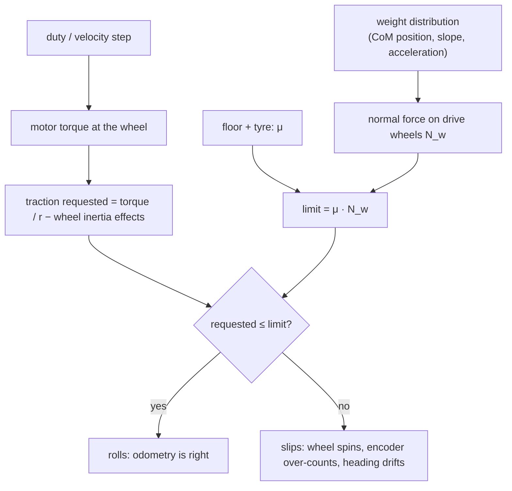

# FP.03 — Friction and traction

<!-- glance:start -->
<!-- generated by tools/build.py from curriculum/syllabus.yaml — edit the syllabus, not this block -->

| | |
|---|---|
| **Track** | Optional foundation |
| **Difficulty** | Beginner |
| **Time** | 40 min |
| **Hardware** | none |
| **Software** | none |
| **Prerequisites** | [FP.02 Forces, mass, weight and Newton's laws](FP.02-forces-newton.md) |
| **Skip if** | You know why wheels slip and how weight affects traction. |

<!-- glance:end -->

## What you will learn

- Explain static and kinetic friction and use $F \le \mu N$ to predict when a wheel slips.
- Compute karmel's maximum acceleration, braking and pushing force from the friction coefficient and the load on the drive wheels.
- Measure a friction coefficient with a tilting board.
- Explain why a robot is often traction-limited rather than torque-limited, and what that means for acceleration limits.
- Simulate wheel slip and see how it corrupts encoder odometry.

## Why it matters

Your odometry ([module 09](../../09-odometry/09.01-diff-drive-kinematics.md)) assumes the wheel rolls without slipping: one wheel revolution means $2\pi r$ of travel. Every slip breaks that assumption silently. A hard start, a dusty kitchen tile or a rug edge each add a few centimetres of error that no calibration can remove. Friction also decides whether a small robot can climb a ramp, push open a door, or stop before the stairs. It is behind the `max_linear_accel_m_s2: 1.0` in [`karmel.yaml`](../../labs/config/karmel.yaml). The same physics sets the `mu` values you give Gazebo in [06.05](../../06-simulation/06.05-robot-in-gazebo.md), and it is why [07.02](../../07-sensors/07.02-wheel-encoders-in-depth.md) warns about slip. In [15.01](../../15-manipulation/15.01-physics-of-grasping.md), friction is also what holds an object in the gripper.

<!-- prereqs:start -->
## Prerequisites

You need these first:

- [FP.02 Forces, mass, weight and Newton's laws](FP.02-forces-newton.md)

### Optional prerequisite links

None.

Check your readiness: `python course.py why FP.03`
<!-- prereqs:end -->

## Concept

Press your palm on a table and push sideways gently. Nothing moves: the table pushes back with exactly the force you apply. That is **static friction**. It is a *reaction* force: it takes whatever value is needed to prevent sliding, up to a limit. Push harder and at some point your hand breaks loose and slides. While it slides, the resisting force is roughly constant and usually a bit smaller. That is **kinetic friction**.

The limit is proportional to how hard the surfaces are pressed together, the **normal force** $N$:

- static: $F_{friction} \le \mu_s N$
- sliding: $F_{friction} = \mu_k N$, with $\mu_k$ usually a bit smaller than $\mu_s$

$\mu$ (mu) is the **friction coefficient**. It describes the *pair* of materials, not either one alone: rubber on clean tile, rubber on dusty tile, felt on wood. For a first model, contact area does not matter much. A wider tyre does not grip twice as well, although real rubber deviates from this somewhat.

A driven wheel that rolls without slipping uses **static** friction. The contact patch is momentarily at rest on the floor, like a foot during walking. That is the good case: the floor can push the robot with any force up to $\mu_s N_w$. Ask for more and the patch breaks loose. The wheel spins, the grip drops to the kinetic value, and the encoder counts distance the robot never travelled. The way a spinning car tyre loses control is exactly this jump from static to kinetic friction.

Here is the key design insight. **The motor can often push harder than the floor allows.** Karmel's gear motors stall at about 33 N of rim force (both wheels together), but on a good floor the tyres can only transmit about 7 N. So above a certain acceleration karmel is *traction-limited*: more torque only means more wheel spin. That is why acceleration limits exist, and why a "floor it" command ruins odometry.

**Traction** is the usable forward force: $\mu \times$ the normal force *on the driven wheels*. The caster's share of the weight gives no traction at all. As [FP.02](FP.02-forces-newton.md) showed, karmel's caster is in *front* of the axle, so accelerating and climbing shift weight backwards, **onto** the drive wheels — traction is highest exactly when you are asking for it. The price is paid on the other side: braking and going downhill shift it forward onto the caster, so this robot stops worse than it starts.

> [!TIP]
> **Ask your teacher:** "Why doesn't friction depend on contact area in the simple model, and when does that break down for rubber tyres?"

## Technical explanation

### Level 1 — Typical friction coefficients (rough, measure yours)

| Pair | $\mu_s$, rough range | Comment |
|---|---|---|
| Rubber tyre on clean, dry tile or sealed wood | 0.5–0.8 | Good indoor floor |
| Rubber tyre on dusty tile | 0.3–0.4 | Dust and hair act like tiny ball bearings |
| Rubber tyre on polished, slightly damp floor | 0.2–0.3 | Just after mopping |
| Hard plastic (3D-printed wheel) on tile | 0.2–0.4 | Why printed wheels need O-rings or TPU tyres |
| Steel ball caster on tile | rolls, rolling friction only | You want it to roll freely |

These are order-of-magnitude values for planning. Published tables such as the Engineering Toolbox's (linked below) disagree with each other, because surface condition dominates. **Measure your floor** with the tilt test below.

### Level 2 — The tilt test

Put an object on a board and slowly raise one end. It starts to slide when the downhill component of its weight equals the friction limit:

$$W \sin\theta_{slip} = \mu_s W \cos\theta_{slip} \quad\Rightarrow\quad \mu_s = \tan\theta_{slip}$$

The mass cancels out. *Example:* a spare tyre strapped to a small weight starts sliding on a floor tile at 31.0°, so $\mu_s = \tan 31.0° = 0.601$. A phone's inclinometer app measures the angle well enough.

### Level 3 — Traction limits with load transfer

From [FP.02](FP.02-forces-newton.md), with $d_g = 0.04$ m (CoM **ahead of** the axle), $d_c = 0.10$ m (the ball caster, also **ahead of** the axle) and $h = 0.05$ m (CoM height), the caster load while accelerating at $a$ is

$$N_c = \frac{W d_g - m a h}{d_c}, \qquad N_w = W - N_c$$

Note the **minus**: the caster is in front, so accelerating tips load off it and onto the drive wheels, like a rear-wheel-drive car squatting at a green light. The wheels do not slip as long as the traction needed stays below the limit:

$$m a + c_{rr} W \le \mu N_w$$

Substituting $N_w$ and solving for $a$ gives the **maximum acceleration on the flat**:

$$a_{max} = g\,\frac{\mu\,(1 - d_g/d_c) - c_{rr}}{1 - \mu\, h/d_c}$$

*Example, μ = 0.6:* $a_{max} = 9.81 \times \frac{0.6 \times 0.6 - 0.02}{1 - 0.6 \times 0.5} = 9.81 \times \frac{0.34}{0.70} = 4.765$ m/s². The 1.0 m/s² software limit has a very comfortable margin.

*Example, μ = 0.2 (freshly mopped floor):* $a_{max} = 9.81 \times \frac{0.10}{0.90} = 1.090$ m/s². **The software limit is now right at the edge** — 9% of margin, and any patch worse than that slips.

Four things to notice:

1. **Mass cancels.** A heavier robot does not accelerate harder, because traction and inertia both scale with mass. Only *where* the mass sits matters, through $d_g/d_c$ and $h/d_c$.
2. **The denominator is the load transfer, and its sign is the caster's position.** With the caster in front it is $1 - \mu h/d_c < 1$, so the transfer is self-reinforcing and helps. Put the caster behind (karmel's layout until 2026-09) and it becomes $1 + \mu h/d_c$, and the same robot on the same floor manages only 2.566 m/s² at μ = 0.6 instead of 4.765.
3. **Accelerating is easier than braking** for this layout — the exact reverse of a rear-caster robot. Braking shifts load forward, *off* the drive wheels and onto the caster:

$$b_{max} = g\,\frac{\mu(1 - d_g/d_c) + c_{rr}}{1 + \mu h/d_c}$$

   At μ = 0.6 that is 2.868 m/s². Braking is now the tighter of the two, and the `max_deceleration: -1.0` in `controllers.yaml` is the one worth checking on a slippery floor.

4. **There are two more limits, from tipping rather than grip** ([FP.07](FP.07-center-of-mass-stability.md)): past $g\,d_g/h = 7.85$ m/s² of *acceleration* the caster lifts and the robot rears back onto its tail, and past $g\,(d_c-d_g)/h = 11.77$ m/s² of braking the CoM passes the caster and it noses over. `max_accel` and `max_brake` in the code below return the smaller of the grip and tipping limits. At μ = 0.8 grip still wins, but only just — 7.521 against 7.85 — and on a grippier surface (μ = 1.0, a rubber mat) grip would allow 11.4 m/s² and the robot would rear up instead. Moving the battery *back* towards the axle to chase traction runs into the rearing limit fast: at $d_g = 0.01$ m it is only 1.96 m/s², well below what grip would permit.

### Level 3b — Pushing, and why karmel is traction-limited

Karmel pushes against a wall, or a kitchen scale, at bumper height $h_p = 0.04$ m. The wall pushes back with $P$ at that height, which shifts load *off* the front caster and onto the drive wheels — the same sign as acceleration:

$$P_{max} = \frac{\mu W (1 - d_g/d_c)}{1 - \mu h_p/d_c}$$

At μ = 0.6: $P_{max} = \frac{0.6 \times 15.696 \times 0.6}{1 - 0.24} = 7.44$ N, which reads as **758 g** on a scale. (With the caster behind, the same robot managed 465 g. Pushing is one of the places a front caster is worth real money.)

What can the motors do? The Yahboom 520 1:56 datasheet gives a stall torque of 8.3 kg·cm = 0.814 N·m at 12 V, which is about 0.733 N·m at the 10.8 V nominal. At the rim of a 45 mm-radius wheel that is $0.733/0.045 = 16.3$ N per wheel, **32.6 N for both**. That is about 7× what the floor can take. Wheels spin long before the motors stall, which is also good news for the motors ([FP.04](FP.04-torque-gears-wheels.md) does the sizing).

### Level 3c — Slip and odometry

Define the **slip speed** as $\omega r - v$: how much faster the tyre surface moves than the robot. Real tyres always creep a tiny bit under load, producing traction roughly proportional to slip speed, until the force hits $\mu N$ and the wheel breaks loose. Encoders measure $\omega r$, so every millimetre of slip becomes an odometry error. On a differential-drive robot, *unequal* slip between the two wheels turns into a heading error, and heading errors grow into large position errors over distance ([09.03](../../09-odometry/09.03-dead-reckoning-integration.md)).

### Level 4 — Turning, casters and what simulators need

- **Rotating in place.** Both wheels roll along a circle around the robot's centre without scrubbing. The ball caster rolls along its own arc. A swivel caster must first *turn* to align, which gives a small jerk at the start of a turn. Robots with four fixed wheels (skid-steer) must scrub their tyres sideways to turn. That wastes energy and makes odometry heading unreliable.
- **Gazebo.** A contact has friction coefficients `mu` and `mu2` for two directions. Drive wheels get realistic values (≈ 0.6–1.0). The caster should have near-zero friction, or it will act like a brake ([06.05](../../06-simulation/06.05-robot-in-gazebo.md)).

## Diagram

The friction curve, force the floor delivers against the force requested:

```text
 traction force
 delivered [N]
      │                 static limit μs·N_w
 7.4 ─┤. . . . . . . . ●
      │               ╱ ╲___________________  kinetic ≈ μk·N_w (wheel spinning)
      │             ╱
      │           ╱   rolling without slip:
      │         ╱     floor gives exactly what is asked
      │       ╱
      │     ╱
      │   ╱
      └─╱─────────────────┬──────────────────► traction requested (m·a + losses)
      0                  7.4
```

What decides whether karmel's start is clean or ruins odometry:



## Code

Save as `fp03_traction.py` and run `python fp03_traction.py`. It computes the traction limits for several floors, compares them with the motors' stall force, and simulates a full-duty start in three situations. The robot and its wheels are modelled as separate masses, with a tyre force that saturates at $\mu N_w$ and two DC motors with a straight-line torque-speed curve. The wheel inertia, 6×10⁻³ kg·m² for both wheels including the gearbox and motor rotors, is the estimate derived in [FP.06](FP.06-rotational-motion-inertia.md).

```python
"""FP.03 — traction limits and wheel slip on karmel.

Run: python fp03_traction.py   (needs numpy + matplotlib)
"""
from __future__ import annotations

import math
from dataclasses import dataclass

import matplotlib

matplotlib.use("Agg")
import matplotlib.pyplot as plt
import numpy as np

G = 9.81


@dataclass(frozen=True)
class Robot:
    mass_kg: float = 1.6
    wheel_radius_m: float = 0.045
    com_ahead_axle_m: float = 0.04      # d_g, POSITIVE = in front of the axle
    com_height_m: float = 0.05          # h
    caster_ahead_axle_m: float = 0.10   # d_c, karmel's caster is in FRONT of the axle
    c_rr: float = 0.02
    wheel_inertia_kgm2: float = 6.0e-3  # both wheels incl. gearbox + rotor, seen at the wheel (FP.06 estimate)


def max_accel(r: Robot, mu: float) -> float:
    """Largest forward acceleration on the flat before the drive wheels slip (load transfer included).

    mu (W - N_c) = m a + c_rr W,   N_c = (W d_g - m a h) / d_c

    With the caster in FRONT, accelerating unloads it and loads the drive wheels, so the load
    transfer helps: the denominator is (1 - mu h/d_c), not (1 + ...). The second limit is FP.07's:
    past g d_g / h the caster lifts and the robot rears up.
    """
    a = G * (mu * (1 - r.com_ahead_axle_m / r.caster_ahead_axle_m) - r.c_rr) / (
        1 - mu * r.com_height_m / r.caster_ahead_axle_m)
    a_tip = G * r.com_ahead_axle_m / r.com_height_m
    return min(a, a_tip)


def max_brake(r: Robot, mu: float) -> float:
    """Largest deceleration on the flat before the wheels skid (braking moves load onto the caster)."""
    b = G * (mu * (1 - r.com_ahead_axle_m / r.caster_ahead_axle_m) + r.c_rr) / (
        1 + mu * r.com_height_m / r.caster_ahead_axle_m)
    # beyond this the CoM passes the caster and the robot noses over it (FP.07)
    b_tip = G * (r.caster_ahead_axle_m - r.com_ahead_axle_m) / r.com_height_m
    return min(b, b_tip)


def max_push(r: Robot, mu: float, push_height_m: float) -> float:
    """Force the robot can push against a wall (or a scale) before its wheels spin."""
    W = r.mass_kg * G
    return mu * W * (1 - r.com_ahead_axle_m / r.caster_ahead_axle_m) / (
        1 - mu * push_height_m / r.caster_ahead_axle_m)


def simulate_drive(r: Robot, mu: float, duty: float, ramp_s: float, t_end: float = 1.5, dt: float = 1e-4,
                   stall_nm: float = 0.733, no_load_rad_s: float = 19.32,
                   stiffness_n_per_m_s: float = 1000.0):
    """1-D robot + lumped wheels driven by two DC gear motors (straight torque-speed line at 10.8 V).

    Duty ramps from 0 to `duty` over `ramp_s` seconds (ramp_s = 0 is a step).
      J dω/dt = τ - r F      m dv/dt = F - c_rr W      F = clip(k (ω r - v), ±mu N_w)
      τ = 2 * stall * (d - ω / ω0)   (both motors, d = present duty)
    Returns true distance, distance the encoders report, and the time spent slipping.
    """
    m, W, R = r.mass_kg, r.mass_kg * G, r.wheel_radius_m
    v = w = x = theta = 0.0
    a_prev = slipping = 0.0
    for i in range(int(round(t_end / dt))):
        t = i * dt
        d = duty if ramp_s <= 0 else duty * min(1.0, t / ramp_s)
        torque = 2 * stall_nm * (d - w / no_load_rad_s)
        n_wheels = W - (W * r.com_ahead_axle_m - m * a_prev * r.com_height_m) / r.caster_ahead_axle_m
        f_limit = mu * n_wheels
        f_wanted = stiffness_n_per_m_s * (w * R - v)
        F = max(-f_limit, min(f_limit, f_wanted))
        if abs(f_wanted) >= f_limit:
            slipping += dt
        a = (F - r.c_rr * W) / m if (v > 0 or F > r.c_rr * W) else 0.0
        w += (torque - R * F) / r.wheel_inertia_kgm2 * dt
        v += a * dt
        x += v * dt
        theta += w * dt
        a_prev = a
    return x, theta * R, slipping


def main() -> None:
    k = Robot()
    print("mu    a_max[m/s^2]  brake_max[m/s^2]  push@4cm[N] (reads on a scale)")
    for mu in (0.2, 0.3, 0.6, 0.8):
        p = max_push(k, mu, 0.04)
        print(f"{mu:.1f}   {max_accel(k, mu):10.3f}  {max_brake(k, mu):14.3f}  {p:9.3f}  ({p / G * 1000:.0f} g)")
    print(f"tilt test: slides at 31.0 deg -> mu_s = tan(31.0 deg) = {math.tan(math.radians(31.0)):.3f}")

    stall_per_wheel = 0.8139 * 10.8 / 12.0          # N*m at the gearbox output, scaled to 10.8 V
    print(f"motor stall force at the rim (both wheels): {2 * stall_per_wheel / k.wheel_radius_m:.1f} N "
          f"vs traction limit {max_push(k, 0.6, 0.04):.2f} N at mu=0.6")

    print("\nfull duty, 1.5 s                             true[m]  odom[m]  error   slipping")
    for label, mu, ramp in (("step, mu=0.6 (no acceleration limit)", 0.6, 0.0),
                            ("ramp over 0.8 s, mu=0.6", 0.6, 0.8),
                            ("step, dusty floor mu=0.2", 0.2, 0.0),
                            ("ramp over 0.8 s, dusty floor mu=0.2", 0.2, 0.8)):
        x, odo, slip = simulate_drive(k, mu, 1.0, ramp)
        print(f"  {label:40s} {x:6.3f}  {odo:6.3f}  {(odo - x) / x * 100:5.1f} %  {slip:.2f} s")

    ramps = np.linspace(0.0, 1.2, 13)
    fig, ax = plt.subplots(figsize=(7, 4))
    for mu in (0.15, 0.2, 0.3):
        errs = []
        for ramp in ramps:
            x, odo, _ = simulate_drive(k, mu, 1.0, ramp)
            errs.append((odo - x) / x * 100)
        ax.plot(ramps, errs, "o-", label=f"mu = {mu}")
    ax.set_xlabel("duty ramp time 0 -> 100 % [s]")
    ax.set_ylabel("odometry overestimate after 1.5 s [%]")
    ax.set_title("karmel: wheel slip corrupts odometry when you accelerate too hard")
    ax.grid(True)
    ax.legend()
    fig.tight_layout()
    fig.savefig("fp03_slip.png", dpi=120)
    print("saved fp03_slip.png")


if __name__ == "__main__":
    main()
```

Output:

```text
mu    a_max[m/s^2]  brake_max[m/s^2]  push@4cm[N] (reads on a scale)
0.2        1.090           1.249      2.047  (209 g)
0.3        1.847           1.706      3.211  (327 g)
0.6        4.765           2.868      7.435  (758 g)
0.8        7.521           3.504     11.080  (1129 g)
tilt test: slides at 31.0 deg -> mu_s = tan(31.0 deg) = 0.601
motor stall force at the rim (both wheels): 32.6 N vs traction limit 7.43 N at mu=0.6

full duty, 1.5 s                             true[m]  odom[m]  error   slipping
  step, mu=0.6 (no acceleration limit)      1.181   1.187    0.5 %  0.09 s
  ramp over 0.8 s, mu=0.6                   0.837   0.839    0.2 %  0.00 s
  step, dusty floor mu=0.2                  0.946   1.187   25.4 %  0.75 s
  ramp over 0.8 s, dusty floor mu=0.2       0.837   0.839    0.2 %  0.00 s
saved fp03_slip.png
```

**The plot `fp03_slip.png`** shows odometry overestimate (%) against how long the duty ramp takes, from 0 (a step) to 1.2 s, for μ = 0.15, 0.2 and 0.3. (Higher μ is not plotted because with the caster in front this robot barely slips above μ ≈ 0.4 — see the discussion above.)

- **μ = 0.3:** the error starts at 9.7% for a step and reaches zero at about a 0.5 s ramp.
- **μ = 0.2:** it starts at 25.4% and reaches zero at about 0.8 s.
- **μ = 0.15:** it starts at 50.4% and still has 2% left at a 1.1 s ramp.

The lines fall roughly linearly. The lesson in one picture: a gentler acceleration buys correct odometry, and a slippery floor needs a much gentler one. The remaining 0.2% at long ramps is tyre creep.

## Exercise

### Exercise FP.03-E1 — Limits on your floor `[numerical]`

Hardware: none. Your tilt test gave a slip angle of 24.2° for a karmel tyre on your floor.

1. What is $\mu_s$?
2. Using the lesson's karmel model, compute $a_{max}$, $b_{max}$ and the pushing force $P_{max}$ at 4 cm bumper height.
3. Is the 1.0 m/s² acceleration limit in `karmel.yaml` safe on this floor?

### Exercise FP.03-E2 — Find the gentlest safe start `[coding]`

Hardware: none. Using `simulate_drive` on a μ = 0.4 floor, find the shortest duty ramp time, to 0.02 s resolution, for which the robot spends **zero** time slipping. Compare it with `max_accel(Robot(), 0.4)`. Then slide the battery forward, towards the caster, so the CoM sits 0.07 m ahead of the axle instead of 0.04 m, and find the new shortest ramp.

### Exercise FP.03-E3 — Predict: heavier, and battery moved `[predict]`

Hardware: none. Before computing, predict whether each change *raises*, *lowers* or *leaves unchanged* $a_{max}$ at μ = 0.3:

1. Add 0.5 kg of payload exactly at the existing CoM (total 2.1 kg).
2. Move the battery so the CoM sits 0.07 m instead of 0.04 m ahead of the axle — towards the caster.
3. Add 0.5 kg at the existing CoM: what happens to $P_{max}$, the pushing force?

Then check each with the functions above.

### Exercise FP.03-E4 — Push test on a scale `[hardware]`

Hardware: `robot-base` and a kitchen scale. No-hardware alternative: tilt-test a rubber eraser or a spare tyre on your floor and use E1's method.

> [!CAUTION]
> **Safety:** Pushing against an obstacle loads the motors hard. Limit duty to 40% and each push to **2 seconds**, so the motors and driver do not overheat. Keep the watchdog on, keep a hand on the power switch, and keep fingers away from the wheels.

1. Fix the kitchen scale vertically against a wall, for example taped to a heavy book standing on edge.
2. Drive karmel slowly into it at 40% duty and watch the reading climb until the wheels spin.
3. Repeat three times on your floor and once on a rug. Estimate μ using $P_{max}$ solved for μ: $\mu = \frac{P}{W(1-d_g/d_c) + P h_p/d_c}$.

## Expected result

**FP.03-E1:**
1. $\mu_s = \tan 24.2° = 0.449 \approx 0.45$.
2. $a_{max} = 3.16$ m/s², $b_{max} = 2.32$ m/s², $P_{max} = 5.16$ N (526 g). Note which of the first two is smaller: with the caster in front, **braking** is the tighter limit.
3. Yes, with a factor of 3 margin on acceleration and 2.3 on braking. A dusty patch (μ ≈ 0.25) brings $a_{max}$ down to 1.46 m/s² and $b_{max}$ to 1.45, so the margin is thinner than it looks — and it disappears on the braking side first.

**FP.03-E2:**
- **CoM 0.04 m ahead of the axle:** `max_accel(Robot(), 0.4)` = 2.698 m/s², and the shortest slip-free ramp is **0.30 s** (0.28 s still slips for about 0.04 s).
- **CoM 0.07 m ahead of the axle:** the limit *falls* to 1.226 m/s², because only 30 % of the weight is now on the drive wheels, and the shortest slip-free ramp more than doubles to **0.72 s** (0.70 s slips for 0.17 s). Sliding the battery towards the caster is the one adjustment that makes a front-caster robot worse at everything. Accept ±0.02 s if you changed the time step.

**FP.03-E3:**
1. **Unchanged:** 1.847 m/s² at both 1.6 kg and 2.1 kg. Mass cancels.
2. **Lowers** it, from 1.847 to 1.226 m/s². Predicting "raises" is the natural mistake: on a *rear*-caster robot moving the CoM towards the caster does load the drive wheels, but karmel's caster is at the front, so it unloads them.
3. **Raises** $P_{max}$ in proportion to weight, by a factor of 2.1/1.6. At μ = 0.6 it goes from 7.44 N to 9.76 N. The pushing force depends on weight; acceleration does not.

**FP.03-E4:** On clean tile or wood, expect peak readings of about 350–550 g, which gives μ ≈ 0.45–0.7. On a rug, the wheels may sink and grip better or worse; the readings vary by more than ±20% between tries. The wheels spinning *before* the motors stall is the expected, traction-limited behaviour.

## Troubleshooting

### Symptom: odometry says the robot went further than the tape measure, mostly on starts
1. Log the commanded and measured wheel speed. If the wheel speed jumps faster than $a_{max}/r$ allows, the wheel is spinning.
2. Lower the acceleration limit, or ramp the setpoint, and repeat. If the error drops, it was slip.
3. If the error does not change with acceleration, it is a calibration error (wheel radius) instead. See [09.05](../../09-odometry/09.05-calibrating-odometry.md).

### Symptom: the robot veers at every start but drives straight once moving
1. Unequal slip: one wheel has less load or a dirtier tyre. Check both tyres for dust and hair and clean them with a damp cloth.
2. Check the weight distribution side to side with a scale under each wheel. A battery sitting off-centre is common.
3. Check that both motors ramp together. A controller that starts one wheel earlier looks the same as slip.

### Symptom: the tilt-test values scatter widely
1. Clean both surfaces and repeat five times. Use the median.
2. Raise the board slowly. A sudden jerk triggers early sliding.
3. Make sure the object slides rather than rolls or tips. A tall object tips before it slides when its height exceeds its width divided by μ.

### Symptom: in Gazebo the robot barely turns, or skids everywhere
1. Check the caster friction. A caster with `mu` = 1 brakes every turn; set it near 0.
2. Check the wheel `mu`/`mu2` values and that the wheel collision geometry is a cylinder that actually touches the ground.

## Common mistakes

- **Adding motor torque to fix slipping.** A traction-limited robot needs less acceleration, more load on the drive wheels, or grippier tyres, not a bigger motor.
- **Using the robot's total weight for traction.** Only the load on the *driven* wheels counts, and it changes with acceleration and slope.
- **Believing a heavier robot accelerates better.** Mass cancels. Only the weight *distribution* changes $a_{max}$.
- **Trusting a μ from a table.** Surface condition dominates. Measure it on your floor.
- **Giving the simulated caster realistic rubber friction.** It then acts as a brake in turns and the simulation disagrees with reality.
- **Ignoring slip in odometry tests.** Calibrating the wheel radius on runs with hard starts bakes slip into your calibration.

## Knowledge check

1. What is the difference between static and kinetic friction, and which one does a rolling wheel use?
   <details><summary>Answer</summary>

   Static friction takes whatever value prevents sliding, up to $\mu_s N$. Kinetic friction is the roughly constant force while surfaces slide, $\mu_k N$, usually a bit smaller. A wheel rolling without slip uses **static** friction, because its contact patch is momentarily at rest on the floor.
   </details>

2. A tyre starts sliding on a board tilted to 20°. What is $\mu_s$?
   <details><summary>Answer</summary>

   tan 20° = **0.364**.
   </details>

3. Why does karmel's maximum acceleration not depend on its mass?
   <details><summary>Answer</summary>

   The available traction is proportional to weight ($\mu N_w$, and $N_w \propto m g$). The force needed to accelerate is proportional to mass ($m a$). Both scale with $m$, so it cancels. Only the geometry of the weight distribution ($d_g$, $h$, $d_c$) and μ remain.
   </details>

4. Karmel's motors can deliver about 33 N at the rims, but it only pushes a scale to about 758 g on tile. What limits it, and what happens to the extra torque?
   <details><summary>Answer</summary>

   Traction limits it: $\mu N_w \approx 7.4$ N. The extra torque spins the wheels, turning it into slip and heat instead of force.
   </details>

5. Predict: you mop the floor (μ drops from 0.6 to 0.2) and keep the 1.0 m/s² acceleration limit. What happens to odometry?
   <details><summary>Answer</summary>

   $a_{max}$ drops to 1.090 m/s², *just* above the 1.0 m/s² limit, so a clean start still works — with 9 % of margin, which is nothing. A dusty patch at μ = 0.15 takes it to 0.742 m/s² and every full start slips: odometry over-counts distance by up to 50 % in the simulation's step case, and unequal slip adds heading errors. The braking side is worse: $b_{max}$ at μ = 0.2 is 1.249 m/s² against a configured `max_deceleration` of 1.0, so the same mopping leaves 25 % of margin on stops. Check both limits, not just the one the config file names first.
   </details>

6. Debugging: the robot turns fine on the real floor, but in Gazebo it barely rotates in place and the wheels spin. What do you check first?
   <details><summary>Answer</summary>

   The caster's friction coefficients. A caster with rubber-like `mu` drags sideways and resists rotation. Set it near 0. Then check the wheel `mu` values and that the wheel collisions touch the ground.
   </details>

7. Which gives more traction for accelerating forwards: moving the battery 3 cm towards the axle, or adding a 300 g weight at the current CoM? Explain.
   <details><summary>Answer</summary>

   **Moving the battery towards the axle** — and on karmel that means moving it *backwards*, away from the caster, because the caster is at the front. It puts a larger fraction of the weight on the drive wheels and raises $a_{max}$, though not past the rearing limit $g\,d_g/h$, which falls as the CoM approaches the axle. Adding mass at the CoM raises traction and inertia equally, so $a_{max}$ does not change at all.
   </details>

## Practical challenge

Build an **automatic slip detector** in simulation. Take the ideas from `simulate_drive` and log the data the Pico would actually provide: wheel speed from the encoders, the commanded duty, and (optionally) forward acceleration from an IMU ([07.05](../../07-sensors/07.05-imu-fundamentals.md)). Flag slip whenever the wheel's acceleration, $r\,\dot\omega$, exceeds your computed $a_{max}$ by more than 30%.

**Acceptance criteria:**
- On the step start at μ = 0.6, the detector flags slip within 50 ms of its onset and clears within 50 ms of the end of the true slipping period.
- On the 0.8 s ramp at μ = 0.6 it raises **no** flags.
- On the **step** start at μ = 0.2 it flags slip for at least 70% of the true slipping time (the 0.8 s ramp at μ = 0.2 does not slip at all on this robot — check that it raises no flags there either).
- You report precision and recall against the simulator's ground-truth slip flag in a short table, and discuss one false-positive source (for example, encoder noise differentiated at 50 Hz, see [FP.01](FP.01-kinematics-units.md)).

## You can skip this if…

You get knowledge-check questions 3, 5 and 7 right without looking, and you can derive $a_{max}$ with load transfer for a robot with a caster at either end, getting the sign of the transfer right without being told.

`python course.py skip FP.03 --reason "know static/kinetic friction, traction and slip"`

## Go deeper

- [OpenStax University Physics Volume 1](https://openstax.org/details/books/university-physics-volume-1): chapter 6.2 "Friction" covers static and kinetic friction with the tilt-board analysis.
- [Engineering Toolbox, friction coefficients](https://www.engineeringtoolbox.com/friction-coefficients-d_778.html): a large table of μ for material pairs. Use it for orders of magnitude, then measure.
- [Wikipedia, Rolling resistance](https://en.wikipedia.org/wiki/Rolling_resistance): why rolling loses energy and typical coefficients.
- [SDFormat specification, collision/surface/friction](https://sdformat.org/spec?elem=collision): where `mu` and `mu2` live in Gazebo models, for when you reach 06.05.

## Progress checkpoint

- [ ] I can explain static against kinetic friction and apply $F \le \mu N$.
- [ ] I can compute $a_{max}$, $b_{max}$ and pushing force with load transfer.
- [ ] I can measure μ with a tilt test.
- [ ] I can explain why karmel is traction-limited and what that means for acceleration limits.
- [ ] I have seen in simulation how slip corrupts odometry.

`python course.py complete FP.03` (exercises done) · `python course.py master FP.03` (challenge done) · `python course.py struggle FP.03 "what was hard"`

Next: [FP.04 — Torque, gears and wheels](FP.04-torque-gears-wheels.md).
