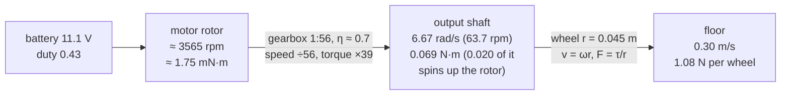

# FP.04 — Torque, gears and wheels — sizing motors

<!-- glance:start -->
<!-- generated by tools/build.py from curriculum/syllabus.yaml — edit the syllabus, not this block -->

| | |
|---|---|
| **Track** | Optional foundation |
| **Difficulty** | Beginner |
| **Time** | 1 h |
| **Hardware** | none |
| **Software** | python |
| **Prerequisites** | [FP.02 Forces, mass, weight and Newton's laws](FP.02-forces-newton.md) |
| **Optional prerequisites** | [FM.06 Dot product and cross product](../mathematics/FM.06-dot-and-cross-product.md) |
| **Skip if** | You can size a drive motor for a robot's mass, slope and acceleration. |

<!-- glance:end -->

## What you will learn

- Explain torque as force × lever arm and convert between N·m and the kg·cm used on hobby datasheets.
- Follow torque and speed through a gearbox and a wheel, forwards (motor → floor) and backwards (requirement → motor).
- Read a gear-motor datasheet, including spotting numbers that contradict each other, and build the straight-line speed-torque model.
- Size a drive motor for a robot's mass, slope, acceleration and top speed, with sensible margins.
- Choose between gear ratios by comparing torque margin, top speed and low-speed controllability.

## Why it matters

Karmel uses Yahboom 520 gear motors with a 1:56 gearbox, and a 1:30 version exists too. Which one is right? Will the robot still climb the ramp into the balcony after you bolt the SO-101 arm on top? Why does the motor get hot when the robot pushes against a wall? This lesson answers those questions with numbers.

You meet torque physically when you mount the motors in [01.06](../../01-first-robot/01.06-mechanical-assembly.md) and set the motor limits in [08.12](../../08-control/08.12-control-in-ros2.md). You meet stall current electrically in [FE.10](../electronics/FE.10-dc-motors.md) and [02.02](../../02-robot-electronics/02.02-power-budget.md). The same "torque = force × lever arm" reasoning sizes arm servos in [14.03](../../14-robotic-arm/14.03-controlling-servos.md).

<!-- prereqs:start -->
## Prerequisites

You need these first:

- [FP.02 Forces, mass, weight and Newton's laws](FP.02-forces-newton.md)

### Optional prerequisite links

New to any of these? Take the foundation lesson first; skip it if you already know it.

- [FM.06 Dot product and cross product](../mathematics/FM.06-dot-and-cross-product.md)

Check your readiness: `python course.py why FP.04`
<!-- prereqs:end -->

## Concept

Open a door by pushing next to the handle, then try pushing next to the hinges. The same push does much less, because what turns things is not force alone but **force × distance from the pivot**. That product is **torque**, measured in newton-metres (N·m).

A wheel is torque turned back into force. The motor twists the axle, and at the rim, a radius $r$ away, that twist becomes a push on the floor: $F = \tau / r$. A **bigger wheel** gives *less* push for the same torque but covers more ground per revolution. It works like a longer lever: more speed, less force.

A **gearbox** trades speed for torque. Small DC motors spin very fast (the 520's rotor turns at about 12,000 rpm) but with a feeble twist. A 1:56 gearbox makes the output turn 56 times slower and, ideally, 56 times stronger. Friction in the gears eats part of that, so the real gain is ratio × efficiency. The gearbox is to motors what batching is to a network link: lower rate, more work done per operation.

Every DC motor has a **speed-torque line**. Unloaded it spins at its no-load speed. Load it harder and it slows down, until at the **stall torque** it stops completely and draws its maximum current. Current is roughly proportional to torque, so a stalled motor draws the most current and heats fastest. **Sizing** a motor means checking that every operating point you care about sits comfortably inside that line: far enough from stall to stay cool, and far enough from no-load speed to leave the speed controller headroom.

> [!TIP]
> **Ask your teacher:** "Show me why a motor's maximum output power is at half the no-load speed and half the stall torque, first with a sketch and then with the equation."

## Technical explanation

### Level 1 — Torque and its units

$$\tau = r \times F \quad\text{(magnitude } \tau = r F \sin\phi\text{, where } \phi \text{ is the angle between the lever and the force)}$$

For a wheel pushing along the floor, the force is perpendicular to the radius, so $\tau = rF$.

*Example:* one of karmel's wheels ($r = 0.045$ m) pushing the floor with 1.08 N needs $0.045 \times 1.08 = 0.0486$ N·m.

**kg·cm** is the hobby unit: the torque from 1 kgf (9.81 N) at 1 cm (0.01 m).

$$1\ \text{kg·cm} = 9.80665 \times 0.01 = 0.0981\ \text{N·m}$$

*Example:* the 520 1:56 motor's 8.3 kg·cm stall torque is $8.3 \times 0.0981 = 0.814$ N·m.

> [!NOTE]
> The cross product in $\tau = r \times F$ is explained in [FM.06 Dot and cross product](../mathematics/FM.06-dot-and-cross-product.md). For wheels and levers, "force × perpendicular distance" is all you need.

### Level 2 — Through the gearbox and the wheel

With gear ratio $N$ (motor turns per output turn) and gearbox efficiency $\eta$:

$$\omega_{out} = \frac{\omega_{motor}}{N}, \qquad \tau_{out} = \eta\, N\, \tau_{motor}$$

Then at the wheel of radius $r$:

$$v = \omega_{out}\, r, \qquad F = \frac{\tau_{out}}{r}$$

**Power** is conserved except for losses: $P = \tau\omega = F v$. The gearbox changes the *form* of the power (fast and weak into slow and strong), never the amount.

Spur gearboxes like the 520's are often quoted at 60–80% efficiency. We assume 0.7 when we need it, but gear-motor datasheets quote torque **at the output shaft**, so the losses are already included in their numbers.

**Karmel forwards:** the rotor at 12,000 rpm (the datasheet's pre-gearbox figure) ÷ 56 = 214 rpm, close to the 205 rpm output rating. The difference is losses and tolerance. At 205 rpm = 21.47 rad/s the rim moves at $21.47 \times 0.045 = 0.966$ m/s.

**Karmel backwards (the sizing direction):** start from what the floor needs. From [FP.02](FP.02-forces-newton.md), climbing a 5° ramp while accelerating at 0.3 m/s² takes $F = 2.161$ N in total, or 1.080 N per wheel. Then:

- Wheel torque from force: $1.080 \times 0.045 = 0.0486$ N·m.
- Spinning up the wheel and gearbox itself: $\tau = J\alpha$ ([FP.06](FP.06-rotational-motion-inertia.md)). The wheel is light, but the motor rotor spins 56× faster, and its inertia appears multiplied by $56^2$ at the wheel. [FP.06](FP.06-rotational-motion-inertia.md) estimates the total at $J \approx 3.0\times10^{-3}$ kg·m² per wheel. With $\alpha = a/r = 6.67$ rad/s² that adds $0.020$ N·m.
- **Per wheel: 0.0686 N·m = 0.70 kg·cm, at $\omega = 0.3/0.045 = 6.67$ rad/s (63.7 rpm).**
- At the motor shaft: $0.0686/(56 \times 0.7) = 1.75$ mN·m at 3565 rpm. That tiny torque is why the gearbox exists.

### Level 3 — The speed-torque line and reading a datasheet

A brushed DC motor at a fixed voltage behaves, to a good approximation, like a straight line:

$$\omega = \omega_0\left(1 - \frac{\tau}{\tau_s}\right), \qquad I \approx I_0 + (I_s - I_0)\frac{\tau}{\tau_s}, \qquad P_{out} = \tau\omega$$

Here $\omega_0$ is the no-load speed, $\tau_s$ the stall torque, $I_s$ the stall current and $I_0$ the no-load current. Both $\omega_0$ and $\tau_s$ scale with voltage. Output power peaks at half stall torque:

$$P_{max} = \frac{\tau_s \omega_0}{4}$$

[FE.10](../electronics/FE.10-dc-motors.md) explains the electrical reason behind the straight line. PWM duty $d$ acts like a voltage scale ([FE.07](../electronics/FE.07-pwm.md)), so the line becomes $\tau = \tau_s(d - \omega/\omega_0)$.

**The Yahboom 520 datasheet** (MD520Z56_12V and MD520Z30_12V, linked in Go deeper) lists:

| Variant | Ratio | Output speed | "Rated torque" | "Rated current" | Stall torque | Stall current |
|---|---|---|---|---|---|---|
| MD520Z56 | 1:56 | 205 ± 10 rpm | 6.5 kg·cm | 0.3 A | 8.3 kg·cm | 4 A |
| MD520Z30 | 1:30 | 333 ± 10 rpm | 3.3 kg·cm | 0.3 A | 4.8 kg·cm | 3 A |

Read it critically. By the straight-line model, 6.5 kg·cm is 78% of stall, which would need about 3.1 A and leave the motor turning at only about 45 rpm. It cannot be a continuous rating at 0.3 A. The "rated current" is also identical for every gear ratio. Cheap datasheets often mix no-load and loaded figures like this. **Trust the no-load speed and the stall torque and current; treat "rated" figures as unreliable.** Then measure: no-load speed with encoders ([08.02](../../08-control/08.02-motor-step-response.md)), and current with the INA219 ([02.02](../../02-robot-electronics/02.02-power-budget.md)).

At the 11.1 V nominal battery voltage, the 1:56 model becomes $\omega_0 = 19.86$ rad/s (0.894 m/s at the rim), $\tau_s = 0.753$ N·m, $I_s = 3.70$ A and $P_{max} = 3.74$ W. Karmel's config uses 17 rad/s as the loaded maximum, which is consistent with this.

### Level 3b — Sizing rules

For each operating point (torque $\tau$ and speed $\omega$ per wheel), check:

1. **Thermal margin:** keep continuous torque at or below **~25% of stall torque**. This is a common rule of thumb for small brushed gear motors: current, and so heating ($I^2R$), stays low. Short peaks can go higher.
2. **Speed headroom:** $\omega \le 0.8 \times \omega_0(1 - \tau/\tau_s)$, so the speed controller has about 20% in reserve for battery sag and disturbances.
3. **Traction:** the force must not exceed $\mu N_w$ ([FP.03](FP.03-friction-traction.md)), or torque margin is irrelevant.
4. **Controllability at low speed:** the duty needed for your slowest useful speed should sit well above the driver and motor **deadband** (0.12 duty in `karmel.yaml`).

The ideal duty for an operating point comes from the line: $d = \omega/\omega_0 + \tau/\tau_s$.

*Example, scenario B (5° ramp, 0.3 m/s², 0.3 m/s) on the 1:56 motor:*
- Torque is $0.0686/0.753 = 9.1\%$ of stall.
- The available speed at that torque is $19.86 \times (1 - 0.091) = 18.05$ rad/s. We need 6.67 rad/s, so there is plenty of headroom.
- Duty is $6.67/19.86 + 0.091 = 0.43$.
- Verdict: comfortably sized.

*Low-speed example:* crawling at 0.1 m/s on the flat needs a duty of 0.12 on the 1:56 motor, right at the deadband. On the 1:30 motor it needs 0.085, below the deadband, so it cannot crawl smoothly without closed-loop tricks. That is a real reason to prefer the higher ratio on a slow indoor robot.

### Level 4 — Choosing between gear ratios

The script below evaluates four scenarios for both motors:

| Scenario (per wheel) | Torque | Speed | 1:56 % stall / duty | 1:30 % stall / duty |
|---|---|---|---|---|
| A: cruise 0.5 m/s, flat | 0.0071 N·m | 11.1 rad/s | 0.9% / 0.57 | 1.6% / 0.36 |
| B: 5°, 0.3 m/s², 0.3 m/s | 0.0686 N·m | 6.67 rad/s | 9.1% / 0.43 | 15.8% / 0.36 |
| C: 1.0 m/s² to 0.5 m/s, flat | 0.1097 N·m | 11.1 rad/s | 14.6% / 0.71 | **25.2%**, runs hot |
| D: with arm, 2.25 kg, 10°, 0.3 m/s² | 0.1312 N·m | 6.67 rad/s | 17.4% / 0.51 | **30.1%**, runs hot |

Look at scenario C: of its 0.110 N·m, 0.055 N·m, fully half, only spins up the motor rotors through the gearbox. On a high-ratio drive, the motor's own inertia is a big part of the load.

The 1:30 motor is 60% faster at the top end but fails the thermal rule in the hard-acceleration and arm scenarios, and it cannot crawl. The 1:56 is the better choice for karmel's mission: indoor, slow, a future arm, precise low speeds. Its encoder also gives 2464 ticks per wheel revolution against 1320. Both motors are far stronger than the floor's traction allows (FP.03), which is normal for small robots. Oversizing costs a little weight and gives robustness.

Other gearbox properties matter for robotics:

- **Backlash.** Play in the gear teeth. The output can wiggle a little without the motor turning, which blurs encoder-based position control. Encoders on the *motor* shaft, as on the 520, cannot see the backlash.
- **Back-driveability.** A high-ratio spur or worm gearbox is hard to turn from the wheel side. Karmel resists being pushed by hand when unpowered. That is good for holding position on a ramp and bad for anything that expects free rolling.

## Diagram

The chain from electrons to floor force, with karmel's numbers for scenario B:



The speed-torque line of the 520 1:56 at 11.1 V, with scenario operating points:

```text
 wheel speed
 [rad/s]
  19.9 ●  no-load
       │ ╲
       │   ╲
  11.1 │ A  C ╲            A cruise   0.007 N·m @ 11.1 rad/s
       │        ╲          C accel    0.110 N·m @ 11.1 rad/s
   6.7 │   B  D   ╲        B ramp     0.069 N·m @ 6.67 rad/s
       │     ┆       ╲     D +arm 10° 0.131 N·m @ 6.67 rad/s
       │     ┆          ╲
     0 └─────┆────────────●──────► torque per wheel [N·m]
       0   0.188        0.753 stall
           25% of stall: keep continuous operation left of this line
```

## Code

Save as `fp04_motor_sizing.py` and run `python fp04_motor_sizing.py`. It computes per-wheel requirements for the four scenarios, builds the straight-line model of both 520 variants at 11.1 V, and marks each scenario as OK, hot (above 25% of stall) or too slow.

```python
"""FP.04 — size karmel's drive motors: torque and speed per wheel for real scenarios.

Run: python fp04_motor_sizing.py   (needs numpy + matplotlib)
"""
from __future__ import annotations

import math
from dataclasses import dataclass

import matplotlib

matplotlib.use("Agg")
import matplotlib.pyplot as plt
import numpy as np

G = 9.81
KGCM = 0.0980665  # N*m per kg*cm


@dataclass(frozen=True)
class GearMotor:
    """Straight-line DC gear motor model, numbers at the gearbox OUTPUT shaft."""
    name: str
    rated_v: float
    no_load_rpm: float
    stall_kgcm: float
    stall_a: float

    def at_voltage(self, v: float) -> tuple[float, float, float]:
        """No-load speed [rad/s], stall torque [N*m], stall current [A] scaled to supply voltage v."""
        k = v / self.rated_v
        return (self.no_load_rpm * 2 * math.pi / 60 * k, self.stall_kgcm * KGCM * k, self.stall_a * k)


@dataclass(frozen=True)
class Scenario:
    name: str
    mass_kg: float
    slope_deg: float
    accel: float
    speed: float


def wheel_requirement(s: Scenario, wheel_radius: float = 0.045, c_rr: float = 0.02,
                      wheel_inertia: float = 3.0e-3) -> tuple[float, float]:
    """Torque [N*m] and speed [rad/s] ONE wheel must deliver (load shared equally by two wheels)."""
    th = math.radians(s.slope_deg)
    force_total = s.mass_kg * (s.accel + G * math.sin(th) + c_rr * G * math.cos(th))
    torque = force_total / 2 * wheel_radius + wheel_inertia * s.accel / wheel_radius
    return torque, s.speed / wheel_radius


def main() -> None:
    motors = [GearMotor("520 1:56 (205 rpm)", 12.0, 205, 8.3, 4.0),
              GearMotor("520 1:30 (333 rpm)", 12.0, 333, 4.8, 3.0)]
    scenarios = [Scenario("A cruise 0.5 m/s, flat", 1.6, 0.0, 0.0, 0.5),
                 Scenario("B 5 deg ramp, 0.3 m/s^2, 0.3 m/s", 1.6, 5.0, 0.3, 0.3),
                 Scenario("C 1.0 m/s^2 up to 0.5 m/s, flat", 1.6, 0.0, 1.0, 0.5),
                 Scenario("D +arm 2.25 kg, 10 deg, 0.3 m/s^2", 2.25, 10.0, 0.3, 0.3)]
    battery_v = 11.1

    print("per-wheel requirements (r = 0.045 m):")
    reqs = []
    for s in scenarios:
        tq, w = wheel_requirement(s)
        reqs.append((tq, w))
        print(f"  {s.name:36s} torque {tq:.4f} N*m ({tq / KGCM:.3f} kg*cm)  speed {w:5.2f} rad/s ({w * 60 / (2 * math.pi):5.1f} rpm)")

    tq_b = reqs[1][0]
    print(f"scenario B at the motor shaft (1:56, gearbox efficiency 0.7 assumed): "
          f"{tq_b / (56 * 0.7) * 1000:.2f} mN*m at {reqs[1][1] * 56 * 60 / (2 * math.pi):.0f} rpm")

    fig, ax = plt.subplots(figsize=(7, 4.5))
    for m, style in zip(motors, ("-", "--")):
        w0, ts, i_s = m.at_voltage(battery_v)
        print(f"\n{m.name} at {battery_v} V: no-load {w0:.2f} rad/s ({w0 * 0.045:.3f} m/s rim), "
              f"stall {ts:.4f} N*m, stall current {i_s:.2f} A, max output power {ts * w0 / 4:.2f} W")
        for s, (tq, w) in zip(scenarios, reqs):
            w_avail = w0 * (1 - tq / ts)                       # speed the line allows at this torque
            duty = w / w0 + tq / ts                            # ideal duty (no deadband, no friction)
            verdict = "OK" if tq <= 0.25 * ts and w <= 0.8 * w_avail else (
                "hot" if w <= w_avail else "TOO SLOW")
            print(f"  {s.name:36s} torque {tq / ts * 100:5.1f} % of stall, "
                  f"speed {w:5.2f}/{w_avail:5.2f} rad/s, duty {duty:4.2f}  -> {verdict}")
        tau = np.linspace(0, ts, 50)
        ax.plot(tau, w0 * (1 - tau / ts), style, label=f"{m.name} @ {battery_v} V")
        ax.axvline(0.25 * ts, color="grey", ls=style, lw=0.8)
    for s, (tq, w) in zip(scenarios, reqs):
        ax.plot(tq, w, "o")
        ax.annotate(s.name.split()[0], (tq, w), textcoords="offset points", xytext=(5, 5))
    ax.set_xlabel("torque per wheel [N·m]")
    ax.set_ylabel("wheel speed [rad/s]")
    ax.set_title("speed-torque lines vs operating points (grey: 25 % of stall)")
    ax.grid(True)
    ax.legend()
    fig.tight_layout()
    fig.savefig("fp04_speed_torque.png", dpi=120)
    print("\nsaved fp04_speed_torque.png")


if __name__ == "__main__":
    main()
```

Output:

```text
per-wheel requirements (r = 0.045 m):
  A cruise 0.5 m/s, flat               torque 0.0071 N*m (0.072 kg*cm)  speed 11.11 rad/s (106.1 rpm)
  B 5 deg ramp, 0.3 m/s^2, 0.3 m/s     torque 0.0686 N*m (0.700 kg*cm)  speed  6.67 rad/s ( 63.7 rpm)
  C 1.0 m/s^2 up to 0.5 m/s, flat      torque 0.1097 N*m (1.119 kg*cm)  speed 11.11 rad/s (106.1 rpm)
  D +arm 2.25 kg, 10 deg, 0.3 m/s^2    torque 0.1312 N*m (1.338 kg*cm)  speed  6.67 rad/s ( 63.7 rpm)
scenario B at the motor shaft (1:56, gearbox efficiency 0.7 assumed): 1.75 mN*m at 3565 rpm

520 1:56 (205 rpm) at 11.1 V: no-load 19.86 rad/s (0.894 m/s rim), stall 0.7529 N*m, stall current 3.70 A, max output power 3.74 W
  A cruise 0.5 m/s, flat               torque   0.9 % of stall, speed 11.11/19.67 rad/s, duty 0.57  -> OK
  B 5 deg ramp, 0.3 m/s^2, 0.3 m/s     torque   9.1 % of stall, speed  6.67/18.05 rad/s, duty 0.43  -> OK
  C 1.0 m/s^2 up to 0.5 m/s, flat      torque  14.6 % of stall, speed 11.11/16.96 rad/s, duty 0.71  -> OK
  D +arm 2.25 kg, 10 deg, 0.3 m/s^2    torque  17.4 % of stall, speed  6.67/16.40 rad/s, duty 0.51  -> OK

520 1:30 (333 rpm) at 11.1 V: no-load 32.26 rad/s (1.452 m/s rim), stall 0.4354 N*m, stall current 2.77 A, max output power 3.51 W
  A cruise 0.5 m/s, flat               torque   1.6 % of stall, speed 11.11/31.73 rad/s, duty 0.36  -> OK
  B 5 deg ramp, 0.3 m/s^2, 0.3 m/s     torque  15.8 % of stall, speed  6.67/27.17 rad/s, duty 0.36  -> OK
  C 1.0 m/s^2 up to 0.5 m/s, flat      torque  25.2 % of stall, speed 11.11/24.13 rad/s, duty 0.60  -> hot
  D +arm 2.25 kg, 10 deg, 0.3 m/s^2    torque  30.1 % of stall, speed  6.67/22.54 rad/s, duty 0.51  -> hot

saved fp04_speed_torque.png
```

**The plot `fp04_speed_torque.png`** shows two straight lines falling from their no-load speed to their stall torque:

- **1:56 (solid):** from 19.9 rad/s down to 0.753 N·m.
- **1:30 (dashed):** from 32.3 rad/s down to 0.435 N·m. It is steeper and crosses the 1:56 line near 0.26 N·m.

Grey vertical lines mark 25% of each motor's stall torque (0.188 and 0.109 N·m). The four operating points sit in the lower-left corner. Points C and D sit on or just right of the 1:30's grey line, and well to the left of the 1:56's.

## Exercise

### Exercise FP.04-E1 — Size a heavier robot `[numerical]`

Hardware: none. A friend's 3.0 kg robot uses the same 90 mm wheels ($r = 0.045$ m) and must climb an 8° ramp while accelerating at 0.5 m/s². Use $c_{rr} = 0.02$, two drive wheels sharing the load equally, and $J = 3.0\times10^{-3}$ kg·m² per wheel, the same gear motors as karmel. Compute:

1. The total traction force.
2. The torque per wheel in N·m and kg·cm.
3. The torque at the motor shaft for a 1:56 gearbox with η = 0.7.
4. Whether the 520 1:56 passes the 25%-of-stall rule at 11.1 V.

### Exercise FP.04-E2 — Steepest ramp within the thermal rule `[coding]`

Hardware: none. Using `wheel_requirement` and `scipy.optimize.brentq`, find the steepest ramp each motor (1:56 and 1:30, at 11.1 V) can climb at 0.3 m/s² and 0.3 m/s while staying at or below 25% of stall torque. Do it for karmel alone (1.6 kg) and with the arm (2.25 kg).

### Exercise FP.04-E3 — Predict: smaller wheels `[predict]`

Hardware: none. You replace the 90 mm wheels with 65 mm wheels ($r = 0.0325$ m) on the 1:56 motors. Before computing, predict the direction of change for:

- (a) the no-load rim speed,
- (b) the per-wheel torque for scenario B,
- (c) the duty needed for scenario B.

Then compute all three.

### Exercise FP.04-E4 — Measure the no-load speed `[hardware]`

Hardware: `robot-base`. No-hardware alternative: use the output of the script as your "measurement" and compare it with the datasheet.

> [!CAUTION]
> **Safety:** Put the robot on a stand with the wheels in the air. Keep fingers, hair and cables away from spinning wheels, keep the watchdog enabled, and keep a hand on the power switch.

After [01.09](../../01-first-robot/01.09-reading-encoders.md), drive both wheels at duty 1.0 for 3 s with the wheels in the air. Log the ticks at 50 Hz and the battery voltage. Compute the average wheel speed over the last 2 s in rad/s, then scale it to 12 V: $\omega_{12} = \omega \times 12/V_{batt}$. Compare it with the datasheet's 205 rpm.

## Expected result

**FP.04-E1:**
1. $F = 3.0 \times (0.5 + 9.81\sin 8° + 0.02 \times 9.81\cos 8°) = 3.0 \times (0.5 + 1.365 + 0.194) = 6.18$ N.
2. Per wheel: $3.089 \times 0.045 + 3.0\times10^{-3} \times (0.5/0.045) = 0.1390 + 0.0333 = 0.1723$ N·m = **1.76 kg·cm**.
3. At the motor shaft: $0.1723/(56 \times 0.7) = 4.40$ mN·m.
4. $0.1723/0.753 = 22.9\%$ of stall, so it **passes**, barely. Also check traction: with karmel's weight distribution scaled up, the drive wheels need μ ≥ 0.42, so a dusty floor would fail first.

**FP.04-E2:** 1:56: **25.3°** alone, **16.8°** with the arm. 1:30: **11.6°** alone, **7.4°** with the arm. In practice traction (FP.03) limits karmel alone to about 13° at μ = 0.6, before the 1:56's thermal rule does. With the 1:30, the thermal rule bites first.

**FP.04-E3:**
- (a) Rim speed **drops**, from 0.894 to 0.645 m/s.
- (b) Torque **drops**, from 0.0686 to 0.0628 N·m. The force part shrinks with the shorter lever (0.0486 to 0.0351 N·m), but the rotor part grows (0.020 to 0.028 N·m), because the wheel must spin up faster for the same acceleration.
- (c) Duty **rises**, from 0.43 to 0.55: the wheel must turn faster, 9.23 rad/s instead of 6.67, to reach the same 0.3 m/s. Smaller wheels trade top speed for torque, much like a higher gear ratio.

**FP.04-E4:** Expect 19–21.5 rad/s (180–205 rpm) after scaling to 12 V. Readings 5–10% below 205 rpm are normal: gearbox friction, tolerance (± 10 rpm) and driver voltage drop. If the two wheels differ by more than about 5%, note it. That difference is what makes the robot curve in open loop ([08.01](../../08-control/08.01-open-vs-closed-loop.md)).

## Troubleshooting

### Symptom: the robot stalls or crawls on a ramp even though the calculation said 9% of stall
1. Measure the battery voltage under load. At 9.9 V the stall torque is about 17% lower than at 12 V, and a sagging pack makes it worse.
2. Measure the motor current ([02.02](../../02-robot-electronics/02.02-power-budget.md)). If it is near the stall current, the load really is high: check for a dragging caster, rubbing wheels or tight bearings.
3. If the current is low but the robot still does not climb, it is probably traction, not torque: the wheels slip ([FP.03](FP.03-friction-traction.md)).
4. Check the motor driver's current limit. Some drivers limit current well below the motor's stall current.

### Symptom: the motors get hot during normal driving
1. Compare average current against stall current. Above about 25–30% continuously is too much for small brushed motors.
2. Look for a mechanical load: misaligned brackets, a wheel hub rubbing the chassis, a tight gearbox.
3. Look for control problems. A PID oscillating at high frequency ([08.08](../../08-control/08.08-tuning-pid.md)) heats motors without moving the robot. So does holding position against a ramp for minutes.

### Symptom: the robot cannot drive slowly; it jerks between stopped and too fast
1. Compute the duty for your slowest speed ($d = \omega/\omega_0 + \tau/\tau_s$). If it is near or below the deadband, the gear ratio is too low for that speed.
2. Use closed-loop speed control with deadband compensation ([08.09](../../08-control/08.09-feedforward-exact-speed.md)), or a higher gear ratio.

### Symptom: the numbers from two datasheets for "the same" motor disagree
1. Check which shaft the torque refers to (motor or output), the test voltage, and the units: kg·cm, N·cm, oz·in and mN·m all appear.
2. Prefer your own measurements: no-load speed via encoders, stall current via a brief stall with a current meter (limit it to 1 s).

## Common mistakes

- **Mixing kg·cm and N·m.** They differ by a factor of about 10 (0.0981).
- **Assuming the datasheet's "rated" torque is continuous.** Check it against stall torque and current with the straight-line model. Cheap datasheets are often inconsistent.
- **Sizing for stall torque.** At stall the motor produces no speed, draws maximum current and overheats in seconds. Size for 25% of stall.
- **Forgetting that torque and speed scale with voltage.** A 3S pack goes from 12.6 V full to 9.9 V at cutoff, a 21% swing.
- **Forgetting the wheel and gearbox inertia** in acceleration-heavy scenarios. On karmel's 1:56 drive the rotor inertia seen at the wheel is half the torque of a 1.0 m/s² start.
- **Believing a bigger motor fixes slipping wheels.** Traction limits the force, not torque.
- **Ignoring low-speed controllability.** A gear ratio that is too low pushes slow speeds into the deadband.

## Knowledge check

1. Convert 4.8 kg·cm to N·m.
   <details><summary>Answer</summary>

   4.8 × 0.0981 = **0.471 N·m**.
   </details>

2. A wheel of radius 0.045 m receives 0.10 N·m. What force does it push the floor with?
   <details><summary>Answer</summary>

   F = τ/r = 0.10/0.045 = **2.22 N**.
   </details>

3. A gearbox with N = 56 and η = 0.7 has 2.0 mN·m at its input at 5000 rpm. What torque and speed come out?
   <details><summary>Answer</summary>

   Torque = 0.7 × 56 × 2.0 = **78.4 mN·m**. Speed = 5000/56 = **89.3 rpm** (9.35 rad/s).
   </details>

4. What is the maximum mechanical output power of the 520 1:56 at 11.1 V, and at what speed and torque does it occur?
   <details><summary>Answer</summary>

   It occurs at half the no-load speed (9.93 rad/s) and half the stall torque (0.376 N·m): **3.74 W**, which is τ_s·ω_0/4.
   </details>

5. Predict: you fit a 1:30 gearbox instead of 1:56 and keep everything else the same. What happens to top speed, to torque margin with the arm on a 10° ramp, and to the slowest smooth speed?
   <details><summary>Answer</summary>

   Top speed rises by about 62% (32.3 against 19.9 rad/s no-load at 11.1 V). The torque margin with the arm drops: 30% of stall instead of 17%, which runs hot. The slowest smooth speed gets worse: 0.1 m/s needs about 0.085 duty, below the 0.12 deadband.
   </details>

6. Debugging: a motor's datasheet says 6.5 kg·cm rated torque at 0.3 A, and 8.3 kg·cm stall at 4 A. Why don't you trust the rated line?
   <details><summary>Answer</summary>

   With a straight-line motor, torque is roughly proportional to current. 6.5 kg·cm is 78% of stall, so it would need about 3.1 A, not 0.3 A, and the motor would turn at only about 22% of no-load speed. The two lines contradict each other. Use no-load speed, stall torque and stall current, then measure.
   </details>

7. Why can a robot with oversized motors still fail to climb a ramp?
   <details><summary>Answer</summary>

   Traction. The floor can only push back with up to μ times the normal force on the drive wheels, and that normal force falls on a ramp. Extra torque then only spins the wheels.
   </details>

## Practical challenge

Write `size_drive.py`, a small command-line tool. It reads robot mass, wheel radius and a list of scenarios (slope, acceleration, speed) from a YAML file, plus a list of candidate motors (no-load rpm, stall kg·cm, stall A, rated V). For each candidate it prints a table with percent of stall, duty, speed headroom and a traction check (use FP.03's load-transfer formula with a given μ). It then recommends the best motor that passes every scenario.

**Acceptance criteria:**
- For karmel's four scenarios at 11.1 V with μ = 0.6, it recommends the 520 1:56 and flags the 1:30 as "hot" in scenarios C and D.
- It flags a traction failure for a 15° ramp at 0.3 m/s² on karmel.
- It rejects a candidate whose duty for 0.1 m/s is below the configured deadband of 0.12.
- It has pytest tests for the unit conversions and the straight-line model (for example, output power at half stall equals τ_s·ω_0/4).

## You can skip this if…

You get knowledge-check questions 3, 5 and 6 right without looking, and you can size a drive motor from mass, slope, acceleration and top speed on paper, including thermal, speed and traction checks.

`python course.py skip FP.04 --reason "can size drive motors from requirements"`

## Go deeper

- [Yahboom 520 motor introduction and specifications](https://www.yahboom.net/public/upload/upload-html/1740736196/0.%20Motor%20introduction%20and%20usage.html): the datasheet used in this lesson. Read it critically.
- [Texas Instruments, Brushed DC Motor Fundamentals (SLVA505)](https://www.ti.com/lit/an/slva505/slva505.pdf): a short application note on the speed-torque line, current and back-EMF, and where the straight-line model comes from.
- [OpenStax University Physics Volume 1](https://openstax.org/details/books/university-physics-volume-1): chapter 10 covers torque and rotational work and power.
- [Modern Robotics (Lynch & Park), book home](https://hades.mech.northwestern.edu/index.php/Modern_Robotics): chapter 8.9 on actuation, gearing and apparent inertia, for when you size arm joints.

## Progress checkpoint

- [ ] I convert kg·cm and N·m and compute torque as force × lever arm.
- [ ] I can push torque and speed through a gearbox and a wheel in both directions.
- [ ] I build a speed-torque line from a datasheet and spot inconsistent datasheet numbers.
- [ ] I can size a drive motor with thermal, speed, traction and low-speed checks.
- [ ] I can justify karmel's 1:56 gear ratio with numbers.

`python course.py complete FP.04` (exercises done) · `python course.py master FP.04` (challenge done) · `python course.py struggle FP.04 "what was hard"`

Next: [FP.05 — Energy, power and efficiency](FP.05-energy-power-efficiency.md).
