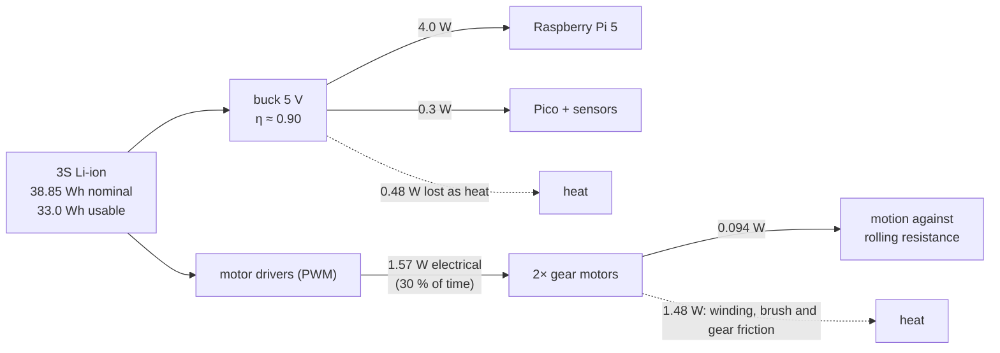

# FP.05 — Energy, power and efficiency — how long will the battery last?

<!-- glance:start -->
<!-- generated by tools/build.py from curriculum/syllabus.yaml — edit the syllabus, not this block -->

| | |
|---|---|
| **Track** | Optional foundation |
| **Difficulty** | Beginner |
| **Time** | 45 min |
| **Hardware** | none |
| **Software** | none |
| **Prerequisites** | [FP.04 Torque, gears and wheels — sizing motors](FP.04-torque-gears-wheels.md) |
| **Optional prerequisites** | [FE.01 Voltage, current, resistance and power](../electronics/FE.01-voltage-current-resistance-power.md) |
| **Skip if** | You estimate runtime from mechanical and electrical loads. |

<!-- glance:end -->

## What you will learn

- Tell energy from power and convert between joules, watt-hours and ampere-hours.
- Compute the mechanical power a moving robot needs and the electrical power its motors draw, and explain the gap between them.
- Follow efficiency losses through gearbox, motor and buck converter.
- Build a power budget with duty cycles and estimate battery runtime and driving range.
- Recognize which consumer dominates a small robot's energy use and act on it.

## Why it matters

"How long will it run?" is the first question anyone asks about a robot, and the usual answer is a guess. With a power budget you can answer it in five minutes and know which part to change.

For karmel the answer surprises most people. The motors are a small slice of the budget, because the Raspberry Pi runs whether the robot moves or not. The same numbers let you choose the battery in [01.07](../../01-first-robot/01.07-power-system.md) and write the power budget in [02.02](../../02-robot-electronics/02.02-power-budget.md). They set the low-battery behaviour in [01.14](../../01-first-robot/01.14-battery-monitoring.md). They also decide whether the stage-3 LiDAR and the stage-5 arm need a bigger pack ([20.02](../../20-final-robot/20.02-hardware-integration.md)).

<!-- prereqs:start -->
## Prerequisites

You need these first:

- [FP.04 Torque, gears and wheels — sizing motors](FP.04-torque-gears-wheels.md)

### Optional prerequisite links

New to any of these? Take the foundation lesson first; skip it if you already know it.

- [FE.01 Voltage, current, resistance and power](../electronics/FE.01-voltage-current-resistance-power.md)

Check your readiness: `python course.py why FP.05`
<!-- prereqs:end -->

## Concept

**Energy** is the capacity to do work: lift something, speed something up, heat something. It is a quantity, like the balance in a bank account, and it is measured in joules (J). **Power** is the *rate* at which energy flows, like spending per hour, measured in watts (W = J/s). A battery is the account, and each component spends at its own rate.

- Energy (J) = power (W) × time (s).
- A **watt-hour** (Wh) is 1 W for 1 hour, which is 3600 J. Batteries are rated in ampere-hours (Ah). Multiply by voltage to get energy: a 3S pack of Samsung 35E cells stores 11.1 V × 3.5 Ah = **38.85 Wh**.

Mechanically, power is force × speed or torque × angular speed: $P = Fv = \tau\omega$. Pushing karmel along a flat floor at 0.3 m/s against 0.31 N of rolling resistance takes only **0.094 W**, about as much as a small LED. Climbing costs more: lifting 1.6 kg by 1 m stores 15.7 J, but that is only 0.0044 Wh. Accelerating to 0.5 m/s stores 0.2 J of kinetic energy. The physics of moving a small robot is cheap.

Getting that mechanical power costs far more electrically. Every conversion loses energy as heat, measured by **efficiency**, $\eta = P_{out}/P_{in}$. Gearboxes lose some. Small brushed motors lose a lot, especially at light load, where just spinning the gears and brushes costs a steady "idle" current. Buck converters feeding 5 V to the Pi lose about 10%. Then there are the loads that do no mechanical work at all: the computer, sensors, radios. On a small indoor robot those usually dominate.

A **power budget** is a table: every consumer, its power, the fraction of time it is on, and the efficiency of whatever feeds it. Sum it up and divide usable battery energy by average power to get the runtime. Engineers who have built capacity plans will recognize the method: identify every consumer, estimate its load profile, add headroom.

> [!TIP]
> **Ask your teacher:** "Why is a small DC motor so inefficient at light load, and where exactly does the energy go?"

## Technical explanation

### Level 1 — Units and conversions

| Quantity | Unit | Relation | Karmel example |
|---|---|---|---|
| Energy | J, Wh | 1 Wh = 3600 J | 38.85 Wh = 139,860 J |
| Charge | Ah, mAh | 1 Ah = 3600 C | 3.5 Ah = 3500 mAh |
| Battery energy | Wh | $E = V_{nom} \times Q$ | 11.1 V × 3.5 Ah = 38.85 Wh |
| Electrical power | W | $P = VI$ | Pi 5 drawing 5 W from 5 V = 1.0 A |
| Mechanical power | W | $P = Fv = \tau\omega$ | 1.68 N × 0.3 m/s = 0.50 W up a 5° ramp |
| Efficiency | – | $\eta = P_{out}/P_{in}$ | buck converter ≈ 0.90 |

**Converting through a regulator.** A load of 5 W on the 5 V rail, fed by a 90%-efficient buck converter from 11.1 V, draws $5/0.9 = 5.56$ W from the battery, which is $5.56/11.1 = 0.50$ A. Current *drops* when the voltage steps down. Power is what flows through the converter, minus its losses ([FE.15](../electronics/FE.15-voltage-regulators.md)).

**Usable energy.** You never get the full rated energy. The pack must stop at the 9.9 V cutoff in `karmel.yaml`. Voltage sags under load, so the cutoff arrives early. Cells lose capacity with age and in the cold. A planning factor of **0.85** is reasonable for a healthy pack: $38.85 \times 0.85 = 33.0$ Wh usable. [FE.13](../electronics/FE.13-batteries.md) covers the chemistry.

### Level 2 — From the floor to the battery

The chain for karmel cruising at 0.3 m/s on a flat floor:

1. **Mechanical power at the floor:** $F v = 0.314 \times 0.3 = 0.094$ W.
2. **Per-wheel operating point:** torque $0.157 \times 0.045 = 0.0071$ N·m at $\omega = 6.67$ rad/s (FP.04).
3. **Motor model.** Treat the gear motor as a resistor, plus a back-EMF voltage proportional to speed, plus a friction current. Using the datasheet's 12 V numbers (205 rpm, 8.3 kg·cm and 4 A at stall):
   - Winding resistance $R = V/I_s = 12/4 = 3.0\ \Omega$.
   - Back-EMF constant $k_e = V/\omega_0 = 12/21.47 = 0.559$ V per rad/s.
   - No-load current $I_0$ is **not on the datasheet**. We assume 0.15 A; measure yours in E4.
   - Torque constant above no-load $k_t = \tau_s/(I_s - I_0) = 0.814/3.85 = 0.211$ N·m/A.

$$I = I_0 + \frac{\tau}{k_t}, \qquad V_m = I R + k_e \omega, \qquad P_{elec} = V_m I$$

*Example:* $I = 0.15 + 0.0071/0.211 = 0.183$ A, $V_m = 0.183 \times 3.0 + 0.559 \times 6.67 = 4.28$ V, so $P_{elec} = 0.785$ W per motor and **1.57 W for both**. The efficiency is $0.094/1.57 = 6\%$.

The gap is almost all the $I_0$ term: gearbox and brush friction that costs current whether or not the wheels push anything. Up a 5° ramp the useful load is larger, so efficiency rises to 16% (3.10 W electrical for 0.50 W mechanical). Small gear motors are most efficient at moderate load and worst when idling along.

With PWM, the driver delivers the motor voltage $V_m$ by switching the battery on and off. The battery current is roughly $P_{elec}/V_{batt}$ (ideal driver), here $1.57/11.1 = 0.14$ A for both motors.

### Level 3 — The power budget and runtime

$$P_{avg} = \sum_i \frac{P_i \cdot f_i}{\eta_i}, \qquad t_{run} = \frac{E_{usable}}{P_{avg}}$$

Here $f_i$ is the fraction of time consumer $i$ is on, and $\eta_i$ is the efficiency of whatever supplies it.

**Stage 1 karmel** (Pi 5 plus Pico, driving 30% of the time at 0.3 m/s):

| Consumer | Power | Time fraction | Supply η | From battery |
|---|---|---|---|---|
| Raspberry Pi 5, light work | ≈ 4.0 W (assumed) | 1.0 | 0.90 | 4.44 W |
| Pico + ToF + INA219 + ultrasonic | ≈ 0.3 W (assumed) | 1.0 | 0.90 | 0.33 W |
| Drive motors at 0.3 m/s | 1.57 W | 0.30 | 1.0 | 0.47 W |
| **Total** | | | | **5.25 W** |

**Runtime: 33.0 Wh / 5.25 W = 6.3 h.** The Pi is **85%** of the budget and the motors 9%. The Pi figures are planning values: a Raspberry Pi 5 is commonly measured at around 3 W idle and 6–8 W under sustained load. Measure your own with the INA219 ([02.02](../../02-robot-electronics/02.02-power-budget.md)).

**Stage 3 karmel** adds a 2D LiDAR (about 0.9 W; the researched LD-series unit is rated at 5 V / 180 mA), a USB camera (assumed 1 W), and a busier Pi running SLAM and Nav2 (an extra 2 W). The average rises to 9.58 W and the runtime drops to **3.4 h**. The motors are now 5% of the budget.

**Stall is the worst case.** Both motors stalled at 11.1 V draw about 7.4 A, which is 82 W, nearly 10× the stage-3 average. That is not a runtime problem but a peak-current problem: it sizes the fuse, the wiring and the cells' discharge rating, and it causes brownouts ([01.07](../../01-first-robot/01.07-power-system.md), [02.02](../../02-robot-electronics/02.02-power-budget.md)).

### Level 3b — Energy per metre: faster can be cheaper

When the fixed loads dominate, the energy to cover a distance *drops* as speed rises, because the Pi runs for less time per metre:

$$e = \frac{P_{drive}(v) + P_{fixed}}{v}\quad[\text{J/m}]$$

For stage 1 driving continuously ($P_{fixed} = 4.78$ W):

| Speed | Drive power | Energy per metre | Range on 33 Wh |
|---|---|---|---|
| 0.1 m/s | 0.66 W | 54.4 J/m | 2.2 km |
| 0.3 m/s | 1.57 W | 21.2 J/m | 5.6 km |
| 0.5 m/s | 2.48 W | 14.5 J/m | 8.2 km |

This is the same logic as a cloud job that holds a large always-on instance: finishing sooner saves more than a leaner per-request cost.

### Level 4 — Holding power: work without motion

Mechanical work needs motion ($P = Fv$). Holding a position does *no* mechanical work, yet it costs electrical power. A servo holding the arm out against gravity draws current continuously, and all of it becomes heat. A stage-5 SO-101 arm with six STS3215 bus servos holding a pose can easily draw several watts. The exact figure depends on the pose and the load and is not published, so measure it. Two consequences:

- **Budget the arm with a time fraction for "holding", not just "moving".**
- **Disable torque on idle joints when safe** ([14.03](../../14-robotic-arm/14.03-controlling-servos.md)). This is the robot equivalent of scaling to zero.

## Diagram

Where karmel's battery energy goes (stage 1, 0.3 m/s):



The power chain for one wheel with its numbers:

```text
 battery ──► driver ──► motor ──► gearbox ──► wheel ──► floor
 11.1 V      PWM        4.28 V     (inside     0.0071 N·m   0.157 N
             ≈0.07 A    0.183 A    the model)  6.67 rad/s   0.3 m/s
             0.785 W    0.785 W ─── losses 0.738 W ───►     0.047 W
```

## Code

Save as `fp05_runtime.py` and run `python fp05_runtime.py`. It builds the motor's electrical model from the datasheet, computes drive power for three situations, and runs the stage-1 and stage-3 power budgets. It also prints the stall power and the energy per metre at five speeds.

```python
"""FP.05 — electrical power of karmel's drive and a battery runtime estimate.

Run: python fp05_runtime.py   (needs matplotlib)
"""
from __future__ import annotations

import math
from dataclasses import dataclass, field

import matplotlib

matplotlib.use("Agg")
import matplotlib.pyplot as plt

G = 9.81


@dataclass(frozen=True)
class DcGearMotor:
    """Yahboom 520 1:56 as a resistor + back-EMF + friction, referred to the OUTPUT shaft (12 V datasheet)."""
    rated_v: float = 12.0
    no_load_rad_s: float = 205 * 2 * math.pi / 60
    stall_nm: float = 8.3 * 0.0980665
    stall_a: float = 4.0
    no_load_a: float = 0.15        # NOT on the datasheet: assumed, measure yours (02.02)

    @property
    def resistance(self) -> float:          # winding resistance [ohm]
        return self.rated_v / self.stall_a

    @property
    def k_e(self) -> float:                 # back-EMF constant at the output [V per rad/s]
        return self.rated_v / self.no_load_rad_s

    @property
    def k_t(self) -> float:                 # torque per amp above no-load current [N*m/A]
        return self.stall_nm / (self.stall_a - self.no_load_a)

    def electrical(self, torque_nm: float, speed_rad_s: float) -> tuple[float, float, float]:
        """Return (motor current A, motor voltage V, electrical power W) for one operating point."""
        i = self.no_load_a + torque_nm / self.k_t
        v = i * self.resistance + self.k_e * speed_rad_s
        return i, v, i * v


@dataclass(frozen=True)
class Load:
    name: str
    watts: float
    fraction_of_time: float = 1.0
    via_buck: bool = True           # 5 V / 3.3 V loads go through a buck converter


@dataclass
class Robot:
    mass_kg: float = 1.6
    wheel_radius_m: float = 0.045
    c_rr: float = 0.02
    battery_v: float = 11.1
    battery_ah: float = 3.5
    usable_fraction: float = 0.85   # stop at the 9.9 V cutoff, some capacity lost to sag and ageing
    buck_efficiency: float = 0.90
    motor: DcGearMotor = field(default_factory=DcGearMotor)

    def drive_power(self, speed: float, slope_deg: float = 0.0) -> tuple[float, float]:
        """Electrical and mechanical power [W] for both motors at constant speed."""
        th = math.radians(slope_deg)
        force = self.mass_kg * G * (math.sin(th) + self.c_rr * math.cos(th))
        torque_per_wheel = force / 2 * self.wheel_radius_m
        w = speed / self.wheel_radius_m
        _, _, p_elec = self.motor.electrical(torque_per_wheel, w)
        return 2 * p_elec, force * speed

    def average_power(self, loads: list[Load]) -> dict[str, float]:
        return {ld.name: ld.watts * ld.fraction_of_time / (self.buck_efficiency if ld.via_buck else 1.0)
                for ld in loads}

    def runtime_h(self, loads: list[Load]) -> float:
        energy_wh = self.battery_v * self.battery_ah * self.usable_fraction
        return energy_wh / sum(self.average_power(loads).values())


def main() -> None:
    k = Robot()
    m = k.motor
    print(f"motor model: R = {m.resistance:.2f} ohm, k_e = {m.k_e:.4f} V/(rad/s), k_t = {m.k_t:.4f} N*m/A")
    for label, v, slope in (("0.3 m/s flat", 0.3, 0.0), ("0.5 m/s flat", 0.5, 0.0), ("0.3 m/s up 5 deg", 0.3, 5.0)):
        p_e, p_m = k.drive_power(v, slope)
        print(f"  {label:18s} electrical {p_e:5.2f} W, mechanical {p_m:5.3f} W, efficiency {p_m / p_e * 100:4.1f} %")

    energy_wh = k.battery_v * k.battery_ah
    print(f"battery: {energy_wh:.2f} Wh nominal, {energy_wh * k.usable_fraction:.2f} Wh usable")
    print(f"climbing 1 m of height: {k.mass_kg * G * 1.0:.1f} J = {k.mass_kg * G / 3600:.4f} Wh; "
          f"kinetic energy at 0.5 m/s: {0.5 * k.mass_kg * 0.5**2:.2f} J")

    drive_03, _ = k.drive_power(0.3)
    stage1 = [Load("Raspberry Pi 5", 4.0), Load("Pico + sensors", 0.3),
              Load("drive motors", drive_03, 0.30, via_buck=False)]
    stage3 = stage1[:1] + [Load("Raspberry Pi 5 extra (SLAM/Nav2)", 2.0), Load("Pico + sensors", 0.3),
                           Load("2D LiDAR", 0.9), Load("USB camera", 1.0),
                           Load("drive motors", drive_03, 0.30, via_buck=False)]
    for name, loads in (("stage 1 (drive around, 30 % moving)", stage1),
                        ("stage 3 (LiDAR + camera + Nav2)", stage3)):
        avg = k.average_power(loads)
        total = sum(avg.values())
        print(f"\n{name}: average {total:.2f} W from the battery -> runtime {k.runtime_h(loads):.2f} h")
        for n, p in avg.items():
            print(f"  {n:34s} {p:5.2f} W  ({p / total * 100:4.1f} %)")

    stall_a = 2 * m.stall_a * k.battery_v / m.rated_v
    print(f"\nboth motors stalled at {k.battery_v} V: {stall_a:.1f} A, {stall_a * k.battery_v:.0f} W")

    speeds = [0.1, 0.2, 0.3, 0.4, 0.5]
    electronics_w = (4.0 + 0.3) / k.buck_efficiency
    j_per_m = [(k.drive_power(v)[0] + electronics_w) / v for v in speeds]
    for v, e in zip(speeds, j_per_m):
        print(f"energy per metre at {v:.1f} m/s: {e:5.1f} J/m -> range on usable battery "
              f"{energy_wh * k.usable_fraction * 3600 / e / 1000:5.2f} km")

    avg = k.average_power(stage3)
    fig, ax = plt.subplots(1, 2, figsize=(10, 4))
    ax[0].barh(list(avg.keys()), list(avg.values()))
    ax[0].set_xlabel("average power from battery [W]")
    ax[0].set_title("stage 3 power budget")
    ax[1].plot(speeds, j_per_m, "o-")
    ax[1].set_xlabel("driving speed [m/s]")
    ax[1].set_ylabel("energy per metre [J/m]")
    ax[1].set_title("stage 1, driving continuously")
    ax[1].grid(True)
    fig.tight_layout()
    fig.savefig("fp05_power.png", dpi=120)
    print("saved fp05_power.png")


if __name__ == "__main__":
    main()
```

Output:

```text
motor model: R = 3.00 ohm, k_e = 0.5590 V/(rad/s), k_t = 0.2114 N*m/A
  0.3 m/s flat       electrical  1.57 W, mechanical 0.094 W, efficiency  6.0 %
  0.5 m/s flat       electrical  2.48 W, mechanical 0.157 W, efficiency  6.3 %
  0.3 m/s up 5 deg   electrical  3.10 W, mechanical 0.504 W, efficiency 16.3 %
battery: 38.85 Wh nominal, 33.02 Wh usable
climbing 1 m of height: 15.7 J = 0.0044 Wh; kinetic energy at 0.5 m/s: 0.20 J

stage 1 (drive around, 30 % moving): average 5.25 W from the battery -> runtime 6.29 h
  Raspberry Pi 5                      4.44 W  (84.7 %)
  Pico + sensors                      0.33 W  ( 6.4 %)
  drive motors                        0.47 W  ( 9.0 %)

stage 3 (LiDAR + camera + Nav2): average 9.58 W from the battery -> runtime 3.45 h
  Raspberry Pi 5                      4.44 W  (46.4 %)
  Raspberry Pi 5 extra (SLAM/Nav2)    2.22 W  (23.2 %)
  Pico + sensors                      0.33 W  ( 3.5 %)
  2D LiDAR                            1.00 W  (10.4 %)
  USB camera                          1.11 W  (11.6 %)
  drive motors                        0.47 W  ( 4.9 %)

both motors stalled at 11.1 V: 7.4 A, 82 W
energy per metre at 0.1 m/s:  54.4 J/m -> range on usable battery  2.19 km
energy per metre at 0.2 m/s:  29.5 J/m -> range on usable battery  4.04 km
energy per metre at 0.3 m/s:  21.2 J/m -> range on usable battery  5.62 km
energy per metre at 0.4 m/s:  17.0 J/m -> range on usable battery  6.99 km
energy per metre at 0.5 m/s:  14.5 J/m -> range on usable battery  8.19 km
saved fp05_power.png
```

**The plot `fp05_power.png`** has two panels.

- **Left:** horizontal bars for the stage-3 average power. "Raspberry Pi 5" is by far the longest, at 4.44 W. The SLAM/Nav2 extra follows at 2.22 W, the camera and LiDAR at about 1 W each, the drive motors at 0.47 W, and Pico plus sensors at 0.33 W.
- **Right:** energy per metre against speed. It falls steeply from 54 J/m at 0.1 m/s to 14.5 J/m at 0.5 m/s, a curve shaped like 1/v.

## Exercise

### Exercise FP.05-E1 — Battery arithmetic `[numerical]`

Hardware: none.

1. How many watt-hours and joules does karmel's 3S 3.5 Ah pack store at 11.1 V nominal?
2. With a usable fraction of 0.85, how long does it power a constant 12 W load?
3. A Raspberry Pi 5 draws 5 W on the 5 V rail through a 90%-efficient buck converter. How much current does that take from the 11.1 V battery?
4. How many joules does it take to drive karmel up a 0.8 m-high flight of ramps, ignoring losses? How many Wh is that?

### Exercise FP.05-E2 — Add the arm to the budget `[coding]`

Hardware: none. Extend the stage-3 budget with the SO-101 arm, powered directly from the battery (12 V servo version, no buck). **Assume** six servos drawing 0.1 A each while holding a light pose at 11.1 V, and that the arm holds a pose 60% of the time. The real figure varies with pose; measure it at stage 5. Compute the new average power and runtime. Then compute the runtime of stage 3 without the arm on a 3S2P pack (7.0 Ah).

### Exercise FP.05-E3 — Predict: drive faster, run longer? `[predict]`

Hardware: none. Karmel (stage 1) drives *continuously* for a whole battery. Before computing, predict:

1. Does driving at 0.5 m/s instead of 0.3 m/s shorten the **runtime in hours** a lot, a little, or not at all?
2. Does it increase or decrease the **total distance** covered?

Then compute both with `Robot.drive_power` and a fixed electronics load of 4.78 W from the battery.

### Exercise FP.05-E4 — Measure your real budget `[hardware]`

Hardware: `robot-base` with the INA219 on the battery line ([02.02](../../02-robot-electronics/02.02-power-budget.md)). No-hardware alternative: use the lesson's assumed values and the ranges in the expected result.

> [!CAUTION]
> **Safety:** Measure with the wheels in the air first, then on the floor in a cleared area with a hand on the power switch. Never bypass the fuse to insert a meter, and never leave the Li-ion pack charging unattended.

1. Log battery voltage and current at 10 Hz for 60 s with the Pi idle and the motors off.
2. Log again with both wheels in the air at duty 0.35. This gives the no-load current $I_0$ at roughly 0.3 m/s wheel speed.
3. Log again driving on the floor at 0.3 m/s.
4. Replace the assumed values in the script with your measurements and recompute the runtimes.

## Expected result

**FP.05-E1:**
1. 38.85 Wh = 139,860 J.
2. $38.85 \times 0.85/12 = 2.75$ h.
3. $5/0.9 = 5.56$ W, and $5.56/11.1 = 0.50$ A.
4. $1.6 \times 9.81 \times 0.8 = 12.6$ J = 0.0035 Wh. That is negligible next to the electronics.

**FP.05-E2:**
- **With the arm:** it adds $6 \times 0.1 \times 11.1 \times 0.6 = 4.0$ W. The average rises to **13.6 W** and the runtime falls to **2.43 h** (from 3.45 h).
- **3S2P without the arm:** **6.89 h**, doubling capacity doubles runtime.

**FP.05-E3:**
1. **A little:** 5.20 h at 0.3 m/s against 4.55 h at 0.5 m/s (−13%). Average power only rises from 6.35 W to 7.26 W, because the fixed loads dominate.
2. **Distance increases:** about 5.6 km against 8.2 km (+46%). Faster driving is more energy-efficient per metre on this robot.

**FP.05-E4:**
- **Idle:** typically 0.3–0.5 A at 11–12 V (3.5–5.5 W).
- **Wheels in the air:** each motor adds roughly 0.05–0.10 A of battery current. Back-calculate $I_0$ from motor current = battery current × $V_{batt}/V_m$. Expect 0.1–0.3 A per motor at the motor.
- **Driving on the floor:** only slightly more than wheels in the air.

If your idle current is much higher, look for the Pi running a desktop, a fan at full speed, or a USB device drawing power.

## Troubleshooting

### Symptom: the robot dies much earlier than the estimate
1. Log voltage and current during a full run. If the voltage hits the 9.9 V cutoff during current peaks while the resting voltage is still higher, it is sag: internal resistance plus wiring. Use thicker wires, fewer connectors, or cells with a higher current rating.
2. Compare measured average power with the budget. The usual surprises are a Pi busier than assumed (a stuck process, a browser left open), an uncontrolled loop holding motors at high duty, or a servo arm holding a pose.
3. Check the pack capacity. An old or abused pack may have only 60–70% of its rating left. Measure it with a capacity-testing charger.

### Symptom: the Pi reboots when the motors start, though the average power is fine
1. It is a peak problem, not an energy problem. Stall and inrush currents (7+ A) pull the voltage down.
2. See [02.02](../../02-robot-electronics/02.02-power-budget.md): separate rails, a buck converter with enough headroom, bulk capacitance, and soft-starting the motors with an acceleration limit.

### Symptom: the measured motor efficiency is far below the model
1. At very light load, efficiency is dominated by $I_0$. A few mA of difference changes the percentage a lot, so compare currents, not efficiencies.
2. Check for mechanical drag: misaligned brackets, a rubbing tyre, a tight caster.
3. Check the driver. Some drivers waste significant power in their switching transistors (for example the old L298N, which the course avoids).

## Common mistakes

- **Confusing Ah and Wh.** 3.5 Ah at 11.1 V is not the same energy as 3.5 Ah at 5 V. Compare batteries in Wh.
- **Budgeting motors at stall or rated power.** Real driving uses a few percent of stall. Size the fuse for the peak, but the battery for the average.
- **Forgetting the regulator's loss.** 5 W at 5 V is 5.6 W from the battery.
- **Assuming 100% of rated capacity is usable.** Plan with about 85%, less for old packs.
- **Ignoring always-on loads.** On a small robot the computer, not the motors, sets runtime. Optimizing motor efficiency first is premature optimization.
- **Thinking holding still costs nothing.** Servos holding a pose convert power straight into heat.

## Knowledge check

1. What is the difference between energy and power? Give karmel's battery as an example of one and the Pi as an example of the other.
   <details><summary>Answer</summary>

   Energy is an amount (J or Wh). The battery stores about 38.85 Wh. Power is a rate (W = J/s). The Pi draws about 4–5 W, so the battery's energy is used up at that rate.
   </details>

2. How much mechanical power does karmel need to climb a 5° ramp at a constant 0.3 m/s, and roughly how much electrical power do the motors draw for it?
   <details><summary>Answer</summary>

   F = W sin 5° + c_rr W cos 5° = 1.368 + 0.313 = 1.68 N, so P = Fv = **0.50 W** mechanical. The motor model gives about **3.1 W** electrical, around 16% efficiency.
   </details>

3. A 20 W load runs for 90 minutes. How much energy is that in Wh and J?
   <details><summary>Answer</summary>

   20 W × 1.5 h = **30 Wh** = 30 × 3600 = **108,000 J**.
   </details>

4. Predict: you replace the Pi 5 with a Pico-only design, saving 4 W. Roughly how does stage-1 runtime change?
   <details><summary>Answer</summary>

   Average power falls from 5.25 W to about 0.8 W (0.33 + 0.47), so the runtime rises from about 6.3 h to about 41 h. The computer was the dominant load.
   </details>

5. Why does energy per metre *decrease* as karmel drives faster, within its speed range?
   <details><summary>Answer</summary>

   The fixed electronics power (about 4.8 W) is spread over more metres when the robot moves faster. Drive power grows only modestly with speed, so the fixed term per metre, $P_{fixed}/v$, shrinks faster than drive power grows.
   </details>

6. Debugging: runtime is 2 h instead of the budgeted 6 h, and the logs show 15 W average with the robot mostly parked. Name two likely causes and how to check them.
   <details><summary>Answer</summary>

   (a) The Pi is busy or has extra loads: check `top` for a runaway process, and USB devices or a fan at full speed. (b) Motors or servos are powered while parked: an integrator winding up and holding duty against the deadband, or the arm holding a pose. Check the logged duty commands and per-rail currents.
   </details>

7. Why does a stalled drive matter more for the fuse and wiring than for runtime?
   <details><summary>Answer</summary>

   A stall draws a huge peak (about 7.4 A, 82 W for both motors at 11.1 V) for a short time. Energy is power × time, so a brief stall barely dents the battery. But the peak current sets fuse rating, wire gauge, cell discharge limits and voltage sag.
   </details>

## Practical challenge

Write `power_budget.py`, a reusable budget tool. It reads `labs/config/karmel.yaml` for battery parameters plus a `budget.yaml` you write. The budget lists consumers with power, time fraction, supply rail (battery or 5 V buck), and optional "mission phases" (idle, patrol, arm task) with their durations. It outputs average power, runtime, energy per phase, and the top three consumers.

**Acceptance criteria:**
- The lesson's stage-1 inputs reproduce **5.25 W and 6.3 h** (± 1%).
- A mission of 10 min patrol (stage 3, driving 100% of the time) plus 5 min arm task (arm holding 100%, robot parked) plus 15 min idle, repeated until empty, yields a runtime in hours and a number of mission cycles. Print both.
- A unit test verifies Wh/J conversion and the buck-efficiency adjustment.
- Calibrate at least two entries with measurements from E4, and state which assumption changed the result most.

## You can skip this if…

You get knowledge-check questions 2, 4 and 6 right without looking, and you can build a power budget for a robot and estimate its runtime and range, including regulator losses and a usable-capacity factor.

`python course.py skip FP.05 --reason "can estimate runtime from mechanical and electrical loads"`

## Go deeper

- [Battery University](https://batteryuniversity.com/): practical articles on Li-ion capacity, discharge curves, internal resistance and ageing, useful for the usable-fraction and sag questions.
- [Texas Instruments, Brushed DC Motor Fundamentals (SLVA505)](https://www.ti.com/lit/an/slva505/slva505.pdf): the resistor-plus-back-EMF model used here, and where motor losses come from.
- [OpenStax University Physics Volume 1](https://openstax.org/details/books/university-physics-volume-1): chapters 7–8 cover work, kinetic energy, potential energy and power.
- [Samsung SDI](https://www.samsungsdi.com/): the manufacturer of the 35E cells. Get the INR18650-35E datasheet from your seller or Samsung SDI and use its continuous discharge rating and cutoff voltage, not a shop page's claims.

## Progress checkpoint

- [ ] I convert between J, Wh and Ah and compute battery energy.
- [ ] I can compute mechanical power and the electrical power a gear motor draws for it.
- [ ] I account for regulator and motor losses.
- [ ] I can build a power budget with time fractions and estimate runtime and range.
- [ ] I know which consumer dominates karmel's energy use.

`python course.py complete FP.05` (exercises done) · `python course.py master FP.05` (challenge done) · `python course.py struggle FP.05 "what was hard"`

Next: [FP.06 — Rotational motion and moment of inertia](FP.06-rotational-motion-inertia.md).
