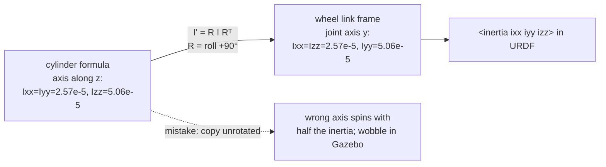

# FP.06 — Rotational motion and moment of inertia

<!-- glance:start -->
<!-- generated by tools/build.py from curriculum/syllabus.yaml — edit the syllabus, not this block -->

| | |
|---|---|
| **Track** | Optional foundation |
| **Difficulty** | Intermediate |
| **Time** | 50 min |
| **Hardware** | none |
| **Software** | python |
| **Prerequisites** | [FP.04 Torque, gears and wheels — sizing motors](FP.04-torque-gears-wheels.md) |
| **Skip if** | You can compute the inertia of simple shapes for a URDF. |

<!-- glance:end -->

## What you will learn

- Use angular position, velocity and acceleration, and convert between rotation and rim motion.
- Explain moment of inertia as "mass, weighted by distance squared", and use $\tau = I\alpha$.
- Compute the inertia of boxes, cylinders and rods, and move it to another axis with the parallel-axis theorem.
- Write a correct `<inertial>` block for a URDF link, including the wheel's rotated axis, and sanity-check it.
- Estimate the gearbox's reflected rotor inertia from a motor time constant, and explain why it dominates karmel's turning.

## Why it matters

Every link in a URDF has an `<inertial>` block: mass, centre of mass, and six inertia numbers ([05.08](../../05-frames-and-transforms/05.08-urdf-and-xacro.md)). RViz ignores them, so wrong values look fine. Gazebo uses them for everything ([06.05](../../06-simulation/06.05-robot-in-gazebo.md)). A copied `izz="1.0"` makes the simulated karmel turn about 60 times more sluggishly than the real one. Tiny or inconsistent values make it jitter or explode. Controllers tuned in that simulation then fail on the real robot.

Rotation also matters beyond simulation. Turning in place, profiled 90° turns ([08.11](../../08-control/08.11-rotate-exactly-90.md)), how fast an arm joint can swing ([14.03](../../14-robotic-arm/14.03-controlling-servos.md)), and the motor time constant you measure in [08.02](../../08-control/08.02-motor-step-response.md) are all rotational dynamics.

<!-- prereqs:start -->
## Prerequisites

You need these first:

- [FP.04 Torque, gears and wheels — sizing motors](FP.04-torque-gears-wheels.md)

### Optional prerequisite links

None.

Check your readiness: `python course.py why FP.06`
<!-- prereqs:end -->

## Concept

Everything from [FP.01](FP.01-kinematics-units.md) and [FP.02](FP.02-forces-newton.md) has a rotational twin:

| Straight line | Rotation |
|---|---|
| position $x$ [m] | angle $\theta$ [rad] |
| velocity $v$ [m/s] | angular velocity $\omega$ [rad/s] |
| acceleration $a$ [m/s²] | angular acceleration $\alpha$ [rad/s²] |
| force $F$ [N] | torque $\tau$ [N·m] ([FP.04](FP.04-torque-gears-wheels.md)) |
| mass $m$ [kg] | **moment of inertia** $I$ [kg·m²] |
| $F = ma$ | $\tau = I\alpha$ |

Mass says how hard something is to *push* faster. Moment of inertia says how hard it is to *spin* faster, and it depends on **where the mass is**, not just how much there is. Mass far from the axis counts much more than mass near it, because it has to move faster for the same rotation. That is why a figure skater spins faster when she pulls her arms in, and why a robot with its battery at the far end is sluggish to turn.

The rule is precise: every bit of mass counts in proportion to the **square** of its distance from the axis. Move a 300 g battery 8 cm further from karmel's turning axis and it adds $0.3 \times 0.08^2 = 0.0019$ kg·m². That is 12% of the whole chassis's yaw inertia.

A 3D body can spin around any axis, so it has *several* moments of inertia. They are packed into a 3×3 symmetric matrix, the **inertia tensor**. If the link frame is aligned with the body's symmetry axes, the matrix is diagonal, and you only need $I_{xx}$, $I_{yy}$ and $I_{zz}$: the resistance to rolling, pitching and yawing. A URDF writes exactly those six numbers (three diagonal, three off-diagonal).

One surprise waits in karmel's drivetrain. The motor's rotor is light, but it spins 56 times faster than the wheel. Seen from the wheel, its inertia is multiplied by $56^2 = 3136$. That hidden inertia dominates how quickly karmel can start turning.

> [!TIP]
> **Ask your teacher:** "Why does inertia go with distance squared and not just distance? Derive it from kinetic energy with one point mass on a string."

## Technical explanation

### Level 1 — Rotational kinematics on karmel

- **Rim relations.** For a wheel of radius $r$: $v = \omega r$ and $a_t = \alpha r$. At karmel's 0.5 m/s limit the wheels turn at $0.5/0.045 = 11.1$ rad/s.
- **Turning in place.** The wheels sit $d = 0.100$ m from the robot's centre, half the 0.200 m track. At the software limit of 2.5 rad/s of yaw, each rim moves at $2.5 \times 0.100 = 0.25$ m/s, so each wheel turns at $0.25/0.045 = 5.56$ rad/s, in opposite directions.
- **Circular motion.** Anything moving along a circle of radius $R$ at speed $v$ accelerates towards the centre with $a_c = v^2/R = \omega^2 R$. *Example:* karmel driving 0.5 m/s around a 0.5 m radius curve feels $0.25/0.5 = 0.5$ m/s² sideways. That acceleration can slide the robot outward or tip a tall arm ([FP.07](FP.07-center-of-mass-stability.md)).

### Level 2 — Moment of inertia of simple shapes

For point masses, $I = \sum_k m_k r_k^2$, where $r_k$ is the distance from the axis. For solid shapes that sum becomes an integral, and the standard results are:

| Shape (mass $m$, about its centre) | $I_{xx}$ | $I_{yy}$ | $I_{zz}$ |
|---|---|---|---|
| Box, sides $x, y, z$ | $\frac{m}{12}(y^2+z^2)$ | $\frac{m}{12}(x^2+z^2)$ | $\frac{m}{12}(x^2+y^2)$ |
| Solid cylinder, radius $r$, length $h$, axis along $z$ | $\frac{m}{12}(3r^2+h^2)$ | $\frac{m}{12}(3r^2+h^2)$ | $\frac{m}{2}r^2$ |
| Solid sphere, radius $r$ | $\frac{2}{5}mr^2$ | same | same |
| Thin rod, length $L$, about its centre (perpendicular) | $\frac{1}{12}mL^2$ | | |

*Example, karmel's chassis* as a uniform 1.5 kg box, 0.25 × 0.20 × 0.07 m:

$$I_{xx} = \tfrac{1.5}{12}(0.20^2 + 0.07^2) = 0.00561,\quad I_{yy} = \tfrac{1.5}{12}(0.25^2+0.07^2) = 0.00843,\quad I_{zz} = \tfrac{1.5}{12}(0.25^2+0.20^2) = 0.01281\ \text{kg·m}^2$$

$I_{zz}$ (yaw) is the largest, because yaw spins the long and wide dimensions.

*Example, one wheel* as a 50 g solid cylinder, $r = 0.045$ m, $h = 0.010$ m. About its spin axis: $\tfrac{0.05}{2}\times0.045^2 = 5.06\times10^{-5}$ kg·m². About a diameter: $\tfrac{0.05}{12}(3\times0.045^2 + 0.01^2) = 2.57\times10^{-5}$ kg·m².

### Level 3 — The parallel-axis theorem and $\tau = I\alpha$

The formulas above are about the centre of mass. About a parallel axis a distance $d$ away:

$$I = I_{cm} + m d^2$$

*Example, karmel's yaw inertia about the turning centre (base_link):*
- Chassis: CoM 0.04 m behind the axle, so $0.01281 + 1.5 \times 0.04^2 = 0.01521$.
- Wheels, each 0.100 m to the side, spinning about a diameter: $2\times(2.57\times10^{-5} + 0.05\times0.100^2) = 0.00105$.
- **Body total: 0.0163 kg·m².**

To reach the 2.5 rad/s turning limit in 0.5 s you need $\alpha = 5$ rad/s², so the body alone needs $\tau = I\alpha = 0.0163 \times 5 = 0.081$ N·m of yaw torque. The wheels produce it as a force couple: each rim pushes ±F at $d = 0.1$ m, so $\tau = 2Fd$ and $F = 0.41$ N per wheel.

### Level 3b — The inertia tensor and URDF

In general,

$$\mathbf{I} = \begin{bmatrix} I_{xx} & I_{xy} & I_{xz}\\ I_{xy} & I_{yy} & I_{yz}\\ I_{xz} & I_{yz} & I_{zz}\end{bmatrix},\qquad \boldsymbol{\tau} = \mathbf{I}\boldsymbol{\alpha}\ \ (\text{when not already spinning})$$

With the link frame aligned to a symmetric body, the off-diagonal terms are zero. Rotating the frame by a rotation matrix $R$ ([FM.10](../mathematics/FM.10-rotation-matrices.md)) transforms the tensor as

$$\mathbf{I}' = R\,\mathbf{I}\,R^\top$$

**The wheel trap.** URDF cylinders have their axis along $z$. A wheel spins about the robot's $y$ axis, so karmel's URDF rotates the wheel visual and collision with `rpy="1.5708 0 0"`. The *inertia* must describe the same wheel in the **link frame**, whose $y$ axis is the joint axis. Rotating the tensor by +90° about $x$ swaps $I_{yy}$ and $I_{zz}$: $I_{xx} = I_{zz} = 2.57\times10^{-5}$ and $I_{yy} = 5.06\times10^{-5}$. Get that wrong and the simulated wheel spins up with the wrong inertia and wobbles.

**Sanity checks every inertia must pass:**
1. Mass is positive, and the tensor is positive definite (all eigenvalues > 0).
2. **Triangle inequality:** the sum of any two principal moments is at least the third. $I_{xx} = I_{yy} = 1.0$ with $I_{zz} = 3.0$ is not a real body, and Gazebo can misbehave with it.
3. **Order of magnitude:** $I \approx m \times (\text{size}/3)^2$ is a quick estimate. For the chassis, $1.5 \times (0.25/3)^2 = 0.010$ against 0.0128 computed. A value of 1.0 is off by 80×.
4. **The origin is the CoM**, expressed in the link frame. The `<inertial><origin>` is *not* automatically the visual's origin.

In URDF:

```xml
<inertial>
  <origin xyz="-0.04 0 0.005" rpy="0 0 0"/>   <!-- centre of mass, in base_link -->
  <mass value="1.5"/>
  <inertia ixx="5.6125e-03" ixy="0" ixz="0" iyy="8.4250e-03" iyz="0" izz="1.2813e-02"/>
</inertial>
```

A uniform box puts its CoM at the box centre, but karmel's real CoM (measured in [FP.02](FP.02-forces-newton.md) E4) sits further back because of the battery. Put the inertial origin where the CoM actually is. The box tensor about that point is a reasonable approximation.

### Level 4 — Reflected inertia: the hidden flywheel in the gearbox

A rotor with inertia $J_r$ behind a gearbox of ratio $N$ looks, from the output shaft, like

$$J_{reflected} = N^2 J_r$$

because it turns $N$ times faster (kinetic energy $\tfrac12 J_r (N\omega)^2$).

Rotor inertia is rarely on cheap datasheets, but you can **estimate it from a measured time constant**. With the wheel spinning freely in the air, the motor follows its speed-torque line: $\tau = \tau_s(d - \omega/\omega_0)$. That line acts like a damper with slope $b = \tau_s/\omega_0$. A rotating mass on a damper responds with time constant $\tau_m = J/b$ ([FCT.02](../control-theory/FCT.02-first-second-order-systems.md)), so

$$J = \tau_m\, b$$

*Example:* $b = 0.814/21.47 = 0.0379$ N·m·s/rad. With `motor_time_constant_s: 0.08` from `karmel.yaml`, $J = 0.08 \times 0.0379 = 3.03\times10^{-3}$ kg·m² at the wheel. That is **60 times the wheel's own $5.06\times10^{-5}$**. The rest, $2.98\times10^{-3}$, is the rotor seen through 56:1, so the rotor itself is about $9.5\times10^{-7}$ kg·m² (9.5 g·cm²), a plausible value for a motor this size. Treat 0.08 s as the course default until you measure your own in [08.02](../../08-control/08.02-motor-step-response.md); this method ignores friction and inductance.

**Consequence for turning.** When karmel yaws at $\omega_z$, each wheel turns at $\omega_z d/r$, so the rotors add $2 J (d/r)^2$ to the yaw inertia:

$$I_{yaw,eff} = 0.0163 + 2 \times 2.98\times10^{-3} \times (0.1/0.045)^2 = 0.0457\ \text{kg·m}^2$$

The motors' own rotors are nearly **twice** the robot's body in yaw. Reaching 2.5 rad/s in 0.5 s now needs 0.229 N·m, an equivalent ±1.14 N at each rim instead of ±0.41 N. Gazebo does not model the rotors unless you add them. That is one reason a simulated robot accelerates and turns more briskly than the real one, and why [06.05](../../06-simulation/06.05-robot-in-gazebo.md) and [06.06](../../06-simulation/06.06-ros2-control.md) discuss tuning the simulation towards reality.

## Diagram

Karmel from above, with the axes and distances used for yaw inertia:

```text
                  x (forward)
                  ▲
                  │
      ┌───────────┼───────────┐  ← chassis box 0.25 × 0.20 m, 1.5 kg
      │           │           │
 (O)══╪═══════════●═══════════╪══(O)   wheels at y = ±0.100 m (d), r = 0.045 m
 left │      base_link        │ right
      │           ◆ CoM       │   ◆ CoM 0.04 m behind the axle
      │           │           │
      │           ○ caster    │
      └───────────────────────┘
   y ◄────────────┘   z up (out of page), yaw = rotation about z through ●

 I_yaw = I_zz,box + m·0.04²  +  2·(I_wheel,diam + m_w·0.1²)  +  2·J_rotor,refl·(0.1/0.045)²
       = 0.0152             +  0.0011                         +  0.0294     = 0.0457 kg·m²
```

The wheel inertia in URDF: visual rotated, tensor expressed in the link frame:



## Code

Save as `fp06_inertia.py` and run `python fp06_inertia.py` (needs `numpy`). It computes the chassis inertia with the formula and checks it by Monte Carlo integration over 400,000 random points. It rotates the wheel tensor into the joint frame and computes karmel's yaw inertia. It also estimates reflected rotor inertia from the motor time constant, runs the sanity checks, and prints ready-to-paste URDF `<inertial>` blocks.

```python
"""FP.06 — moments of inertia for karmel's URDF, checked numerically.

Run: python fp06_inertia.py   (needs numpy)
"""
from __future__ import annotations

import math
from dataclasses import dataclass

import numpy as np


@dataclass(frozen=True)
class Inertia:
    """Inertia tensor about the body's centre of mass, in the link frame [kg*m^2]."""
    ixx: float
    iyy: float
    izz: float
    ixy: float = 0.0
    ixz: float = 0.0
    iyz: float = 0.0

    def matrix(self) -> np.ndarray:
        return np.array([[self.ixx, self.ixy, self.ixz],
                         [self.ixy, self.iyy, self.iyz],
                         [self.ixz, self.iyz, self.izz]])

    @staticmethod
    def from_matrix(m: np.ndarray) -> "Inertia":
        return Inertia(m[0, 0], m[1, 1], m[2, 2], m[0, 1], m[0, 2], m[1, 2])


def box(mass: float, x: float, y: float, z: float) -> Inertia:
    return Inertia(mass / 12 * (y**2 + z**2), mass / 12 * (x**2 + z**2), mass / 12 * (x**2 + y**2))


def cylinder_z(mass: float, radius: float, length: float) -> Inertia:
    """Solid cylinder with its axis along z (URDF <cylinder> convention)."""
    perp = mass / 12 * (3 * radius**2 + length**2)
    return Inertia(perp, perp, mass / 2 * radius**2)


def rotate(inertia: Inertia, rot: np.ndarray) -> Inertia:
    """Express the tensor in a rotated frame: I' = R I R^T."""
    return Inertia.from_matrix(rot @ inertia.matrix() @ rot.T)


def check(inertia: Inertia, mass: float, name: str) -> list[str]:
    """Physical sanity checks every URDF inertia should pass."""
    problems = []
    eig = np.linalg.eigvalsh(inertia.matrix())
    if mass <= 0:
        problems.append("mass must be positive")
    if np.any(eig <= 0):
        problems.append("tensor must be positive definite")
    a, b, c = sorted(eig)
    if a + b < c * (1 - 1e-9):
        problems.append("triangle inequality violated (no real body has these moments)")
    return [f"{name}: {p}" for p in problems]


def urdf_inertial(mass: float, xyz: tuple[float, float, float], i: Inertia) -> str:
    return (f'<inertial>\n  <origin xyz="{xyz[0]:g} {xyz[1]:g} {xyz[2]:g}" rpy="0 0 0"/>\n'
            f'  <mass value="{mass:g}"/>\n'
            f'  <inertia ixx="{i.ixx:.4e}" ixy="{i.ixy:.1g}" ixz="{i.ixz:.1g}" '
            f'iyy="{i.iyy:.4e}" iyz="{i.iyz:.1g}" izz="{i.izz:.4e}"/>\n</inertial>')


def monte_carlo_box(mass: float, x: float, y: float, z: float, n: int = 400_000) -> np.ndarray:
    """Numerically integrate I = sum m_k (r_k^2 E - r_k r_k^T) over random points in the box."""
    rng = np.random.default_rng(1)
    p = rng.uniform(-0.5, 0.5, size=(n, 3)) * np.array([x, y, z])
    mk = mass / n
    r2 = np.sum(p**2, axis=1)
    return mk * (np.eye(3) * r2.sum() - p.T @ p)


def main() -> None:
    chassis_mass, wheel_mass = 1.5, 0.05
    chassis = box(chassis_mass, 0.25, 0.20, 0.07)
    print("chassis box 0.25 x 0.20 x 0.07 m, 1.5 kg:")
    print(f"  formula     ixx={chassis.ixx:.5f} iyy={chassis.iyy:.5f} izz={chassis.izz:.5f}")
    mc = monte_carlo_box(chassis_mass, 0.25, 0.20, 0.07)
    print(f"  monte carlo ixx={mc[0, 0]:.5f} iyy={mc[1, 1]:.5f} izz={mc[2, 2]:.5f} (max off-diag {np.abs(mc - np.diag(np.diag(mc))).max():.1e})")

    wheel_z = cylinder_z(wheel_mass, 0.045, 0.010)
    rot_x = np.array([[1, 0, 0], [0, 0, -1], [0, 1, 0]], dtype=float)   # roll +90 deg: z axis -> y axis
    wheel_y = rotate(wheel_z, rot_x)
    print(f"wheel, axis along z: ixx=iyy={wheel_z.ixx:.4e} izz={wheel_z.izz:.4e}")
    print(f"wheel, axis along y: ixx={wheel_y.ixx:.4e} iyy={wheel_y.iyy:.4e} izz={wheel_y.izz:.4e}")

    # yaw inertia of the whole base about the vertical axis through base_link (midpoint of the wheels)
    com_x = -0.04
    body_yaw = chassis.izz + chassis_mass * com_x**2                      # parallel-axis theorem
    wheels_yaw = 2 * (wheel_y.izz + wheel_mass * 0.100**2)
    print(f"yaw inertia: chassis {body_yaw:.5f} + wheels {wheels_yaw:.5f} = {body_yaw + wheels_yaw:.5f} kg*m^2")

    # gearbox: reflected rotor inertia, estimated from the motor time constant (karmel.yaml)
    stall_nm, no_load = 8.3 * 0.0980665, 205 * 2 * math.pi / 60
    damping = stall_nm / no_load                                           # slope of the speed-torque line
    tau_m = 0.08
    j_total = tau_m * damping
    j_rotor_reflected = j_total - wheel_z.izz
    print(f"speed-torque slope b = {damping:.5f} N*m*s/rad -> J at wheel = tau*b = {j_total:.3e} kg*m^2")
    print(f"  wheel itself {wheel_z.izz:.2e}, rotor seen through 56:1 {j_rotor_reflected:.2e} "
          f"-> rotor alone {j_rotor_reflected / 56**2:.2e} kg*m^2 ({j_rotor_reflected / 56**2 * 1e7:.1f} g*cm^2)")

    # turning in place: wheels spin at d/r times the yaw rate, so their inertia counts (d/r)^2 times
    d, r = 0.100, 0.045
    yaw_eff = body_yaw + wheels_yaw + 2 * j_rotor_reflected * (d / r) ** 2
    alpha = 2.5 / 0.5
    print(f"effective yaw inertia incl. rotors: {yaw_eff:.4f} kg*m^2")
    tq_yaw = yaw_eff * alpha
    print(f"reach 2.5 rad/s in 0.5 s: alpha = {alpha:.1f} rad/s^2, yaw torque {tq_yaw:.4f} N*m, "
          f"= +/-{tq_yaw / (2 * d):.3f} N equivalent rim force per wheel "
          f"(body alone: +/-{(body_yaw + wheels_yaw) * alpha / (2 * d):.3f} N)")

    for problem in check(chassis, chassis_mass, "chassis") + check(wheel_y, wheel_mass, "wheel"):
        print("PROBLEM", problem)
    bad = Inertia(1.0, 1.0, 3.0)
    print("sanity check of a bad tensor:", check(bad, 1.0, "bad"))

    print("\nURDF, base_link (inertia placed at the measured CoM, FP.02):")
    print(urdf_inertial(chassis_mass, (-0.04, 0.0, 0.005), chassis))
    print("URDF, left wheel link (joint axis = y):")
    print(urdf_inertial(wheel_mass, (0.0, 0.0, 0.0), wheel_y))


if __name__ == "__main__":
    main()
```

Output:

```text
chassis box 0.25 x 0.20 x 0.07 m, 1.5 kg:
  formula     ixx=0.00561 iyy=0.00843 izz=0.01281
  monte carlo ixx=0.00561 iyy=0.00842 izz=0.01281 (max off-diag 5.0e-06)
wheel, axis along z: ixx=iyy=2.5729e-05 izz=5.0625e-05
wheel, axis along y: ixx=2.5729e-05 iyy=5.0625e-05 izz=2.5729e-05
yaw inertia: chassis 0.01521 + wheels 0.00105 = 0.01626 kg*m^2
speed-torque slope b = 0.03792 N*m*s/rad -> J at wheel = tau*b = 3.033e-03 kg*m^2
  wheel itself 5.06e-05, rotor seen through 56:1 2.98e-03 -> rotor alone 9.51e-07 kg*m^2 (9.5 g*cm^2)
effective yaw inertia incl. rotors: 0.0457 kg*m^2
reach 2.5 rad/s in 0.5 s: alpha = 5.0 rad/s^2, yaw torque 0.2286 N*m, = +/-1.143 N equivalent rim force per wheel (body alone: +/-0.407 N)
sanity check of a bad tensor: ['bad: triangle inequality violated (no real body has these moments)']

URDF, base_link (inertia placed at the measured CoM, FP.02):
<inertial>
  <origin xyz="-0.04 0 0.005" rpy="0 0 0"/>
  <mass value="1.5"/>
  <inertia ixx="5.6125e-03" ixy="0" ixz="0" iyy="8.4250e-03" iyz="0" izz="1.2813e-02"/>
</inertial>
URDF, left wheel link (joint axis = y):
<inertial>
  <origin xyz="0 0 0" rpy="0 0 0"/>
  <mass value="0.05"/>
  <inertia ixx="2.5729e-05" ixy="0" ixz="0" iyy="5.0625e-05" iyz="0" izz="2.5729e-05"/>
</inertial>
```

The Monte Carlo numbers agree with the formula to about 0.1%, and the off-diagonal terms come out near zero (about 5×10⁻⁶ of noise). That is the confirmation that the box formula and the "aligned frame means diagonal tensor" rule are right. No plot is needed here: the check is numeric.

## Exercise

### Exercise FP.06-E1 — An arm link `[numerical]`

Hardware: none. Model the SO-101 forearm as a thin rod: 0.10 kg, 0.12 m long, rotating about one end (the elbow). This is an illustrative model; weigh and measure your own arm at stage 5. Compute:

1. $I$ about its centre and about the elbow, using the parallel-axis theorem.
2. The torque needed to hold it horizontal against gravity, and the torque needed to accelerate it at 10 rad/s² in the absence of gravity.
3. Both again with a 100 g payload at the tip, treated as a point mass. Give the holding torque in kg·cm too.

### Exercise FP.06-E2 — URDF inertial generator `[coding]`

Hardware: none. Write `inertial_xml(shape, mass, dims, com_xyz, rpy)`. It computes the tensor for `box`, `cylinder` or `sphere`, rotates it by the given roll-pitch-yaw into the link frame ($R I R^\top$), runs the sanity checks, and returns the XML string. Test it on karmel's wheel with `rpy=(pi/2, 0, 0)` and on the chassis box.

### Exercise FP.06-E3 — Predict: copy-paste inertia `[predict]`

Hardware: none. Before computing, predict:

1. A URDF copied from a tutorial sets the base_link to `ixx="1.0" iyy="1.0" izz="1.0"`. By roughly what factor does the simulated yaw angular acceleration change for the same wheel forces (Gazebo does not model the rotors)? Does the tensor pass the triangle inequality?
2. You move the 0.3 kg battery from the CoM to 0.08 m further back. Does the yaw inertia change by more or less than 10%?

### Exercise FP.06-E4 — Measure the reflected inertia `[hardware]`

Hardware: `robot-base`. No-hardware alternative: use `motor_time_constant_s` from `karmel.yaml` as the "measurement".

> [!CAUTION]
> **Safety:** Wheels in the air on a stand, fingers and cables clear of the wheels, watchdog on, hand on the power switch.

Step one wheel from duty 0 to 0.6 and log its speed at 200 Hz, or at 50 Hz with care ([FCT.05](../control-theory/FCT.05-discrete-time-sampling.md)). Find the time to reach 63.2% of the final speed. Compute $J = \tau_m \times 0.0379$ and compare it with the wheel's own inertia.

## Expected result

**FP.06-E1:**
1. $I_{cm} = \tfrac{1}{12}(0.1)(0.12^2) = 1.20\times10^{-4}$. $I_{elbow} = 1.20\times10^{-4} + 0.1 \times 0.06^2 = 4.80\times10^{-4}$ kg·m², which equals $mL^2/3$.
2. Holding: $mgL/2 = 0.1 \times 9.81 \times 0.06 = 0.0589$ N·m. Accelerating: $4.8\times10^{-4}\times10 = 0.0048$ N·m. Gravity dominates by 12×.
3. With the payload: $I = 4.8\times10^{-4} + 0.1\times0.12^2 = 1.92\times10^{-3}$ kg·m², so accelerating takes 0.0192 N·m. Holding: $0.0589 + 0.1\times9.81\times0.12 = 0.1766$ N·m = **1.80 kg·cm**.

**FP.06-E2:** For the wheel: `ixx="2.5729e-05" iyy="5.0625e-05" izz="2.5729e-05"`, off-diagonals within 1e-12 of 0. For the chassis: `ixx="5.6125e-03" iyy="8.4250e-03" izz="1.2813e-02"`. The sanity checks return no problems. `Inertia(1, 1, 3)` is flagged as violating the triangle inequality.

**FP.06-E3:**
1. The yaw inertia becomes about 1.001 instead of 0.0163, so angular acceleration drops **about 62×**. The simulated robot barely turns and overshoots badly when a controller pushes harder. $(1, 1, 1)$ does pass the triangle inequality; it is wrong in magnitude, not impossible.
2. It adds $0.3\times0.08^2 = 0.0019$ kg·m², about **12%** of the chassis's 0.0152. That is more than 10%, from moving one component 8 cm.

**FP.06-E4:** Typical measured time constants for this class of gear motor lie between 0.05 and 0.12 s. That gives $J \approx 1.9$–$4.6\times10^{-3}$ kg·m², 40–90 times the wheel's own inertia. If you get less than $5\times10^{-4}$, check that you measured speed and not position, and that your velocity filter's lag ([08.03](../../08-control/08.03-wheel-speed-estimation.md)) is not included in the time constant.

## Troubleshooting

### Symptom: the robot in Gazebo jitters, slides by itself, or explodes on spawn
1. Run the sanity checks on every link: positive mass, positive-definite tensor, triangle inequality.
2. Look for tiny masses or inertias (below about 1e-6) on small links such as sensors. Physics engines struggle with huge mass ratios. Give small links realistic minimum values, or merge them into the parent with fixed joints.
3. Check the inertial origin. A CoM far outside the collision geometry makes contacts unstable.

### Symptom: the simulated robot turns far more sluggishly than the real one
1. Compare the URDF yaw inertia with a hand estimate ($m \times (\text{size}/3)^2$). A value near 1.0 is the copy-paste bug.
2. Check the units. Inertia in g·cm² or kg·cm² pasted as kg·m² is off by $10^{7}$ or $10^{4}$.

### Symptom: the simulated robot turns far more briskly than the real one
1. The real rotors' reflected inertia is missing from the simulation. Estimate it (Level 4) and either add it to the wheel links' $I_{yy}$ or cap angular acceleration in the controller to what the real robot achieves.
2. Also compare friction: real caster scrub and tyre deformation slow turning, too ([FP.03](FP.03-friction-traction.md)).

### Symptom: a simulated wheel wobbles or precesses as it spins
1. The wheel tensor was copied in the cylinder's own frame (axis along z) instead of the link frame (joint axis along y). Rotate it: $I' = RIR^\top$.

## Common mistakes

- **Treating inertia like mass.** Distance counts squared. A light part far out can outweigh a heavy part in the middle.
- **Forgetting the parallel-axis term** when a body does not rotate about its own CoM, as with the chassis about base_link or an arm link about its joint.
- **Using the cylinder formula without rotating it** for wheels whose joint axis is $y$.
- **Leaving the inertial origin at the link origin** instead of at the CoM.
- **Copying `1.0` inertias from tutorials.** Always compute them, even roughly.
- **Ignoring reflected rotor inertia** on high-ratio gearmotors. It can dominate the load the motor feels.

## Knowledge check

1. What are karmel's wheel angular speeds when it rotates in place at 1.0 rad/s?
   <details><summary>Answer</summary>

   The rim speed is ωd = 1.0 × 0.100 = 0.100 m/s, so the wheel speed is 0.100/0.045 = **±2.22 rad/s**, in opposite directions.
   </details>

2. Compute $I_{zz}$ of a 0.2 kg box, 0.10 × 0.06 × 0.03 m, about its centre.
   <details><summary>Answer</summary>

   (0.2/12) × (0.10² + 0.06²) = 0.016667 × 0.0136 = **2.27×10⁻⁴ kg·m²**.
   </details>

3. The same box sits with its centre 0.08 m from karmel's yaw axis. What does it add to karmel's yaw inertia?
   <details><summary>Answer</summary>

   2.27×10⁻⁴ + 0.2 × 0.08² = 2.27×10⁻⁴ + 1.28×10⁻³ = **1.51×10⁻³ kg·m²**. The parallel-axis term dominates.
   </details>

4. Why does a 1:56 gearbox make a light rotor matter so much at the wheel?
   <details><summary>Answer</summary>

   Reflected inertia scales with N². The rotor spins 56× faster, so its kinetic energy for a given wheel speed is 56² = 3136× larger than if it turned at wheel speed. For karmel that is about 3×10⁻³ kg·m², 60× the wheel's own inertia.
   </details>

5. Predict: a URDF lists a link with `ixx=0.001 iyy=0.001 izz=0.005`. Is this a physical body? What will Gazebo likely do?
   <details><summary>Answer</summary>

   No. 0.001 + 0.001 < 0.005 violates the triangle inequality, so no real mass distribution produces it. The physics engine may produce unstable or unphysical motion. Recompute from the geometry.
   </details>

6. Debugging: your simulated karmel reaches 2.5 rad/s of yaw almost instantly, but the real one takes about half a second, although you checked the chassis inertia. What is missing?
   <details><summary>Answer</summary>

   The reflected inertia of the motor rotors through the gearboxes, which is not in the URDF by default. It nearly triples karmel's effective yaw inertia (0.016 → 0.046 kg·m²). Add it to the wheel links, or limit simulated angular acceleration. Also check the motor model and friction.
   </details>

7. How do you estimate a gearmotor's reflected inertia without a datasheet value?
   <details><summary>Answer</summary>

   Measure the time constant τ of a free-spinning step response (wheels in the air), and the slope of the speed-torque line, b = τ_stall/ω_no-load. Then J ≈ τ·b.
   </details>

## Practical challenge

Write `karmel_inertials.py`. It reads `labs/config/karmel.yaml` plus a small `masses.yaml` you write with your measured masses (chassis, battery, Pi, each wheel) and each component's position. It outputs:

- the combined CoM,
- a base_link inertia tensor, combining component boxes with the parallel-axis theorem in 3D: $\mathbf{I} = \mathbf{I}_{cm} + m(\lVert\mathbf{d}\rVert^2 \mathbf{E} - \mathbf{d}\mathbf{d}^\top)$,
- wheel inertials in the joint frame,
- a xacro snippet with `<xacro:property>` values ready for [05.08](../../05-frames-and-transforms/05.08-urdf-and-xacro.md).

**Acceptance criteria:**
- With a single 1.5 kg box centred at (−0.04, 0, 0.005), it reproduces the lesson's numbers to 4 significant figures, including zero off-diagonal terms.
- Placing the battery off-centre in $y$ produces a non-zero $I_{xy}$ or $I_{yz}$ with the correct sign (check against the Monte Carlo method).
- All outputs pass the sanity checks, and a test verifies that a violating tensor is rejected.
- A short note compares your estimated effective yaw inertia (with reflected rotor inertia) with the URDF's, and states what you will do about the difference in simulation.

## You can skip this if…

You get knowledge-check questions 3, 5 and 6 right without looking, and you can write a correct wheel `<inertial>` block (rotated axis, CoM origin) and explain reflected inertia.

`python course.py skip FP.06 --reason "can compute URDF inertias and explain reflected inertia"`

## Go deeper

- [ROS 2 Jazzy tutorial: Adding physical and collision properties to a URDF](https://docs.ros.org/en/jazzy/Tutorials/Intermediate/URDF/Adding-Physical-and-Collision-Properties-to-a-URDF-Model.html): where `<inertial>` fits in a URDF, with the official example.
- [Wikipedia, List of moments of inertia](https://en.wikipedia.org/wiki/List_of_moments_of_inertia): the formula table, including full 3D tensors for cuboids and cylinders.
- [Wikipedia, Parallel axis theorem](https://en.wikipedia.org/wiki/Parallel_axis_theorem): the scalar and tensor versions used in the practical challenge.
- [OpenStax University Physics Volume 1](https://openstax.org/details/books/university-physics-volume-1): chapters 10–11 on rotation, moment of inertia and angular momentum, with worked problems.
- [Modern Robotics (Lynch & Park), book home](https://hades.mech.northwestern.edu/index.php/Modern_Robotics): chapter 8 covers rigid-body dynamics with inertia tensors and apparent (reflected) inertia of geared actuators.

## Progress checkpoint

- [ ] I use θ, ω, α and the rim relations without mixing them with linear quantities.
- [ ] I can compute inertia for boxes, cylinders and rods, and apply the parallel-axis theorem.
- [ ] I write URDF inertials with correct axes and CoM origins, and sanity-check them.
- [ ] I can estimate reflected rotor inertia from a time constant and explain its effect on turning.

`python course.py complete FP.06` (exercises done) · `python course.py master FP.06` (challenge done) · `python course.py struggle FP.06 "what was hard"`

Next: [FP.07 — Center of mass and tipping stability](FP.07-center-of-mass-stability.md).
