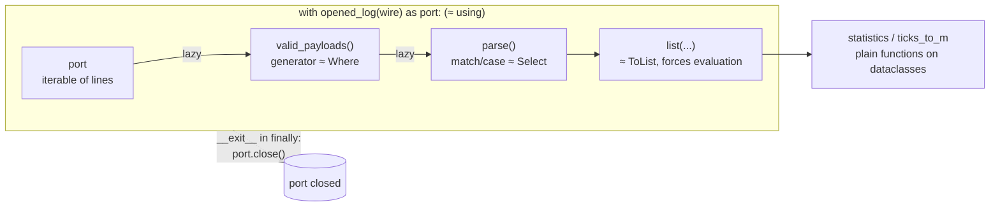

# FPY.01 — Python for C# developers — the fast tour

<!-- glance:start -->
<!-- generated by tools/build.py from curriculum/syllabus.yaml — edit the syllabus, not this block -->

| | |
|---|---|
| **Track** | Optional foundation |
| **Difficulty** | Beginner |
| **Time** | 1 h |
| **Hardware** | none |
| **Software** | python |
| **Prerequisites** | none |
| **Skip if** | You write idiomatic Python. |

<!-- glance:end -->

## What you will learn

- Translate C# habits (LINQ, `IEnumerable`, `using`, records, interfaces, `switch`) into idiomatic Python.
- Predict the eight Python behaviours that silently break robot code written by C# developers (floor division, truthiness, aliasing, mutable defaults, late binding, unbounded ints…).
- Write a lazy generator pipeline that parses and validates serial telemetry.
- Write a context manager that guarantees the motors stop, even when your code throws.
- Use duck typing on purpose: swap a real serial port for an in-memory fake without an interface.

## Why it matters

Almost everything above the microcontroller in this course is Python: the Pi ↔ Pico link in
[01.10](../../01-first-robot/01.10-pi-pico-protocol.md), the robot software stack in
[03.01](../../03-robot-software/03.01-python-robotics-ecosystem.md), ROS 2 nodes written with `rclpy`, OpenCV
pipelines, and every ML tool. Even the firmware is MicroPython ([FC.02](../cpp-and-embedded/FC.02-micropython-on-pico.md)).

You can already *read* Python. The danger for a strong C# engineer isn't syntax. It's code that
looks right and does something else: `-7 // 2` is `-4`, a range reading of `0.0` is "falsy", and
`[[0]*3]*3` gives you one row three times. On a robot these bugs don't throw. They make it turn the
wrong way. This lesson is the short list of things that matter, mapped to what you already know.

<!-- prereqs:start -->
## Prerequisites

None — you can start here.

### Optional prerequisite links

None.

Check your readiness: `python course.py why FPY.01`
<!-- prereqs:end -->

## Concept

Think of CPython as a **dynamically typed, reference-semantics runtime with a very small standard
vocabulary**:

- **Every value is a heap object and every variable is a reference.** It's like C# if *everything*
  were a `class`, including `int` and `float`. Immutable types (`int`, `float`, `str`, `tuple`,
  `frozenset`) make this invisible. Mutable ones (`list`, `dict`, `set`, your own classes) make it very visible.
- **Strongly typed, checked at runtime.** `"3" + 4` raises `TypeError`, but only when that line runs.
  Type hints exist ([FPY.04](FPY.04-typing-dataclasses-packaging.md)), but the interpreter ignores them. A separate tool
  (mypy, pyright) checks them, the way the TypeScript compiler checks types that are erased at runtime.
- **Duck typing instead of nominal interfaces.** If an object has a `readline()` method, it *is* a
  serial port as far as your parser is concerned. No `ISerialPort` is required. That makes fakes for
  tests trivial, and it moves mistakes from compile time to run time.
- **The interpreter is slow per operation and has a GIL.** A simple arithmetic loop in CPython is typically one to two
  orders of magnitude slower than the same loop in C# (measure it yourself in [FPY.06](FPY.06-python-performance.md)). Python wins by
  pushing loops into C libraries (numpy, OpenCV), so Python loops over pixels or LiDAR points are the wrong tool
  ([FPY.02](FPY.02-numpy-essentials.md)).
- **Modules are the unit of organisation.** A file is a module, a folder with modules is a package.
  Free functions at module level are normal. You don't need a `static class RobotMath`.

> [!TIP]
> **Ask your teacher:** "I'll paste a C# class from my codebase. Rewrite it as idiomatic Python and explain every change you made and why."

## Technical explanation

### Level 1 — The translation table

| C# | Python | Watch out |
|---|---|---|
| `var x = 3;` | `x = 3` | No declaration. A typo creates a new variable. |
| `List<double>`, `Dictionary<K,V>`, `HashSet<T>` | `list`, `dict`, `set` | `dict` preserves insertion order (guaranteed since 3.7). |
| `(double X, double Y)` value tuple | `(x, y)` tuple, unpacking `x, y = p` | Tuples are immutable, lists are not. |
| `record Pose(double X, double Y)` | `@dataclass(frozen=True)` | See [FPY.04](FPY.04-typing-dataclasses-packaging.md). |
| `interface IMotor` | `typing.Protocol` (structural) or `abc.ABC` (nominal) | Usually you need neither: duck typing. |
| LINQ `Where/Select` | comprehension `[f(x) for x in xs if p(x)]` | A list comprehension is **eager** (like `.ToList()`). |
| `IEnumerable<T>` + `yield return` | generator function with `yield`, or `(f(x) for x in xs)` | Lazy, single pass, like an enumerator you can't `Reset()`. |
| `First()`, `Any()`, `Zip()`, `Aggregate()` | `next(iter)`, `any()`, `zip()`, `functools.reduce()` | `itertools` has `pairwise`, `islice`, `groupby`, `chain`. |
| `using var port = …;` / `IDisposable` | `with open_port() as port:` / context manager | `__exit__` *sees* the exception and could swallow it. |
| `switch` expression with patterns | `match` / `case` (3.10+) | Structural: matches list shapes, class attributes, literals. |
| `string.Format`, `$"{x:F3}"` | f-string `f"{x:.3f}"` | `f"{x=}"` prints `x=0.123`, handy for debugging. |
| `null`, `T?` | `None`, `T \| None` | Test with `is None`, never with `==` or truthiness. |
| method overloads | default args, `*args`, `**kwargs`, keyword-only args | No overloading by type at runtime. |
| `namespace` / `using` | module / `import` | `from x import *` is the equivalent of a global `using static`, so avoid it. |
| NuGet, `.csproj` | pip/uv, `pyproject.toml` | [FPY.04](FPY.04-typing-dataclasses-packaging.md), [FL.10](../linux-and-tools/FL.10-python-environments-ubuntu.md). |
| `Task`, `async`/`await` | `asyncio` | Different model: one thread, one loop. See [FPY.05](FPY.05-asyncio-for-csharp-devs.md). |
| `int` (32-bit, overflows) | `int` (arbitrary precision) | No overflow, so you must emulate 16-bit counters yourself. |

### Level 2 — Practical: the eight traps, with robot consequences

**1. Floor division and modulo round toward −∞, not toward 0.**
In C#, `-7 / 2 == -3` and `-7 % 2 == -1`. In Python, `-7 // 2 == -4` and `-7 % 2 == 1`. Python's
`%` result takes the sign of the *divisor*. That's a gift for robotics: `angle % (2*math.pi)` is
always in `[0, 2π)`, and ring-buffer indices `(i - 1) % n` never go negative. It's also a trap when you port
C# code that "fixes" negative remainders by hand: the fix now double-corrects. If you want C#
semantics, use `math.fmod(-7, 2) == -1.0` and `int(-7 / 2) == -3`.

**2. `int` never overflows.** The Pico sends a 16-bit encoder count that wraps from 32767 to −32768.
In C# a `short` wraps for you. In Python `32767 + 1` is just `32768`. You need to wrap explicitly
(Exercise E2):

$$\Delta = \big((n - p + 2^{15}) \bmod 2^{16}\big) - 2^{15}$$

Example: previous count $p = 32760$, new count $n = -32766$ (the counter wrapped). Naively $n - p = -65526$,
which reads as a huge reverse jump. With the formula: $(-65526 + 32768) \bmod 65536 = 32778$, and $32778 - 32768 = 10$ ticks
forward. That's correct. Python's always-non-negative `%` is what makes this one-liner work.

**3. Truthiness.** `0`, `0.0`, `""`, `[]`, `{}` and `None` are all falsy. `if range_m:` treats a
legitimate 0.0 m reading (something touching the sensor) the same as "no reading". Always write
`if range_m is not None:`.

**4. Aliasing with `*`.** `grid = [[0] * 3] * 3` creates **one** row object referenced three times.
Setting `grid[0][1] = 9` changes all three rows. That's a classic occupancy-grid bug. Use
`[[0] * 3 for _ in range(3)]`, or better, `np.zeros((3, 3))`.

**5. Mutable default arguments are evaluated once**, at function definition. `def log(r, buf=[])`
shares one list across every call, like a hidden `static` field. Use `buf: list | None = None`.

**6. Closures bind late.** `[lambda: i for i in range(3)]` returns three functions that all return `2`.
C# fixed this for `foreach` in C# 5. Python never changed. It bites when you register callbacks in a
loop, for example one ROS subscription per wheel. Bind explicitly with `lambda i=i: i` or `functools.partial`.

**7. `is` is reference equality, `==` is value equality.** `is` is only correct for `None`,
`True`/`False` and sentinels. Small ints happen to be cached, so `x is 5` sometimes works in a test
and fails on the robot.

**8. Floats are IEEE-754 doubles, same as C#.** `0.1 + 0.2 == 0.3` is `False` in both languages. Use
`math.isclose` or a tolerance. There's no `decimal` default and no `float32` unless numpy gives you one.

### Level 2 — Generators are your LINQ

A generator function is a lazy `IEnumerable<T>`. The body runs only when someone iterates, and it
pauses at each `yield`. Chaining generators gives you a streaming pipeline with constant memory, which
is exactly what you want for a serial port that never ends:

```text
port lines ──▶ valid_payloads() ──▶ parse() ──▶ consumer (list, for-loop, statistics.fmean)
  (file/serial)   Where(checksum ok)    Select(→ Telemetry)
```

The C# query `samples.Where(s => s.RangeM != null).Select(s => s.RangeM.Value).Average()` becomes
`statistics.fmean(s.range_m for s in samples if s.range_m is not None)`. The part in parentheses is a
generator expression. It's lazy, so nothing is materialised.

The difference from LINQ that bites: **a generator can be consumed once.** Iterate it twice and the
second pass is silently empty. A C# `IEnumerable` from `Select` re-runs the query instead. If you need
two passes, call `list()` once.

### Level 2 — Context managers are `using` with superpowers

`with EXPR as x:` calls `EXPR.__enter__()` and binds the result to `x`. When the block exits (normally,
by `return`, or by exception), it calls `__exit__(exc_type, exc, tb)`. In C# terms it's
`IDisposable.Dispose()` that also receives the exception, and it can suppress the exception by returning `True`.
Writing one is easiest with `@contextlib.contextmanager`. Everything before `yield` is `__enter__`,
and the `finally` after it is `__exit__`.

Robot use: `pyserial`'s `serial.Serial` is a context manager (the port closes). So is a lock. So
should be *"motors enabled"*: whatever happens in the block, `stop()` runs (Exercise E5). That's the
software half of the watchdog idea from [01.10](../../01-first-robot/01.10-pi-pico-protocol.md). The firmware watchdog is the other half,
for when Python itself dies.

The trap: returning a lazy generator out of a `with` block. The port is closed by the time anyone
iterates. You get `ValueError: I/O operation on closed file.` (Exercise E3).

### Level 3 — What `for` really does (the iterator protocol)

`for x in obj:` calls `it = iter(obj)` (`obj.__iter__()`), then `next(it)` (`it.__next__()`) until
`StopIteration` is raised. That's `GetEnumerator()` / `MoveNext()` / `Current` folded into one call
that throws at the end. Files, `io.StringIO`, `serial.Serial`, dicts, numpy arrays and your
generators all implement it. That's why the parser below takes "anything iterable over lines". A
real port, a log file on disk and a test string are interchangeable with zero interfaces.

The "dunder" (double underscore) methods are Python's operator-overload and interface mechanism:
`__eq__` ≈ `Equals`, `__hash__` ≈ `GetHashCode`, `__repr__` ≈ debugger display, `__len__` ≈ `Count`,
`__getitem__` ≈ indexer, `__add__` ≈ `operator +`, `__call__` ≈ making an object a delegate.

## Diagram



## Code

Save as `fpy01_telemetry.py` anywhere and run `python fpy01_telemetry.py` (on Windows: `py fpy01_telemetry.py`).
No hardware, no dependencies. It parses frames in the course's Pi ↔ Pico protocol (see
[labs/README.md](../../labs/README.md)): `<payload>*<hh>`, where `hh` is the XOR of the payload bytes.

```python
"""fpy01_telemetry.py — idiomatic Python tour on the Pi <-> Pico telemetry protocol.

Run: python fpy01_telemetry.py   (Windows: py fpy01_telemetry.py)
"""
from __future__ import annotations

import io
import math
from collections.abc import Iterable, Iterator
from contextlib import contextmanager
from dataclasses import dataclass
from functools import reduce

TICKS_PER_REV = 2464          # 11 PPR x 56:1 gearbox x 4 (quadrature), labs/config/karmel.yaml
WHEEL_RADIUS_M = 0.045


def checksum(payload: str) -> str:
    """NMEA-style: XOR of all payload bytes, as two uppercase hex digits."""
    return f"{reduce(lambda acc, b: acc ^ b, payload.encode('ascii'), 0):02X}"


def frame(payload: str) -> str:
    return f"{payload}*{checksum(payload)}\n"


@dataclass(frozen=True, slots=True)          # ~ C# `readonly record struct`
class Telemetry:
    t_ms: int
    left_ticks: int
    right_ticks: int
    battery_v: float
    range_m: float | None                    # None = invalid reading (-1 on the wire)


def valid_payloads(lines: Iterable[str]) -> Iterator[str]:
    """Yield payloads whose checksum matches. Lazy, like a LINQ Where()."""
    for line in lines:
        payload, sep, received = line.strip().partition("*")
        if sep and checksum(payload) == received.upper():
            yield payload


def parse(payloads: Iterable[str]) -> Iterator[Telemetry]:
    for p in payloads:
        match p.split():
            case ["T", ms, lt, rt, _lv, _rv, batt_mv, range_mm, _flags]:
                rng = int(range_mm)
                yield Telemetry(int(ms), int(lt), int(rt), int(batt_mv) / 1000,
                                None if rng < 0 else rng / 1000)
            case ["A", seq, "OK"]:
                pass                          # acks are handled elsewhere
            case _:
                print(f"ignored: {p!r}")


def ticks_to_m(ticks: int) -> float:
    return ticks / TICKS_PER_REV * 2 * math.pi * WHEEL_RADIUS_M


@contextmanager
def opened_log(text: str) -> Iterator[io.StringIO]:
    """Stand-in for `with serial.Serial(...) as port:` — cleanup runs even on exceptions."""
    port = io.StringIO(text)
    print("port opened")
    try:
        yield port
    finally:
        port.close()
        print("port closed")


if __name__ == "__main__":
    wire = "".join([
        frame("T 1000 0 0 0 0 12040 850 0"),
        frame("T 1020 26 27 8100 8300 12035 848 0"),
        "T 1040 53 55 8200 8400 12030 845 0*00\n",      # corrupted: bad checksum
        frame("A 7 OK"),
        frame("T 1060 80 82 8250 8350 12030 -1 4"),     # range sensor error
        frame("T 1080 106 110 8250 8400 12025 840 0"),
    ])
    with opened_log(wire) as port:
        samples = list(parse(valid_payloads(port)))   # port is iterable line by line

    print(f"{len(samples)} valid telemetry samples")
    first, last = samples[0], samples[-1]
    left_m = ticks_to_m(last.left_ticks - first.left_ticks)
    right_m = ticks_to_m(last.right_ticks - first.right_ticks)
    dt_s = (last.t_ms - first.t_ms) / 1000
    print(f"left {left_m:.4f} m, right {right_m:.4f} m in {dt_s:.2f} s")
    ranges = [s.range_m for s in samples if s.range_m is not None]
    print(f"min range {min(ranges):.3f} m over {len(ranges)} valid readings")
    by_battery = {s.t_ms: s.battery_v for s in samples}          # dict comprehension
    print(by_battery)
```

Output:

```text
port opened
port closed
4 valid telemetry samples
left 0.0122 m, right 0.0126 m in 0.08 s
min range 0.840 m over 3 valid readings
{1000: 12.04, 1020: 12.035, 1060: 12.03, 1080: 12.025}
```

What to notice, in C# terms:

- `valid_payloads` and `parse` are `IEnumerable` iterators. Nothing runs until `list()` pulls.
- `str.partition("*")` returns a 3-tuple and never throws, unlike `Split('*')[1]`.
- `match p.split(): case ["T", ms, lt, ...]` destructures *and* checks the length in one line. A
  telemetry line with 8 fields instead of 9 falls through to `case _`.
- The corrupted line vanishes silently. In real code, count rejects (a rising reject rate means EMI or a loose
  cable, see [03.03](../../03-robot-software/03.03-robust-serial-communication.md)).
- To use real hardware, replace `opened_log(wire)` with `serial.Serial("/dev/ttyACM0", 115200, timeout=0.1)`.
  It's also a context manager and also iterable over lines. Nothing else changes. That's duck typing doing the job
  of an interface.

## Exercise

All exercises need no hardware. Put `fpy01_telemetry.py` next to your exercise files so you can import it.

### Exercise FPY.01-E1 — Predict the eight traps `[predict]`

Write down what each line prints **before** running it. Then run it.

```python
import math
print(-7 // 2, -7 % 2, int(-7 / 2))
print(math.fmod(-7, 2))
grid = [[0] * 3] * 3
grid[0][1] = 9
print(grid)
def log_reading(r, buf=[]):
    buf.append(r)
    return buf
log_reading(1.0)
print(log_reading(2.0))
callbacks = [lambda: i for i in range(3)]
print([f() for f in callbacks])
range_m = 0.0
print("obstacle!" if range_m else "no reading")
print(0.1 + 0.2 == 0.3, math.isclose(0.1 + 0.2, 0.3))
print(2**64 + 1)
```

### Exercise FPY.01-E2 — 16-bit encoder wraparound `[coding]`

Write `tick_delta(prev: int, now: int) -> int`. It returns the signed number of ticks between two readings of a
counter that wraps like a C# `short`, assuming the true motion between readings is less than 32768 ticks.
Print `tick_delta(32760, -32766)`, `tick_delta(-32766, 32760)` and `tick_delta(100, 90)`.

### Exercise FPY.01-E3 — The port that closed too early `[debugging]`

Run this with `fpy01_telemetry.py` in the same folder. Explain the error. Then fix it with a one-word change.

```python
from fpy01_telemetry import frame, opened_log, parse, valid_payloads

wire = frame("T 1000 0 0 0 0 12040 850 0") + frame("T 1020 26 27 8100 8300 12035 848 0")
try:
    with opened_log(wire) as port:
        stream = parse(valid_payloads(port))
    print(len(list(stream)))
except ValueError as e:
    print("ValueError:", e)
```

### Exercise FPY.01-E4 — LINQ to Python `[coding]`

Using the four `samples` from the Code section, translate these two C# queries without writing a `for` statement:

```csharp
var meanRange = samples.Where(s => s.RangeM != null).Select(s => s.RangeM.Value).Average();
var leftRadS = samples.Zip(samples.Skip(1), (a, b) =>
    (b.LeftTicks - a.LeftTicks) / 2464.0 * 2 * Math.PI / ((b.TMs - a.TMs) / 1000.0)).ToList();
```

Hint: `statistics.fmean`, `itertools.pairwise`. Print the mean rounded to 4 decimals and the speeds rounded to 3.

### Exercise FPY.01-E5 — A context manager that always stops the motors `[coding]`

Write `motors_stopped_on_exit(base)` with `@contextmanager`. Test it with this fake. No interface is needed, which is the point:

```python
class FakeBase:
    def set_wheel_duty(self, left: float, right: float) -> None:
        print(f"duty {left} {right}")
    def stop(self) -> None:
        print("stop")
```

Inside the `with` block, set duty `(0.3, 0.3)` and then `raise RuntimeError("planner crashed")`. Wrap the whole
`with` in `try/except RuntimeError as e: print("caught:", e)`.

## Expected result

**FPY.01-E1** prints exactly:

```text
-4 1 -3
-1.0
[[0, 9, 0], [0, 9, 0], [0, 9, 0]]
[1.0, 2.0]
[2, 2, 2]
no reading
False True
18446744073709551617
```

If you got more than two wrong, reread Level 2 before writing robot code.

**FPY.01-E2** prints `10 -10 -10`. A reference solution is `return (now - prev + 32768) % 65536 - 32768`.

**FPY.01-E3** prints `port opened`, `port closed`, then `ValueError: I/O operation on closed file.`
`parse(...)` only *builds* a generator. The first read happens inside `list(stream)`, after `__exit__` has
closed the port. Fix: `stream = list(parse(valid_payloads(port)))` inside the `with`, or move the consumer inside the block.
The output becomes `port opened`, `port closed`, `2`.

**FPY.01-E4**: `statistics.fmean(s.range_m for s in samples if s.range_m is not None)` gives `0.846`.
`[(b.left_ticks - a.left_ticks) / 2464 * 2 * math.pi / ((b.t_ms - a.t_ms) / 1000) for a, b in itertools.pairwise(samples)]`
gives `[3.315, 3.442, 3.315]` rad/s. (The middle interval is 40 ms because the corrupted sample was dropped. Divide by the
real `dt`, not by a nominal 20 ms.)

**FPY.01-E5** prints:

```text
duty 0.3 0.3
stop
caught: planner crashed
```

`stop` comes **before** `caught`: the `finally` in the context manager runs while the exception propagates.
If `stop` is missing, you put `base.stop()` after `yield` without `try/finally`.

## Troubleshooting

### Symptom: `IndentationError` or `TabError` in a file that looks fine
1. Your editor mixed tabs and spaces (common when pasting from a C# editor configured for tabs). In VS Code,
   run *Convert Indentation to Spaces*.
2. Check for a missing `:` at the end of the `if`/`for`/`def` line above. The error is reported on the
   next line.
3. A block with no body needs `pass` (or `...`).

### Symptom: `ModuleNotFoundError: No module named 'fpy01_telemetry'` (or your own package)
1. Print `import sys; print(sys.path[0])`. Python searches the **script's folder**, not your shell's current folder.
2. Is the file name a valid identifier? `fpy01-telemetry.py` can't be imported (hyphen).
3. Did you name your own file `serial.py`, `math.py` or `numpy.py`? It shadows the real module. Rename it
   and delete `__pycache__`.
4. Is the package installed in the interpreter you're running? `python -m pip show pyserial` with the
   *same* `python`. Venvs are covered in [FL.10](../linux-and-tools/FL.10-python-environments-ubuntu.md).

### Symptom: `AttributeError: 'X' object has no attribute 'readline'` when passing a fake
Duck typing moved the "does it implement the interface" check to run time. Compare the fake's methods
with what the consumer actually calls (`dir(obj)`). For bigger interfaces, declare a `Protocol` and let
a type checker catch it before run time ([FPY.04](FPY.04-typing-dataclasses-packaging.md)).

### Symptom: `UnboundLocalError: cannot access local variable 'count'`
You assign to a module-level name inside a function, so Python treats it as local for the *whole*
function. Pass state in and return it, or keep it in an object. Use `nonlocal` for closures. Avoid `global`,
because the course bans global state ([AUTHORING §10](../../AUTHORING.md)).

### Symptom: a loop over a generator does nothing the second time
Generators are single-use. Materialise once with `list()`, or recreate the generator.

## Common mistakes

- **`if reading:` instead of `if reading is not None:`.** A 0.0 m range, a 0 tick delta or an empty
  list is valid data. Truthiness conflates "zero" with "missing".
- **Porting C# `%`-fixups.** `((a % n) + n) % n` is harmless in Python. Hand-written `if (r < 0) r += n` after
  Python's `%` never triggers, and after `math.fmod` it's needed again. Pick one semantics per function.
- **Catching `Exception` around the control loop and continuing.** It's the equivalent of `catch {}` around
  a motor command. At minimum, stop the motors and log with the traceback (`logging.exception`).
- **Writing classes for everything.** A module with functions and a couple of dataclasses is idiomatic.
  `RobotHelperManager` classes with only static methods are a C# accent.
- **Loops over numbers.** Anything per-pixel or per-LiDAR-beam goes to numpy ([FPY.02](FPY.02-numpy-essentials.md)).
- **Using `pip install` into the system Python on Ubuntu 24.04.** It's blocked by PEP 668 for good reason. Use a venv or `uv`
  ([03.02](../../03-robot-software/03.02-environments-and-pinning.md)).

## Knowledge check

1. What do `-13 % 12` and `-13 // 12` evaluate to, and why is that useful for a 12-slot ring buffer?
   <details><summary>Answer</summary>

   `-13 % 12 == 11` and `-13 // 12 == -2`. Python's `%` takes the sign of the divisor, so `(i - k) % n`
   is always a valid index in `[0, n)` with no extra `if`. In C#, `-13 % 12 == -1`.
   </details>

2. A C# colleague writes `occupancy = [[0.0] * width] * height`. What goes wrong on the robot, and what's the fix?
   <details><summary>Answer</summary>

   All `height` rows are the same list object, so marking one cell marks the whole column in every row.
   The map fills with vertical stripes. Fix: `[[0.0] * width for _ in range(height)]`, or much better,
   `np.zeros((height, width))`.
   </details>

3. You register three wheel callbacks with `for w in ["left", "right", "caster"]: bus.on(w, lambda msg: handle(w, msg))`.
   Every callback reports `"caster"`. Why, and what are two fixes?
   <details><summary>Answer</summary>

   The closures capture the *variable* `w`, not its value, and read it when they run, after the loop ended.
   Fixes: `lambda msg, w=w: handle(w, msg)`, or `functools.partial(handle, w)`.
   </details>

4. What is the Python equivalent of `using (var port = new SerialPort(...)) { ... }`, and what can a Python
   context manager do that `Dispose()` cannot?
   <details><summary>Answer</summary>

   `with serial.Serial(...) as port: ...`. `__exit__` receives the exception type, value and traceback. It can
   react to the failure (for example, stop motors and log) and can even suppress the exception by returning `True`.
   </details>

5. `stats = (s.range_m for s in samples)`, then `print(max(stats)); print(min(stats))`. What happens?
   <details><summary>Answer</summary>

   `max` works. `min` raises `ValueError: min() arg is an empty sequence`, because the generator expression was
   exhausted by `max`. Use a list, or compute both in one pass.
   </details>

6. The Pico's 16-bit counter reads 32000, then −32000 one telemetry frame later. How many ticks did the wheel
   move, and in which direction? (2464 ticks per wheel revolution.)
   <details><summary>Answer</summary>

   $((-32000 - 32000 + 32768) \bmod 65536) - 32768 = (-31232 \bmod 65536) - 32768 = 34304 - 32768 = 1536$ ticks forward,
   about 0.62 wheel revolutions. At 50 Hz that's 1536/2464·2π/0.02 ≈ 196 rad/s, which is physically impossible for this
   robot (max ≈ 17 rad/s). So either frames were lost or the reading is corrupt. The wrap formula only works
   when you sample fast enough, and a sanity check against the maximum speed catches the rest.
   </details>

7. Why can the parser in the Code section consume a `serial.Serial`, a file and an `io.StringIO` without any interface?
   <details><summary>Answer</summary>

   All three implement the iterator protocol (`__iter__`/`__next__` yielding lines). `valid_payloads` only uses
   `for line in lines` and `str` methods. That's duck typing. The type hint `Iterable[str]` documents the requirement,
   and a type checker enforces it, but the runtime doesn't.
   </details>

## Practical challenge

Build `telemetry_stats.py`, a command-line tool for real robot logs.

1. `python telemetry_stats.py robot.log` reads a file of protocol lines (generate a 1,000,000-line test log
   with `frame()`, including ~1% corrupted lines and counters that wrap past ±32767).
2. It prints: total lines, valid telemetry frames, reject rate (%), distance per wheel in meters (with
   16-bit wrap handling), mean and minimum valid range, and the longest gap between consecutive `t_ms` values.
3. It's a pure generator pipeline. Peak memory stays flat no matter how long the log is.
   Verify with `tracemalloc`: less than 5 MB for the 1M-line file.
4. It has `pytest` tests that use `io.StringIO` fakes, with no files, and cover: bad checksum, wrap-around forward and
   backward, `range_mm = -1`, a truncated line, and an empty log.

Acceptance: tests pass. On your generated log, the distance matches the value you used to generate it within one tick.
The code contains no `global` statement and no `class` except dataclasses.

## You can skip this if…

You answer knowledge-check questions 2, 3, 5 and 6 correctly without running code, and you can write
Exercise E5 from memory in under three minutes. Then:
`python course.py skip FPY.01 --reason "idiomatic Python already"`

## Go deeper

- https://docs.python.org/3/tutorial/index.html — the official tutorial. Skim sections 4, 5 and 9 in an hour. It's the canonical reference for the idioms above.
- https://docs.python.org/3/reference/datamodel.html — the data model: every dunder method, the real "interface" spec of Python.
- https://docs.python.org/3/howto/functional.html — iterators, generators and itertools. The LINQ chapter you're looking for.
- https://docs.python.org/3/library/contextlib.html — `contextmanager`, `ExitStack` (a dynamic `using` for N resources) and `suppress`.
- https://www.oreilly.com/library/view/fluent-python-2nd/9781492056348/ — *Fluent Python*, 2nd ed. (Ramalho, paid). The best book for an experienced programmer who wants to think in Python.

## Progress checkpoint

- [ ] I can translate a LINQ query and a `using` block into idiomatic Python.
- [ ] I can predict floor division, truthiness, aliasing, mutable-default and late-binding behaviour without running code.
- [ ] I can write a lazy generator pipeline over a serial stream and know when it gets consumed.
- [ ] I can write a context manager that guarantees cleanup on exceptions.
- [ ] I can replace a hardware object with a duck-typed fake in a test.

`python course.py complete FPY.01` (exercises done) · `python course.py master FPY.01` (challenge done) ·
`python course.py struggle FPY.01 "what was hard"`

Next: [FPY.02 — numpy essentials for robotics](FPY.02-numpy-essentials.md).
