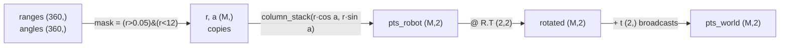

# FPY.02 — numpy essentials for robotics

<!-- glance:start -->
<!-- generated by tools/build.py from curriculum/syllabus.yaml — edit the syllabus, not this block -->

| | |
|---|---|
| **Track** | Optional foundation |
| **Difficulty** | Beginner |
| **Time** | 1 h |
| **Hardware** | none |
| **Software** | python, numpy |
| **Prerequisites** | [FPY.01 Python for C# developers — the fast tour](FPY.01-python-for-csharp-devs.md) |
| **Skip if** | You vectorize with broadcasting and never loop over pixels. |

<!-- glance:end -->

## What you will learn

- Read and predict array **shapes** and **dtypes**, the two facts that explain most numpy bugs.
- Apply **vectorization** and the broadcasting rules to transform hundreds of LiDAR points with one expression and no loop.
- Use boolean masks to drop invalid sensor readings without `if` statements.
- Tell a **view** from a **copy**, and avoid the silent integer-overflow and duplicate-index traps.
- Convert a 360-beam LiDAR scan from polar robot-frame ranges to world-frame points, about 20× faster than a loop.

## Why it matters

A LiDAR scan is a `(360,)` array of ranges. A camera frame is a `(480, 640, 3)` array of `uint8`. An
occupancy grid is a `(H, W)` array of log-odds. A batch of robot poses is `(N, 3)`. Everything in
[07 Sensors](../../07-sensors/07.08-rgb-cameras.md), [13 Computer vision](../../13-computer-vision/13.01-images-as-data.md), mapping, filtering and ML is an
operation on such arrays. OpenCV images are numpy arrays. ROS 2's `sensor_msgs/LaserScan` becomes one
with a single `np.asarray(msg.ranges)`.

The robot runs on a Raspberry Pi 5. A Python `for` loop over 640×480 = 307,200 pixels takes a large
fraction of a second per frame. The same operation in numpy takes about a millisecond. The difference between
"the robot sees at 30 Hz" and "the robot sees at 2 Hz" is whether you think in arrays.

<!-- prereqs:start -->
## Prerequisites

You need these first:

- [FPY.01 Python for C# developers — the fast tour](FPY.01-python-for-csharp-devs.md)

### Optional prerequisite links

None.

Check your readiness: `python course.py why FPY.02`
<!-- prereqs:end -->

## Concept

An `ndarray` is **one contiguous typed buffer plus metadata**: `dtype` (what each element is), `shape`
(how to interpret the buffer as dimensions) and `strides` (how many bytes to jump per dimension). In C#
terms, it's a `double[]` wrapped in a `Span<double>` with a shape attached. Slicing creates a new
span over the same memory. Arithmetic runs a compiled C loop over the buffer.

So there are two worlds:

- **Python world**: each number is a boxed heap object, and every `+` goes through the interpreter.
- **numpy world**: a million doubles sit in 8 MB of contiguous memory, and one `+` is one C loop, often SIMD.

Your job is to cross the boundary **once per operation, not once per element**. That discipline has a
name: **vectorization** — describing *what* to compute for the whole array (like a SQL `UPDATE ... WHERE`
instead of a cursor) and letting numpy run the loop. Every technique in this lesson is vectorization
under a different name: broadcasting, masks, `@`, `np.add.at`. If a `for` loop over elements survives in
your numpy code, that is the thing to look at first.

**Broadcasting** is the rule that makes small arrays stretch to match big ones without copying.
`points (360, 2) + offset (2,)` adds the offset to every row. It's the reason a pose transform of
every LiDAR point is a one-liner.

> [!TIP]
> **Ask your teacher:** "Give me five numpy expressions with different shapes and make me predict the result shape or the broadcasting error before you show the answer."

## Technical explanation

### Level 1 — Shapes, dtypes and axes

```text
ranges          shape (360,)         one value per beam
points          shape (360, 2)       row i = (x_i, y_i)         axis 0 = which point, axis 1 = x/y
image           shape (480, 640, 3)  row, column, channel       axis 0 = y (down), axis 1 = x (right)
poses           shape (N, 3)         (x, y, yaw) per timestep
```

- `axis=0` runs **down** the first dimension. `points.mean(axis=0)` is the centroid `(2,)`, and
  `points.mean(axis=1)` is a meaningless `(360,)`. The axis you name is the one that **disappears**.
- Default float dtype is `float64`. Images are `uint8` (0–255). Encoder counts from a binary log may be
  `int16`. **Integer dtypes wrap silently**: `np.array([250], dtype=np.uint8) + 10` is `[4]`, with no exception.
- `reshape(-1, 2)` means "you work out the first dimension". `x[:, None]` (or `np.newaxis`) inserts an
  axis of length 1, which is the tool for setting up broadcasting.

### Level 2 — Practical: the operations you'll use daily

| Task | numpy | C# mental model |
|---|---|---|
| Elementwise math | `r * np.cos(a)` | `Zip(...).Select(...)`, but in C |
| Filter | `ranges[(ranges > 0.05) & (ranges < 12.0)]` | `Where`. Note `&` not `and`, and the parentheses are required |
| Conditional replace | `np.where(ranges == 0, np.inf, ranges)` | `Select(x => x == 0 ? inf : x)` |
| Reduce | `np.min(d, axis=1)`, `np.argmin(d, axis=1)` | `Min()` per row, `IndexOf(Min())` |
| Stack columns | `np.column_stack((x, y))` → `(N, 2)` | `Zip` into tuples |
| Matrix product | `A @ B` | `*` on a math library matrix. `*` in numpy is **elementwise** |
| Differences | `np.diff(ticks)` → `(N-1,)` | `Zip(Skip(1))` |
| Random numbers | `rng = np.random.default_rng(7)`; `rng.normal(0, 0.01, n)` | `new Random(7)`, and pass `rng` explicitly (no global state) |
| Count into bins | `np.add.at(grid, (iy, ix), 1)` | a loop with `++`. See the duplicate-index trap below |

**Views vs copies.** A *basic slice* (`ranges[10:20]`, `img[:, :, 0]`) is a **view**: writing into it
writes into the original, exactly like a `Span<T>`. *Fancy indexing* (a boolean mask or an integer array,
`ranges[ranges > 5]`) returns a **copy**. When in doubt, `np.shares_memory(a, b)`.

**The duplicate-index trap.** `grid[idx] += 1` with `idx = [1, 1, 1, 3]` increments cell 1 **once**, not
three times. It's evaluated as `grid[idx] = grid[idx] + 1`, and the last write wins. When several LiDAR hits
fall in the same occupancy cell, which is the normal case, use `np.add.at(grid, idx, 1)` or `np.bincount`.

### Level 3 — Mathematics: broadcasting and the scan transform

**Broadcasting rule.** Align the shapes from the **right**. Two dimensions are compatible if they're equal
or one of them is 1. Missing dimensions on the left count as 1. The result takes the larger size in each
dimension. Otherwise you get `ValueError: operands could not be broadcast together`.

```text
(360, 2)  -  (2,)        ->  (360, 2) - (1, 2)       -> (360, 2)     offset every point
(360,)    *  (3, 1)      ->  (1, 360) * (3, 1)       -> (3, 360)     3 scans x 360 beams
(360,1,2) -  (1,4,2)                                 -> (360, 4, 2)  every point minus every landmark
(5, 2)    -  (3, 2)                                  -> error: 5 vs 3
```

**Polar to Cartesian (robot frame).** Beam $i$ has angle $\theta_i$ and range $r_i$:

$$p_i^{robot} = \begin{bmatrix} r_i\cos\theta_i \\ r_i\sin\theta_i \end{bmatrix}$$

**Robot frame to world frame.** For a robot at pose $(x, y, \psi)$ (yaw $\psi$), rotate and then translate:

$$p_i^{world} = R(\psi)\,p_i^{robot} + \begin{bmatrix}x\\y\end{bmatrix},\qquad R(\psi) = \begin{bmatrix}\cos\psi & -\sin\psi\\ \sin\psi & \cos\psi\end{bmatrix}$$

With points stored as **rows** of an $(M, 2)$ matrix $P$, all $M$ transforms at once are
$P_{world} = P\,R^{\mathsf T} + t$. The transpose appears because each row is $p^{\mathsf T}$, and
$(Rp)^{\mathsf T} = p^{\mathsf T}R^{\mathsf T}$. The $+t$ with $t$ of shape `(2,)` broadcasts over the rows.

Numerical example: the robot is at $(1, 2)$ facing $\psi = 90°$, and a beam at $\theta = 0$ (straight ahead) returns
$r = 1$ m. Robot frame: $(1, 0)$. $R(90°) = \begin{bmatrix}0&-1\\1&0\end{bmatrix}$, so the rotated point is $(0, 1)$,
and in the world it's $(0+1,\ 1+2) = (1, 3)$. The robot faces +y, so "1 m ahead" is 1 m further along y. ✔

(New to rotation matrices? [FM.07](../mathematics/FM.07-matrices.md) and [FM.09](../mathematics/FM.09-homogeneous-coordinates.md).)

### Level 4 — Implementation details that matter on a Pi

- **Preallocate.** `np.append` in a loop copies the whole array each time, so it's O(n²). Build a Python list and convert
  once, or allocate `np.empty(n)` and fill it.
- **`float32` halves memory and often doubles throughput** for images and point clouds. Accuracy is ~7 digits,
  which is plenty for meters at millimeter resolution up to kilometers. Mixed `float32 + float64` silently upcasts to float64.
- **Memory layout.** `a.T` is a view with swapped strides, so it isn't C-contiguous. Passing it to OpenCV or a
  C extension may force a copy or raise. Use `np.ascontiguousarray` when a library complains.
- **In-place ops** `np.multiply(a, 2, out=a)` or `a *= 2` avoid allocating in a 30 Hz loop.

## Diagram



```text
Broadcasting (360,1,2) - (1,4,2):            robot frame (REP-103)
                                                  y (left)
 points  ┌─┐        landmarks ┌─┬─┬─┬─┐           ▲
         │p│  x               │L│L│L│L│           │   beam θ, range r
         │p│  4 copies  -  360│ │ │ │ │           │  ╱
         │…│  (virtual)  copies (virtual)         │ ╱
         └─┘                  └─┴─┴─┴─┘           │╱θ
 result: (360, 4, 2) = every point minus every landmark    ●────────▶ x (forward)
```

## Code

Save as `fpy02_lidar.py` and run `python fpy02_lidar.py`. It needs numpy only. It simulates a noisy 360-beam
scan in a 4 m × 3 m room (5% of beams return nothing, reported as 0, as many drivers do), converts it to world points
with the vectorized transform, checks that the points really lie on the walls, and times the loop version against
the vectorized one.

```python
"""fpy02_lidar.py — simulate a 360-beam LiDAR in a rectangular room, then convert the scan to world points.

Run: python fpy02_lidar.py
"""
import math
import time

import numpy as np

ROOM_W, ROOM_H = 4.0, 3.0           # room is [0, 4] x [0, 3] meters
MAX_RANGE = 12.0                    # karmel's LiDAR, labs/config/karmel.yaml


def simulate_scan(x: float, y: float, yaw: float, n: int, rng: np.random.Generator) -> tuple[np.ndarray, np.ndarray]:
    """Ranges from a robot at (x, y, yaw) to the walls of the room. Fully vectorized."""
    angles = np.linspace(-math.pi, math.pi, n, endpoint=False)      # robot frame, (n,)
    world = yaw + angles
    c, s = np.cos(world), np.sin(world)
    with np.errstate(divide="ignore"):                               # cos = 0 -> inf, which we want
        tx = np.where(c > 0, (ROOM_W - x) / c, np.where(c < 0, (0.0 - x) / c, np.inf))
        ty = np.where(s > 0, (ROOM_H - y) / s, np.where(s < 0, (0.0 - y) / s, np.inf))
    ranges = np.minimum(tx, ty) + rng.normal(0.0, 0.01, n)           # 1 cm noise
    dropped = rng.random(n) < 0.05                                   # 5 % of beams return nothing
    ranges[dropped] = 0.0                                            # the driver reports 0 for "no return"
    return angles, ranges


def scan_to_world_loop(angles, ranges, pose):
    """The C#-style version: one beam at a time."""
    x, y, yaw = pose
    out = []
    for a, r in zip(angles, ranges):
        if 0.05 < r < MAX_RANGE:
            px, py = r * math.cos(a), r * math.sin(a)                 # robot frame
            out.append((x + math.cos(yaw) * px - math.sin(yaw) * py,  # rotate + translate
                        y + math.sin(yaw) * px + math.cos(yaw) * py))
    return np.array(out)


def scan_to_world(angles: np.ndarray, ranges: np.ndarray, pose: tuple[float, float, float]) -> np.ndarray:
    """Vectorized: mask, polar -> Cartesian, then one matrix product for all points. Returns (M, 2)."""
    x, y, yaw = pose
    valid = (ranges > 0.05) & (ranges < MAX_RANGE)                   # boolean mask, (n,)
    r, a = ranges[valid], angles[valid]                              # fancy indexing -> copies, (M,)
    pts_robot = np.column_stack((r * np.cos(a), r * np.sin(a)))      # (M, 2)
    R = np.array([[math.cos(yaw), -math.sin(yaw)],
                  [math.sin(yaw),  math.cos(yaw)]])                  # (2, 2)
    return pts_robot @ R.T + np.array([x, y])                        # (M,2)@(2,2) -> (M,2); + (2,) broadcasts


if __name__ == "__main__":
    rng = np.random.default_rng(seed=7)
    pose = (1.0, 1.0, math.radians(30))
    angles, ranges = simulate_scan(*pose, n=360, rng=rng)
    print("angles", angles.shape, angles.dtype, "ranges", ranges.shape)
    print("dropped beams:", np.count_nonzero(ranges == 0.0))

    pts = scan_to_world(angles, ranges, pose)
    print("world points:", pts.shape)

    # Every point should lie on a wall: distance to the nearest wall ~ noise level.
    d_wall = np.min(np.column_stack((pts[:, 0], ROOM_W - pts[:, 0], pts[:, 1], ROOM_H - pts[:, 1])), axis=1)
    print(f"distance to nearest wall: mean {np.mean(np.abs(d_wall)) * 100:.2f} cm, max {np.max(np.abs(d_wall)) * 100:.2f} cm")

    assert np.allclose(pts, scan_to_world_loop(angles, ranges, pose))

    big_a = np.linspace(-math.pi, math.pi, 100_000, endpoint=False)
    big_r = rng.uniform(0.1, 10.0, big_a.size)
    t0 = time.perf_counter(); scan_to_world_loop(big_a, big_r, pose); t1 = time.perf_counter()
    scan_to_world(big_a, big_r, pose); t2 = time.perf_counter()
    print(f"100k beams: loop {1000 * (t1 - t0):.1f} ms, vectorized {1000 * (t2 - t1):.2f} ms, speed-up x{(t1 - t0) / (t2 - t1):.0f}")
```

Output (the timing line varies by machine; this is an x86-64 laptop with numpy 2.x):

```text
angles (360,) float64 ranges (360,)
dropped beams: 14
world points: (346, 2)
distance to nearest wall: mean 0.60 cm, max 3.20 cm
100k beams: loop 98.8 ms, vectorized 6.21 ms, speed-up x16
```

The first four lines are deterministic because the generator is seeded. The speed-up is typically 15–30× here. It's
"only" that much because the loop version is already fairly lean. Per-pixel image code shows 100×+ (see [FPY.06](FPY.06-python-performance.md)).

## Exercise

No hardware is needed for any exercise. Put `fpy02_lidar.py` in the same folder.

### Exercise FPY.02-E1 — Predict shapes, views and wraps `[predict]`

Write down each printed value before running:

```python
import numpy as np

a = np.zeros(360); b = np.zeros((3, 1))
print((a * b).shape)
pts = np.zeros((360, 2)); print((pts - np.array([1.0, 2.0])).shape)
lm = np.zeros((4, 2)); print((pts[:, None, :] - lm[None, :, :]).shape)
try:
    np.zeros((5, 2)) - np.zeros((3, 2))
except ValueError as e:
    print("ValueError:", e)
ranges = np.arange(30, dtype=float)          # 0, 1, ..., 29  (sum 435)
s = ranges[10:20]; s[:] = 0
m = ranges[ranges > 25]; m[:] = -1
print(ranges.sum())
print(np.array([250], dtype=np.uint8) + 10)
grid = np.zeros(5, dtype=int); idx = np.array([1, 1, 1, 3]); grid[idx] += 1; print(grid)
grid = np.zeros(5, dtype=int); np.add.at(grid, idx, 1); print(grid)
```

### Exercise FPY.02-E2 — Four beams by hand, then by numpy `[numerical]`

The robot is at pose $(x, y, \psi) = (1, 2, \pi/2)$. Four beams: angles $[0, \pi/2, \pi, -\pi/2]$, ranges
$[1.0, 2.0, \infty, 0.5]$ (the $\infty$ is "no return" from a driver that uses inf). Compute the world points
**by hand** first, using the Level 3 example as a template. Then check with
`scan_to_world(np.array([0, np.pi/2, np.pi, -np.pi/2]), np.array([1.0, 2.0, np.inf, 0.5]), (1.0, 2.0, np.pi/2))`.

### Exercise FPY.02-E3 — Nearest landmark without a loop `[coding]`

Landmarks (for example, reflective poles) are at `[[0, 0], [2, 2], [4, 3]]`. For each world point from E2, find the
index of the nearest landmark and the distance to it. Use one broadcasting subtraction to shape `(3, 3, 2)`,
`np.linalg.norm(..., axis=2)`, `argmin` and `min`. No `for`.

### Exercise FPY.02-E4 — Two silent integer bugs `[debugging]`

1. A logger stored the Pico's 16-bit encoder counts as `int16`: `ticks = np.array([32700, 32750, -32736, -32686], dtype=np.int16)`.
   Compare `np.diff(ticks)` with `np.diff(ticks.astype(np.int64))`. Which is right, and why is the "safe" upcast wrong here?
2. A frame-differencing motion detector computes `f2 - f1` on `uint8` frames
   `f1 = np.array([[100, 50]], dtype=np.uint8)`, `f2 = np.array([[110, 40]], dtype=np.uint8)`. What does it print,
   and what's the correct expression for the absolute difference?

## Expected result

**FPY.02-E1**:

```text
(3, 360)
(360, 2)
(360, 4, 2)
ValueError: operands could not be broadcast together with shapes (5,2) (3,2) 
290.0
[4]
[0 1 0 1 0]
[0 3 0 1 0]
```

`290.0` = 435 − (10+…+19 = 145). The slice was a view, so it zeroed the originals. The mask made a copy, so the −1s
never reached `ranges`.

**FPY.02-E2**: robot-frame points `(1, 0)`, `(0, 2)`, `(0, −0.5)`, with the `inf` beam masked out. Rotating by 90°
maps `(u, v) → (−v, u)`, then add `(1, 2)`. The result is shape `(3, 2)`: `[[1, 3], [−1, 2], [1.5, 2]]` within 1e-12
(you may see `-0.` or `6.1e-17` from floating point).

**FPY.02-E3**: `d = np.linalg.norm(w[:, None, :] - land[None, :, :], axis=2)` has shape `(3, 3)`.
`np.argmin(d, axis=1)` → `[1 0 1]`. `d.min(axis=1)` → `[1.414 2.236 0.5]` (that's √2, √5 and 0.5).

**FPY.02-E4**:
1. `np.diff(ticks)` → `[50 50 50]` (correct). `np.diff(ticks.astype(np.int64))` → `[50 -65486 50]` (wrong).
   The int16 subtraction wraps exactly like the counter did, so the wrap cancels. After upcasting, you need the
   explicit wrap from [FPY.01](FPY.01-python-for-csharp-devs.md): `(d + 32768) % 65536 - 32768`. Lesson: know which one
   you're relying on, and write a test for the wrap.
2. `f2 - f1` → `[[ 10 246]]`. The 10-level darkening wrapped to 246, which looks like strong "motion". Correct:
   `np.abs(f2.astype(np.int16) - f1)` → `[[10 10]]`, or `cv2.absdiff(f2, f1)`.

## Troubleshooting

### Symptom: `ValueError: operands could not be broadcast together with shapes …`
1. Print both `.shape`s. Write them right-aligned under each other.
2. Find the first mismatched dimension from the right that isn't 1.
3. Usually you have `(N,)` where you meant `(N, 1)` or `(1, N)`. Insert the axis with `[:, None]` or `[None, :]`.
   If you meant a matrix product, use `@`, not `*`.

### Symptom: the result has the right shape but wrong values
1. Did you broadcast `(N,)` against `(N, 1)`? That silently produces `(N, N)`. A per-point computation that
   returns `(N, N)` is the classic sign. Assert shapes: `assert pts.shape == (n, 2)`.
2. Rows vs columns: `P @ R` instead of `P @ R.T` rotates by $-\psi$. Test with a 90° case where you know the answer.
3. `axis=0` vs `axis=1`: the named axis disappears. Check the output shape.

### Symptom: values look like garbage near 0 or 255 / 32767
Check `.dtype`. Unsigned subtraction or overflow wraps silently. Convert with `.astype(np.int16)` or
`.astype(np.float32)` **before** the arithmetic, not after.

### Symptom: modifying one array changes another
One is a view of the other (basic slicing, `.T`, `reshape`). Use `.copy()` when you need independence.
Confirm with `np.shares_memory(a, b)`.

### Symptom: vectorized code is barely faster than the loop
1. Is there still a Python loop calling numpy per element, like `np.sqrt(x)` on a scalar inside `for`? Scalar
   numpy calls are *slower* than `math.sqrt`.
2. Are you growing arrays with `np.append` or `np.vstack` in a loop? Preallocate.
3. Profile before guessing ([FPY.06](FPY.06-python-performance.md)).

## Common mistakes

- **`and`/`or` on arrays.** Use `(a > 0) & (b < 1)` with parentheses. `and` raises "truth value of an array is ambiguous".
- **Assuming `grid[idx] += 1` accumulates duplicates.** It doesn't. Use `np.add.at` or `np.bincount`.
- **Mixing `(x, y)` and `(row, col)`.** Images and grids index `[row, col] = [y, x]`. Name your variables `iy, ix`.
- **Using `np.matrix` or `*` for matrix multiplication.** `np.matrix` is deprecated in spirit. Use `ndarray` and `@`.
- **Global `np.random.seed()`.** Pass a `np.random.Generator` into functions, which makes tests reproducible and avoids hidden global state.
- **Comparing floats with `==`.** Use `np.allclose` / `np.isclose` with a tolerance that makes physical sense (1e-9 m is not one).

## Knowledge check

1. What is the shape of `np.ones((480, 640, 3)) * np.array([0.5, 1.0, 1.0])`, and what does it do to an image?
   <details><summary>Answer</summary>

   `(480, 640, 3)`. The `(3,)` array broadcasts across the channel axis. It halves channel 0, which is **blue**
   for OpenCV (BGR) images and red for RGB images. Know your channel order ([13.01](../../13-computer-vision/13.01-images-as-data.md)).
   </details>

2. `ranges.mean(axis=0)` on a `(100, 360)` array of 100 scans. What shape is it, and what does it mean physically?
   <details><summary>Answer</summary>

   `(360,)`: the mean range of each beam across 100 scans. Useful for estimating per-beam noise with `std(axis=0)`
   while the robot is stationary. `axis=1` would give one average range per scan, `(100,)`.
   </details>

3. Why is `pts @ R.T` correct for an `(M, 2)` array of row points, and what does `pts @ R` compute instead?
   <details><summary>Answer</summary>

   Each row is $p^{\mathsf T}$, and $(Rp)^{\mathsf T} = p^{\mathsf T}R^{\mathsf T}$. `pts @ R` computes $p^{\mathsf T}R = (R^{\mathsf T}p)^{\mathsf T}$,
   the rotation by $-\psi$, because $R^{\mathsf T} = R^{-1}$ for rotations. It's a very common sign bug that looks
   plausible until you test a 90° case.
   </details>

4. 200 LiDAR hits land in an occupancy grid, 150 of them in the same cell. After `grid[iy, ix] += 1`, what does that cell contain?
   <details><summary>Answer</summary>

   `1`. Buffered fancy-index assignment writes once per unique index. `np.add.at(grid, (iy, ix), 1)` gives `150`.
   </details>

5. `left = img[:, :320]` then `left[:] = 0`. Is the original image modified? What about `bright = img[img > 200]; bright[:] = 0`?
   <details><summary>Answer</summary>

   The first, yes: basic slicing returns a view, so the left half goes black. The second, no: boolean indexing
   returns a copy. To modify in place, write `img[img > 200] = 0`, which is an assignment through the mask, not to a copy.
   </details>

6. Distances from 1,000 points to 50 landmarks via broadcasting: what are the intermediate shape and memory in float64?
   Would this be fine for 100,000 points × 10,000 map points?
   <details><summary>Answer</summary>

   `(1000, 50, 2)` = 100,000 doubles = 0.8 MB. That's fine. For 1e5 × 1e4 × 2 × 8 bytes = 16 GB, it isn't. Chunk the points
   or use a spatial index (`scipy.spatial.cKDTree`). Broadcasting trades memory for speed, so compute the size first.
   </details>

## Practical challenge

**Vectorized scan alignment (a first taste of scan matching).**
Generate a scan at pose `(1.0, 1.0, 30°)` with `simulate_scan`. Generate a second scan at the same position but yaw
`34°`. Find the yaw offset by brute force: for each of 41 candidate offsets from −10° to +10° in 0.5° steps, transform
scan 2 into the world with `(1, 1, 30° + candidate)` and compute the mean distance from each of its points to the nearest
point of scan 1. Pick the candidate with the smallest mean.

Acceptance criteria:
- Recovers +4.0° ± 0.5°.
- No Python loop over points. A loop over the 41 candidates is allowed. Extra credit: none at all, using a
  `(41, M, N, 2)` broadcast and checking the memory before you run it.
- Runs in under 1 s on your laptop, with the timing printed.
- Includes a plot or printout of mean distance vs candidate that shows a single clear minimum.

## You can skip this if…

You get every line of Exercise E1 right without running it, and you can write the `(M, 2)` pose transform
from memory with the correct transpose. Then:
`python course.py skip FPY.02 --reason "fluent in numpy broadcasting"`

## Go deeper

- https://numpy.org/doc/stable/user/absolute_beginners.html — the official basics, a 30-minute skim for syntax you haven't seen yet.
- https://numpy.org/doc/stable/user/basics.broadcasting.html — the broadcasting rules with diagrams. Read it once carefully.
- https://numpy.org/doc/stable/user/basics.copies.html — views vs copies, the definitive explanation.
- https://numpy.org/doc/stable/reference/generated/numpy.lib.stride_tricks.sliding_window_view.html — windowed views without copying, used for convolution in [FCV.02](../computer-vision/FCV.02-convolution-kernels.md).
- https://petercorke.com/rvc/ — Corke, *Robotics, Vision and Control* (Python edition, paid). Robotics math written directly in numpy.

## Progress checkpoint

- [ ] I can predict result shapes and broadcasting errors from the shapes alone.
- [ ] I can filter invalid sensor readings with boolean masks and `np.where`.
- [ ] I can transform an `(M, 2)` point set by a 2D pose in one expression.
- [ ] I know when I have a view vs a copy, and I avoid integer wrap and duplicate-index bugs.

`python course.py complete FPY.02` (exercises done) · `python course.py master FPY.02` (challenge done) ·
`python course.py struggle FPY.02 "what was hard"`

Next: [FPY.03 — Plotting robot data with matplotlib](FPY.03-plotting-matplotlib.md).
