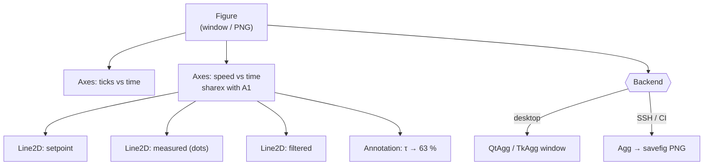

# FPY.03 — Plotting robot data with matplotlib

<!-- glance:start -->
<!-- generated by tools/build.py from curriculum/syllabus.yaml — edit the syllabus, not this block -->

| | |
|---|---|
| **Track** | Optional foundation |
| **Difficulty** | Beginner |
| **Time** | 40 min |
| **Hardware** | none |
| **Software** | python, matplotlib |
| **Prerequisites** | [FPY.02 numpy essentials for robotics](FPY.02-numpy-essentials.md) |
| **Skip if** | You plot time series and 2D trajectories quickly. |

<!-- glance:end -->

## What you will learn

- Use matplotlib's object-oriented API (`Figure`/`Axes`) instead of the global `pyplot` state machine.
- Plot encoder telemetry as aligned time series (ticks, measured speed, setpoint) with units, and read a step response off the plot.
- Plot 2D trajectories and LiDAR/occupancy maps with correct geometry (`set_aspect("equal")`, `origin="lower"`, `extent`).
- Build a bounded rolling live plot of telemetry, and save plots headless on a robot over SSH.

## Why it matters

A robot can't be debugged with breakpoints. The bug is in the physics, and time is part of it. "The PID
oscillates", "odometry drifts left", "the map is mirrored" and "the loop jitters" are all obvious in a 10-line plot and
invisible in a log file. You'll plot constantly: motor step responses when tuning PID
([08.08](../../08-control/08.08-tuning-pid.md)), wheel odometry vs ground truth ([09.04](../../09-odometry/09.04-odometry-from-scratch.md)),
occupancy grids ([11.02](../../11-slam/11.02-occupancy-grid-mapping.md)) and logged telemetry
([03.07](../../03-robot-software/03.07-logging-and-telemetry.md), which also introduces PlotJuggler and Foxglove for ROS data).

matplotlib is the lowest common denominator. It's always installed, it works headless on the Pi, and it's
scriptable, so plots can go into tests and reports. Fifteen minutes of learning its object model saves hours of
fighting it.

<!-- prereqs:start -->
## Prerequisites

You need these first:

- [FPY.02 numpy essentials for robotics](FPY.02-numpy-essentials.md)

### Optional prerequisite links

None.

Check your readiness: `python course.py why FPY.03`
<!-- prereqs:end -->

## Concept

matplotlib has **two APIs**, and most confusion comes from mixing them.

- **`pyplot` state machine** (`plt.plot`, `plt.xlabel`): acts on the "current" figure and axes, a hidden global.
  It's fine for a 3-line notebook experiment.
- **Object-oriented API** (`fig, ax = plt.subplots()`, `ax.plot`, `ax.set_xlabel`): explicit objects, like
  passing a `Graphics` context instead of relying on a static one. Use it for everything else.

The object model is a tree. A **Figure** (the window or PNG) contains **Axes** (one plot area with its own
coordinate system). Axes contain **Artists** (lines, images, text). Updating a live plot means mutating an
artist (`line.set_data(...)`) and asking the canvas to redraw. It's closer to retained-mode WPF than to
immediate-mode drawing.

A **backend** renders the tree. `TkAgg`/`QtAgg` open windows. `Agg` renders to PNG without a display, which is what
you get over SSH on the robot. The same script works with both if you `savefig` and only call `show()` when a
display exists.

Three rules make robot plots *truthful*:
1. **Units on every axis** (`speed [rad/s]`). SI units, radians ([AUTHORING §10](../../AUTHORING.md)).
2. **Shared time axis** for signals that interact (`sharex=True`), so cause and effect line up vertically.
3. **Geometry plots use equal aspect.** Otherwise a circle becomes an ellipse and a 90° turn looks like 60°.

> [!TIP]
> **Ask your teacher:** "Here's a plot of my wheel speeds (I'll describe it or paste the PNG). What do you see? Is it noise, quantization, delay or oscillation, and what would you plot next to confirm?"

## Technical explanation

### Level 2 — Practical recipes

| You want | Code | Why |
|---|---|---|
| Stacked time series | `fig, axs = plt.subplots(3, 1, sharex=True, layout="constrained")` | Zoom one panel and all follow. `constrained` stops labels overlapping. |
| Raw samples | `ax.plot(t, y, ".", ms=3)` | Dots show the sample rate, dropped samples and quantization. Lines hide them. |
| Counters / held values | `ax.plot(t, ticks, drawstyle="steps-post")` | A zero-order hold is what the signal really is between samples. |
| Setpoint vs measurement | `ax.plot(t, sp, "k--")` + measured | You judge error, overshoot and delay from the gap. |
| Mark an event | `ax.axvline(t_event)`, `ax.annotate(...)` | "The command was sent here." |
| Trajectory | `ax.plot(x, y)`; `ax.set_aspect("equal")` | 1 m looks like 1 m in both directions. |
| Heading arrows | `ax.quiver(x, y, cos(yaw), sin(yaw), angles="xy")` | Shows orientation, not just position. |
| LiDAR scan | `ax.scatter(px, py, s=2, c=ranges)` | Color by range or intensity. |
| Grid / image in meters | `ax.imshow(grid, origin="lower", extent=(x0, x1, y0, y1))` | Row 0 at the bottom, with axes in meters, not cells. |
| Distribution (loop jitter) | `ax.hist(np.diff(t) * 1000, bins=50)` | Period histogram in ms. Tails matter more than the mean. |
| Headless save | `fig.savefig("run42.png", dpi=120)` | Works over SSH; `scp` the PNG back. |

**Pick the backend at the edge, not in library code.** Set `MPLBACKEND=Agg` in the environment on the
robot (`export MPLBACKEND=Agg` in bash, `$env:MPLBACKEND="Agg"` in PowerShell) instead of `matplotlib.use("Agg")`
inside modules, so the same module still opens windows on your laptop.

### Level 3 — Mathematics: what the telemetry plot should show

**Speed from encoder ticks.** With $N$ ticks per wheel revolution and telemetry at $f_s$ Hz, the wheel
angular velocity over sample $k$ is

$$\omega_k = \frac{n_k - n_{k-1}}{N}\cdot 2\pi \cdot f_s$$

A one-tick change is the **speed resolution** $\Delta\omega = 2\pi f_s / N$. For karmel ($N = 2464$ from [karmel.yaml](../../labs/config/karmel.yaml), $f_s = 50$ Hz):
$\Delta\omega = 2\pi\cdot 50/2464 = 0.1275$ rad/s. At the rim ($r = 0.045$ m), that's $0.1275 \times 0.045 = 5.7$ mm/s.
So the "from tick diff" dots can only sit on multiples of 0.1275 rad/s. At 10 rad/s that's 78 ticks (9.94 rad/s)
or 79 ticks (10.07 rad/s) per sample. That's quantization, not noise, and a plot with dots shows it instantly.
The difference also belongs **between** the two samples, at $t_k - \tfrac{1}{2f_s}$. Plotting it at $t_k$ adds a
fake 10 ms delay that you'd then "fix" in your controller.

**First-order step response.** The motor model in `labs/config/karmel.yaml` has time constant $\tau = 0.08$ s:

$$\omega(t) = \omega_{ss}\left(1 - e^{-(t - t_0)/\tau}\right),\quad t \ge t_0$$

At $t = t_0 + \tau$ the speed reaches $1 - e^{-1} = 63.2\%$ of the final value: $10 \times 0.632 = 6.32$ rad/s at
$t = 1.08$ s. At $3\tau = 0.24$ s it reaches 95%. Reading $\tau$ off a real plot is how you identify the motor
before tuning PID ([FCT.02](../control-theory/FCT.02-first-second-order-systems.md), [08.08](../../08-control/08.08-tuning-pid.md)).

**Smoothing costs delay.** A centered 5-sample moving average at 50 Hz spans 100 ms. Offline (centered) it has no lag,
but in a causal real-time filter it lags by $(5-1)/2 \cdot 20 = 40$ ms. With `np.convolve(..., mode="valid")` the
output is 4 samples shorter, so you must slice the time axis to match (`t_mid[2:-2]`). `mode="same"` keeps the length
but pads with zeros, which draws a fake drop to 60% at both ends of the plot.

## Diagram



```text
imshow origin: what row 0 means
origin="upper" (default, images)      origin="lower" (maps, REP-103: y up)
 row 0  ┌────────────┐                 row 39 ┌────────────┐  y = 2.0 m
        │            │                        │            │
        │  obstacle  │ ← rows 5..15           │            │
 row 39 └────────────┘                  row 0 └──obstacle──┘  y = 0.0 m
 camera pixel convention                 map convention (y grows upward)
```

## Code

Save both scripts in one folder. Requirements: numpy, matplotlib (and pillow for the GIF, which matplotlib already
depends on). On the robot or over SSH, run them with `MPLBACKEND=Agg`.

### `fpy03_telemetry_plots.py` — telemetry, trajectory and grid

```python
"""fpy03_telemetry_plots.py — plot simulated encoder telemetry, a trajectory and an occupancy grid.

Run: python fpy03_telemetry_plots.py      (writes three PNG files next to the script)
"""
import math

import matplotlib
import matplotlib.pyplot as plt
import numpy as np

TICKS_PER_REV = 2464
WHEEL_RADIUS_M = 0.045
TRACK_M = 0.200
RATE_HZ = 50
TAU_S = 0.08                          # motor time constant (labs/config/karmel.yaml)


def simulate_telemetry(rng: np.random.Generator, seconds: float = 3.0, step_rad_s: float = 10.0):
    """Wheel speed follows a first-order response to a step at t = 1 s; encoder ticks are integers."""
    t = np.arange(0, seconds, 1 / RATE_HZ)                           # (150,)
    setpoint = np.where(t >= 1.0, step_rad_s, 0.0)
    true_w = np.where(t >= 1.0, step_rad_s * (1 - np.exp(-(t - 1.0) / TAU_S)), 0.0)
    angle = np.cumsum(true_w) / RATE_HZ                             # rad, simple integration
    ticks = np.floor(angle / (2 * math.pi) * TICKS_PER_REV + rng.uniform(0, 1, t.size)).astype(int)
    return t, setpoint, true_w, ticks


def plot_telemetry(t, setpoint, true_w, ticks) -> plt.Figure:
    w_meas = np.diff(ticks) / TICKS_PER_REV * 2 * math.pi * RATE_HZ  # rad/s, (N-1,)
    t_mid = t[1:] - 0.5 / RATE_HZ                                    # a difference belongs between samples
    w_filt = np.convolve(w_meas, np.ones(5) / 5, mode="valid")       # 100 ms moving average, (N-5,)

    fig, (ax_ticks, ax_w) = plt.subplots(2, 1, sharex=True, figsize=(8, 5), layout="constrained")
    ax_ticks.plot(t, ticks, drawstyle="steps-post")
    ax_ticks.set_ylabel("encoder [ticks]")
    ax_ticks.set_title("Left wheel: 10 rad/s step at t = 1 s")

    ax_w.plot(t, setpoint, "k--", lw=1, label="setpoint")
    ax_w.plot(t_mid, w_meas, ".", ms=3, alpha=0.6, label="from tick diff")
    ax_w.plot(t_mid[2:-2], w_filt, lw=2, label="5-sample mean")      # "valid" drops 2 samples per side
    ax_w.plot(t, true_w, lw=1, label="true (sim)")
    ax_w.axvline(1.0 + TAU_S, color="grey", lw=0.8)
    ax_w.annotate("τ = 80 ms → 63 %", xy=(1.0 + TAU_S, 6.32), xytext=(1.4, 3), arrowprops={"arrowstyle": "->"})
    ax_w.set_xlabel("time [s]")
    ax_w.set_ylabel("wheel speed [rad/s]")
    ax_w.legend(loc="lower right")
    ax_w.grid(True, alpha=0.3)
    return fig


def plot_trajectory() -> plt.Figure:
    """Unicycle model driving a circle of radius 0.5 m; arrows show heading."""
    v, omega, dt = 0.25, 0.5, 0.05                                  # m/s, rad/s -> radius 0.5 m
    n = int(2 * math.pi / omega / dt)
    yaw = np.arange(n) * omega * dt
    x = np.cumsum(v * np.cos(yaw) * dt)
    y = np.cumsum(v * np.sin(yaw) * dt)
    fig, ax = plt.subplots(figsize=(10, 4), layout="constrained")
    ax.plot(x, y, label="odometry")
    k = slice(None, None, 25)
    ax.quiver(x[k], y[k], np.cos(yaw[k]), np.sin(yaw[k]), angles="xy", scale=12, width=0.004)
    ax.plot(x[0], y[0], "go", label="start")
    ax.set_aspect("equal")                                           # 1 m in x == 1 m in y on screen
    ax.set_xlabel("x [m]"); ax.set_ylabel("y [m]")
    ax.legend(); ax.grid(True, alpha=0.3)
    return fig


def plot_grid() -> plt.Figure:
    """Occupancy grid 3 m x 2 m at 5 cm; row 0 is y = 0 (the bottom of the map)."""
    res = 0.05
    grid = np.zeros((40, 60))                                        # (rows = y, cols = x)
    grid[0, :] = grid[-1, :] = grid[:, 0] = grid[:, -1] = 1.0        # walls
    grid[5:15, 40] = 1.0                                             # an obstacle near the bottom right
    fig, ax = plt.subplots(figsize=(6, 4), layout="constrained")
    im = ax.imshow(grid, origin="lower", extent=(0, 60 * res, 0, 40 * res), cmap="gray_r", vmin=0, vmax=1)
    ax.set_xlabel("x [m]"); ax.set_ylabel("y [m]")
    fig.colorbar(im, ax=ax, label="P(occupied)")
    return fig


if __name__ == "__main__":
    rng = np.random.default_rng(3)
    t, sp, w, ticks = simulate_telemetry(rng)
    w_meas = np.diff(ticks) / TICKS_PER_REV * 2 * math.pi * RATE_HZ
    print(f"backend: {matplotlib.get_backend()}")
    print(f"samples: {t.size}, speed resolution: {2 * math.pi / TICKS_PER_REV * RATE_HZ:.3f} rad/s per tick")
    print(f"mean measured speed for t > 2 s: {w_meas[t[1:] > 2].mean():.2f} rad/s")
    for name, fig in [("telemetry.png", plot_telemetry(t, sp, w, ticks)),
                      ("trajectory.png", plot_trajectory()),
                      ("grid.png", plot_grid())]:
        fig.savefig(name, dpi=120)
        print("wrote", name)
    if matplotlib.get_backend().lower() != "agg":
        plt.show()                               # interactive desktop: open the windows
```

Output (headless):

```text
backend: Agg
samples: 150, speed resolution: 0.127 rad/s per tick
mean measured speed for t > 2 s: 10.00 rad/s
wrote telemetry.png
wrote trajectory.png
wrote grid.png
```

On a desktop the backend line reads something like `tkagg` or `qtagg`, and three windows open.

### `fpy03_live_plot.py` — rolling live plot

Live plotting in matplotlib is good up to ~10–30 redraws per second. The data can arrive faster, so you **batch**
samples per frame, and you keep a **bounded** buffer (`deque(maxlen=...)`, a ring buffer) so an overnight run
doesn't eat the Pi's RAM. For many signals at high rates, use PlotJuggler or Foxglove instead ([03.07](../../03-robot-software/03.07-logging-and-telemetry.md)).

```python
"""fpy03_live_plot.py — rolling 5 s live plot of wheel speed, fed by a (fake) 50 Hz telemetry source.

Run on a desktop: python fpy03_live_plot.py          -> a window that updates in real time
Run headless (SSH, CI): MPLBACKEND=Agg python fpy03_live_plot.py  -> writes live.gif instead
"""
import math
from collections import deque

import matplotlib
import matplotlib.pyplot as plt
import numpy as np
from matplotlib.animation import FuncAnimation, PillowWriter

RATE_HZ = 50
WINDOW_S = 5.0


def fake_telemetry(rng: np.random.Generator):
    """Endless generator of (t, wheel_rad_s): a speed that changes every 2 s, plus quantization noise."""
    k = 0
    while True:
        t = k / RATE_HZ
        target = [0.0, 8.0, 12.0, 4.0][int(t // 2) % 4]
        yield t, target + rng.normal(0, 0.24)
        k += 1


def main() -> None:
    rng = np.random.default_rng(0)
    source = fake_telemetry(rng)
    ts: deque[float] = deque(maxlen=int(WINDOW_S * RATE_HZ))       # ring buffer: memory stays bounded
    ws: deque[float] = deque(maxlen=ts.maxlen)

    fig, ax = plt.subplots(figsize=(7, 3), layout="constrained")
    (line,) = ax.plot([], [], lw=1.5)
    ax.set_ylim(-1, 14)
    ax.set_xlabel("time [s]"); ax.set_ylabel("wheel speed [rad/s]")
    ax.grid(True, alpha=0.3)

    def update(_frame: int):
        for _ in range(5):                                         # 10 fps redraw, 50 Hz data: 5 samples/frame
            t, w = next(source)
            ts.append(t); ws.append(w)
        line.set_data(ts, ws)
        ax.set_xlim(max(0.0, ts[-1] - WINDOW_S), max(WINDOW_S, ts[-1]))
        return (line,)

    headless = matplotlib.get_backend().lower() == "agg"
    anim = FuncAnimation(fig, update, frames=80 if headless else None, interval=100,
                         blit=False, cache_frame_data=False)
    if headless:
        anim.save("live.gif", writer=PillowWriter(fps=10))
        print(f"saved live.gif, buffer holds {len(ts)} samples, last t = {ts[-1]:.2f} s")
    else:
        plt.show()


if __name__ == "__main__":
    main()
```

Keep a reference to `anim`. If the `FuncAnimation` object is garbage-collected, the animation silently stops.
That's the same class of bug as a C# timer with no live reference.

> [!NOTE]
> With a real robot, `fake_telemetry` becomes the parser generator from [FPY.01](FPY.01-python-for-csharp-devs.md)
> reading the serial port. Don't read the port inside `update()` with a blocking call, because it freezes the GUI.
> Read in a thread or asyncio task that fills the deque ([FPY.05](FPY.05-asyncio-for-csharp-devs.md)), and let `update()` only draw.

## Exercise

No hardware is needed for any exercise. Put the Code-section scripts in the same folder.

### Exercise FPY.03-E1 — Predict the squashed circle `[predict]`

In `plot_trajectory()`, the figure is 10 × 4 inches and the circle has a 1 m diameter. **Before running**, predict what
the plot looks like if you delete `ax.set_aspect("equal")`: the shape, the approximate width-to-height ratio on
screen, and how a 90° left turn would look. Then delete the line, run, and compare.

### Exercise FPY.03-E2 — Resolution vs telemetry rate `[numerical]`

Compute the speed resolution (rad/s per tick, and mm/s at the wheel rim) for telemetry at 10 Hz, 50 Hz and 200 Hz.
Predict how the "from tick diff" dots in `telemetry.png` look at 200 Hz. Then check: set `RATE_HZ = 200` and rerun.

### Exercise FPY.03-E3 — Two wheels and the path they draw `[coding]`

Write `fpy03_e3.py`:
1. `rng = np.random.default_rng(5)`. Simulate 6 s of the **left** wheel with `step_rad_s=10.0`, then the **right** wheel
   with `step_rad_s=9.0`, using the same `rng` in that order.
2. Compute wheel speeds from tick differences. Then the robot's linear and angular velocity
   $v = r(\omega_l + \omega_r)/2$, $\omega = r(\omega_r - \omega_l)/L$ ($r = 0.045$, $L = 0.200$; details in
   [09.01](../../09-odometry/09.01-diff-drive-kinematics.md)).
3. Integrate the pose (`np.cumsum`, no loop, starting at `(0, 0, 0)`). Plot wheel speeds and the trajectory side by
   side with equal aspect, save `e3.png`, and print the steady-state (`t > 2 s`) mean `v`, `omega`, the radius `v/omega`,
   the final position and the final yaw in degrees.

### Exercise FPY.03-E4 — The upside-down map `[debugging]`

In `plot_grid()`, remove `origin="lower"` and `extent=...`. Describe everything that's now wrong with the plot:
where the obstacle is, what the axis numbers mean, and which way y grows. Why is this bug dangerous when you click on
the map to send a navigation goal?

## Expected result

**FPY.03-E1**: without equal aspect, the axes fill the 10 × 4 figure, so the circle becomes a **wide ellipse**,
roughly 2.5–3× wider than tall. Arrows no longer look tangent, and a 90° turn appears much shallower than 90°.
With `set_aspect("equal")` you get a true circle with white margins left and right (that's correct).

**FPY.03-E2**: $\Delta\omega = 2\pi f_s/2464$ gives **0.026 rad/s (1.1 mm/s) at 10 Hz, 0.127 rad/s (5.7 mm/s) at 50 Hz,
0.510 rad/s (22.9 mm/s) at 200 Hz**. At 200 Hz each sample sees only ~19.6 ticks at 10 rad/s, so the dots jump between
9.69 and 10.20 rad/s (19 or 20 ticks) and look like heavy noise around the true curve. That's quantization. Faster
sampling gives *worse* speed resolution per sample. Averaging over time, or measuring the time between ticks, fixes it.

**FPY.03-E3** prints (±0.01 because of dither, exact with this seed):

```text
v = 0.427 m/s, omega = -0.225 rad/s, radius = -1.90 m
end = (1.70, -1.04) m, yaw = -63 deg
```

The right wheel is slower, so the robot curves **right**. Negative ω is clockwise under REP-103 (z up). The trajectory is an
arc bending toward −y. Hand check: $v = 0.045 \cdot 9.5 = 0.4275$, $\omega = 0.045\cdot(9-10)/0.200 = -0.225$,
$R = -1.90$ m.

**FPY.03-E4**: with the default `origin="upper"`, row 0 is drawn at the **top**. The obstacle (rows 5–15) moves to the
top-right area, the y-axis counts 0 → 39 **downward**, and both axes show **cell indices**, not meters. The map is
mirrored top-to-bottom. Clicking a goal on the "obstacle-free" bottom sends the robot toward the real obstacle, and
coordinates are off by a factor of 20 (1 cell = 0.05 m).

## Troubleshooting

### Symptom: the script runs but no window appears (or it hangs forever)
1. Print `matplotlib.get_backend()`. `agg` means no windows by design (SSH, `MPLBACKEND=Agg`, no display), so use `savefig`.
2. On the robot over SSH, you *want* Agg. Save and copy: `scp robot:~/run/telemetry.png .`
3. It hangs after the first window: `plt.show()` **blocks** until all windows are closed (desktop backends).
   Put it last. For non-blocking updates, use `FuncAnimation` or `plt.pause(0.01)` inside a loop.
4. On WSL2, windows need WSLg ([FL.12](../linux-and-tools/FL.12-docker-for-robotics.md) covers GUIs in containers).

### Symptom: a live plot gets slower and slower
1. Are you calling `ax.plot()` every frame? Each call adds a **new** artist. Create lines once and use `set_data`.
2. Is the buffer unbounded (a `list.append` forever)? Use `deque(maxlen=...)`.
3. Redrawing too often: batch samples, aim for 10–20 fps, or `blit=True` with a fixed axis range.
4. Still too slow: it's the wrong tool at that rate. Log to CSV/MCAP and use PlotJuggler or Foxglove.

### Symptom: the line doesn't appear after `set_data`
Autoscaling isn't re-run for updated data. Set limits explicitly (`ax.set_xlim`) or call `ax.relim(); ax.autoscale_view()`.

### Symptom: the plot "looks wrong" but the numbers seem right
Check in this order: (1) aspect ratio for geometry, (2) `origin`/`extent` for grids and images, (3) time alignment of
derived signals (differences between samples, filter delay, `mode="same"` edge effects), (4) units (degrees vs radians,
ticks vs meters), (5) BGR vs RGB for camera images: `plt.imshow` expects RGB, OpenCV gives BGR
([13.01](../../13-computer-vision/13.01-images-as-data.md)).

## Common mistakes

- **Mixing `plt.*` and `ax.*` in one function.** `plt.xlabel` labels whatever axes happen to be "current", often the wrong subplot.
- **Plotting derived signals against the wrong timestamps.** A difference or filter output has fewer samples and a time
  shift. Slice the time axis to match, or you'll invent lag.
- **Lines through gaps.** Dropped telemetry drawn with `-` interpolates straight across the gap. Plot dots, or insert
  `np.nan` where `np.diff(t)` is larger than 1.5× the nominal period.
- **Leaving figures open in loops.** Scripts that generate hundreds of plots must `plt.close(fig)`, or memory grows and
  matplotlib warns about >20 open figures.
- **Rainbow colormaps (`jet`) for continuous data.** They invent edges. Use `viridis` for values and `gray_r` for occupancy.

## Knowledge check

1. Why prefer `fig, ax = plt.subplots()` and `ax.plot` over `plt.plot` in robot code?
   <details><summary>Answer</summary>

   The OO API uses explicit objects instead of hidden global "current axes" state. Functions can take an `ax` argument,
   compose into subplots, run in tests, and never draw on the wrong subplot. It's the same reasoning as avoiding static
   mutable state in C#.
   </details>

2. Telemetry at 50 Hz, 2464 ticks/rev. The speed plot shows values only at …, 9.94, 10.07, 10.20, … rad/s. Noise or something else?
   <details><summary>Answer</summary>

   Quantization. One tick per 20 ms is $2\pi\cdot 50/2464 = 0.1275$ rad/s, so measured speeds are multiples of 0.1275.
   Filtering, longer windows, or timing between ticks improves it. Blaming the motor driver won't.
   </details>

3. You plot `np.diff(ticks)`-based speed against `t[1:]`. What error does that introduce, and how large is it at 50 Hz?
   <details><summary>Answer</summary>

   Each difference describes the interval between two samples, so it belongs at the midpoint. Plotting at the end time
   shifts it half a period late: 10 ms at 50 Hz. It looks like a delay in your motor that doesn't exist.
   </details>

4. A step response reaches 6.3 rad/s at 1.12 s after a 10 rad/s step commanded at 1.00 s and settles at 10 rad/s. Estimate τ.
   <details><summary>Answer</summary>

   63% of the final value is reached at $t_0 + \tau$, so $\tau \approx 0.12$ s. (The course default is 0.08 s, so this motor
   is slower, perhaps from a heavier load or lower battery voltage.)
   </details>

5. Your live plot starts at 20 fps and drops to 2 fps after ten minutes. Name the two most likely causes.
   <details><summary>Answer</summary>

   (1) Creating a new artist per frame (`ax.plot` in `update`) instead of `line.set_data`. (2) An unbounded data buffer,
   so each redraw draws ever more points. Fix with persistent artists and `deque(maxlen=N)`.
   </details>

6. You `imshow` a 200 × 300 occupancy grid with 0.05 m cells, where row 0 is the map's lowest y. Which two arguments make
   the axes correct, and what are their values if the map origin is (−5, −5) m?
   <details><summary>Answer</summary>

   `origin="lower"` and `extent=(-5, -5 + 300*0.05, -5, -5 + 200*0.05) = (-5, 10, -5, 5)`. The extent is
   (left, right, bottom, top) in meters. Columns are x, rows are y.
   </details>

## Practical challenge

**A reusable `plot_run(csv_path)` report.** Log format: CSV with columns `t_s, left_ticks, right_ticks, cmd_left_rad_s,
cmd_right_rad_s, range_m` (generate a 60 s run from the simulator in this lesson, with a few dropped rows and a stop
in the middle).

Write `plot_run.py` that produces **one PNG** with:
1. Left and right wheel speed vs command (shared x), with dots for raw values and a line for a 100 ms filter correctly time-aligned.
2. Integrated trajectory with equal aspect, heading arrows every 2 s, and start/end markers.
3. The range sensor over time, with gaps (dropped rows) shown as gaps, not interpolated lines.
4. A histogram of sample periods in ms, with the nominal period marked.

Acceptance criteria: runs headless (`MPLBACKEND=Agg`) in under 3 s for a 60 s log. No `plt.` calls except `plt.subplots`
and `plt.close`. Every axis has units. A reviewer can spot the dropped rows and the stop without reading the CSV.

## You can skip this if…

You can answer questions 2, 3 and 6 without looking, and you routinely set equal aspect and `origin`/`extent` without
thinking. Then:
`python course.py skip FPY.03 --reason "plot telemetry and maps fluently"`

## Go deeper

- https://matplotlib.org/stable/users/explain/quick_start.html — the official quick start, which explains Figure/Axes/Artist and the two APIs.
- https://matplotlib.org/stable/users/explain/animations/animations.html — `FuncAnimation`, blitting and saving animations.
- https://numpy.org/doc/stable/user/absolute_beginners.html — the numpy side of preparing data for plots (slicing, `diff`, `cumsum`).
- https://petercorke.com/rvc/ — Corke's *Robotics, Vision and Control* uses matplotlib throughout for trajectories and maps (paid).

## Progress checkpoint

- [ ] I can build multi-panel time-series plots with shared time axes and units using the OO API.
- [ ] I can read speed resolution, time constant and delay directly off a telemetry plot.
- [ ] I can plot trajectories and grids with correct aspect, origin and extent.
- [ ] I can write a bounded live plot and save plots headless on the robot.

`python course.py complete FPY.03` (exercises done) · `python course.py master FPY.03` (challenge done) ·
`python course.py struggle FPY.03 "what was hard"`

Next: [FPY.04 — Typing, dataclasses, protocols and packaging](FPY.04-typing-dataclasses-packaging.md).
