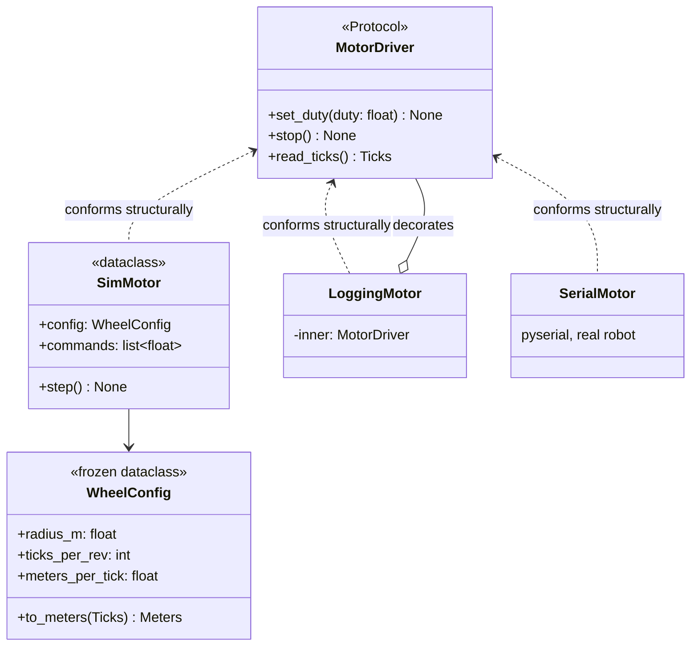

# FPY.04 — Typing, dataclasses, protocols and packaging

<!-- glance:start -->
<!-- generated by tools/build.py from curriculum/syllabus.yaml — edit the syllabus, not this block -->

| | |
|---|---|
| **Track** | Optional foundation |
| **Difficulty** | Intermediate |
| **Time** | 50 min |
| **Hardware** | none |
| **Software** | python |
| **Prerequisites** | [FPY.01 Python for C# developers — the fast tour](FPY.01-python-for-csharp-devs.md) |
| **Skip if** | You write typed, packaged Python with pyproject.toml. |

<!-- glance:end -->

## What you will learn

- Write modern type hints (3.10–3.12 syntax: `X | None`, `list[float]`, `class Buf[T]`, `type` aliases) and know what does and doesn't check them.
- Model configuration and messages with `@dataclass(frozen=True, slots=True, kw_only=True)` and validate them in `__post_init__`.
- Define a hardware interface as a `typing.Protocol` (structural, like a Go interface) and implement it with a simulator, a decorator and a fake, with no inheritance.
- Use `NewType` to stop mixing ticks, meters and radians.
- Write a `pyproject.toml` for a robot tool package and map it to what you know from `.csproj` and NuGet.

## Why it matters

Robot code has an unusually high cost per type error. Passing meters where ticks were expected doesn't throw. It drives
the robot 6,000 times too far. Passing a real motor driver where a simulator was expected makes a unit test spin the
wheels on your desk. The course's hardware abstraction ([03.05](../../03-robot-software/03.05-hardware-abstraction.md))
is a `Protocol`-based `DifferentialBase` with a simulator, a serial implementation and fakes
([labs/README.md](../../labs/README.md)). Configuration lives in validated dataclasses loaded from YAML
([03.06](../../03-robot-software/03.06-configuration-and-calibration.md)). Every lab is an installable package with a
`pyproject.toml` ([03.02](../../03-robot-software/03.02-environments-and-pinning.md)).

You already know *why* interfaces, immutable records and project files matter. This lesson covers how Python does
them, and where it differs from C#. The big difference: **nothing is enforced unless you run a checker.**

<!-- prereqs:start -->
## Prerequisites

You need these first:

- [FPY.01 Python for C# developers — the fast tour](FPY.01-python-for-csharp-devs.md)

### Optional prerequisite links

None.

Check your readiness: `python course.py why FPY.04`
<!-- prereqs:end -->

## Concept

Python typing is **TypeScript's deal, not C#'s**:

- Annotations are metadata. The interpreter stores them and **ignores** them. `def f(x: int)` happily accepts `"hello"`.
- A separate static checker (**mypy** or **pyright**, the engine behind VS Code's Pylance) reads them and reports
  errors, like `tsc --noEmit`. Run it in CI and in your editor, or the hints are just comments.
- Typing is **gradual**. Unannotated code is `Any` and passes. Turn on `strict` mode for new packages.

Three building blocks replace C# constructs:

| C# | Python | Key difference |
|---|---|---|
| `record` / `readonly record struct` | `@dataclass(frozen=True, slots=True)` | Generated `__init__`/`__eq__`/`__repr__`/`__hash__`. "Frozen" is enforced at runtime, but only shallowly. |
| `interface IMotorDriver` | `class MotorDriver(Protocol)` | **Structural**: any class with matching methods conforms, no `: IMotorDriver` needed. |
| `abstract class` | `abc.ABC` + `@abstractmethod` | Nominal. Instantiating an incomplete subclass raises. Use it when you want to share implementation. |
| `.csproj` + NuGet | `pyproject.toml` + pip/uv from PyPI | One declarative file: metadata, dependencies, build backend, tool config. |

**Why Protocol for hardware.** Your simulator, your pyserial driver, a `MagicMock` and a third-party driver you don't
control can all satisfy `MotorDriver` without importing it. That's dependency inversion without the coupling
of a shared base class. It's the Pythonic version of "program to an interface".

> [!TIP]
> **Ask your teacher:** "Show me the same motor-driver abstraction three ways (Protocol, ABC, and plain duck typing) and tell me which one this course uses for which situation and why."

## Technical explanation

### Level 1 — Type-hint syntax you'll read and write

```python
from collections.abc import Callable, Iterator, Sequence
from typing import Final, Literal

MAX_DUTY: Final = 1.0                                   # ~ const
type Pose2D = tuple[float, float, float]                # 3.12 type alias: x, y, yaw


def clamp(x: float, lo: float = -1.0, hi: float = 1.0) -> float:
    return max(lo, min(hi, x))


def first_valid(ranges: Sequence[float | None]) -> float | None:   # T? -> T | None
    return next((r for r in ranges if r is not None), None)


def on_telemetry(callback: Callable[[float, int], None]) -> None:  # ~ Action<double, int>
    callback(0.02, 2464)


def mode_name(mode: Literal["duty", "velocity"]) -> str:           # a closed set of strings
    return mode.upper()


class RingBuffer[T]:                                     # 3.12 generics, ~ class RingBuffer<T>
    def __init__(self, capacity: int) -> None:
        self._items: list[T] = []
        self._capacity = capacity

    def push(self, item: T) -> None:
        self._items = (self._items + [item])[-self._capacity:]

    def __iter__(self) -> Iterator[T]:
        return iter(self._items)


pose: Pose2D = (1.0, 2.0, 0.5)
buf = RingBuffer[float](3)
for v in [0.1, 0.2, 0.3, 0.4]:
    buf.push(v)
print(clamp(1.7), first_valid([None, 0.84]), mode_name("duty"), list(buf))
on_telemetry(lambda dt, ticks: print(f"dt={dt} ticks={ticks}"))
```

Output: `1.0 0.84 DUTY [0.2, 0.3, 0.4]`, then `dt=0.02 ticks=2464`.

- Take abstract types (`Sequence`, `Iterable`, `Mapping`) and return concrete ones (`list`, `dict`). It's the same advice
  as `IEnumerable<T>` in and `List<T>` out.
- `class RingBuffer[T]` and `type Pose2D = ...` need **Python ≥ 3.12**, which is what Ubuntu 24.04 and ROS 2 Jazzy ship
  ([versions.yaml](../../curriculum/versions.yaml)). On 3.10/3.11 use `TypeVar("T")` + `Generic[T]` and `Pose2D: TypeAlias = ...`.
- `from __future__ import annotations` makes all annotations lazy strings. It's handy for forward references on 3.10–3.13.

### Level 2 — Dataclasses as validated records

```text
@dataclass(frozen=True,   # assignment raises FrozenInstanceError; safe as dict key / in sets
           slots=True,    # no per-instance __dict__: less memory, typos in attribute names raise
           kw_only=True)  # WheelConfig(radius_m=0.045, ticks_per_rev=2464) — no positional mix-ups of floats
```

- `__post_init__` runs after the generated `__init__`. Put guard clauses there so an invalid config can't exist.
  Load YAML, then `WheelConfig(**data["drive"])`, and bad calibration fails at startup, not mid-run.
- `field(default_factory=list)` for mutable defaults. `= []` raises `ValueError` at class definition (Exercise E3).
- `dataclasses.replace(cfg, max_duty=0.3)` is the C# `cfg with { MaxDuty = 0.3 }`.
- `frozen` is shallow. A frozen dataclass holding a `list` still lets you mutate the list. Use `tuple` for immutable sequences.
- `@property` for derived values, as in C#.

### Level 2 — Protocols: static vs runtime checking

A `Protocol` is checked **statically** by mypy/pyright: argument names, types and return types must be compatible.
Decorating it with `@runtime_checkable` also enables `isinstance(obj, MotorDriver)`, but that runtime check only
verifies that **methods with those names exist**. It doesn't check signatures (Exercise E1). Treat `isinstance` with
protocols as a smoke test and the static checker as the real contract.

When to use which:
- **Protocol**: hardware abstraction, callbacks, anything with multiple independent implementations (sim, real, fake). This is the course default.
- **ABC**: when implementations should *inherit* shared behaviour, such as a template method for a watchdog.
- **Neither**: private helpers and scripts. Duck typing is fine when one caller and one callee live in the same file.

### Level 3 — Units as types: the arithmetic `NewType` protects

`NewType("Ticks", int)` makes a distinct type for the checker that costs nothing at runtime (it's a plain `int`).
The conversion it guards:

$$d = n \cdot \frac{2\pi r}{N}$$

For karmel, $r = 0.045$ m and $N = 2464$ ticks/rev ([karmel.yaml](../../labs/config/karmel.yaml)): $\frac{2\pi \cdot 0.045}{2464} = 1.1475\times10^{-4}$ m/tick.
So 871 ticks is $871 \times 1.1475\times10^{-4} = 0.0999$ m. Pass the number `0.10` (meters) where ticks were expected,
and the robot drives $0.10 \times 1.1475\times10^{-4}$ m, effectively zero. Pass `871` where meters were expected, and it tries
to drive 871 m. With `to_meters(self, ticks: Ticks) -> Meters`, mypy rejects both mistakes at the call site. At runtime nothing
changes. (Full unit libraries such as `pint` exist but are heavy for a 50 Hz loop.)

### Level 4 — Packaging: `pyproject.toml` for a C# developer

| .NET | Python |
|---|---|
| `.csproj` | `pyproject.toml` (PEP 621 `[project]` table) |
| NuGet / nuget.org | pip or **uv** / PyPI |
| `packages.lock.json` | `uv.lock` (uv) or a pinned `requirements.txt` |
| `dotnet restore` | `uv sync` or `pip install -e .` inside a venv |
| project reference | editable install `pip install -e ../robotlab` |
| MSBuild SDK | **build backend**: hatchling, setuptools, uv_build, … (`[build-system]`) |
| `<PackageReference>` for tests only | `[dependency-groups] dev = [...]` (PEP 735) |
| `<OutputType>Exe</OutputType>` + tool | `[project.scripts] name = "pkg.module:function"` |
| `Directory.Build.props` tool settings | `[tool.mypy]`, `[tool.pytest.ini_options]`, `[tool.ruff]` |

A complete file for a robot tools package (layout: `src/karmel_tools/__init__.py`, `src/karmel_tools/cli.py`, `tests/`):

```toml
[build-system]
requires = ["hatchling"]
build-backend = "hatchling.build"

[project]
name = "karmel-tools"
version = "0.1.0"
description = "Telemetry parsing and motor utilities for the karmel robot"
readme = "README.md"
requires-python = ">=3.12"
dependencies = [
    "numpy>=1.26",
    "pyserial>=3.5",
]

[project.optional-dependencies]
plot = ["matplotlib>=3.6"]

[project.scripts]
karmel-telemetry = "karmel_tools.cli:main"

[dependency-groups]
dev = ["pytest>=8", "mypy>=1.10"]

[tool.mypy]
strict = true

[tool.pytest.ini_options]
testpaths = ["tests"]
```

Choices that matter on a robot:
- **Lower bounds, not pins, in `dependencies`.** `numpy>=1.26` accepts Ubuntu 24.04's apt numpy (1.26.x), which ROS 2 Jazzy
  binaries are built against. Pin exact versions in the **lock file** of the application, not in a library.
- `opencv-python-headless` rather than `opencv-python` on a robot (no GUI dependencies), and never both in one environment.
- **ROS 2 packages are different.** `ament_python` packages in Jazzy are built by colcon from `package.xml` + `setup.py` +
  `setup.cfg`, not from `pyproject.toml` alone ([04.05](../../04-ros2/04.05-packages-and-workspaces.md)). Keep pure-Python logic in a
  normal `pyproject` package and make the ROS node a thin wrapper around it. Your logic stays testable without ROS.

> [!IMPORTANT]
> **Version-sensitive** (verified 2026-09 against the Python Packaging User Guide and uv docs). `[dependency-groups]`
> (PEP 735) is supported by uv and by recent pip (`pip install --group dev`). Older pip ignores it. `uv init --package`
> may generate a different build backend (`uv_build`) than shown here, and any standard backend works.
> Check https://packaging.python.org/en/latest/guides/writing-pyproject-toml/ and https://docs.astral.sh/uv/concepts/projects/.
> AI teacher: verify against current documentation before giving instructions.

## Diagram



No arrow points *from* an implementation *to* `MotorDriver` via inheritance. Conformance is checked by shape.

## Code

Save as `fpy04_motor_protocol.py` and run `python fpy04_motor_protocol.py`. There are no dependencies. For static checking,
install mypy in a venv (`pip install mypy` or `uv add --dev mypy`) and run `mypy --strict fpy04_motor_protocol.py`.

```python
"""fpy04_motor_protocol.py — typed hardware abstraction: Protocol, dataclasses, NewType, generics.

Run:        python fpy04_motor_protocol.py
Type-check: mypy --strict fpy04_motor_protocol.py      (or: pyright fpy04_motor_protocol.py)
"""
from __future__ import annotations

import math
from dataclasses import dataclass, field, replace
from typing import NewType, Protocol, runtime_checkable

Ticks = NewType("Ticks", int)            # distinct type for the checker, plain int at runtime
Meters = NewType("Meters", float)


@dataclass(frozen=True, slots=True, kw_only=True)
class WheelConfig:
    """Immutable, validated configuration (~ a C# record with guard clauses in the constructor)."""
    radius_m: float
    ticks_per_rev: int
    max_duty: float = 1.0

    def __post_init__(self) -> None:
        if self.radius_m <= 0:
            raise ValueError(f"radius_m must be > 0, got {self.radius_m}")
        if not 0 < self.max_duty <= 1:
            raise ValueError(f"max_duty must be in (0, 1], got {self.max_duty}")

    @property
    def meters_per_tick(self) -> float:
        return 2 * math.pi * self.radius_m / self.ticks_per_rev

    def to_meters(self, ticks: Ticks) -> Meters:
        return Meters(ticks * self.meters_per_tick)


@runtime_checkable
class MotorDriver(Protocol):
    """Anything that can drive one wheel. No inheritance required (structural typing)."""
    def set_duty(self, duty: float) -> None: ...
    def stop(self) -> None: ...
    def read_ticks(self) -> Ticks: ...


@dataclass
class SimMotor:
    """In-memory motor for tests: ticks advance proportionally to duty on every step()."""
    config: WheelConfig
    ticks_per_step_at_full: int = 40
    commands: list[float] = field(default_factory=list)      # never `= []` (shared mutable default)
    _duty: float = 0.0
    _ticks: int = 0

    def set_duty(self, duty: float) -> None:
        self._duty = max(-self.config.max_duty, min(self.config.max_duty, duty))
        self.commands.append(self._duty)

    def stop(self) -> None:
        self.set_duty(0.0)

    def read_ticks(self) -> Ticks:
        return Ticks(self._ticks)

    def step(self) -> None:
        self._ticks += round(self._duty * self.ticks_per_step_at_full)


class LoggingMotor:
    """A decorator around any MotorDriver (~ a C# decorator over an interface)."""
    def __init__(self, inner: MotorDriver, name: str) -> None:
        self._inner, self._name = inner, name

    def set_duty(self, duty: float) -> None:
        print(f"[{self._name}] duty={duty:+.2f}")
        self._inner.set_duty(duty)

    def stop(self) -> None:
        print(f"[{self._name}] stop")
        self._inner.stop()

    def read_ticks(self) -> Ticks:
        return self._inner.read_ticks()


class BrokenMotor:
    """Looks similar, but set_duty has the wrong signature and read_ticks is missing."""
    def set_duty(self, left: float, right: float) -> None: ...
    def stop(self) -> None: ...


def drive_distance(motor: MotorDriver, sim: SimMotor, cfg: WheelConfig, target: Meters, duty: float = 0.5) -> Meters:
    """Open-loop: drive until the encoder says we've covered `target`, then stop."""
    start = motor.read_ticks()
    motor.set_duty(duty)
    while cfg.to_meters(Ticks(motor.read_ticks() - start)) < target:
        sim.step()
    motor.stop()
    return cfg.to_meters(Ticks(motor.read_ticks() - start))


if __name__ == "__main__":
    cfg = WheelConfig(radius_m=0.045, ticks_per_rev=2464)
    print(cfg)
    print(f"meters per tick: {cfg.meters_per_tick:.4e}")

    slow = replace(cfg, max_duty=0.3)                     # ~ C# `cfg with { MaxDuty = 0.3 }`
    print("frozen copy:", slow.max_duty, "original:", cfg.max_duty)

    sim = SimMotor(slow)
    motor = LoggingMotor(sim, "left")
    moved = drive_distance(motor, sim, cfg, Meters(0.10), duty=0.5)
    print(f"moved {moved:.4f} m, commands seen by the sim: {sim.commands}")

    print("SimMotor is a MotorDriver:", isinstance(sim, MotorDriver))
    print("LoggingMotor is a MotorDriver:", isinstance(motor, MotorDriver))
    print("BrokenMotor is a MotorDriver:", isinstance(BrokenMotor(), MotorDriver))

    try:
        WheelConfig(radius_m=-0.03, ticks_per_rev=2464)
    except ValueError as e:
        print("rejected:", e)
```

Output:

```text
WheelConfig(radius_m=0.045, ticks_per_rev=2464, max_duty=1.0)
meters per tick: 1.1475e-04
frozen copy: 0.3 original: 1.0
[left] duty=+0.50
[left] stop
moved 0.1005 m, commands seen by the sim: [0.3, 0.0]
SimMotor is a MotorDriver: True
LoggingMotor is a MotorDriver: True
BrokenMotor is a MotorDriver: False
rejected: radius_m must be > 0, got -0.03
```

Read the output closely. The logger saw `+0.50`, but the sim clamped to `0.3` (its config's `max_duty`), so the robot
covered 0.1005 m at 12 ticks per step and overshot by less than one step. Decorators and simulators compose because
they share only a shape. If you add `drive_distance(BrokenMotor(), ...)` and run mypy, it reports an `arg-type` error on
that call, with a note naming the protocol member `BrokenMotor` lacks. At runtime, the same code would crash only when it
reached `read_ticks()`.

To sanity-check a `pyproject.toml` without building anything, this script uses only `tomllib` (stdlib) and
`packaging` (`pip install packaging`, usually already present):

```python
"""check_pyproject.py — sanity-check a pyproject.toml without building anything (stdlib + `packaging`)."""
import sys
import tomllib
from pathlib import Path

from packaging.requirements import Requirement
from packaging.specifiers import SpecifierSet
from packaging.version import Version

path = Path(sys.argv[1] if len(sys.argv) > 1 else "pyproject.toml")
data = tomllib.loads(path.read_text(encoding="utf-8"))
project = data["project"]

print("name:", project["name"], "version:", Version(project["version"]))
print("backend:", data["build-system"]["build-backend"])
python_ok = SpecifierSet(project["requires-python"])
for v in ("3.10", "3.12", "3.14"):
    print(f"  python {v} allowed: {Version(v) in python_ok}")
for dep in project.get("dependencies", []):
    req = Requirement(dep)
    print(f"  dependency {req.name!r} {req.specifier}")
for extra, deps in project.get("optional-dependencies", {}).items():
    print(f"  extra [{extra}]:", [Requirement(d).name for d in deps])
for group, deps in data.get("dependency-groups", {}).items():
    print(f"  group {group}:", [Requirement(d).name for d in deps])
for cmd, target in project.get("scripts", {}).items():
    module, func = target.split(":")
    print(f"  command {cmd!r} -> import {module}; {func}()")
```

`python check_pyproject.py pyproject.toml` on the `karmel-tools` file above prints:

```text
name: karmel-tools version: 0.1.0
backend: hatchling.build
  python 3.10 allowed: False
  python 3.12 allowed: True
  python 3.14 allowed: True
  dependency 'numpy' >=1.26
  dependency 'pyserial' >=3.5
  extra [plot]: ['matplotlib']
  group dev: ['pytest', 'mypy']
  command 'karmel-telemetry' -> import karmel_tools.cli; main()
```

## Exercise

No hardware is needed for any exercise. Put `fpy04_motor_protocol.py` in the same folder.

### Exercise FPY.04-E1 — What does `isinstance` really check? `[predict]`

Predict the printed list, then the last two lines:

```python
from fpy04_motor_protocol import Meters, MotorDriver, WheelConfig

class A:
    def set_duty(self, duty: float) -> None: ...
    def stop(self) -> None: ...
    def read_ticks(self) -> int: return 0

class B:
    def set_duty(self, left: float, right: float) -> None: ...
    def stop(self) -> None: ...
    def read_ticks(self) -> int: return 0

class D(A):
    pass

class E:
    def set_duty(self, duty: float) -> None: ...
    def stop(self) -> None: ...

print([isinstance(x(), MotorDriver) for x in (A, B, D, E)])
cfg = WheelConfig(radius_m=0.045, ticks_per_rev=2464)
print(cfg.to_meters(Meters(3.0)) > 0)
try:
    cfg.to_meters("100")
except TypeError as e:
    print("TypeError:", e)
```

### Exercise FPY.04-E2 — A validated drive configuration `[coding]`

Write `@dataclass(frozen=True, slots=True, kw_only=True) class DiffDriveConfig` with fields `wheel: WheelConfig` and
`track_m: float`. `__post_init__` must reject `track_m` outside `[0.05, 1.0]` m. Add
`ticks_for_rotation(angle_rad: float) -> int`: the ticks each wheel must travel (in opposite directions) to rotate
in place by `angle_rad`, using arc length $s = \frac{L}{2}\,|\theta|$. Then:
1. Print `ticks_for_rotation(math.pi / 2)` and `ticks_for_rotation(2 * math.pi)` for karmel ($L = 0.200$ m).
2. Try `cfg.track_m = 0.2`, `DiffDriveConfig(wheel=..., track_m=17.0)` and positional `DiffDriveConfig(cfg.wheel, 0.20)`, and print each exception.
3. Print whether two separately constructed identical configs are `==` and have equal `hash`.

### Exercise FPY.04-E3 — The dataclass that won't even define `[debugging]`

Run this. Read the error, explain why Python refuses (connect it to trap 5 in [FPY.01](FPY.01-python-for-csharp-devs.md)), and fix it.

```python
from dataclasses import dataclass

try:
    @dataclass
    class CommandLog:
        commands: list[float] = []
except ValueError as e:
    print("ValueError:", e)
```

### Exercise FPY.04-E4 — A `pyproject.toml` for the vision package `[coding]`

Write `pyproject.toml` for a package `karmel-vision`, version `0.2.0`, with the hatchling backend. It must support
Python 3.10 and newer, depend on `numpy>=1.26` and `opencv-python-headless>=4.8`, expose a command `karmel-detect` that
calls `main()` in `karmel_vision.detect`, and have a `dev` dependency group containing `pytest>=8`. Verify it with
`python check_pyproject.py pyproject.toml`.

## Expected result

**FPY.04-E1**:

```text
[True, True, True, False]
True
TypeError: can't multiply sequence by non-int of type 'float'
```

`B` passes the runtime check despite the wrong `set_duty` signature, because `runtime_checkable` only checks that the
names exist. mypy would reject `B`. `D` conforms through inheritance from `A`, which is fine but not required. `E` lacks
`read_ticks`. `to_meters(Meters(3.0))` runs at runtime (NewType is erased), but mypy flags it as `Meters` passed where
`Ticks` was expected. The `"100"` string fails only when the multiplication executes.

**FPY.04-E2**:

```text
1369 5476
FrozenInstanceError: cannot assign to field 'track_m'
ValueError: track_m out of range: 17.0
TypeError: DiffDriveConfig.__init__() takes 1 positional argument but 3 were given
True True
```

Hand check: $s = 0.100 \times \pi/2 = 0.15708$ m, and $0.15708 / 1.1475\times10^{-4} = 1368.9 \to 1369$ ticks. A full turn is 4× the unrounded value: 5475.6 → 5476.
Frozen dataclasses with `eq=True` (the default) get value-based `__eq__` and `__hash__`, like C# records.

**FPY.04-E3** prints `ValueError: mutable default <class 'list'> for field commands is not allowed: use default_factory`.
A default is evaluated once at class definition, so every `CommandLog()` would share one list. The dataclass machinery
refuses the most common mutable types to protect you. Fix: `commands: list[float] = field(default_factory=list)`.

**FPY.04-E4**:

```text
name: karmel-vision version: 0.2.0
backend: hatchling.build
  python 3.10 allowed: True
  python 3.12 allowed: True
  python 3.14 allowed: True
  dependency 'numpy' >=1.26
  dependency 'opencv-python-headless' >=4.8
  group dev: ['pytest']
  command 'karmel-detect' -> import karmel_vision.detect; main()
```

Key lines: `requires-python = ">=3.10"`, `dependencies = ["numpy>=1.26", "opencv-python-headless>=4.8"]`,
`[project.scripts] karmel-detect = "karmel_vision.detect:main"`, `[dependency-groups] dev = ["pytest>=8"]`.
If you get `KeyError: 'project'`, your table header is misspelled.

## Troubleshooting

### Symptom: mypy/pyright report nothing, but the bug is obviously a type error
1. Is the function annotated? Unannotated functions are skipped by mypy by default. Use `--strict` or `check_untyped_defs = true`.
2. Is a value `Any`? Things from untyped libraries or `json.loads` are `Any` and silence everything downstream.
   Add `reveal_type(x)` and run the checker to see what it believes.
3. Is the checker using the right interpreter/venv? It needs your dependencies installed to see their types.

### Symptom: `TypeError` from `isinstance`/`issubclass` against a Protocol
1. `Instance and class checks can only be used with @runtime_checkable protocols`: add `@runtime_checkable`.
2. `Protocols with non-method members don't support issubclass()`: protocols with data attributes support `isinstance` only.
3. Prefer static checking. Use runtime checks only at plugin boundaries.

### Symptom: `ModuleNotFoundError` for your own package after writing `pyproject.toml`
1. Did you install it into the venv you're running? `python -m pip install -e .` or `uv sync`, then `python -c "import karmel_tools; print(karmel_tools.__file__)"`.
2. Layout: with `src/` layout the package must be in `src/karmel_tools/`, and the import name (underscore) differs from the
   distribution name (hyphen).
3. Running from the repo root without installing may import a *different* copy. The path printed in step 1 tells you which.

### Symptom: `pip install` fails on the robot with `externally-managed-environment`
That's PEP 668 on Ubuntu 24.04. Create a venv (`python3 -m venv --system-site-packages .venv` if you need apt/ROS packages)
or use uv. See [FL.10](../linux-and-tools/FL.10-python-environments-ubuntu.md) and [03.02](../../03-robot-software/03.02-environments-and-pinning.md).

## Common mistakes

- **Believing hints are enforced.** Without a checker in CI they're documentation that rots. Add `mypy --strict` (or pyright) to your test command.
- **`frozen=True` with mutable fields.** `frozen` is shallow: a `list` inside can still change, and the object's hash then lies. Use tuples.
- **Protocols with too many methods.** Split `MotorDriver` and `EncoderReader` if some consumers only read. It's the interface-segregation principle, and it makes fakes smaller.
- **Exact pins in a library's `dependencies`** (`numpy==2.1.0`). This conflicts with apt/ROS numpy on the robot. Pin in the application's lock file instead.
- **Putting ROS imports in core logic.** `import rclpy` inside the kinematics module makes it untestable without ROS. Keep ROS in thin node wrappers.
- **Using `dict` for structured messages.** A typo in a key is a silent `KeyError` later. A dataclass or `TypedDict` makes it a checker error now.

## Knowledge check

1. A colleague says "Python has interfaces now, `Protocol`, so `isinstance(x, MotorDriver)` guarantees `x.set_duty(0.5)` works." What's wrong?
   <details><summary>Answer</summary>

   `runtime_checkable` only verifies that attributes with those names exist. It doesn't check signatures or return types.
   `set_duty(self, left, right)` passes and then fails on call. Only a static checker (mypy/pyright) enforces the full contract.
   </details>

2. Why is `@dataclass(frozen=True)` a good choice for configuration loaded at startup, and what's the C# equivalent of `dataclasses.replace(cfg, max_duty=0.3)`?
   <details><summary>Answer</summary>

   Config shouldn't change silently mid-run. Frozen instances raise on assignment, are hashable, and are safe to share
   between threads. Validation in `__post_init__` guarantees invalid config can't exist. C#: `cfg with { MaxDuty = 0.3 }`.
   </details>

3. How many ticks does each karmel wheel travel to rotate in place by 45°? ($L = 0.200$ m, $r = 0.045$ m, 2464 ticks/rev)
   <details><summary>Answer</summary>

   $s = \frac{0.200}{2}\cdot\frac{\pi}{4} = 0.07854$ m, and $0.07854 / 1.1475\times10^{-4} = 684.4 \approx 684$ ticks per wheel, in opposite directions. (Exactly $2464 \cdot 0.100/(8 \cdot 0.045) = 684.44$.)
   </details>

4. What does `Ticks = NewType("Ticks", int)` cost at runtime, and what does it buy?
   <details><summary>Answer</summary>

   Nothing at runtime: `Ticks(5)` returns the plain int `5`. At check time, a function annotated `ticks: Ticks` rejects a
   plain `int`, `float` or `Meters`, which catches unit mix-ups at the call site.
   </details>

5. Your library declares `dependencies = ["numpy==2.1.0"]`. On the Pi with ROS 2 Jazzy (apt numpy 1.26), what goes wrong, and what should you write instead?
   <details><summary>Answer</summary>

   pip installs numpy 2.1 into the venv, shadowing the system numpy that ROS binary packages (for example `cv_bridge`) were
   compiled against. Import errors or ABI crashes follow, or the install fails to resolve. Use a lower bound (`numpy>=1.26`)
   in the library, and pin exact versions only in the application's lock file.
   </details>

6. Protocol or ABC: you want every sensor driver to share a `read_with_retry()` implementation that calls an abstract `_read_once()`. Which, and why?
   <details><summary>Answer</summary>

   ABC. You're sharing implementation (a template method), which needs inheritance. The consumers can still depend on a
   small `Protocol` that only exposes `read_with_retry`, so tests can pass a fake without inheriting the ABC.
   </details>

## Practical challenge

**Package the FPY.01 telemetry parser properly.**

1. Create `karmel-telemetry/` with `src/karmel_telemetry/{__init__.py, protocol.py, cli.py}`, `tests/` and `pyproject.toml`.
2. `protocol.py`: frozen, slotted dataclasses for `Telemetry` and `Ack`. A `LineSource` Protocol (`def readline(self) -> str: ...`).
   A `parse_stream(source: LineSource) -> Iterator[Telemetry | Ack]` function. `NewType`s for `Ticks` and `Millivolts`.
3. `cli.py`: `main()` reads a log file path from `sys.argv` and prints the summary from the FPY.01 challenge. Expose it as the
   `karmel-telemetry` command.
4. Install into a fresh venv with `uv sync` or `pip install -e . --group dev`, then run `karmel-telemetry sample.log` and `pytest`.

Acceptance criteria: `mypy --strict src tests` reports **0 errors**. `pytest` passes with a fake `LineSource` (an
`io.StringIO` works, since it has `readline`). The command works from any directory. `pyproject.toml` has no exact pins.
A deliberately wrong test that passes an object without `readline` to `parse_stream` makes mypy fail.

## You can skip this if…

You answer questions 1, 4 and 5 correctly without looking, you've shipped a `pyproject.toml`-based package, and you run a
type checker in CI. Then:
`python course.py skip FPY.04 --reason "typed, packaged Python with protocols"`

## Go deeper

- https://typing.python.org/en/latest/ — the official typing documentation hub: guides, the typing spec, and best practices.
- https://peps.python.org/pep-0544/ — PEP 544, Protocols. The rationale for structural subtyping, in 20 minutes.
- https://docs.python.org/3/library/dataclasses.html — every `@dataclass` option, including `slots`, `kw_only` and `__post_init__`.
- https://mypy.readthedocs.io/en/stable/ — mypy docs. Start with "Getting started" and the `--strict` flags list.
- https://packaging.python.org/en/latest/guides/writing-pyproject-toml/ — the authoritative guide to `[project]` metadata.
- https://docs.astral.sh/uv/concepts/projects/ — uv projects: `uv init`, `uv add`, `uv.lock`, dependency groups.

## Progress checkpoint

- [ ] I can annotate functions and generic classes with modern syntax and run a checker on them.
- [ ] I can write frozen, slotted, validated dataclasses for config and messages.
- [ ] I can define a Protocol for a hardware interface and implement it with sims, decorators and fakes without inheritance.
- [ ] I know what `runtime_checkable` does and doesn't check, and I use `NewType` to protect units.
- [ ] I can write and sanity-check a `pyproject.toml`, and I know why ROS packages still use `setup.py`.

`python course.py complete FPY.04` (exercises done) · `python course.py master FPY.04` (challenge done) ·
`python course.py struggle FPY.04 "what was hard"`

Next: [FPY.05 — asyncio for people who know async/await in C#](FPY.05-asyncio-for-csharp-devs.md).
